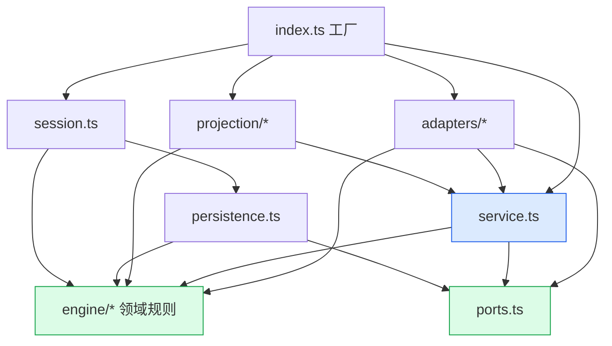
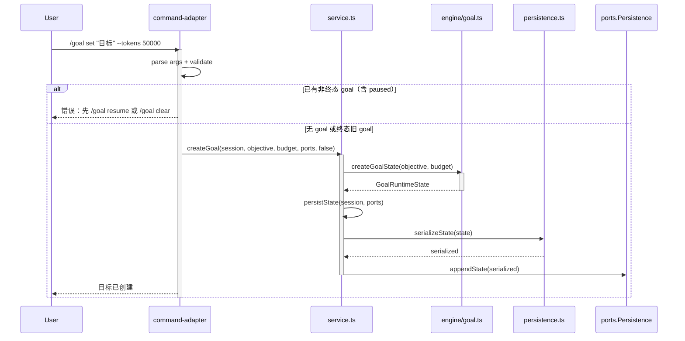
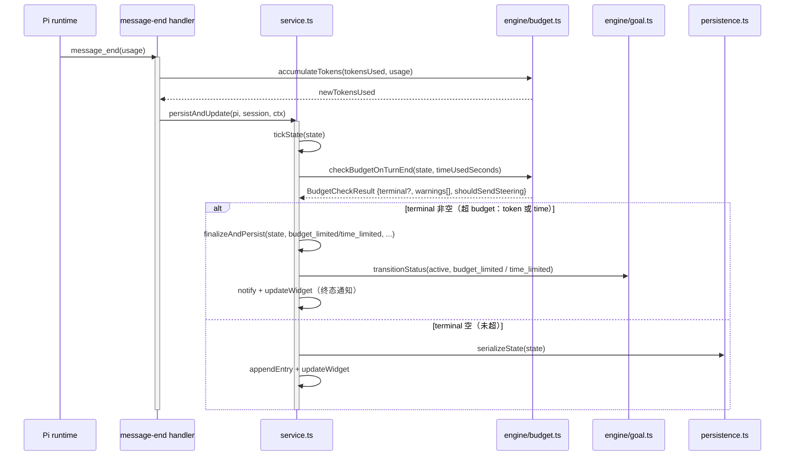
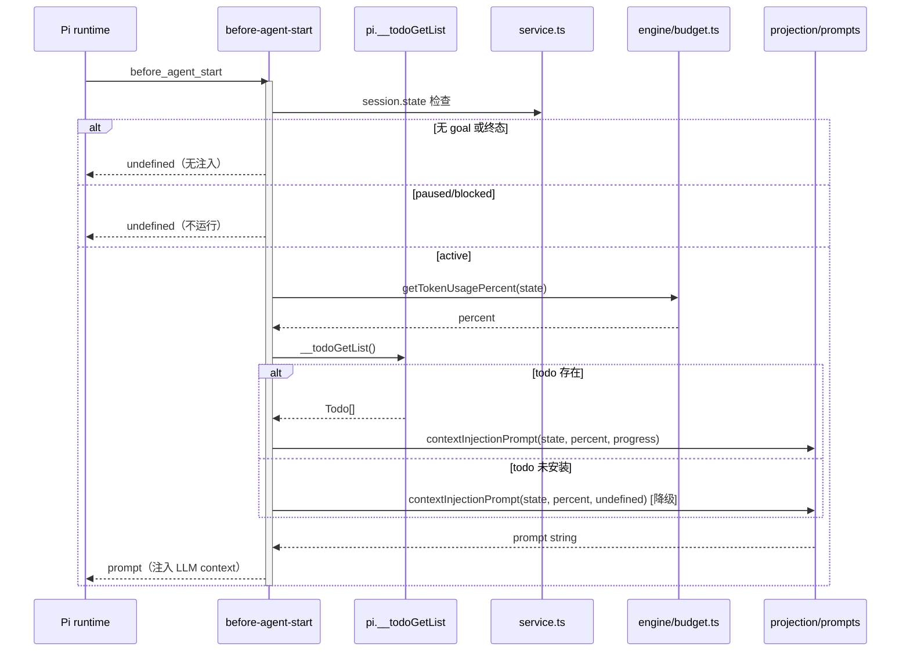
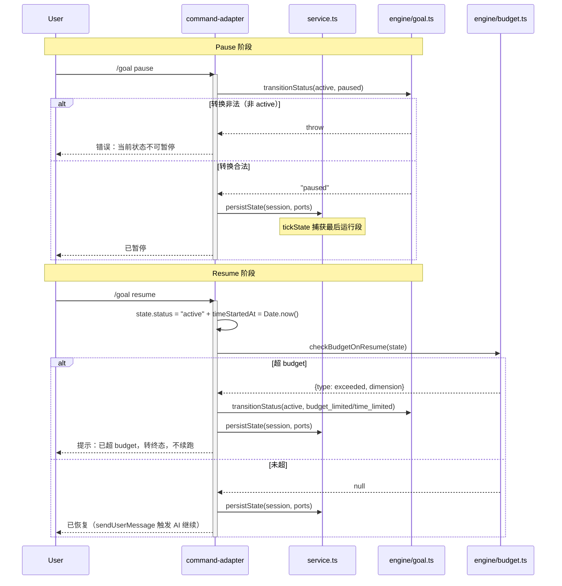

# 代码架构设计 — Goal V2 Refactor

## 1. 工程目录

```
extensions/goal/src/
├── engine/                         # 纯计算层，零 Pi 依赖（变化轴：领域规则）
│   ├── types.ts                    # GoalStatus / VALID_TRANSITIONS / BudgetConfig / GoalRuntimeState / ProgressInput
│   ├── goal.ts                     # transitionStatus / createGoalState / isActiveStatus / isTerminalStatus
│   └── budget.ts                   # tick / accumulateTokens / checkBudgetOnTurnEnd / checkBudgetOnResume / checkProgress
├── ports.ts                        # PersistencePort / UiPort / MessagingPort / SessionPort（变化轴：外部副作用边界）
├── service.ts                      # 业务编排层（变化轴：状态生命周期编排）
│   └── 含 persistState / persistAndUpdate / finalizeAndPersist / tickState / applyEvent / checkResumeBudget
├── adapters/                       # Pi 边界 adapter（变化轴：接入方式）
│   ├── goal-control-adapter.ts      # goal_control tool（complete / report_blocked）
│   ├── command-adapter.ts          # /goal 命令（set / pause / resume / clear / status / update / history）
│   ├── event-adapter.ts            # 薄路由（≤60 LOC，import 6 handler + pi.on 转发）
│   └── event-handlers/             # 6 个独立 handler（变化轴：事件类型）
│       ├── before-agent-start.ts   # context 注入 + plan 建议 + paused/blocked guard
│       ├── agent-end.ts            # budget 预警 + steering + allTasksDone followUp
│       ├── message-end.ts          # token 累加 + persistAndUpdate
│       ├── turn-end.ts             # turn 计数 + persistAndUpdate
│       ├── agent-start.ts          # agent 启动记录
│       └── session-start.ts        # 状态恢复 + 迁移
├── projection/                     # 渲染投影层（变化轴：展示形态）
│   ├── widget.ts                   # TUI widget（status suffix 含 paused/blocked）
│   ├── prompts.ts                  # contextInjectionPrompt / continuationPrompt
│   └── result.ts                   # tool/command 结果格式化
├── persistence.ts                  # serializeState / deserializeState（含旧字段迁移）
├── session.ts                      # GoalSession 闭包 / reconstructGoalState
└── index.ts                        # 工厂函数（注册 tool/command/events/跨扩展API）
```

**目录职责与变化轴**：

| 目录 | 变化轴 | 依赖方向 |
|------|--------|---------|
| `engine/` | 领域规则（状态机、预算算法） | 叶子，无依赖 |
| `ports.ts` | 外部副作用边界（持久化/UI/消息/会话） | 叶子，类型定义（注：ServicePorts 聚合接口当前在 service.ts，重构可考虑归 ports.ts）|
| `service.ts` | 状态生命周期编排 | → engine + ports |
| `adapters/` | Pi 接入方式（tool/command/event） | → service + engine + ports |
| `projection/` | 展示形态（widget/prompt/result） | → service + engine（只读） |
| `persistence.ts` | 序列化 + 迁移 | → engine + ports（GoalHistoryEntry） |
| `session.ts` | 会话状态管理 | → engine + persistence |
| `index.ts` | 组装胶水 | → 全部 |

## 2. 包依赖图



**import 规则**：
- `engine/` 零 Pi 依赖，禁止 import 任何 `@mariozechner/*` 或 `adapters/`
- `adapters/*` 不可互相 import（tool/command/event 各自独立）
- `projection/` 只读消费 service/engine，不写状态
- `index.ts` 是唯一组装点

**循环依赖检测**：图无环。engine/ports 是叶子，箭头单向向下。`persistAndUpdate` 与 `persistState` 都在 service.ts 内（同层），不形成跨层环。

## 3. API 契约

### 模块: engine/goal.ts

| 方法 | 签名 | 返回 | 边界条件 | Issue |
|------|------|------|---------|-------|
| transitionStatus | (current: GoalStatus, next: GoalStatus) → GoalStatus | next 或 throw | next 不在 VALID_TRANSITIONS[current] → throw Error | #2 |
| createGoalState | (objective: string, budget: Partial<BudgetConfig>) → GoalRuntimeState | 新 state | budget 缺省字段用 DEFAULT_BUDGET 填充 | #2 |
| isTerminalStatus | (status: GoalStatus) → boolean | bool | 查 TERMINAL_STATUSES | #2 |
| isActiveStatus | (status: GoalStatus) → boolean | bool | active === status | — |

### 模块: engine/budget.ts

| 方法 | 签名 | 返回 | 边界条件 | Issue |
|------|------|------|---------|-------|
| checkBudgetOnTurnEnd | (state, timeUsedSeconds) → BudgetCheckResult | {terminal, warnings[], shouldSendSteering} | 返回 terminal（超限）+ warning（70/90）+ steering；persistAndUpdate 消费 terminal 决定是否转终态 | #6/#8 |
| checkBudgetOnResume | (state) → {type, dimension} \| null | 超限信息或 null | 超 budget → 拒绝 resume | #5 |
| checkProgress | (state, progress: ProgressInput \| undefined) → ProgressCheck | 是否 allDone | progress=undefined → 跳过 progress 检查 | #7 |
| accumulateTokens | (currentTokensUsed, usage: TokenUsage) → number | 新 token 数 | — | — |
| getTokenUsagePercent | (state) → number | 百分比 0-100 | widget/agent_end 共用 | — |
| getTimeUsagePercent | (state, timeUsedSeconds) → number | 百分比 0-100 | widget 消费 | — |
| getBudgetColor | (percent) → error/warning/muted | 颜色档 | widget 消费 | — |
| tick | (timeStartedAt, timeUsedSeconds, now, isRunning) → TickResult | 累加后时间 | isRunning=false 不累加；**不负责 timeStartedAt 重置**（见 G7）| — |

### 模块: service.ts（业务编排）

| 方法 | 签名 | 返回 | 边界条件 | Issue |
|------|------|------|---------|-------|
| persistState | (session, ports) → void | — | command/tool 路径用；调 tickState + appendState | #5 |
| persistAndUpdate | (pi, session, ctx, checkStale?) → boolean | stale 覆盖? | 事件路径用；tickState + appendEntry + updateWidget + **budget 终态检查** | #5/#6 |
| finalizeAndPersist | (state, status, completedCount, ports) → void | — | 唯一终态序列入口；tick→finalize→persist | #3 |
| tickState | (state) → void | — | 单一 tick 定义点（BL-3 DRY） | — |
| createGoal | (session, objective, budget, ports, isExternal) → boolean | 成功? | 已有 active → 拒绝；**不含 tasks 参数** | #1/#9 |
| applyEvent | (session, effect, ports) → void | — | 处理 EventEffect | — |

### 模块: adapters/goal-control-adapter.ts（goal_control）

| 方法 | 签名 | 返回 | 边界条件 | Issue |
|------|------|------|---------|-------|
| handleComplete | (params, session, ports) → ToolResult | result | todo 检查 + evidence 必填 + finalizeAndPersist | #3 |
| handleReportBlocked | (params, session, ports) → ToolResult | result | active 守卫 + transitionStatus + persistState | #3 |

### 模块: adapters/event-handlers/

| handler | 签名 | 返回 | 边界条件 | Issue |
|---------|------|------|---------|-------|
| handleBeforeAgentStart | (event, session, pi, ctx) → string \| undefined | context 或无注入 | paused/blocked → undefined；todo 缺失时 context 注入照常返回（仅 staleness 提醒跳过） | #7/#10 |
| handleAgentEnd | (event, session, pi, ctx) → void | — | budget 预警 + steering + allTasksDone followUp | #8 |
| handleMessageEnd | (event, session, pi, ctx) → void | — | token 累加 + persistAndUpdate | #5 |
| handleTurnEnd | (event, session, pi, ctx) → void | — | turn 计数 + persistAndUpdate | #5 |
| handleAgentStart | (event, session) → void | — | 记录 agent 启动 | — |
| handleSessionStart | (event, session, pi, ctx) → void | — | reconstructGoalState + 迁移 | #1 |

### 模块: index.ts（跨扩展 API）

| API | 签名 | 返回 | 边界条件 | Issue |
|-----|------|------|---------|-------|
| pi.__goalInit | (objective, budget?, ctx) → boolean | 成功? | **不含 tasks 参数**；ctx 必填 | #9 |
| pi.__todoGetList | () → Todo[] \| undefined | 瞬态快照 | todo 未加载返回 undefined（降级运行）| #7 |
| pi.__planStart | (requirement, ctx) → boolean | 成功? | plan 未安装返回 undefined | #9 |

**注意（NFR 交接）**：budget 终态检查在 `persistAndUpdate`（事件路径），不在 `persistState`（command/tool 路径）。NFR F2 取证确认事件路径走 persistAndUpdate。command/tool 路径用 persistState（无 budget 检查），事件路径用 persistAndUpdate（含 budget 检查），两者都调 tickState（单一 tick 定义点）。

## 4. 功能代码链路（时序图）

### 功能 1: /goal set（命令路径，UC-1 全流程的入口子步骤）



**方法签名表**：

| 类 | 方法 | 签名 | 边界条件 | 关联 |
|----|------|------|---------|------|
| command-adapter | handleSet | (objective, budget) → Result | 非终态旧 goal → 拒绝 | #11 |
| service | createGoal | (session, objective, budget, ports, isExternal) → boolean | 已有 active → false | #1 |
| engine/goal | createGoalState | (objective, budget) → GoalRuntimeState | budget 缺省用 DEFAULT_BUDGET | #2 |

**数据流链**：User → command-adapter.handleSet → service.createGoal → engine/goal.createGoalState → persistence.serializeState → ports.Persistence.appendState

### 功能 2: goal_control.complete（UC-4，tool 路径 + todo API）

```mermaid
sequenceDiagram
    participant A as Agent
    participant TA as goal-control-adapter
    participant TODO as pi.__todoGetList
    participant SVC as service.ts
    participant EG as engine/goal.ts
    participant PP as persistence.ts

    A->>TA: goal_control {action: complete, evidence: "..."}
    activate TA
    Note over TA: 全解耦：complete 不检查 todo（原 __todoGetList 硬闸门已移除）
    TA->>TA: 校验 evidence 必填 + status==active
    alt evidence 缺失
        TA-->>A: 错误：evidence 必填
    else 非 active 状态
        TA-->>A: 错误：goal 不在 active 状态
    else 校验通过
        TA->>SVC: finalizeAndPersist(state, "complete", count, ports)
        activate SVC
            SVC->>EG: transitionStatus(active, complete)
            EG-->>SVC: "complete"
            SVC->>SVC: tickState(state)
            SVC->>PP: serializeState(state)
            PP-->>SVC: serialized
            SVC->>SVC: notify + updateWidget（终态通知）
            deactivate SVC
            TA-->>A: 目标已完成
        end
    end
    deactivate TA
```

**数据流链**：Agent → goal-control-adapter.handleComplete → pi.__todoGetList（duck-typed，可能 undefined）→ service.finalizeAndPersist → engine/goal.transitionStatus → persistence.serializeState + notify

### 功能 3: budget 自动终态（UC-3，事件路径 persistAndUpdate）



**关键（NFR F2 + 代码取证）**：budget 终态检查在 `persistAndUpdate` 内（事件路径），不在 `persistState`（command/tool 路径）。persistAndUpdate 调用 `checkBudgetOnTurnEnd`（engine 纯函数），消费其返回的 `terminal` 决定是否转终态——**不是内联直比较**，而是委托 engine/budget.ts（保持 engine 为唯一 budget 算法持有者）。

**数据流链**：Pi(message_end) → message-end.accumulateTokens → service.persistAndUpdate → engine/budget.checkBudgetOnTurnEnd（返回 terminal）→ 若 terminal 非空：service.finalizeAndPersist → engine/goal.transitionStatus → persistence.serializeState + notify。注：checkBudgetOnTurnEnd 同时服务 agent_end 预警路径（warnings/shouldSendSteering）和 persistAndUpdate 终态路径（terminal）

### 功能 4: before_agent_start context 注入（横切关注点，非单一 UC）



**数据流链**：Pi(before_agent_start) → before-agent-start（status guard）→ engine/budget.getTokenUsagePercent → pi.__todoGetList（可能 undefined 降级）→ projection/prompts.contextInjectionPrompt → Pi（注入）

### 功能 5: /goal pause → resume（UC-2，状态机 + 副作用）



**副作用**（system-architecture §5）：
- pause: tickState 捕获最后运行段（active→paused 前累加时间）
- resume: command-adapter 先转 active + 重置 timeStartedAt → checkBudgetOnResume 重检 → 超限则转终态（budget_limited/time_limited）+ persistState；未超则 persistState + sendUserMessage 触发 AI

**数据流链**：
- Pause: User → command-adapter → engine/goal.transitionStatus → service.persistState
- Resume: User → command-adapter → engine/budget.checkBudgetOnResume → engine/goal.transitionStatus → service.persistAndUpdate

## 5. Deep Module 设计决策

### 模块: engine/budget.ts
- **Interface**: tick / accumulateTokens / checkBudgetOnTurnEnd / checkBudgetOnResume / checkProgress
- **Depth**: 深。5 个函数封装了完整预算算法（时间累加、token 累加、阈值判断、进度判定）。caller 只需传 state + progress，复杂度全藏在内。Deletion test：删掉则 persistAndUpdate 内的 budget 逻辑散布到 6 个 handler。
- **Seam**: engine 层无 seam（纯函数）。caller 通过 import 直接调用。
- **Port 决策**: In-process（纯计算）→ 不要 port。测试直接调函数。

### 模块: service.ts（persistAndUpdate / persistState / finalizeAndPersist）
- **Interface**: persistAndUpdate / persistState / finalizeAndPersist / tickState / createGoal
- **Depth**: 中深。persistAndUpdate 封装了「tick + 落盘 + budget 检查 + 通知」4 步编排，是事件路径的核心 seam。
- **Seam**: 事件路径（persistAndUpdate）vs command/tool 路径（persistState）的区分是**有意的设计 seam**——两者都调 tickState（DRY），但事件路径多了 updateWidget + budget 检查。
- **Port 决策**: service 通过 ServicePorts（PersistencePort/UiPort/MessagingPort/SessionPort）接受外部依赖——**接受依赖，不创建依赖**（可测性原则 1）。

### 模块: adapters/event-handlers/（6 handler）
- **Interface**: 每个 handler 一个 handle 函数
- **Depth**: 中。每个 handler 是「Pi 事件 → service 调用」的薄 adapter，但内含 guard 逻辑（paused/blocked/todo 降级）。
- **Seam**: event-adapter.ts 是路由 seam（import 6 handler + pi.on 转发）。handler 之间独立（不互相 import）。
- **Port 决策**: handler 接受 (pi, session, ctx) 作为参数——**接受依赖**。测试时注入 mock pi/session。

### 模块: index.ts（跨扩展 API pi.__goalInit）
- **Interface**: pi.__goalInit(objective, budget?, ctx) → boolean
- **Depth**: 中。封装 createGoal（isExternalInit=true）。caller（coding-workflow/plan）通过 duck-typed 调用。
- **Seam**: duck-typed seam（非 import type），inline alias 存在 drift 风险（NFR M2）。缓解：goal 侧容忍 + 迁移调用方用 import type。
- **Port 决策**: True external（第三方扩展不可控）→ 用 duck-typed 接口（非正式 Port）。

## 6. 测试矩阵（Test Matrix）

> bug 主要来自设计期未枚举的边界/异常/状态组合。本节把它们全部收口，作为 ⑥Wave 的测试输入和实现期 TDD 的种子。
>
> **两个来源（缺一不可）：**
> - **来源 A（功能用例）** — 从 §4 时序图每个 alt/else 推导（正常/边界/异常/状态）
> - **来源 B（NFR 用例）** — 从④NFR「缓解项回灌登记表」中 `验收方式=代码测试` 的每条风险推导（降级/迁移/契约收紧——这些不是时序图异常分支，但正是事故重灾区）

### 来源 A：功能用例（按 UC 归类）

#### UC-1: 复杂任务规划执行（关联功能 1 /goal set + 功能 4 context 注入）

| 用例 ID | 类型 | 场景 | 输入 | 预期 | 关联 AC |
|---------|------|------|------|------|---------|
| T1.1 | 正常 | 无 goal 时创建 | /goal set "重构X" --tokens 50000，无现存 goal | 创建 active goal，status=active | AC-1.1 |
| T1.2 | 边界 | 终态旧 goal 存在时创建 | 已有 cancelled 旧 goal，再 /goal set | 允许创建（终态可覆盖） | AC-6.1 |
| T1.3 | 异常 | 非终态 goal 存在时创建（§4 功能1 alt） | 已有 active/paused/blocked goal，再 /goal set | 拒绝，提示「先 resume 或 clear」 | AC-6.2 |
| T1.4 | 边界 | budget 缺省字段 | /goal set 不传 --tokens | 用 DEFAULT_BUDGET 填充 | AC-1.1 |
| T1.5 | 异常 | context 注入时 todo 未安装（§4 功能4 else） | active goal，pi.__todoGetList=undefined | Goal 降级运行：context 注入照常返回（prompt 含静态 todo 指令，不随 todo 可用性变化） | AC-4.4 |

#### UC-2: 用户叫停与恢复（关联功能 5 pause/resume）

| 用例 ID | 类型 | 场景 | 输入 | 预期 | 关联 AC |
|---------|------|------|------|------|---------|
| T2.1 | 正常 | active→pause | active goal，/goal pause | status=paused，不续跑 | AC-2.1 |
| T2.2 | 异常 | 非 active 转 pause（§4 功能5 alt） | paused goal，/goal pause | throw，提示「当前状态不可暂停」 | AC-5.3 |
| T2.3 | 正常 | paused→resume 未超预算 | paused goal，未超 budget，/goal resume | status=active，timeStartedAt 重置 | AC-2.2 |
| T2.4 | 异常 | resume 时已超 budget（§4 功能5 alt） | paused goal，tokensUsed≥tokenBudget，/goal resume | checkBudgetOnResume 超限 → 转 budget_limited 终态 + 提示「已超预算」 | AC-2.4 |
| T2.5 | 状态 | paused 态不累加 token | paused goal，message_end 触发 | tokensUsed 不变 | AC-2.1 |
| T2.6 | 状态 | 崩溃重启后 paused 保持 | paused goal，进程重启→session_start | reconstructGoalState 恢复 paused（不自动 active） | AC-2.3 |

#### UC-3: 资源耗尽自动终止（关联功能 3 budget 自动终态）

| 用例 ID | 类型 | 场景 | 输入 | 预期 | 关联 AC |
|---------|------|------|------|------|---------|
| T3.1 | 正常 | token 耗尽转终态（§4 功能3 alt） | active，accumulateTokens 后 tokensUsed≥tokenBudget | persistAndUpdate 内转 budget_limited + notify | AC-3.1 |
| T3.2 | 正常 | time 耗尽转终态（§4 功能3 alt） | active，timeUsed≥timeBudget | 转 time_limited + notify | AC-3.1/3.2 |
| T3.3 | 边界 | 刚好等于预算 | tokensUsed==tokenBudget | 转 budget_limited（≥判定） | AC-3.1 |
| T3.4 | 正常 | 未超预算正常 persist（§4 功能3 else） | active，未超 | serializeState + updateWidget，不转终态 | AC-3.1 |
| T3.5 | 状态 | 终态不可逆 | budget_limited goal，/goal resume | 拒绝（终态不在 VALID_TRANSITIONS） | AC-3.1 |

#### UC-4: Agent 自主完成并自证（关联功能 2 goal_control.complete）

| 用例 ID | 类型 | 场景 | 输入 | 预期 | 关联 AC |
|---------|------|------|------|------|---------|
| T4.1 | 正常 | complete（全解耦：无 todo 前置检查） | active，evidence 有值（不检查 todo） | 转 complete + notify | AC-4.1 |
| T4.2 | 异常 | complete 缺 evidence | evidence 为空 | 拒绝，提示「需提交完成证据」 | AC-4.2 |
| T4.3 | ~~异常~~ | ~~todo 为空数组~~ | ~~__todoGetList 返回 []~~ | **已移除（全解耦）**：complete 不检查 todo | ~~AC-4.2~~ |
| T4.4 | ~~异常~~ | ~~有未完成 todo~~ | ~~部分 todo in_progress~~ | **已移除（全解耦）**：complete 不检查 todo | ~~AC-4.2~~ |
| T4.5 | ~~异常~~ | ~~todo 未安装~~ | ~~__todoGetList=undefined~~ | **已移除（全解耦）**：goal 不读 todo | ~~AC-4.4~~ |
| T4.6 | ~~边界~~ | ~~验证任务未完成~~ | ~~isVerification todo 未完成~~ | **已移除（全解耦）**：验证任务靠 prompt 软建议 | ~~AC-4.2/4.3~~ |
| T4.7 | 边界 | plan 步骤未全执行 | 关联了 plan 但 plan 未走完，evidence 有值 | 允许完成（plan 对照是软提醒，全解耦后无硬检查） | AC-4.5 |

#### UC-5: Agent 报告阻塞（关联 goal_control.report_blocked）

| 用例 ID | 类型 | 场景 | 输入 | 预期 | 关联 AC |
|---------|------|------|------|------|---------|
| T5.1 | 正常 | active→blocked | active，goal_control report_blocked | status=blocked，不续跑 | AC-5.1 |
| T5.2 | 异常 | 非 active 报告阻塞 | paused goal，report_blocked | 拒绝（语义不成立） | AC-5.3 |
| T5.3 | 状态 | blocked→resume | blocked，/goal resume | status=active | AC-5.2 |
| T5.4 | 状态 | 崩溃重启后 blocked 保持 | blocked goal，进程重启 | reconstructGoalState 恢复 blocked | AC-5.4 |

#### UC-6: 用户主动清除（关联 /goal clear）

| 用例 ID | 类型 | 场景 | 输入 | 预期 | 关联 AC |
|---------|------|------|------|------|---------|
| T6.1 | 正常 | 清除非终态 goal | active goal，/goal clear | status=cancelled，不续跑 | AC-6.1 |
| T6.2 | 状态 | 已终态再清除（幂等） | complete goal，/goal clear | 保持终态（幂等） | AC-6.1 |

### 来源 B：NFR 风险→用例映射表 — [MANDATORY]

> ④NFR「缓解项回灌登记表」中每条 `验收方式=代码测试` 的风险，必须在此生成 ≥1 条测试用例。编号段用 T+UC号+.10+（如 T1.10、T3.10）与来源 A 区分。

| ④缓解项 | 来源 Issue# | 维度 | 归属 UC | 验证断言 | test-matrix 用例 ID |
|--------|------------|------|--------|---------|-------------------|
| deserializeState 容忍旧字段（不 throw） | #1,#6 | 数据 | UC-3 | 反序列化含 tasks/stallCount/maxTurns/maxStallTurns 的旧 entry 不 throw，state 正常重建 | T3.6（=NFR-AC-1） |
| contextInjectionPrompt 不注入 goal_manager 指令 | #1,#10 | 兼容性 | UC-1 | prompt 不含 create_tasks 等旧 action（grep 零命中） | T1.6（=NFR-AC-2） |
| goal_control.complete evidence 必填 | #3 | 兼容性 | UC-4 | 缺 evidence → 拒绝完成 | T4.2（与来源 A T4.2 合并） |
| budget 检查在 persistAndUpdate 内 | #5 | 数据 | UC-3 | 耗尽由 persistAndUpdate 检查转终态，无第二检查点 | T3.1（与来源 A 合并，=NFR-AC-4） |
| persist 转终态同步 notify + updateWidget | #5,#8 | 可观测 | UC-3 | 转终态时触发 notify + updateWidget | T3.7（=NFR-AC-5） |
| ~~__todoGetList 缺失降级（三路径）~~ | ~~#7,#10~~ | ~~稳定性~~ | ~~UC-4~~ | **全解耦后已移除**：goal 不读 todo，无降级路径（context 注入/checkProgress/complete 前置均不再依赖 todo） | ~~T1.5+T4.5~~ |
| __planStart 缺失降级 | #9 | 稳定性 | UC-1 | undefined → context 不含 plan 段落，goal 独立运行 | T1.7（=NFR-AC-7） |
| __goalInit 忽略 tasks 参数 | #9 | 兼容性 | UC-1 | 收到 tasks 时忽略（不 throw，不创建 task） | T1.8（=NFR-AC-8） |
| 迁移 coding-workflow/plan 调用方 | #9 | 兼容性 | UC-1 | 迁移后不传 tasks（grep 验证 tool-handlers.ts/compact.ts） | T1.9（=NFR-AC-9） |
| /goal set 非终态拒绝 | #11 | 兼容性 | UC-6 | 非终态时 /goal set 拒绝，提示含「resume 或 clear」 | T1.3（与来源 A 合并，=NFR-AC-10） |
| 70%/90% 预警 + steering + followUp | #8 | 可观测 | UC-3 | 70%/90% 发预警通知 + 90% steering + allTasksDone followUp | T3.8（=NFR-AC-11） |

> **④标 `验收方式=骨架约束` 的缓解项**（VALID_TRANSITIONS 枚举、闭包读取模式、staleness 提示存在性、maxTurns 类型移除）由⑤骨架 tsc gate 验证，不进本表。**④标 `运维项` 的**不进代码层。

### 覆盖完整性自检

- [x] 每 UC 的正常/边界/异常/状态 4 类齐全（来源 A）— UC-1~UC-6 均覆盖
- [x] 时序图每个 alt/else 都映射到一条异常用例（§4 ↔ §6 双向可查）— 功能1 alt→T1.3、功能2 alt→T4.3/T4.4/T4.5、功能3 alt→T3.1、功能4 alt→T1.5、功能5 alt→T2.2/T2.4
- [x] 状态机每条转换有对应状态用例 — active→paused(T2.1)、paused→active(T2.3)、active→blocked(T5.1)、blocked→active(T5.3)、active→complete(T4.1)、active→budget_limited(T3.1)、active→cancelled(T6.1)
- [x] NFR④ 标注并发风险的 UC 有并发用例 — 本扩展单线程无竞态（NFR #4 已论证），无并发用例需求
- [x] ④每条 `验收方式=代码测试` 的缓解项在本节有 ≥1 条对应用例（来源 B 双向映射）— 11 条 NFR-AC 全映射
- [x] 来源 B 用例 ID 与来源 A 不冲突（重叠项已标注「合并」，独立项用 .6+/.7+/.8+ 编号段）

## 7. 下游衔接

### 喂给 Step 6（执行计划）的 Wave 编排推导

> **注**：本节为喂给 execution-plan 的建议。execution-plan 已优化为 6 Wave 划分（拆出 Wave 6 并修正 #5 的依赖位置，见 execution-plan D3）。以 execution-plan 为准。

| 时序图 | 对应 Wave（execution-plan）| 依赖的其他时序图 |
|--------|--------------------------|-----------------|
| 功能 1: /goal set | Wave 2（#11）| #2 VALID_TRANSITIONS 先行 |
| 功能 2: goal_control.complete | Wave 2（#3）| #1 删 goal_manager 先行 |
| 功能 3: budget 自动终态 | Wave 5（#5）| #4 拆分 + #7 todo API 先行 |
| 功能 4: context 注入 | Wave 5-6（#7/#8/#10）| #4 拆分 + #7 todo API |
| 功能 5: pause/resume | Wave 2（#11/#12）| #2 paused 状态先行 |

**Wave 推导依据**（从时序图 + issues.md blocked_by，已对齐 execution-plan 6 Wave）：
- Wave 1: #1（删 goal_manager）+ #2（paused+VALID_TRANSITIONS）— 串行（同改 types.ts）
- Wave 2: #3（goal_control）+ #11（/goal set 拒绝）+ #12（widget）— 并行，依赖 #1/#2
- Wave 3: #4（拆 event-adapter）— 依赖 #2/#3
- Wave 4: #6（删字段+终态+控制流）+ #7（todo API）— 串行（同改 budget.ts），依赖 #4
- Wave 5: #8（agent_end）+ #5（budget 检查点）— 串行（同改 agent-end.ts），依赖 #4/#6/#7；#5 不与 #7 同 Wave（#5 blocked_by #7）
- Wave 6: #10（completion audit）+ #9（plan 联动）— 串行（同改 prompts.ts），依赖 #7；与 Wave 5 并行。**Watch**：prompts.ts 重构后 ~370 LOC，#9/#10 prompt 膨胀有破 400 风险，需监控

### 架构决策（已定，G4 闭合）
- **budget 终态检查在 persistAndUpdate（事件路径）**，不在 persistState（command/tool 路径）。NFR F2 取证确认事件路径走 persistAndUpdate。
- persistState 与 persistAndUpdate 是否在 #4 拆分后统一为单函数 → 代码实现层决策（两者都调 tickState，统一与否不影响 budget 检查落点）。执行计划允许实现者选择合并或保留双函数。

## 8. 现有代码映射（refactor 场景）

> 新设计的工程目录如何与现有代码共存/迁移。每项处置对应 ⑥的 Wave。代码取证锚点见 issues.md 各 issue「文件影响」+ execution-plan Wave 详情。

### 模块映射

| 新目录模块 | 现有代码文件/函数 | 处置 | 行为等价测试要点 | 归属 Wave |
|-----------|------------------|------|----------------|----------|
| engine/types.ts | 现有 types.ts（含 tasks/stallCount/maxTurns/maxStallTurns） | split | 删旧字段后编译通过；旧 entry 反序列化不 throw（T3.6） | Wave 1/4 |
| engine/goal.ts | 现有 goal 状态转换逻辑 | keep+extend | 加 paused（VALID_TRANSITIONS）；现有转换不回归 | Wave 1 |
| engine/budget.ts | 现有 budget.ts（含 maxTurnsReached/isTaskDoneFn） | split | 删 maxTurnsReached + task 引用；checkProgress 改 ProgressInput | Wave 1/4 |
| service.ts | 现有 service.ts（goal_manager 10 action） | split | 删 10 action；persistAndUpdate 加 budget 检查；createGoal 去 tasks | Wave 1/2/5 |
| adapters/goal-control-adapter.ts | 现有 tool-adapter.ts（goal_manager） | **delete+create** | tool-adapter.ts 删除（10 action 废弃）；新建 goal-control-adapter.ts（2 action） | Wave 2 |
| adapters/command-adapter.ts | 现有 command-adapter.ts | keep+modify | 删 abort action；handleSet 加非终态拒绝（T1.3） | Wave 2 |
| adapters/event-adapter.ts | 现有 event-adapter.ts（737 行 6 handler 堆一起） | **split** | 拆为薄路由（≤60 LOC）+ 6 独立 handler 文件；现有事件覆盖不回归 | Wave 3 |
| adapters/event-handlers/*.ts | （从 event-adapter.ts 内联函数拆出） | create | 6 handler 独立；persistAndUpdate 调用链可达 | Wave 3 |
| projection/widget.ts | 现有 widget.ts（GoalTask import + renderTaskRow + stallCount 显示） | modify | 删 GoalTask/stallCount 显示；加 paused/blocked suffix | Wave 2 |
| projection/prompts.ts | 现有 prompts.ts（goal_manager 指令 + stallCount 显示） | modify | 删 goal_manager 指令（T1.6）；加 completion audit + plan 建议 | Wave 6 |
| projection/result.ts | 现有 result.ts（GoalTask 引用） | modify | 删 GoalTask 引用 | Wave 1 |
| persistence.ts | 现有 persistence.ts（含 stallCount/maxTurns 反序列化） | modify | deserializeState 忽略旧字段不 throw（T3.6） | Wave 1 |
| index.ts | 现有 index.ts（__goalInit 含 tasks/maxTurns） | modify | __goalInit 忽略 tasks（T1.8）；删 GoalInitBudget.maxTurns | Wave 4/6 |

**关键迁移风险**（已在 NFR④ 登记）：
- **inline alias drift**（#9）：coding-workflow/plan 用 inline alias 引用 __goalInit，签名变更编译期不报错 → 静默 drift。goal 侧容忍（忽略 tasks 不 throw）+ 迁移调用方（T1.9）。
- **字段定义与使用点分离**（D1）：stallCount/maxTurns 字段定义在 Wave 1，使用点在 Wave 4 删除 → 中间 Wave typecheck 红区。execution-plan D1 已切分：Wave 1 #2 只加状态不删字段，Wave 4 #6 一次性删字段+使用点+控制流。
