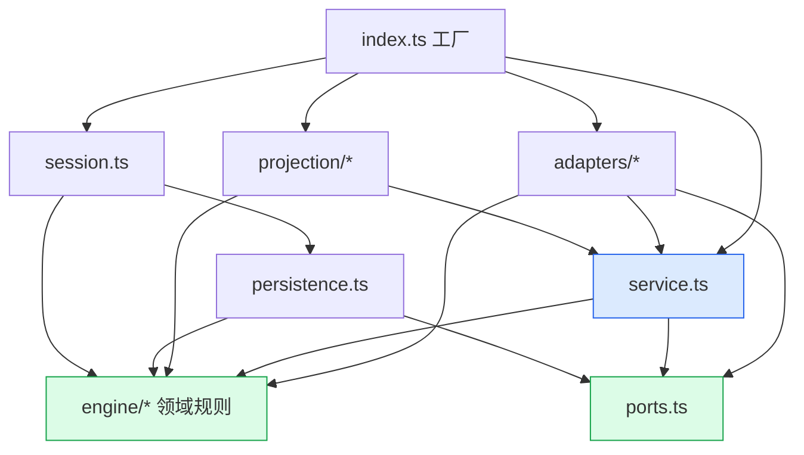
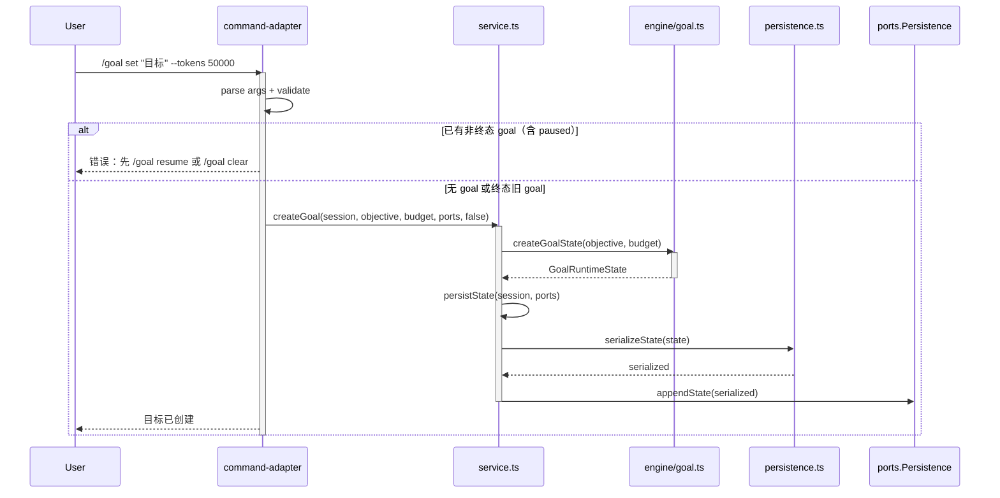
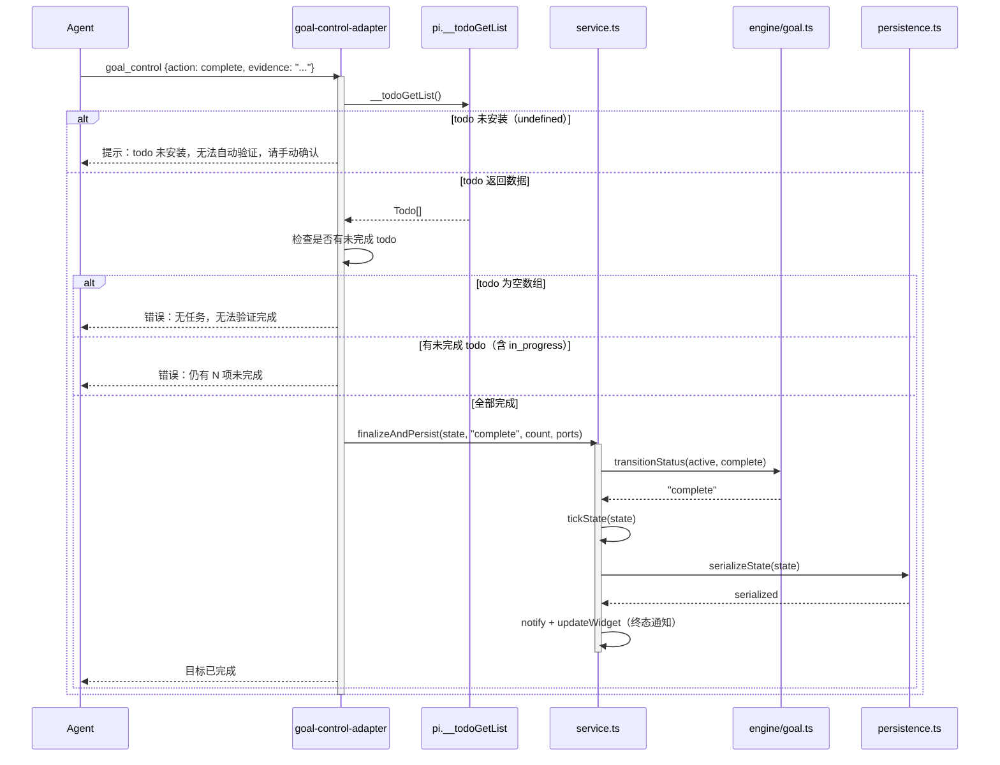
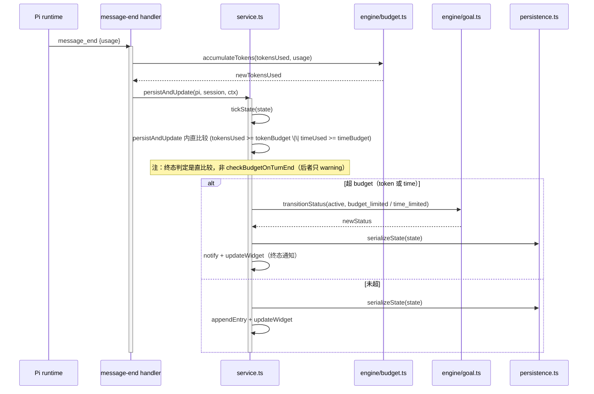
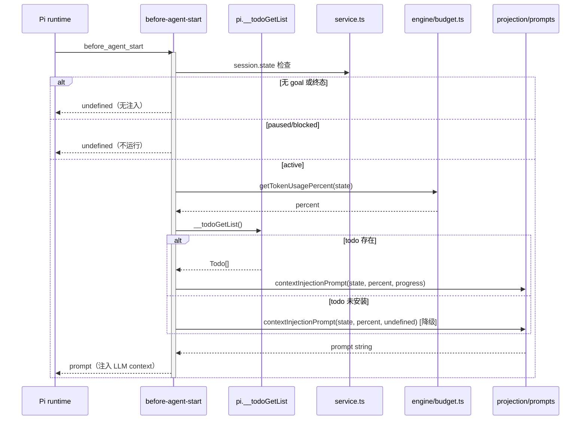
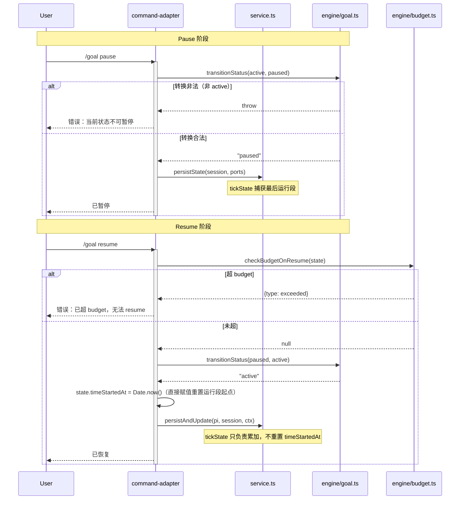

# 代码架构设计 — Goal V2 Refactor

## 1. 工程目录

```
extensions/goal/src/
├── engine/                         # 纯计算层，零 Pi 依赖（变化轴：领域规则）
│   ├── types.ts                    # GoalStatus / VALID_TRANSITIONS / BudgetConfig / GoalRuntimeState / ProgressInput
│   ├── goal.ts                     # transitionStatus / createGoalState / isActiveStatus / isTerminalStatus
│   └── budget.ts                   # tick / accumulateTokens / checkBudgetOnTurnEnd / checkBudgetOnResume / checkProgress
├── ports.ts                        # PersistencePort / UiPort / MessagingPort / SessionPort（变化轴：外部副作用边界）
├── service.ts                      # 业务编排层（变化轴：状态生命周期编排）
│   └── 含 persistState / persistAndUpdate / finalizeAndPersist / tickState / applyEvent / checkResumeBudget
├── adapters/                       # Pi 边界 adapter（变化轴：接入方式）
│   ├── goal-control-adapter.ts      # goal_control tool（complete / report_blocked）
│   ├── command-adapter.ts          # /goal 命令（set / pause / resume / clear / status / update / history）
│   ├── event-adapter.ts            # 薄路由（≤60 LOC，import 6 handler + pi.on 转发）
│   └── event-handlers/             # 6 个独立 handler（变化轴：事件类型）
│       ├── before-agent-start.ts   # context 注入 + plan 建议 + paused/blocked guard
│       ├── agent-end.ts            # budget 预警 + steering + allTasksDone followUp
│       ├── message-end.ts          # token 累加 + persistAndUpdate
│       ├── turn-end.ts             # turn 计数 + persistAndUpdate
│       ├── agent-start.ts          # agent 启动记录
│       └── session-start.ts        # 状态恢复 + 迁移
├── projection/                     # 渲染投影层（变化轴：展示形态）
│   ├── widget.ts                   # TUI widget（status suffix 含 paused/blocked）
│   ├── prompts.ts                  # contextInjectionPrompt / continuationPrompt
│   └── result.ts                   # tool/command 结果格式化
├── persistence.ts                  # serializeState / deserializeState（含旧字段迁移）
├── session.ts                      # GoalSession 闭包 / reconstructGoalState
└── index.ts                        # 工厂函数（注册 tool/command/events/跨扩展API）
```

**目录职责与变化轴**：

| 目录 | 变化轴 | 依赖方向 |
|------|--------|---------|
| `engine/` | 领域规则（状态机、预算算法） | 叶子，无依赖 |
| `ports.ts` | 外部副作用边界（持久化/UI/消息/会话） | 叶子，类型定义（注：ServicePorts 聚合接口当前在 service.ts，重构可考虑归 ports.ts）|
| `service.ts` | 状态生命周期编排 | → engine + ports |
| `adapters/` | Pi 接入方式（tool/command/event） | → service + engine + ports |
| `projection/` | 展示形态（widget/prompt/result） | → service + engine（只读） |
| `persistence.ts` | 序列化 + 迁移 | → engine + ports（GoalHistoryEntry） |
| `session.ts` | 会话状态管理 | → engine + persistence |
| `index.ts` | 组装胶水 | → 全部 |

## 2. 包依赖图



**import 规则**：
- `engine/` 零 Pi 依赖，禁止 import 任何 `@mariozechner/*` 或 `adapters/`
- `adapters/*` 不可互相 import（tool/command/event 各自独立）
- `projection/` 只读消费 service/engine，不写状态
- `index.ts` 是唯一组装点

**循环依赖检测**：图无环。engine/ports 是叶子，箭头单向向下。`persistAndUpdate` 与 `persistState` 都在 service.ts 内（同层），不形成跨层环。

## 3. API 契约

### 模块: engine/goal.ts

| 方法 | 签名 | 返回 | 边界条件 | Issue |
|------|------|------|---------|-------|
| transitionStatus | (current: GoalStatus, next: GoalStatus) → GoalStatus | next 或 throw | next 不在 VALID_TRANSITIONS[current] → throw Error | #2 |
| createGoalState | (objective: string, budget: Partial<BudgetConfig>) → GoalRuntimeState | 新 state | budget 缺省字段用 DEFAULT_BUDGET 填充 | #2 |
| isTerminalStatus | (status: GoalStatus) → boolean | bool | 查 TERMINAL_STATUSES | #2 |
| isActiveStatus | (status: GoalStatus) → boolean | bool | active === status | — |

### 模块: engine/budget.ts

| 方法 | 签名 | 返回 | 边界条件 | Issue |
|------|------|------|---------|-------|
| checkBudgetOnTurnEnd | (state, timeUsedSeconds) → BudgetCheckResult | {terminal?, warning?} | 只返回 warning（70/90），不返回 terminal | #6/#8 |
| checkBudgetOnResume | (state) → {type, dimension} \| null | 超限信息或 null | 超 budget → 拒绝 resume | #5 |
| checkProgress | (state, progress: ProgressInput \| undefined) → ProgressCheck | 是否 allDone | progress=undefined → 跳过 progress 检查 | #7 |
| accumulateTokens | (currentTokensUsed, usage: TokenUsage) → number | 新 token 数 | — | — |
| getTokenUsagePercent | (state) → number | 百分比 0-100 | widget/agent_end 共用 | — |
| getTimeUsagePercent | (state, timeUsedSeconds) → number | 百分比 0-100 | widget 消费 | — |
| getBudgetColor | (percent) → error/warning/muted | 颜色档 | widget 消费 | — |
| tick | (timeStartedAt, timeUsedSeconds, now, isRunning) → TickResult | 累加后时间 | isRunning=false 不累加；**不负责 timeStartedAt 重置**（见 G7）| — |

### 模块: service.ts（业务编排）

| 方法 | 签名 | 返回 | 边界条件 | Issue |
|------|------|------|---------|-------|
| persistState | (session, ports) → void | — | command/tool 路径用；调 tickState + appendState | #5 |
| persistAndUpdate | (pi, session, ctx, checkStale?) → boolean | stale 覆盖? | 事件路径用；tickState + appendEntry + updateWidget + **budget 终态检查** | #5/#6 |
| finalizeAndPersist | (state, status, completedCount, ports) → void | — | 唯一终态序列入口；tick→finalize→persist | #3 |
| tickState | (state) → void | — | 单一 tick 定义点（BL-3 DRY） | — |
| createGoal | (session, objective, budget, ports, isExternal) → boolean | 成功? | 已有 active → 拒绝；**不含 tasks 参数** | #1/#9 |
| applyEvent | (session, effect, ports) → void | — | 处理 EventEffect | — |

### 模块: adapters/goal-control-adapter.ts（goal_control）

| 方法 | 签名 | 返回 | 边界条件 | Issue |
|------|------|------|---------|-------|
| handleComplete | (params, session, ports) → ToolResult | result | todo 检查 + evidence 必填 + finalizeAndPersist | #3 |
| handleReportBlocked | (params, session, ports) → ToolResult | result | active 守卫 + transitionStatus + persistState | #3 |

### 模块: adapters/event-handlers/

| handler | 签名 | 返回 | 边界条件 | Issue |
|---------|------|------|---------|-------|
| handleBeforeAgentStart | (event, session, pi, ctx) → string \| undefined | context 或无注入 | paused/blocked → undefined；todo 缺失 → 降级 prompt | #7/#10 |
| handleAgentEnd | (event, session, pi, ctx) → void | — | budget 预警 + steering + allTasksDone followUp | #8 |
| handleMessageEnd | (event, session, pi, ctx) → void | — | token 累加 + persistAndUpdate | #5 |
| handleTurnEnd | (event, session, pi, ctx) → void | — | turn 计数 + persistAndUpdate | #5 |
| handleAgentStart | (event, session) → void | — | 记录 agent 启动 | — |
| handleSessionStart | (event, session, pi, ctx) → void | — | reconstructGoalState + 迁移 | #1 |

### 模块: index.ts（跨扩展 API）

| API | 签名 | 返回 | 边界条件 | Issue |
|-----|------|------|---------|-------|
| pi.__goalInit | (objective, budget?, ctx) → boolean | 成功? | **不含 tasks 参数**；ctx 必填 | #9 |
| pi.__todoGetList | () → Todo[] \| undefined | 瞬态快照 | todo 未加载返回 undefined（降级运行）| #7 |
| pi.__planStart | (requirement, ctx) → boolean | 成功? | plan 未安装返回 undefined | #9 |

**注意（NFR 交接）**：budget 终态检查在 `persistAndUpdate`（事件路径），不在 `persistState`（command/tool 路径）。NFR F2 取证确认事件路径走 persistAndUpdate。command/tool 路径用 persistState（无 budget 检查），事件路径用 persistAndUpdate（含 budget 检查），两者都调 tickState（单一 tick 定义点）。

## 4. 功能代码链路（时序图）

### 功能 1: /goal set（命令路径，UC-1 全流程的入口子步骤）



**方法签名表**：

| 类 | 方法 | 签名 | 边界条件 | 关联 |
|----|------|------|---------|------|
| command-adapter | handleSet | (objective, budget) → Result | 非终态旧 goal → 拒绝 | #11 |
| service | createGoal | (session, objective, budget, ports, isExternal) → boolean | 已有 active → false | #1 |
| engine/goal | createGoalState | (objective, budget) → GoalRuntimeState | budget 缺省用 DEFAULT_BUDGET | #2 |

**数据流链**：User → command-adapter.handleSet → service.createGoal → engine/goal.createGoalState → persistence.serializeState → ports.Persistence.appendState

### 功能 2: goal_control.complete（UC-4，tool 路径 + todo API）



**数据流链**：Agent → goal-control-adapter.handleComplete → pi.__todoGetList（duck-typed，可能 undefined）→ service.finalizeAndPersist → engine/goal.transitionStatus → persistence.serializeState + notify

### 功能 3: budget 自动终态（UC-3，事件路径 persistAndUpdate）



**关键（NFR F2 修正）**：budget 终态检查在 `persistAndUpdate` 内（事件路径），不在 `persistState`（command/tool 路径）。这是 NFR 阶段代码取证确认的核心架构事实。

**数据流链**：Pi(message_end) → message-end.accumulateTokens → service.persistAndUpdate（直比较 tokensUsed/timeUsed）→ engine/goal.transitionStatus（若超限）→ persistence.serializeState + notify。注：checkBudgetOnTurnEnd 只在 agent_end 预警路径，不在终态路径

### 功能 4: before_agent_start context 注入（横切关注点，非单一 UC）



**数据流链**：Pi(before_agent_start) → before-agent-start（status guard）→ engine/budget.getTokenUsagePercent → pi.__todoGetList（可能 undefined 降级）→ projection/prompts.contextInjectionPrompt → Pi（注入）

### 功能 5: /goal pause → resume（UC-2，状态机 + 副作用）



**副作用**（system-architecture §5）：
- pause: tickState 捕获最后运行段（active→paused 前累加时间）
- resume: command-adapter 直接赋值 timeStartedAt = Date.now()（开启新运行段）+ checkBudgetOnResume 拒绝超限；tickState 不负责重置

**数据流链**：
- Pause: User → command-adapter → engine/goal.transitionStatus → service.persistState
- Resume: User → command-adapter → engine/budget.checkBudgetOnResume → engine/goal.transitionStatus → service.persistAndUpdate

## 5. Deep Module 设计决策

### 模块: engine/budget.ts
- **Interface**: tick / accumulateTokens / checkBudgetOnTurnEnd / checkBudgetOnResume / checkProgress
- **Depth**: 深。5 个函数封装了完整预算算法（时间累加、token 累加、阈值判断、进度判定）。caller 只需传 state + progress，复杂度全藏在内。Deletion test：删掉则 persistAndUpdate 内的 budget 逻辑散布到 6 个 handler。
- **Seam**: engine 层无 seam（纯函数）。caller 通过 import 直接调用。
- **Port 决策**: In-process（纯计算）→ 不要 port。测试直接调函数。

### 模块: service.ts（persistAndUpdate / persistState / finalizeAndPersist）
- **Interface**: persistAndUpdate / persistState / finalizeAndPersist / tickState / createGoal
- **Depth**: 中深。persistAndUpdate 封装了「tick + 落盘 + budget 检查 + 通知」4 步编排，是事件路径的核心 seam。
- **Seam**: 事件路径（persistAndUpdate）vs command/tool 路径（persistState）的区分是**有意的设计 seam**——两者都调 tickState（DRY），但事件路径多了 updateWidget + budget 检查。
- **Port 决策**: service 通过 ServicePorts（PersistencePort/UiPort/MessagingPort/SessionPort）接受外部依赖——**接受依赖，不创建依赖**（可测性原则 1）。

### 模块: adapters/event-handlers/（6 handler）
- **Interface**: 每个 handler 一个 handle 函数
- **Depth**: 中。每个 handler 是「Pi 事件 → service 调用」的薄 adapter，但内含 guard 逻辑（paused/blocked/todo 降级）。
- **Seam**: event-adapter.ts 是路由 seam（import 6 handler + pi.on 转发）。handler 之间独立（不互相 import）。
- **Port 决策**: handler 接受 (pi, session, ctx) 作为参数——**接受依赖**。测试时注入 mock pi/session。

### 模块: index.ts（跨扩展 API pi.__goalInit）
- **Interface**: pi.__goalInit(objective, budget?, ctx) → boolean
- **Depth**: 中。封装 createGoal（isExternalInit=true）。caller（coding-workflow/plan）通过 duck-typed 调用。
- **Seam**: duck-typed seam（非 import type），inline alias 存在 drift 风险（NFR M2）。缓解：goal 侧容忍 + 迁移调用方用 import type。
- **Port 决策**: True external（第三方扩展不可控）→ 用 duck-typed 接口（非正式 Port）。

## 6. 下游衔接

### 喂给 Step 6（执行计划）的 Wave 编排推导

> **注**：本节为喂给 execution-plan 的建议。execution-plan 已优化为 6 Wave 划分（拆出 Wave 6 并修正 #5 的依赖位置，见 execution-plan D3）。以 execution-plan 为准。

| 时序图 | 对应 Wave（execution-plan）| 依赖的其他时序图 |
|--------|--------------------------|-----------------|
| 功能 1: /goal set | Wave 2（#11）| #2 VALID_TRANSITIONS 先行 |
| 功能 2: goal_control.complete | Wave 2（#3）| #1 删 goal_manager 先行 |
| 功能 3: budget 自动终态 | Wave 5（#5）| #4 拆分 + #7 todo API 先行 |
| 功能 4: context 注入 | Wave 5-6（#7/#8/#10）| #4 拆分 + #7 todo API |
| 功能 5: pause/resume | Wave 2（#11/#12）| #2 paused 状态先行 |

**Wave 推导依据**（从时序图 + issues.md blocked_by，已对齐 execution-plan 6 Wave）：
- Wave 1: #1（删 goal_manager）+ #2（paused+VALID_TRANSITIONS）— 串行（同改 types.ts）
- Wave 2: #3（goal_control）+ #11（/goal set 拒绝）+ #12（widget）— 并行，依赖 #1/#2
- Wave 3: #4（拆 event-adapter）— 依赖 #2/#3
- Wave 4: #6（删字段+终态+控制流）+ #7（todo API）— 串行（同改 budget.ts），依赖 #4
- Wave 5: #8（agent_end）+ #5（budget 检查点）— 串行（同改 agent-end.ts），依赖 #4/#6/#7；#5 不与 #7 同 Wave（#5 blocked_by #7）
- Wave 6: #10（completion audit）+ #9（plan 联动）— 串行（同改 prompts.ts），依赖 #7；与 Wave 5 并行。**Watch**：prompts.ts 重构后 ~370 LOC，#9/#10 prompt 膨胀有破 400 风险，需监控

### 架构决策（已定，G4 闭合）
- **budget 终态检查在 persistAndUpdate（事件路径）**，不在 persistState（command/tool 路径）。NFR F2 取证确认事件路径走 persistAndUpdate。
- persistState 与 persistAndUpdate 是否在 #4 拆分后统一为单函数 → 代码实现层决策（两者都调 tickState，统一与否不影响 budget 检查落点）。执行计划允许实现者选择合并或保留双函数。
