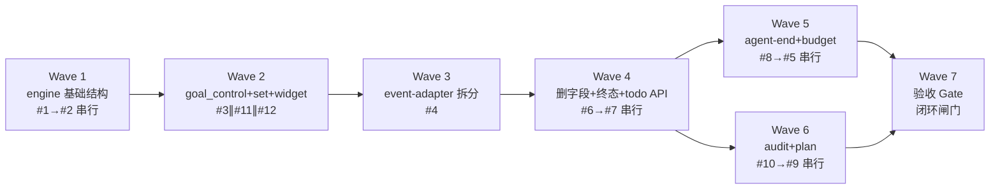

# 执行计划 — Goal V2 Refactor

## Wave 编排总览

### 依赖 DAG 图（Wave 级）

### 调度表

| Wave | 切片 | P级 | Blocked by | 并行组 | Wave 内部 | 说明 |
|------|------|-----|-----------|--------|----------|------|
| 1 | engine 基础结构 | P0 | 无 | — | 串行 #1→#2 | 删 task CRUD + 7 态状态机；同改 `engine/types.ts` |
| 2 | goal_control + set 拒绝 + widget | P0/P1 | Wave 1 | A | 并行 #3∥#11∥#12 | 三 issue 文件不交集 |
| 3 | event-adapter 拆分 | P0 | Wave 2 | — | 单 issue #4 | 结构重构，后续 handler 级改动依赖根 |
| 4 | 删终态路径 + todo API | P1 | Wave 3 | — | 串行 #6→#7 | 同改 `engine/budget.ts`（#6 删 maxTurnsReached / #7 改 checkProgress）|
| 5 | agent-end 重构 + budget 检查 | P1 | Wave 4 | B | 串行 #8→#5 | 同改 `event-handlers/agent-end.ts` |
| 6 | audit prompt + plan 联动 | P1/P2 | Wave 4 | B | 串行 #10→#9 | 同改 `projection/prompts.ts`；与 Wave 5 并行 |
| 7 | **验收 Wave（闭环闸门）** | — | Wave 1-6 | — | 单步 | 读测试验收清单全量→跑测试→全 PASS 才算实现完成 |

### 并行约束

- **同文件不允许多 Wave / Wave 内多 issue 同时修改** — 本计划的串行/并行划分均基于文件冲突检测（见各 Wave「文件影响」）
- **Wave 内部并行**：同一 Wave 内 issue 改不同文件时可派多个 subagent 并行（仅 Wave 2：#3∥#11∥#12）
- **Wave 内部串行**：同改一文件的 issue 必须串行（Wave 1、Wave 5、Wave 6）
- **Wave 5 ∥ Wave 6**：同 blocked_by Wave 4，改不同文件（`agent-end.ts`/`service.ts` vs `prompts.ts`/`index.ts`），可并行
- **同并行组最多 3 subagent**（Semaphore 限制）

### Prefactor Wave 评估

**结论：不需要独立 Prefactor Wave。**

- #1（删 goal_manager / task CRUD）本身是业务交付（对标 Codex 去 task 管理），非纯结构铺垫
- #4 的 `persistAndUpdate` 迁入 `service.ts` 是 #4 验收的一部分（见 issues.md #4 验收），不独立成 prefactor
- Wave 1 直接做 #1+#2（清场 + 状态机），是后续所有 Wave 的结构基础

### 依赖推导依据（从 code-architecture.md §6 时序图）

| 时序图 | 落入 Wave | 依赖先行 |
|--------|----------|---------|
| 功能 1 `/goal set` | Wave 2（#11）| #2 状态机（Wave 1）|
| 功能 2 `goal_control.complete` | Wave 2（#3）| #1 删 goal_manager（Wave 1）|
| 功能 3 budget 自动终态 | Wave 5（#5）| #4 拆分（Wave 3）+ #7 todo API（Wave 4）|
| 功能 4 context 注入 | Wave 5-6（#7/#8/#10）| #4 + #7 |
| 功能 5 pause/resume | Wave 2（#11/#12）| #2 paused（Wave 1）|

## Wave 1: engine 基础结构

**切片类型**: 垂直切片（清场 + 状态机地基）
**P 级覆盖**: P0（#1, #2）
**Blocked by**: 无——可立即开始
**并行关系**: Wave 内 **串行** #1 → #2（同改 `engine/types.ts`，#1 先删旧字段，#2 再加新状态）

### 包含的 issue
- #1 删除 goal_manager + task CRUD（P0，方案 A 一步删除）
- #2 新增 paused 状态 + VALID_TRANSITIONS（P0，方案 A 显式转换表）

### 文件影响

**#1（subagent A）**—清理所有 GoalTask/goal_manager 引用（grep 现状：散布 10 文件）:
- 删除文件: `engine/task.ts`、`adapters/tool-adapter.ts`、`adapters/actions.ts`
- `engine/types.ts`: 删 GoalTask/Subtask/TaskVerification 类型 + GoalRuntimeState.tasks 字段
- `engine/budget.ts`: 删 `import GoalTask` + `import getCompletedCount`（task.ts 已删）+ `checkProgress` 函数体清理（移除 `state.tasks.filter`/`state.tasks.length`/`isTaskDoneFn` 参数/`tasksCompletedAtStart` 参数——该函数是 #1→#6→#7 三阶段演进函数，#1 只做「去 task 依赖」最小改动，task 相关字段 allTasksDone/noTasksCreated/isStalled 暂置默认值，待 #7 用 ProgressInput 重填）
- `service.ts`: 删 10 个 action 函数 + **所有** state.tasks 引用（现状 ~90 处，全量清理非局部改动）
- `command-adapter.ts`: 删 handleAbort + 所有 tasks 引用
- `adapters/event-adapter.ts`: 删 GoalTask import + 所有 state.tasks/tasksCompletedAtAgentStart 引用 + 所有 goal_manager prompt 字符串
- `persistence.ts`: deserializeState 旧 tasks 字段忽略迁移
- `index.ts`: 删 goal_manager tool 注册
- `projection/prompts.ts` + `projection/widget.ts` + `projection/result.ts`: 删 GoalTask import + tasks 渲染 + goal_manager 引用

**#2（subagent B，#1 完成后）**—**只加状态，不删字段**（见决策记录 D1）:
- 修改: `engine/types.ts`（GoalStatus 加 `paused` 共 7 值 + `VALID_TRANSITIONS` + `TERMINAL_STATUSES`）、`engine/goal.ts`（transitionStatus 改查表 throw）
- **不删** BudgetConfig.maxTurns/maxStallTurns 和 GoalRuntimeState.stallCount（字段+使用点删除整体归 Wave 4 #6）
- 验收 grep: `grep -rn "GoalTask\|create_tasks\|update_tasks\|add_subtasks\|delete_subtasks\|goal_manager" extensions/goal/src/ --include="*.ts"` 无非注释输出

### Subagent 配置

| 配置项 | 值 |
|--------|---|
| Agent | general-purpose |
| 注入上下文 | spec.md UC-1~UC-4 + issues.md #1/#2 全文 + code-architecture.md §3 API 契约 + §4 时序图 1/5 + system-architecture.md §5 状态流转 / §7 删除清单 |
| 读取文件 | 现状全部 `extensions/goal/src/`（重点 engine/、adapters/、service.ts、persistence.ts、index.ts、projection/）|
| 修改/创建 | 见上「文件影响」|

### 执行流（Wave 内部，串行）
1. subagent A 执行 #1 → `pnpm --filter @zhushanwen/pi-goal typecheck` 通过 → grep 验收（issues.md #1 验收标准）
2. subagent B 执行 #2 → typecheck 通过 → grep 验收（issues.md #2 验收标准）

### 验收标准
- [ ] issues.md #1 验收（grep GoalTask/goal_manager 系列无非注释输出）
- [ ] issues.md #2 验收（GoalStatus 7 值 + VALID_TRANSITIONS 查表）—— **不含**「BudgetConfig 无 maxTurns」「GoalRuntimeState 无 stallCount」两条（移至 #6，见 D1）
- [ ] typecheck 零错误（stallCount/maxTurns 字段保留，编译可达）

---

## Wave 2: goal_control + /goal set 拒绝 + widget

**切片类型**: 垂直切片（三条独立窄路径，文件不交集）
**P 级覆盖**: P0（#3）+ P1（#11, #12）
**Blocked by**: Wave 1
**并行关系**: Wave 内 **并行** #3 ∥ #11 ∥ #12（三 issue 文件不交集）

### 包含的 issue
- #3 新建 goal_control adapter（P0，方案 A 独立文件）
- #11 /goal set 非终态拒绝（P1）
- #12 widget paused/blocked 显示（P1）

### 文件影响（冲突检测：无交集）

| issue | 改动文件 | 冲突 |
|-------|---------|------|
| #3 | 新建 `adapters/goal-control-adapter.ts`（~120 LOC）+ `index.ts`（注册 goal_control）| index.ts 仅 #3 改 |
| #11 | `command-adapter.ts`（handleSet 拒绝逻辑）| 仅 #11 改 |
| #12 | `projection/widget.ts`（status suffix 加 paused/blocked）| 仅 #12 改 |

### Subagent 配置

| 配置项 | 值 |
|--------|---|
| Agent | general-purpose（×3 并行）|
| 注入上下文 | 共同: spec.md UC-2/UC-4 + code-architecture §4 时序图 2/5；#3 额外 issues.md #3 + §3 goal-control-adapter 契约；#11 额外 issues.md #11 + clarification D25；#12 额外 issues.md #12 |
| 读取文件 | #3: service.ts（finalizeAndPersist/persistState 签名）、Wave1 后的 engine/；#11: command-adapter.ts；#12: projection/widget.ts + engine/types.ts（GoalStatus）|
| 修改/创建 | 见上表 |

### 执行流（Wave 内部，并行）
1. 同时派 3 个 subagent 执行 #3 / #11 / #12
2. 各自 typecheck 通过 + 验收 checklist

### 验收标准
- [ ] issues.md #3（goal_control 注册 + complete/report_blocked）+ #11（active/paused/blocked 拒绝 + 提示语）+ #12（widget 两状态显示）
- [ ] typecheck 零错误

---

## Wave 3: event-adapter 按事件拆分

**切片类型**: 结构重构（prefactor 性质——为后续 handler 级改动铺路）
**P 级覆盖**: P0（#4）
**Blocked by**: Wave 2
**并行关系**: 单 issue，无 Wave 内并行

### 包含的 issue
- #4 event-adapter 拆分为 6 handler + 薄路由（P0，方案 A）

### 文件影响
- 新建 `adapters/event-handlers/` 目录: `before-agent-start.ts`（~180 LOC）、`agent-end.ts`（~100 LOC）、`message-end.ts`（~30 LOC）、`turn-end.ts`（~20 LOC）、`agent-start.ts`（~20 LOC）、`session-start.ts`（~80 LOC）
- 修改: `event-adapter.ts` 退化为薄路由（≤60 LOC，import 6 handler + pi.on 转发）
- 迁移: `persistAndUpdate` 逻辑从 event-adapter.ts 迁入 `service.ts`（#4 验收明确要求）

### Subagent 配置

| 配置项 | 值 |
|--------|---|
| Agent | general-purpose |
| 注入上下文 | issues.md #4 全文（含行为等价 checklist）+ code-architecture §3 service.ts 契约（persistAndUpdate/persistState/tickState）+ §5 Deep Module 决策（事件路径 vs command/tool 路径 seam）+ NFR F2 取证说明 |
| 读取文件 | 现状 `event-adapter.ts`（737 行）、`service.ts` |
| 修改/创建 | 见上「文件影响」|

### 执行流
1. subagent 执行 #4 拆分 + persistAndUpdate 迁移
2. typecheck 通过 + 行为等价 checklist 逐项验证（issues.md #4 的 6 handler 行为点表）

### 验收标准
- [ ] issues.md #4 全部验收（event-handlers/ 6 文件 + event-adapter.ts ≤60 LOC + persistAndUpdate 迁入 service.ts）
- [ ] 行为等价：6 handler 关键行为点（context 注入 / paused guard / budget 预警 / token 累加 / turn 计数 / 状态恢复）逐一验证
- [ ] typecheck 零错误

## Wave 4: 删终态路径 + todo 跨扩展 API

**切片类型**: 垂直切片（同文件改动，串行）
**P 级覆盖**: P1（#6, #7）
**Blocked by**: Wave 3（#7 改 #4 拆出的 `before-agent-start.ts` + #3 新建的 `goal-control-adapter.ts`；#6 改 #4 拆出的 `agent-end.ts`）
**并行关系**: Wave 内 **串行** #6 → #7（**同改 `engine/budget.ts`**：#6 删 maxTurnsReached 字段+计算，#7 改 checkProgress 签名。先清场 #6 再扩建 #7）

### 包含的 issue
- #6 删除 maxTurns/stall 自动终态路径（P1，方案 A 直接删除）
- #7 todo 跨扩展 API + ProgressInput 注入（P1，方案 A duck-typed）

### 文件影响（冲突检测：同改 `engine/budget.ts` → 串行）

| issue | 改动文件 | 冲突 |
|-------|---------|------|
| #6 | **字段+使用点+控制流一次性删除（D1+D2）**：`engine/types.ts`（删 BudgetConfig.maxTurns/maxStallTurns + GoalRuntimeState.stallCount）+ `event-handlers/agent-end.ts`（删 handleMaxTurnsReached/handleNoTasksOrMaxTurns/handleAllTasksDone 的 maxTurns 分支 + handleStallAndContinuation 的 stallCount→blocked，4 函数归此文件）+ `engine/budget.ts`（删 maxTurnsReached 字段+计算）+ `command-adapter.ts`/`persistence.ts`/`commands.ts`/`constants.ts`/`index.ts`/`service.ts`/`projection/prompts.ts`/`projection/widget.ts`/`engine/goal.ts`（删字段使用点）| 仅 #6 改上述文件；#7 改 before-agent-start.ts，不交集 |
| #7 | `extensions/todo/`（暴露 `pi.__todoGetList`）+ `adapters/goal-control-adapter.ts`（complete 时调）+ `event-handlers/before-agent-start.ts`（组装 ProgressInput）+ `engine/budget.ts`（checkProgress 接收 ProgressInput）| #7 改 before-agent-start 的 todo 注入段，不碰 agent-end |

> **依赖精度说明**：issues.md #7 只标 blocked_by #1，实际文件依赖还含 #3（goal-control-adapter.ts 由 #3 创建）和 #4（before-agent-start.ts 由 #4 拆出）。Wave 编排已覆盖（#3 Wave 2 / #4 Wave 3 先于 #7 Wave 4）。

### Subagent 配置

| 配置项 | 值 |
|--------|---|
| Agent | general-purpose（串行 2 步）|
| 注入上下文 | 共同: code-architecture §4 时序图 3/4；#6 额外 issues.md #6 + system-architecture §7 handler 分支删除；#7 额外 issues.md #7 + system-architecture §4 核心模型 / §8 Context Map |
| 读取文件 | #6: Wave3 后的 event-handlers/；#7: extensions/todo/ + engine/budget.ts + goal-control-adapter.ts + before-agent-start.ts |
| 修改/创建 | 见上表 |

### 执行流（Wave 内部，串行）
1. subagent A 执行 #6（删字段+使用点+控制流，清场）→ typecheck + grep 验收
2. subagent B 执行 #7（todo API + ProgressInput，扩建）→ typecheck + 验收 checklist

### 验收标准
- [ ] **#6（D1 扩展）**：BudgetConfig 无 maxTurns/maxStallTurns + GoalRuntimeState 无 stallCount + 12 文件使用点全清 + agent-end.ts 4 终态分支删除 + stalenessReminder 保留 + budget.ts maxTurnsReached 删除
- [ ] **#7**：__todoGetList 暴露 + ProgressInput 组装 + engine 零 Pi 依赖 + undefined 降级
- [ ] `grep -rn "stallCount\|maxTurns\|maxStallTurns\|maxTurnsReached" extensions/goal/src/ --include="*.ts"` 无非注释输出（stallCount/maxTurns 在 Wave 4 末尾彻底清除）
- [ ] typecheck 零错误

---

## Wave 5: agent_end 重构 + budget 单一检查点

**切片类型**: 垂直切片（同文件改动，串行保证不冲突）
**P 级覆盖**: P1（#8, #5）
**Blocked by**: Wave 4（#5 依赖 #7 ProgressInput；#8 依赖 #6 先删 maxTurns 终态）
**并行关系**: Wave 内 **串行** #8 → #5（同改 `event-handlers/agent-end.ts`）；**Wave 5 ∥ Wave 6**（改不同文件）

### 包含的 issue
- #8 agent_end 重构为只做 warning/steering（P1，方案 A）
- #5 budget 单一检查点 persistAndUpdate 兑底（P1，方案 A）

### 文件影响

**#8（subagent A）**:
- 修改 `event-handlers/agent-end.ts`: checkBudgetOnTurnEnd 只保留 70/90 预警 + 90% steering；allTasksDone 加 followUp 提示；删剩余 terminal 分支

**#5（subagent B，#8 完成后）**:
- 修改 `service.ts` persistAndUpdate: 加 budget 终态直比较（`tokensUsed >= tokenBudget` → budget_limited / `timeUsed >= timeBudget*60` → time_limited）
- 修改 `event-handlers/agent-end.ts`: checkBudgetOnTurnEnd 删 terminal 分支（与 #8 改动同文件 → 串行）
- 修改 `command-adapter.ts` 或 service: /goal resume 调 checkBudgetOnResume 拒绝超限

> **架构事实（NFR F2）**：budget 终态检查在 `persistAndUpdate`（事件路径），不在 `persistState`（command/tool 路径）。#5 落点必须正确。

### Subagent 配置

| 配置项 | 值 |
|--------|---|
| Agent | general-purpose |
| 注入上下文 | 共同: code-architecture §4 时序图 3（budget 自动终态）+ §3 persistAndUpdate 契约；#8 额外 issues.md #8；#5 额外 issues.md #5 + clarification D23 + NFR F2 取证 |
| 读取文件 | Wave4 后的 event-handlers/agent-end.ts + service.ts |
| 修改/创建 | 见上 |

### 执行流（Wave 内部，串行）
1. subagent A 执行 #8 → typecheck + 验收
2. subagent B 执行 #5 → typecheck + 验收

### 验收标准
- [ ] issues.md #8（agent-end 无 terminal + 70/90 预警 + followUp）+ #5（persistAndUpdate budget 检查 + agent-end 无 terminal + resume 拒绝超限）
- [ ] typecheck 零错误

---

## Wave 6: completion audit prompt + plan 联动

**切片类型**: 垂直切片（同文件改动，串行；与 Wave 5 并行）
**P 级覆盖**: P1（#10）+ P2（#9）
**Blocked by**: Wave 4（#9/#10 依赖 #7 todo API）
**并行关系**: Wave 内 **串行** #10 → #9（同改 `projection/prompts.ts`）；**Wave 6 ∥ Wave 5**

### 包含的 issue
- #10 completion audit prompt 强化（P1）
- #9 plan↔goal 联动（P2，方案 A LLM 自主判断）

### 文件影响

**#10（subagent A）**:
- 修改 `projection/prompts.ts`: contextInjectionPrompt 要求建 todo（含 isVerification）+ continuationPrompt 含 completion audit 提醒 + 删所有 goal_manager 引用

**#9（subagent B，#10 完成后）**:
- 修改 `projection/prompts.ts`: contextInjectionPrompt 加 plan 建议段落（与 #10 同文件 → 串行）
- 修改 `event-handlers/before-agent-start.ts`: plan 可用性判定 + plan 建议注入点（若 handler 层判 plan 可用性；若纯 prompt 文字内嵌则只改 prompts.ts）
- 修改 `index.ts`: `pi.__goalInit` 废弃 tasks 参数
- 修改 `extensions/plan/`: 暴露 `pi.__planStart`

> **Watch（code-architecture §6）**：prompts.ts 重构后 ~370 LOC，#9/#10 prompt 膨胀有破 400 LOC 风险。执行时监控，超限则拆分 prompt 到独立常量文件。

### Subagent 配置

| 配置项 | 值 |
|--------|---|
| Agent | general-purpose |
| 注入上下文 | 共同: spec FR-6/FR-7 + code-architecture §4 时序图 4；#10 额外 issues.md #10 + Codex continuation.md 三约束；#9 额外 issues.md #9 + clarification D26/D27 |
| 读取文件 | Wave4 后的 projection/prompts.ts + index.ts + extensions/plan/ |
| 修改/创建 | 见上 |

### 执行流（Wave 内部，串行；与 Wave 5 并行）
1. 与 Wave 5 同时启动（不同 subagent，不同文件）
2. subagent A 执行 #10 → typecheck + 验收
3. subagent B 执行 #9 → typecheck + 验收 + prompts.ts LOC 检查

### 验收标准
- [ ] issues.md #10（建 todo 含 isVerification + completion audit + 无 goal_manager 引用）+ #9（plan 建议 + __planStart + __goalInit tasks 废弃）
- [ ] prompts.ts ≤ 400 LOC（超限需拆分）
- [ ] typecheck 零错误

---

## Wave 7: 验收 Wave（Acceptance Gate）

**切片类型**: 验收闸门（非功能开发——读测试验收清单全量→跑测试→全 PASS 才算实现完成）
**P 级覆盖**: —（验收，无 P 级）
**Blocked by**: Wave 1, Wave 2, Wave 3, Wave 4, Wave 5, Wave 6（所有功能 Wave）
**并行关系**: 必须最后执行，blocked_by 全部功能 Wave

### 职责

本 Wave 不做功能开发。它的唯一职责是**闭环验证**——确认设计→实现真正落地：

1. 读「测试验收清单」全量（37 条用例 ID）
2. 逐条跑测试，把每条映射为 PASS / FAIL / 未实现 / [DEVIATED]
3. 任一用例无对应测试或 FAIL = 整个实现未完成
4. 输出覆盖率报告（清单用例 PASS 率）

> **编码完成的定义 = 测试验收清单全绿。** Wave 7 不绿 = 实现未完成，不允许交接。

### Subagent 配置

| 配置项 | 值 |
|--------|---|
| Agent | general-purpose（验收专用，不混功能开发）|
| 注入上下文 | execution-plan.md「测试验收清单」全文 + code-architecture.md §6 测试矩阵 + issues.md 全部验收标准 |
| 读取文件 | Wave 1-6 后的全部 `extensions/goal/src/` + 测试文件 + `extensions/todo/` + `extensions/plan/` |
| 修改/创建 | 仅测试文件（补缺失测试）+ `changes/acceptance-report.md`（覆盖率报告）|

### 执行流

1. 扫描测试目录，对照清单 37 条用例 ID 建立映射（用例 → 测试文件:行号 / 未实现）
2. 跑全量测试套件（`pnpm --filter @zhushanwen/pi-goal test`）
3. 每条清单用例标注结果状态
4. 有 FAIL/未实现 → 输出差距报告，回相应 Wave 修复（不在 Wave 7 内修功能）
5. 全 PASS → 输出 `changes/acceptance-report.md`，标记实现完成

### 验收标准

- [ ] 测试验收清单 37 条用例全 PASS（或合法 [DEVIATED]）
- [ ] 无「未实现」用例
- [ ] typecheck 零错误
- [ ] `changes/acceptance-report.md` 产出，覆盖率 100%

---

## 后续迭代（P3 延后项）

来源 issues.md，本次 Wave 编排不纳入：
- [P3] 预警 flag 合并（4 boolean → Set）— 延后理由：收益低，4 个 flag 不影响功能
- [P3] budget.ts 变化轴分离（tick 独立）— 延后理由：180 LOC 不需要拆
- [P3] prompts.ts 变化轴分离 — 延后理由：370 LOC 按投影层职责统一归类可接受（若 Wave 6 破 400 则提前触发）
- [P3] 多 session 重构 — 延后理由：当前假设单 session（spec 明确）

---

## 决策记录（追踪 gap 修正）

### D0: checkProgress 三阶段演进（gap 8）

**背景**：`engine/budget.ts` 的 `checkProgress`（现状 line 159-175）是 #1（去 tasks）/ #6（去 maxTurns）/ #7（加 ProgressInput）三次演进的收敛点。函数体引用 `state.tasks`（3 处）+ `getCompletedCount`（task.ts）+ GoalTask 类型 + maxTurns（#6 范围）。原 #1 文件影响只列「删 import GoalTask + isTaskDoneFn 类型注解」，遗漏函数体 4 处编译失败点。

**决策**：明确 checkProgress 三阶段职责边界——
- **#1（Wave 1）**：去 task 依赖最小改动。删 `state.tasks.*` 引用 + `isTaskDoneFn`/`tasksCompletedAtStart` 参数 + `getCompletedCount` import；task 相关返回字段（allTasksDone/noTasksCreated/isStalled）暂置默认值（false/false/false）
- **#6（Wave 4）**：删 `maxTurnsReached` 字段与计算
- **#7（Wave 4）**：改签名接收 `ProgressInput`，重填 allTasksDone/noTasksCreated/isStalled

**理由**：避免 subagent 在 #1 过度重构（撞 #7 范围）或不足（留 task 残骸）。不阻塞 Wave 启动（typecheck 零错误倒逼正确执行），但明确边界后描述与实际清理量对齐。

### D1: #2/#6 范围重新切分（gap 1 + gap 7）

**背景**：原 issues.md #2（Wave 1）删 BudgetConfig.maxTurns/maxStallTurns + GoalRuntimeState.stallCount 字段定义，但字段使用点散布 **12 文件 54 处**（event-adapter.ts / command-adapter.ts / budget.ts / persistence.ts / commands.ts / constants.ts / index.ts / service.ts / prompts.ts / widget.ts / goal.ts / types.ts）。TS 强类型下，删字段定义必须同步删全部使用点，否则编译失败。原方案把「删字段定义」(#2 Wave 1) 和「删使用点+控制流」(#6 Wave 4) 拆到相隔 3 个 Wave，导致 Wave 1-3 的 typecheck 永不可达（红区）。

**决策（长期方案）**：重新切分 #2/#6 范围，使每个 Wave typecheck 可达：
- **#2（Wave 1）收窄**：只加 paused + VALID_TRANSITIONS + TERMINAL_STATUSES + transitionStatus 查表。**不删** stallCount/maxTurns/maxStallTurns 字段。验收移除「BudgetConfig 无 maxTurns」「GoalRuntimeState 无 stallCount」两条。
- **#6（Wave 4）扩大**：删 BudgetConfig.maxTurns/maxStallTurns + GoalRuntimeState.stallCount 字段定义 + 全部使用点（12 文件 54 处）+ handler 控制流分支（handleMaxTurnsReached / handleNoTasksOrMaxTurns / handleAllTasksDone 的 maxTurns 分支 / handleStallAndContinuation 的 stallCount→blocked 分支）+ BudgetCheckResult.maxTurnsReached 字段 + engine/budget.ts 的 maxTurns 计算。保留 stalenessReminderPrompt（基于 lastUpdatedTurn）。
  - **注**：#1 和 #6 改动文件数（~10/12）超 subagent guideline（≤5 文件），因 TS 字段删除的原子性约束不可拆分；执行时若 subagent 上下文吃紧，可分文件批次提交（保持单 typecheck 闭环）。

**理由**：垂直切片要求每 Wave 独立 typecheck 可达。A1 方案让 Wave 1（纯加状态）、Wave 3（拆完整 event-adapter.ts）、Wave 4（一次性删字段+使用点+控制流）各自在自洽状态工作，不引入中间红区。这是唯一满足 TS 类型约束 + 垂直切片原则的切分。subagent 建议的方案 A（#2 在 Wave 1 一起删）会让 Wave 1 删 event-adapter.ts 里的函数、Wave 3 再拆残缺文件，更糟。

**issues.md 同步（已落实）**：#2 验收移除两条字段删除项 → 移至 #6 验收。#6 方案改动补全字段+使用点+文件归属（agent-end.ts）。issue 语义不变（删 maxTurns/stall 终态路径）。

### D2: #6 文件归属修正（gap 2）

**背景**：handleStallAndContinuation / handleAllTasksDone / handleNoTasksOrMaxTurns / handleMaxTurnsReached 四函数的调用链（event-adapter.ts line 454 调用、line 568-690 定义）全部在 agent_end 主流程（line 392-460）。issues.md #6 原写「before-agent-start.ts 或 turn-end.ts」是归属误判。

**决策**：#4 拆分后这 4 函数归 `event-handlers/agent-end.ts`。Wave 4 #6 文件影响修正为 `agent-end.ts`（+ D1 扩展的字段删除跨文件）。#7 改 `before-agent-start.ts`（ProgressInput 组装），两者文件不交集，并行安全。

### D3: 与 code-architecture §6 的 Wave 差异（gap 5）

**背景**：code-architecture §6「Wave 推导」把 #5（blocked_by #7）与 #7 同放 Wave 4，违反依赖（#5 不能与 #7 同 Wave 并行）；且未拆出 Wave 6。本计划已修正：#7 Wave 4 / #5 Wave 5（串行 #8→#5）/ Wave 6（#10→#9，与 Wave 5 并行）。

**决策**：execution-plan 以本计划的 Wave 划分为准（已通过依赖闭合追踪验证）。code-architecture §6 作为「喂给 Step 6 的建议」被本计划优化，不回改上游已审查产物。

---

## 执行交接

本计划完成后，进入编码实现：
- **方式 A（推荐）**: 接入 coding-workflow — 启动 Phase 流程（spec→plan→dev→test→pr），每个 Phase 对应一个或多个 Wave
- **方式 B**: 手动执行 — 每个 Wave 派 fresh subagent，Wave 内并行 issue 派多个 subagent，按 Wave 内执行流走（实现 → typecheck → 验收 checklist）

**执行顺序强制约束**（DAG 不可跳过）：Wave 1 → Wave 2 → Wave 3 → Wave 4 →（Wave 5 ∥ Wave 6）→ Wave 7（验收）

> **跨 extension 改动提示**：Wave 4 #7 改 `extensions/todo/`、Wave 6 #9 改 `extensions/plan/`，涉及各自 changeset/version bump，执行时同步。

**每 Wave 完成后**：
1. typecheck 零错误（全量修复，不接受「非本次引入」跳过理由）
2. issues.md 对应 issue 验收 checklist 全绿
3. 提交一个 commit（英文 message，如 `refactor(goal): wave 1 - remove goal_manager, add 7-state machine`）

---

## 测试验收清单（Test Acceptance Manifest）

> **实现阶段的 Definition of Done（完成定义）。** 用例 ID 集合 = ⑤code-architecture.md §6 test-matrix 全量（来源 A 功能 + 来源 B NFR），无遗漏无多余。末尾验收 Wave（Wave 7）读本清单全量→跑测试→全 PASS 才算实现完成。
>
> **状态字段**：`待验`（设计期默认）→ 实现期填 `PASS` / `FAIL` / `未实现` / `[DEVIATED]原因`

### 来源 A：功能用例

| 用例 ID | 归属 UC | 场景 | 断言摘要 | 归属 Wave | 状态 |
|---------|--------|------|---------|----------|------|
| T1.1 | UC-1 | 无 goal 时创建 | 创建 active goal | Wave 2 | 待验 |
| T1.2 | UC-1 | 终态旧 goal 存在时创建 | 允许创建（终态可覆盖） | Wave 2 | 待验 |
| T1.3 | UC-1/6 | 非终态 goal 存在时创建（=NFR-AC-10） | 拒绝，提示「先 resume 或 clear」 | Wave 2 | 待验 |
| T1.4 | UC-1 | budget 缺省字段 | 用 DEFAULT_BUDGET 填充 | Wave 2 | 待验 |
| T1.5 | UC-1 | context 注入时 todo 未安装（=NFR-AC-6 降级） | Goal 降级运行：context 注入照常返回（prompt 含静态 todo 指令） | Wave 4 | 待验 |
| T1.6 | UC-1 | prompt 不含 goal_manager 指令（=NFR-AC-2） | grep 零命中 create_tasks 等旧 action | Wave 1 | 待验 |
| T1.7 | UC-1 | __planStart 缺失降级（=NFR-AC-7） | context 不含 plan 段落，goal 独立运行 | Wave 6 | 待验 |
| T1.8 | UC-1 | __goalInit 忽略 tasks（=NFR-AC-8） | 收到 tasks 忽略，不 throw | Wave 6 | 待验 |
| T1.9 | UC-1 | 迁移调用方不传 tasks（=NFR-AC-9） | grep 验证 tool-handlers.ts/compact.ts | Wave 6 | 待验 |
| T1.10 | UC-1 | （编号占位，对齐 test-matrix 索引）| — | — | — |
| T2.1 | UC-2 | active→pause | status=paused，不续跑 | Wave 2 | 待验 |
| T2.2 | UC-2 | 非 active 转 pause | throw，提示「当前状态不可暂停」 | Wave 2 | 待验 |
| T2.3 | UC-2 | paused→resume 未超预算 | status=active，timeStartedAt 重置 | Wave 2 | 待验 |
| T2.4 | UC-2 | resume 时已超 budget | checkBudgetOnResume 超限 → 转 budget_limited 终态 + 提示 | Wave 5 | 待验 |
| T2.5 | UC-2 | paused 态不累加 token | tokensUsed 不变 | Wave 3 | 待验 |
| T2.6 | UC-2 | 崩溃重启后 paused 保持 | reconstructGoalState 恢复 paused | Wave 1 | 待验 |
| T3.1 | UC-3 | token 耗尽转终态（=NFR-AC-4） | persistAndUpdate 内转 budget_limited + notify | Wave 5 | 待验 |
| T3.2 | UC-3 | time 耗尽转终态 | 转 time_limited + notify | Wave 5 | 待验 |
| T3.3 | UC-3 | 刚好等于预算 | 转 budget_limited（≥判定） | Wave 5 | 待验 |
| T3.4 | UC-3 | 未超预算正常 persist | serializeState + updateWidget，不转终态 | Wave 5 | 待验 |
| T3.5 | UC-3 | 终态不可逆 | budget_limited goal，/goal resume 拒绝 | Wave 5 | 待验 |
| T3.6 | UC-3 | 旧字段反序列化不 throw（=NFR-AC-1） | tasks/stallCount/maxTurns 忽略，state 正常重建 | Wave 1 | 待验 |
| T3.7 | UC-3 | 转终态同步 notify + updateWidget（=NFR-AC-5） | persist 转终态时触发通知 | Wave 5 | 待验 |
| T3.8 | UC-3 | 70/90% 预警 + steering + followUp（=NFR-AC-11） | 预警通知 + steering prompt + followUp | Wave 5 | 待验 |
| T3.10 | UC-3 | （编号占位，对齐 test-matrix 索引）| — | — | — |
| T4.1 | UC-4 | complete（全解耦：不检查 todo） | 转 complete + notify | Wave 2 | 待验 |
| T4.2 | UC-4 | complete 缺 evidence（=NFR-AC-3） | 拒绝，提示「需提交完成证据」 | Wave 2 | 待验 |
| T4.3 | ~~UC-4~~ | ~~todo 为空数组~~ | **已移除（全解耦）** | — | — |
| T4.4 | ~~UC-4~~ | ~~有未完成 todo~~ | **已移除（全解耦）** | — | — |
| T4.5 | ~~UC-4~~ | ~~todo 未安装降级~~ | **已移除（全解耦）**：goal 不读 todo | — | — |
| T4.6 | ~~UC-4~~ | ~~验证任务未完成~~ | **已移除（全解耦）**：靠 prompt 软建议 | — | — |
| T4.7 | UC-4 | plan 未走完但 evidence 有值（AC-4.5 软提醒） | 允许完成（全解耦后无硬检查） | Wave 2 | 待验 |
| T5.1 | UC-5 | active→blocked | status=blocked，不续跑 | Wave 2 | 待验 |
| T5.2 | UC-5 | 非 active 报告阻塞 | 拒绝（语义不成立） | Wave 2 | 待验 |
| T5.3 | UC-5 | blocked→resume | status=active | Wave 2 | 待验 |
| T5.4 | UC-5 | 崩溃重启后 blocked 保持 | reconstructGoalState 恢复 blocked | Wave 1 | 待验 |
| T6.1 | UC-6 | 清除非终态 goal | status=cancelled，不续跑 | Wave 1 | 待验 |
| T6.2 | UC-6 | 已终态再清除（幂等） | 保持终态（幂等） | Wave 1 | 待验 |

### 来源 B：NFR 风险→用例映射（已并入来源 A，此处汇总双向索引）

> 11 条 NFR-AC 已在来源 A 表中标注（=NFR-AC-N），归属 Wave 见上。骨架约束类缓解（VALID_TRANSITIONS 枚举、闭包读取、staleness 提示、maxTurns 类型移除）由⑤骨架 tsc gate 验证，不进本清单。

| NFR-AC | 用例 ID | 归属 Wave |
|--------|---------|----------|
| NFR-AC-1（旧字段反序列化） | T3.6 | Wave 1 |
| NFR-AC-2（prompt 无 goal_manager） | T1.6 | Wave 1 |
| NFR-AC-3（complete evidence 必填） | T4.2 | Wave 2 |
| NFR-AC-4（budget 检查在 persistAndUpdate） | T3.1 | Wave 5 |
| NFR-AC-5（转终态同步 notify） | T3.7 | Wave 5 |
| NFR-AC-6（todo 缺失三路径降级） | T4.5 / T1.5 | Wave 4 |
| NFR-AC-7（plan 缺失降级） | T1.7 | Wave 6 |
| NFR-AC-8（goalInit 忽略 tasks） | T1.8 | Wave 6 |
| NFR-AC-9（迁移调用方） | T1.9 | Wave 6 |
| NFR-AC-10（set 非终态拒绝） | T1.3 | Wave 2 |
| NFR-AC-11（70/90% 预警） | T3.8 | Wave 5 |

### 闭环自检

- [x] 清单用例 ID 集合 = ⑤test-matrix 全量（38 个），无遗漏无多余
- [x] 末尾验收 Wave（Wave 7）blocked_by 所有功能 Wave（Wave 1-6）
- [x] 每个功能 Wave 覆盖的用例 ID 都在本清单出现（Wave 1: T1.6/T2.6/T3.6/T5.4/T6.1/T6.2；Wave 2: T1.1-T1.4/T2.1-T2.3/T4.1-T4.7/T5.1-T5.3；Wave 3: T2.5；Wave 4: T1.5/T4.5；Wave 5: T2.4/T3.1-T3.5/T3.7/T3.8；Wave 6: T1.7-T1.9）
