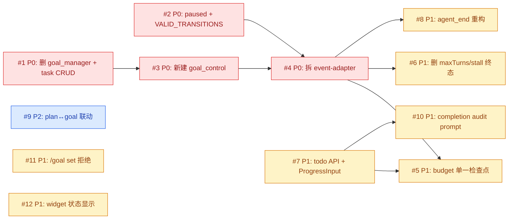

# Issue 决策图 — Goal V2 Refactor

## 地图总览

## P0 Issues（阻塞项，必须先做）

### #1: 删除 goal_manager + task CRUD

**P 级**: P0
**类型**: 架构
**Blocked by**: 无
**推荐强度**: Strong

#### 问题描述

删除 goal_manager tool（10 个 action）和 engine/task.ts 的 GoalTask/Subtask/TaskVerification 模型。这是所有后续 issue 的结构基础——新代码建立在删除后的结构上。

关联 system-architecture.md §7 删除清单（字段级删除部分）。

#### 为什么是这个 P 级

- **P0（阻塞）**: #3 新建 goal_control 依赖 goal_manager 已删除（避免两套 tool 并存）；#7 todo API 集成依赖 task 模型已删除（否则 goal 有两套任务数据源）

#### 方案对比

##### 方案 A: 一步删除（推荐）

**改动**:
- 删除 `engine/task.ts` 全部代码
- 删除 `adapters/tool-adapter.ts` 全部代码
- 删除 `adapters/actions.ts` 全部代码
- 删除 `service.ts` 中 10 个 action 函数（actionCreateTasks ~ actionListTasks）
- 删除 `index.ts` 中 goal_manager tool 注册
- 删除 `GoalRuntimeState.tasks` 字段
- 删除 `engine/types.ts` 中 GoalTask/Subtask/TaskVerification 导入
- 更新 `projection/` 中引用 tasks 的渲染逻辑
- `deserializeState` 加迁移：旧 entry 含 tasks 字段时忽略（不 throw）

**优点**: 一步到位，无中间态
**缺点**: 改动面大（~15 文件），需要同步更新所有引用
**适用场景**: 确定要删的东西不会再用

##### 方案 B: 分步废弃（先标记 deprecated，下个 issue 再删）

**改动**:
- 先在 goal_manager description 加 [DEPRECATED]
- 下个 issue 再做物理删除

**优点**: 降低单次改动量
**缺点**: 增加一个中间态，两套系统并存期间容易出 bug
**适用场景**: 不确定是否要删

#### 取舍决策

**选择**: 方案 A（一步删除）
**理由**: 确定要删。分步废弃引入不必要的中间态，增加维护负担。一步删除后 #3 可以直接在干净的结构上构建。

**验收标准**:
- [ ] `grep -rn "GoalTask\|create_tasks\|update_tasks\|add_subtasks\|delete_subtasks" extensions/goal/src/ --include="*.ts"` 无非注释输出
- [ ] `grep -rn "goal_manager" extensions/goal/src/ --include="*.ts"` 无非注释输出
- [ ] `engine/task.ts` 文件删除或清空
- [ ] `adapters/tool-adapter.ts` 文件删除或清空
- [ ] `adapters/actions.ts` 文件删除或清空
- [ ] `command-adapter.ts::handleAbort` 函数删除（/goal abort 命令废弃）
- [ ] GoalRuntimeState 不含 tasks 字段
- [ ] service.ts 内所有 state.tasks 引用已迁移或删除（makeResult 等 ~8 处）
- [ ] `pnpm --filter @zhushanwen/pi-goal typecheck` 通过

---

### #2: 新增 paused 状态 + VALID_TRANSITIONS

**P 级**: P0
**类型**: 模型
**Blocked by**: 无
**推荐强度**: Strong

#### 问题描述

在 engine/types.ts 的 GoalStatus 枚举中新增 "paused"，在 engine/goal.ts 中实现 VALID_TRANSITIONS 显式转换表替代宽松守卫。这是状态机的核心变更，#4 拆分 event-adapter 依赖此变更。

关联 system-architecture.md §5 状态流转。

#### 为什么是这个 P 级

- **P0（阻塞）**: #4 拆分 event-adapter 时需要处理 paused 状态的 handler 逻辑，必须先有状态定义

#### 方案对比

##### 方案 A: VALID_TRANSITIONS 查表 + transitionStatus 改造（推荐）

**改动**:
- `engine/types.ts`: GoalStatus 加 `"paused"`；新增 `VALID_TRANSITIONS: Record<GoalStatus, GoalStatus[]>`；新增 `TERMINAL_STATUSES: Set<GoalStatus>`
- `engine/goal.ts`: `transitionStatus(from, to)` 改为查 VALID_TRANSITIONS 表，不在表内 → throw

> **范围说明（见 execution-plan D1）**：stallCount/maxTurns/maxStallTurns 字段的「定义+全部使用点」删除不在本 issue 范围，整体归 #6（避免 Wave 1 删字段定义后使用点编译失败的红区）。本 issue 只加状态、不删字段。

**优点**: 显式、可测试、新增状态时 forcing function 更新表
**缺点**: 7×7=49 格的表维护（但大部分是空数组）
**适用场景**: 需要严格状态机守卫

##### 方案 B: 保持宽松守卫（只守终态不可逆）

**改动**:
- `engine/goal.ts`: transitionStatus 只检查终态→其他，不查表
- 新增 paused 只改枚举

**优点**: 简单，改动少
**缺点**: 与权限三分层重复守卫缺失，新增状态时没有 forcing function
**适用场景**: 状态少、转换简单

#### 取舍决策

**选择**: 方案 A（显式转换表）
**理由**: 用户已决策（D-A4）。与权限三分层双重保障。新增状态时必须更新表，是好的 forcing function。

**验收标准**:
- [ ] GoalStatus 包含 "paused"（共 7 值）
- [ ] VALID_TRANSITIONS 存在，终态映射空数组
- [ ] transitionStatus(from, to) 查表，非法转换 throw
- [ ] `pnpm --filter @zhushanwen/pi-goal typecheck` 通过（stallCount/maxTurns 字段保留，编译可达）

> **已移至 #6（见 execution-plan D1）**：「BudgetConfig 不含 maxTurns/maxStallTurns」「GoalRuntimeState 不含 stallCount」两条字段删除验收随范围一并移至 #6。

---

### #3: 新建 goal_control adapter

**P 级**: P0
**类型**: 模块
**Blocked by**: #1
**推荐强度**: Strong

#### 问题描述

新建 `adapters/goal-control-adapter.ts`，实现 goal_control tool（2 个 action：complete / report_blocked）。替代已删除的 goal_manager tool。

关联 system-architecture.md §7 模块划分。

#### 为什么是这个 P 级

- **P0（阻塞）**: #4 拆分 event-adapter 时，agent 的终态路径（complete/blocked）必须有工具入口

#### 方案对比

##### 方案 A: 独立文件 goal-control-adapter.ts（推荐）

**改动**:
- 新建 `adapters/goal-control-adapter.ts`（~120 LOC）
- `index.ts` 注册 goal_control tool（替代 goal_manager）
- complete action: 调 `pi.__todoGetList()` 检查 → `finalizeAndPersist(state, "complete", ...)`
- report_blocked action: status==active 守卫 → `transitionStatus(active, blocked)` + persistState
- 标 `executionMode: "sequential"`

**优点**: 职责清晰，独立可测
**缺点**: 新增一个文件
**适用场景**: 新 tool 逻辑独立于旧 tool

##### 方案 B: 内联到 service.ts

**改动**:
- complete/report_blocked 逻辑写在 service.ts 的 applyToolAction 内

**优点**: 不新增文件
**缺点**: service.ts 已 300 行预估，再加逻辑变臃肿
**适用场景**: action 逻辑简单

#### 取舍决策

**选择**: 方案 A（独立文件）
**理由**: goal_control 是新工具，与旧 goal_manager 职责不同。独立文件方便测试和维护。

**验收标准**:
- [ ] `adapters/goal-control-adapter.ts` 存在
- [ ] goal_control tool 注册（name: "goal_control"，executionMode: "sequential"）
- [ ] complete action: todo 检查 + evidence 必填 + finalizeAndPersist
- [ ] report_blocked action: active 守卫 + transitionStatus + persistState
- [ ] `pnpm --filter @zhushanwen/pi-goal typecheck` 通过

---

### #4: event-adapter 按事件拆分

**P 级**: P0
**类型**: 模块
**Blocked by**: #2, #3
**推荐强度**: Strong

#### 问题描述

将 event-adapter.ts（737 行，6 个 handler）拆分为 6 个独立 handler 文件 + 薄路由层。这是后续所有 handler 级改动（budget 检查、自动终态删除、plan 联动）的结构基础。

关联 system-architecture.md §7 模块划分 + D-A1。

#### 为什么是这个 P 级

- **P0（阻塞）**: #5 budget 单一检查点、#6 删自动终态、#8 agent_end 重构都直接改 handler 逻辑，需要先拆分好文件结构

#### 方案对比

##### 方案 A: 6 个 handler 独立文件 + 薄路由（推荐）

**改动**:
- 新建 `adapters/event-handlers/` 目录
- `before-agent-start.ts`（~180 LOC）— context 注入、plan 复杂度、paused/blocked guard
- `agent-end.ts`（~100 LOC）— budget 预警、终态通知
- `message-end.ts`（~30 LOC）— token 累加
- `turn-end.ts`（~20 LOC）— turn 计数
- `agent-start.ts`（~20 LOC）— agent 启动记录
- `session-start.ts`（~80 LOC）— 状态恢复
- `event-adapter.ts` 退化为薄路由（~50 LOC）— import 6 个 handler + pi.on 转发

**优点**: 每个 handler 独立可测，改动不误碰
**缺点**: 文件数增加 5 个
**适用场景**: handler 变化轴不同

##### 方案 B: 保持单文件，内部函数分区

**改动**:
- event-adapter.ts 保持单文件，用注释分区
- 提取内部命名函数（如 `handleBeforeAgentStartImpl`）

**优点**: 文件少，import 简单
**缺点**: 737 行仍过大，改动仍容易误碰
**适用场景**: handler 变化轴相同

#### 取舍决策

**选择**: 方案 A（拆分）
**理由**: 用户已决策（D-A1）。6 个 handler 变化轴不同（before_agent_start 改动最频繁，message_end 最稳定）。

**验收标准**:
- [ ] `adapters/event-handlers/` 目录存在，含 6 个 .ts 文件
- [ ] `event-adapter.ts` ≤ 60 LOC（薄路由）
- [ ] persistAndUpdate 已迁入 service.ts（event-adapter.ts 不再持有 persist 逻辑）
- [ ] 每个 handler 文件独立 export 一个 handle 函数
- [ ] 行为等价验证：拆分前后 typecheck 通过 + 手动验证每个 handler 的关键行为点（见下表）
- [ ] `pnpm --filter @zhushanwen/pi-goal typecheck` 通过

**#4 行为等价验证 checklist：**
| handler | 关键行为点 |
|---|---|
| before-agent-start | context 注入（active 时）；paused/blocked 返回 undefined；plan 建议段落 |
| agent-end | budget 70/90 预警；90% steering；终态通知；allTasksDone followUp |
| message-end | token 累加（仅 active）；非 assistant 跳过 |
| turn-end | turnIndex++；updateWidget |
| agent-start | tasksCompletedAtAgentStart 记录 |
| session-start | reconstructGoalState；状态恢复；旧数据迁移 |

---

## P1 Issues（核心）

### #5: budget 单一检查点（persistAndUpdate 兜底，事件路径）

**P 级**: P1
**类型**: 架构
**Blocked by**: #4, #7
**推荐强度**: Strong

#### 问题描述

终态转换只在 persistAndUpdate（事件路径 persist 函数）内完成（单一检查点）。agent_end 的 checkBudgetOnTurnEnd 只做预警/steering，删除 terminal 分支。

关联 system-architecture.md §10 D-A3 + clarification D23。

#### 为什么是这个 P 级

- **P1（核心）**: budget 耗尽是唯一的自动终态路径（对齐 Codex），必须单一检查点避免 race condition。依赖 #7 因为 ProgressInput 未定义时 checkProgress 无法正确判断进度

#### 方案对比

##### 方案 A: persistAndUpdate 内 budget 检查（推荐）

**改动**:
- `service.ts` persistAndUpdate 函数内加：`if (active && tokensUsed >= tokenBudget) → budget_limited`；`if (active && timeUsedSeconds >= timeBudgetMinutes*60) → time_limited`
- `event-handlers/agent-end.ts`: checkBudgetOnTurnEnd 删除 `if (budgetResult.terminal)` 分支，只保留 70/90 预警 + 90% steering
- `/goal resume` 时调 checkBudgetOnResume 拒绝已超 budget 的 goal

> **架构事实（NFR F2 取证）**：事件路径走 `persistAndUpdate`（tickState + appendEntry + updateWidget），不走 `service.persistState`（command/tool 路径）。budget 检查必须在 persistAndUpdate 内，否则 token 累加后检查永不触发。

**优点**: 单一检查点（对齐 Codex SQL CASE），无 race condition
**缺点**: 终态通知延迟到 persistAndUpdate（agent_end 只发 warning，不发终态通知）
**适用场景**: 需要原子性 budget 检查

##### 方案 B: 保持 agent_end + persistState 双检查点

**改动**:
- 保持现有两个检查点

**优点**: 终态通知及时
**缺点**: 两个检查点可能 race（agent_end 检查 95% → steering → message_end 累加超 100% → persistState 兜底 → agent_end 再检查已终态 → 重复 notify）
**适用场景**: 不需要严格原子性

#### 取舍决策

**选择**: 方案 A（单一检查点）
**理由**: 用户已决策（D23）。对齐 Codex。消除 race condition。

**验收标准**:
- [ ] persistAndUpdate 内有 budget 终态检查（事件路径）
- [ ] agent_end checkBudgetOnTurnEnd 无 terminal 分支
- [ ] /goal resume 时 checkBudgetOnResume 拒绝超 budget goal

---

### #6: 删除 maxTurns/stall 自动终态路径

**P 级**: P1
**类型**: 架构
**Blocked by**: #4
**推荐强度**: Strong

#### 问题描述

删除 maxTurns/stall 自动终态路径，**含字段定义+全部使用点+控制流分支的一次性清除（见 execution-plan D1+D2）**：handleAllTasksDone 的 maxTurnsReached→complete、handleNoTasksOrMaxTurns 的 maxTurnsReached→cancelled、handleMaxTurnsReached 整个函数、handleStallAndContinuation 的 stallCount++→blocked，以及 BudgetConfig.maxTurns/maxStallTurns + GoalRuntimeState.stallCount 字段定义与 12 文件 54 处使用点。

关联 system-architecture.md §7 handler 分支级删除。

#### 方案对比

##### 方案 A: 直接删除分支（推荐）

**改动**（D1 扩大范围 + D2 修正文件归属）:
- `engine/types.ts`: 删除 BudgetConfig.maxTurns/maxStallTurns + GoalRuntimeState.stallCount 字段定义
- `event-handlers/agent-end.ts`: 删除 handleAllTasksDone 的 maxTurnsReached→complete 分支 + handleNoTasksOrMaxTurns 的 maxTurnsReached→cancelled 分支 + handleMaxTurnsReached 整个函数 + handleStallAndContinuation 的 stallCount++→blocked 分支（4 函数调用链全在 agent_end 主流程，见 execution-plan D2，归此文件而非 turn-end/before-agent-start），保留 stalenessReminderPrompt（基于 lastUpdatedTurn）
- `engine/budget.ts`: 删除 BudgetCheckResult.maxTurnsReached 字段 + maxTurns 计算
- 其余 9 文件（command-adapter/persistence/commands/constants/index/service/prompts/widget/goal）删除字段使用点

**优点**: 对齐 Codex（无 maxTurns/stall 概念）
**缺点**: agent 忘调 complete 时只能靠 budget 兜底
**适用场景**: 信任 agent + budget 兜底

##### 方案 B: 保留 maxTurns 作为 soft limit（warning 不 auto-terminal）

**改动**:
- maxTurns 保留但只发 warning，不转终态

**优点**: 多一层安全网
**缺点**: 与 Codex 不对齐，增加配置复杂度
**适用场景**: 不完全信任 agent

#### 取舍决策

**选择**: 方案 A（直接删除）
**理由**: 用户已决策（D21/D22/D28）。对齐 Codex。budget 兜底足够。

**验收标准**:
- [ ] BudgetConfig 不含 maxTurns/maxStallTurns（字段定义删除，从 #2 移入）
- [ ] GoalRuntimeState 不含 stallCount（字段定义删除，从 #2 移入）
- [ ] `grep -rn "stallCount\|maxTurns\|maxStallTurns\|maxTurnsReached" extensions/goal/src/ --include="*.ts"` 无非注释输出（12 文件 54 处使用点全清）
- [ ] handleAllTasksDone 无 maxTurnsReached→complete 分支
- [ ] handleMaxTurnsReached 函数不存在
- [ ] handleStallAndContinuation 无 stallCount→blocked 分支
- [ ] stalenessReminderPrompt 基于 lastUpdatedTurn 保留
- [ ] BudgetCheckResult.maxTurnsReached 字段删除（engine/budget.ts）

---

### #7: todo 跨扩展 API + ProgressInput 注入

**P 级**: P1
**类型**: 模型
**Blocked by**: #1
**推荐强度**: Strong

#### 问题描述

goal extension 通过 `pi.__todoGetList()` 读取 todo 数据，adapter 层组装为 ProgressInput 注入 engine。这是 goal 感知任务进度的核心数据路径。

关联 system-architecture.md §4 核心模型 + §8 Context Map。

#### 为什么是这个 P 级

- **P1（核心）**: goal_control.complete 需要检查 todo 状态；budget checkProgress 需要 progress 数据

#### 方案对比

##### 方案 A: duck-typed API + adapter 组装 ProgressInput（推荐）

**改动**:
- todo extension: 暴露 `pi.__todoGetList(): Todo[] | undefined`（瞬态快照）
- goal extension: adapter 层调 `pi.__todoGetList()`，组装 ProgressInput `{completedCount, totalCount, incompleteIds, hasVerificationPending}`
- engine/budget.ts: checkProgress 改为接收 ProgressInput | undefined（不接收 GoalTask[]）
- ProgressInput = undefined 时：checkProgress 跳过 progress 相关检查，只做 token/time budget
- engine 保持零 Pi 依赖

**优点**: engine 零依赖不变；duck-typed 灵活；undefined=降级
**缺点**: 无编译时类型检查（运行时可能 __todoGetList 不存在）
**适用场景**: 可选集成，不强制

##### 方案 B: 正式 Port 定义 TodoPort

**改动**:
- ports.ts 新增 `TodoPort { getTodoList(): Todo[] | undefined }`
- adapter 实现 TodoPort

**优点**: 编译时类型安全
**缺点**: engine 通过 service 间接用 TodoPort，实际不提供分层隔离价值
**适用场景**: 必须集成（非可选）

#### 取舍决策

**选择**: 方案 A（duck-typed）
**理由**: 用户已决策（D-A3）。todo 是可选集成（undefined=降级），不是核心路径。

**验收标准**:
- [ ] todo extension 暴露 `pi.__todoGetList()`
- [ ] goal adapter 层调 `pi.__todoGetList()` 组装 ProgressInput
- [ ] engine/budget.ts checkProgress 接收 ProgressInput
- [ ] engine/ 不 import Pi SDK
- [ ] __todoGetList 返回 undefined 时 goal 降级运行（checkProgress 跳过 progress 检查）

---

### #8: agent_end 重构（只做 warning/steering）

**P 级**: P1
**类型**: 架构
**Blocked by**: #4
**推荐强度**: Strong

#### 问题描述

agent_end handler 重构：删除所有自动终态分支（#6 已覆盖），只保留 budget 预警（70/90）和 90% steering prompt。同时处理 allTasksDone 的 followUp/steer 提示（agent 忘调 complete 时提醒）。

关联 system-architecture.md §7 行为变更。

#### 方案对比

##### 方案 A: agent-end.ts 只做 warning + steer（推荐）

**改动**:
- `event-handlers/agent-end.ts`:
  - checkBudgetOnTurnEnd: 70/90 预警 → notify；90% → inject steering prompt
  - allTasksDone 但 agent 未调 complete → followUp 提示 "所有 todo 已完成，请调 goal_control.complete"
  - 删除所有 terminal 分支

**优点**: 职责单一（只做提醒，不做终态）
**缺点**: agent 不听提醒时只能靠 budget 兜底
**适用场景**: 信任 agent

##### 方案 B: agent-end 做 warning + soft auto-complete（超时后自动 complete）

**改动**:
- agent-end 在 allTasksDone + N 轮后自动 complete

**优点**: 多一层安全网
**缺点**: 与 Codex 不对齐（D21 决策删除自动 complete）
**适用场景**: 不完全信任 agent

#### 取舍决策

**选择**: 方案 A（只做 warning + steer）
**理由**: 用户已决策（D21）。对齐 Codex。

**验收标准**:
- [ ] agent-end.ts 无 terminal 分支
- [ ] checkBudgetOnTurnEnd 只做 70/90 预警 + 90% steering
- [ ] allTasksDone 时 followUp 提示 agent 调 complete

---

## P2 Issues（重要）

### #9: plan↔goal 联动

**P 级**: P2
**类型**: 模块
**Blocked by**: #7
**推荐强度**: Worth exploring

#### 问题描述

goal 启动时检测 plan 可用 + LLM 复杂度判定 → 提示进 plan mode。plan complete 后通过 `pi.__goalInit` 初始化 goal。

关联 system-architecture.md §8 Context Map + spec FR-7。

#### 方案对比

##### 方案 A: LLM 自主判断 + duck-typed API（推荐）

**改动**:
- `event-handlers/before-agent-start.ts`: contextInjectionPrompt 增加 plan 建议段落（"如任务复杂，先进 plan mode"）
- plan extension 暴露 `pi.__planStart(requirement, ctx): boolean`
- goal extension 暴露 `pi.__goalInit(objective, budget, ctx): boolean`（tasks 参数废弃）
- plan complete 后 prompt 引导 agent 调 todo 创建步骤

**优点**: 灵活（LLM 理解语义），无硬编码阈值
**缺点**: LLM 可能误判复杂度
**适用场景**: 复杂度判定需要语义理解

#### 取舍决策

**选择**: 方案 A
**理由**: 用户已决策（D26/D27）。

**验收标准**:
- [ ] contextInjectionPrompt 含 plan 建议
- [ ] pi.__planStart 存在（plan extension）
- [ ] pi.__goalInit tasks 参数废弃
- [ ] plan audit prompt 驱动

---

### #10: completion audit prompt 强化

**P 级**: P1
**类型**: 流程
**Blocked by**: #7
**推荐强度**: Strong

#### 问题描述

prompt 对标 Codex continuation.md 三约束（Completion audit / Fidelity / Blocked audit）。contextInjectionPrompt 强制要求 agent 先建 todo（含 isVerification 验证任务）。

关联 spec FR-6。

#### 取舍决策

**选择**: 硬编码在 contextInjectionPrompt（推荐）
**理由**: prompt 只有一个消费方（before_agent_start），无配置需求。独立文件增加不必要的复杂度。

**验收标准**:
- [ ] contextInjectionPrompt 要求建 todo（含 isVerification）
- [ ] continuationPrompt 含 completion audit 提醒
- [ ] 所有 prompt 无 goal_manager 引用

---

### #11: /goal set 非终态拒绝

**P 级**: P1
**类型**: 流程
**Blocked by**: #2
**推荐强度**: Strong

#### 问题描述

/goal set 在已有非终态 goal 时拒绝（含 paused），提示"先 /goal resume 或 /goal clear"。对齐 Codex create_goal 行为。

关联 system-architecture.md §7 行为变更 + clarification D25。

#### 取舍决策

**选择**: 直接改 handleSet 逻辑
**理由**: 用户已决策（D25）。

**验收标准**:
- [ ] /goal set 在 active/paused/blocked 时拒绝
- [ ] 提示"先 /goal resume 或 /goal clear"
- [ ] 只有终态旧 goal 时允许快速路径覆盖

---

### #12: widget paused/blocked 显示

**P 级**: P1
**类型**: 模块
**Blocked by**: #2
**推荐强度**: Strong

#### 问题描述

widget.ts 补 paused 和 blocked 状态的显示（status suffix）。

关联 system-architecture.md §5 运行时行为。

#### 取舍决策

**选择**: 在 widget status suffix 加 paused/blocked 分支
**理由**: 简单改动，不需方案对比。

**验收标准**:
- [ ] widget 显示 paused 状态
- [ ] widget 显示 blocked 状态

---

## 迷雾（未展开）

（无。所有 issue 已明确，无 fog of war。）

## 后续迭代（P3 延后项）

- [P3] 预警 flag 合并（4 boolean → Set）— 延后理由：收益低，4 个 flag 不影响功能
- [P3] budget.ts 变化轴分离（tick 独立）— 延后理由：180 LOC 不需要拆
- [P3] prompts.ts 变化轴分离 — 延后理由：370 LOC 按投影层职责统一归类可接受
- [P3] 多 session 重构 — 延后理由：spec 明确当前假设单 session（见 non-functional-design）
