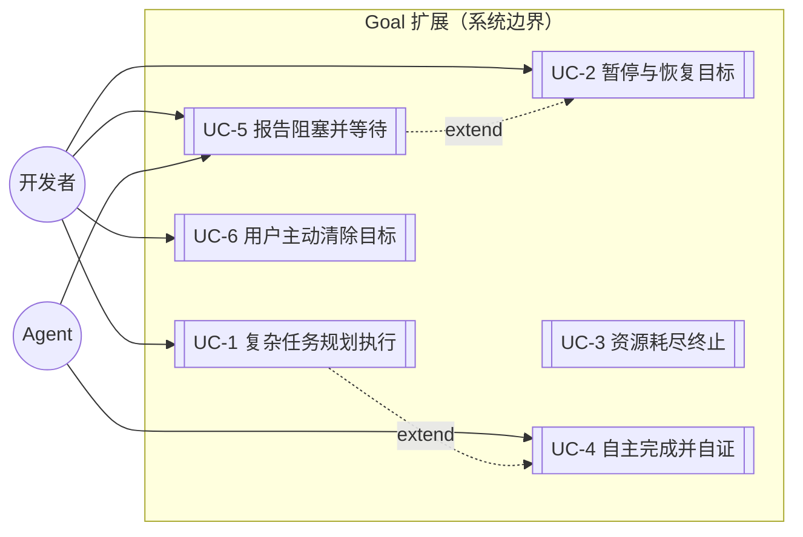
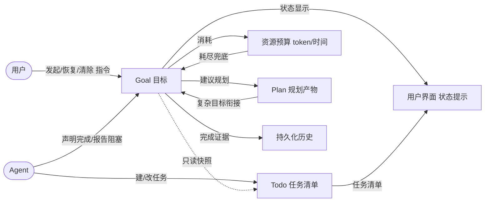
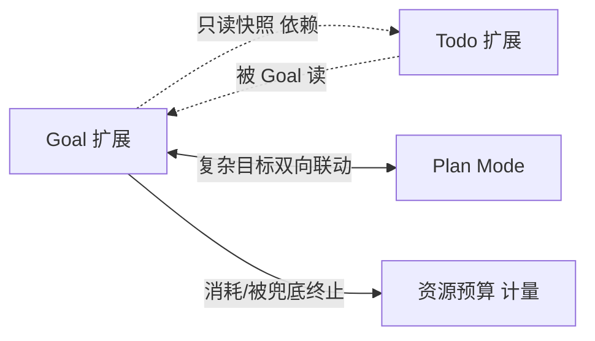

# Goal V2 Refactor：对标 Codex 的能力升级

## 1. 业务目标（Business Goals）

### 背景

Pi 的 **Goal** 扩展提供「持久化自主循环」：用户发起一个目标，agent 在预算约束下持续工作直到目标达成、被阻塞、或资源耗尽。当前实现相对参考实现 Codex 有架构优势（分层、预算维度、续跑去抖），但存在三个业务级差距——它们直接影响**用户能否可靠地把目标交给 agent 完成**：

1. **用户无法干净地叫停**：没有"暂停"状态，用户想中途插入指令或思考时，只能强行中断，目标状态会变得混乱。
2. **资源耗尽可能漏触发**：预算检查分散在事件处理器里，依赖正确调用，存在"预算耗尽但 goal 没终止、继续空转烧资源"的风险。
3. **两套任务系统打架**：Goal 内嵌的任务系统与独立的 Todo 扩展并存，需要用提示词硬规则禁用其中一个，agent 容易混淆、用户心智负担重。

### 目标树

> 成功标准含「行为级 AC（已写在各 UC）」+「量化验收指标」两类。量化指标用于验收期可衡量判定；预警百分比等实现口径属②系统设计。

- **G1: 用户可可靠地把目标交给 agent，并在过程中随时干预** — 成功标准: 任意时刻用户可暂停/恢复目标，且暂停期间 agent 不消耗预算
  - G1.1: 用户能干净地暂停与恢复目标，不丢上下文 — 量化: 暂停/恢复指令后 agent 续跑在 ≤1 个 turn 内停止/恢复；恢复后任务清单 0 丢失
  - G1.2: agent 卡住时有明确信号，用户能据此介入 — 量化: 阻塞态对用户可见延迟 ≤1 turn；阻塞态下预算消耗为 0
- **G2: 目标一定会有明确的终态，不会无限空转烧资源** — 成功标准: 预算耗尽必然终止；agent 自主判定完成时需自证（不允许无证据完成）
  - G2.1: 资源约束（token/时间）是唯一兜底的终止手段，单一检查点不漏触发 — 量化: 预算耗尽后 ≤1 个持久化检查点内转入终态（漏触发次数 = 0）
  - G2.2: agent 完成 goal 应先完成所有任务（含验证任务）并给出证据 — 全解耦后为软建议（AI 自行决策，不强制）；量化: 无证据的完成尝试由 evidence 必填守卫拦截
- **G3: 任务管理单一来源，agent 与用户都不再面对两套系统** — 成功标准: Goal 内不再内嵌任务，统一用 Todo 扩展管理
  - G3.1: Goal 与 Todo 协作而不冲突，一个 goal 的任务清单来源唯一 — 量化: Goal 内嵌任务系统残留 = 0
  - G3.2: 复杂目标可先规划再执行，规划与执行无缝衔接 — 量化: plan 完成 → goal 启动的衔接需 ≤1 步用户动作（或全自动，见 UC-1）
- **G4: 职责边界清晰可预期** — 成功标准: 谁能终止 goal、谁能改状态，对用户和 agent 都无歧义（对齐 Codex 的心智模型）— 量化: 越界操作（如 agent 清除目标）拦截率 = 100%

### 达成路线

| 目标 | 路线/策略 | 对应用例 |
|------|---------|---------|
| G1.1 | 引入用户主导的"暂停"状态，暂停/恢复对称且不丢上下文 | UC-2 |
| G1.2 | agent 可主动报告"被阻塞"（与暂停行为对称的停止态），等用户介入 | UC-5 |
| G2.1 | 删除"按轮数/停滞自动终止"，改为资源约束单一兜底检查点 | UC-3 |
| G2.2 | 完成审计：agent 完成前软建议完成全部任务（含验证任务）并附证据（全解耦后不强制） | UC-4 |
| G3.1 | 合并两套任务系统为单一 Todo；Goal 通过只读快照读取任务进度 | UC-1, UC-4 |
| G3.2 | Goal 与 Plan 双向联动：复杂目标先进 Plan Mode 规划，规划完成自动衔接执行 | UC-1 |
| G4 | 状态转换严格三分层：agent（完成/阻塞）、用户（暂停/恢复/清除）、系统（资源耗尽） | UC-2, UC-3, UC-4, UC-5 |

## 2. 业务用例（Use Cases）

### 用例图

### UC-1: 复杂任务规划执行（plan → goal → todo → audit）

- **Actor**: 开发者（主）、Agent（协助）
- **前置条件**: 用户要完成一个较复杂的目标（如重构核心模块）
- **主流程**:
  1. 用户发起 goal，声明目标与资源预算
  2. Agent 判定任务复杂，建议先进 Plan Mode 规划
  3. 规划完成，规划结果自动衔接到 goal 执行
  4. Agent 按规划建立任务清单（含执行任务与验证任务）
  5. Agent 持续工作，逐项推进
  6. 全部任务（含验证任务）完成后，Agent 自主声明完成并给出证据
- **替代流程**: 任务简单时 Agent 跳过规划，直接建任务执行
- **异常流程**: 执行中遇到无法解决的阻碍 → 转 UC-5 报告阻塞
- **后置状态**: Goal 进入完成终态，附完成证据
- **关联目标**: G3.1, G3.2, G2.2
- **验收标准 (AC)**:
  - AC-1.1 [正常]: 复杂目标可走"规划→执行→完成"全流程，最终完成态附证据
  - AC-1.2 [异常]: 规划阶段或执行中遇阻可转 UC-5，不卡死
  - AC-1.3 [边界]: 简单目标可不规划直接执行，规划衔接不被强制

### UC-2: 用户叫停与恢复目标（暂停/恢复）

- **Actor**: 开发者
- **前置条件**: 目标处于执行中（活跃）状态
- **主流程**:
  1. 用户发出暂停指令
  2. 目标转为暂停态，agent 停止续跑
  3. 暂停期间用户可插入其他指令、修改任务清单
  4. 用户发出恢复指令
  5. 目标恢复为活跃态，基于最新任务清单继续执行
- **替代流程**: 从"被阻塞"态恢复（同样需恢复为活跃并重检资源）
- **异常流程**:
  - 进程崩溃后重启，暂停态应保持（不自动恢复成活跃）
  - 恢复时重检资源若已超预算 → 直接转资源耗尽终态（budget_limited/time_limited）并提示"已超预算，需先清除"，不续跑（避免恢复瞬间又触发 budget 兜底导致重复通知；终态是确定归宿）
- **后置状态**: 目标恢复活跃，或转资源耗尽终态
- **关联目标**: G1.1
- **验收标准 (AC)**:
  - AC-2.1 [正常]: 暂停期间 agent 不续跑、不消耗预算
  - AC-2.2 [正常]: 恢复后基于最新任务清单继续，不丢上下文
  - AC-2.3 [边界]: 崩溃重启后暂停态保持，不自动恢复
  - AC-2.4 [异常]: 恢复时若已超预算，转资源耗尽终态（budget_limited/time_limited）并提示，不续跑（实现：checkBudgetOnResume 超限 → transitionStatus 终态）

### UC-3: 资源耗尽自动终止

- **Actor**: 预算系统（自动，无人为触发）
- **前置条件**: 目标活跃且持续消耗资源
- **主流程**:
  1. Agent 持续工作消耗 token / 时间预算
  2. 预算系统在统一检查点检测到资源耗尽
  3. 目标转入资源耗尽终态（区分 token 耗尽 / 时间耗尽）
  4. 通知用户终止原因，agent 不再续跑
- **替代流程**: 资源接近耗尽时（如 70%/90%）提前预警并引导收尾
- **异常流程**: agent 忘记主动声明完成 → 不自动替它完成，由资源耗尽兜底终止
- **后置状态**: 目标进入资源耗尽终态
- **关联目标**: G2.1
- **验收标准 (AC)**:
  - AC-3.1 [正常]: 预算耗尽必然终止，不漏触发（单一检查点）
  - AC-3.2 [正常]: 终态区分 token 耗尽与时间耗尽，用户能看出是哪种资源
  - AC-3.3 [边界]: agent 忘记主动完成时不被自动"帮"完成，由预算兜底

### UC-4: Agent 自主完成并自证

- **Actor**: Agent
- **前置条件**: 目标活跃，Agent 认为已达成目标
- **主流程**:
  1. Agent 确认任务清单中所有任务（含验证任务）已完成（软建议，AI 自行决策）
  2. Agent 主动声明目标完成，并提交完成证据
  3. 系统校验 evidence 必填 + status==active（全解耦后不再校验任务清单完整性）
  4. 校验通过，目标进入完成终态
- **替代流程**: 若关联了规划，引导 Agent 核对规划步骤是否全部执行（软提醒，无硬阻断——全解耦后无任何硬检查）
- **异常流程**: evidence 缺失 → 拒绝完成并提示（任务未完成不再拒绝，仅 prompt 软建议）
- **后置状态**: 目标进入完成终态，附证据
- **关联目标**: G2.2, G3.1
- **验收标准 (AC)**:
  - AC-4.1 [正常]: 全部任务（含验证任务）完成后可声明完成并附证据（软建议，非强制）
  - AC-4.2 [异常]: evidence 缺失时拒绝完成（全解耦后任务清单状态不再作为拒绝条件）
  - AC-4.3 [边界]: 验证任务不可被取消（数据模型层）；常规任务可取消——完成检查已移除，不再强制
  - AC-4.4 [边界]: 全解耦后 Goal 不读 Todo，无"Todo 未加载降级"概念——完成不受 Todo 影响
  - AC-4.5 [边界]: plan 步骤未全部执行时仍允许完成（plan 对照是软提醒，全解耦后无硬检查）

### UC-5: Agent 报告阻塞并等待用户介入

- **Actor**: Agent（主动报告）、用户（介入）
- **前置条件**: 目标处于活跃态，Agent 多次尝试仍无法推进
- **主流程**:
  1. Agent 主动报告"被阻塞"，说明阻塞原因
  2. 目标转为阻塞态（与暂停行为对称：不续跑、不消耗预算）
  3. 阻塞期间任务清单仍可操作（用户可据此调整）
  4. 用户介入解决后发出恢复指令，目标恢复活跃
- **替代流程**: 用户判断目标无价值 → 转 UC-6 主动清除
- **异常流程**:
  - 非活跃态下报告阻塞被拒绝（语义不成立）
  - 进程崩溃后重启，阻塞态应保持（与暂停态对称，不自动恢复成活跃）
- **后置状态**: 目标恢复活跃，或维持阻塞态等待
- **关联目标**: G1.2, G4
- **验收标准 (AC)**:
  - AC-5.1 [正常]: 阻塞态不续跑、不消耗预算，等用户介入
  - AC-5.2 [正常]: 用户可恢复阻塞态目标
  - AC-5.3 [边界]: 非活跃态（如已暂停）下报告阻塞被拒绝
  - AC-5.4 [边界]: 崩溃重启后阻塞态保持，不自动恢复

### UC-6: 用户主动清除目标

- **Actor**: 开发者
- **前置条件**: 用户决定放弃当前目标
- **主流程**:
  1. 用户发出清除指令
  2. 目标进入取消终态（不可逆）
  3. agent 不再续跑
- **替代流程**: 活跃/暂停/阻塞态下有未完成目标时，再发起新目标应被拒绝，提示先恢复或清除
- **异常流程**: 已终态的目标再次清除 → 保持终态（幂等）
- **后置状态**: 目标进入取消终态
- **关联目标**: G4
- **验收标准 (AC)**:
  - AC-6.1 [正常]: 清除后目标进入取消终态，不再续跑
  - AC-6.2 [边界]: 存在未终态目标时发起新目标被拒绝（提示先恢复/清除）

## 3. 数据流转（Data Flow）

### 数据流图

### 数据清单

| 数据 | 来源 | 处理 | 消费者 | 归档策略 | 敏感级别 |
|------|------|------|--------|---------|---------|
| Goal 状态（活跃/暂停/阻塞/各终态） | 用户指令、Agent 声明、预算系统 | 状态机转换 | 用户界面、续跑决策 | 随会话持久化 | 内部 |
| 资源预算（已用 token / 已用时间） | 每轮对话累加 | 单一检查点判定是否耗尽 | 终止决策、预警提示 | 随会话持久化 | 内部 |
| 任务清单（执行任务 + 验证任务） | Agent / 用户创建增删 | 完成审计软建议（prompt） | 进度展示 | 随会话持久化 | 内部 |
| 完成证据 | Agent 声明完成时提交 | 校验后存档 | 完成终态记录 | 随会话持久化 | 内部 |
| 规划产物 | Plan Mode 产出 | 复杂目标衔接时读取 | 建任务引导、完成审计软提醒 | 项目 `.xyz-harness/` 文件 | 内部 |

## 4. 功能清单（Features）

> 业务功能（非技术实现）。技术实现（状态机字段、工具签名、模块拆分）属下游 ②系统设计 / ⑤代码架构，不在本阶段展开。

| 编号 | 功能 | 对应用例 | 关联目标 |
|------|------|---------|---------|
| F1 | 任务管理单一来源：Goal 不内嵌任务，统一用 Todo 管理，Goal 只读任务进度 | UC-1, UC-4 | G3.1 |
| F2 | 用户暂停/恢复：干净叫停、恢复不丢上下文、暂停不耗预算 | UC-2 | G1.1 |
| F3 | Agent 报告阻塞：与暂停行为对称的停止态，等用户介入 | UC-5 | G1.2 |
| F4 | 资源耗尽兜底终止：唯一终止兜底手段，单一检查点不漏触发 | UC-3 | G2.1 |
| F5 | Agent 自主完成并自证：完成前须完成全部任务（含验证任务）并附证据 | UC-4 | G2.2 |
| F6 | 职责三分层：agent（完成/阻塞）、用户（暂停/恢复/清除）、系统（资源耗尽）各司其职 | UC-2, UC-3, UC-4, UC-5, UC-6 | G4 |
| F7 | Goal 与 Plan 双向联动：复杂目标先规划后执行，规划完成自动衔接 | UC-1 | G3.2 |

## 5. UI/UX 场景（Interface Scenarios）

> 本需求交互界面为编辑器内的状态提示/命令面板与命令行式 `/goal` 指令，无独立页面级 UI。

### 交互流程

- **发起**：用户输入 `/goal <目标>`（可带预算）→ 进入活跃态，状态栏显示目标与剩余预算。
- **暂停/恢复**：用户 `/goal pause` → 状态栏切到暂停态、agent 停续跑；`/goal resume` → 切回活跃、继续。
- **查看状态**：状态栏/状态提示始终反映当前状态（活跃/暂停/阻塞/各终态）及剩余预算。
- **预警**：预算达 70%/90% 时主动提示用户注意 / 引导收尾。
- **终止通知**：资源耗尽或完成时通知用户终止原因（含完成证据）。
- **Agent 触发的状态变化**（UC-4 完成 / UC-5 阻塞）：agent 主动触发的状态变化需在用户侧主动提示（非被动等待用户查状态栏）——完成时展示证据摘要，阻塞时高亮提示阻塞原因，确保用户能及时感知 agent 自主行为。
- **错误/拒绝反馈**：操作被拒绝时（如非活跃态 pause/resume、恢复时已超预算、完成时 evidence 缺失、存在未终态目标时发起新目标）需有明确回显，告知用户被拒原因与建议动作。

### 状态可见性

- 每个状态（活跃/暂停/阻塞/完成/资源耗尽/取消）都需在界面有对应显示，用户一眼能看出 goal 处于哪个阶段。
- 暂停与阻塞外观应可区分（触发主体不同：暂停=用户，阻塞=agent）。
- 资源耗尽终态应区分 token 耗尽 / 时间耗尽（UC-3 AC-3.2）。

## 6. 系统间功能关联（Cross-System）

### 关联图

### 关联清单

| 关联系统 | 依赖方向 | 交互方式 | 契约稳定性 |
|---------|---------|---------|-----------|
| Todo 扩展 | 全解耦：Goal 不读 Todo（原只读快照已移除） | 独立运行，互不依赖 | 稳定（单一任务来源） |
| Plan Mode | 双向：Goal 检测复杂度建议规划；规划完成衔接 Goal 执行 | 运行时检测可用性 + 衔接（plan 完成→自动衔接 goal 启动，≤1 步用户动作） | 稳定（两者解耦，按可用性降级） |
| Plan Mode / Coding Workflow | Goal 对外提供启动入口（出向） | 其他扩展通过 Goal 暴露的启动接口发起 goal（衔接执行） | 稳定 |
| 资源预算计量 | Goal 产生消耗，预算系统兜底终止 Goal | 每轮累加 + 单一检查点 | 稳定（核心兜底机制） |

## 7. 约束（Constraints）

- **业务约束**:
  - 对齐参考实现 Codex 的核心心智模型：不依赖"轮数/停滞自动终止"，信任 agent 自主完成/报告阻塞 + 资源预算兜底。
  - 职责三分层不可越界（agent 不能替用户清除目标，用户指令优先）。
- **技术约束（仅记录不展开）**:
  - 技术栈 TypeScript + Pi 扩展 API；会话持久化（无独立数据库）。
  - 跨扩展协作用鸭子类型编程式接口（不合并扩展）。
  - 事件串行、工具执行可能并发的并发模型。

## 8. 不做（Out of Scope）

- **不**做自动完成：agent 忘记主动声明完成时，系统不替它自动完成（由资源耗尽兜底终止）。
- **不**做按轮数/停滞自动终止：删除"最大轮数""连续停滞自动阻塞"等自动终态路径，终止只靠资源预算 + 主动声明 + 用户清除。
- **不**保留两套任务系统：Goal 内嵌任务系统废弃，不与 Todo 并存。
- **不**做 plan 完成审计的硬校验：完成时对规划步骤的核对是提示词驱动的软提醒（全解耦后无任何硬校验，todo 完成状态也不再检查）。
- **不**在暂停期间冻结任务清单：暂停是 agent 停跑，用户/agent 仍可调整任务。
- **不**做 `/goal abort`：语义与清除重叠，统一用清除。

## 决策记录

> 完整决策链（D1–D29）见 `clarification.md`。本阶段（①澄清需求）的关键业务级决策摘要：

- **D1（合并任务系统）**: 删除 Goal 内嵌任务 CRUD，统一用 Todo（对应 F1）。
- **D2/D15（任务模型）**: Todo 四态（待办/进行中/完成/取消）+ 可选验证任务标记；完成审计靠 prompt 软建议（全解耦后不强制，对应 F5）。
- **D5/D20（暂停与阻塞对称）**: 新增暂停态；阻塞态与暂停行为对称（都不续跑、不耗预算），区别只在触发主体（对应 F2、F3）。
- **D6（职责三分层）**: agent=完成/阻塞、用户=暂停/恢复/清除、系统=资源耗尽，严格不越界（对应 F6）。
- **D11/D21/D22/D28（删自动终态）**: 删除轮数/停滞/自动完成等自动终态路径，对齐 Codex（对应 F4、"不做"）。
- **D23/D29（单一检查点）**: 资源耗尽兜底在持久化的单一出口完成，不分散（对应 F4）。
- **D26（复杂度判定）**: 规划联动复杂度由 LLM 自主判断，不硬编码阈值（对应 F7）。
- **D27（plan audit 软提醒）**: 完成时对规划步骤的核对为软提醒，非硬校验（对应"不做"）。

## 待确认

（全部业务级问题已在 `clarification.md` D1–D29 解决。无 `[UNRESOLVED]` / `[AMBIGUOUS]` 项。）

> **Round 1 追踪 gap 处理摘要**（见 `changes/tracing-clarity-round-1.md`，17 个 gap）：
> - **F 类（事实）已修复**：CONTEXT.md 过时（Todo 三态→四态、GoalTask 残留、Budget 四维度）已在 CONTEXT.md 同步更新；UC-5 补 blocked 崩溃恢复异常（AC-5.4）；§6 关联清单补出向依赖。
> - **K 类（已定/降级）**：plan 衔接自动性（D9 已定，≤1 步动作）、plan audit vs completion audit 优先级（D27 已定，AC-4.5 写明）、agent 触发态通知（已补 §5）、预警百分比基数/展示粒度（实现口径，移交②系统设计）。
> - **D 类（已裁决）**：resume 超预算行为（AC-2.4 拒绝恢复）、错误状态反馈呈现（已补 §5）。
> - **用户裁决**：① 成功标准需补充量化指标（已在目标树各子目标补「量化:」）；② 全解耦后 Goal 不依赖 Todo，无"Todo 缺失降级"概念（AC-4.4 已更新）。
