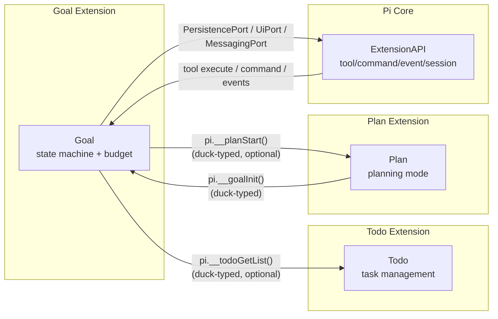
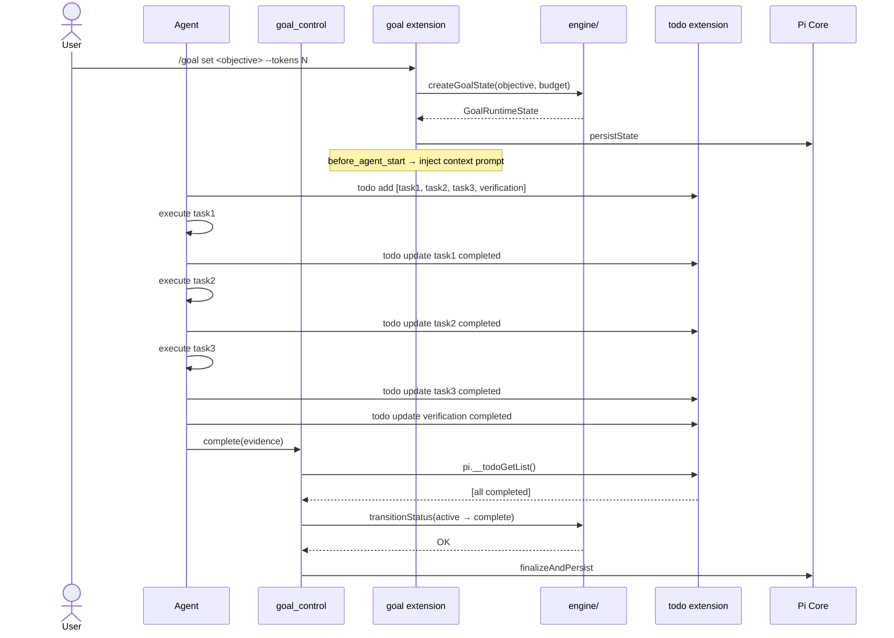
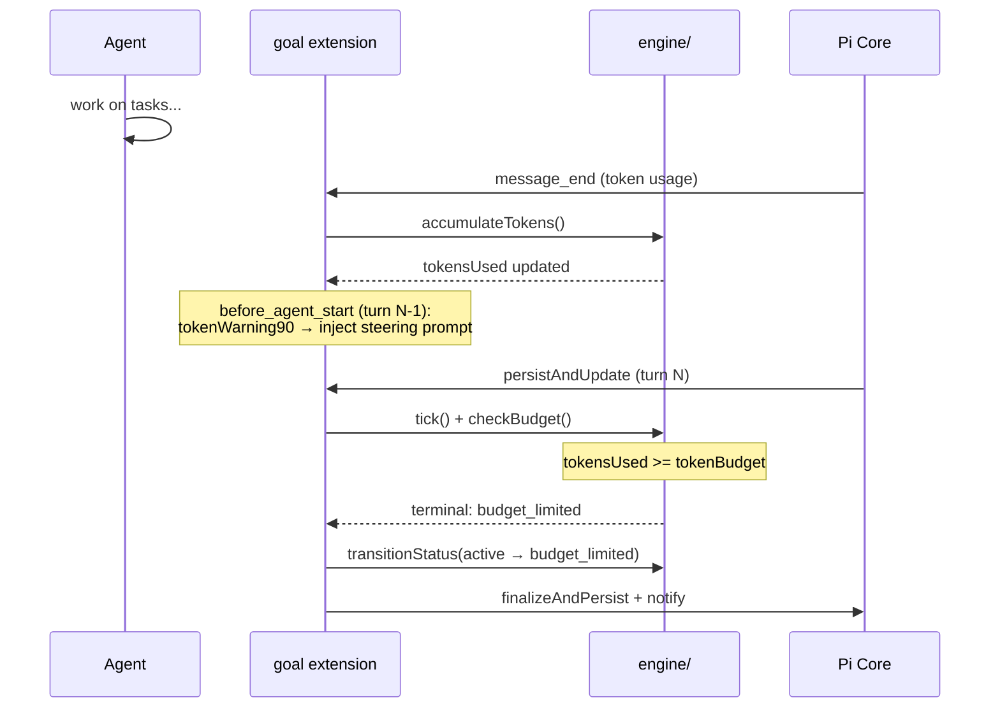
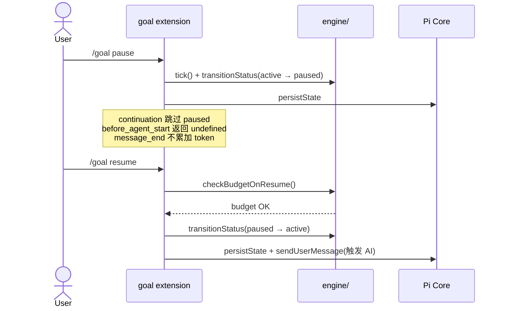

# Goal V2 架构设计

## 1. 目标转换

### 业务目标 → 系统目标

| 业务目标（spec FR） | 转换为系统目标 | 衡量标准 |
|---|---|---|
| FR-1: task+todo 合并 | 删除 engine/task.ts + GoalRuntimeState.tasks，goal 通过 pi.__todoGetList() 读 todo | goal extension 零 task CRUD 代码 |
| FR-2: goal_control 工具 | 新建 goal-control-adapter.ts（2 action），替代 tool-adapter.ts（10 action） | goal_manager tool 不存在 |
| FR-3: Paused 状态 | 扩展 GoalStatus 枚举 + VALID_TRANSITIONS 显式表 + handler 守卫 | /goal pause/resume 工作 |
| FR-4: 权限三分层 | agent(goal_control) / user(/goal) / system(persistAndUpdate 事件路径 budget 兜底) 各自收口转换路径 | 无越权路径 |
| FR-5: budget 单一检查点 | persistAndUpdate（事件路径）内兜底 + agent_end 只做 warning/steering | 终态转换只在 persistAndUpdate |
| FR-6: completion audit | prompt 驱动（全解耦：complete 不检查 todo，AI 自行决策） | evidence 缺失时拒绝 |
| FR-7: plan↔goal 联动 | 全解耦：goal 恒定建议 plan mode（不再探测 pi.__planStart）+ LLM 复杂度判定 | goal 启动提示 plan |

### 搭便车改造目标

| 改造目标 | 动机 | 关联业务目标 |
|---|---|---|
| event-adapter 按事件拆分 | 737 行 6 handler 堆一起，变化轴不同 | FR-3/FR-4/FR-5 几乎全改 event-adapter |
| 删除 maxTurns/stall 自动终态 | 对齐 Codex，消除权限冲突 | FR-4 |
| BudgetConfig 精简 | 删 maxTurns + maxStallTurns，只剩 tokenBudget + timeBudgetMinutes | FR-5 |

## 2. 设计立场

**核心计算是什么？** Goal 是一个带 budget 约束的生命周期状态机。核心计算 = 状态转换 + budget 计量 + context prompt 注入。

**分层决策：** 3 层（engine / adapters / service+projection）。engine 是纯领域层（零 Pi 依赖），adapters 是接口层（Pi 桥接），service+projection 是应用层（协调+渲染）。不套 DDD 四层，因为核心计算是纯领域规则（状态机+预算），不是复杂的业务流程编排。

## 3. 统一语言

| 术语 | 定义 | 备注 |
|---|---|---|
| Goal | 带 budget 的生命周期单元，7 状态 | aggregate root |
| Todo | 任务项（pending/in_progress/completed/cancelled），todo extension 管理 | goal 不内嵌，跨扩展读取 |
| ProgressInput | todo 数据的 engine 层投影（completedCount/totalCount/incompleteIds/hasVerificationPending） | DTO，adapter→engine |
| BudgetConfig | 预算配置（tokenBudget/timeBudgetMinutes） | 值对象 |
| GoalControl | 新工具，agent 用，2 action：complete/report_blocked | 替代 goal_manager |
| persistState | 持久化函数（command/tool 路径，无 budget 检查） |
| persistAndUpdate | 事件路径持久化函数，内含 budget 兜底检查 | 单一检查点（见 NFR F2） |

## 4. 核心模型

| 模型 | 类型 | 不变式 | 建模理由 |
|---|---|---|---|
| GoalRuntimeState | aggregate | status 终态不可逆；tokensUsed >= tokenBudget → 必须转 budget_limited；**重构删除：tasks/stallCount** | Goal 的运行时完整状态 |
| BudgetConfig | 值对象 | tokenBudget > 0, timeBudgetMinutes > 0；**重构删除：maxTurns/maxStallTurns** | 预算配置 |
| ProgressInput | DTO | totalCount >= completedCount >= 0；incompleteIds ⊆ {1..totalCount}；hasVerificationPending=true → incompleteIds 含 isVerification todo | adapter→engine 的数据契约 |
| GoalStatus | 值对象（枚举） | 7 值（含 paused），终态集合不可变 | 状态机身份 |
| VALID_TRANSITIONS | 值对象（Map） | 终态 → 空数组 | 转换合法性查表 |
| Todo（跨扩展） | 实体（todo extension） | id 唯一；status 四态；isVerification=true 不可 cancelled | goal 通过 pi.__todoGetList() 读取 |

### 降级决策（主动不建模）

| 概念 | 为什么不建模 | 应有的处理 |
|---|---|---|
| Task（goal 内嵌） | 合并到 todo extension，goal 不再拥有 task | 通过 pi.__todoGetList() 读取 |
| Stall | Codex 无此概念，退化为 prompt 提醒 | 单 task 级 lastUpdatedTurn 检测 |
| Plan complexity | LLM 判定，不硬编码 | prompt 引导 agent 自行判断 |
| 预警 flag 合并 | 4 个 boolean 改 Set/位掩码收益低 | 保持 4 个独立 flag |

## 5. 状态流转

### Status 枚举（只描述阶段）

```typescript
type GoalStatus =
  | "active"          // 工作中
  | "paused"          // 用户暂停
  | "blocked"         // agent 报告卡住
  | "complete"        // agent 完成（终态）
  | "budget_limited"  // token 耗尽（终态）
  | "time_limited"    // 时间耗尽（终态）
  | "cancelled"       // 用户取消（终态）
```

### 终态集合（不可逆）

```typescript
const TERMINAL_STATUSES = new Set(["complete", "budget_limited", "time_limited", "cancelled"]);
```

### Reason 字段（终态原因正交性 — 特化决策：不单独建模）

通用 DDD 规范要求 Status（阶段）与 Reason（终态原因）正交：Status 只描述「现在处于哪个阶段」，终态原因独立为 Reason 字段，避免「原因编码进状态名」。

**本系统特化决策：终态原因直接编码进状态名，不单独建 Reason 字段。** 理由：

1. **终态原因是封闭且互斥的枚举，不增长**：`complete`（达成）/`budget_limited`（token 耗尽）/`time_limited`（时间耗尽）/`cancelled`（用户清除）是终止条件的**完整且不重叠**枚举。不存在「同一终态多种原因」的情况，也不预期新增第 5 种终止原因（对齐 Codex，终止只有这 4 类）。当原因是封闭枚举时，编码进状态名比 join 一个 Reason 字段更直接、更不易错——查一次状态即知一切。
2. **Reason 字段的价值在「原因可组合 / 会增长」时才显现**：如订单系统 `cancelled` 可由"用户取消/超时/风控"导致且影响后续逻辑——那里 Reason 是必需的。Goal 不存在此需求。
3. **对齐 Codex 心智模型**：Codex 的 `GoalStatus` 本身就是 `Complete | BudgetLimited | ...` 终态枚举（非 terminal+Reason 拆分）。保持一致是本次重构目标。
4. **拆成 terminal+Reason 无新能力**：会把 4 状态压成 1 个 `terminal`，但 VALID_TRANSITIONS、widget 显示、budget 检查点都要改成「读 Reason」——全是改动，零新能力。

> **触发重构条件**：若未来出现「同一终态多原因」或「终止原因会增长」（如新增 `aborted_by_error` 等可组合原因），则需重构为 `terminal` + Reason 字段。当前无此预期，保持现状。

（注：此处显式讨论 Reason 字段以满足状态正交性检查；决策为「特化不建模」，记录于 §10。）

### Resume 转换副作用

`/goal resume`（paused→active 或 blocked→active）副作用序列：
1. `checkBudgetOnResume` — tokensUsed >= tokenBudget → 拒绝 resume
2. `tickState` — timeStartedAt 重置
3. `transitionStatus(paused/blocked → active)` — 查 VALID_TRANSITIONS
4. `persistState` — 持久化
5. `sendUserMessage` — 触发 AI

### 合法转换（显式表）

```
active ──→ paused          (user: /goal pause)
active ──→ blocked         (agent: goal_control report_blocked)
active ──→ complete        (agent: goal_control complete)
active ──→ budget_limited  (system: persistAndUpdate 兜底，事件路径)
active ──→ time_limited    (system: persistAndUpdate 兜底，事件路径)
active ──→ cancelled       (user: /goal clear)
paused ──→ active          (user: /goal resume)
paused ──→ cancelled       (user: /goal clear)
blocked ──→ active         (user: /goal resume)
blocked ──→ cancelled      (user: /goal clear)
complete ──→ (无)
budget_limited ──→ (无)
time_limited ──→ (无)
cancelled ──→ (无)
```

### VALID_TRANSITIONS 定义

```typescript
const VALID_TRANSITIONS: Record<GoalStatus, GoalStatus[]> = {
  active:         ["paused", "blocked", "complete", "budget_limited", "time_limited", "cancelled"],
  paused:         ["active", "cancelled"],
  blocked:        ["active", "cancelled"],
  complete:       [],
  budget_limited: [],
  time_limited:   [],
  cancelled:      [],
};
```

### 各状态运行时行为

| 行为维度 | active | paused | blocked | 终态 |
|---|---|---|---|---|
| 续跑（continuation） | 是（tokenDelta>0 去抖；budgetTight→steer，否则 followUp） | 否 | 否 | 否 |
| budget 检查（persistAndUpdate，事件路径） | 是 | 否 | 否 | N/A |
| context 注入（before_agent_start） | 是 | 否 | 否 | N/A |
| token 累加（message_end） | 是 | 否 | 否 | N/A |
| ESC 行为 | 保持 active | 保持 paused | 保持 blocked | N/A |
| agent_end notify | 终态时发通知 | N/A | 发 "Goal blocked" notify | 是 |

## 6. 分层架构

### 层级图

```
┌─────────────────────────────────────────────────────────┐
│  Interface Layer (adapters/)                            │
│  ┌──────────────┐ ┌──────────────┐ ┌─────────────────┐ │
│  │ goal-control │ │ command-     │ │ event-adapter   │ │
│  │ -adapter.ts  │ │ adapter.ts   │ │ (薄路由)         │ │
│  │              │ │              │ │ ┌─────────────┐ │ │
│  │ complete()   │ │ /goal set    │ │ │handlers/    │ │ │
│  │ report_      │ │ /goal pause  │ │ │before-agent │ │ │
│  │   blocked()  │ │ /goal resume │ │ │-start.ts    │ │ │
│  │              │ │ /goal clear  │ │ │agent-end.ts │ │ │
│  │              │ │ /goal status │ │ │message-end  │ │ │
│  │              │ │ /goal update │ │ │turn-end.ts  │ │ │
│  │              │ │ /goal history│ │ │agent-start  │ │ │
│  │              │ │              │ │ │session-start│ │ │
│  └──────────────┘ └──────────────┘ │ └─────────────┘ │ │
│                                    └─────────────────┘ │
├─────────────────────────────────────────────────────────┤
│  Application Layer (service.ts + projection/)           │
│  ┌──────────────────────────────────────────────────┐  │
│  │ service.ts (~300 行)                              │  │
│  │ - createGoal / finalizeAndPersist / persistState  │  │
│  │ - applyEvent (message_end/turn_end/agent_start)   │  │
│  │ - checkResumeBudget / tickState                   │  │
│  ├──────────────────────────────────────────────────┤  │
│  │ projection/ (widget.ts / prompts.ts / result.ts)  │  │
│  └──────────────────────────────────────────────────┘  │
├─────────────────────────────────────────────────────────┤
│  Domain Layer (engine/) — 零 Pi 依赖                   │
│  ┌──────────────┐ ┌──────────────┐ ┌──────────────┐   │
│  │ types.ts     │ │ goal.ts      │ │ budget.ts    │   │
│  │              │ │              │ │              │   │
│  │ GoalStatus   │ │ transition   │ │ tick         │   │
│  │ BudgetConfig │ │   Status()   │ │ checkBudget  │   │
│  │ GoalRuntime  │ │ isActive()   │ │ accumulate   │   │
│  │   State      │ │ isTerminal() │ │   Tokens()   │   │
│  │ ProgressInput│ │ createGoal   │ │ checkOnResume│   │
│  │ VALID_       │ │   State()    │ │              │   │
│  │  TRANSITIONS │ │              │ │              │   │
│  └──────────────┘ └──────────────┘ └──────────────┘   │
└─────────────────────────────────────────────────────────┘
```

### Port 清单

| Port | 价值定位 | 实现数 |
|---|---|---|
| PersistencePort | 持久化抽象（appendState / appendHistory） | 1（session entries） |
| UiPort | UI 操作抽象（widget / status / notify） | 1（pi TUI） |
| MessagingPort | 消息发送抽象（context / user message） | 1（pi steer/followUp） |
| SessionPort | 会话读取抽象（entries / contextUsage / signal） | 1（ctx.sessionManager） |

## 7. 模块划分与变化轴

| 模块 | 职责 | 变化轴 | LOC(预估) |
|---|---|---|---|
| `engine/types.ts` | 状态机类型定义 | 新增状态/预算字段 | ~100 |
| `engine/goal.ts` | 纯状态转换 | 新增状态转换规则 | ~80 |
| `engine/budget.ts` | 预算计量 | 新增预算维度 | ~180 |
| `adapters/goal-control-adapter.ts` | goal_control tool | 新增 action | ~120 |
| `adapters/command-adapter.ts` | /goal 命令 | 新增子命令 | ~350 |
| `adapters/event-adapter.ts` | 事件路由（薄） | 新增事件类型 | ~50 |
| `adapters/event-handlers/before-agent-start.ts` | context 注入 | prompt 变更、plan 联动 | ~180 |
| `adapters/event-handlers/agent-end.ts` | turn 结束处理 | budget 预警逻辑 | ~100 |
| `adapters/event-handlers/message-end.ts` | token 累加 | 新增 token 类型 | ~30 |
| `adapters/event-handlers/turn-end.ts` | turn 计数 | 稳定 | ~20 |
| `adapters/event-handlers/agent-start.ts` | agent 启动记录 | 稳定 | ~20 |
| `adapters/event-handlers/session-start.ts` | 状态恢复 | 迁移逻辑 | ~80 |
| `service.ts` | 应用协调 | 状态管理/persist 逻辑 | ~300 |
| `projection/widget.ts` | TUI 渲染 | 新增状态显示 | ~310 |
| `projection/prompts.ts` | prompt 生成 | prompt 策略变更 | ~370 |
| `projection/result.ts` | 结果 DTO | 稳定 | ~40 |
| `persistence.ts` | 序列化 | 迁移逻辑 | ~120 |
| `session.ts` | session 管理 | 稳定 | ~150 |
| `ports.ts` | Port 定义 | 新增 port | ~70 |
| `index.ts` | 工厂入口 | 新增/删除 tool/command | ~300 |

### 删除清单

| 文件/模块 | 原因 |
|---|---|
| `engine/task.ts` | task 合并到 todo extension |
| `adapters/tool-adapter.ts` | goal_manager 10 action 废弃 |
| `adapters/actions.ts` | action 定义随 goal_manager 废弃 |
| `command-adapter.ts::handleAbort` | /goal abort 删除（D16） |
| GoalRuntimeState.tasks | goal 不再内嵌 task |
| GoalRuntimeState.stallCount | Codex 无 stall 概念 |
| BudgetConfig.maxTurns | Codex 无 maxTurns |
| BudgetConfig.maxStallTurns | 随 stallCount 一起删 |

### Handler 分支级删除（event-adapter 拆分时必须处理）

| 源码位置 | 删除内容 | 原因 |
|---|---|---|
| event-adapter.ts:587 handleAllTasksDone | maxTurnsReached→finalizeAndPersist(complete) 分支 | D21：删自动 complete |
| event-adapter.ts:631 handleNoTasksOrMaxTurns | maxTurnsReached→finalizeAndPersist(cancelled) 分支 | D22：删 maxTurns |
| event-adapter.ts:663 handleMaxTurnsReached | 整个函数删除 | D22 |
| event-adapter.ts:707 handleStallAndContinuation | stallCount++→blocked 分支 | D28：stall 退化为 prompt |
| event-adapter.ts:297 checkContextUsage | **保持** | 现有行为 |
| event-adapter.ts:182 handleTerminalStateBeforeAgent | **保持** AUTO_CLEAR_TURNS | 现有行为 |
| event-adapter.ts:157 handleTerminalStateAgentEnd | **保持** blocked notify | 现有行为 |

### 行为变更

| 源码位置 | 当前行为 | 变更后 | 原因 |
|---|---|---|---|
| command-adapter.ts:212 handleSet | 覆盖非终态旧 goal | 拒绝覆盖，提示先 resume/clear | D25：对齐 Codex |
| service.ts agent_end checkBudgetOnTurnEnd | 检查 terminal→自动转终态 | 只做 warning/steering | D23：单一检查点 |

## 8. 系统间上下文边界（Context Map）



| 关联系统 | 关系模式 | 交互方式 | 契约稳定性 |
|---|---|---|---|
| Pi Core | 客户-供应商 | ExtensionAPI（tool/command/event/session） | 稳定（SDK 契约） |
| Todo Extension | 共享内核（可选） | pi.__todoGetList() duck-typed | 弱（optional，undefined=降级） |
| Plan Extension | 共享内核（可选） | pi.__planStart() / pi.__goalInit() duck-typed | 弱（optional） |

## 9. 泳道图（Swimlane）

### Goal 生命周期主流程



### Budget 兜底流程



### Pause/Resume 流程



## 10. 挑战与决策

### D-A1: event-adapter 拆分策略

**张力**: 737 行 6 handler 堆一起 vs 拆分后文件数增加。
**决策**: 按事件类型拆分（6 个 handler 独立文件 + 薄路由层）。
**理由**: 6 个 handler 的变化轴不同（before_agent_start 改动最频繁，message_end 最稳定）。拆后每个 handler 独立可测，改动不误碰。

### D-A2: service.ts 保持单文件

**张力**: 700 行是否该拆 vs 重构后 ~300 行是否够用。
**决策**: 保持单文件，删 goal_manager 10 个 action 后 ~300 行。
**理由**: 300 行在合理范围内。goal_control 只有 2 个 action，不需要独立文件。

### D-A3: 跨扩展 API 保持 duck-typed

**张力**: duck-typed（灵活但无编译时检查）vs formal port（严格但需改 port 定义）。
**决策**: 保持 duck-typed（pi.__todoGetList / pi.__planStart）。
**理由**: 都是可选特性（undefined=降级），不是核心路径。建正式 port 过度设计。

### D-A4: 显式转换表 vs 宽松守卫

**张力**: 显式表（严格但维护成本高）vs 宽松守卫（只守终态，简单）。
**决策**: 显式转换表（VALID_TRANSITIONS: Record<GoalStatus, GoalStatus[]>）。
**理由**: 用户选择。与权限三分层双重保障。新增状态时必须更新表，是好的 forcing function。

### D-A5: BudgetConfig 精简

**张力**: 保留 maxTurns（向下兼容）vs 删除（对齐 Codex）。
**决策**: 删除 maxTurns + maxStallTurns，BudgetConfig 只剩 tokenBudget + timeBudgetMinutes。
**理由**: Codex 没有 maxTurns 概念。终态只靠 token/time budget。

### 特化决策

| 违反什么 | 为什么合理 | 触发变化怎么办 |
|---|---|---|
| engine 层通过 adapter 间接依赖 todo extension | engine 零 Pi 依赖不变；ProgressInput 是 adapter 组装后注入的 DTO | todo API 变更时只改 adapter，不影响 engine |
| VALID_TRANSITIONS 可能与权限三分层重复 | 双重保障：代码路径收口 + 状态机查表 | 新增权限主体时两处都要更新 |
| persistAndUpdate（事件路径）同时做 persist + budget 检查 | 单一检查点（对齐 Codex SQL CASE），避免两个并行检查点的 race | budget 逻辑变更只改 persistAndUpdate 一处 |

## 11. 反模式检查（grep 验收清单）

### AC-1: task CRUD 消除
- 验证：`grep -rn "GoalTask\|create_tasks\|update_tasks\|add_subtasks\|delete_subtasks" extensions/goal/src/ --include="*.ts"` 无非注释输出

### AC-2: goal_manager 消除
- 验证：`grep -rn "goal_manager" extensions/goal/src/ --include="*.ts"` 无非注释输出

### AC-3: maxTurns/stallCount 消除
- 验证：`grep -rn "maxTurns\|maxStallTurns\|stallCount" extensions/goal/src/ --include="*.ts"` 无非注释输出

### AC-4: engine 零 Pi 依赖
- 验证：`grep -rn "@mariozechner" extensions/goal/src/engine/ --include="*.ts"` 无输出

### AC-5: 状态机用显式转换表
- 验证：`grep -rn "VALID_TRANSITIONS" extensions/goal/src/ --include="*.ts"` 有输出

### AC-6: 终态集合一致
- 验证：`grep -rn "TERMINAL" extensions/goal/src/ --include="*.ts"` 只有一处定义

### AC-7: persistAndUpdate（事件路径）内 budget 检查
- 验证：`grep -rn "checkBudgetOnTurnEnd\|terminal" extensions/goal/src/service.ts` 在 persistAndUpdate 函数内有输出（budget 判定委托 engine/budget.ts，非 service 内联直比较）

## 下游衔接

### 喂给 Step 3（Issue 拆分）的部分

| 本文档章节 | issue 拆分用途 |
|---|---|
| §7 删除清单 | P0: 删除 task CRUD / goal_manager / maxTurns / stallCount |
| §7 模块划分 | P0: 新建 goal-control-adapter / event-handlers 拆分 |
| §5 状态流转 | P0: VALID_TRANSITIONS + paused 状态实现 |
| §6 Port 清单 | P1: ProgressInput 注入 / __todoGetList 集成 |
| §10 决策 | P1: plan↔goal 联动（duck-typed API） |
