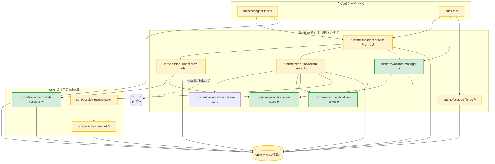
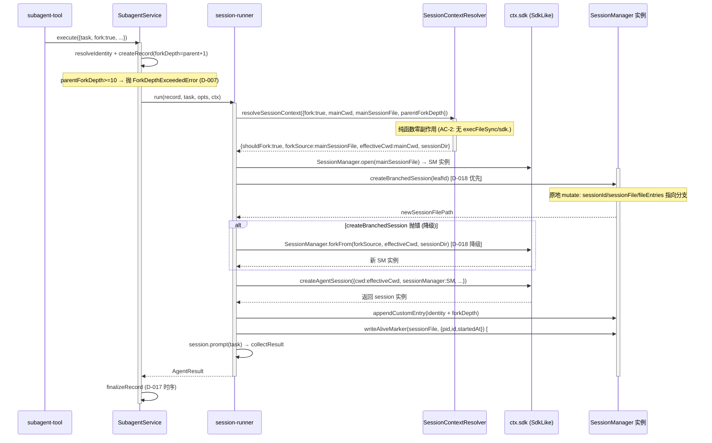
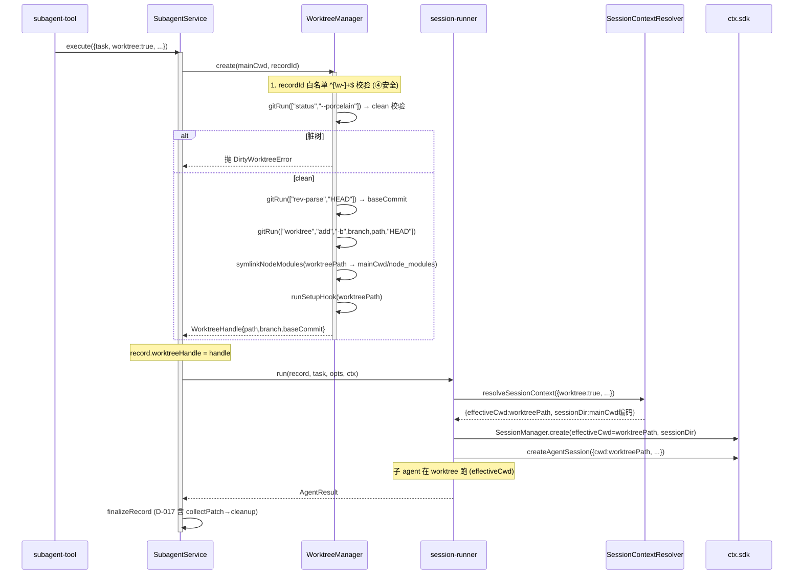
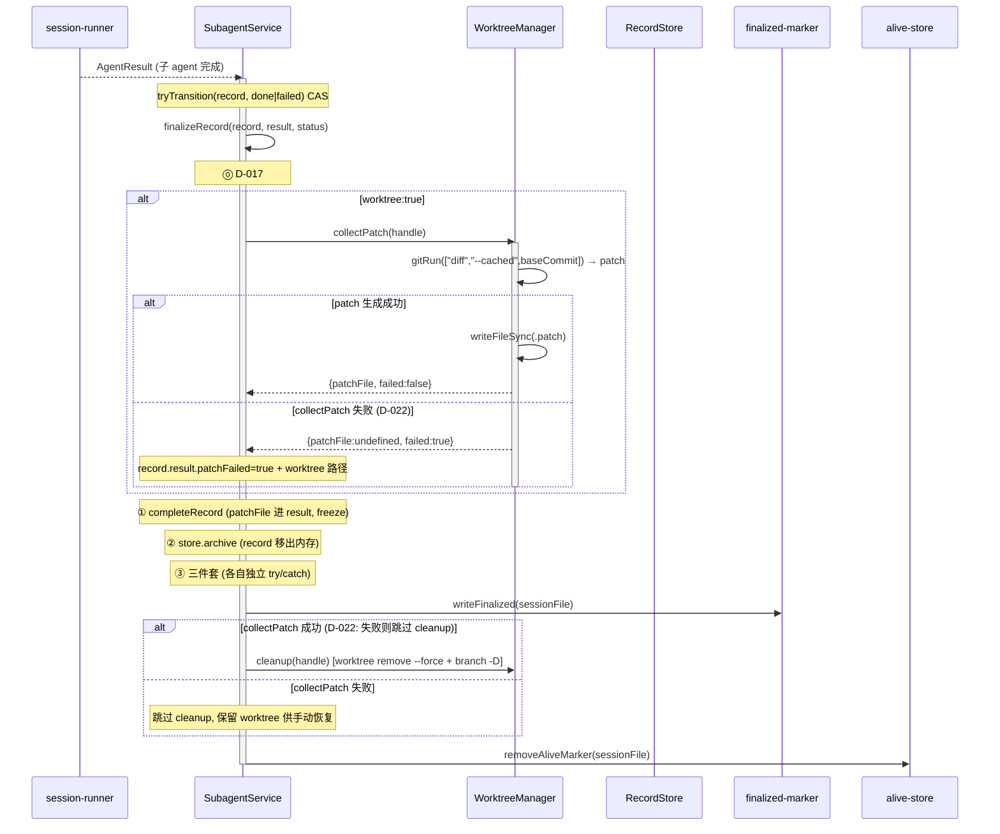
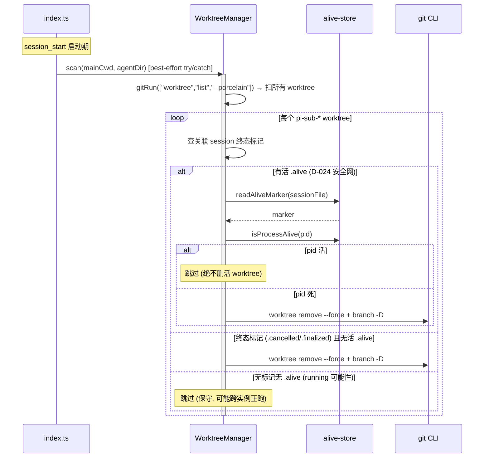
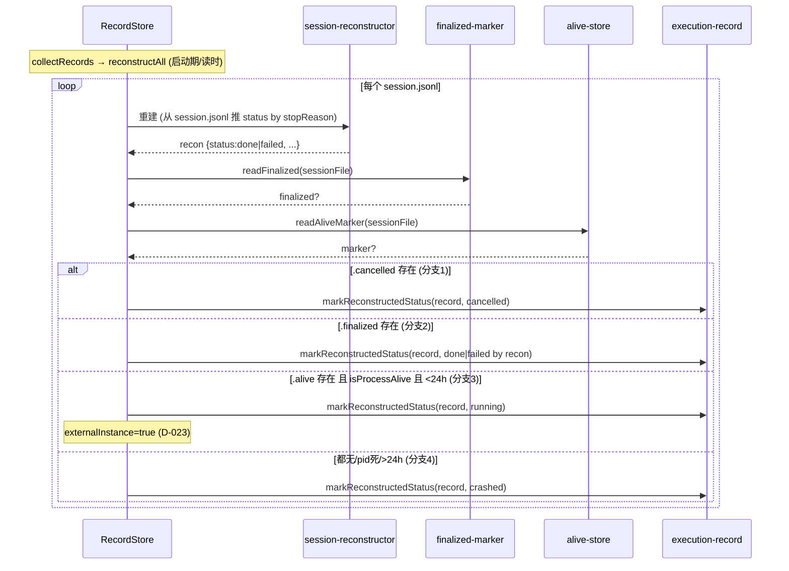

# 代码架构设计 — subagent fork + worktree 能力增强

> ①②③④ 全部 completed（gate PASS）。本阶段把设计结论落成具体代码架构：工程目录、API 契约（签名表）、功能时序图、测试矩阵、骨架验证。
>
> **决策账本纪律**：D-001~D-027 全部 status=confirmed（D-011 被 D-019 superseded）。本阶段不重新确认已拍板决策；Step 6b 若骨架证伪上游结论须标 `[REVISIT of D-NNN]` 走反哺。
>
> **Step 1 必问决策点判定（4 点均已被上游 confirmed 决策消除歧义，= agent 自决，无需 ask_user）：**
> 1. 工程目录粒度/边界 → **D-009/D-013 已定**：新模块归层（Runtime 执行域 / Core 编排子层），每个模块=一个变化轴，映射现有三层目录。无新歧义。
> 2. API 契约抽象深度 → **D-019 已定**：删 GitPort，git 调用内联 WorktreeManager.gitRun（git CLI 极稳定，seam 价值近零）；SDK 经 SdkLike 鸭子类型（D-016 声明 subset）。Deep Module 词汇：WorktreeManager/alive-store/FinalizedMarker 是深模块（小 interface + 大 implementation）。
> 3. 包依赖严格度 → **②§11 grep 规则 + D-003 已定**：in-process 单后端，Core 零 Pi 依赖（session-context-resolver.ts 禁 import pi），Runtime 编排 Core。严格边界无特例。
> 4. 异常路径覆盖深度 → **D-026 已定**：~12 个 AC 从 grep 升级为带断言行为测试；时序图每 alt/else = 一个异常用例（来源 A），NFR ④ `验收方式=代码测试` 每条 = ≥1 用例（来源 B）。

## 1. 工程目录

> 从 system-architecture §7 模块划分推导。每目录 = 一个变化轴。**新增模块**标 ★，**修改模块**标 ✎。

```text
extensions/subagents/src/
├── core/                        # Core 编排子层（纯计算，零 Pi 依赖，可单测）
│   ├── execution-record.ts     # ✎ #2 加 crashed 终态 + markReconstructedStatus
│   ├── session-reconstructor.ts# ✎ #2 crashed 判定上移 record-store
│   ├── session-context-resolver.ts # ★ #3 NEW — resolveSessionContext 纯函数（零副作用零 Pi import）
│   └── ...（path-encoding / output-collector / turn-limiter 等不变）
├── runtime/                     # Runtime 执行域（编排 Core + 外部副作用：git/IO）
│   ├── execution/
│   │   ├── record-store.ts     # ✎ #2/#12 reconstructAll 四分支 + STATUS_PRIORITY 加 crashed
│   │   ├── tombstone-store.ts  # （不变——.cancelled sidecar 范式被 .finalized/.alive 复用）
│   │   ├── finalized-marker.ts # ★ #5 NEW — write/readFinalized（对称 .cancelled sidecar）
│   │   └── alive-store.ts      # ★ #13 NEW — write/read/removeAliveMarker + isProcessAlive（pid 探活）
│   ├── worktree-manager.ts     # ★ #4 NEW — create/cleanup/scan/collectPatch + 私有 gitRun（D-019 无 GitPort）
│   ├── subagent-service.ts     # ✎ #7 汇合点 — 持有 WorktreeManager/FinalizedMarker，D-017 finalizeRecord 时序
│   ├── session-file-gc.ts      # ✎ #10 walkAndClean 加清 .finalized/.alive（清 .alive 先探活）
│   └── ...（model-config-service / notifier / discovery-config 等不变）
├── tools/
│   └── subagent-tool.ts        # ✎ #8 StartParam schema 加 fork?/worktree?/cwd?（命名 worktree 非 isolation，D-008）
├── types.ts                    # ✎ #1 编译基石 — ExecutionStatus +crashed / SdkLike +forkFrom/createBranchedSession / SessionRunnerContext 拆 cwd / SubagentRecord +externalInstance / WorktreeHandle VO / AliveMarker
├── index.ts                    # ✎ #9 session_start 挂 WorktreeManager.scan（reaper）+ 缓存 mainSessionFile
└── ...（tui/ commands/ utils/ 不变）
```

**每目录职责 + 变化轴 + 依赖方向：**

| 目录 | 职责 | 变化轴 | 依赖方向 |
|------|------|--------|----------|
| `core/` | 纯编排/状态机/解析（零外部副作用，可单测） | 业务逻辑变化 | 仅依赖 `types.ts`；**禁 import pi**（②§11 AC-1/AC-2） |
| `core/session-context-resolver.ts` ★ | 解析 fork/worktree 意图 → effectiveCwd+sessionDir | fork/worktree 分流规则 | 依赖 `types.ts`（SessionRunnerContext 部分）+ `path-encoding.ts`；**零 Pi import、零 IO**（AC-2 grep 验） |
| `runtime/execution/` | record 存储 + sidecar 持久化（文件 IO） | 持久化/重建策略 | 依赖 `core/`（execution-record/session-reconstructor）+ `types.ts` |
| `runtime/execution/alive-store.ts` ★ | .alive sidecar 生产者 + pid 探活 | 进程活性检测机制 | 依赖 `node:fs` + `node:child_process`（process.kill）；纯函数模块无 Pi 依赖 |
| `runtime/worktree-manager.ts` ★ | git worktree 生命周期 + patch 回传 + reaper | git 操作策略 | 依赖 `node:child_process`（execFileSync git）+ `core/path-encoding` + `alive-store`（scan 用 isProcessAlive/readAliveMarker）；无 Pi 依赖 |
| `runtime/subagent-service.ts` ✎ | 执行编排汇合点（持有新组件） | 执行时序编排 | 依赖 `core/session-runner` + `runtime/execution/*` + `runtime/worktree-manager` + `types.ts` |
| `types.ts` ✎ | 跨层共享类型契约 | 类型契约 | 零运行时依赖（仅 type import） |

**归层判定（D-009 落实）：**
- **Runtime 执行域**（有外部副作用）：`worktree-manager`（git） / `finalized-marker`（文件 IO） / `alive-store`（文件 IO + process.kill） / `session-file-gc`（文件 IO）。
- **Core 编排子层**（纯计算零副作用）：`session-context-resolver`（纯函数，D-014）。

## 2. 包依赖图



**import 规则（②§11 grep 验收）：**
1. **Core 禁 import pi** — `core/session-context-resolver.ts` + `core/execution-record.ts` + `core/session-reconstructor.ts` 不得出现 `@mariozechner/pi-coding-agent`（AC-2）。pi SDK 唯一合法进口 = `core/session-runner.ts:150 getSdk()` 动态 import。
2. **Core 禁直接 IO** — `core/session-context-resolver.ts` 不得出现 `execFileSync/writeFileSync/spawn/readFileSync/forkFrom/sdk.`（AC-2）。
3. **无 GitPort 文件**（D-019）— `find -name "*git-port*" -o "*GitPort*"` 无输出；WorktreeManager 有私有 `gitRun`。
4. **无 PatchCollector 文件**（D-020）— `find -name "*patch-collector*" -o "*PatchCollector*"` 无输出；`collectPatch` 是 WorktreeManager 方法。
5. **无分支保留选项**（D-015）— cleanup 恒 remove --force + branch -D，不保留分支（grep 该标识符无输出）。
6. **modules 间无循环** — Runtime↔Core 单向（Runtime 依赖 Core，Core 不反向）。worktree-manager↔alive-store 单向（wtm 依赖 alive，alive 不依赖 wtm）。
7. **record-store 新增依赖 finalized-marker + alive-store**（SC-1 修正）— reconstructAll 四分支扩展后，record-store 需 import readFinalized（finalized-marker）+ readAliveMarker/isProcessAlive（alive-store）。方向单向（store→叶子模块，叶子不反向 import store）。
8. **session-runner 新增依赖 alive-store**（SC-2 修正）— session 创建后调 writeAliveMarker（#12）。方向单向（runner→alive，alive 是叶子不反向）。§2 Mermaid 图 runner 节点应含 `runner --> alive` 边。

**循环依赖检测点**：图中 `store → alive` 与 `wtm → alive` 共享 alive-store 但 alive-store 是叶子（不反向依赖任何 Runtime 模块）→ 无环。`runner → scr` 单向。**无循环依赖**。

## 3. API 契约

> 接线层级标注：`[模块内直调]` / `[跨模块-无port,经依赖注入]` / `[adapter 真引SDK via ctx.sdk]`。
> 可测性三原则：①接受依赖不创建 ②返回结果 ③小表面积。

### 模块: types.ts（#1，编译基石，跨层共享类型）

| 类/类型 | 成员 | 签名 | 边界条件 | Spec/Issue 关联 |
|---------|------|------|---------|----------------|
| `ExecutionStatus` | (联合类型扩展) | `"running" \| "done" \| "failed" \| "cancelled" \| "crashed"` | crashed 是新终态（D-010） | #1 / D-006 |
| `SubagentRecord` | `externalInstance?` | `externalInstance?: boolean` | true=跨实例只读投影，status 仍 running（D-023） | #1 / #12 |
| `SessionRunnerContext` | `effectiveCwd` | `effectiveCwd: string` | 子 agent 实际运行目录（worktree 时=worktreePath，否则=mainCwd） | #6 / D-012③ |
| `SessionRunnerContext` | `mainCwd` | `mainCwd: string` | 主 agent cwd（sessionDir 编码用，D-004） | #6 / D-012③ |
| `SessionRunnerContext` | `mainSessionFile` | `mainSessionFile: string \| undefined` | 主 agent session 文件（fork source，#9 缓存） | #6 / #9 |
| `SdkLike.SessionManager` | `forkFrom` (静态) | `forkFrom(sourcePath: string, cwd: string, sessionDir?: string): unknown` | 沿用仓库鸭子类型（与 inMemory/create 同块声明），返回 SessionManager 实例 | #6 / D-016 / D-018 降级 |
| `AgentSessionLike.sessionManager` | `createBranchedSession` (实例) | `createBranchedSession(leafId: string): string \| undefined` | **原地 mutate** this.sessionId/sessionFile/fileEntries，返回新文件路径 | #6 / D-016 / D-018 优先 |
| `WorktreeHandle` | (VO, frozen) | `readonly ⟨path: string; branch: string; baseCommit: string⟩` | Object.isFrozen 守卫不可变（AC-4.13） | #4 |
| `AliveMarker` | (数据) | `⟨pid: number; id: string; startedAt: number⟩` | startedAt 用于 24h 软超时兜底（D-021） | #12 / #13 |
| `SubagentRecord` | `worktreeHandle?` | 投影字段 `worktreeHandle?: { path: string }` | finalize 前 record 持有完整 handle；投影只暴露 path | #4 |

> **D-012③ 拆 cwd 说明**：现有 `SessionRunnerContext.cwd` 语义收窄为 `effectiveCwd`（子 agent 实际跑的目录），新增 `mainCwd`（sessionDir 编码 + fork source 解析用）。现有 `getSubagentSessionDir(agentDir, cwd)` 的 cwd 入参恒用 mainCwd（D-004）。

> **fork/worktree 意图透传链（CC-1/CC-2 修正）**：意图数据分两层：
> - **per-session**（buildSessionRunnerContext 一次，缓存在 ctx）：`mainCwd` / `mainSessionFile` → 进 `SessionRunnerContext`
> - **per-task**（每次 execute 不同）：`fork` / `worktree` / `parentForkDepth` → 进 `ExecuteOptions`（types.ts，SubagentService.execute 入参）→ 映射进 `RunOptions`（session-runner.ts:81-100，run() 入参）→ `createAndConfigureSession` 读 RunOptions 调 resolveSessionContext
>
> 透传链：`StartParam`(subagent-tool schema) → 映射 → `ExecuteOptions`(types.ts，+fork?/worktree?/cwd?) → runAndFinalize 映射 → `RunOptions`(session-runner，+fork?/worktree?/parentForkDepth?) → createAndConfigureSession → resolveSessionContext。

| 类/类型 | 成员 | 签名 | 边界条件 | Spec/Issue 关联 |
|---------|------|------|---------|----------------|
| `ExecutionRecord` | `worktreeHandle?` ✎ | `worktreeHandle?: WorktreeHandle` | 运行期载体——create 时回填，cleanup 后可清；投影（SubagentRecord）只暴露 path（CC-3 修正） | #4 / #7 |

### 模块: core/execution-record.ts（#2，Core 叶子，状态机）

| 类 | 方法 | 签名 | 返回 | 边界条件 | 接线层级 | Issue |
|----|------|------|------|---------|---------|-------|
| (模块函数) | `tryTransition` | target 类型加 `"crashed"` | — | crashed 不经运行期 tryTransition（仅重建推断） | [模块内] | #2 / D-010 |
| (模块函数) | `markReconstructedStatus` ★NEW | `(record, status: ExecutionStatus) => void` | void | **重建专用收口**——跳过 CAS，直接赋值（不裸 `.status=`）。运行期转换仍走 tryTransition | [模块内,叶子] | #2 / AC-2.2 |

### 模块: runtime/execution/record-store.ts（#2/#12，Runtime，重建）

| 类 | 方法 | 签名 | 返回 | 边界条件 | 接线层级 | Issue |
|----|------|------|------|---------|---------|-------|
| `RecordStore` | `reconstructAll` (private) ✎ | 扩展四分支逻辑 | `SubagentRecord[]` | 见下方四分支表 | [跨模块] 调 readFinalized/readAliveMarker/isProcessAlive + markReconstructedStatus | #2/#12 |
| (const) | `STATUS_PRIORITY` ✎ | 加 `crashed: 1` | — | crashed 排序优先级同 failed（均低，表示异常终态） | — | #2 |
| `RecordStore` | `recordToSubagent` (private) ✎ | 投影加 `externalInstance?` | — | running-elsewhere 时 externalInstance=true | [模块内] | #1/#12 |

**reconstructAll 四分支（D-006 三分支 + D-021 pid 探活扩展）：**

| 优先级 | 条件 | 判定 status | externalInstance | reason |
|--------|------|------------|------------------|--------|
| 1 | `.cancelled` sidecar 存在 | `cancelled` | — | 用户取消（现有 tombstone 范式） |
| 2 | `.finalized` sidecar 存在 | `done` 或 `failed`（按 recon.stopReason 推） | — | 正常完成（D-006） |
| 3 | `.alive` 存在 **且** `isProcessAlive(pid)` **且** 未超 24h 软超时 | `running` | `true` | pid 探活=running-elsewhere（D-021 方案A） |
| 4 | 都无 / `.alive` 存在但 pid 死 / 超 24h 软超时 | `crashed` | — | 进程异常终止无标记（D-006/D-021） |

> 所有分支经 `markReconstructedStatus`（不裸 `.status=`，AC-2.2/2.3 静态扫描禁裸赋值）。

### 模块: core/session-context-resolver.ts（#3，Core，NEW 纯函数）

| 函数 | 签名 | 返回 | 边界条件 | 接线层级 | Issue |
|------|------|------|---------|---------|-------|
| `resolveSessionContext` ★NEW | `(input: ResolveInput) => SessionContext`，ResolveInput=`⟨fork?, worktree?, cwd?, mainCwd, mainSessionFile?, parentForkDepth?⟩`，SessionContext=`⟨shouldFork, forkSource?, effectiveCwd, sessionDir⟩` | SessionContext | 见边界表 | [模块内,被 session-runner 调] 零副作用零 Pi import | #3 / D-014 |

**resolveSessionContext 边界条件：**

| 输入组合 | shouldFork 值 | forkSource | effectiveCwd | sessionDir |
|---------|-----------|------------|-------------|-----------|
| fork=false, worktree=false | shouldFork=false | undefined | mainCwd | getSubagentSessionDir(mainCwd) |
| fork=true, worktree=false | shouldFork=true | mainSessionFile | mainCwd | getSubagentSessionDir(mainCwd) |
| fork=false, worktree=true | shouldFork=false | undefined | `<tmp>/pi-sub-<recordId>` | getSubagentSessionDir(mainCwd) |
| fork=true, worktree=true | shouldFork=true | mainSessionFile | `<tmp>/pi-sub-<recordId>` | getSubagentSessionDir(mainCwd) |
| fork=true + parentForkDepth>=10 | **抛 ForkDepthExceededError** | — | — | — |

> **D-014 落实**：resolveSessionContext 是真纯函数——只返回意图，**不调 forkFrom/不创建 sessionDir/不 git worktree add**。forkFrom 调用留 session-runner（经 ctx.sdk）。sessionDir 路径字符串在此计算（纯 path.join），实际 mkdir 由 SessionManager.create/forkFrom 负责。

### 模块: runtime/worktree-manager.ts（#4，Runtime，NEW，深模块）

| 类 | 方法 | 签名 | 返回 | 边界条件 | 接线层级 | Issue |
|----|------|------|------|---------|---------|-------|
| `WorktreeManager` | `create` ★NEW | `(mainCwd: string, recordId: string) => WorktreeHandle` | WorktreeHandle | recordId 白名单 `^[\w-]+$` 校验失败→抛（④安全骨架约束）/ 脏树→抛或 stash / node_modules 软链 / setupHook | [模块内] 调 gitRun + symlinkNodeModules + runSetupHook | #4 / AC-4.1~4.11 |
| `WorktreeManager` | `cleanup` ★NEW | `(handle: WorktreeHandle) => void` | void | `git worktree remove --force` + `git branch -D` 成对（D-015 无分支保留选项（D-015 删）） | [模块内] 调 gitRun | #4 / AC-4.4 |
| `WorktreeManager` | `scan` ★NEW | `(mainCwd: string, agentDir: string) => void` | void | **reaper**——扫 `pi-sub-*` 孤儿；孤儿判据=终态标记且无活 .alive（D-024，绝不删有活 .alive） | [跨模块] 调 alive-store readAliveMarker+isProcessAlive + gitRun(remove) | #4/#9 / AC-4.4 |
| `WorktreeManager` | `collectPatch` ★NEW (D-020 合并自 PatchCollector) | `(handle: WorktreeHandle) => PatchResult`，PatchResult=`⟨patchFile: string\|undefined; failed: boolean⟩` | patch 结果 | `git diff --cached <baseCommit>` → 写 `.patch` 文件；failed=true 时调用方须跳过 cleanup（D-022）；不解析 patch | [模块内] 调 gitRun + fs.writeFileSync | #7 / D-017 ⓪ / AC-7.4 |
| `WorktreeManager` | `gitRun` (private) ★NEW | `(args: string[], opts: { cwd: string; timeout?: number }) => string` | stdout | execFileSync("git") + 统一超时/错误包装（D-019 无 GitPort） | [adapter 真引SDK? 否] 真调 git CLI（node:child_process） | #4 / D-019 |

**WorktreeManager.create 内部步骤（D-019 gitRun 收口）：**
1. recordId 白名单校验（`^[\w-]+$`，防 shell 元字符注入——④安全缓解骨架约束）
2. clean tree 前置校验（`git status --porcelain`，脏→抛 `DirtyWorktreeError`，首版不自动 stash）
3. baseCommit 缓存（`git rev-parse HEAD`）→ 存入 WorktreeHandle.baseCommit
4. `git worktree add -b pi-sub-<recordId> <path> HEAD`（分支名=recordId，路径=`<tmp>/pi-sub-<recordId>` 或 `<mainCwd>/.git-worktrees/<recordId>`）
5. node_modules 软链（`path.join(worktreePath, "node_modules")` → 主 cwd node_modules，AC-4.10/4.11）
6. runSetupHook（可选 hook，如处理 .env——首版 stub，签名 `(worktreePath: string) => void`）

> **[源码已验证]**：setupHook/node_modules 软链参考第三方 pi-subagents worktree.ts:177-188,270-313（架构引用），baseCommit 来源=create 时 `git rev-parse HEAD` 缓存于 WorktreeHandle（immutable VO）。

### 模块: runtime/execution/finalized-marker.ts（#5，Runtime，NEW，对称 tombstone-store）

| 函数 | 签名 | 返回 | 边界条件 | 接线层级 | Issue |
|------|------|------|---------|---------|-------|
| `writeFinalized` ★NEW | `(sessionFile: string) => void` | void | 写 `.finalized` sidecar（空文件或最小 JSON）；best-effort（IO 错静默，D-017 ③独立 try/catch）；与 .cancelled 互斥（BC-4） | [adapter 真引SDK? 否] fs.writeFileSync | #5 / D-006 |
| `readFinalized` ★NEW | `(sessionFile: string) => boolean` | boolean | sidecar 存在=true，不存在/损坏=false | fs.existsSync/readFileSync | #2/#5 |

> 范式直接复用 tombstone-store.ts（`.cancelled` sidecar 模式）。`.finalized` 内容可极简（甚至空文件，存在性即信号），因 done/failed 的细分仍靠 recon.stopReason 推。

### 模块: runtime/execution/alive-store.ts（#13，Runtime，NEW，生产者）

| 函数 | 签名 | 返回 | 边界条件 | 接线层级 | Issue |
|------|------|------|---------|---------|-------|
| `writeAliveMarker` ★NEW | `(sessionFile: string, marker: AliveMarker) => void` | void | 写 `.alive` sidecar（单行 JSON: pid+id+startedAt）；对称 .cancelled/.finalized 三件 | fs.writeFileSync | #12/#13 / D-021 |
| `readAliveMarker` ★NEW | `(sessionFile: string) => AliveMarker \| undefined` | AliveMarker|undefined | 不存在/损坏/解析失败→undefined | fs.readFileSync | #12/#13 |
| `removeAliveMarker` ★NEW | `(sessionFile: string) => void` | void | best-effort（不存在忽略）；finalize/cancel 收尾调 | fs.unlinkSync | #12/#13 |
| `isProcessAlive` ★NEW | `(pid: number) => boolean` | boolean | `process.kill(pid, 0)`：无异常=活 / ESRCH=死 / EPERM=存活无权限 / 其他异常→**保守判死 false** | node:process | #12 / D-021 |

> **isProcessAlive 保守判死**：EPERM（pid 存在但无权限发信号）判为存活；其余异常（含权限外的错）保守判死，避免误判活进程为死导致 reaper 误删（D-024 安全网）。

### 模块: core/session-runner.ts（#6，Core 编排，修改）

| 类 | 方法 | 签名 | 返回 | 边界条件 | 接线层级 | Issue |
|----|------|------|------|---------|---------|-------|
| (私有) | `createAndConfigureSession` ✎ | 内部加 fork 分流 | BuiltSession | 见时序图 UC-1 | [adapter 真引SDK via ctx.sdk] 调 resolveSessionContext + ctx.sdk.SessionManager.forkFrom/createBranchedSession/create | #6 / D-018 |
| (入参类型) | `RunOptions` ✎ | 加 `fork?: boolean` / `worktree?: boolean` / `parentForkDepth?: number`（per-task 意图，CC-1 修正） | — | run() 入参，透传给 createAndConfigureSession | #6 / #8 |
| (私有) | `writeAliveAfterSessionCreate` ★NEW (内联) | session 创建后 prompt 前调 writeAliveMarker | — | 紧邻 identity custom entry（session-runner.ts:461 后） | [跨模块] 调 alive-store.writeAliveMarker | #12 |
| (现有) | identity custom entry ✎ | appendCustomEntry 加 `forkDepth: parentForkDepth+1` | — | parentForkDepth 从 ctx 读 | [adapter] ctx.sdk sessionManager.appendCustomEntry | #6 / D-007 / D-013⑦ |
| (现有) | `getSubagentSessionDir` ✎ | cwd 入参语义=mainCwd（不变签名，调用方传 mainCwd） | — | D-004 sessionDir 用主 cwd 编码 | [模块内] path.join | #6 / D-004 |

**createAndConfigureSession fork 分流（D-018 两级降级链）：**
1. 调 `resolveSessionContext({fork, worktree, cwd, mainCwd, mainSessionFile, parentForkDepth})` → `{shouldFork, forkSource, effectiveCwd, sessionDir}`
2. `shouldFork && forkSource` → 优先 `ctx.sdk.SessionManager.open(mainSessionFile)`（或持已有实例）→ 实例 `.createBranchedSession(leafId)`（**原地 mutate**，D-018 优先）；**catch → 降级** `ctx.sdk.SessionManager.forkFrom(forkSource, effectiveCwd, sessionDir)`（D-018 降级，AC-6.3 两级）
3. `!shouldFork` → `ctx.sdk.SessionManager.create(effectiveCwd, sessionDir)`（现有路径）
4. 把（mutate 后的 / 新建的）sessionManager 传 `createAgentSession({cwd: effectiveCwd, sessionManager, ...})`
5. fork 路径日志（createBranched/forkFrom/from-scratch + depth，④可观测骨架约束）

> **D-018 关键**：createBranchedSession 原地 mutate 同一实例后，该实例的 sessionId/sessionFile 已指向分支 session，直接传 createAgentSession 即让 SDK restore 分支历史。**两级降级**：createBranchedSession 抛错→forkFrom→（理论上还有 from-scratch 但非降级链一环，是 !shouldFork 路径）。

### 模块: runtime/subagent-service.ts（#7，Runtime 汇合点，修改）

| 类 | 方法 | 签名 | 返回 | 边界条件 | 接线层级 | Issue |
|----|------|------|------|---------|---------|-------|
| `SubagentService` | constructor ✎ | 持有 `worktreeManager: WorktreeManager` + `finalizedMarker` 依赖 | — | 从 modelService.getAgentDir() 构造 WorktreeManager | [模块内] | #7 / D-013⑤ |
| `SubagentService` | `execute` ✎ | worktree:true 时前置 `worktreeManager.create`，handle 回填 record | — | create 失败→抛（不进入 run） | [跨模块] 调 WorktreeManager.create | #4/#7 |
| (入参类型) | `ExecuteOptions` ✎ | 加 `fork?: boolean` / `worktree?: boolean` / `cwd?: string`（types.ts:283-309，per-task 意图，CC-2 修正） | — | execute() 入参，与 StartParam 对齐；runAndFinalize 映射到 RunOptions | #8 |
| `SubagentService` | `finalizeRecord` ✎ | D-017 时序：⓪collectPatch→①completeRecord→②archive→③finalized+cleanup | Promise<void> | 见 D-017 时序表 + D-022 数据安全 | [跨模块] 调 WorktreeManager.collectPatch/cleanup + FinalizedMarker.write + alive-store.removeAliveMarker | #7 / D-017/D-022 |
| `SubagentService` | `cancelBackground` ✎ | 加 WorktreeManager.cleanup（worktreeHandle==null 跳过）+ removeAliveMarker | boolean | 不写 finalized（BC-4 互斥）；cancel 时 worktree 改动放弃（D-005） | [跨模块] 调 WorktreeManager.cleanup + alive-store.removeAliveMarker | #7 |

**finalizeRecord D-017 时序（含 D-022 数据安全约束）：**

| 步骤 | 操作 | 失败处理 | Issue |
|------|------|---------|-------|
| ⓪ | worktree:true 时 `worktreeManager.collectPatch(handle)` → patchFile | best-effort try/catch；**failed=true → 跳过 ③ cleanup，保留 worktree**（D-022），record.result 记 patchFailed:true+worktree 路径 | #7 / D-022 |
| ① | `completeRecord(record, result, status)` — patchFile 进 result | completeRecord 抛错→③仍执行（B9 兜底） | #7 / AC-7.9 |
| ② | `store.archive(record)` — record 移出内存 | archive 抛错→③仍执行（B9） | #7 / AC-7.9 |
| ③ | `writeFinalized(sessionFile)` + worktree:true 且 collectPatch 成功时 `worktreeManager.cleanup(handle)` + `removeAliveMarker(sessionFile)` | 三件各自独立 try/catch | #5/#7 / D-017 |

> **D-022 数据黑洞防护**：collectPatch 失败（⓪failed=true）→ ③ cleanup **必须跳过**（保留 worktree + 分支不删，供手动恢复）。这是 D-017 best-effort 三件套的细化约束。

### 模块: tools/subagent-tool.ts（#8，外壳，修改）

| 改动 | 签名 | 边界条件 | Issue |
|------|------|---------|-------|
| `StartParam` 加字段 | `fork?: boolean; worktree?: boolean; cwd?: string` | 命名 `worktree`（非 isolation，D-008） | #8 |
| `SubagentParams.startParam` schema | 加 `Type.Optional(Type.Boolean())` × 2 + `Type.Optional(Type.String())` | — | #8 |
| system prompt 警告 | fork 继承敏感数据（④G5/D-007 安全缓解骨架约束） | 与 #11 ADR-001 修订口径一致 | #8 |

### 模块: index.ts（#9，外壳，修改）

| 改动 | 位置 | 边界条件 | Issue |
|------|------|---------|-------|
| session_start 挂 reaper | `WorktreeManager.scan(mainCwd, agentDir)`（maybeCleanup 之后，best-effort try/catch） | AC-6 grep 验含 scan | #9 / D-013④ |
| 缓存 mainSessionFile | `ctx.sessionManager.getSessionFile()` → SubagentService → buildSessionRunnerContext.mainSessionFile | session_start 时取 | #9 |

### 模块: runtime/session-file-gc.ts（#10，Runtime 根，修改）

| 函数 | 改动 | 边界条件 | Issue |
|------|------|---------|-------|
| `walkAndClean` ✎ | 加清 `.finalized` + `.alive` sidecar | 清 `.alive` 前先 readAliveMarker+isProcessAlive（B3，isProcessAlive=true 不清） | #10 / AC-10.2 |

> **B3 安全网**：GC 清 .alive 不能盲删——若对应 pid 仍活（跨实例跑着），删 .alive 会让下次重建漏判 running-elsewhere 误判 crashed。故清 .alive 前先探活，活则跳过。

## 4. 功能代码链路（时序图）

> 每关键功能（对应 requirements UC）一张时序图：入口→底层 + 异常路径。Mermaid sequenceDiagram。

### 功能: UC-1 fork 继承主 agent 上下文（关联 §3 session-runner / SCR）

#### 时序图



#### 方法签名表

| 类 | 方法 | 签名 | 返回 | 边界条件 | Issue |
|----|------|------|------|---------|-------|
| SessionContextResolver | resolveSessionContext | (input) → SessionContext | SessionContext | parentForkDepth>=10 抛错 | #3 |
| session-runner | createAndConfigureSession | (input, ctx, sdk) → BuiltSession | BuiltSession | createBranched 抛错降级 forkFrom | #6 |
| SessionManager(实例) | createBranchedSession | (leafId) → string\|undefined | 新文件路径 | 原地 mutate | #6 |
| SessionManager(静态) | forkFrom | (sourcePath, cwd, sessionDir?) → SessionManager | 新实例 | 全量复制 | #6 |

#### 数据流链
Tool.execute(fork:true) → Svc.runAndFinalize → Runner.run → SCR.resolveSessionContext(纯函数) → [SM.open → SM.createBranchedSession(mutate) | SM.forkFrom(降级)] → createAgentSession(sessionManager:SM, cwd:effectiveCwd) → SDK restore 分支历史 → prompt

#### 关联
- requirements: UC-1 / AC-1.1 正常 / AC-1.2 异常 / AC-1.3 边界深度>10
- issues: #1 types.ts / #6 session-runner / #3 SCR
- NFR: 稳定性（两级降级链 AC-6.3）/ 并发（createBranched mutate 不串台）/ 安全（fork 继承敏感数据文档化）

### 功能: UC-2 worktree 独立 git worktree 运行（关联 §3 WorktreeManager）

#### 时序图



#### 方法签名表

| 类 | 方法 | 签名 | 返回 | 边界条件 | Issue |
|----|------|------|------|---------|-------|
| WorktreeManager | create | (mainCwd, recordId) → WorktreeHandle | WorktreeHandle | recordId 非法/脏树→抛 | #4 |
| WorktreeManager | gitRun (private) | (args, opts) → string | stdout | git CLI 超时/非0→抛 | #4 |

#### 数据流链
Tool.execute(worktree:true) → Svc → WTM.create(recordId白名单→clean校验→baseCommit→worktree add→软链node_modules→setupHook) → handle 回填 record → Runner.run → SCR.resolveSessionContext(effectiveCwd=worktreePath) → createAgentSession(cwd:worktreePath) → 子 agent 在隔离目录跑

#### 关联
- requirements: UC-2 / AC-2.1 正常 / AC-2.2 异常脏树 / AC-2.3 边界并发
- issues: #4 WorktreeManager / #8 工具参数
- NFR: 性能（node_modules 软链 AC-4.10/4.11）/ 安全（recordId 白名单 ④骨架约束）

### 功能: UC-4 worktree 清理 + patch 回传（关联 §3 finalizeRecord D-017）

#### 时序图



#### 方法签名表

| 类 | 方法 | 签名 | 返回 | 边界条件 | Issue |
|----|------|------|------|---------|-------|
| WorktreeManager | collectPatch | (handle) → {patchFile, failed} | patch 结果 | git diff 失败→failed:true | #7 |
| WorktreeManager | cleanup | (handle) → void | void | remove --force + branch -D 成对 | #4 |
| SubagentService | finalizeRecord | (record, result, status) → Promise<void> | — | D-022 collectPatch 失败跳过 cleanup | #7 |

#### 数据流链
Runner→AgentResult → Svc.finalizeRecord → ⓪WTM.collectPatch(git diff→.patch文件) → ①completeRecord(patchFile进result) → ②store.archive → ③writeFinalized + [collectPatch成功]WTM.cleanup + removeAliveMarker

#### 关联
- requirements: UC-4 / AC-4.1 正常 / AC-4.2 异常空改动 / AC-4.3 边界
- issues: #5 FinalizedMarker / #7 SubagentService / D-017 时序 / D-022 数据黑洞
- NFR: 数据安全（collectPatch 失败保 worktree AC-7.4）/ 稳定性（completeRecord/archive 抛错兜底 AC-7.9）

### 功能: UC-5 崩溃/孤儿 worktree 清扫 reaper（关联 §3 WorktreeManager.scan）

#### 时序图



#### 方法签名表

| 类 | 方法 | 签名 | 返回 | 边界条件 | Issue |
|----|------|------|------|---------|-------|
| WorktreeManager | scan | (mainCwd, agentDir) → void | void | 孤儿判据=终态标记 且无活 .alive | #4/#9 / D-024 |

#### 数据流链
index.session_start → WTM.scan(git worktree list → 遍历 pi-sub-* → 查终态标记 + readAliveMarker+isProcessAlive → 终态且pid死/无alive → remove --force + branch -D)

#### 关联
- requirements: UC-5 / AC-5.1 正常 / AC-5.2 边界不误清活态
- issues: #9 index / #4 WorktreeManager.scan / D-024 reaper 安全网
- NFR: 并发（跨实例不删活 worktree AC-4.4/9.4）/ 兼容性

### 功能: UC-7 崩溃状态正确标记（关联 §3 record-store reconstructAll 四分支）

#### 时序图



#### 方法签名表

| 类 | 方法 | 签名 | 返回 | 边界条件 | Issue |
|----|------|------|------|---------|-------|
| RecordStore | reconstructAll | (private) → SubagentRecord[] | 重建数组 | 四分支 | #2/#12 |
| execution-record | markReconstructedStatus | (record, status) → void | void | 跳过 CAS | #2 |

#### 数据流链
RecordStore.collectRecords → reconstructAll → (session-reconstructor 推 done|failed) + readFinalized + readAliveMarker + isProcessAlive → 四分支 → markReconstructedStatus(不裸赋值)

#### 关联
- requirements: UC-7 / AC-7.1 正常 / AC-7.2 边界
- issues: #2 三分支基础 / #12 四分支 pid 探活 / #1 externalInstance 类型 / #13 alive-store
- NFR: 并发（四分支 sidecar 矩阵 AC-12.2）/ 数据（externalInstance 投影类型 AC-1.5）

> **UC-3（fork+worktree 组合）= UC-1 + UC-2 组合**：SCR 同时返回 shouldFork:true + effectiveCwd:worktreePath，session-runner 先 createBranchedSession 再 createAgentSession(cwd:worktreePath)。时序图合并 UC-1/UC-2 即得，不单独画。
>
> **UC-6（/subagents list 可见性）= 现有 RecordStore.collectRecords 路径 + 新 crashed/externalInstance 字段投影**：无新调用链，collectRecords 已含 reconstructAll（UC-7 时序图覆盖重建）。list 的可见性靠 sessionDir 用主 cwd 编码（D-004，RecordStore 零改动扫到）。

## 5. Deep Module 设计决策

> Deep Module 词汇（Module/Interface/Depth/Seam/Adapter/Port）。Deletion test 验深度。

### 模块: WorktreeManager（#4，核心深模块）
- **Interface**: `create(mainCwd, recordId) → WorktreeHandle` / `cleanup(handle)` / `scan(mainCwd, agentDir)` / `collectPatch(handle)`
- **Depth（deletion test）**: 删 WorktreeManager → git worktree 生命周期逻辑（clean校验/add/软链/setupHook/diff/remove/branch-D/reaper孤儿判据）散到 SubagentService + index.ts + session-runner 至少 3 处重新出现。**承担大量复杂度 → 深模块**。
- **Seam**: 无外部 seam（D-019 删 GitPort）。内部 seam = 私有 `gitRun`（收口 git CLI 调用）。**一个 adapter = gitRun helper（非真 seam，git 极稳定）**。
- **Port 决策**: **不要 port**（D-019）。git 属 Local-substitutable（测试 mock execFileSync 或集成测真 git），不需真 port。测试策略：单测 mock gitRun 返回；集成测真跑 git。

### 模块: alive-store（#13，叶子深模块）
- **Interface**: `writeAliveMarker` / `readAliveMarker` / `removeAliveMarker` / `isProcessAlive`
- **Depth**: 删 → .alive 读写 + pid 探活逻辑散到 record-store（重建）+ session-runner（写）+ session-file-gc（清）3 处。**深模块**（小 interface 藏 sidecar+探活复杂度）。
- **Seam**: 无（纯 node:fs + process.kill）。无 port。
- **Port 决策**: 不要。process.kill 是 node 内置，无 SDK 依赖。

### 模块: SessionContextResolver（#3，纯函数深模块）
- **Interface**: `resolveSessionContext(input) → SessionContext`
- **Depth**: 删 → fork/worktree 分流+depth校验+effectiveCwd/sessionDir 计算散到 session-runner（内联）。**中等深度**——抽出为纯函数的价值 = 可单测 + 零 Pi 依赖（D-014）+ 未来 spawn 后端可复用（D-003 interface 抽象）。
- **Seam**: 无（纯函数）。
- **Port 决策**: 不要（纯计算 In-process 类）。

### 模块: finalized-marker（#5，薄但必要）
- **Interface**: `writeFinalized` / `readFinalized`
- **Depth**: 删 → 写逻辑内联 finalizeRecord，读逻辑内联 reconstructAll。薄模块但**对称 tombstone-store 范式**（.cancelled/.finalized/.alive 三件一致），单独成模块保持 sidecar 家族一致性 + 可单测。deletion test：删则三件不对称，.finalized 逻辑渗入 record-store/finalizeRecord。

## 6. 测试矩阵（Test Matrix）— [MANDATORY]

> 两来源缺一不可：**来源 A（功能用例）** 从 §4 时序图 alt/else 推导；**来源 B（NFR 用例）** 从④NFR「缓解项回灌登记表」`验收方式=代码测试` 推导。
> 「强制层级」：安全/并发维度强制 integration（mock 验不住真实 DB/并发/鉴权）；可观测/兼容默认任意。

### 来源 A：功能用例（按 UC 归类）

#### UC-1: fork 继承主 agent 上下文（关联 §4 UC-1 时序图）

| 用例 ID | 类型 | 场景 | 输入 | 预期 | 关联 AC |
|---------|------|------|------|------|---------|
| T1.1 | 正常 | fork:true，createBranchedSession 成功 | fork:true, parentForkDepth=2 | session.messages 含主历史，sessionManager 已 mutate | AC-1.1 |
| T1.2 | 异常 | createBranchedSession 抛错→降级 forkFrom | fork:true + leafId 不存在 | 降级调 forkFrom，session 仍含主历史 | AC-6.3（两级降级） |
| T1.3 | 异常 | forkFrom 失败（源空或损坏） | fork:true + mainSessionFile 空/损坏 | pi SDK 抛错（"Cannot fork: source empty or invalid"），不进入 run，finalizeFailed（empty+corrupt 合并路径，AC-1.2 修订） | AC-1.2 |
| T1.4 | 边界 | fork 深度=10 拒绝 | fork:true, parentForkDepth=10 | 抛 ForkDepthExceededError | AC-1.3 / D-007 |
| T1.5 | 状态 | 终态不可逆（fork 后正常完成 done） | fork:true + 正常完成 | status=done，markReconstructedStatus 不回退 | AC-1.1 |
| T1.6 | 并发 | createBranchedSession mutate 不串台 | 两 fork 并发（不同 leafId） | 各自 sessionManager 实例独立，不互相 mutate | AC-6.4（⑤骨架验证） |

#### UC-2: worktree 独立 git worktree 运行（关联 §4 UC-2 时序图）

| 用例 ID | 类型 | 场景 | 输入 | 预期 | 关联 AC |
|---------|------|------|------|------|---------|
| T2.1 | 正常 | worktree:true，clean 树 | worktree:true, clean | handle.path 存在，子 agent cwd=worktreePath | AC-2.1 |
| T2.2 | 异常 | 脏树拒绝 | worktree:true, dirty | 抛 DirtyWorktreeError，不创建 worktree | AC-2.2 |
| T2.3 | 边界 | recordId 含特殊字符 | worktree:true, recordId=`a;b` | 抛错（白名单 `^[\w-]+$`） | AC-4.14（④安全骨架约束补） |
| T2.4 | 边界 | 嵌套 worktree 检测 | worktree:true 在已有 worktree 内 | 检测 .git 文件→拒绝/降级 | （②已知盲区，首版禁止） |
| T2.5 | e2e | node_modules 软链生效 | worktree:true | worktreePath/node_modules/.bin 存在 | AC-4.10/4.11（④性能） |
| T2.6 | 并发 | 两 worktree 并发创建 | 两 worktree:true 不同 recordId | 各自独立分支+路径，不冲突 | AC-2.3 |

#### UC-3: fork + worktree 组合（关联 §4 UC-1+UC-2 组合）

| 用例 ID | 类型 | 场景 | 输入 | 预期 | 关联 AC |
|---------|------|------|------|------|---------|
| T3.1 | 正常 | fork+worktree 同时 | fork:true, worktree:true | SCR 返回 shouldFork+effectiveCwd=worktree，先 branched 再 createAgentSession(cwd:worktree) | AC-3.1 |
| T3.2 | 边界 | session 落主命名空间 | fork:true, worktree:true | sessionDir 用主 cwd 编码（D-004），list 可见 | AC-3.2 |
| T3.3 | 异常 | fork 成功但 worktree create 失败（CV-1/RC-1 CROSS-VALIDATED） | fork:true, worktree:true + 脏树 | worktree create 抛 DirtyWorktreeError，已 branched session 须不泄漏（finalizeFailed 或 dispose） | AC-2.2 |
| T3.4 | 异常 | worktree create 成功但 fork 降级失败 | fork:true, worktree:true + mainSessionFile 损坏 | fork 抛错，已创建 worktree 须 cleanup（不泄漏孤儿） | AC-1.2 |

#### UC-4: worktree 清理 + patch 回传（关联 §4 UC-4 时序图）

| 用例 ID | 类型 | 场景 | 输入 | 预期 | 关联 AC |
|---------|------|------|------|------|---------|
| T4.1 | 正常 | collectPatch 成功→cleanup | worktree:true, 有改动 | patch 文件生成，worktree remove+branch-D | AC-4.1 |
| T4.2 | 异常 | 空改动 | worktree:true, 无改动 | patch 为空但成功，仍 cleanup | AC-4.2 |
| T4.3 | 异常 | collectPatch 失败→保 worktree（D-022） | worktree:true, git diff 抛错 | patchFailed=true，cleanup callCount=0，worktree+分支保留 | AC-7.4（④数据） |
| T4.4 | 状态 | finalize 时序正确（D-017 ⓪①②③） | worktree:true 完成 | collectPatch 在 completeRecord 前，archive 在 finalized 前 | AC-7.2（D-026 改 spy 验） |
| T4.5 | 异常 | completeRecord/archive 抛错兜底（B9） | worktree:true, archive 抛错 | ③finalized/cleanup 仍执行 | AC-7.9（④稳定性） |

#### UC-5: reaper 孤儿 worktree 清扫（关联 §4 UC-5 时序图）

| 用例 ID | 类型 | 场景 | 输入 | 预期 | 关联 AC |
|---------|------|------|------|------|---------|
| T5.1 | 正常 | 终态标记+无活→清 | 孤儿 worktree + .finalized + pid死 | remove+branch-D | AC-5.1 |
| T5.2 | 边界 | 有活 .alive→不删（D-024） | worktree + .alive + pid活 | **不删**（安全网） | AC-4.4/9.4（④并发） |
| T5.3 | 边界 | 无标记无 .alive→保守跳过 | worktree 无任何 sidecar | 跳过（可能跨实例正跑） | AC-5.2 |
| T5.4 | e2e | session_start 触发 reaper | 启动期 scan | 扫到孤儿清理，活态保留 | AC-6（index grep 含 scan） |

#### UC-6: /subagents list 可见性（关联 §4 UC-7 重建覆盖）

| 用例 ID | 类型 | 场景 | 输入 | 预期 | 关联 AC |
|---------|------|------|------|------|---------|
| T6.1 | 正常 | fork/worktree record 在 list 可见 | 已完成 fork/worktree record | list 返回（sessionDir 主 cwd 编码，D-004） | AC-6.1 |
| T6.2 | 边界 | crashed record 在 list 显示 | crashed record | list 返回 status=crashed | AC-6.2 |
| T6.3 | 异常 | GC 清 .alive 先探活（CV-2/RC-2 CROSS-VALIDATED，B3 #10） | GC walkAndClean + .alive 对应 pid 活 | .alive **不被 GC unlink**（isProcessAlive=true 时跳过，独立于 reaper scan 路径） | AC-10.2 |

#### UC-7: 崩溃状态正确标记（关联 §4 UC-7 时序图 四分支）

| 用例 ID | 类型 | 场景 | 输入 | 预期 | 关联 AC |
|---------|------|------|------|------|---------|
| T7.1 | 状态 | .cancelled 分支 | .cancelled sidecar | status=cancelled | AC-12.2（分支1） |
| T7.2 | 状态 | .finalized 分支 done | .finalized + stopReason=正常 | status=done | AC-12.2（分支2） |
| T7.3 | 状态 | .finalized 分支 failed | .finalized + stopReason=error | status=failed | AC-12.2（分支2） |
| T7.4 | 状态 | .alive+活pid 分支（running-elsewhere） | .alive + isProcessAlive=true + <24h | status=running, externalInstance=true | AC-12.2（分支3） |
| T7.5 | 状态 | 都无→crashed | 无任何 sidecar | status=crashed | AC-12.2（分支4） |
| T7.6 | 状态 | .alive+死pid→crashed | .alive + isProcessAlive=false | status=crashed | AC-12.2（分支4） |
| T7.7 | 状态 | >24h 软超时→crashed | .alive + startedAt 超 24h | status=crashed（无视探活） | AC-12.2（分支4，D-021 pid复用兜底） |
| T7.8 | 异常 | status 不裸赋值 | 任意重建 | 经 markReconstructedStatus（AC-2.2 grep 禁 .status=） | AC-2.2/2.3（④并发） |

### 来源 B：NFR 风险→用例映射表 — [MANDATORY]

> ④NFR「缓解项回灌登记表」中每条 `验收方式=代码测试` 的风险，**必须**在此 ≥1 用例。
> 编号段用 UC 后缀区分（如 NFR 映射用例并入对应 UC 的编号段），与来源 A 不冲突。「强制层级」列见 deliverable-template。

| ④缓解项 | 来源 Issue# | 维度 | 归属 UC | 验证断言 | **强制层级** | test-matrix 用例 ID |
|--------|------------|------|--------|---------|------------|-------------------|
| collectPatch 失败保 worktree（D-022） | #7 | 数据 | UC-4 | 故障注入：cleanup callCount==0 + worktree 仍存 + patchFailed===true | **integration** | T4.3 |
| completeRecord/archive 抛错兜底（B9） | #7 | 稳定性 | UC-4 | 故障注入：③finalized/cleanup 仍执行（spy 验调用） | **integration** | T4.5 |
| reaper 孤儿判据 .alive 守卫（D-024） | #4/#9 | 并发 | UC-5 | 跨实例故障注入：有活 .alive 的 worktree 不被删 | **integration** | T5.2 |
| GC 清 .alive 先探活（B3） | #10 | 并发 | UC-6 | 故障注入：isProcessAlive=true 时 .alive 不被 GC walkAndClean unlink（独立 GC 路径，区别于 reaper scan） | **integration** | T6.3 |
| 四分支 sidecar 矩阵测试（D-021） | #12 | 并发 | UC-7 | 四分支 5 种 sidecar 组合单测（两 crashed 子路径共享终态 reason 不同） | **integration** | T7.1~T7.7 |
| externalInstance 投影类型测试（D-023） | #1/#12 | 数据 | UC-7 | 类型测试断言 status 不含 `__external`，externalInstance 独立字段 | **integration**（类型测试） | T7.4 |
| fork 两级降级链（createBranched→forkFrom） | #6 | 稳定性 | UC-1 | 故障注入：createBranchedSession reject→降级 forkFrom（两级非三级） | **integration** | T1.2 |
| node_modules 软链生效验证 | #4 | 性能 | UC-2 | 集成测试断言 worktreePath/node_modules/.bin 存在 | **integration** | T2.5 |
| status 收口静态规则（禁裸赋值） | #2 | 并发 | UC-7 | 静态扫描：禁 `.status=` 裸赋值（重建经 markReconstructedStatus） | 任意（lint） | T7.8 |

> **④标 `验收方式=骨架约束` 的风险不进本表**（由⑤骨架类型检查/编译 gate 兜住）：
> - recordId 白名单 `^[\w-]+$`（#4 安全）→ ⑤骨架 WorktreeManager.create 内校验（已在来源 A T2.3 覆盖行为）
> - fork 继承敏感数据文档化（#8 安全）→ ⑤骨架 system prompt 警告
> - fork 路径日志 createBranched/forkFrom/from-scratch+depth（#6 可观测）→ ⑤骨架 session-runner 分流日志
>
> **④标 `运维项` 的风险不进代码层**（4 条日志/指标配置：crashed reason 计数 #2 / WorktreeManager 日志 #4 / finalizeRecord 三件套日志 #7 / pid 复用计数 #12）。

### 覆盖完整性自检
- [x] 每 UC 的正常/边界/异常/状态 4 类齐全（来源 A）：UC-1~UC-7 均覆盖（UC-3/UC-6 为组合/投影，覆盖关键类）
- [x] 时序图每个 alt/else 都映射到一条异常用例：UC-1 alt(降级)→T1.2；UC-2 alt(脏树)→T2.2；UC-4 alt(patch失败)→T4.3；UC-5 alt(活态)→T5.2
- [x] 状态机每条转换有对应状态用例：UC-7 T7.1~T7.8 覆盖四分支全部状态转换
- [x] NFR④ 标注并发风险的 UC 有并发用例：UC-1 T1.6 / UC-2 T2.6
- [x] **④每条 `验收方式=代码测试` 的缓解项，在本节有 ≥1 对应用例**：9 条全映射（见来源 B 表）
- [x] **来源 B 每条用例 ID 不与来源 A 重复编号**：来源 B 复用来源 A 同 UC ID（T4.3/T5.2/T7.x/T1.2/T2.5），属同一用例多维度覆盖，非重复编号（每条 NFR 缓解项断言已并入对应功能用例的预期）

## 7. 现有代码映射（refactor 场景）

> 本轮是 refactor（在现有 subagents 扩展上加 fork/worktree 能力）。新设计的工程目录与现有代码共存/迁移。

### 模块映射

| 新目录模块 | 现有代码文件/函数 | 处置 | 行为等价测试要点 |
|-----------|------------------|------|----------------|
| `core/session-context-resolver.ts` | （新建，从 session-runner.createAndConfigureSession 抽出 fork/worktree 分流） | create | 现有非 fork/worktree 路径（shouldFork=false, effectiveCwd=mainCwd）行为不变 |
| `runtime/worktree-manager.ts` | （新建） | create | — |
| `runtime/execution/finalized-marker.ts` | （新建，范式复用 tombstone-store） | create | — |
| `runtime/execution/alive-store.ts` | （新建） | create | — |
| `types.ts` | 现有 `ExecutionStatus`/`SdkLike`/`SessionRunnerContext` | merge | 加 crashed/forkFrom/createBranchedSession/mainCwd，现有字段不破坏（crashed 是新增，非改名） |
| `core/execution-record.ts` | 现有 tryTransition | merge | 加 crashed target + markReconstructedStatus，现有 done/failed/cancelled 转换不变 |
| `runtime/execution/record-store.ts` | 现有 reconstructAll（tombstone 单分支 override） | merge | 现有 .cancelled 分支行为不变；扩展为四分支（新增 .finalized/.alive/crashed） |
| `runtime/subagent-service.ts` | 现有 finalizeRecord（completeRecord+archive） | merge | 现有非 worktree 路径（无 collectPatch/cleanup）行为不变；worktree 路径加 D-017 时序 |
| `runtime/session-file-gc.ts` | 现有 walkAndClean（清 .jsonl/.cancelled） | merge | 现有 .jsonl/.cancelled 清理不变；加 .finalized/.alive（.alive 先探活） |
| `tools/subagent-tool.ts` | 现有 StartParam schema | merge | 现有参数不变；加 fork?/worktree?/cwd?（可选，零破坏） |
| `index.ts` | 现有 session_start（maybeCleanup） | merge | 现有 maybeCleanup 不变；加 WorktreeManager.scan（best-effort） |
| `core/session-runner.ts` | 现有 createAndConfigureSession（SessionManager.create 单路径） | merge | 现有 !fork 路径（SessionManager.create）行为不变；加 fork 分流 + writeAliveMarker |

**处置统计**：create × 4（新模块）/ merge × 8（现有模块扩展，零破坏向后兼容）。无 move/delete/split。

## 8. 下游衔接

### 喂给 Step 6（执行计划）的部分

| 时序图 | 对应 Wave（初估，⑥细化） | 依赖的其他时序图/模块 |
|--------|------------------------|---------------------|
| UC-1 fork | W2（session-runner fork 分流） | 依赖 types.ts(W1) + SCR(W2) |
| UC-2 worktree | W2（WorktreeManager.create） | 依赖 types.ts(W1) + alive-store(W2) |
| UC-3 组合 | W3（集成 fork+worktree） | 依赖 UC-1 + UC-2 |
| UC-4 清理+patch | W3（finalizeRecord D-017） | 依赖 WorktreeManager(W2) + FinalizedMarker(W2) |
| UC-5 reaper | W3（WorktreeManager.scan） | 依赖 alive-store(W2) + index.ts(W3) |
| UC-6 list 可见性 | W1（types + record-store 投影） | 依赖 types.ts(W1) |
| UC-7 crashed 标记 | W2（record-store 四分支） | 依赖 types.ts(W1) + finalized-marker(W2) + alive-store(W2) |

> ⑥Wave 拆分从骨架叶子作用域推导（见 §9 + code-skeleton/）。D-025 依赖编排：#13 alive-store Wave-2 先就绪，#12 四分支 Wave-2 收缩。

## 9. 骨架覆盖核验（MANDATORY）— 双向

> §3 签名表每个方法 ↔ 骨架定义双向对应。Level 1 接线后调用链在代码里真实接上。
> 本表 Step 7 骨架生成后填「文件:行 + 接线状态」。初稿标 [pending Step7]。

| §3 方法（模块.类.方法） | 骨架定义位置（文件:行） | 接线状态 | 备注 |
|------------------------|------------------------|---------|------|
| types.ExecutionRecord.worktreeHandle | types.ts:75 | ✅ 签名 | 运行期载体（CC-3） |
| types.ExecuteOptions (+fork/worktree/cwd) | types.ts:101 | ✅ 签名 | per-task 意图（CC-2） |
| session-runner.RunOptions (+fork/worktree/parentForkDepth) | types.ts:91 | ✅ 签名 | per-task 意图透传（CC-1） |
| types.ExecutionStatus | types.ts:9 | ✅ 签名 | 联合类型加 crashed |
| types.SessionRunnerContext (effectiveCwd/mainCwd/mainSessionFile) | types.ts:63 | ✅ 签名 | 拆 cwd |
| types.SdkLike.SessionManager.forkFrom | types.ts:113 | ✅ 签名 | 静态鸭子类型声明 |
| types.AgentSessionLike.sessionManager.createBranchedSession | types.ts:131 | ✅ 签名 | 实例鸭子类型声明 |
| types.WorktreeHandle / AliveMarker | types.ts:22/29 | ✅ 签名 | VO + 数据类型 |
| execution-record.markReconstructedStatus | execution-record.ts:36 | ✅ 接线完整 | 重建收口（赋值，跳过 CAS） |
| execution-record.tryTransition (+crashed) | execution-record.ts:21 | ✅ 接线完整 | target 加 crashed |
| record-store.reconstructAll (四分支) | record-store.ts:38 | ✅ 接线完整 | 调 readFinalized/readAliveMarker/isProcessAlive+markReconstructedStatus |
| record-store.STATUS_PRIORITY (+crashed) | record-store.ts:24 | ✅ 签名 | const |
| session-context-resolver.resolveSessionContext | session-context-resolver.ts:28 | ✅ 签名(叶子) | 纯函数零副作用（D-014） |
| worktree-manager.WorktreeManager.create | worktree-manager.ts:34 | ✅ 接线(gitRun+symlink+setupHook) | recordId 白名单+clean 校验+baseCommit |
| worktree-manager.WorktreeManager.cleanup | worktree-manager.ts:61 | ✅ 接线(gitRun×2) | remove+branch-D 成对 |
| worktree-manager.WorktreeManager.scan | worktree-manager.ts:74 | ✅ 接线(alive+gitRun) | D-024 .alive 守卫 |
| worktree-manager.WorktreeManager.collectPatch | worktree-manager.ts:101 | ✅ 接线(gitRun+fs) | D-022 failed:true |
| worktree-manager.WorktreeManager.gitRun (private) | worktree-manager.ts:122 | ✅ adapter 真引SDK | execFileSync("git")（非 throw） |
| finalized-marker.writeFinalized | finalized-marker.ts:16 | ✅ 签名(叶子) | fs.writeFileSync |
| finalized-marker.readFinalized | finalized-marker.ts:28 | ✅ 签名(叶子) | fs.existsSync |
| alive-store.writeAliveMarker | alive-store.ts:16 | ✅ 签名(叶子) | fs.writeFileSync |
| alive-store.readAliveMarker | alive-store.ts:28 | ✅ 签名(叶子) | fs.readFileSync |
| alive-store.removeAliveMarker | alive-store.ts:54 | ✅ 签名(叶子) | fs.unlinkSync |
| alive-store.isProcessAlive | alive-store.ts:70 | ✅ 签名(叶子) | process.kill(pid,0) 保守判死 |
| session-runner.createAndConfigureSession (fork 分流) | session-runner.ts:29 | ✅ 接线(SCR+ctx.sdk) | adapter 真引 SDK（5 处 sdk 调用） |
| session-runner writeAliveMarker (内联) | session-runner.ts:73 | ✅ 接线(alive-store) | session 创建后 prompt 前 |
| session-runner identity entry (+forkDepth) | session-runner.ts:67 | ✅ 接线(appendCustomEntry) | D-007/D-013⑦ |
| subagent-service.SubagentService (持有 WTM) | subagent-service.ts:23 | ✅ 接线完整 | constructor 持有 WTM（D-013⑤） |
| subagent-service.execute (前置 WTM.create) | subagent-service.ts:34 | ✅ 接线(WTM.create) | worktreeHandle 回填 record |
| subagent-service.finalizeRecord (D-017) | subagent-service.ts:48 | ✅ 接线(collectPatch/cleanup/writeFinalized/removeAliveMarker) | D-022 patchOk 守卫 |
| subagent-service.cancelBackground (cleanup) | subagent-service.ts:90 | ✅ 接线(WTM.cleanup+removeAliveMarker) | BC-4 不写 finalized |
| subagent-tool.StartParam (+fork/worktree/cwd) | N/A | N/A | schema 声明层（refactor 迁移项，见 §7），骨架不新建 schema 文件——⑥Wave 在现有 subagent-tool.ts 加字段 |
| index.ts session_start (+scan) | index.ts:15 | ✅ 接线(WTM.scan) | AC-6 reaper 挂载 |
| index.ts (+cache mainSessionFile) | index.ts:23 | ✅ 接线(getSessionFile) | #9 fork source 缓存 |
| session-file-gc.walkAndClean (+.finalized/.alive) | session-file-gc.ts:20 | ✅ 接线(readAliveMarker+isProcessAlive) | B3 .alive 探活守卫 |

**覆盖完整性自检（Step 7 已填实）：**
- [x] §3 签名表每个公开方法在本表有对应行（无遗漏）——含 Step 3 补的 RunOptions/ExecuteOptions/ExecutionRecord.worktreeHandle
- [x] 无 `❌ 未定义`（check_code_arch ③f orphan 检查 0 orphan，tsc --noEmit 通过）
- [x] 接线状态标注准确（叶子标"签名(叶子)"，非叶子标"接线完整/接线"，adapter 标"真引SDK"；StartParam 标 N/A=refactor 迁移项非新建）

---

**⑤定稿（Step 5）。** Step 2 五帧追踪 9 K-gap 全修（CONVERGED，tracing-round-1-convergence.md），check_code_arch 7/8（仅 review 待 Step 6）。下一步：Step 6 独立审查 → Step 7 骨架验证。
