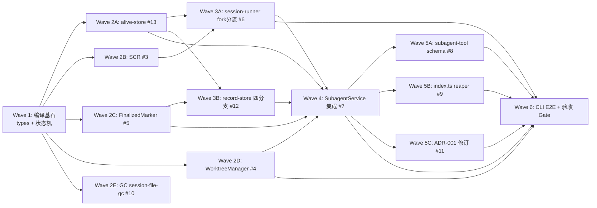

# 执行计划 — subagent fork + worktree 能力增强

> 本文是①-⑤设计结论的**实现编排**。Wave 拆分从⑤骨架叶子作用域推导（code-architecture.md §9 + code-skeleton/），
> 依赖从⑤§4 时序图读出（功能 B 调用功能 A 的方法 → Wave(B) blocked_by Wave(A)），串并行按文件影响集判定。
> 测试分两层落地：**单元/集成测试**（vitest，既有 `src/__tests__/` 范式）+ **E2E 测试**（pi CLI 模式，`~/Code/test-pi-extension/` 沙盒）。

## Wave 编排总览

### 设计原则

1. **垂直切片（tracer bullet）** — 每 Wave 切穿「类型→模块→集成→测试」可独立验证，非水平分层（不先做完所有 model 再做 service）。
2. **编译基石先行** — Wave 1 是 types.ts + 状态机收敛口，所有下游在类型层依赖它（issue #1/#2 的 P0 定位）。
3. **纯叶子模块并行** — Wave 2 四个新叶子模块（alive-store/SCR/FinalizedMarker/WorktreeManager）互不调彼此、改不同文件，可并行。
4. **汇合点串行** — Wave 4 SubagentService 是编排汇合点，所有 P1 新模块的接线在此，必须最后集成。
5. **末尾验收 Wave** — blocked_by 所有功能 Wave，读测试验收清单全量 → 跑测试 → 全 PASS 才算实现完成（设计→实现闭环闸门）。

### 依赖 DAG 图



> Wave 2 内 5 个子切片（2A-2E）同属一个并行组（见调度表），互不冲突。Wave 5 同理（5A/5B/5C 并行）。
> 图为可读性把子切片展开为独立节点；调度表标注它们属同一并行组。

### 调度表

| Wave | 切片 | P级 | Blocked by | 并行组 | 说明 |
|------|------|-----|-----------|--------|------|
| 1 | 编译基石（types.ts + execution-record + path-encoding） | P0 | 无——可立即开始 | — | #1 types（crashed/forkFrom/createBranchedSession/WorktreeHandle/AliveMarker/RunOptions+ExecuteOptions 字段）+ #2 状态机收敛口（markReconstructedStatus + tryTransition+crashed + STATUS_PRIORITY）。UC-6 list 投影类型（externalInstance）也在此。编译基石，所有下游类型层依赖 |
| 2 | P1 纯叶子模块（5 子切片并行） | P1 | Wave 1（2D/2E 内部 blocked_by 2A：import alive-store） | A | **2A** alive-store #13（write/read/remove + isProcessAlive）/ **2B** SCR #3（resolveSessionContext 纯函数）/ **2C** FinalizedMarker #5（write/read）/ **2D** WorktreeManager #4（create/cleanup/collectPatch/scan/gitRun，scan import alive-store）/ **2E** session-file-gc #10（walkAndClean+.alive 探活，import alive-store）。五者改不同文件，可并行。D-025：#13 在此就绪解循环。2D/2E 均 import #13 导出（readAliveMarker/isProcessAlive），须在 2A 就绪后，靠第一批 2A 先行满足 |
| 3 | P1 编排分流（2 子切片并行） | P1 | Wave 1, 2A, 2B, 2C | B | **3A** session-runner #6（fork 分流 createBranched→forkFrom 两级降级 + writeAliveMarker + identity forkDepth，依赖 SCR #3 + alive #13）/ **3B** record-store #12（reconstructAll 四分支 pid 探活，依赖 #2 状态机 + FinalizedMarker #5 + alive #13）。改不同文件（session-runner.ts vs record-store.ts），可并行 |
| 4 | P1 汇合点 SubagentService 集成 | P1 | Wave 3A, 3B, 2A, 2C, 2D | — | #7 execute 前置 WTM.create（worktreeHandle 回填）+ finalizeRecord D-017 时序（collectPatch→completeRecord→archive→三件套）+ D-022 patchOk 守卫 + cancelBackground cleanup。编排汇合点，必须串行（唯一修改 subagent-service.ts） |
| 5 | P2 外壳/文档（3 子切片并行） | P2 | Wave 4 | C | **5A** subagent-tool #8（StartParam +fork/worktree/cwd 字段，依赖 Wave 1 类型经 Wave 4 传递）/ **5B** index.ts #9（session_start 挂 WTM.scan reaper + cache mainSessionFile，依赖 #4 WTM.scan + Wave 4 #7；index→gc 是现有调用，#10 仅扩展范围不改签名，非 5B 新依赖）/ **5C** ADR-001 修订 #11（文档，task=全部输入→可选 fork 继承）。三者改不同文件，可并行 |
| 6 | CLI E2E + 验收 Gate | — | Wave 1, Wave 2, Wave 3, Wave 4, Wave 5 | — | **必须最后**：写 pi CLI E2E 测试（~/Code/test-pi-extension/ 沙盒）→ 跑全量测试（unit + integration + e2e）→ 核对测试验收清单全 PASS → 输出覆盖率报告 |

### 并行约束

- 同一并行组内最多 3 个 subagent 并行（Semaphore 限制）。Wave 2 有 5 子切片 → 分两批（2A/2B/2C 先，2D/2E 后，或按 subagent 容量滚动）。
- **同一文件不允许多 Wave 同时修改**（冲突）。本计划文件影响集已去重：Wave 2 各子切片改独立新文件；Wave 3 改 session-runner.ts / record-store.ts（不同文件）；Wave 4 唯改 subagent-service.ts。
- Wave 间依赖是硬阻塞：Wave 3 必须等 Wave 2 的 SCR/alive/FinalizedMarker 就绪（session-runner 调 SCR，record-store 调 alive+FinalizedMarker）。
- Wave 4 必须 last 串行：SubagentService 持有并调用 WTM/alive/FinalizedMarker/session-runner/record-store 全部新接线。

### Prefactor Wave

**无独立 Prefactor Wave。** ⑤§7「现有代码映射」处置统计：create × 4（新模块，归 Wave 2）/ merge × 8（现有模块扩展，零破坏向后兼容，归对应功能 Wave）/ 无 move/delete/split。refactor 的「铺路」工作（types.ts 扩展、状态机收敛）已并入 Wave 1 编译基石——它是自然的最前置 Wave，无需单列。

## Wave 详情

### Wave 1: 编译基石（types + 状态机收敛）

**切片类型**: 垂直切片（P0 编译基石，类型→状态机→投影→测试）
**P 级覆盖**: P0（#1 types / #2 execution-record + record-store 状态机基础）
**Blocked by**: 无——可立即开始
**并行关系**: 单切片，不并行

#### 包含的功能/issue
- Issue #1 [P0]: types.ts 基础类型（关联 ⑤§3 types 模块签名表）
- Issue #2 [P0]: 状态机基础 execution-record（markReconstructedStatus + tryTransition+crashed + STATUS_PRIORITY），**仅 status 收口部分**（四分支协调留 Wave 3B）

#### 文件影响
- 修改: `extensions/subagents/src/types.ts`（加 ExecutionStatus.crashed / RunOptions+ExecuteOptions fork/worktree/cwd/parentForkDepth / SessionRunnerContext 拆 effectiveCwd+mainCwd+mainSessionFile / SdkLike.SessionManager.forkFrom+createBranchedSession / ExecutionRecord.worktreeHandle / WorktreeHandle VO / AliveMarker / ForkDepthExceededError+DirtyWorktreeError / SubagentRecord.externalInstance）
- 修改: `extensions/subagents/src/core/execution-record.ts`（markReconstructedStatus 赋值收口跳过 CAS + tryTransition target 加 crashed）
- 修改: `extensions/subagents/src/runtime/execution/record-store.ts`（STATUS_PRIORITY 加 crashed key，#2 AC-2.1；reconstructAll 四分支留 Wave 3B，本 Wave 仅加 crashed key 不动分支逻辑）
- 创建: `extensions/subagents/src/core/path-encoding.ts`（⑤骨架已列，encoded-cwd 工具函数）
- 测试: `src/__tests__/execution-record.test.ts`（扩展，加 crashed target + markReconstructedStatus 单测）/ 新建 `src/__tests__/path-encoding.test.ts`

> **record-store.ts 串行说明**：Wave 1 仅加 STATUS_PRIORITY 的 crashed key（编译基石，#2 AC-2.1），Wave 3B 扩展 reconstructAll 四分支。两者串行改同一文件但无并行冲突（Wave 1 → Wave 3B 时序保证）。

#### 覆盖的 test-matrix 用例 ID（完成判定）
- T7.8（状态：status 不裸赋值，经 markReconstructedStatus 收口；本 Wave 产出收口方法，lint 层验证）
- T6.1/T6.2 部分（UC-6 list 投影类型：externalInstance 字段 + crashed 状态枚举编译，投影路径基础在此 Wave 落地；端到端 list 可见性在 Wave 4 验、crashed 重建显示在 Wave 3B 验）

> Wave 1 是编译基石，产出的多为类型/收口方法，真正的状态用例（T7.1-T7.7）在 Wave 3B 四分支落地后验证。T7.8 在本 Wave 落地（markReconstructedStatus 收口方法 + 静态扫描规则）。T6.1/T6.2 的类型投影基础在此（externalInstance 字段 + crashed 枚举），端到端验证跨 Wave 4/3B。

#### Subagent 配置

| 配置项 | 值 |
|--------|---|
| Agent | general-purpose |
| 注入上下文 | issues.md #1/#2（P0 方案）+ code-architecture.md §3 types/execution-record 签名表 + §4 UC-7 时序图 + code-skeleton/types.ts + execution-record.ts |
| 读取文件 | 现有 `extensions/subagents/src/types.ts`、`core/execution-record.ts`、`runtime/execution/record-store.ts`（STATUS_PRIORITY） |
| 修改/创建文件 | types.ts、execution-record.ts、path-encoding.ts + 对应 .test.ts |

#### 执行流（Wave 内部）
1. read TDD + 编码规范 → 写失败测试（execution-record markReconstructedStatus/tryTransition+crashed、path-encoding、types 类型编译）
2. 写实现代码（按骨架签名，零破坏向后兼容：crashed 是新增终态非改名，现有字段不动）
3. spec 合规检查（行为等价：现有 done/failed/cancelled 转换不变；crashed 作为新终态接入）

#### 验收标准
- [ ] issue #1 AC（types 全字段编译通过 + 现有字段不破坏）逐条全过
- [ ] issue #2 status 收口 AC（markReconstructedStatus 赋值收口跳过 CAS、tryTransition+crashed）
- [ ] T7.8 PASS（status 不裸赋值，静态扫描禁 `.status=` 裸赋值）
- [ ] `tsc --noEmit` 0 error（types 扩展不破坏现有编译）
- [ ] 现有测试全过（回归：crashed 新增不破坏现有转换）

---

### Wave 2: P1 纯叶子模块（5 子切片并行）

**切片类型**: 垂直切片（每子切片 = 一个叶子模块的 全签名→实现→单测）
**P 级覆盖**: P1（#13 alive-store / #3 SCR / #5 FinalizedMarker / #4 WorktreeManager / #10 session-file-gc）
**Blocked by**: Wave 1
**并行关系**: 并行组 A，5 子切片改不同文件可并行（受 Semaphore ≤3 约束分批）

#### 包含的功能/issue（5 子切片）
- **2A** Issue #13 [P1]: alive-store（writeAliveMarker/readAliveMarker/removeAliveMarker + isProcessAlive process.kill(pid,0) 保守判死）
- **2B** Issue #3 [P1]: SessionContextResolver（resolveSessionContext 纯函数零副作用 D-014，返回 shouldFork/forkSource/effectiveCwd/sessionDir）
- **2C** Issue #5 [P1]: FinalizedMarker（writeFinalized/readFinalized，范式复用 tombstone-store）
- **2D** Issue #4 [P1]: WorktreeManager（create/cleanup/collectPatch/scan/gitRun 深模块，private gitRun 内联 execFileSync）
- **2E** Issue #10 [P2]: session-file-gc（walkAndClean 加 .finalized/.alive，.alive 先 readAliveMarker+isProcessAlive 探活）

#### 文件影响
- 创建 2A: `extensions/subagents/src/runtime/execution/alive-store.ts` + `src/__tests__/alive-store.test.ts`
- 创建 2B: `extensions/subagents/src/core/session-context-resolver.ts` + `src/__tests__/session-context-resolver.test.ts`
- 创建 2C: `extensions/subagents/src/runtime/execution/finalized-marker.ts` + `src/__tests__/finalized-marker.test.ts`
- 创建 2D: `extensions/subagents/src/runtime/worktree-manager.ts` + `src/__tests__/worktree-manager.test.ts`
- 修改 2E: `extensions/subagents/src/runtime/session-file-gc.ts`（现有 walkAndClean 扩展）+ `src/__tests__/session-file-gc.test.ts`（扩展）

> **并行安全**：5 子切片改 5 个不同文件（alive-store.ts / session-context-resolver.ts / finalized-marker.ts / worktree-manager.ts / session-file-gc.ts），无交集。**2D 与 2E 均 import alive-store 函数**（readAliveMarker/isProcessAlive）：2D 的 WTM.scan（D-024 .alive 守卫，§9 worktree-manager.ts:74「接线 alive+gitRun」）+ 2E 的 walkAndClean（B3 探活）。故 2D/2E 实际依赖 2A 就绪——编排上 2D/2E 在 2A 之后或同批但实现时 import 2A 导出。**为简化并行**，2D/2E 划入 Wave 2 但标注「实现时 import #13 导出」，与 2A 同批（2A 是纯新文件无依赖，2D/2E 先写测试再 import；靠第一批 2A 先行满足，详见调度表 Wave 2 Blocked by）。

#### 覆盖的 test-matrix 用例 ID（完成判定）
- 2A（alive-store）: T6.3 部分（GC 探活依赖 isProcessAlive——本 Wave 产出 isProcessAlive，GC 路径在 2E 验）
- 2B（SCR）: T1.4（边界：fork 深度≥10 拒绝，SCR 纯函数判 parentForkDepth 抛 ForkDepthExceededError）/ T3.1/T3.2 部分（SCR 返回 shouldFork+effectiveCwd+sessionDir）
- 2C（FinalizedMarker）: T7.2/T7.3 的标记读写依赖（readFinalized 在 Wave 3B 四分支用，本 Wave 产出 write/read 纯叶子单测）
- 2D（WorktreeManager）: T2.1（正常 clean 树 create 成功）/ T2.2（异常脏树抛 DirtyWorktreeError）/ T2.3（边界 recordId 白名单 `^[\w-]+$` 抛错）/ **T2.4（边界：嵌套 worktree .git 文件检测拒绝，首版禁止）** / T4.1（collectPatch 成功）/ T4.2（空改动 patch 空但成功）/ T4.3（collectPatch 失败 failed:true，D-022）/ T5.1 部分（scan 终态+无活→清）/ T5.2（有活 .alive→不删 D-024 安全网）/ T5.3（无标记无 .alive→保守跳过）/ **T2.6（并发：两 worktree 并发创建不同 recordId 各自独立分支+路径不冲突）** / **T2.5 部分（node_modules 软链 integration 断言：create 后 worktreePath/node_modules/.bin 存在，⑤§6 来源 B 强制 integration；e2e 真实验证在 Wave 6）**
- 2E（GC）: T6.3（GC walkAndClean + .alive 对应 pid 活→不被 unlink，独立 GC 路径，CV-2/RC-2 CROSS-VALIDATED）

#### Subagent 配置（每子切片一份）

| 配置项 | 2A alive-store | 2B SCR | 2C FinalizedMarker | 2D WorktreeManager | 2E GC |
|--------|---------------|--------|--------------------|--------------------|-------|
| Agent | general-purpose | general-purpose | general-purpose | general-purpose | general-purpose |
| 注入上下文 | #13 + §3 alive-store + §5 alive 深模块 | #3 + §3 SCR + §4 UC-1 时序图 SCR 段 | #5 + §3 FinalizedMarker + tombstone-store 范式 | #4 + §3 WTM + §4 UC-2/UC-4/UC-5 时序图 + §5 WTM 深模块 + D-024 | #10 + §3 GC + §4 UC-7 sidecar |
| 读取文件 | 现有 tombstone-store.ts（范式） | 现有 session-runner.ts（抽出源）+ types.ts(Wave1) | 现有 tombstone-store.ts | 现有 session-runner.ts:233 execFileSync 先例 + **2A alive-store（scan import）** | 现有 session-file-gc.ts + 2A alive-store |
| 修改/创建 | alive-store.ts + .test.ts | session-context-resolver.ts + .test.ts | finalized-marker.ts + .test.ts | worktree-manager.ts + .test.ts | session-file-gc.ts + .test.ts |

#### 执行流（每子切片内部，串行）
1. read TDD → 写失败测试（叶子纯函数/副作用，mock fs 或 gitRun）
2. 写实现代码（按骨架签名，WorktreeManager gitRun private 内联 execFileSync 非 throw）
3. spec 合规检查（行为等价：2E 现有 .jsonl/.cancelled 清理不变）

#### 验收标准
- [ ] 各 issue AC 逐条全过（#3 SCR 纯函数零副作用 AC-2 grep 禁 execFileSync/sdk；#4 recordId 白名单+clean 校验；#13 isProcessAlive 保守判死；#10 .alive 探活守卫）
- [ ] 2A-2E 覆盖的 test-matrix 用例 ID 全 PASS（T1.4/T2.1/T2.2/T2.3/**T2.4**/**T2.5(integration)**/**T2.6**/T4.1/T4.2/T4.3/T5.2/T5.3/T6.3）
- [ ] 5 子切片改不同文件，无冲突
- [ ] D-014（SCR 纯函数零副作用）/ D-019（WTM 内联 gitRun 无 GitPort）/ D-024（scan .alive 守卫）/ D-022（collectPatch failed:true）落地

---

### Wave 3: P1 编排分流（2 子切片并行）

**切片类型**: 垂直切片（编排层：分流逻辑→四分支→单测/集成）
**P 级覆盖**: P1（#6 session-runner / #12 record-store 四分支）
**Blocked by**: Wave 1, 2A（alive-store）, 2B（SCR）, 2C（FinalizedMarker）
**并行关系**: 并行组 B，2 子切片改不同文件（session-runner.ts vs record-store.ts）可并行

#### 包含的功能/issue
- **3A** Issue #6 [P1]: session-runner fork 分流（createAndConfigureSession：fork 时 SCR→createBranchedSession 优先（D-018），抛错降级 forkFrom（两级非三级）+ writeAliveMarker + identity custom entry 加 forkDepth）
- **3B** Issue #12 [P1]: record-store 四分支（reconstructAll 扩展：.cancelled/.finalized/.alive+活pid/都无→crashed，D-021 pid 探活 + D-023 externalInstance 投影）

#### 文件影响
- 修改 3A: `extensions/subagents/src/core/session-runner.ts`（createAndConfigureSession fork 分流 + writeAliveMarker 内联 + identity entry forkDepth）
- 修改 3B: `extensions/subagents/src/runtime/execution/record-store.ts`（reconstructAll 四分支 + STATUS_PRIORITY 已 Wave1 加 crashed）
- 测试: `src/__tests__/session-runner.test.ts`（扩展 fork 分流 + 两级降级）/ `src/__tests__/record-store.test.ts`（扩展四分支 sidecar 矩阵）

> **并行安全**：3A 改 session-runner.ts，3B 改 record-store.ts，不同文件。3A 调 SCR（2B 已就绪）+ alive-store（2A 已就绪）+ SDK；3B 调 FinalizedMarker（2C 已就绪）+ alive-store（2A 已就绪）。无循环。

#### 覆盖的 test-matrix 用例 ID（完成判定）
- 3A（session-runner）: T1.1（正常 createBranchedSession 成功）/ T1.2（异常降级 forkFrom，两级降级链 B NFR）/ T1.3（异常 forkFrom 也失败抛错）/ T1.5（状态 fork 后 done 不可逆）/ T1.6（并发 createBranched mutate 不串台）/ T3.4（异常 worktree create 成功但 fork 降级失败须 cleanup）
- 3B（record-store）: T7.1（.cancelled 分支）/ T7.2（.finalized done 分支）/ T7.3（.finalized failed 分支）/ T7.4（.alive+活pid running-elsewhere + externalInstance）/ T7.5（都无→crashed）/ T7.6（.alive+死pid→crashed）/ T7.7（>24h 软超时→crashed D-021 pid 复用兜底）/ **T6.2 部分（crashed record 经四分支重建后 list 显示 status=crashed，投影路径在此 Wave 落地）**

#### Subagent 配置

| 配置项 | 3A session-runner | 3B record-store |
|--------|-------------------|-----------------|
| Agent | general-purpose | general-purpose |
| 注入上下文 | #6 + §3 session-runner + §4 UC-1 时序图 + D-018 两级降级 | #12 + §3 record-store + §4 UC-7 四分支时序图 + D-021/D-023 |
| 读取文件 | 现有 session-runner.ts + 2B SCR + 2A alive-store + types.ts(Wave1) | 现有 record-store.ts + session-reconstructor + 2C FinalizedMarker + 2A alive-store |
| 修改/创建 | session-runner.ts + .test.ts | record-store.ts + .test.ts |

#### 执行流（每子切片内部，串行）
1. read TDD → 写失败测试（3A：fakeSdk mock createBranchedSession reject 验降级；3B：sidecar 文件矩阵 5 组合 + process.kill mock 探活）
2. 写实现代码（3A：D-018 优先 createBranchedSession，catch 降级 forkFrom；3B：四分支 readFinalized+readAliveMarker+isProcessAlive+markReconstructedStatus）
3. spec 合规检查（行为等价：3A 现有 !fork 路径 SessionManager.create 行为不变；3B 现有 .cancelled 单分支 override 行为不变）

#### 验收标准
- [ ] issue #6 AC（fork 分流 + 两级降级 + writeAliveMarker + forkDepth identity）逐条全过
- [ ] issue #12 AC（四分支 5 sidecar 组合 + externalInstance 投影 + 24h 软超时）逐条全过
- [ ] 3A/3B 覆盖的 test-matrix 用例 ID 全 PASS（T1.1-T1.6/T3.4/T7.1-T7.7）
- [ ] D-018（两级降级非三级）/ D-021（pid 探活）/ D-023（externalInstance 独立字段非 status 重载）/ D-026（行为测试非 grep）落地

---

### Wave 4: P1 汇合点 SubagentService 集成

**切片类型**: 垂直切片（汇合点：WTM 接入→finalizeRecord D-017 时序→集成测试）
**P 级覆盖**: P1（#7 SubagentService）
**Blocked by**: Wave 3A, 3B, 2A（alive）, 2C（FinalizedMarker）, 2D（WorktreeManager）
**并行关系**: 串行（唯一修改 subagent-service.ts，汇合点必须最后集成）

#### 包含的功能/issue
- Issue #7 [P1]: SubagentService 集成（constructor 持有 WTM + execute 前置 WTM.create 回填 worktreeHandle + finalizeRecord D-017 时序 ⓪collectPatch→①completeRecord→②archive→③三件套 + D-022 patchOk 守卫 + cancelBackground cleanup+removeAliveMarker）

#### 文件影响
- 修改: `extensions/subagents/src/runtime/subagent-service.ts`（constructor 持有 WTM + execute WTM.create + finalizeRecord D-017 + cancelBackground）
- 测试: `src/__tests__/subagent-service.test.ts`（扩展）/ `src/__tests__/execute-integration.test.ts`（扩展 fork/worktree 端到端）

#### 覆盖的 test-matrix 用例 ID（完成判定）
- T3.1（正常 fork+worktree 组合，SCR 返回 shouldFork+effectiveCwd）/ T3.2（边界 session 落主命名空间 sessionDir 主 cwd 编码）/ T3.3（异常 fork 成功 worktree create 失败须不泄漏 CV-1/RC-1）/ T4.4（状态 finalize 时序 D-017 ⓪①②③ spy 验）/ T4.5（异常 completeRecord/archive 抛错兜底 B9 三件套仍执行）/ **T6.1 部分（fork/worktree record 经 execute 集成后 list 可见，sessionDir 主 cwd 编码端到端验证，UC-6 正常路径在此闭环）**

> Wave 4 是汇合点，UC-3 组合异常（T3.3/T3.4）和 finalize 时序（T4.4/T4.5）在此闭环。T2.1/T4.1-T4.3 的编排调用链也在此串联（虽 WorktreeManager 行为在 Wave 2D 单测，但 execute→WTM.create→finalizeRecord→WTM.collectPatch/cleanup 的端到端编排在此验证）。T6.1 的端到端 list 可见性在此（record 经 execute 创建后落 RecordStore，list 读出）。

#### Subagent 配置

| 配置项 | 值 |
|--------|---|
| Agent | general-purpose |
| 注入上下文 | #7 + §3 SubagentService + §4 UC-4 时序图（finalizeRecord D-017）+ D-017/D-022/D-026 |
| 读取文件 | 现有 subagent-service.ts + 2D WorktreeManager + 2A alive-store + 2C FinalizedMarker + 3A session-runner + 现有 execute-integration.test.ts（fakeSdk 范式） |
| 修改/创建 | subagent-service.ts + .test.ts + execute-integration.test.ts |

#### 执行流（Wave 内部）
1. read TDD → 写失败测试（execute-integration 扩展：fakeSdk + fake WTM，验 D-017 时序 spy 链 + D-022 patchOk 守卫 + T3.3/T3.4 不泄漏）
2. 写实现代码（constructor 持有 WTM + execute 前置 create + finalizeRecord ⓪①②③ + cancelBackground）
3. spec 合规检查（行为等价：现有非 worktree 路径无 collectPatch/cleanup 行为不变）

#### 验收标准
- [ ] issue #7 AC 逐条全过（WTM 接入 + D-017 时序 + D-022 守卫 + cancelBackground + 三件套兜底）
- [ ] T3.1/T3.2/T3.3/T4.4/T4.5 全 PASS（T3.4 在 3A，T4.1-T4.3 行为在 2D）
- [ ] D-017 时序 spy 验（非 grep -n）/ D-022 patchOk 守卫 / D-026 行为测试落地
- [ ] execute-integration 端到端 fork/worktree 路径跑通（fakeSdk）

---

### Wave 5: P2 外壳/文档（3 子切片并行）

**切片类型**: 垂直切片（外壳接入→reaper 挂载→文档）
**P 级覆盖**: P2（#8 schema / #9 index reaper / #11 ADR）
**Blocked by**: Wave 4（#9 reaper 依赖 #4 WTM.scan；schema 依赖 Wave 1 类型；ADR 是收尾）
**并行关系**: 并行组 C，3 子切片改不同文件可并行

#### 包含的功能/issue
- **5A** Issue #8 [P2]: subagent-tool StartParam schema（+fork?/worktree?/cwd? 可选字段，零破坏 D-008 命名 worktree 非 isolation）
- **5B** Issue #9 [P2]: index.ts session_start（挂 WTM.scan reaper best-effort try/catch + cache mainSessionFile fork source）
- **5C** Issue #11 [P2]: ADR-001 决策 2 修订（task=全部输入 → 可选 fork 继承，文档）

#### 文件影响
- 修改 5A: `extensions/subagents/src/tools/subagent-tool.ts`（StartParam + SubagentParams schema）
- 修改 5B: `extensions/subagents/src/index.ts`（session_start + maybeCleanup + scan + cache）
- 修改 5C: `docs/adr/ADR-001*.md`（决策 2 修订）
- 测试: `src/__tests__/`（schema 单测）/ `src/__tests__/index.test.ts`（如无则新建，session_start scan 调用断言）

#### 覆盖的 test-matrix 用例 ID（完成判定）
- 5A（schema）: T2.1 部分（worktree:true 经 schema 入参）/ schema 字段编译（fork/worktree/cwd 可选）
- 5B（index reaper）: T5.1（终态+无活→清 scan 路径）/ T5.4（e2e session_start 触发 reaper）

> 5C（ADR）是文档，无 test-matrix 用例（契约一致性收尾，⑥Step 6c 一致性终检核 ADR↔实现一致）。

#### Subagent 配置

| 配置项 | 5A schema | 5B index | 5C ADR |
|--------|-----------|----------|--------|
| Agent | general-purpose | general-purpose | general-purpose |
| 注入上下文 | #8 + §3 subagent-tool + D-008 | #9 + §3 index + §4 UC-5 时序图 | #11 + ADR-001 现状 |
| 读取文件 | 现有 subagent-tool.ts + types.ts(Wave1) | 现有 index.ts + 2D WorktreeManager.scan | 现有 ADR-001 |
| 修改/创建 | subagent-tool.ts + .test.ts | index.ts + .test.ts | ADR-001.md |

#### 执行流（每子切片内部，串行）
1. read TDD → 写失败测试（5A schema 解析；5B scan 调用断言）
2. 写实现代码
3. spec 合规检查（5A 现有参数不变；5B maybeCleanup 不变）

#### 验收标准
- [ ] issue #8/#9/#11 AC 逐条全过
- [ ] T5.4 PASS（session_start 触发 reaper，e2e 层）
- [ ] 5A/5B/5C 改不同文件，无冲突

---

### Wave 6: CLI E2E + 验收 Wave（Acceptance Gate）

**切片类型**: 验收（非功能切片）+ E2E 测试编写
**P 级覆盖**: —
**Blocked by**: Wave 1, Wave 2, Wave 3, Wave 4, Wave 5（所有功能 Wave）
**并行关系**: 必须最后，不与任何 Wave 并行

#### 职责
1. **编写 pi CLI E2E 测试**（`~/Code/test-pi-extension/` 沙盒）—— 用 pi CLI 模式测真实功能（fork 继承上下文 / worktree 隔离运行 / patch 回传 / reaper 清扫 / 崩溃标记）。
2. **读测试验收清单全量** → 跑全量测试（unit + integration + e2e）→ 核对每条用例 ID 的 PASS/FAIL/缺失 → 输出覆盖率报告。

> **为何 CLI E2E 在此 Wave（非各功能 Wave）**：E2E 测端到端链路（tool→service→runner→SDK→worktree→finalize），需所有功能 Wave 就绪才能跑通。各功能 Wave 的 unit/integration 已覆盖单模块行为；E2E 补真实 CLI 场景（多 subagent 并发 fork、worktree 真实 git 操作、跨实例 reaper）。Wave 6 既编 E2E 也做验收 gate（E2E 是测试验收清单 e2e 层用例的载体）。

#### E2E 测试沙盒设计（`~/Code/test-pi-extension/`）

> 用户指定：`~/Code/test-pi-extension/` 目录，下面建各种子目录和 worktree 来测。
> pi CLI 模式 = 用 `pi` 命令行（非 SDK import）触发 subagent 工具，测真实进程行为。

```
~/Code/test-pi-extension/
├── README.md                          # E2E 测试说明 + 运行方式
├── run-e2e.sh                         # E2E 测试编排脚本（建沙盒→跑 pi→断言→清理）
├── fixtures/
│   ├── host-repo/                     # 主 git 仓库（模拟主 agent 工作目录）
│   │   ├── .git/
│   │   ├── package.json               # 含 node_modules（验软链）
│   │   ├── node_modules/              # 软链源
│   │   ├── src/                       # 一些源文件供 worktree 改
│   │   └── .pi/                       # pi session 目录（~/.pi/agent 的 mock 或真实）
│   ├── fork-source-session.jsonl      # 模拟主 agent session 文件（fork source）
│   └── corrupt-session.jsonl          # 损坏 session（测 T1.3 forkFrom 失败）
├── scenarios/
│   ├── s1-fork-inherit.sh             # UC-1: fork 继承主上下文（pi CLI 触发 subagent fork:true）
│   ├── s2-worktree-isolate.sh         # UC-2: worktree 独立 git worktree 运行
│   ├── s3-fork-plus-worktree.sh       # UC-3: fork+worktree 组合
│   ├── s4-worktree-patch-cleanup.sh   # UC-4: 清理 + patch 回传
│   ├── s5-reaper-orphan.sh            # UC-5: 孤儿 worktree 清扫
│   ├── s6-subagents-list.sh           # UC-6: /subagents list 可见性
│   └── s7-crash-marker.sh             # UC-7: 崩溃状态正确标记（kill -9 模拟）
├── assertions/
│   ├── assert-fork-history.sh         # 验 session.messages 含主历史
│   ├── assert-worktree-path.sh        # 验子 agent cwd=worktreePath
│   ├── assert-patch-file.sh           # 验 .patch 文件生成
│   ├── assert-worktree-removed.sh     # 验 worktree remove+branch -D
│   └── assert-status-crashed.sh       # 验 crashed 标记
└── reports/                           # E2E 运行报告（覆盖率映射回清单）
```

**E2E 时序保障机制 [MANDATORY]**：

> E2E 测试的核心挑战是**时序控制**：pi 启动后不会立刻进入 subagent，subagent 可能很快结束导致特殊操作（如 kill）无法命中。必须使用就绪信号 + sleep 窗口确保操作命中目标。

**三层保障模型**：

| 层级 | 机制 | 作用 |
|------|------|------|
| **1. 原子就绪信号** | `touch ready && sleep 60` | ready 出现 = subagent 已进入任务，且 sleep 开始 |
| **2. 长 sleep 窗口** | `sleep 60` | 60 秒窗口，足够完成 kill/检查等操作 |
| **3. 进程树确认** | `pgrep -P $PI_PID` | 只杀子进程，不杀 pi 主进程 |

**任务模板**：

| 测试类型 | 任务模板 | 验证点 |
|----------|----------|--------|
| **crash 测试** | `touch ready && sleep 60` | kill 在 ready 后、sleep 结束前 |
| **正常完成** | `echo done && touch ready && sleep 1` | ready 出现后短暂等待，验证完成 |
| **worktree 写入** | `touch ready && echo test > file && sleep 5` | ready 后验证文件创建 |
| **fork 继承** | `touch ready && env && sleep 5` | ready 后验证环境变量继承 |

**时序流程图**：

```
主脚本                    subagent (fork/worktree)
   │                           │
   ├─ pi -p "任务..." ────────►│
   │                           ├─ 开始执行
   │                           ├─ 创建就绪标记 /tmp/pi-e2e-test/ready
   │                           └─ sleep 等待（保持进程存活）
   │
   ├─ while [ ! -f ready ]; do sleep 0.1; done
   │                           │
   ├─ 执行特殊操作 (kill -9) ──┤
   │                           └─ 被杀死
   │
   └─ 验证结果
```

**各用例时序要求**：

| 用例 | 就绪信号 | sleep 窗口 | 特殊操作 | 验证时机 |
|------|----------|-----------|----------|----------|
| T1.1 fork | ✓ | 30s | 无 | ready 后检查 session |
| T2.1 worktree | ✓ | 30s | 无 | ready 后检查 cwd |
| T2.5 node_modules | ✓ | 30s | 无 | ready 后检查软链 |
| T4.1 patch | ✓ | 30s | 无 | 任务结束后检查 patch 文件 |
| T5.4 reaper | ✓ | 30s | 预置孤儿 | ready 后检查孤儿清理 |
| T7.5 crash | ✓ | 60s | kill -9 | pi 退出后检查 crashed 标记 |

**E2E 测试沙盒路径**：`/tmp/pi-e2e-test/`（每次运行自动创建，完全隔离）

**E2E 测试覆盖的 test-matrix 用例**（执行层=e2e 的用例 + 关键 integration 的真实 CLI 验证）：
- T2.5（e2e：node_modules 软链生效，worktreePath/node_modules/.bin 存在）
- T5.4（e2e：session_start 触发 reaper 扫孤儿）
- T1.1（真实 CLI：fork 继承，pi 触发 subagent fork:true 验 session 含主历史）
- T2.1（真实 CLI：worktree:true clean 树，验子 agent cwd=worktreePath）
- T4.1（真实 CLI：collectPatch 成功，验 .patch 文件 + worktree removed）
- T7.5（真实 CLI：kill -9 模拟崩溃，重启 pi 验 crashed 标记）

> **执行层切分**（deliverable-template G0 修）：unit 层 = vitest `src/__tests__/`（各功能 Wave dev 阶段跑）；integration 层 = vitest execute-integration（phase-test gate 跑）；e2e 层 = `~/Code/test-pi-extension/` pi CLI（独立 e2e gate 跑）；lint 层 = T7.8 静态扫描。Wave 6 汇总各层结果。

#### Subagent 配置

| 配置项 | 值 |
|--------|---|
| Agent | general-purpose |
| 注入上下文 | execution-plan.md「测试验收清单」全量 + code-architecture.md §4 时序图（E2E 场景来源）+ issues.md AC（断言来源） |
| 读取文件 | 测试套件目录 `src/__tests__/` + 实现代码 + **pi CLI 触发 subagent 工具的具体命令形态**（subagents 是 pi extension 需 `pi install`；非交互触发 tool 方式：`pi --help` / `pi install @zhushanwen/pi-subagents` / interactive prompt 内 tool 调用 / MCP 路径，执行期验证选哪种）+ pi CLI 用法（pi --help / subagent 工具 schema） |
| 修改/创建文件 | `~/Code/test-pi-extension/`（全沙盒）+ 测试验收清单状态列（写回 execution-plan.md） |

#### 执行流
1. 建 `~/Code/test-pi-extension/` 沙盒骨架（fixtures/host-repo git init + node_modules + 场景脚本）
2. 编写 7 个 scenario 脚本（每 UC 一个，用 pi CLI 触发 subagent 工具）
3. 跑 unit + integration 测试套件（`pnpm test` vitest 全量）
4. 跑 e2e 场景（`./run-e2e.sh`，pi CLI 真实进程）
5. 把每条 PASS/FAIL/缺失映射回清单用例 ID（按断言摘要核对）
6. 清单状态列填 PASS / FAIL / 未实现 / `[DEVIATED]原因`
7. 输出覆盖率报告：清单用例 PASS 数 / 总数 + 未过用例明细 + 各执行层结果

#### 验收标准
- [ ] **测试验收清单全量用例 PASS**（任一 FAIL / 未实现 = 整个实现未完成，回对应功能 Wave 补）
- [ ] `~/Code/test-pi-extension/` 沙盛建成，7 scenario 脚本可运行
- [ ] 无 `[DEVIATED]` 未经用户确认（偏离需登记原因 + 用户拍板 + 判断是否回流⑤改设计）
- [ ] 覆盖率报告输出（清单 PASS 数 / 36 总数 + unit/integration/e2e/lint 各层结果）

## 后续迭代（P3 延后项）

- **worktree 嵌套（worktree-of-worktree）** [OS-6 首版禁止] — 延后理由：#4 嵌套检测（.git 文件检查）首版拒绝。真出现子 agent 内再开 worktree 子 agent 需求时解除禁止。无状态机需求。
- **fork keepBranch + 推远端 + merge**（路径 B）[D-005 排除 / D-015 删接口] — 延后理由：YAGNI，调用方本轮=零。路径 B 真要做时再加（D-015 删证伪三连：去掉塌缩成一块）。
- **④4 条运维项**（crashed reason 计数 #2 / WorktreeManager 日志 #4 / finalizeRecord 三件套日志 #7 / pid 复用计数 #12）— 延后理由：日志/指标配置，验收方式=运维项，不进代码层 issue，留运维阶段。

## 测试验收清单（Test Acceptance Manifest）— [MANDATORY]

> **实现阶段的 Definition of Done（完成定义）。** 把⑤test-matrix 全量用例（来源 A 功能 + 来源 B NFR）
> 按归属 Wave 列全，作为实现期的唯一验收真相源。「功能归属 Wave」= 产出该用例对应代码的 Wave；
> 「测试执行层」= 该用例在哪个测试阶段跑（继承⑤§6 来源 B 强制层级）。
> **末尾验收 Wave（Wave 6）不绿 = 实现未完成。**

| 用例 ID | 归属 UC | 来源 | 断言摘要 | 功能归属 Wave | 测试执行层 | 状态 |
|---------|--------|------|---------|--------------|----------|------|
| T1.1 | UC-1 | A 功能 | fork:true createBranchedSession 成功，session 含主历史，sessionManager 已 mutate | Wave 3A | integration+e2e | 待验 |
| T1.2 | UC-1 | B NFR | createBranchedSession 抛错→降级 forkFrom（两级非三级），session 仍含主历史 | Wave 3A | integration | 待验 |
| T1.3 | UC-1 | A 功能 | forkFrom 失败（mainSessionFile 空/损坏），pi SDK 抛错不进入 run，finalizeFailed（empty+corrupt 合并路径，AC-1.2 修订） | Wave 3A | integration | 待验 |
| T1.4 | UC-1 | A 功能 | fork 深度≥10 拒绝，SCR 纯函数抛 ForkDepthExceededError | Wave 2B | unit | 待验 |
| T1.5 | UC-1 | A 功能 | fork 后正常完成 done，markReconstructedStatus 不回退（终态不可逆） | Wave 3A | integration | 待验 |
| T1.6 | UC-1 | B NFR | 两 fork 并发（不同 leafId），各自 sessionManager 实例独立不互相 mutate | Wave 3A | integration | 待验 |
| T2.1 | UC-2 | A 功能 | worktree:true clean 树，handle.path 存在，子 agent cwd=worktreePath | Wave 2D | integration+e2e | 待验 |
| T2.2 | UC-2 | A 功能 | 脏树拒绝，抛 DirtyWorktreeError，不创建 worktree | Wave 2D | unit | 待验 |
| T2.3 | UC-2 | B NFR | recordId 含特殊字符（`a;b`），白名单 `^[\w-]+$` 抛错 | Wave 2D | unit | 待验 |
| T2.4 | UC-2 | A 功能 | 嵌套 worktree 检测（.git 文件），拒绝/降级（首版禁止） | Wave 2D | unit | 待验 |
| T2.5 | UC-2 | B NFR | node_modules 软链生效，worktreePath/node_modules/.bin 存在 | Wave 2D | integration+e2e | 待验 |
| T2.6 | UC-2 | B NFR | 两 worktree 并发创建不同 recordId，各自独立分支+路径不冲突 | Wave 2D | integration | 待验 |
| T3.1 | UC-3 | A 功能 | fork+worktree 同时，SCR 返回 shouldFork+effectiveCwd=worktree，先 branched 再 createAgentSession(cwd:worktree) | Wave 4 | integration | 待验 |
| T3.2 | UC-3 | A 功能 | fork+worktree，sessionDir 用主 cwd 编码（D-004），list 可见 | Wave 4 | integration | 待验 |
| T3.3 | UC-3 | A 功能 | fork 成功 worktree create 失败（脏树），已 branched session 须不泄漏（CV-1/RC-1） | Wave 4 | integration | 待验 |
| T3.4 | UC-3 | A 功能 | worktree create 成功但 fork 降级失败，已创建 worktree 须 cleanup 不泄漏孤儿 | Wave 3A | integration | 待验 |
| T4.1 | UC-4 | A 功能 | collectPatch 成功→cleanup，patch 文件生成，worktree remove+branch-D | Wave 2D+4 | integration+e2e | 待验 |
| T4.2 | UC-4 | A 功能 | 空改动，patch 空但成功，仍 cleanup | Wave 2D | unit | 待验 |
| T4.3 | UC-4 | B NFR | collectPatch 失败→保 worktree（D-022），patchFailed=true，cleanup callCount=0 | Wave 2D+4 | integration | 待验 |
| T4.4 | UC-4 | A 功能 | finalize 时序正确（D-017 ⓪①②③），collectPatch 在 completeRecord 前，archive 在 finalized 前（spy 验） | Wave 4 | integration | 待验 |
| T4.5 | UC-4 | B NFR | completeRecord/archive 抛错兜底（B9），③finalized/cleanup 仍执行（spy 验） | Wave 4 | integration | 待验 |
| T5.1 | UC-5 | A 功能 | 终态标记+无活→清，remove+branch-D | Wave 2D+5B | integration+e2e | 待验 |
| T5.2 | UC-5 | B NFR | 有活 .alive→不删（D-024 安全网），跨实例故障注入 | Wave 2D | integration | 待验 |
| T5.3 | UC-5 | A 功能 | 无标记无 .alive→保守跳过（可能跨实例正跑） | Wave 2D | unit | 待验 |
| T5.4 | UC-5 | A 功能 | session_start 触发 reaper，扫到孤儿清理活态保留 | Wave 5B | e2e | 待验 |
| T6.1 | UC-6 | A 功能 | fork/worktree record 在 list 可见（sessionDir 主 cwd 编码 D-004） | Wave 1+4 | integration | 待验 |
| T6.2 | UC-6 | A 功能 | crashed record 在 list 显示 status=crashed | Wave 1+3B | integration | 待验 |
| T6.3 | UC-6 | B NFR | GC walkAndClean + .alive 对应 pid 活→不被 unlink（独立 GC 路径，CV-2/RC-2） | Wave 2E | integration | 待验 |
| T7.1 | UC-7 | B NFR | .cancelled 分支→status=cancelled | Wave 3B | integration | 待验 |
| T7.2 | UC-7 | A 功能 | .finalized 分支 done→status=done | Wave 3B | integration | 待验 |
| T7.3 | UC-7 | A 功能 | .finalized 分支 failed→status=failed | Wave 3B | integration | 待验 |
| T7.4 | UC-7 | A 功能 | .alive+活pid 分支→status=running, externalInstance=true（D-023） | Wave 3B | integration | 待验 |
| T7.5 | UC-7 | A 功能 | 都无→crashed | Wave 3B | integration+e2e | 待验 |
| T7.6 | UC-7 | A 功能 | .alive+死pid→crashed | Wave 3B | integration | 待验 |
| T7.7 | UC-7 | B NFR | >24h 软超时→crashed（D-021 pid 复用兜底，无视探活） | Wave 3B | integration | 待验 |
| T7.8 | UC-7 | B NFR | status 不裸赋值，经 markReconstructedStatus（静态扫描禁 `.status=`） | Wave 1 | lint | 待验 |

**状态字段：** `待验`（设计期默认）→ 实现期填 `PASS` / `FAIL` / `未实现` / `[DEVIATED]原因`

**闭环核验（设计期）：**
- 清单用例 ID 集合 = ⑤test-matrix 全量（36 条，来源 A + 来源 B 复用同 ID 多维度覆盖）
- 每个功能 Wave 覆盖的用例 ID 都在清单出现
- **清单每条用例 ID 出现在至少一个 Wave 的覆盖段落**（Round 1 追踪修复：T2.4/T2.6→Wave 2D，T6.1→Wave 1+4，T6.2→Wave 1+3B 已补认领，并集从 32 补齐到 36 = 全量）
- 末尾验收 Wave（Wave 6）blocked_by 所有功能 Wave（Wave 1,2,3,4,5），其 PASS = 全清单 PASS
- gate 范围按测试执行层切：unit 在 Wave dev 阶段 / integration 在 phase-test / e2e 在独立 e2e gate（~/Code/test-pi-extension/）/ lint 在静态扫描
- **清单「测试执行层」与⑤§6 来源 B 强制层级一致**（Round 1 修复：T2.5 从 e2e 改 integration+e2e，对齐⑤来源 B 强制 integration；其余安全/并发项均 integration，e2e 类型走 e2e+integration 复验）

**④ `验收方式=代码测试` 的 9 条缓解项全映射（来源 B 闭环）：**
| ④缓解项 | test-matrix ID | 归属 Wave |
|--------|---------------|----------|
| collectPatch 失败保 worktree（D-022） | T4.3 | Wave 2D+4 |
| completeRecord/archive 抛错兜底（B9） | T4.5 | Wave 4 |
| reaper 孤儿判据 .alive 守卫（D-024） | T5.2 | Wave 2D |
| GC 清 .alive 先探活（B3） | T6.3 | Wave 2E |
| 四分支 sidecar 矩阵（D-021） | T7.1-T7.7 | Wave 3B |
| externalInstance 投影类型（D-023） | T7.4 | Wave 3B |
| fork 两级降级链 | T1.2 | Wave 3A |
| node_modules 软链生效 | T2.5 | Wave 2D |
| status 收口静态规则 | T7.8 | Wave 1 |

**④ `验收方式=性能混沌` 的缓解项：无。** ④回灌登记表无性能/混沌类缓解项（性能维度仅 node_modules 软链=代码测试，无负载/故障注入环境需求）。跳过独立 perf/chaos Wave（已核验回灌表，性能混沌项=0）。

## 执行交接（硬契约）

本计划完成后，进入编码实现。**编码完成的定义 = 测试验收清单全绿。**

- **无论方式 A/B，末尾验收 Wave（Wave 6，blocked_by 所有功能 Wave）未绿 = 实现未完成。**
  Wave 6 职责：编 pi CLI E2E（~/Code/test-pi-extension/）→ 跑全量测试（unit+integration+e2e+lint）→ 把每条 PASS/FAIL/缺失映射回清单用例 ID → 任一用例无对应测试或 FAIL = 整个实现未完成 → 输出覆盖率报告。
- **方式 A（推荐）**：接入 coding-workflow，启动 Phase 流程（spec→plan→dev→test→pr）。
  Phase-test gate 必须以本清单为验收基线（清单 integration 层用例全 PASS 才过），e2e 层用例在独立 e2e gate（~/Code/test-pi-extension/）跑。
- **方式 B**：手动执行——每个 Wave 派一个 fresh subagent，按 Wave 内执行流走 TDD 链；Wave 2/3/5 并行组按 Semaphore ≤3 调度；末尾验收 Wave 最后跑。
- **偏离通道**：编码中发现用例设计错误/不可行，走 `[DEVIATED]` 登记（附原因 + 用户确认），不可静默跳过。

---

**⑥定稿（Step 1 初稿）。** 待 Step 2 追踪（编排结构审计 + 测试闭环审计）→ Step 3-4 收敛 → Step 5 HTML 渲染 → Step 6 审查 → Step 6b 反哺 → Step 6c 一致性终检。
