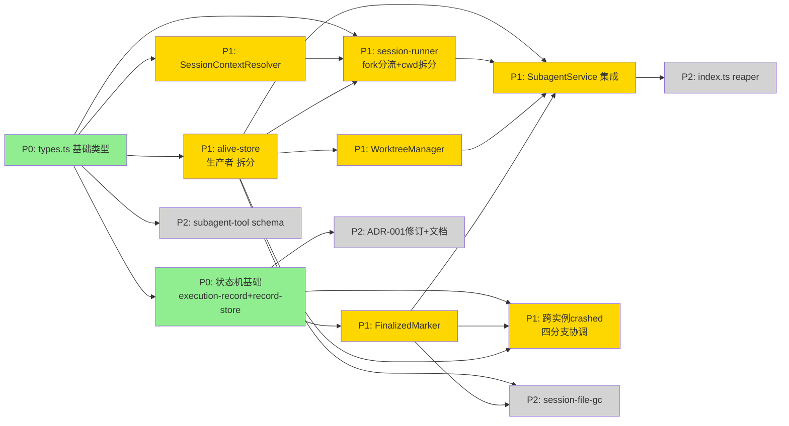

# Issue 决策图 — subagent fork 上下文 + worktree 隔离

> 取舍原则（全局默认）：优先长期、合理的架构设计，提供高可扩展性，较少考虑成本。
> 决策约束来自 decisions.md D-001~D-020（D-不可逆：D-001/002/003/004/005/006/009/014），各 issue「方案对比」不得违反已 confirmed 决策。

## 地图总览

**依赖语义（对抗审查 R2 G2 拆分后）**：P0 #1 是编译基石 → #2 状态机收敛口 + #13 alive-store（Wave-2 早期生产者，解 3 循环）→ P1 三新模块 + session-runner 分流（都依赖 #13）→ P1 SubagentService 集成（汇合点）。#12 收缩为四分支协调（blocked_by #2/#5/#13），从 W5 提到 W4。P2 多数依赖 #1/#13。

**优先级分组**：P0 = #1, #2（阻塞项）｜ P1 = #3, #4, #5, #6, #7, #12, #13（核心）｜ P2 = #8, #9, #10, #11（重要）｜ 延后项 = worktree 嵌套。

## 上游覆盖核验（MANDATORY，逐条不漏）

> 4 轴（状态§5/模块§7/边界§8/挑战§10）+ 兜底（§9/§11/§12）。逐元素扫描 system-architecture.md。

### 状态轴（§5 状态流转）

| 上游元素 | 轴 | 对应 issue | 状态 | N/A 理由 |
|---------|----|-----------|------|----------|
| §5: `running→done`（finalizeRecord 成功）| 状态 | #7 | ✅ 已覆盖 | — |
| §5: `running→failed`（finalizeRecord 失败）| 状态 | #7 | ✅ 已覆盖 | — |
| §5: `running→cancelled`（cancelBackground CAS 抢锁）| 状态 | #7 | ✅ 已覆盖 | — |
| §5: `running→crashed`（启动期重建检测无标记）| 状态 | #2 | ✅ 已覆盖 | — |
| §5: crashed 不经 tryTransition（重建推断态）| 状态 | #2 | ✅ 已覆盖 | — |
| §5: STATUS_PRIORITY + crashed（running=0/failed=1/crashed=1/cancelled=2/done=3）| 状态 | #2 | ✅ 已覆盖 | — |
| §5: crashed 检测三分支（.cancelled/.finalized/都无）经 markReconstructedStatus | 状态 | #2 | ✅ 已覆盖 | — |
| §5: 已知盲区——跨 pi 实例 crashed 误判（D-021 反哺为本轮处理）| 状态 | #12, #13 | ✅ 已覆盖（P1，#13 alive-store 生产者 + #12 四分支协调，R2 拆分） | — |

### 模块轴（§7 模块划分）

| 上游元素 | 轴 | 对应 issue | 状态 | N/A 理由 |
|---------|----|-----------|------|----------|
| §7 新增: SessionContextResolver（纯函数）| 模块 | #3 | ✅ 已覆盖 | — |
| §7 新增: WorktreeManager（create/cleanup/scan/collectPatch/gitRun）| 模块 | #4 | ✅ 已覆盖 | — |
| §7 新增: FinalizedMarker（write/read）| 模块 | #5 | ✅ 已覆盖 | — |
| §7 新增（D-021）: alive-store（write/read/remove + isProcessAlive，拆分自 #12）| 模块 | #13 | ✅ 已覆盖（R2 G2 拆分） | — |
| §7 修改: session-runner（fork 分流 + cwd 拆分）| 模块 | #6 | ✅ 已覆盖 | — |
| §7 修改: execution-record（crashed + markReconstructedStatus）| 模块 | #2 | ✅ 已覆盖 | — |
| §7 修改: record-store（STATUS_PRIORITY + 三分支）| 模块 | #2 | ✅ 已覆盖 | — |
| §7 修改: session-reconstructor（crashed 判定上移 record-store）| 模块 | #2 | ✅ 已覆盖 | — |
| §7 修改: session-file-gc（清理 .finalized）| 模块 | #10 | ✅ 已覆盖 | — |
| §7 修改: subagent-service（集成新组件 + D-017 时序）| 模块 | #7 | ✅ 已覆盖 | — |
| §7 修改: index.ts（session_start 挂 reaper + 缓存主 session 路径）| 模块 | #9 | ✅ 已覆盖 | — |
| §7 修改: subagent-tool（schema 加 fork/worktree/cwd）| 模块 | #8 | ✅ 已覆盖 | — |
| §7 修改: types.ts（ExecutionStatus + SdkLike + SessionRunnerContext）| 模块 | #1 | ✅ 已覆盖 | — |
| §7 集成点表: SubagentService execute/finalizeRecord/cancelBackground | 模块 | #7 | ✅ 已覆盖 | — |
| §7 降级决策: worktree 嵌套检测（.git 文件检查，OS-6 禁止）| 模块 | #4 | ✅ 已覆盖 | — |

### 边界轴（§8 Context Map）

| 上游元素 | 轴 | 对应 issue | 状态 | N/A 理由 |
|---------|----|-----------|------|----------|
| §8: pi CLI 核心（客户-供应商，forkFrom/createBranchedSession/createAgentSession）| 边界 | #6 | ✅ 已覆盖 | — |
| §8: git（遵奉者，WorktreeManager 内部 gitRun helper）| 边界 | #4 | ✅ 已覆盖 | — |
| §8: ExtensionContext.sessionManager.getSessionFile()（取主 session 路径）| 边界 | #9 | ✅ 已覆盖 | — |

### 挑战轴（§10 挑战与决策）

| 上游元素 | 轴 | 对应 issue | 状态 | N/A 理由 |
|---------|----|-----------|------|----------|
| §10 D-014: SessionContextResolver 纯函数化（forkFrom 上移 session-runner）| 挑战 | #3, #6 | ✅ 已覆盖 | — |
| §10 D-015: 删除 keepBranch 预留（YAGNI）| 挑战 | #4 | ✅ 已覆盖 | AC-7 grep 验证，不独立 issue |
| §10: crashed 不经 tryTransition 特化 | 挑战 | #2 | ✅ 已覆盖 | — |
| §10 D-017: finalizeRecord 三件套独立 try/catch + diff 先行 | 挑战 | #7 | ✅ 已覆盖 | — |
| §10 GAP-E5: worktree cleanup 挂 finalizeRecord 内（非 session-runner finally）| 挑战 | #7 | ✅ 已覆盖 | — |

### 兜底（§9/§11/§12）

| 上游元素 | 轴 | 对应 issue | 状态 | N/A 理由 |
|---------|----|-----------|------|----------|
| §9 泳道: fork+worktree 组合执行流程 | 兜底 | #6, #7 | ✅ 已覆盖 | 集成验证 |
| §9 泳道: 崩溃恢复流程（启动期检测）| 兜底 | #2, #9 | ✅ 已覆盖 | — |
| §11 AC-1: Core 层零 Pi 依赖（SessionContextResolver 无 pi import）| 兜底 | #3 | ✅ 已覆盖 | AC 进 #3 验收标准 |
| §11 AC-2: SessionContextResolver 零副作用 | 兜底 | #3 | ✅ 已覆盖 | AC 进 #3 验收标准 |
| §11 AC-3: STATUS_PRIORITY 覆盖 crashed | 兜底 | #2 | ✅ 已覆盖 | AC 进 #2 验收标准 |
| §11 AC-4: worktree 清理配对 | 兜底 | #4 | ✅ 已覆盖 | AC 进 #4 验收标准 |
| §11 AC-5: finalized sidecar GC 清理 | 兜底 | #10 | ✅ 已覆盖 | AC 进 #10 验收标准 |
| §11 AC-6: reaper 挂载 session_start | 兜底 | #9 | ✅ 已覆盖 | AC 进 #9 验收标准 |
| §11 AC-7: keepBranch 已删除 | 兜底 | #4 | ✅ 已覆盖 | AC 进 #4 验收标准 |
| §11 AC-8: SdkLike.SessionManager 含 forkFrom + createBranchedSession | 兜底 | #1 | ✅ 已覆盖 | AC 进 #1 验收标准 |
| §11 AC-9: finalizeRecord 时序 collectPatch 先行 | 兜底 | #7 | ✅ 已覆盖 | AC 进 #7 验收标准 |
| §11 AC-10: GitPort 不存在 | 兜底 | #4 | ✅ 已覆盖 | AC 进 #4 验收标准 |
| §11 AC-11: PatchCollector 不独立 | 兜底 | #4 | ✅ 已覆盖 | AC 进 #4 验收标准 |
| §12 BC-1: sync/background 统一执行入口（保持）| 兜底 | #7 | ✅ 已覆盖 | 集成验证 |
| §12 BC-2: task prompt=上下文（→ ADR-001 决策 2 修订）| 兜底 | #11 | ✅ 已覆盖 | 独立 ticket |
| §12 BC-3: subagent session 物理隔离（保持）| 兜底 | #6 | ✅ 已覆盖 | — |
| §12 BC-4: cancelled tombstone 机制（保持，互斥 finalized）| 兜底 | #7 | ✅ 已覆盖 | — |
| §12 BC-5: RecordStore 单目录扫描（保持）| 兜底 | #2 | ✅ 已覆盖 | — |
| §12 BC-6: 并发池 sync 优先级抢占（保持）| 兜底 | #7 | ✅ 已覆盖 | — |
| §12 BC-7: 崩溃态 done→crashed 重分类 | 兜底 | #2 | ✅ 已覆盖 | — |
| §12 BC-8: background detached .catch 吞错（约束变更 D-017）| 兜底 | #7 | ✅ 已覆盖 | — |
| §4 降级: patch 内容结构不建模（git 原生 diff 文本）| 兜底 | #4 | ✅ 已覆盖 | collectPatch 只调度不解析 |
| §4 模型: SubagentIdentityData forkDepth 校验 ≤10（写侧 M4 构造器守卫）| 兜底 | #6 | ✅ 已覆盖 | AC-6.8 写侧 M4 守卫（tracing B 修复，#3 仅读侧 AC-3.5）|
| §4 模型: WorktreeHandle（新增 VO，path+branch+baseCommit 不可变）| 兜底 | #4 | ✅ 已覆盖 | AC-4.13 归属明确 + readonly（tracing B 修复）|

---

## #1: types.ts 基础类型扩展

**P 级**: P0
**类型**: 模型
**Blocked by**: 无
**推荐强度**: Strong

### 问题描述

为 fork/worktree 能力扩展跨层类型契约。三项扩展互不依赖但同属 types.ts，合并一个 issue 高内聚：
1. `ExecutionStatus` 枚举加 `crashed`（D-013#2）—— 不加则 record-store/execution-record 引用该联合类型编译报错。
2. `SdkLike.SessionManager` 加 `forkFrom(forkSource, cwd, sessionDir)`（**静态**，session-manager.ts:1434）声明到 SdkLike.SessionManager 静态块（types.ts:526-529）；`createBranchedSession(leafId)`（**实例方法**，session-manager.ts:1286，返回 `string\|undefined` + 原地 mutate）声明到 **AgentSessionLike.sessionManager 实例端鸭子类型**（与 appendCustomEntry types.ts:486-491 同范式，对抗审查 R2 F-6 修正——避免加错接口）（D-016 + D-018）。
3. `SessionRunnerContext` 加 `mainCwd` / `mainSessionFile`，现有 `cwd` 语义收窄为 `effectiveCwd`（D-012③，**不加 gitPort** D-014）。
4. **#12 反哺补充（B7 修复，D-023）**: `SubagentRecord`（投影类型）加 `externalInstance?: boolean` 字段——跨实例 running-elsewhere 的 record 用此标志而非污染 ExecutionStatus 联合类型。ExecutionStatus 保持 {running, done, failed, cancelled, crashed} 不加 __external。

关联 system-architecture §7 修改模块 types.ts 行。

### 为什么是这个 P 级

- **P0（必须先做，阻塞）**: 不加 `crashed` 到 ExecutionStatus 联合类型，#2（record-store STATUS_PRIORITY）和 #7（finalizeRecord）的类型引用直接编译失败，后续所有 issue 无法推进。SdkLike 扩展是 #6（session-runner fork 分流）调用 forkFrom/createBranchedSession 的类型前置——不声明则在 typed `sdk: SdkLike` 上调用未声明方法报 TS 错误（NEW-D1 收敛结论）。这是编译基石，所有下游 issue 在类型层面依赖它。

### 方案对比

> 注：本 issue 的三项扩展均已被 D-016/D-018/D-012③/D-014 拍板为唯一方案，无根本性架构选择空间（违反即推翻 D-不可逆）。方案对比在此体现"为何不另起"，满足"长期架构优先"。

#### 方案 A: 增量扩展（沿用鸭子类型约定，推荐）

**改动**:
- 模型: ExecutionStatus 联合类型追加 `"crashed"`；SdkLike.SessionManager 接口块追加两方法签名（返回类型 `unknown`，与现有 create 同风格）；SessionRunnerContext 接口加两可选/必填字段。
- 不新建文件，全部在现有 types.ts 内。

**优点**: 类型契约与现有鸭子类型范式一致（appendCustomEntry 先例），下游消费者（session-runner）无需适配新导入路径；crashed 作为联合类型成员让 tryTransition 的 target 守卫天然类型安全。
**缺点**: types.ts 单文件职责略增（已含大量跨层类型，可接受）。
**适用场景**: 本需求——forkFrom/createBranchedSession 是 pi SDK 既有能力的鸭子类型声明，非新抽象。

#### 方案 B: 抽独立 session-context-types.ts

**改动**: 把 fork/worktree 相关类型（WorktreeHandle、SessionRunnerContext 新字段、fork 意图数据）抽到独立文件。

**优点**: types.ts 职责收窄。
**缺点**: 违反 YAGNI——WorktreeHandle 归 Runtime、fork 意图归 Core 编排，强抽到单一 types 文件制造跨层耦合文件；与仓库现有"types.ts 统一跨层类型"约定相悖。
**适用场景**: 类型膨胀到需要按层分包时（远期）。

### 取舍决策

**选择**: 方案 A
**理由**: 沿用现有鸭子类型 + 统一 types.ts 约定（长期架构一致性优于为单需求开文件），且 forkFrom/createBranchedSession 是声明既有 SDK 能力的 subset，非新抽象。方案 B 的抽包在当前规模是过度设计，留待真有层间类型膨胀信号时再演进。

**放弃方案的理由**:
- 方案 B: 过早按层分包，与仓库现有约定相悖，且 WorktreeHandle/fork 意图分属不同层，强抽进单文件制造跨层耦合而非消除。

### 验收标准（G1 声明位置修正 + G3/G4 行为测试升级）

- [ ] AC-1.1 [正常]【机器门 grep】（trace: UC-3）: forkFrom 命中 SdkLike.SessionManager **静态**块；createBranchedSession 命中 **AgentSessionLike.sessionManager 实例端**鸭子类型块（对抗审查 F-6：声明位置正确，grep 带上下文 -A20 验证在正确接口块内）
- [ ] AC-1.2 [正常]【行为测试·类型测试】（acceptance 加固）: ExecutionStatus 联合类型含 `"crashed"`——TS 类型测试断言（`type _Check = ExecutionStatus extends ...\|"crashed" ... ? true : never`），非 grep 注释/死字符串
- [ ] AC-1.3 [边界]【机器门 grep】: SessionRunnerContext 加 mainCwd + mainSessionFile，cwd 语义=effectiveCwd；**不含 gitPort 字段**（D-014）
- [ ] AC-1.4 [异常]【机器门 grep】: SdkLike 声明用鸭子类型（与 appendCustomEntry 同范式），非裸 any 强转
- [ ] AC-1.5 [边界]【行为测试·类型测试】（B7 修复 D-023）: SubagentRecord 投影类型加 externalInstance?: boolean；ExecutionStatus 联合类型**不含** __external（类型测试断言保持 {running,done,failed,cancelled,crashed}）
- [ ] AC-1.6 [异常]【行为测试】（B10 修复）: forkFrom/createBranchedSession 返回经 session-runner 收窄（runtime shape check 或受控类型断言），非裸 any 强转传 createAgentSession

---

## #2: 状态机基础 — execution-record + record-store + session-reconstructor

**P 级**: P0
**类型**: 模型
**Blocked by**: #1
**推荐强度**: Strong

### 问题描述

实现 crashed 新终态的状态机收敛口，跨三个高内聚模块（execution-record 叶子 / record-store 执行域 / session-reconstructor 编排），合并一个 issue：
1. **execution-record.ts**: tryTransition target 加 crashed；**新增 `markReconstructedStatus(record, status)` 收口方法**（重建专用，不裸赋值 record.status，M3）；completeRecord status 加 crashed。（D-010, D-013#2, M3）
2. **record-store.ts**: STATUS_PRIORITY 加 crashed=1；reconstructAll 改三分支检测（readCancelledTombstone→cancelled / readFinalized→done/failed / 都无→crashed），全部经 markReconstructedStatus。（D-013#1#2, M3, BC-7）。**注**: 三分支「都无→crashed」由 #12（D-021）扩展为四分支（pid 探活插入），#2 先实现基础三分支，#12 在「都无」分支前插入探活层。
3. **session-reconstructor.ts**: status 推导不变（仍按 stopReason 推 done/failed），crashed 判定上移 record-store。（D-013#1）

关联 system-architecture §5 状态流转 + §7 修改模块 + §12 BC-7。

### 为什么是这个 P 级

- **P0（必须先做，阻塞）**: crashed 终态是 D-006 拍板的核心观测性目标（G3）——崩漏标记的实现基础。markReconstructedStatus 收口方法是 M3 的强制不裸赋值约束，#7（SubagentService finalizeRecord）和崩溃恢复泳道都依赖 record-store 的三分支检测正确。STATUS_PRIORITY 缺 crashed key 会编译失败（#1 加了枚举但这里要赋优先级）。session-reconstructor 的 crashed 上移是消除现有多处判定的收敛，不做则 #7 集成时 crashed 逻辑分散。

### 方案对比

#### 方案 A: markReconstructedStatus 收口 + 三分支在 record-store（推荐）

**改动**:
- 模型: execution-record 加 markReconstructedStatus(record, status) 方法（与 tryTransition 并列的收口，但跳过 CAS——重建态无内存 running record 可竞争）。
- 模型: record-store.reconstructAll 三分支 if/else（.cancelled / .finalized / 都无），每分支调 markReconstructedStatus。
- 流程: session-reconstructor 不再自行判 crashed，只返回按 stopReason 推导的 done/failed。

**优点**: crashed 判定单点收敛（record-store），消除现有多处零散判定；markReconstructedStatus 让重建路径与运行期转换走不同收口（CAS 不适用于死进程），状态机不变式（不裸赋值）保持。
**缺点**: record-store 职责增加（三分支逻辑）——但 record-store 本就是重建归属（BC-5 单目录扫描 + reconstructAll 已在此）。
**适用场景**: 本需求——crashed 是重建态非运行态，三分支检测天然属 reconstructAll。

#### 方案 B: session-reconstructor 保留 crashed 判定（现状下沉）

**改动**: crashed 判定留在 session-reconstructor.ts:396-397（现有位置），record-store 只调 readFinalized 传给 reconstructor。

**优点**: 改动面更小（session-reconstructor 不改判定逻辑）。
**缺点**: 违反 §7 明确的"crashed 判定上移 record-store"（D-013#1）——判定散落两文件；三分支语义（都无→crashed）需要在调用方组合 tombstone+finalized 两次读取，record-store 读不到完整态。
**适用场景**: 若三分支检测需要 reconstructor 的 stopReason 才能判（但实际 crashed 不依赖 stopReason）。

### 取舍决策

**选择**: 方案 A
**理由**: crashed 三分支检测需要 tombstone + finalized 两次磁盘读，这两者都在 record-store 的扫描域内；判定上移 record-store 让单点拥有完整信息，符合长期可维护性（消除散落判定）。markReconstructedStatus 收口保持状态机不变式（重建态经专用方法，非裸赋值），与 CAS 收口正交不冲突。方案 B 的"改动小"是短期成本考量，但留下判定散落的长期债。

**放弃方案的理由**:
- 方案 B: 违反已确认的 D-013#1（crashed 上移），且三分支语义需要在调用方组合多次磁盘读，record-store 反而读不到完整态——长期可维护性更差。

### 验收标准（F-4 STATUS_PRIORITY key + G3/G4 行为测试升级）

- [ ] AC-2.1 [正常]【行为测试·结构断言】（trace: UC-5，F-4 加固）: STATUS_PRIORITY 含 crashed key（结构化对象 + 单测断言 5 key 全在：running/failed/crashed/cancelled/done）；**同次编辑补 key**（#1 加 crashed 后 Record<ExecutionStatus> 要求全 key，缺则编译失败）
- [ ] AC-2.2 [正常]【行为测试·覆盖性质】（trace: UC-7 崩溃标记）: reconstructAll 三分支全路径经 markReconstructedStatus——单测/静态规则禁 record-store 内 `record.status=` 裸赋值（markReconstructedStatus 是 status 唯一写点）
- [ ] AC-2.3 [正常]【行为测试·静态规则】: execution-record.markReconstructedStatus 是收口方法（不裸赋值）；静态扫描禁 execution-record 外的 `.status=` 赋值
- [ ] AC-2.4 [边界]【行为测试】: crashed 的 reason "process killed (no finalized marker)"（§5 Reason 表，#2 基础三分支「无 .alive」路径）；单测断言重建后 record.reason 含期望串
- [ ] AC-2.5 [异常]【行为测试】: session-reconstructor 仍按 stopReason 推 done/failed，不再判 crashed（判定已上移 record-store）
- [ ] AC-2.6 [并发]【行为测试】: BC-5——RecordStore 单目录扫描不变（sessionsDir 恒用 mainCwd 编码）

---

## #3: SessionContextResolver — 纯函数 fork 意图解析

**P 级**: P1
**类型**: 模块
**Blocked by**: #1
**推荐强度**: Strong

### 问题描述

新增 Core 编排子层模块 SessionContextResolver（D-014 定位为真正纯函数）：
`resolveSessionContext({fork, worktree, cwd, mainCwd, mainSessionFile}) → {shouldFork, forkSource, effectiveCwd, sessionDir}`。
- fork 深度校验：读 parent identity 的 depth+1，>10 拒绝（D-007，forkDepth 写入 SubagentIdentityData 时构造器内守卫 M4）。
- **零副作用**：不调 pi SDK，不碰 IO（execFileSync/writeFileSync/spawn/readFileSync/forkFrom/sdk.* 全部禁用）。
- sessionDir 用 mainCwd 编码（getSubagentSessionDir 入参，D-004）。

关联 system-architecture §7 新增模块 + §10 D-014 + §11 AC-1/AC-2。

### 为什么是这个 P 级

- **P1（核心）**: SessionContextResolver 是 fork 意图的单一解析点，#6（session-runner 分流）依赖它返回的意图数据决定 createBranchedSession vs create。纯函数定位（D-014）是核心架构决策——它让 fork 意图解析可单测、Core 零 Pi 依赖铁律保持，是长期可扩展性的支点。

### 方案对比

> D-014 已拍板 SessionContextResolver 为纯函数、forkFrom 留 session-runner（D-不可逆）。方案对比体现"纯函数边界怎么切"。

#### 方案 A: 返回 fork 意图数据，forkFrom 留 session-runner（推荐）

**改动**:
- 模块: 新建 session-context-resolver.ts，导出 resolveSessionContext 纯函数。
- 模型: 返回 {shouldFork, forkSource, effectiveCwd, sessionDir} 纯数据。
- 流程: session-runner 拿意图后自行分流调 sdk.forkFrom/create。

**优点**: 纯函数名副其实（AC-2 grep 零副作用可通过）；forkFrom 副作用复用 session-runner 现有合法 ctx.sdk 路径；Core 编排两文件分工清晰（Resolver 纯解析 / runner 带副作用执行）。
**缺点**: forkFrom 调用与意图解析分两处（但本就跨"解析"与"执行"边界，分离合理）。
**适用场景**: 本需求——Core 零 Pi 依赖铁律要求 SCR 不持 sdk。

#### 方案 B: SCR 持 sdk 参数，内部调 forkFrom

**改动**: resolveSessionContext 接收 sdk 参数，内部 forkFrom。

**优点**: fork 逻辑单点。
**缺点**: 直接违反 D-014（D-不可逆）——打破 Core 零 Pi 依赖（AC-1 失败）+ 破坏纯函数（AC-2 失败）；scr 可单测性丧失（需 mock sdk）。
**适用场景**: 无（被 D-014 排除）。

### 取舍决策

**选择**: 方案 A
**理由**: D-014 拍板（3 帧交叉验证击穿初稿矛盾）——纯函数 + forkFrom 上移让 AC-1/AC-2 双重验证可过，Core 编排两文件分工清晰是长期架构支点。方案 B 直接推翻 D-不可逆，排除。

**放弃方案的理由**:
- 方案 B: 违反 D-014（D-不可逆），打破 Core 零 Pi 依赖 + 纯函数不变式。

### 验收标准

- [ ] AC-3.1 [正常]（trace: UC-1 fork）: fork:true → shouldFork:true, forkSource=mainSessionFile
- [ ] AC-3.2 [正常]（trace: UC-2 worktree）: worktree:true → effectiveCwd=worktreePath
- [ ] AC-3.3 [异常]: `grep "from.*pi-coding-agent" extensions/subagents/src/core/session-context-resolver.ts` 无输出（AC-1）
- [ ] AC-3.4 [异常]: `grep "execFileSync\|writeFileSync\|spawn\|readFileSync\|forkFrom\|sdk\." extensions/subagents/src/core/session-context-resolver.ts` 无输出（AC-2，零副作用）
- [ ] AC-3.5 [边界]: fork depth = parent depth+1，>10 拒绝（D-007，trace: UC-1 fork 深度限制）
- [ ] AC-3.6 [正常]: sessionDir 用 mainCwd 编码（不随 effectiveCwd 变，D-004/BC-3）

---

## #4: WorktreeManager — git worktree 生命周期 + collectPatch + reaper

**P 级**: P1
**类型**: 模块
**Blocked by**: #1, #13
**推荐强度**: Strong

### 问题描述

新增 Runtime 执行域模块 WorktreeManager（~450 LOC，对抗审查 R2 修正：原估 ~280 严重低估，node_modules 软链+setupHook 参考第三方 ~140 LOC），git worktree 全生命周期：
1. **create(mainCwd, recordId) → WorktreeHandle{path, branch, baseCommit}**: clean 校验 + `git worktree add` + node_modules 软链（monorepo）+ setupHook + 嵌套检测（当前已在 worktree 内运行则拒绝，`.git` 文件检查，OS-6）。
2. **cleanup(handle) → void**: `git worktree remove --force` + `git branch -D` 成对（D-015 删 keepBranch，AC-4/AC-7）。
3. **scan(mainCwd, agentDir) → void**: reaper 扫 `pi-sub-*` 孤儿 worktree 清理（**是方法非独立类**，GAP-4.3/E2，AC-6）。**D-024 反哺关键约束（B8 跨实例删活 worktree 修复）**: 「孤儿」判据 = worktree 关联 session 有终态标记（.cancelled/.finalized/.crashed 之一）**且无活 .alive**（readAliveMarker + isProcessAlive，复用 #12 机制）；**绝不删**有活 .alive 的 worktree（防跨实例误删实例 A 正在跑的活工作目录——这是最危险破坏性竞态，比 crashed 误判严重一个量级）。
4. **collectPatch(...) → patch 文本/文件**: `git diff --cached <baseCommit>` → patch（D-020 合并自 PatchCollector，不独立模块，AC-11）。内部只调度 git 命令 + 文件 IO，不解析 patch（§4 降级决策）。
5. **私有 gitRun helper**: execFileSync("git") + 统一超时/错误处理（D-019 删 GitPort，无 port 文件，AC-10）。

关联 system-architecture §7 新增模块 + §4 降级决策 + §11 AC-4/AC-7/AC-10/AC-11。

### 为什么是这个 P 级

- **P1（核心）**: WorktreeManager 是 worktree 隔离（G2/D-002）的执行载体——create/cleanup 是 #7 集成的运行时依赖，scan（reaper）是崩溃恢复泳道的清孤儿入口。collectPatch 是 patch 回传（D-005）的生成点，#7 finalizeRecord 依赖它产出 patch。这是 Runtime 层最重的新模块，但依赖仅 #1（用 WorktreeHandle 类型），可与 #3 并行。

### 方案对比

> D-019（删 GitPort）/ D-020（合并 PatchCollector）/ D-015（删 keepBranch）已拍板。方案对比体现"git 操作的收口形式"与"模块边界"。

#### 方案 A: 单 WorktreeManager 类 + 内部私有 gitRun（推荐）

**改动**:
- 模块: 新建 worktree-manager.ts（Runtime），一个类含 create/cleanup/scan/collectPatch + 私有 gitRun。
- 模型: gitRun = execFileSync("git", [...args], {cwd, timeout}) + 统一错误包装。

**优点**: git 调用单类收口（D-011 精神保留）；无 GitPort interface（D-019 deletion test：buildEnvBlock 已直接 execFileSync("git") 无 port 运行良好，git CLI 极稳定 seam 价值近零）；collectPatch 是同类生命周期职责，合并自然（D-020）。
**缺点**: WorktreeManager 单类职责较重（4 方法 + helper）——但都是"git worktree 生命周期"单一变化轴，内聚。
**适用场景**: 本需求——git CLI 极稳定，不需要为可替换性留 port。

#### 方案 B: 独立 GitPort interface + PatchCollector 类

**改动**: 抽 GitPort interface（+ RealGitPort 实现），PatchCollector 独立类。

**优点**: git 可 mock（测试）。
**缺点**: 直接违反 D-019（红队 deletion test 击穿）+ D-020——zero-value 伪 seam（调用方本轮=零，buildEnvBlock 先例无需 port）；interface 永远可后加（YAGNI）。
**适用场景**: git 后端需可替换时（远期，无信号）。

### 取舍决策

**选择**: 方案 A
**理由**: D-019/D-020 拍板——git CLI 极稳定（30 年 API 兼容），seam 价值近零；buildEnvBlock 先例证明直接 execFileSync 无 port 运行良好；interface 永远可后加（真有 git 后端替换需求时）。方案 B 是已被红队击穿的过度设计。

**放弃方案的理由**:
- 方案 B: 违反 D-019（删 GitPort）+ D-020（合并 PatchCollector），zero-value 伪 seam，红队 deletion test 已证伪。

### 验收标准（G3/G4 行为测试升级 + #13 引用）

- [ ] AC-4.1 [正常]【行为测试·集成】（trace: UC-2 worktree）: create 返回 WorktreeHandle{path, branch, baseCommit}，子 agent bash cwd = worktreePath
- [ ] AC-4.2 [正常]【机器门 grep + 行为测试】（trace: UC-4 patch 清理）: cleanup 内 `git worktree remove --force` + `git branch -D` 成对（AC-4）；grep -n 验证两调用相邻 + 单测断言两者都执行
- [ ] AC-4.3 [正常]【行为测试】: collectPatch 调 `git diff --cached <baseCommit>` 产出 patch 文本，不解析 patch 内容（§4 降级）
- [ ] AC-4.4 [异常]【行为测试·故障注入·集成】（trace: UC-5 reaper，B8 修复 D-024，引用 #13）: scan 孤儿判据 = 终态标记（.cancelled/.finalized/.crashed 之一）且无活 .alive（readAliveMarker+isProcessAlive from #13）；**绝不删**有活 .alive 的 worktree——故障注入集成测试：实例 A 活 .alive+活 pid → 实例 B scan → 断言 A 的 worktree 仍存在（remove callCount==0）
- [ ] AC-4.5 [边界]【行为测试】: create 嵌套检测——当前已在 worktree 内运行（.git 文件检查）则拒绝（OS-6）
- [ ] AC-4.6 [异常]【机器门 grep】: `grep -ri "keepBranch" extensions/subagents/src/` 无输出（AC-7，D-015）
- [ ] AC-4.7 [异常]【机器门 grep】: `find ... -name "*git-port*" -o -name "*GitPort*"` 无输出；WorktreeManager 内有私有 gitRun（AC-10，D-019）
- [ ] AC-4.8 [异常]【机器门 grep】: `find ... -name "*patch-collector*" -o -name "*PatchCollector*"` 无输出；collectPatch 是 WorktreeManager 方法（AC-11，D-020）
- [ ] AC-4.9 [异常]【行为测试】: clean 校验——主 cwd 有未提交改动时 create 行为（拒绝 or 警告，单测验证）
- [ ] AC-4.10 [正常]【行为测试·集成】（B5/MISMATCH 修复）: create 后 worktree 内 node_modules 可用（monorepo 软链生效）+ setupHook 副作用发生——集成测试真实 create → 断言 node_modules/.bin 存在 + setupHook 执行
- [ ] AC-4.11 [边界]【行为测试】（B5 修复）: 主 cwd 无 node_modules 时软链跳过（不报错）；非 monorepo 仓 create 正常
- [ ] AC-4.12 [边界]【行为测试】（B6 修复）: collectPatch 空改动→空 patch（单测 assert patch===""）；二进制改动→记 binary-skipped（单测 assert result 含 binary-skipped 且不含 patch 体）
- [ ] AC-4.13 [正常]【行为测试·类型测试】（A-MISMATCH 修复）: WorktreeHandle readonly 字段 + Object.isFrozen 断言不可变

---

## #5: FinalizedMarker — .finalized sidecar 写 + crashed 检测读

**P 级**: P1
**类型**: 模块
**Blocked by**: #1, #2
**推荐强度**: Strong

### 问题描述

新增 Runtime 执行域模块 FinalizedMarker（~50 LOC）：
1. **write(sessionFile) → void**: finalize 时写 `.finalized` sidecar（D-006）。
2. **readFinalized(sessionFile) → boolean**: 重建时调，配合三分支检测（#2 record-store 调用）。
- 对称 GC 兼容（session-file-gc #10 清理 .finalized）。
- 与 .cancelled tombstone 互斥（BC-4：cancelled 写 .cancelled 不写 .finalized）。

关联 system-architecture §7 新增模块 + §5 crashed 检测 + §10 D-006。

### 为什么是这个 P 级

- **P1（核心）**: .finalized sidecar 是 D-006 崩溃标记机制的核心——#7（finalizeRecord 写 finalized）和 #2（reconstructAll 读 finalized）双向依赖。#2 的三分支检测需要 readFinalized，是 #2 的运行时依赖（#5 实现先于 #2 集成）。

### 方案对比

#### 方案 A: 独立 FinalizedMarker 类（推荐）

**改动**: 新建 finalized-marker.ts，一个类含 write/readFinalized，文件路径 = sessionFile + ".finalized"。

**优点**: 标记策略单点（写/读/命名集中）；对称 .cancelled tombstone 模式（tombstone-store 先例）；易测。
**缺点**: 又一个 Runtime 类——但职责单一清晰（~50 LOC）。
**适用场景**: 本需求——finalize 标记是独立横切机制。

#### 方案 B: 合并进 record-store（复用重建路径）

**改动**: readFinalized/write 作为 record-store 方法。

**优点**: 少一个文件。
**缺点**: record-store 是"记录聚合扫描"，标记文件 IO 是不同关注点；写点（#7 finalizeRecord，Runtime SubagentService）与读点（record-store）跨调用方，合并进 record-store 让写路径绕远。违反 §7 明确的独立 FinalizedMarker 模块定位。
**适用场景**: 无（§7 已定独立模块）。

### 取舍决策

**选择**: 方案 A
**理由**: §7 已定 FinalizedMarker 为独立新模块——标记策略单点 + 对称 .cancelled tombstone 模式是长期清晰性支点；~50 LOC 单职责类不构成文件膨胀。方案 B 把标记 IO 混进记录聚合，破坏关注点分离。

**放弃方案的理由**:
- 方案 B: 违反 §7 独立模块定位，标记 IO 与记录聚合是不同关注点。

### 验收标准

- [ ] AC-5.1 [正常]（trace: UC-6）: write 在 sessionFile 同目录写 `.finalized` sidecar
- [ ] AC-5.2 [正常]（trace: UC-7 崩溃标记）: readFinalized 返回 boolean
- [ ] AC-5.3 [异常]: cancelled 路径不写 .finalized（BC-4 互斥，.cancelled tombstone 优先）
- [ ] AC-5.4 [边界]: sessionFile 不存在时 readFinalized 返回 false（不抛）

---

## #6: session-runner fork 分流 + cwd 拆分

**P 级**: P1
**类型**: 模块
**Blocked by**: #1, #3, #13
**推荐强度**: Strong

### 问题描述

修改 Core 编排 session-runner.ts（createAndConfigureSession）：
1. **fork 分流**（D-012①, D-014, D-018）: 调 SessionContextResolver（#3）拿 fork 意图 → 按意图分流 `shouldFork ? forkSession : createSession`。forkSession 正确链路（对抗审查 R2 G1 修正）：`SessionManager.open(mainSessionFile, sessionDir)` 加载主 session 条目 → 在该**实例**上调 `.createBranchedSession(leafId)`（**实例方法**，返回 `string\|undefined` 新文件路径 + **原地 mutate** 该实例的 sessionId/sessionFile/fileEntries，session-manager.ts:1286-1341）→ 把**同一 mutate 后的实例**作 sessionManager 传 createAgentSession。优先 createBranchedSession（只取 leaf→root 路径，体积更小），forkFrom（静态，session-manager.ts:1434）仅作降级（D-018）。
2. **cwd 拆分**（D-012③）: SessionRunnerContext.cwd → effectiveCwd + mainCwd；getSubagentSessionDir 用 mainCwd（D-004，sessionDir 不随 effectiveCwd 变）。
3. mainSessionFile 从 SessionRunnerContext 取（#1 加的字段，**由 #9 在 session_start 缓存 ctx.sessionManager.getSessionFile() 接入 buildSessionRunnerContext**——#6 依赖 #9 先把 mainSessionFile 接入，对抗审查 R2 F-2 修正）。
4. **#13 反哺补充**: session 创建后、prompt 前调 `writeAliveMarker(sessionFile, {pid: process.pid, id, startedAt})`（D-021 pid 探活写入点，#13 alive-store，紧邻 identity custom entry，session-runner.ts:461）——让 running subagent 在磁盘留存活信号供跨实例重建探活。
- createAgentSession({cwd: effectiveCwd, sessionManager: mutate 后的 forked 实例}) —— buildSessionContext 自动 restore 主历史（fork 时）。

关联 system-architecture §7 修改 session-runner + §9 fork+worktree 泳道 + §12 BC-2/BC-3。

### 为什么是这个 P 级

- **P1（核心）**: session-runner 是唯一执行编排器——fork 分流是 fork 能力（G1/D-001）的执行落地。cwd 拆分是 worktree 存储解耦（D-004）的技术基础，#7 集成依赖 effectiveCwd 传给 createAgentSession。createBranchedSession 优先（D-018）是嵌套 fork 体积控制的关键，不做则 fork 深度叠加爆 token/磁盘。

### 方案对比

> D-014（Resolver 纯函数）/ D-018（createBranchedSession 优先）已拍板。方案对比体现"分流落点"。

#### 方案 A: createAndConfigureSession 内分流（推荐）

**改动**:
- 流程: createAndConfigureSession 开头调 resolveSessionContext → if(shouldFork) 优先 createBranchedSession else create。
- 模型: ctx.cwd → ctx.effectiveCwd + ctx.mainCwd。

**优点**: 分流逻辑与现有 createAgentSession 调用同函数，最小侵入；createBranchedSession 优先避免体积累积；Resolver 纯函数解耦（#3 已实现）。
**缺点**: createAndConfigureSession 职责略增——但本就是"创建+配置 session"的内聚点。
**适用场景**: 本需求——fork 是 session 创建的一个分支。

#### 方案 B: 新增 forkSession 独立方法（runner 内）

**改动**: createAndConfigureSession 加分支调 this.forkSession()。

**优点**: fork 路径独立可读。
**缺点**: 人为分裂 create/fork 两条路径，createAgentSession 调用重复；与 Resolver 意图数据（已含 shouldFork 标志）的设计意图相悖——意图数据就是让分流在调用点 if/else。
**适用场景**: fork 路径与 create 路径差异极大时（本需求两者都调 createAgentSession，差异仅 sessionManager 来源）。

### 取舍决策

**选择**: 方案 A
**理由**: Resolver 返回 shouldFork 意图标志的设计本就是为调用点 if/else 分流；create 和 fork 都收敛到 createAgentSession，差异仅 sessionManager 来源（created vs forked），内聚于 createAndConfigureSession。createBranchedSession 优先（D-018）嵌套体积控制是长期健壮性。方案 B 人为分裂路径制造重复。

**放弃方案的理由**:
- 方案 B: create/fork 都调 createAgentSession，差异仅 sessionManager 来源，独立方法制造重复，与意图数据设计相悖。

### 验收标准（G1 API 模型修正 + G3/G4 行为测试升级）

- [ ] AC-6.1 [正常]【机器门 grep + 行为测试】（trace: UC-1 fork，G1 修正）: fork 分流调用 `SessionManager.open(mainSessionFile)` 实例的 `.createBranchedSession(leafId)`（**实例方法**，非静态）；grep 验证无 `sdk.SessionManager.createBranchedSession`（静态误用）；集成测试断言传给 createAgentSession 的 sessionManager 是 mutate 后的同一实例
- [ ] AC-6.2 [正常]【行为测试】（trace: UC-3 组合）: fork:true + worktree:true → forkSource=mainSessionFile, effectiveCwd=worktreePath, sessionDir 用 mainCwd
- [ ] AC-6.3 [异常]【行为测试·故障注入】（B12 修复）: createBranchedSession 抛错→降级 forkFrom（try/catch 捕获）；单测 mock createBranchedSession reject → 断言走 forkFrom；eslint 规则禁 `typeof`/存在性检测降级
- [ ] AC-6.4 [正常]【行为测试·集成】（trace: BC-2/G1 核心）: fork:true → createAgentSession 的 sessionManager restore 主历史；**集成测试断言 session.messages.length>0 且含主 agent 已知消息**（G1：messages 真含主历史，非空 sessionManager）
- [ ] AC-6.5 [边界]【机器门 grep】: getSubagentSessionDir 用 mainCwd 编码（不随 effectiveCwd/worktreeCwd 变，D-004/BC-3）
- [ ] AC-6.6 [边界]【行为测试】: fork:false → 保持原 create 路径（无行为变更）
- [ ] AC-6.7 [正常]【机器门 grep】（trace: #13）: session 创建后 prompt 前调 writeAliveMarker（#13 alive-store，D-021）
- [ ] AC-6.8 [正常]【行为测试】（A-MISSING 修复）: session-runner 写 identity custom entry 时 forkDepth=parent depth+1，构造器内 M4 守卫 >10 拒绝；单测 `expect(()=>resolve({depth:11})).toThrow(/depth/)` 且 depth:10 不抛
- [ ] AC-6.9 [异常]【行为测试·标注人审】（B1 处理）: fork 读源遇 compaction 写入交错——用 SDK 快照读/createBranchedSession 取 compaction 后路径；单测 mock SDK 快照读 API 被调用；压力测试可选（标注人审）
- [ ] AC-6.10 [正常]【机器门 grep】（F-2 修正）: buildSessionRunnerContext 含 mainSessionFile 字段（来自 #9 缓存 ctx.sessionManager.getSessionFile()）

---

## #7: SubagentService 集成 — worktree create 前置 + finalizeRecord D-017 时序 + cancelBackground cleanup

**P 级**: P1
**类型**: 模块
**Blocked by**: #1, #2, #4, #5, #6, #13
**推荐强度**: Strong

### 问题描述

修改 Runtime SubagentService，集成 #4/#5，是 fork/worktree 能力的汇合点：
1. **持有 WorktreeManager + FinalizedMarker**（D-013#5）。
2. **execute 前置 worktree create**（worktree:true 时）: worktreeHandle 回填 record；非 worktree 跳过。
3. **finalizeRecord D-017 时序**（AC-9）: `⓪ WorktreeManager.collectPatch（worktree 时，best-effort try/catch，失败则跳过 cleanup 保住 worktree——见 D-022 反哺）→ ① completeRecord（含 patch 的 result，freeze record.result）→ ② store.archive（archive 在副作用写之前，防 record 卡 running）→ ③ FinalizedMarker.write + WorktreeManager.cleanup`。三件套（collectPatch/finalized/cleanup）各自独立 try/catch。**D-022 反哺关键约束（B2 数据丢失黑洞修复）**: 当 ⓪collectPatch 失败（patch 未生成），③cleanup **必须跳过**（保留 worktree + 分支不删），并在 record.result 记 `patchFailed:true` + worktree 路径，供用户手动恢复——worktree subagent 的核心交付物是改动，patch 丢失时 worktree 必须保留，不得让 cleanup 删成数据黑洞。仅当 collectPatch 成功（patch 已落 result）才执行 cleanup。
4. **cancelBackground**: WorktreeManager.cleanup（worktree:true 时），worktreeHandle==null 跳过；不写 finalized（cancelled 已有 .cancelled，BC-4）。
5. **finalizeFailed**: 经 finalizeRecord 覆盖（create-failed 路径 worktree 无改动→collectPatch 返回空 patch）。
6. **#12 反哺补充**: finalizeRecord / cancelBackground 收尾调 `removeAliveMarker(sessionFile)`（与 FinalizedMarker.write / tombstone 成对 best-effort，D-021）——清理 pid 探活 sidecar 防孤儿。

关联 system-architecture §7 SubagentService 集成点表 + §10 D-017/GAP-E5 + §12 BC-1/BC-4/BC-8。

### 为什么是这个 P 级

- **P1（核心）**: SubagentService 是编排汇合点——所有 P1 新模块的接线在此，不集成则 fork/worktree 无法端到端运行（UC-3 组合）。D-017 时序（collectPatch 先于 completeRecord，archive 先于副作用写）是 BC-8 吞错约束 + patch 回传正确性的关键，顺序错则 patch 进不了 record.result 或三件套抛错跳过 archive 卡 running。

### 方案对比

> D-017（时序）/ GAP-E5（cleanup 挂 finalizeRecord 内非 session-runner finally）已拍板。方案对比体现"三件套失败处理"。

#### 方案 A: 三件套各自独立 try/catch + collectPatch 失败保 worktree（推荐，D-022 收敛）

**改动**:
- 流程: finalizeRecord 内 collectPatch/completeRecord/archive/finalized+cleanup 顺序执行；collectPatch 包 try/catch（失败→**跳过 cleanup 保住 worktree** + record.result 记 patchFailed:true + worktree 路径，D-022 反哺修复 B2 数据黑洞）；finalized+cleanup 各自 try/catch（只记日志，任一失败不阻断其他）。
- archive 在副作用写之前（GAP-E6 意图）。
- **completeRecord/archive 抛错兜底（B9 修复）**: completeRecord(①)/archive(②) 自身抛错时，③ finalized/cleanup 仍需 best-effort 执行（包外层 try/catch 兜底），否则 record 卡 running + 无 .finalized → 误判 crashed。

**优点**: 单点失败不级联（collectPatch 失败仍 completeRecord+archive，且**保留 worktree 供手动恢复**而非删成黑洞）；archive 先行保证 record 不卡 running；符合 D-017 收紧的 BC-8 约束。
**缺点**: 三件套失败仅记日志不告警——但本轮可接受（后续 NFR 可加告警）。
**适用场景**: 本需求——worktree subagent 的核心交付物是改动，patch 丢失时 worktree 必须保留（D-022 数据安全 > 回收完整性）。

#### 方案 B: 三件套任一失败则整体 failed

**改动**: collectPatch/finalized/cleanup 任一抛错→finalizeRecord 整体标 failed。

**优点**: 失败可见。
**缺点**: collectPatch（patch 生成）失败却让已完成的 subagent 标 failed——丢失有效结果；违反 D-017 "best-effort 降级"明确意图；worktree 清理失败（常见：worktree 有未跟踪文件需 --force）会让正常完成的 subagent 误标 failed。
**适用场景**: 无（D-017 已排除）。

### 取舍决策

**选择**: 方案 A
**理由**: D-017 拍板——三件套独立 try/catch + best-effort 降级。subagent 的核心结果（AgentResult）已完成，patch 回传与 worktree 清理是后续回收，失败不应回溯否定结果（长期正确性：结果优先于回收完整性）。方案 B 让回收失败污染结果，违反 best-effort 意图。

**放弃方案的理由**:
- 方案 B: 违反 D-017 best-effort 降级意图，回收失败会污染已完成的有效结果。

### 验收标准（G3/G4 行为测试升级——时序/故障注入，不再靠 grep -n）

- [ ] AC-7.1 [正常]【行为测试·集成】（trace: UC-2/UC-3）: execute 前置 worktree:true → WorktreeManager.create，handle 回填 record
- [ ] AC-7.2 [正常]【行为测试·spy 时序】（trace: UC-4 patch 清理，D-017 核心，**不再 grep -n**）: finalizeRecord 内 collectPatch 在 completeRecord 之前——单测 spy collectPatch/completeRecord，断言 completeRecord 调用时刻 collectPatch 已 resolved（await 链）；集成测试断言 record.result 含 patch 路径
- [ ] AC-7.3 [正常]【行为测试·故障注入】: finalizeRecord 三件套各自独立 try/catch——三组故障注入单测：mock collectPatch/finalized/cleanup 各自抛错 → 断言其余仍执行
- [ ] AC-7.4 [异常]【行为测试·故障注入·数据安全】（B2 修复 D-022，最关键）: collectPatch 失败 → ③cleanup **必须跳过**（保留 worktree+分支）；故障注入单测 mock collectPatch reject → 断言（a）cleanup callCount==0（b）worktree 目录仍存在（c）record.result.patchFailed===true + 含 worktree 路径
- [ ] AC-7.5 [异常]【行为测试】: cancelBackground 调 WorktreeManager.cleanup，不写 finalized；单测 cancelled 路径执行后断言 `.finalized` 不存在、`.cancelled` 存在（BC-4）
- [ ] AC-7.6 [边界]【行为测试】: worktreeHandle==null → 跳过 collectPatch 与 cleanup（守卫单测）
- [ ] AC-7.7 [并发]【行为测试】（trace: BC-6）: worktree subagent 进同一 concurrency pool（sync 优先级抢占不变）
- [ ] AC-7.8 [正常]【行为测试】（trace: #13）: finalizeRecord/cancelBackground 收尾调 removeAliveMarker（#13 alive-store）；单测 finalize/cancel 后断言 `.alive` 不存在（防孤儿）
- [ ] AC-7.9 [异常]【行为测试·故障注入】（B9 修复）: completeRecord(①)/archive(②) 抛错时 ③finalized/cleanup 仍 best-effort 执行——故障注入单测 mock completeRecord 抛 → 断言 finalized/cleanup 执行、record 不卡 running

---

## #8: subagent-tool schema 参数 — fork/worktree/cwd

**P 级**: P2
**类型**: 模块
**Blocked by**: #1
**推荐强度**: Strong

### 问题描述

修改外壳 subagent-tool.ts 的 startParam schema（D-008）：
- 加 `fork?: boolean`（继承主 agent 上下文）
- 加 `worktree?: boolean`（独立 git worktree 隔离，**非 `isolation: "worktree"`**）
- 加 `cwd?: string`（用户指定运行目录）
- 配套文档/system prompt 说明「worktree 只隔离 git 工作树，非安全隔离」（D-008 文档要求）。

### 为什么是这个 P 级

- **P2（重要）**: schema 是用户入口，但 #7 集成（实际执行 fork/worktree）是核心路径；schema 可与 #7 后段并行。参数命名已由 D-008 拍板（isolation→worktree），无方案空间，是纯接线 + 文档。

### 方案对比

> D-008 已拍板命名。P2 仅给推荐方案 + 理由。

#### 方案 A: 三个独立可选参数（推荐）

**改动**: startParam schema 增 fork/worktree/cwd 三个可选 boolean/string。

**优点**: 语义独立（fork 与 worktree 可任意组合，UC-3）；与 D-008 命名一致；默认 false 不破坏现有调用。
**缺点**: 无。
**适用场景**: 本需求。

### 取舍决策

**选择**: 方案 A（唯一合理，D-008 已决）。

### 验收标准（G3/G4 行为测试升级 + G5 敏感数据 + 参数流）

- [ ] AC-8.1 [正常]【机器门 grep + 行为测试·集成】（trace: UC-1/UC-2/UC-3）: startParam schema 含 fork?:boolean / worktree?:boolean / cwd?:string；**端到端参数流集成测试**：tool 传 fork:true → 断言 service.execute 收到 fork=true → 断言 runner 分流到 createBranchedSession（防死参数）
- [ ] AC-8.2 [异常]【机器门 grep】: 命名为 `worktree` 非 `isolation`（D-008）
- [ ] AC-8.3 [正常]【人审 checklist】: system prompt/文档说明「worktree 只隔离 git 工作树，非安全隔离」
- [ ] AC-8.4 [正常]【人审 checklist】（G5 修复，D-007 安全文档化）: system prompt/文档明确「fork:true 继承主 agent **全部上下文含敏感数据**（API keys/secrets/对话历史），由用户显式 opt-in；对不可信场景慎用」——D-007 rationale 要求的安全警告文档化

---

## #9: index.ts — session_start 挂 reaper + 缓存主 session 路径

**P 级**: P2
**类型**: 模块
**Blocked by**: #1, #4, #7
**推荐强度**: Strong

### 问题描述

修改外壳 index.ts：
1. **session_start 挂 WorktreeManager.scan**（reaper，AC-6）: pi 启动时扫 `pi-sub-*` 孤儿 worktree 清理（崩溃恢复泳道，§9）。
2. **session_start 缓存 `ctx.sessionManager.getSessionFile()`**（D-013#6）: 取主 session 路径 → SubagentService（供 #3 Resolver 的 mainSessionFile + #6 forkSource）。
- ExtensionContext.sessionManager.getSessionFile() readonly（§8 边界）。

### 为什么是这个 P 级

- **P2（重要）**: reaper 是崩溃恢复（UC-5）的清孤儿入口，但非核心执行路径（#7 才是）；可后置。主 session 路径缓存是 #3/#6 的数据源，但 #6 可用占位先跑通（reaper/缓存补齐是完善）。

### 方案对比

> 无根本选择。P2 仅给推荐方案 + 理由。

#### 方案 A: session_start handler 内挂载（推荐）

**改动**: session_start handler 调 WorktreeManager.scan + 缓存 getSessionFile() 到 ctx。

**优点**: 沿用现有 session_start handler 模式（index.ts:62 已有 handler）；reaper 在启动期跑一次（崩溃恢复正确时机）。
**缺点**: 无。
**适用场景**: 本需求。

### 取舍决策

**选择**: 方案 A（唯一合理）。

### 验收标准（G3/G4 行为测试升级 + #13 引用）

- [ ] AC-9.1 [正常]【行为测试·集成】（trace: UC-5 reaper）: session_start 含 WorktreeManager.scan；集成测试触发 session_start → 断言 scan 被调用（spy）+ 孤儿 worktree 被清
- [ ] AC-9.2 [正常]【机器门 grep + 行为测试】（trace: BC-2 fork 上下文，F-2 修正）: session_start 缓存 ctx.sessionManager.getSessionFile() → SubagentService → buildSessionRunnerContext.mainSessionFile；断言 #6 能取到该字段
- [ ] AC-9.3 [异常]【机器门 grep】: scan 是 WorktreeManager 方法（非独立 WorktreeReaper 类）
- [ ] AC-9.4 [并发]【行为测试·故障注入·集成】（B8 修复 D-024，引用 #13）: session_start 挂的 scan 遵守 D-024 孤儿判据——故障注入集成测试：跨实例时不删实例 A 活 worktree（同 AC-4.4）

---

## #10: session-file-gc — 对称清理 .finalized sidecar

**P 级**: P2
**类型**: 模块
**Blocked by**: #1, #5, #13
**推荐强度**: Strong

### 问题描述

修改 Runtime 根 session-file-gc.ts（D-013#3）:
- walkAndClean 加清理 `.finalized` sidecar（对称现有 `.cancelled` tombstone 清理，AC-5）。
- **#12 反哺补充**: walkAndClean 也清理 `.alive` sidecar（D-021 pid 探活方案的新标记，对称 .cancelled/.finalized 同 TTL，AC-12.6）。
- finalized/alive sidecar 是 #5/#12 新增文件，GC 不清理会成孤儿残留（G3 可观测性搭便车目标）；.alive 孤儿 + pid 复用 = 长期僵尸 record（#12 hidden-cost 兜底依赖）。

### 为什么是这个 P 级

- **P2（重要）**: GC 清理是卫生项，非核心路径；但不做则 .finalized/.alive 文件累积成孤儿（长期可观测性债，且 .alive 孤儿会触发 #12 pid 复用误判）。

### 方案对比

> 无根本选择。

#### 方案 A: walkAndClean 增 .finalized + .alive glob（推荐）

**改动**: walkAndClean 的清理模式加 `.finalized` + `.alive`（与 `.cancelled` 并列，同 TTL）。

**优点**: 三类 sidecar 对称清理，模式一致；防孤儿残留（尤其 .alive 孤儿兜底 #12 pid 复用）。
**缺点**: 无。
**适用场景**: 本需求。

### 取舍决策

**选择**: 方案 A（唯一合理）。

### 验收标准（G3/G4 行为测试升级 + #13 引用）

- [ ] AC-10.1 [正常]【机器门 grep】（trace: UC-4/UC-5）: `grep "finalized" extensions/subagents/src/runtime/session-file-gc.ts` 命中（AC-5）
- [ ] AC-10.2 [正常]【行为测试·故障注入】（trace: #13 pid 复用兜底，B3 修复，引用 #13）: GC 清 .alive 前先 readAliveMarker+isProcessAlive（from #13）——单测 mock isProcessAlive=true → 断言 .alive 未被删；mock=false → 断言已删
- [ ] AC-10.3 [边界]【行为测试】: walkAndClean 清理 .finalized + .alive（死进程的）与 .cancelled 对称（同 TTL）

---

## #11: ADR-001 决策 2 修订 + 文档（BC-2 行为变更）

**P 级**: P2
**类型**: 流程
**Blocked by**: #1
**推荐强度**: Strong

### 问题描述

BC-2 行为变更 ticket（D-012④）:
- ADR-001 决策 2 原文「task prompt = subagent 全部上下文输入」需修订——引入 fork 后该契约不再绝对。
- 更新为「fork:true 时上下文=主历史+task；fork:false 保持原行为（task=全部输入）」。
- 配套 subagent-tool/system prompt 文档说明 fork 上下文继承语义（D-008 文档要求协同）。

### 为什么是这个 P 级

- **P2（重要）**: ADR 文档修正是契约一致性的收尾，非代码核心路径；但 BC-2 明确标记为「变更」，需独立 ticket 防遗漏。

### 方案对比

> 无根本选择（D-012④ 已决修订）。

#### 方案 A: 修订 ADR-001 决策 2 + 配套文档（推荐）

**改动**: ADR-001 决策 2 加 fork 分支说明；subagent-tool/system prompt 文档加 fork 上下文继承语义。

**优点**: 契约文档与代码行为一致（BC-2）；防后续维护者误读旧 ADR。
**缺点**: 无。
**适用场景**: 本需求。

### 取舍决策

**选择**: 方案 A（唯一合理，D-012④ 已决）。

### 验收标准

- [ ] AC-11.1 [正常]（trace: BC-2）: ADR-001 决策 2 含 fork:true/fork:false 上下文分支说明
- [ ] AC-11.2 [正常]: subagent-tool/system prompt 文档说明 fork 上下文继承（主历史+task）

---

## #12: 跨实例 crashed 重建四分支 + pid 探活协调（D-021 选定，拆分后收缩）

**P 级**: P1
**类型**: 模块
**Blocked by**: #2, #5, #13
**推荐强度**: Strong

### 问题描述

system-architecture §5「已知盲区」原标「本轮不处理」，经 DESIGN-IT-TWICE（D-021）提升为本轮纳入。问题：多 pi 实例并发共享同一 session 目录（D-004 主 cwd 编码）时，实例 B 启动期 `reconstructAll` 看到实例 A 内存里仍在 running 的 subagent 会话文件（无 .finalized/.cancelled）→ 误判 crashed。

> **拆分说明（对抗审查 R2 G2 修复）**: 原 #12 同时打包生产者（alive-store.ts）和消费者（record-store 四分支扩展），导致 3 个运行时循环（#4↔#12 / #6↔#12 / #7↔#12）。已拆分——**#13 alive-store.ts**（仅生产者，blocked_by #1，Wave-2 早期就绪）+ 本 #12 收缩为「record-store 三分支扩展四分支 + pid 探活协调 + externalInstance 投影」。#4/#6/#7/#10 改为 blocked_by #13（用 alive-store 函数），不再与本 #12 循环。

本 #12 的职责（消费 #13 的 alive-store）：
1. **重建三分支扩展为四分支**（#2 record-store.reconstructAll）: 「都无」分支先 `readAliveMarker`（#13）+ `isProcessAlive(pid)`（`process.kill(pid,0)` 零信号探活，ESRCH=死/EPERM=存活无权限）→ pid 活=running-elsewhere（**status 保持 running，另记 externalInstance:true 投影标志**——D-023 修复 B7），pid 死/无 .alive=真 crashed。
2. **pid 复用兜底**: `.alive.startedAt` + 软超时（`now - startedAt > 24h` 无视探活直接判 crashed）。
3. **externalInstance 投影**（D-023）: running-elsewhere record 不操作不标 crashed，TUI 标注。

关联 system-architecture §5 已知盲区（反哺为"本轮处理"）+ D-021~D-024。

### 为什么是这个 P 级

- **P1（核心）**: D-021 拍板纳入——跨实例 crashed 误判是 D-004 共享目录架构的并发正确性问题，不处理则双实例并发时 `/list` 误标 crashed。拆分后依赖收缩为 #2（三分支基础）+ #5（FinalizedMarker 对照）+ #13（alive-store 生产者），不再汇合 5 P1，从 W5 提到 W4（与 #7 同 Wave）。
- **scope 注记（红队+对抗审查反哺）**: #12 本身（四分支扩展 + 探活逻辑 ~25 LOC）轻量，但跨实例正确性的端到端验证（AC-12.5 多实例集成测试）成本不低。alive-store 已拆 #13。

### 方案对比（DESIGN-IT-TWICE 3 方案 + 用户选定，保留供溯源）

> D-021 已拍板方案 A pid 探活（见 #13 方案对比同源）。本 #12 是方案 A 的「协调消费侧」。

### 取舍决策

**选择**: 方案 A pid 探活（D-021 用户拍板），本 #12 承接四分支扩展 + 探活协调 + externalInstance。

### 验收标准（G3/G4 升级：标验证类型 + 行为测试断言）

- [ ] AC-12.1 [正常]【机器门 grep】（trace: §5 已知盲区）: record-store.reconstructAll 含「都无」分支四分支扩展（readAliveMarker+isProcessAlive 调用点）
- [ ] AC-12.2 [正常]【行为测试】（trace: AC-7.2 同类加固）: reconstructAll 四分支 sidecar 矩阵单测——构造 4 种 sidecar 组合（无标记/.cancelled/.finalized/.alive+活pid/.alive+死pid）→ 断言各自 status 正确；**断言 readAliveMarker 在 markReconstructedStatus 之前调用**（防顺序错）
- [ ] AC-12.3 [异常]【行为测试】: pid 复用兜底单测——构造 startedAt=now-25h + 活 pid mock → 断言 status===crashed（证明超时压过探活）；阈值常量提取防魔数
- [ ] AC-12.4 [边界]【行为测试·多实例集成】（B7 修复 D-023，#12 核心价值验收）: 多实例集成测试——实例 A 写 .alive（活 pid mock）→ 实例 B reconstructAll → 断言 status===running && externalInstance===true；实例 B cancel 对 A 无效（spy 验证）；record.status 类型断言不含 "__external"（ExecutionStatus 联合类型保持 {running,done,failed,cancelled,crashed}）
- [ ] AC-12.5 [异常]【行为测试】（B4 修复 + 对抗 MINOR）: isProcessAlive 单测——pid≤0 返回 false；pid===process.pid 返回 false（不探活自己）；pid===1 文档标注已知限制；Windows process.kill 异常 try/catch 返回 false
- [ ] AC-12.6 [边界]【行为测试】（B11 修复）: crashed reason 区分——单测无 .alive 路径 reason 含 "no alive marker"；.alive+死pid reason 含 "pid not alive"

---

## #13: alive-store.ts — .alive sidecar 生产者（#12 拆分）

**P 级**: P1
**类型**: 模块
**Blocked by**: #1
**推荐强度**: Strong

### 问题描述

对抗审查 R2 G2 修复：从 #12 拆出 alive-store.ts 生产者模块，解 3 运行时循环（#4↔#12 / #6↔#12 / #7↔#12）。

新增 Runtime 执行域模块 alive-store.ts（~40 LOC，对称 tombstone-store/finalized-marker）:
1. **writeAliveMarker(sessionFile, {pid, id, startedAt}) → void**: 写 `.alive` sidecar（单行 JSON，对称 .cancelled/.finalized 三件）。
2. **readAliveMarker(sessionFile) → AliveMarker | undefined**: 读 sidecar（不存在/损坏→undefined）。
3. **removeAliveMarker(sessionFile) → void**: 删 sidecar。
4. **isProcessAlive(pid) → boolean**: 进程探活（`process.kill(pid,0)`，ESRCH=死/EPERM=存活无权限，异常→false 保守判死）。
- best-effort IO（对称 tombstone-store 范式），错误静默。

关联 system-architecture §7（D-021 反哺新增 alive-store）+ decisions.md D-021。**此模块是被 #4(scan)/#6(写入)/#7(删除)/#10(GC)/#12(探活) 共享的生产者，故独立 Wave-2 早期就绪。**

### 为什么是这个 P 级

- **P1（核心）**: alive-store 是 #12 跨实例 crashed 检测 + #4 reaper 安全网（D-024）+ #6/#7 标记生命周期的共同依赖。拆出独立 issue（blocked_by 仅 #1 类型）让它在 Wave-2 就绪，消除 3 循环，#4/#6/#7/#10/#12 干净依赖它而非互相循环。

### 方案对比

> D-021 已拍板 pid 探活方案（见 #12 溯源）。本 #13 是该方案的生产者模块，无独立方案空间（对称现有 tombstone-store 范式）。

#### 方案 A: 独立 alive-store.ts 模块（推荐，拆分选定）

**改动**: 新建 alive-store.ts，4 函数（write/read/remove + isProcessAlive），对称 tombstone-store。

**优点**: 生产者独立 Wave-2 就绪，解 3 循环；与 .cancelled/.finalized sidecar 范式三件对称；best-effort IO 一致。
**缺点**: 多一个 Runtime 文件——但职责单一（~40 LOC）。
**适用场景**: 本需求——#12 拆分后 alive-store 是共享生产者。

### 取舍决策

**选择**: 方案 A（对抗审查 R2 G2 拆分选定）。

### 验收标准（G3/G4 升级）

- [ ] AC-13.1 [正常]【机器门 grep】: `find extensions/subagents/src/ -name "alive-store*"` 命中 alive-store.ts
- [ ] AC-13.2 [正常]【行为测试】: writeAliveMarker 单测——写后 readAliveMarker 返回 {pid,id,startedAt} 一致；单行 JSON 格式
- [ ] AC-13.3 [边界]【行为测试】: readAliveMarker 边界——文件不存在→undefined；损坏 JSON→undefined（不抛）
- [ ] AC-13.4 [正常]【行为测试】: removeAliveMarker 单测——删后 readAliveMarker 返回 undefined；文件不存在不抛
- [ ] AC-13.5 [异常]【行为测试】: isProcessAlive 单测——活进程 pid→true；死/不存在 pid→false；异常→false（保守判死）

---

## 后续迭代（延后项）

- **worktree 嵌套（worktree-of-worktree）**: OS-6 首版禁止（#4 嵌套检测拒绝 .git 文件检查），无状态机需求，延后。真出现子 agent 内再开 worktree 子 agent 需求时解除禁止。
