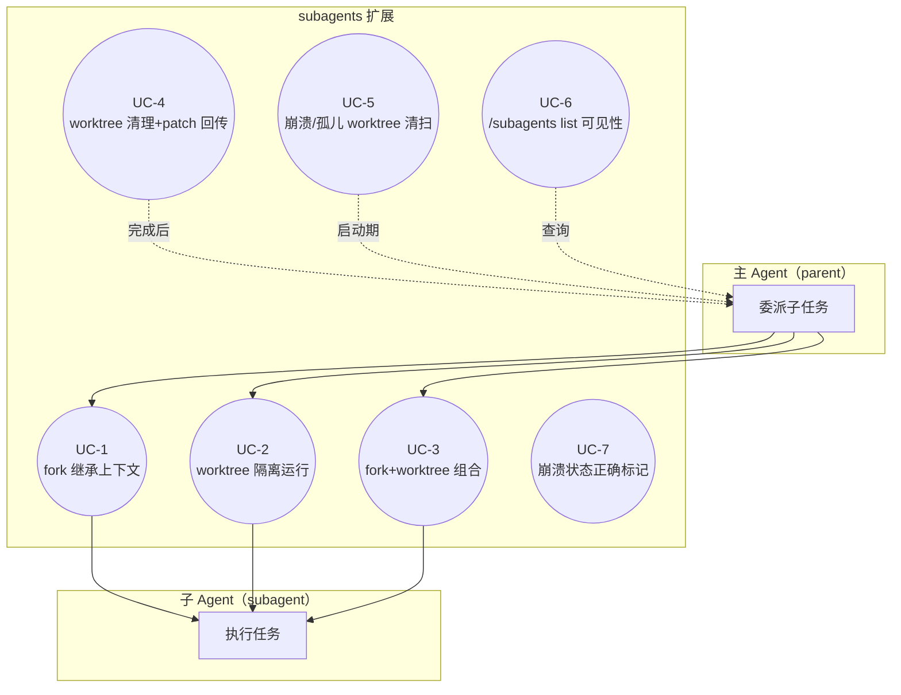
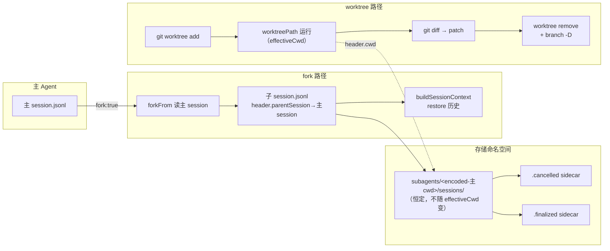
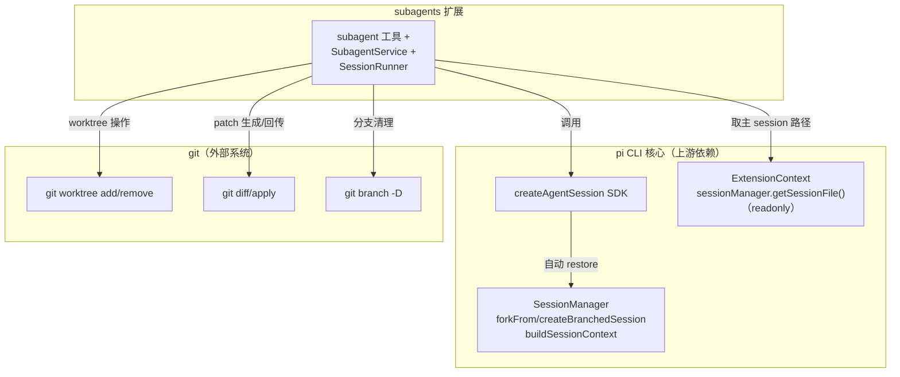

# Subagent fork 上下文 + worktree 隔离能力增强

## 1. 业务目标（Business Goals）

### 目标树

- **G1: 子 agent 能继承主 agent 的对话上下文** — 成功标准：`subagent` 工具支持 `fork: true`，子 agent 首次 prompt 即携带主 agent 已持久化的对话历史（非从零启动）
  - G1.1: fork 点可确定（主 agent 当前 leaf，或指定 entryId）
  - G1.2: fork 不破坏主 agent session（只读源，写入独立子 session）
- **G2: 子 agent 能在独立 git worktree 中运行（文件系统隔离）** — 成功标准：`subagent` 工具支持 `worktree: true`，子 agent 的文件操作在 worktree 目录，不触碰主 agent 工作目录
  - G2.1: worktree 用完即清（worktree remove + branch -D），改动以 patch 回传
  - G2.2: worktree 崩溃/中断后，残留 worktree 能被启动期 reaper 清扫
- **G3: fork + worktree 可组合使用，且可观测性完整** — 成功标准：组合使用时 `/subagents list` 能看到所有 subagent（含 fork/worktree 的），pi 原生 `--resume` 不被污染

### 达成路线

| 目标 | 路线/策略 | 对应用例 |
|------|---------|---------|
| G1 | in-process `createAgentSession` + 传入 `SessionManager.forkFrom()` 出来的 manager（D-001） | UC-1, UC-3 |
| G2 | `git worktree add` 创建独立工作树 + `createAgentSession({cwd: worktreePath})`（D-002） | UC-2, UC-4, UC-5 |
| G3 | session 存储目录恒用主 cwd 编码（解耦 effectiveCwd，D-004）+ 崩溃标记（D-006） | UC-6, UC-7 |

## 2. 业务用例（Use Cases）

### 用例图

### UC-1: fork 继承主 agent 对话上下文

- **Actor**: 主 Agent（通过 LLM 调用 `subagent` 工具）
- **前置条件**: 主 agent session 已持久化（至少含 1 条可恢复的 assistant message entry）
- **主流程**:
  1. 主 agent 调 `subagent` tool（action:start, fork:true, task:...）
  2. SubagentService.execute → resolveMode → resolveIdentity
  3. resolveSessionContext(fork:true) → 取主 session 文件路径（ctx.sessionManager.getSessionFile()）
  4. SessionRunner 用 `SessionManager.forkFrom(主session, effectiveCwd, subagentSessionDir)` 替代 `SessionManager.create`
  5. createAgentSession 自动 restore 历史（sdk.ts:187 buildSessionContext）
  6. session.prompt(task) → 子 agent 带着主 agent 历史执行
  7. finalize → patch 回传（若 worktree）/返回结果
- **替代流程**:
  - fork 指定从某 entryId（position:"at"|"before"），而非当前 leaf（受 D-007 深度限制）
  - ~~主 session 未 flush（无 assistant message）→ 降级为普通 from-scratch 启动 + 警告~~ `[作废，AC-1.2 修订]` 经 D-018 演进，pi SDK 对空源抛错（不降级），与异常流程 line 77 合并为 finalizeFailed（见 AC-1.2 [BACKFED]）
- **异常流程**:
  - 主 session 文件路径取不到 → finalizeFailed（已有模式）
  - forkFrom 源文件损坏 → 抛 "Cannot fork: source session file is empty or invalid"（session-manager.ts:1444）→ finalizeFailed
  - fork 深度 >10 → 拒绝执行 + 报错（D-007）
- **后置状态**: 子 session.jsonl header.parentSession 指向主 session 文件（审计链）
- **关联目标**: G1
- **验收标准 (AC)**:
  - AC-1.1 [正常]: fork:true 时，子 agent 首次 prompt 的 SessionContext.messages 非空且包含主 agent 最近的历史
  - AC-1.2 [异常]: 主 session 为空或损坏时，pi SDK forkFrom/createBranchedSession 抛错（"Cannot fork: source session file is empty or invalid"，session-manager.ts:1444）→ finalizeFailed（不崩溃，按现有失败模式收尾）。`[BACKFED from ⑤code-arch 一致性终检]` 原替代流程（line 74「主 session 未 flush → 降级 from-scratch 启动」）经 D-018 演进：fork 统一经 pi SDK createBranchedSession/forkFrom，SDK 对空/损坏源抛错而非降级，故 empty 与 corrupt 合并为同一 hard-failure 路径（T1.3 验证）。替代流程 line 74 此条作废
  - AC-1.3 [边界]: fork 嵌套第 11 层被拒绝并报明确错误

### UC-2: 子 agent 在独立 git worktree 中运行

- **Actor**: 主 Agent（通过 LLM 调用 `subagent` 工具）
- **前置条件**: 当前目录是 git 仓库 + working tree 干净（git status --porcelain 为空）
- **主流程**:
  1. 主 agent 调 `subagent` tool（action:start, worktree:true, task:...）
  2. WorktreeManager.create: 校验 clean working tree → `git worktree add <tmpPath> -b pi-sub-<recordId> HEAD`
  3. worktreePath 作为 effectiveCwd 传给 createAndConfigureSession
  4. node_modules 软链（若存在）+ setupHook 处理 .env 等 gitignore 文件
  5. createAgentSession({cwd: worktreePath}) → 子 agent 在 worktree 执行
  6. 完成后：diffWorktrees 生成 patch → cleanup（worktree remove --force + branch -D）
- **替代流程**:
  - working tree 脏 → 自动 stash 或报错提示用户 commit/stash（D-待定：报错优先）
  - 非 git 仓库 → worktree 隔离降级不可用 + 明确告知
- **异常流程**:
  - `git worktree add` 失败（磁盘满/权限/branch 名冲突）→ 回退到主 cwd 运行 或 fail hard
  - node_modules 软链失败 → 子 agent 自行 install（或降级）
  - 并发多个 worktree subagent → branch/path 名带 recordId+timestamp 保证唯一
- **后置状态**: worktree 目录删除 + 分支删除；改动以 patch 文件留存（record.result 或独立 patch 文件）
- **关联目标**: G2
- **验收标准 (AC)**:
  - AC-2.1 [正常]: worktree:true 时，子 agent 的 bash 工具 cwd = worktreePath（非主 repo）
  - AC-2.2 [异常]: working tree 脏时，worktree 创建被拦截并给出可操作提示
  - AC-2.3 [边界]: 并发 2 个 worktree subagent，branch/path 不冲突

### UC-3: fork + worktree 组合使用

- **Actor**: 主 Agent
- **前置条件**: UC-1 + UC-2 前置均满足
- **主流程**:
  1. 主 agent 调 `subagent` tool（action:start, fork:true, worktree:true, task:...）
  2. WorktreeManager.create → worktreePath
  3. resolveSessionContext(fork:true, cwd:worktreePath) → forkFrom(主session, worktreePath, subagentSessionDir(主cwd))
  4. session 存 subagents/<encoded-主cwd>/sessions/（D-004，不随 effectiveCwd(worktreePath) 变）
  5. createAgentSession({cwd: worktreePath, sessionManager: forked}) → 既继承历史又在 worktree 跑
- **异常流程**: 见 UC-1 + UC-2 异常的并集；fork + worktree 创建顺序：先建 worktree（失败则不 fork），再 fork session（失败则清 worktree）
- **后置状态**: 子 agent 在 worktree 跑 + 带主 agent 历史 + session 存主命名空间
- **关联目标**: G3
- **验收标准 (AC)**:
  - AC-3.1 [正常]: fork:true+worktree:true 时，子 agent 既有主历史又 cwd=worktreePath
  - AC-3.2 [边界]: session 文件落 `subagents/<encoded-主cwd>/sessions/`，RecordStore.collectRecords 能扫到（不落 worktree 编码目录）

### UC-4: worktree 清理与 patch 回传

- **Actor**: subagents 扩展（内部，subagent 完成后触发）
- **前置条件**: worktree subagent 已结束（done/failed/cancelled/crashed）
- **主流程**:
  1. subagent 完成（finalizeRecord）
  2. diffWorktrees: git add -A → git diff --cached <baseCommit> → 生成 patch 文本 → 写 .patch 文件
  3. patch 路径塞进 record.result（或 ExecutionRecord.patchFile 字段）
  4. cleanup: `git worktree remove --force <path>` + `git branch -D <branch>`（配对，best-effort try/catch）
  5. 主 agent 从结果得知 patch 路径，自行 `git apply`（coding agent 有 bash 工具）
- **异常流程**:
  - patch 捕获失败（diff 命令出错）→ 写空 patch + 警告（改动可能丢失，参考 worktree.ts:540）
  - cleanup 失败（worktree 被占用/权限）→ 静默吞 + 记日志，孤儿留给 reaper（UC-5）
  - subagent 未做改动 → patch 为空，正常清理
- **后置状态**: worktree + 分支已删；patch 文件留存供主 agent apply
- **关联目标**: G2.1
- **验收标准 (AC)**:
  - AC-4.1 [正常]: subagent 有改动时，生成非空 patch 且 worktree+branch 已删
  - AC-4.2 [异常]: subagent 无改动时，patch 为空但清理正常执行
  - AC-4.3 [边界]: cleanup 失败不阻断 finalize（finalize 先于或独立于 cleanup）

### UC-5: 崩溃/孤儿 worktree 清扫（启动期 reaper）

- **Actor**: subagents 扩展（session_start 时触发）
- **前置条件**: 主 pi 进程启动（含 session_start 事件）
- **主流程**:
  1. session_start → WorktreeManager.scan（reaper 是 WorktreeManager 的方法，非独立类，D-019/②§6 已定）
  2. `git worktree list` → 找带 `pi-sub-` 前缀的 worktree
  3. 对照存活的 subagent records（session.jsonl + record 状态）：无关联 running record 的 worktree = 孤儿
  4. 清扫孤儿：worktree remove --force + branch -D（best-effort）
  5. `git worktree prune` 清 git 元数据残留
- **异常流程**:
  - 清扫失败 → 记日志，下次启动再扫（不阻断 session_start）
  - worktree 被另一个活 pi 实例占用 → 通过 pid/时间戳判断，跳过活态的
- **后置状态**: 残留 worktree + 分支已清，git worktree list 干净
- **关联目标**: G2.2
- **验收标准 (AC)**:
  - AC-5.1 [正常]: 进程被 kill -9 后重启，残留的 pi-sub-* worktree 被清扫
  - AC-5.2 [边界]: 正在运行的 worktree（关联活态 record）不被误清

### UC-6: /subagents list 可见性

- **Actor**: 主 Agent（调用 `subagent` tool action:list）
- **前置条件**: 存在 subagent records（含 fork/worktree 的）
- **主流程**:
  1. listHandler → RecordStore.collectRecords(limit, statusFilter)
  2. 合并内存 running + 磁盘 session.jsonl 重建（reconstructAll，扫 sessionsDir）
  3. 返回 SubagentRecord[]（含 fork/worktree 子 agent）
- **异常流程**: worktree subagent 的 session 在主 cwd 命名空间（D-004 保证）→ collectRecords 能扫到，无异常
- **后置状态**: 主 agent 看到所有子 agent 状态（running/done/failed/cancelled/crashed）
- **关联目标**: G3
- **验收标准 (AC)**:
  - AC-6.1 [正常]: worktree subagent 完成后，/list 能看到它（status=done）
  - AC-6.2 [边界]: fork+worktree 组合的 subagent，session 落主 cwd 目录，list 可见

### UC-7: 崩溃状态正确标记

- **Actor**: subagents 扩展（重建 record 时）
- **前置条件**: subagent session.jsonl 存在，但无正常完成标记
- **主流程**:
  1. collectRecords → reconstructFromFile → 检查 sidecar
  2. 有 .cancelled → status=cancelled（现有）
  3. 有 .finalized → status=recon 推导的 done/failed（新增）
  4. 都无 → status=crashed（新增 ExecutionStatus）
- **异常流程**: finalize 写 .finalized 后但进程在写下一个 entry 前死 → 降级用 recon stopReason
- **后置状态**: 崩溃的 subagent 显示 crashed（而非误判 done）
- **关联目标**: G3
- **验收标准 (AC)**:
  - AC-7.1 [正常]: 进程被 kill -9 后，崩溃的 subagent 在 /list 显示 crashed
  - AC-7.2 [边界]: 正常完成的 subagent 写了 .finalized，重启后仍显示 done

## 3. 数据流转（Data Flow）

### 数据流图

### 数据清单

| 数据 | 来源 | 处理 | 消费者 | 归档策略 | 敏感级别 |
|------|------|------|--------|---------|---------|
| 主 agent 对话历史 | 主 session.jsonl | forkFrom 复制（fork 时）| 子 agent SessionContext | 主 session 自有策略 | 内部（含可能凭证，fork 全量继承，文档化） |
| 子 agent session.jsonl | createAndConfigureSession | SDK 自动 append + identity entry | reconstructFromFile 重建 record | 30 天 TTL GC（session-file-gc.ts） | 内部 |
| ExecutionRecord | createRecord → updateFromEvent | 内存 running + 磁盘重建 | /subagents list, widget | 终态移出内存，靠 session.jsonl | 内部 |
| .cancelled sidecar | cancel 路径 writeCancelledTombstone | best-effort writeFileSync | collectRecords override status | 随 session.jsonl 一起 GC | 内部 |
| .finalized sidecar | finalize 路径（新增） | best-effort writeFileSync | collectRecords 判 crashed | 随 session.jsonl 一起 GC | 内部 |
| git worktree 目录 | git worktree add | subagent 在此运行 | subagent 文件操作 | 完成后 remove + branch -D | 内部 |
| patch 文件 | git diff --cached <baseCommit> | 写 .patch 文件 | 主 agent git apply | 用户自行管理 | 内部 |

## 4. 功能清单（Features）

| 编号 | 功能 | 对应用例 | 关联目标 |
|------|------|---------|---------|
| F1 | `subagent` 工具新增 `fork?: boolean` 参数 + forkFrom sessionManager | UC-1, UC-3 | G1 |
| F2 | `subagent` 工具新增 `worktree?: boolean` 参数 + WorktreeManager | UC-2, UC-3 | G2 |
| F3 | `subagent` 工具新增 `cwd?: string` 参数（可选，轻量目录切换，worktree 是其增强来源） | UC-2 | G2 |
| F4 | resolveSessionContext interface（解耦 effectiveCwd 与 sessionDir） | UC-3 | G3 |
| F5 | WorktreeManager（创建/清理/patch 生成/孤儿清扫） | UC-2, UC-4, UC-5 | G2 |
| F6 | .finalized sidecar + crashed status + reconstructAll 检测 | UC-7 | G3 |
| F7 | fork 深度计数 + 体积控制（createBranchedSession 优先） | UC-1 | G1 |

## 5. UI/UX 场景（Interface Scenarios）

> 纯后端/API 系统（subagent 工具 + extension 内部），无直接用户 UI 交互。TUI widget（statusline/turn-timing）展示 subagent 状态属现有能力，本轮不新增 UI。

- **降级理由**：本需求是 pi 扩展的内部能力增强，交互接口是 `subagent` 工具的参数（LLM 调用），无人类直接操作的 UI 界面。subagent 状态展示复用现有 TUI widget。

## 6. 系统间功能关联（Cross-System）

### 关联图

| 关联系统 | 依赖方向 | 交互方式 | 契约稳定性 |
|---------|---------|---------|-----------|
| pi CLI 核心（SDK + SessionManager） | 本系统 → pi（单向依赖） | in-process 函数调用（createAgentSession / forkFrom） | 自有可控，但 SDK API 是 pi 上游，需跟版本 |
| git | 本系统 → git（单向依赖） | child_process spawn git 命令 | 第三方但极稳定（git CLI 向后兼容） |

## 7. 约束（Constraints）

### 技术约束（仅记录不展开，架构阶段处理）

- **C1**: in-process 模式（ADR-022），不 spawn 子进程（D-001, D-003）
- **C2**: pi SDK 的 `createAgentSession({cwd, sessionManager})` 接受任意 cwd + sessionManager（sdk.ts:166-188），sessionManager 传入带历史的会自动 restore
- **C3**: `SessionManager.create(cwd, sessionDir)` 的 cwd 与 sessionDir 是两个独立参数（session-manager.ts:1385），可解耦（D-004 方案 A2 的技术基础）
- **C4**: `getSubagentSessionDir` 返回 `subagents/<encoded-cwd>/sessions/`，pi 原生 resume 物理扫不到此子树（三层证据，见 D-004）
- **C5**: kill -9/OOM/断电不可拦截，崩溃标记只能启动期检测（D-006）
- **C6**: fork 全量复制有体积/安全风险，需深度限制 + 体积控制（D-007）
- **C7**: worktree 隔离是文件系统级，非进程内存级（pi 无 sandbox），bash 可逃逸（D-008）

### 既有 ADR 约束（需遵守或修订）

- **ADR-022**（in-process 执行模型）：遵守，本需求在 in-process 框架内增强
- **ADR-024**（L1+L2 持久化，L3 不做跨进程恢复）：遵守，崩溃标记是状态显示非进程恢复
- **ADR-001 决策 2**（"task prompt = subagent 全部上下文输入，非 fork"）：**需修订**——引入 fork 后这条契约不再绝对，架构阶段产出 ADR 修订

## 8. 不做（Out of Scope）

- **OS-1**: spawn pi 子进程双后端（evolution/005 的 L3 跨进程恢复）—— D-003 明确不做
- **OS-2**: worktree 保留分支推远端 + 主 agent merge（路径 B）—— D-005 不做（接口预留 `worktree.keepBranch`）
- **OS-3**: bash sandbox / chroot / 路径白名单（真正安全隔离）—— D-008 文档化边界，不做技术隔离
- **OS-4**: fork redaction（自动脱敏密钥）—— D-007 文档化，不做自动脱敏
- **OS-5**: coding-workflow/lib/subagent.ts spawn 路径的 fork 增强 —— D-001 限定 in-process
- **OS-6**: 嵌套 worktree（worktree-of-worktree）—— 首版禁止，仅 fork 可嵌套（受 D-007 限制）
- **OS-7**: Windows/跨平台符号链接兼容 —— 首版 POSIX-only，文档声明
- **OS-8**: worktree 磁盘配额管理 / 大 repo LFS sparse checkout —— 首版不做
- **OS-9**: 单进程多 Pi session 并发隔离 —— 首版不做。`SubagentService` 是进程单例，`sessionId` 为实例字段，`initSession` 每次覆写。Pi 平台当前以单进程单 session 为主流运行模式（项目 CLAUDE.md 已警告多 session 模式的副作用）。record 写入侧（subagent-service.ts createRecordForMode）在创建时正确捕获当时 sessionId，仅读侧 `collectRecords`（用 `this.sessionId` 过滤）在后启动 session 覆写后会按错误 sessionId 过滤。影响范围：本特性引入的 session 隔离在多 session 并发时失效（可见全部 record，非丢数据）。未来修复方向：将当前 sessionId 经 ALS 或调用参数传入 collectRecords，不读实例字段。

## 决策记录

（所有决策见 `decisions.md` D-001~D-008。本节为 clarity 阶段已拍板决策的索引，详见 decisions.md。）

## 待确认

无未解决项。所有 clarity 阶段决策（D-001~D-008）均已 ask_user 拍板确认。开放问题（worktree 清理三路径、clean tree 校验、node_modules 处理、fork+compaction 交错、嵌套语义）已在 decisions.md 末尾记录为 architecture 阶段的约束输入，留待架构设计具体展开。
