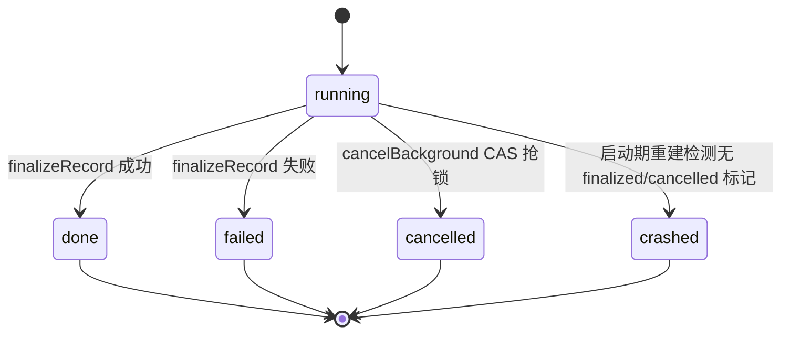
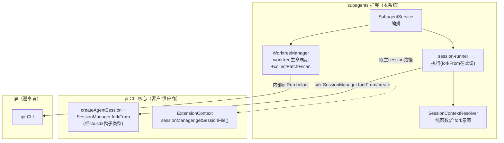
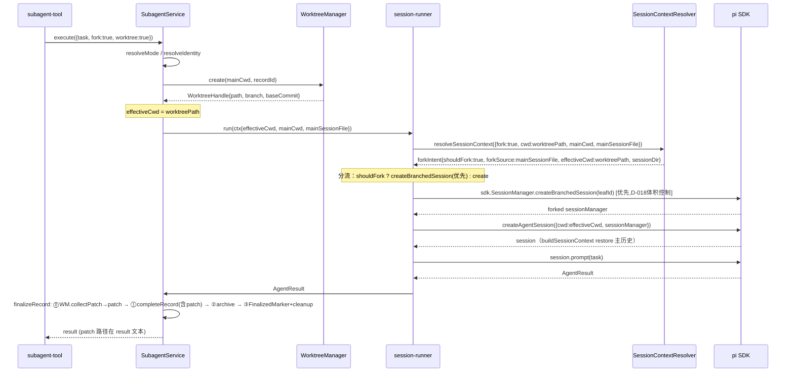
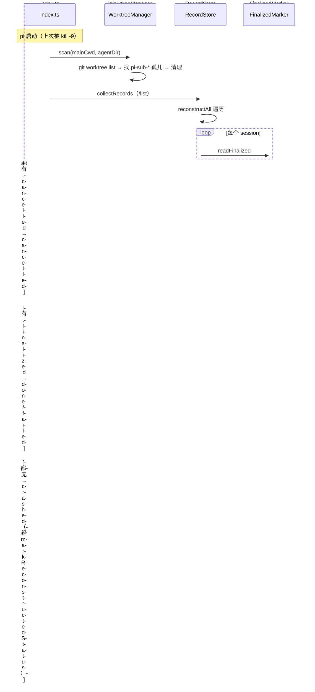

# Subagent fork 上下文 + worktree 隔离 — 架构设计

## 1. 目标转换

### 业务目标 → 系统目标

| 业务目标(requirements) | 转换为系统目标 | 衡量标准 |
|----------------------|--------------|---------|
| G1: 子 agent 能继承主 agent 对话上下文 | SO-1: SessionContextResolver 解析 fork 意图（纯函数），session-runner 按 fork 分流创建带历史的 sessionManager | fork:true 时子 agent SessionContext.messages 含主 agent 历史；fork 深度 ≤10 |
| G2: 子 agent 能在独立 git worktree 运行 | SO-2: WorktreeManager 管理 git worktree 生命周期（创建/清理/patch/reaper），effectiveCwd = worktreePath | worktree:true 时子 agent bash cwd = worktreePath；崩溃后残留 worktree 被 reaper 清扫 |
| G3: fork+worktree 可组合 + 可观测性完整 | SO-3: session 存储目录恒用主 cwd 编码（解耦 effectiveCwd），crashed 状态正确标记 | /list 能看到所有 subagent（含 fork/worktree）；崩溃 subagent 显示 crashed 非 done |

### 搭便车改造目标

| 改造目标 | 动机 | 关联业务目标 | 状态 |
|------|------|-------------|------|
| SessionRunnerContext.cwd 拆为 effectiveCwd + mainCwd | 消除单 cwd 契约裂缝（worktree 时 effectiveCwd≠mainCwd）；是 D-004 存储解耦的技术基础 | G3 | 已纳入（D-012③） |
| ExecutionStatus 加 crashed + STATUS_PRIORITY 补全 | crashed 是 D-006 崩溃标记的终态表达；缺 key 会编译报错 | G3 | 已纳入（D-012②，D-013#2） |
| ADR-001 决策 2 修订 | 引入 fork 后「task=全部输入」契约不再绝对，需更新为「可选 fork 继承」 | G1 | 已纳入（D-012④） |
| session-file-gc 对称清理 .finalized sidecar | finalized sidecar 是新增文件，GC 不清理会成孤儿残留 | G3 | 已纳入（D-013#3） |

## 2. 设计立场

**核心计算是技术流程编排**（非业务规则编排）：把"委派子任务"这个意图，编排成"解析上下文 → 创建/隔离执行环境 → 执行 → 回收改动 → 标记状态"的确定性 pipeline。无复杂业务规则引擎。

**分层决策：维持现有三层架构（外壳 / TUI / Runtime / Core）**，做增量增强。核心理由：
- 编排复杂度集中（SubagentService 编排 + session-runner 执行），无领域规则膨胀趋势
- 现有三层铁律（Core 零 Pi 依赖、依赖单向）被本需求充分复用
- 新增模块按"是否有外部副作用 / 零依赖可单测"归入对应层，无需引入新层

**Core 编排子层两文件分工**（D-014）：SessionContextResolver（纯解析，零副作用，真可单测）+ session-runner（带 SDK 副作用的执行编排，沿用现有合法 SDK 注入路径）。

## 3. 统一语言（Ubiquitous Language）

| 术语 | 定义 |
|------|------|
| **effectiveCwd** | 子 agent 实际运行的目录（= worktreePath 或用户指定 cwd 或主 cwd）。传给 createAgentSession。 |
| **mainCwd** | 主 agent 的 cwd。恒定，用于 subagent session 存储目录编码（getSubagentSessionDir 入参）。 |
| **fork 意图** | SessionContextResolver 返回的纯数据：{shouldFork, forkSource, effectiveCwd, sessionDir}。不含副作用。 |
| **worktree 隔离** | 子 agent 在独立 git worktree 运行（文件系统级隔离，非进程内存级）。改名自 isolation（D-008）。 |
| **patch 回传** | worktree subagent 完成后，git diff 生成 patch 文本回传主 agent，主 agent 自行 git apply。 |
| **finalized sidecar** | 正常完成/失败时写的 `.finalized` 标记文件，用于启动期检测崩溃（无此标记 = crashed）。 |
| **crashed** | 新增执行终态：进程被 kill -9/OOM/断电打断，无 finalized/cancelled 标记的子 agent 状态。 |

## 4. 核心模型

| 模型 | 类型 | 不变式 | 建模理由 |
|------|------|--------|---------|
| ExecutionRecord | aggregate（唯一状态源） | status 经 tryTransition/reconstructStatus 收口（不裸赋值）；turns[] 只增不删；sessionId 创建后不变 | 已有，本轮加 crashed 终态 + reconstructStatus 收口方法（M3） |
| SessionContextResolver | 纯函数（值对象，D-014 修订） | 相同输入相同输出；**零副作用**（不调 pi SDK，不碰 IO） | 解析 fork/worktree/cwd 意图 → 返回 fork 意图数据，真可单测 |
| WorktreeHandle | 值对象（新增） | path + branch + baseCommit 创建后不变（不可变快照） | worktree 创建结果传递，生命周期态归 WorktreeManager 内部 |
| SubagentIdentityData | 实体（custom entry） | id 创建后不变；forkDepth 写入时校验 ≤10（构造器内守卫，M4） | 嵌套 fork 深度追踪（D-007），fork 时从 parent identity 读 depth+1 |

### 降级决策（主动不建模）

| 概念 | 为什么不建模 | 应有的处理 |
|------|------------|-----------|
| worktree 嵌套（worktree-of-worktree） | 首版禁止（OS-6），无状态机需求 | WorktreeManager.create 检测当前已在 worktree 内运行则拒绝（`.git` 文件检查） |
| patch 内容结构 | patch 是 git 原生 unified diff 文本，非领域对象 | WorktreeManager.collectPatch（D-020 合并自 PatchCollector）只做 git 命令调度 + 文件 IO，不解析 patch |
| ~~远端分支推送（keepBranch）~~ | **已删除（D-015，YAGNI）**——D-005 已排除路径 B | worktree 清理恒为 remove --force + branch -D |

## 5. 状态流转

### Status 枚举（只描述阶段，不含原因）

```
running | done | failed | cancelled | crashed
```

### Reason 字段（描述终态原因，与 Status 正交）

| Status | 可能的 Reason |
|--------|--------------|
| done | "normal completion" |
| failed | "llm error" / "turn limit" / "schema enforcement failed" / "create session failed" |
| cancelled | "cancelled by user" |
| **crashed** | **#2 基础三分支「都无」路径**：`"process killed (no finalized marker)"`（kill -9/OOM/断电不可区分成因）。**#12 四分支扩展（D-021）**：区分 `"no alive marker"`（无 .alive sidecar）/ `"pid not alive"`（.alive 存在但 pid 探活死，含 24h 软超时兜底）——见 issues.md AC-2.4/AC-12.6 |

### 合法转换（显式转换表，D-010）



**终态集合 {done, failed, cancelled, crashed} 均不可逆。** crashed 不经 tryTransition（特化决策 §10）——它是 reconstructAll 重建时推断的，非运行期转换。

### STATUS_PRIORITY 扩展（D-013#2）+ 用途语义（S2）

**用途**：仅驱动 `/subagents list` 展示排序（running 优先展示 → 异常态居中 → done 居后）。不用于过滤/聚合。

| Status | Priority | 理由 |
|--------|----------|------|
| running | 0 | 活态排前 |
| failed | 1 | 异常 |
| crashed | 1 | 异常（与 failed 同级，均为非正常结束，二级 startedAt desc 区分） |
| cancelled | 2 | 用户主动 |
| done | 3 | 正常完成排后 |

### crashed 检测三分支（D-013#1）+ 赋值收口（M3）

record-store.reconstructAll 改造，**经 reconstructStatus 收口方法**（不裸赋值 record.status，M3）：

```
对每个 session.jsonl 文件：
  recon = reconstructFromFile(file)
  if (readCancelledTombstone(file))          // 有 .cancelled → cancelled
    markReconstructedStatus(record, "cancelled")
  else if (readFinalizedMarker(file))        // 有 .finalized → recon 推导的 done/failed
    markReconstructedStatus(record, recon.status)
  else                                       // 都无 → crashed
    markReconstructedStatus(record, "crashed")  // error = "process killed (no finalized marker)"
```

### 已知盲区：跨 pi 实例 crashed 误判（S1）→ D-021 反哺为本轮处理

双 pi 实例并发共享 session 目录时（D-004 主 cwd 编码），第二实例扫磁盘看不到第一实例内存 running record + 磁盘无 finalized → 可能误判 crashed。**~~本轮不处理~~ → [D-021 反哺] 本轮用方案 A（pid 探活）处理**：运行时写 `.alive` sidecar（含 pid+id+startedAt，对称 .cancelled/.finalized 三件），重建「都无」分支先 readAliveMarker + `process.kill(pid,0)` 探活——pid 活=running-elsewhere（status 保持 running + externalInstance 投影标志，D-023 不污染 ExecutionStatus），pid 死/无 .alive=真 crashed。详见 issues.md #12（P1）+ decisions.md D-021/D-022/D-023/D-024（collectPatch 失败保 worktree / externalInstance 标志 / reaper 孤儿判据安全网）。新增模块 alive-store（Runtime 执行域，~40 LOC，对称 tombstone-store/finalized-marker）。

## 6. 分层架构

### 层级图

```
            ┌─────────────────────────────────────────────────┐
            │              外壳（薄壳）                         │
            │  tools/subagent-tool.ts (+fork/worktree/cwd 参数) │
            │  index.ts（+session_start 挂 reaper,+缓存主session路径）│
            └────────────────────┬────────────────────────────┘
                                 │
   ┌─────────────────────────────┴────────────────────────────┐
   │                   Runtime 层（编排+副作用）                │
   │  ── 双 Service（不变）──                                 │
   │  ModelConfigService / SubagentService(+持有新组件)        │
   │  ── 执行域组件 ──                                       │
   │  ★ WorktreeManager（git worktree 生命周期 + collectPatch + scan reaper + 内部 gitRun helper）│
   │  ★ FinalizedMarker（.finalized 写 + crashed 检测读取）   │
   │  ── 既有组件（修改）──                                  │
   │  record-store(+crashed三分支+markReconstructedStatus) · notifier · tombstone-store│
   │  session-file-gc(+清理.finalized)                        │
   └────────────────────▲────────────────────────────────────┘
                        │ 委托（注入 effectiveCwd + mainCwd + mainSessionFile）
                        │
   ┌────────────────────┴────────────────────────────────────┐
   │                    Core 层（核心，零 Pi 依赖）            │
   │  ── 编排子层 ──                                         │
   │  session-runner(+fork分流: 拿fork意图后调 sdk.SessionManager.forkFrom/create)│
   │  ★ SessionContextResolver（纯函数:fork/worktree/cwd → fork意图数据，零副作用，D-014）│
   │  ── 基础子层 ──                                         │
   │  output-collector（不变）                                │
   │  ── 叶子原语 ──                                         │
   │  execution-record(+crashed,+markReconstructedStatus) · model-resolver · agent-registry│
   │  concurrency-pool · turn-limiter · path-encoding         │
   └──────────────────────────────────────────────────────────┘
```

**关键设计（D-014）**：SessionContextResolver 是真正的纯函数，只返回 fork 意图 `{shouldFork, forkSource, effectiveCwd, sessionDir}`，不调 pi SDK。实际 fork 调用留在 session-runner（经 ctx.sdk 合法访问，沿用现有 `sdk.SessionManager.create` 模式）。session-runner 拿到意图后分流：`shouldFork ? forkSession : createSession`。

**fork 体积控制（D-018，反哺补回 D-007）**：forkSession 优先用 `sdk.SessionManager.createBranchedSession(leafId)`（只取 leaf→root 路径，含 compaction 裁剪，体积更小），`forkFrom`（全量复制）仅作 createBranchedSession 不可用时的降级。避免嵌套 fork 体积线性累积爆 token/磁盘。

**类型约束（D-016 + D-018）**：`SdkLike.SessionManager`（types.ts:526-529）扩展声明加 `forkFrom(forkSource: string, cwd: string, sessionDir: string): unknown` + `createBranchedSession(leafId: string): unknown`，沿用仓库鸭子类型约定（声明 subset 到 Like 接口，与 appendCustomEntry types.ts:486-491 同范式）。

### Port 清单

**无 Port。** D-019 删除 GitPort（红队 deletion test 击穿：现有 buildEnvBlock 已直接 execFileSync("git") 无 port 运行良好；git CLI 极稳定 seam 价值近零；interface 永远可后加）。WorktreeManager 内部封装私有 `gitRun` helper 直接调 git CLI，git 调用收口到 WorktreeManager 内部（D-011 精神保留，形式去掉）。

> SessionContextResolver 不需 port（纯函数零依赖）。session-runner 经 ctx.sdk（SdkLike.SessionManager，**D-016 已加 forkFrom + createBranchedSession 声明**）访问 SessionManager。

## 7. 模块划分与变化轴

### 新增模块

| 模块 | 层 | 职责 | 变化轴 | LOC(预估) |
|------|----|------|--------|----------|
| `SessionContextResolver` | Core 编排 | **纯函数** resolveSessionContext({fork, worktree, cwd, mainCwd, mainSessionFile}) → {shouldFork, forkSource, effectiveCwd, sessionDir}。fork 深度校验（读 parent identity depth+1，>10 拒绝）。**零副作用，不调 pi SDK**（D-014） | fork 意图解析逻辑 | ~60 |
| `WorktreeManager` | Runtime 执行域 | git worktree 生命周期：create（clean 校验+worktree add+node_modules 软链+setupHook+嵌套检测）/cleanup（remove --force + branch -D，配对）/scan（reaper 扫孤儿，**是方法非独立类**，GAP-4.3/E2）/collectPatch（git diff → patch 文本，**D-020 合并自 PatchCollector**）。内部封装私有 `gitRun` helper 直接调 git CLI（**D-019 删除 GitPort**） | git 策略（clean 处理/命名/软链）+ 孤儿检测 + diff 提取 | ~280 |
| `FinalizedMarker` | Runtime 执行域 | write（.finalized sidecar）/read（重建时调）。对称 GC 兼容 | 标记策略 | ~50 |
| `alive-store`（**D-021 反哺新增**）| Runtime 执行域 | writeAliveMarker（{pid,id,startedAt}）/readAliveMarker/removeAliveMarker。`.alive` sidecar 对称 .cancelled/.finalized 三件。跨实例 crashed 误判 pid 探活载体（#12）| pid 探活标记策略 | ~40 |

### 修改模块

| 模块 | 层 | 改动 | 驱动 |
|------|----|------|------|
| `session-runner.ts` | Core 编排 | createAndConfigureSession 调 SessionContextResolver 拿 fork 意图 → 按意图分流（shouldFork ? createBranchedSession优先[D-018] : create）；SessionRunnerContext.cwd → effectiveCwd+mainCwd；getSubagentSessionDir 用 mainCwd | D-012①③,D-014,D-018 |
| `execution-record.ts` | Core 叶子 | tryTransition target 加 crashed；**新增 markReconstructedStatus(record, status) 收口方法**（重建专用，不裸赋值，M3）；completeRecord status 加 crashed | D-010,D-013#2,M3 |
| `record-store.ts` | Runtime 执行域 | STATUS_PRIORITY 加 crashed；reconstructAll 三分支经 markReconstructedStatus | D-013#1#2,M3 |
| `session-reconstructor.ts` | Core 编排 | status 推导不变（仍按 stopReason 推 done/failed），crashed 判定上移 record-store | D-013#1 |
| `session-file-gc.ts` | Runtime 根 | walkAndClean 加清理 .finalized sidecar（对称 .cancelled） | D-013#3 |
| `subagent-service.ts` | Runtime | 持有 WorktreeManager（含 collectPatch 方法，D-020 合并自 PatchCollector）/FinalizedMarker；execute 前置 worktree create；finalizeRecord 调 WorktreeManager.collectPatch（worktree 时）→ completeRecord → archive → FinalizedMarker.write + WorktreeManager.cleanup；cancelBackground 调 WorktreeManager.cleanup。**三件套各自独立 try/catch，archive 先于副作用写**（D-017） | D-013#5,D-017,D-020 |
| `index.ts` | 外壳 | session_start 缓存 ctx.sessionManager.getSessionFile() → SubagentService；session_start 挂 WorktreeManager.scan（reaper） | D-013#4#6 |
| `subagent-tool.ts` | 外壳 | startParam schema 加 fork?:boolean / worktree?:boolean / cwd?:string | D-008 |
| `types.ts` | 跨层 | ExecutionStatus 加 crashed；SessionRunnerContext 加 mainCwd/mainSessionFile（**不加 gitPort**，D-014）；**SdkLike.SessionManager 加 forkFrom 声明**（D-016） | D-013#2#8,GAP-4.4,D-016 |

### SubagentService 集成点表（D-013#5, GAP-E5）

| 方法 | 调用的新组件 | 守卫/顺序 |
|------|------------|----------|
| `execute`（前置） | WorktreeManager.create（worktree:true 时） | worktreeHandle 回填 record；非 worktree 跳过 |
| `finalizeRecord` | ⓪ WorktreeManager.collectPatch（worktree 时，best-effort try/catch，失败则 result 不含 patch 路径降级）→ ① completeRecord（含 patch 的 result，freeze record.result）→ ② store.archive（**archive 在副作用写之前，防 record 卡 running**）→ ③ FinalizedMarker.write + WorktreeManager.cleanup | **D-017 时序**：collectPatch 必须在 completeRecord 之前（patch 路径要进 record.result）。三件套（collectPatch/finalized/cleanup）各自独立 try/catch；worktreeHandle==null 跳过⓪③；create-failed 路径 worktree 无改动→collectPatch 返回空 patch |
| `finalizeFailed` | 经 finalizeRecord 覆盖（第 2 条 create-failed 路径） | 同上 |
| `cancelBackground` | WorktreeManager.cleanup（worktree:true 时） | worktreeHandle==null 跳过；不写 finalized（cancelled 已有 .cancelled） |

## 8. 系统间上下文边界（Context Map）



| 关联系统 | 关系模式 | 交互方式 | 契约稳定性 |
|---------|---------|---------|-----------|
| pi CLI 核心 | 客户-供应商 | in-process 函数调用（session-runner 经 ctx.sdk） | 自有可控 |
| git | 遵奉者 | child_process spawn（经 WorktreeManager 内部私有 gitRun helper，**D-019 删 GitPort**） | 第三方但极稳定 |

## 9. 泳道图（Swimlane）

### fork + worktree 组合执行



### 崩溃恢复（启动期检测）



## 10. 挑战与决策

### D-014: SessionContextResolver 纯函数化（forkFrom 上移 session-runner）`[REVISIT of D-009 落地形态]`

**张力**：SessionContextResolver 归 Core 编排（D-009），但调 forkFrom 需 pi SDK（打破 Core 零 Pi 依赖）+ forkFrom 有 IO 副作用（打破纯函数）。
**决策**：SessionContextResolver 只返回 fork 意图数据（真纯函数），forkFrom 调用留 session-runner（已合法持有 ctx.sdk）。
**理由**：3 帧交叉验证击穿初稿矛盾。解法 B 让纯函数名副其实 + 复用现有合法 SDK 路径 + Core 编排两文件分工清晰。D-009 归层不变。

### D-015: 删除 keepBranch 预留（YAGNI）

**张力**：预留 keepBranch 接口 vs D-005 已排除路径 B。
**决策**：删除。worktree 清理恒为 remove + branch -D。
**理由**：演进帧证伪——zero-value 伪 seam，调用方本轮=零。真要做时再加。

### crashed 不经 tryTransition（特化决策）

**违反什么**：状态变更不经 CAS 收口。
**为什么合理**：crashed 是重建推断态（进程已死，内存 record 不存在），非运行期转换。tryTransition 保护 running record 收尾竞争，crashed 不参与。
**触发变化**：若未来需运行期标记 crashed（heartbeat 超时），加独立路径。

### finalizeRecord 三件套独立 try/catch + diff 先行（D-017，GAP-E6 + NEW-D2 特化）

**违反什么**：现有 finalizeRecord 不抛（只 completeRecord+archive）。
**为什么合理**：加三件套后可能抛。顺序 `⓪diff → ①completeRecord → ②archive → ③finalized+cleanup`——diff 必须先于 completeRecord（patch 路径要进 record.result，NEW-D2）；archive 在副作用写之前（防 record 卡 running，GAP-E6 意图保留）。三件套（diff/finalized/cleanup）各自独立 try/catch（只记日志，任一失败不阻断其他）。
**触发变化**：若三件套失败率高，加重试/告警。

### worktree cleanup 挂 finalizeRecord 内（GAP-E5 特化）

**违反什么**：cleanup 不在 run() finally（session-runner Core 层）。
**为什么合理**：放 session-runner finally 会跨层（Core 调 Runtime WorktreeManager）。放 finalizeRecord（Runtime 层 SubagentService）符合分层 + 三条终态路径都覆盖（finalizeRecord/finalizeFailed/cancelBackground）。worktreeHandle==null 守卫跳过非 worktree run。

## 11. 反模式检查（grep 验收清单）

### AC-1: Core 层零 Pi 依赖保持
- 验证：`grep -rn "from.*pi-coding-agent\|@earendil\|@mariozechner" extensions/subagents/src/core/` 仅命中 session-runner.ts:150 的 getSdk 动态 import
- **SessionContextResolver 零 Pi import**：`grep "pi-coding-agent" extensions/subagents/src/core/session-context-resolver.ts` 无输出

### AC-2: SessionContextResolver 零副作用（D-014 强化）
- 验证：`grep -rn "execFileSync\|writeFileSync\|spawn\|readFileSync\|forkFrom\|sdk\." extensions/subagents/src/core/session-context-resolver.ts` 无输出（纯函数不碰 IO/SDK）

### AC-3: STATUS_PRIORITY 覆盖所有 ExecutionStatus
- 验证：`grep "crashed" extensions/subagents/src/runtime/execution/record-store.ts` 有命中

### AC-4: worktree 清理配对（remove + branch -D）
- 验证：WorktreeManager.cleanup 内 worktree remove + branch -D 成对

### AC-5: finalized sidecar GC 清理
- 验证：`grep "finalized" extensions/subagents/src/runtime/session-file-gc.ts` 有命中

### AC-6: reaper 挂载 session_start（命名统一为 WorktreeManager.scan）
- 验证：`grep -A5 "session_start" extensions/subagents/src/index.ts` 含 WorktreeManager.scan 调用（非 WorktreeReaper.scan）

### AC-7: keepBranch 已删除（D-015）
- 验证：`grep -ri "keepBranch" extensions/subagents/src/` 无输出

### AC-8: SdkLike.SessionManager 含 forkFrom + createBranchedSession 声明（D-016 + D-018）
- 验证：`grep -E "forkFrom|createBranchedSession" extensions/subagents/src/types.ts` 有命中（SdkLike.SessionManager 接口声明）

### AC-9: finalizeRecord 时序 collectPatch 先行（D-017）
- 验证：subagent-service.ts finalizeRecord 内 WorktreeManager.collectPatch 调用在 completeRecord 之前（`grep -n "collectPatch\|completeRecord\|archive" extensions/subagents/src/runtime/subagent-service.ts` 顺序检查）

### AC-10: GitPort 不存在（D-019）
- 验证：`find extensions/subagents/src/ -name "*git-port*" -o -name "*GitPort*"` 无输出；WorktreeManager 内部有私有 gitRun helper

### AC-11: PatchCollector 不独立（D-020）
- 验证：`find extensions/subagents/src/ -name "*patch-collector*" -o -name "*PatchCollector*"` 无输出；collectPatch 是 WorktreeManager 的方法

## 12. 行为契约保持清单

### BC-1: sync/background 统一执行入口
| 字段 | 内容 |
|------|------|
| 源码位置 | `subagent-service.ts:300` runAndFinalize + `:351` kickOffBackground |
| 处理 | **保持**——fork/worktree 不改 sync/bg 分叉，仅前置 worktree create、后置 patch+cleanup |
| 冲突 | 无 |

### BC-2: task prompt = subagent 上下文输入（ADR-001 决策 2）
| 字段 | 内容 |
|------|------|
| 源码位置 | `session-runner.ts:524`；ADR-001 |
| 处理 | **变更（→D-012④ ADR 修订）**——fork:true 时上下文=主历史+task；fork:false 保持原行为 |
| 冲突 | `[CONFLICT-已决-D-012④]` ADR-001 决策 2 修订 |

### BC-3: subagent session 物理隔离（ADR-024）
| 字段 | 内容 |
|------|------|
| 源码位置 | `session-runner.ts:186` getSubagentSessionDir |
| 处理 | **保持**——编码用 mainCwd（D-004），路径模式不变 |
| 冲突 | 无 |

### BC-4: cancelled tombstone 机制
| 字段 | 内容 |
|------|------|
| 源码位置 | `tombstone-store.ts` + `subagent-service.ts:394` |
| 处理 | **保持**——cancelled 仍写 .cancelled，不写 .finalized（互斥） |
| 冲突 | 无 |

### BC-5: RecordStore 单目录扫描
| 字段 | 内容 |
|------|------|
| 源码位置 | `record-store.ts:63,175` |
| 处理 | **保持**——sessionsDir 恒用 mainCwd 编码 |
| 冲突 | 无 |

### BC-6: 并发池 sync 优先级抢占
| 字段 | 内容 |
|------|------|
| 源码位置 | `subagent-service.ts:67-68` + `concurrency-pool.ts` |
| 处理 | **保持**——worktree subagent 进同一 pool |
| 冲突 | 无 |

### BC-7: 崩溃态从 done 重分类为 crashed（GAP-E4 补登记）
| 字段 | 内容 |
|------|------|
| 源码位置 | `session-reconstructor.ts:396-397` + `record-store.ts:188-189` |
| 处理 | **变更**——现有行为：kill-9 会话重建显示 done（误判）。本次：done→crashed 重分类（三分支检测） |
| 冲突 | `[CONFLICT-已决-D-006]` crashed 是 D-006 拍板的新终态 |

### BC-8: background detached .catch 吞错（GAP-E6 + D-017 约束）
| 字段 | 内容 |
|------|------|
| 源码位置 | `subagent-service.ts:367` .catch(()=>{}) |
| 处理 | **约束变更**——现有吞所有 reject。本次（D-017）：finalizeRecord 顺序 `⓪diff → ①completeRecord → ②archive → ③finalized+cleanup`，三件套各自独立 try/catch。archive 在副作用写之前，保证三件套抛错不逃逸到 detached .catch 跳过 archive。diff 失败 best-effort 降级（result 不含 patch 路径），不阻断 archive |
| 冲突 | 无（约束收紧，不改变吞错本身） |

## 下游衔接

### 喂给 Step 3（Issue 拆分）

| 本文档章节 | issue 拆分用途 |
|-----------|--------------|
| §7 新增模块 | 每个★模块=1 issue（SessionContextResolver / WorktreeManager（含 collectPatch+gitRun）/ FinalizedMarker） |
| §7 修改模块 | 按内聚性合并（session-runner+SessionContextResolver / execution-record+record-store / subagent-service 集成 / index.ts+subagent-tool / types.ts） |
| §11 grep AC | 每 AC→issue 验收标准 |
| §12 BC-2/BC-7/BC-8 | 行为变更→独立 ticket（ADR 修订 / crashed 重分类 / 吞错约束） |
| decisions.md D-001~D-020 | 每个 D-不可逆=issue 决策约束 |
