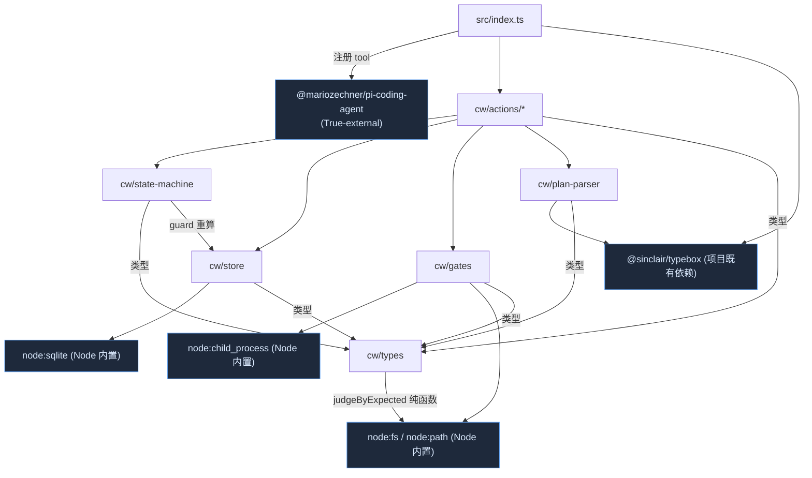
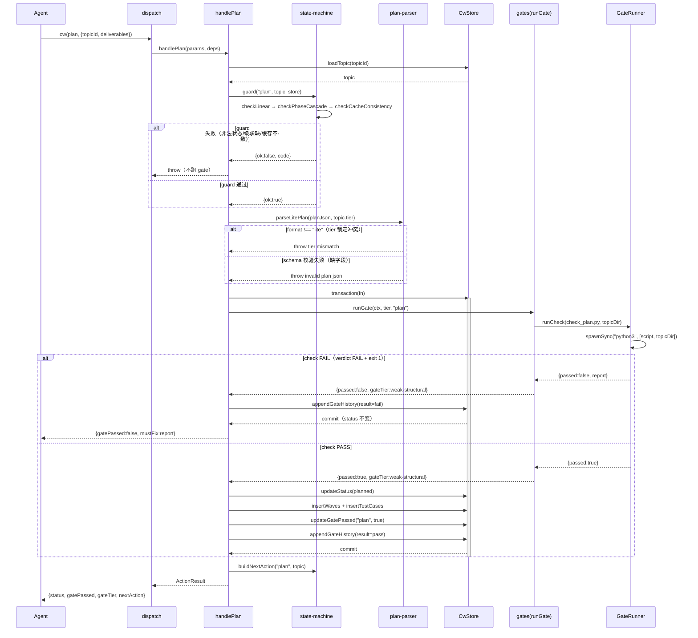
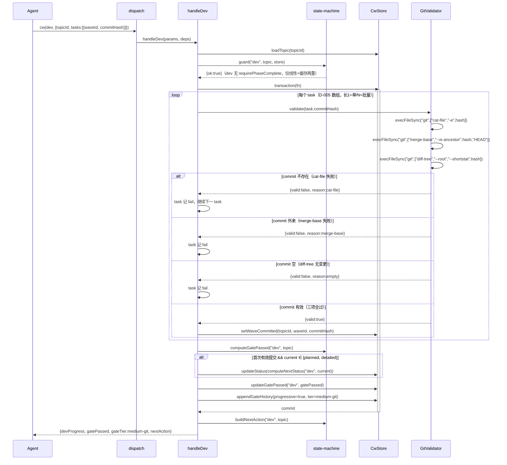
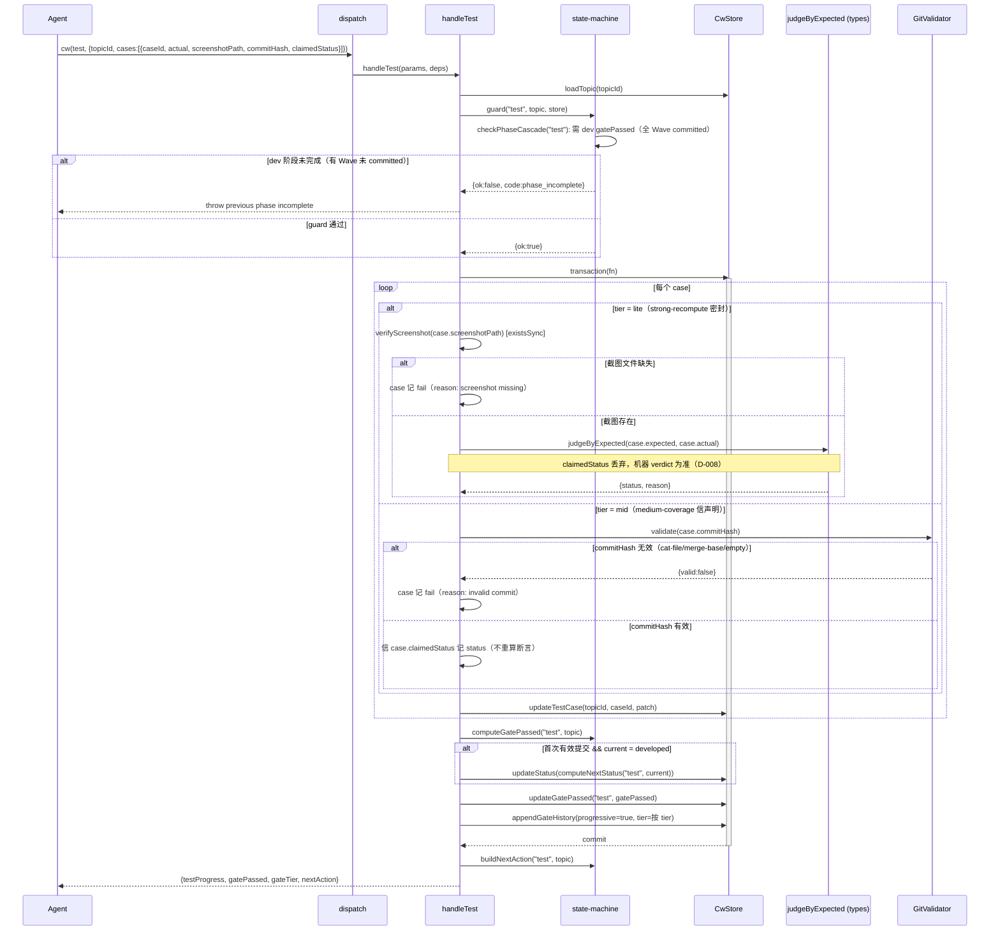

# 代码架构设计 — CW (Coding Workflow Orchestrator)

> 上游契约源：`system-architecture.md`（§3 模块拆分 / §4 状态机 / §5 gate 注册表 / §8 sqlite schema / §9 内化）+ `issues.md`（#1-#11 取舍）+ `decisions.md`（D-009 三重 guard / D-016 node:sqlite）。本文件把上游落成可编译骨架。

## 1. 工程目录

```
extensions/coding-workflow/
├── index.ts                         # 扩展工厂（默认导出），re-export 移除 lib/gates + test-orch
└── src/
    ├── index.ts                     # registerCodingWorkflowTool + typebox schema + dispatch
    └── cw/
        ├── types.ts                 # 变化轴：跨层共享类型 + judgeByExpected 纯函数（内化自 test-orch）
        ├── state-machine.ts         # 变化轴：状态机规则（TRANSITIONS + 三重 guard + nextAction）
        ├── store.ts                 # 变化轴：_cw.db schema + DAO + 事务（D-016 node:sqlite）
        ├── gates.ts                 # 变化轴：gate 注册表 + 执行器 + GateRunner/GitValidator adapter
        ├── plan-parser.ts           # 变化轴：3 套 JSON schema 解析（D-006）
        └── actions/
            ├── create.ts            # create-topic handler（入口，锁 tier）
            ├── plan.ts              # plan handler（lite single-shot gate）
            ├── clarify.ts           # clarify handler（mid single-shot gate）
            ├── detail.ts            # detail handler（mid multi-checker gate）
            ├── dev.ts               # dev handler（渐进式，GitValidator 逐条）
            ├── test.ts              # test handler（渐进式双分支：lite 重算 / mid 信声明）
            ├── retrospect.ts        # retrospect handler（weak gate 文件存在）
            └── closeout.ts          # closeout handler（check_closeout.py + evidence 填充）
```

**依赖方向**：`index.ts → actions/* → {state-machine, store, gates, plan-parser, types}`；`gates → {types, store(类型)}`；`actions → types(类型)`。`actions/*` 互不 import（每个 action 独立文件，加 action 不影响其他）。

**变化轴隔离**（§3 of architecture 落地）：gate 配置变（加 check）只改 `gates.ts`；schema 演进只改 `store.ts`；状态流转规则变只改 `state-machine.ts`；JSON schema 变只改 `plan-parser.ts`。

**内化遗留物**（§13）：`src/test-orchestrator/` 整体删除；`lib/gates` re-export 从 `src/index.ts` 移除（代码保留）；`workflows/coding-execute.js` 删除；`check_execute.py` 保留（隶属 coding-execute skill）。

## 2. 包依赖图



**import 规则**：
- `actions/*` 不得互相 import（每 action 独立变化单元）。
- `types.ts` 只被 import，不 import 其他 cw 模块（除 `import type` 反向引用类，type-only 无运行时环）。
- `store.ts` / `gates.ts` 不 import `actions/*`（基础设施不反向依赖应用层）。
- `state-machine.ts` 对 `store.ts` 的依赖仅限 `import type`（guard D-017 self-check 重算声明需要 store 类型，但调用由 action 注入实例）。

**循环依赖检测点**：`types.ts ↔ {store, gates}` 是 type-only 双向（type-only 被 tsc 擦除，无运行时环）。骨架 `tsc --noEmit` + 手检无运行时 import 环。

## 3. API 契约

> 签名表方法名与 §9 骨架覆盖核验一一对应。orphan 检查（check_code_arch ③f）按方法名 grep 骨架，故方法名须与骨架定义完全一致。

### 模块: cw/types.ts

#### 类: judgeByExpected（纯函数，内化自 test-orchestrator，D-004 / #8）

| 方法 | 签名 | 返回 | 边界条件 | Spec/Issue 关联 |
|------|------|------|---------|----------------|
| judgeByExpected | `(expected: Expected, actual: Actual) → {status, reason}` | `{status:"passed"\|"failed"; reason:string}` | expected 无 url/text → failed「no judgeable field」 | D-008 lite 机器重算；#8 等价迁移 |

类型导出（无方法，不入 orphan 表）：`CwStatus` `Tier` `GateTier` `CwAction` `Expected` `Actual` `Wave` `TestCase` `GateHistoryEntry` `Evidence` `CwTopic` `WaveSeed` `TestCaseSeed` `GateHistorySeed` `GuardVerdict` `NextAction` `ActionResult` `ActionDeps`。

### 模块: cw/state-machine.ts（#2 方案 A 声明式 + 三重 guard）

#### 转换表与 guard

| 方法 | 签名 | 返回 | 边界条件 | Spec/Issue 关联 |
|------|------|------|---------|----------------|
| checkLinear | `(action: CwAction, current: CwStatus\|undefined) → GuardVerdict` | GuardVerdict | create 允许 current=undefined；其他 action current 必须 ∈ expectedStatuses | D-009 第一重；#2 AC-2.2 |
| checkPhaseCascade | `(action: CwAction, topic: CwTopic) → GuardVerdict` | GuardVerdict | test 需 dev gatePassed；retrospect 需 test gatePassed；否则 phase_incomplete | D-009 第二重；#2 AC-2.3/2.4 |
| checkCacheConsistency | `(topic: CwTopic, store: CwStore) → GuardVerdict` | GuardVerdict | 从 gateHistory+waves+testCases 重算 gatePassed，与 topic 缓存字段比对 | D-017 数据完整性 self-check（非安全机制，详见 decisions） |
| guard | `(action: CwAction, topic: CwTopic\|null, store: CwStore) → GuardVerdict` | GuardVerdict | 串行跑三重，任一 fail 短路返回（不 throw，DESIGN-IT-TWICE Agent2） | D-009 |
| computeNextStatus | `(action: CwAction, current: CwStatus) → CwStatus` | CwStatus | progressive action（dev/test）已处 nextStatus 时原地停留 | §4.3 态内推进 |
| computeGatePassed | `(phase: CwAction, topic: CwTopic) → boolean` | boolean | dev=全 Wave committed；test=全 case passed；single-shot=gateHistory 有 pass 记录 | §4.3 完成信号 |
| buildNextAction | `(action: CwAction, topic: CwTopic) → NextAction` | NextAction | 按 tier+status 推 skill/guidance；test 阶段 skill 留空 | #9 扁平结构 |

`TRANSITIONS: Partial<Record<CwAction, {expectedStatuses; nextStatus; progressive?; requirePhaseComplete?}>>` 是声明式数据（见 §4.2 表的 1:1 编码）。

### 模块: cw/store.ts（#1 方案 A 手写 DAO + 事务）

#### 类: CwStore（封装 DatabaseSync）

| 方法 | 签名 | 返回 | 边界条件 | Spec/Issue 关联 |
|------|------|------|---------|----------------|
| transaction | `<T>(fn: () => T) → T` | T | fn 抛错 → ROLLBACK 重抛；正常 → COMMIT | #1 AC-1.2 原子性 |
| loadTopic | `(topicId: string) → CwTopic\|null` | CwTopic \| null | 拼 4 表（topic+wave+test_case+gate_history） | #1 |
| insertTopic | `(topic: CwTopic) → void` | void | create action 用；首次建库建表 | #1 AC-1.3 |
| updateStatus | `(topicId: string, status: CwStatus) → void` | void | — | §4.2 |
| updateGatePassed | `(topicId: string, phase: CwAction, passed: boolean) → void` | void | 写 topic.gate_passed JSON 列 | D-017 self-check 缓存源 |
| setEvidence | `(topicId: string, evidence: Evidence) → void` | void | closeout 终态填充 | UC-5 AC-5.2 |
| insertWaves | `(topicId: string, waves: WaveSeed[]) → void` | void | plan/detail action 解析后批量写 | #6 |
| setWaveCommitted | `(topicId: string, waveId: string, commitHash: string) → void` | void | dev action 逐条 | #5 |
| insertTestCases | `(topicId: string, cases: TestCaseSeed[]) → void` | void | plan/detail action 批量写 | #6 |
| updateTestCase | `(topicId: string, caseId: string, patch: Partial<TestCase>) → void` | void | test action 逐条；patch 含 status/actual/screenshot | D-008 |
| appendGateHistory | `(topicId: string, entry: GateHistorySeed) → void` | void | 每次 action finally 追加（渐进式标 progressive） | §5.3；#4 AC-4.3 |
| loadGateHistory | `(topicId: string) → GateHistoryEntry[]` | GateHistoryEntry[] | D-017 self-check 重算用 | #2 第三重 |
| close | `() → void` | void | 关 DatabaseSync 连接 | — |

### 模块: cw/gates.ts（#4 方案 A 声明式 + #6 subprocess / #3 git）

#### 函数

| 方法 | 签名 | 返回 | 边界条件 | Spec/Issue 关联 |
|------|------|------|---------|----------------|
| runGate | `(ctx: GateContext, tier: Tier, phase: CwAction) → GateResult` | GateResult | 串行 fail-fast；progressive phase 返回 gateTier 但不跑 checker（action 自跑） | #4 AC-4.2 |
| lookupGateTier | `(tier: Tier, phase: CwAction) → GateTier` | GateTier | dev/test 透传 gateTier 到 gateHistory | §5.2；#4 AC-4.4 |

#### 类: GateRunner（subprocess adapter，真引 spawnSync）

| 方法 | 签名 | 返回 | 边界条件 | Spec/Issue 关联 |
|------|------|------|---------|----------------|
| runCheck | `(scriptPath: string, topicDir: string) → CheckOutput` | CheckOutput | 解析 stdout 末行 verdict（格式：`machine check: N/M passed → PASS|FAIL`）；crash/timeout → infraError | #6 AC-6.1~6.4 |

#### 类: GitValidator（execFileSync adapter，真引 git）

| 方法 | 签名 | 返回 | 边界条件 | Spec/Issue 关联 |
|------|------|------|---------|----------------|
| validate | `(commitHash: string) → CommitValidation` | CommitValidation | 三项校验：cat-file 存在 + merge-base 属本仓库 + diff-tree 非空；逐项独立 | #3 AC-3.1~3.3 |

`GATE_REGISTRY: GateRule[]` = §5.2 的 11 行表的 1:1 声明式编码（tier×phase→checkers+gateTier+progressive）。

### 模块: cw/plan-parser.ts（#5 方案 A typebox）

| 方法 | 签名 | 返回 | 边界条件 | Spec/Issue 关联 |
|------|------|------|---------|----------------|
| parseLitePlan | `(json: unknown, tier: Tier) → ParsedLitePlan` | ParsedLitePlan | json.format !== "lite" → throw tier mismatch；Value.Check 失败 → throw 缺字段 | #5 AC-5.1~5.3；D-003 |
| parseMidClarify | `(json: unknown, tier: Tier) → ParsedMidClarify` | ParsedMidClarify | format !== "mid-clarify" → throw；不含 waves/testCases | #5 AC-5.4 |
| parseMidDetail | `(json: unknown, tier: Tier) → ParsedMidDetail` | ParsedMidDetail | format !== "mid-detail" → throw；含 waves+testCases | #5 |

### 模块: src/index.ts（tool 注册 + dispatch）

| 方法 | 签名 | 返回 | 边界条件 | Spec/Issue 关联 |
|------|------|------|---------|----------------|
| registerCodingWorkflowTool | `(pi: ExtensionAPI) → void` | void | 注册单个 tool `coding-workflow`，参数 action 路由 | D-001；§9.3 step5 |
| codingWorkflowExtension | `(pi: ExtensionAPI) → void` | void | 扩展默认导出工厂 | — |
| dispatch | `(params: CwParams, deps: ActionDeps) → ActionResult` | ActionResult | action → handleX 路由；未知 action throw | — |

### 模块: cw/actions/*（8 handler，统一签名）

| 方法（handler） | 签名 | 关联 UC | gate | Issue |
|----------------|------|--------|------|-------|
| handleCreate | `(params: CreateParams, deps: ActionDeps) → ActionResult` | UC-1 | 无 | #1 |
| handlePlan | `(params: PlanParams, deps: ActionDeps) → ActionResult` | UC-2 lite | check_plan.py weak | #5 |
| handleClarify | `(params: ClarifyParams, deps: ActionDeps) → ActionResult` | UC-2 mid | check_clarity+check_architecture weak | #5 #7 |
| handleDetail | `(params: DetailParams, deps: ActionDeps) → ActionResult` | UC-2 mid | 4 checkers weak fail-fast | #4 #6 #7 |
| handleDev | `(params: DevParams, deps: ActionDeps) → ActionResult` | UC-3 | GitValidator medium-git progressive | #3 #10 |
| handleTest | `(params: TestParams, deps: ActionDeps) → ActionResult` | UC-4 | lite strong-recompute / mid medium-coverage progressive | #8 D-008 |
| handleRetrospect | `(params: RetrospectParams, deps: ActionDeps) → ActionResult` | UC-5 | weak 文件存在+非空 | — |
| handleCloseout | `(params: CloseoutParams, deps: ActionDeps) → ActionResult` | UC-5 | check_closeout.py weak | — |

handler 内部统一骨架：`loadTopic → guard → transaction{ gate/mutate → updateStatus → updateGatePassed → appendGateHistory } → buildNextAction`。

## 4. 功能代码链路（时序图）

### 功能 A: submit gate 主流程（plan，single-shot 模式代表；clarify/detail/retrospect/closeout 同构）

> 关联 UC-2。阐明 single-shot gate 模式：guard → 解析 → runGate（spawnSync check 脚本）→ mutate → commit。

#### 时序图



#### 数据流链
Agent → dispatch → handlePlan → {guard(loadTopic), parseLitePlan, store.transaction[runGate(runCheck spawnSync) → updateStatus/insertWaves/insertTestCases/updateGatePassed/appendGateHistory]} → buildNextAction → Agent

#### 关联
requirements UC-2（AC-2.1~2.7）；issues #5（解析）/#6（subprocess）/#7（review 桩，check 脚本前置）；D-003 tier 锁定。

### 功能 B: dev 渐进提交（medium-git，逐条容错）

> 关联 UC-3。阐明渐进式提交：逐 task 跑 GitValidator，部分 fail 不阻塞其他，累计 gatePassed.dev。

#### 时序图



#### 数据流链
Agent → dispatch → handleDev → {guard, store.transaction[loop task: GitValidator.validate(execFileSync×3) → setWaveCommitted] → computeGatePassed → updateStatus(首次) → updateGatePassed → appendGateHistory} → buildNextAction

#### 关联
requirements UC-3（AC-3.1~3.6）；issues #3（逐条容错）；#10（数组统一）；D-005 渐进式；§7 commit 真实性不变式。

### 功能 C: test 渐进提交双分支（lite strong-recompute / mid medium-coverage）

> 关联 UC-4。阐明 tier 分化判定：lite 机器重算丢 claimedStatus；mid 信声明 + GitValidator 校验 commitHash。

#### 时序图



#### 数据流链
Agent → dispatch → handleTest → {guard(含 checkPhaseCascade dev) → store.transaction[loop case: lite{verifyScreenshot+judgeByExpected} | mid{GitValidator.validate+信声明} → updateTestCase] → computeGatePassed → updateStatus(首次) → updateGatePassed → appendGateHistory} → buildNextAction

#### 关联
requirements UC-4（AC-4.1~4.5）；issues #8（judgeByExpected 等价迁移）；D-008 lite 丢 claimedStatus；§7 mid test commitHash 真实性。

## 5. Deep Module 设计决策

| 模块 | Interface（入口） | Depth（deletion test） | Seam | Port 决策 |
|------|------------------|----------------------|------|----------|
| CwStore | `loadTopic/insertTopic/transaction` + 8 DAO | 深：删它则 8 handler 各自写 sqlite + 事务 + 4 表拼装，复杂度爆炸到 N 个 caller | 内部 seam（DAO 可注入 mock DatabaseSync 单测，AC-1.5） | 不做 Port（node:sqlite 内置，§6 决策） |
| state-machine（guard） | `guard(action, topic, store)` | 深：三重校验 + 转换表藏一处，删它则 8 handler 各写状态校验，第二/三重易漏（#2 方案 B 否决理由） | 无外部 seam（纯函数 + store 类型注入） | 不做 Port（In-process 纯计算） |
| gates（runGate） | `runGate(ctx, tier, phase)` | 深：11 行注册表 + fail-fast + gateHistory 藏一处 | 内部 seam：GateRunner/GitValidator 可注入 mock（subprocess/git 不真跑） | 不做外部 Port（check_*.py/git 是稳定命令式契约，§6） |
| GitValidator | `validate(commitHash)` | 中：三项 git 调用藏一处，返回结构化 CommitValidation | adapter seam（execFileSync 真引，#3） | 不做 Port（git CLI 事实标准） |
| GateRunner | `runCheck(scriptPath, topicDir)` | 中：spawnSync + verdict 解析 + infra-error 区分藏一处 | adapter seam（spawnSync 真引，#6） | 不做 Port（Local-sub 自有脚本） |
| plan-parser | `parseLitePlan/parseMidClarify/parseMidDetail` | 中：3 套 schema + format 锁定 + Value.Check | 无 seam（纯函数） | 不做 Port（In-process） |
| judgeByExpected | `(expected, actual)` | 深：逐字段比对密封逻辑藏一处，AI 摸不到 | 无 seam（纯函数，测试面=interface 面） | 不做 Port（In-process 纯计算） |

**Seam 纪律核验**：CW 零外部 Port（§6 architecture 决策）。内部 seam 仅 CwStore（mock DatabaseSync）与 gates（mock GateRunner/GitValidator）——各有 2 adapter（产 + 测），符合「2 adapter = 真 seam」。其余模块纯函数，测试面即 interface 面。

**渐进式 gate 的 seam 说明**：dev/test 不走 `runGate` 注册表执行器（registry 只标 gateTier + 记 gateHistory），GitValidator/judgeByExpected 由 action handler 直接调（per-item 容错语义，#3 方案 A）。这是「内部 seam」——handler 持有 GitValidator/GateRunner 实例（deps 注入），单测可换 mock。

## 6. 测试矩阵（Test Matrix）

### 来源 0：项目已有测试复用（内化迁移基线，#8 方案 A）

| 已有用例 | 现位置 | 迁移到 | 复用方式 | 关联 AC |
|---------|--------|--------|---------|--------|
| judgeByExpected 8 条（url/text 匹配/缺失/无字段/exact 斜杠） | `extensions/coding-workflow/src/__tests__/test-orchestrator.test.ts` 的 `describe("judgeByExpected")` | `extensions/coding-workflow/src/cw/__tests__/types.test.ts` | 直接迁移（纯函数，输入格式无关，expected 是结构化对象） | #8 AC-8.1 等价 |
| complete 机器重算丢 claimedStatus 的集成用例 | 同上 `describe("action: complete")` | 重写为 `src/cw/__tests__/test.test.ts`（store 换 sqlite，但判定语义不变） | 语义迁移（store 从 Map 换 CwStore，断言保留） | #8 AC-8.2 密封 |
| get-result 全覆盖门 | 同上 `describe("action: get-result")` | 迁入 `test.test.ts` 的累计判定 | 语义迁移（allPassed/allTerminal 逻辑迁 computeGatePassed） | #8 AC-8.3 |

**不复用**：`plan-parser.test.ts`（格式从 markdown 正则换 JSON，#8 方案 A 明确全新写）。

### 来源 A：功能用例（按 UC 归类，从 §4 时序图 alt/else 枚举）

> 测试层：mock = mock 掉外部依赖（DatabaseSync/GitValidator/GateRunner/spawnSync）；real = 真实 sqlite + 真实 git 仓库 + 真实 python。

#### UC-1: create-topic（关联 §3 handleCreate，无独立时序图，简单流）

| 用例 ID | 类型 | 测试层 | 场景 | 输入 | 预期 | 关联 AC |
|---------|------|--------|------|------|------|---------|
| T1.1 | 正常 | real | tier=lite 建 topic | slug+x+tier=lite | nextAction.action=plan；_cw.db tier=lite | AC-1.1 |
| T1.2 | 正常 | real | tier=mid 建 topic | tier=mid | nextAction.action=clarify | AC-1.2 |
| T1.3 | 边界 | real | 首次建库（空 db） | 全新 dbPath | 建表 + insert 不抛 | AC-1.3 |
| T1.4 | 异常 | real | slug 重复 | 已存在 topicId | throw，不覆盖 | AC-1.4 |
| T1.5 | 状态 | mock | tier 锁定后后续 action 改 tier | plan 传 format≠tier | 后续 action 拒（见 UC-2 tier 校验） | AC-1.3 |

#### UC-2: submit gate（关联 §4 功能 A 时序图）

| 用例 ID | 类型 | 测试层 | 场景 | 输入 | 预期 | 关联 AC |
|---------|------|--------|------|------|------|---------|
| T2.1 | 正常 | mock | plan gate pass | 合法 LitePlan + check_plan exit0 | status: created→planned；waves/testCases 写入 | AC-2.3/2.5 |
| T2.2 | 异常 | mock | tier mismatch（功能 A alt1） | json.format="mid" 但 topic.tier=lite | throw tier mismatch；status 不变 | AC-2.1 |
| T2.3 | 异常 | mock | schema 缺字段（功能 A alt2） | LitePlan 缺 waves | throw invalid；status 不变 | AC-2.3 |
| T2.4 | 异常 | mock | guard 非法状态（功能 A guard alt） | status=tested 调 plan | throw illegal transition 不跑 gate | AC-2.4 |
| T2.5 | 异常 | mock | gate fail（功能 A check FAIL alt） | check_plan exit1 | gatePassed=false；status 不变；gateHistory 追加 fail | AC-2.2/2.4 |
| T2.6 | 异常 | mock | guard 缓存不一致（self-check） | 缓存字段与 gateHistory 重算结果矛盾（store bug 指示） | throw cache_inconsistent | D-017 self-check |
| T2.7 | 正常 | mock | mid detail 4 checker 串行 fail-fast | check_issues exit1（其余未跑） | gate 整体 fail，剩余 checker 不执行 | AC-2.2；#4 AC-4.2 |
| T2.8 | 异常 | mock | review 桩缺失（#7） | check_clarity 缺 review-clarity.md | CW 预检返明确 hint（非裸 check 报错） | #7 AC-7.1 |
| T2.9 | 边界 | mock | mid clarify 不写任务清单 | MidClarify 合法 | 不调 insertWaves；status→clarified | AC-2.3；#5 AC-5.4 |
| T2.10 | 状态 | mock | 状态转换终态不可逆 | closed 态调任何 action | throw illegal | §4.4 |

#### UC-3: dev 渐进提交（关联 §4 功能 B 时序图）

| 用例 ID | 类型 | 测试层 | 场景 | 输入 | 预期 | 关联 AC |
|---------|------|--------|------|------|------|---------|
| T3.1 | 正常 | real | 单 task 有效 commit | 长1数组 + 真实 git commit | wave.committed 写入；devProgress 更新 | AC-3.5 |
| T3.2 | 异常 | real | commit 不存在（功能 B alt1） | cat-file 失败的 hash | 该 task fail；其他继续；status 不变 | AC-3.1 |
| T3.3 | 异常 | real | commit 外来（功能 B alt2） | 不属本仓库的 hash | 该 task fail | AC-3.2 |
| T3.4 | 异常 | real | 空 commit（功能 B alt3） | --allow-empty 的 hash | 该 task fail | AC-3.3 |
| T3.5 | 状态 | real | 部分 Wave 未 committed | 部分 task 提交 | gatePassed.dev=false（非错误） | AC-3.4 |
| T3.6 | 状态 | real | 全 Wave committed | 全部 task 有效 | gatePassed.dev=true；nextAction=test | AC-3.4 |
| T3.7 | 状态 | real | 首次有效提交状态流转 | planned 态首次 dev | status: planned→developed | AC-3.5 |
| T3.8 | 状态 | real | 态内推进不流转 | developed 态再 dev | status 保持 developed；wave 累计 | §4.3 |
| T3.9 | 边界 | real | 批量混合（部分有效部分无效） | N=3，2有效1无效 | 2 写入，1 fail；不抛 | #3 AC-3.4 |

#### UC-4: test 渐进提交（关联 §4 功能 C 时序图）

| 用例 ID | 类型 | 测试层 | 场景 | 输入 | 预期 | 关联 AC |
|---------|------|--------|------|------|------|---------|
| T4.1 | 正常 | mock | lite actual 匹配 expected | actual.url===expected.url | status=passed；claimedStatus 丢弃 | AC-4.1 |
| T4.2 | 异常 | mock | lite 谎报（功能 C lite alt） | claimedStatus=pass 但 actual 不符 | 机器判 failed | AC-4.1 |
| T4.3 | 异常 | real | lite 截图缺失（功能 C 截图 alt） | screenshotPath 不存在 | 该 case fail | AC-4.2 |
| T4.4 | 正常 | real | mid 信声明 pass（功能 C mid alt） | status=pass + 有效 commitHash | 记 passed（不重算） | AC-4.3 |
| T4.5 | 异常 | real | mid commitHash 无效（功能 C mid alt） | merge-base 失败 | 该 case fail | AC-4.3 |
| T4.6 | 异常 | mock | 跨阶段级联失败（功能 C guard alt） | dev 有 Wave 未 committed 调 test | throw phase_incomplete 不跑 gate | #2 AC-2.3 |
| T4.7 | 状态 | mock | 全 case passed 前 | 部分 case passed | gatePassed.test=false | AC-4.4 |
| T4.8 | 状态 | mock | 全 case passed | 全部 passed | gatePassed.test=true；nextAction=retrospect | AC-4.4 |
| T4.9 | 状态 | mock | 首次有效 test 流转 | developed 态首次 test | status: developed→tested | AC-4.5 |
| T4.10 | 状态 | mock | 态内推进不流转 | tested 态再 test | status 保持 tested | §4.3 |

#### UC-5: retrospect + closeout（简单 weak gate，无独立时序图）

| 用例 ID | 类型 | 测试层 | 场景 | 输入 | 预期 | 关联 AC |
|---------|------|--------|------|------|------|---------|
| T5.1 | 异常 | mock | retrospect 前置不足 | test 有 case 未 passed | throw phase_incomplete | AC-5.1 |
| T5.2 | 正常 | mock | retrospect pass | retrospect.md 存在+非空 | status: tested→retrospected | AC-5.4 |
| T5.3 | 正常 | mock | closeout pass | check_closeout exit0 | evidence 含完整 gateHistory；status=closed | AC-5.2 |
| T5.4 | 状态 | mock | closed 终态不可逆 | closed 态调任何 action | throw illegal | AC-5.3 |

### 来源 B：NFR 风险→用例映射表（从 nfr.md 缓解项回燃表回灌）

> 主 agent Step 3 从 nfr.md 「缓解项回燃登记表」中 `验收方式=代码测试` 的每条风险回燃本节，每条 ≥1 用例。编号段 T2.11+（与来源 A 不冲突）。表「来源 nfr 缓解项」列指向 nfr 表行，可双向查。

| 用例 ID | 类型 | 测试层 | 场景 | 输入 | 预期 | 来源 nfr 缓解项 | 关联 Issue/AC |
|---------|------|--------|------|------|------|----------------|---------------|
| T2.11 | 安全 | real | SQL 参数化拒绝拼接 | DAO 层只允许 prepare+bind，禁 `.exec("INSERT..."+x)` | lint 规则 + DAO 单测拒字符串拼接 SQL | SQL 全量参数化（#1 安全）| #1 AC-1.5 |
| T2.12 | 数据 | real | 多表写事务边界 | dev action 同时改 wave + gate_history，事务中途抛错 | ROLLBACK，两表都不留半写 | 多表写事务边界（#1 数据）| #1 AC-1.2 |
| T2.13 | 可观测 | mock | 事务 COMMIT/ROLLBACK 落日志含 topicId | 提交 dev task | 日志含 topicId+action+result | 事务结构化日志（#1 可观测）| #1 |
| T2.14 | 可观测 | mock | guard 错误码区分两类 | 非法状态调 action vs 跨阶段未完成调 action | 错误码分别 illegal_transition / phase_incomplete | guard 错误码区分（#2 可观测）| #2 AC-2.2/2.3 |
| T2.15 | 异常 | mock | git ENOENT → infra-error 与业务 fail 分离 | git 可执行文件缺失 vs commit 不存在 | 前者 throw infra-error，后者 task 记 fail 继续 | git infra vs business 分离（#3 稳定）| #3 AC-3.1 |
| T2.16 | 可观测 | mock | nextAction 列出 fail 项含 failureReason | dev 批量 2有效1无效 | nextAction.taskResults 含 fail 项+reason | nextAction 列 fail（#3 可观测）| #3 AC-3.4 |
| T2.17 | 安全 | mock | JSON size guard 拒超大输入 | >1MB planJson | throw，不解析 | size guard（#5 安全/性能）| #5 |
| T2.18 | 数据 | mock | format !== tier 拒绝（D-003）| tier=lite 传 format=mid | throw tier mismatch；status 不变 | format tier 锁（#5 数据）| #5 AC-5.2 |
| T2.19 | 安全 | mock | topicDir 路径遍历校验 | topicId 含 `..` 或绝对路径 | reject | 路径遍历校验（#6 安全）| #6 |
| T2.20 | 性能 | mock | subprocess 超时 kill | check 脚本 60s 不返回 | kill + infra-error | 超时 kill（#6 性能）| #6 AC-6.4 |
| T2.21a | 异常 | mock | verdict/exitcode 矛盾→infra-error | exit0 但 verdict FAIL | infra-error | 三场景 infra-error（#6 稳定）| #6 |
| T2.21b | 异常 | mock | python ENOENT→infra-error | spawnSync status=null（ENOENT） | infra-error | 三场景 infra-error（#6 稳定）| #6 |
| T2.21c | 异常 | mock | subprocess timeout→infra-error | 60s 不返回触发 SIGTERM | infra-error kill | 三场景 infra-error（#6 稳定）| #6 |
| T2.22 | 兼容 | mock | check 脚本 verdict 行格式契约 | check stdout 末行改格式 | 解析断→契约测试 pin 住 | 格式契约 pin（#6 兼容）| #6 |
| T2.23 | 可观测 | mock | infra vs business 在 gate_history 可区分 | infra-error 场景 vs 业务 fail 场景 | gate_history.report 字段可区分 | infra/business 可区分（#6 可观测）| #6 |
| T2.24 | 异常 | mock | review 文件缺失预检 + 结构化 hint | mid clarify 缺 review-clarity.md | CW 返明确 hint（非裸 check 报错）| review 缺失 hint（#7 稳定）| #7 AC-7.1 |
| T2.25 | 兼容 | real | 删 test-orchestrator 前零外部引用 | grep 全仓 `test-orchestrator` import | 零外部消费方 | 删前查引用（#8 兼容）| #8 AC-8.4 |
| T2.26 | 数据 | real | 批量渐进式 per-task 事务（部分成功持久化）| dev N=3，第 2 无效 | task1/3 持久化，task2 记 fail，整批不回滚 | per-task 事务（#10 数据）| #10 |
| T2.27 | 数据 | real | user_version 迁移在事务内 + 数据保留 | 旧 db（user_version=0）开新 CW | 自动迁移；数据不丢 | user_version 迁移（#11 数据）| #11 |
| T2.28 | 可观测 | real | 迁移执行日志（from→to version）| 触发迁移 | 日志含 from/to/耗时 | 迁移日志（#11 可观测）| #11 |
| T2.29 | 安全 | mock | 深嵌套 JSON 爆栈防护 | 嵌套 >N 层的 planJson | throw（拒深嵌套） | JSON.parse 深度限制（#5 安全/性能）| #5 |

**覆盖完整性自检（来源 B）：** 19 条 nfr 代码测试项每条对应 ≥1 用例（T2.11~T2.29，21 条用例；#6 verdict/exitcode 矛盾拆参数化 3 行 T2.21a/b/c）。与 nfr.md 缓解表双向可查（「来源 nfr 缓解项」列）。

### 覆盖完整性自检（来源 A + B 合）
- [x] 每 UC 的正常/边界/异常/状态 4 类齐全（来源 A）
- [x] 来源 A 每条标测试层（mock/real）
- [x] §4 时序图每个 alt/else 都映射到一条异常用例（T2.2-T2.6/T3.2-T3.4/T4.2-T4.6 双向可查）
- [x] 状态机每条转换有对应状态用例（T1.5/T2.10/T3.7-T3.8/T4.9-T4.10/T5.4）
- [x] NFR④ 标注并发风险的 UC 有并发用例（迷雾 #14 不展开，单 agent 串行假设；sqlite WAL+BUSY 在 V1 骨架验证）
- [x] 来源 B（NFR 代码测试项）每条 ≥1 用例——已补（T2.11~T2.29）

## 7. 现有代码映射（refactor 场景）

| 新目录模块 | 现有代码文件/函数 | 处置 | 行为等价测试要点 |
|-----------|------------------|------|----------------|
| src/cw/types.ts（judgeByExpected） | `src/test-orchestrator/index.ts` 的 `judgeByExpected` + `state.ts` 的 Expected/Actual/TestCase | move | 8 条 judgeByExpected 用例迁移 pass（来源 0，#8 AC-8.1） |
| src/cw/plan-parser.ts | `src/test-orchestrator/plan-parser.ts`（markdown 正则） | delete+rewrite | 格式从 markdown→JSON，全新写测试（#8 方案 A） |
| src/cw/types.ts（allPassed/allTerminal） | `src/test-orchestrator/state.ts` | merge 入 computeGatePassed | 累计判定语义等价（#8 AC-8.3） |
| src/index.ts（registerCodingWorkflowTool） | `src/index.ts`（registerTestOrchestratorTool） | replace | tool 名 test-orchestrator→coding-workflow；4 action→8 action |
| src/cw/store.ts | （无，新建 sqlite 层） | create | — |
| src/cw/{state-machine,gates,actions}/ | （无，新建） | create | — |
| lib/gates re-export | `src/index.ts` 的 `export { ReviewGate... }` | delete（代码保留） | re-export 移除；lib/gates 代码不被 CW 引用 |
| workflows/coding-execute.js | `workflows/coding-execute.js` | delete | 职能由 CW dev/test + coding-execute skill 重建（§13.1） |
| skills/coding-execute/scripts/check_execute.py | 同路径 | keep | 跨格式能力保留（§13.2） |

## 8. 下游衔接（喂给 ⑥execution-plan）

| 时序图 / 模块 | 对应 Wave（建议） | 依赖的其他模块 |
|--------------|------------------|---------------|
| 来源 0 迁移（types.ts judgeByExpected）+ store.ts sqlite 落地 | Wave 0（prefactor：内化 + 存储切换） | 无（独立基线） |
| state-machine.ts（TRANSITIONS + 三重 guard） | Wave 1 | types.ts |
| gates.ts（registry + GateRunner + GitValidator） | Wave 2 | types/store |
| plan-parser.ts（3 套 schema） | Wave 2（与 gates 并行） | types |
| actions/{create,plan,clarify,detail}.ts | Wave 3 | state-machine/store/gates/parser |
| actions/{dev,test}.ts | Wave 4 | state-machine/store/gates（GitValidator/judgeByExpected） |
| actions/{retrospect,closeout}.ts + index.ts dispatch | Wave 5 | 全部 handler |
| 删除遗留（test-orchestrator/lib re-export/coding-execute.js） | Wave 5（prefactor 等价测试） | Wave 0 迁移完成 |

## 9. 骨架覆盖核验（双向，§3 签名 ↔ code-skeleton/）

| §3 方法（模块.方法） | 骨架定义位置（文件:行） | 接线状态 | 备注 |
|----------------------|------------------------|---------|------|
| types.judgeByExpected | code-skeleton/src/cw/types.ts | ✅ 签名(叶子throw) | 纯函数领域判定，骨架叶子 |
| state-machine.checkLinear | code-skeleton/src/cw/state-machine.ts | ✅ 签名(叶子throw) | 查 TRANSITIONS 表 |
| state-machine.checkPhaseCascade | code-skeleton/src/cw/state-machine.ts | ✅ 接线完整 | 调 computeGatePassed |
| state-machine.checkCacheConsistency | code-skeleton/src/cw/state-machine.ts | ✅ 接线完整 | 调 store.loadGateHistory + computeGatePassed |
| state-machine.guard | code-skeleton/src/cw/state-machine.ts | ✅ 接线完整 | 串行调三重 check |
| state-machine.computeNextStatus | code-skeleton/src/cw/state-machine.ts | ✅ 签名(叶子throw) | 查 TRANSITIONS + progressive 规则 |
| state-machine.computeGatePassed | code-skeleton/src/cw/state-machine.ts | ✅ 签名(叶子throw) | 状态聚合 |
| state-machine.buildNextAction | code-skeleton/src/cw/state-machine.ts | ✅ 签名(叶子throw) | 按 tier+status 组装 |
| store.CwStore.transaction | code-skeleton/src/cw/store.ts | ✅ 接线完整 | BEGIN/COMMIT/ROLLBACK 真接线 DatabaseSync |
| store.CwStore.loadTopic | code-skeleton/src/cw/store.ts | ✅ 接线完整 | 调 4 select + assembleTopic |
| store.CwStore.insertTopic | code-skeleton/src/cw/store.ts | ✅ 接线完整 | db.prepare().run() |
| store.CwStore.updateStatus | code-skeleton/src/cw/store.ts | ✅ 接线完整 | db.prepare().run() |
| store.CwStore.updateGatePassed | code-skeleton/src/cw/store.ts | ✅ 签名(叶子throw) | JSON 读改写留⑥Wave |
| store.CwStore.setEvidence | code-skeleton/src/cw/store.ts | ✅ 接线完整 | db.prepare().run() |
| store.CwStore.insertWaves | code-skeleton/src/cw/store.ts | ✅ 接线完整 | loop + db.prepare().run() |
| store.CwStore.setWaveCommitted | code-skeleton/src/cw/store.ts | ✅ 接线完整 | db.prepare().run() |
| store.CwStore.insertTestCases | code-skeleton/src/cw/store.ts | ✅ 接线完整 | loop + db.prepare().run() |
| store.CwStore.updateTestCase | code-skeleton/src/cw/store.ts | ✅ 签名(部分叶子) | status 字段接线，其他 patch 字段留⑥Wave |
| store.CwStore.appendGateHistory | code-skeleton/src/cw/store.ts | ✅ 接线完整 | db.prepare().run() |
| store.CwStore.loadGateHistory | code-skeleton/src/cw/store.ts | ✅ 接线完整 | db.prepare().all() |
| store.CwStore.close | code-skeleton/src/cw/store.ts | ✅ 接线完整 | db.close() |
| gates.runGate | code-skeleton/src/cw/gates.ts | ✅ 接线完整 | 串行调 checker（ctx.runner/git） |
| gates.lookupGateTier | code-skeleton/src/cw/gates.ts | ✅ 接线完整 | 查 GATE_REGISTRY |
| gates.GateRunner.runCheck | code-skeleton/src/cw/gates.ts | ✅ adapter 真引SDK | 真引 spawnSync（Tier 2 证伪） |
| gates.GitValidator.validate | code-skeleton/src/cw/gates.ts | ✅ adapter 真引SDK | 真引 execFileSync×3（Tier 2 证伪） |
| plan-parser.parseLitePlan | code-skeleton/src/cw/plan-parser.ts | ✅ 接线完整 | format 检 + Value.Check + extractLitePlan |
| plan-parser.parseMidClarify | code-skeleton/src/cw/plan-parser.ts | ✅ 接线完整 | 同构 |
| plan-parser.parseMidDetail | code-skeleton/src/cw/plan-parser.ts | ✅ 接线完整 | 同构 |
| index.registerCodingWorkflowTool | code-skeleton/src/index.ts | ✅ 接线完整 | pi.registerTool + dispatch |
| index.codingWorkflowExtension | code-skeleton/src/index.ts | ✅ 接线完整 | 调 registerCodingWorkflowTool |
| index.dispatch | code-skeleton/src/index.ts | ✅ 接线完整 | switch action → handleX |
| actions.handleCreate | code-skeleton/src/cw/actions/create.ts | ✅ 接线完整 | guard + store.transaction |
| actions.handlePlan | code-skeleton/src/cw/actions/plan.ts | ✅ 接线完整 | 时序图功能 A |
| actions.handleClarify | code-skeleton/src/cw/actions/clarify.ts | ✅ 接线完整 | 同构 plan（mid） |
| actions.handleDetail | code-skeleton/src/cw/actions/detail.ts | ✅ 接线完整 | 同构 + 4 checker |
| actions.handleDev | code-skeleton/src/cw/actions/dev.ts | ✅ 接线完整 | 时序图功能 B |
| actions.handleTest | code-skeleton/src/cw/actions/test.ts | ✅ 接线完整 | 时序图功能 C 双分支 |
| actions.handleRetrospect | code-skeleton/src/cw/actions/retrospect.ts | ✅ 接线完整 | guard + weak gate |
| actions.handleCloseout | code-skeleton/src/cw/actions/closeout.ts | ✅ 接线完整 | guard + check_closeout + setEvidence |

**覆盖完整性自检：**
- [x] §3 签名表每个公开方法在本表有对应行（无遗漏）
- [x] 无 ❌ 未定义（check_code_arch ③f 兜底 grep）
- [x] 接线状态标注准确（adapter 标真引 SDK，叶子标 throw，非叶子标接线完整）
