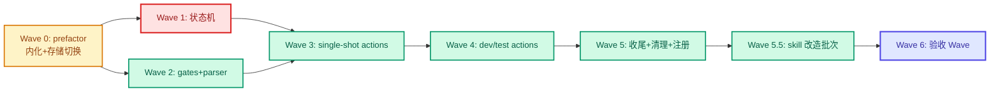

# 执行计划 — CW (Coding Workflow Orchestrator)

> 从 code-architecture.md §4 时序图推导 Wave 依赖，从 §6 test-matrix（来源 A + B）+ §8 Wave 拓扑编排。
> 末尾强制验收 Wave（blocked_by 所有功能 Wave）+ 测试验收清单（全量用例按归属 Wave + 测试层）。
> 交接：定稿后转 plan.md 格式交 coding-execute（见末尾交接说明）。

## Wave 编排总览

### 依赖 DAG 图

### 调度表

| Wave | 切片 | P级 | Blocked by | 并行组 | 说明 |
|------|------|-----|-----------|--------|------|
| 0 | prefactor | — | 无 | — | 内化迁移（judgeByExpected+类型→types.ts）+ 存储（store.ts sqlite 落地）。覆盖 code-arch §7 move/merge 项 + 行为等价测试 |
| 1 | 状态机 | P0 | Wave 0 | A | state-machine.ts（TRANSITIONS + 三重 guard + nextAction）。#2 方案 A |
| 2 | gates + parser | P1 | Wave 0 | A | gates.ts（registry+GateRunner+GitValidator）+ plan-parser.ts。与 Wave 1 并行（不改同文件）|
| 3 | single-shot actions | P1 | Wave 1, 2 | B | actions/{create,plan,clarify,detail,retrospect,closeout}.ts |
| 4 | dev/test actions | P1 | Wave 3 | C | actions/{dev,test}.ts。时序图功能 B+C，双分支 |
| 5 | 收尾+清理+注册 | P1 | Wave 4 | D | index.ts dispatch + 删 src/test-orchestrator/ + 删 coding-execute.js + 移除 lib/gates re-export |
| 5.5 | skill 改造批次 | P1 | 5 | E | #15 skill 收口 + #16 coding-execute 适配 |
| 6 | 验收 Wave | — | 0,1,2,3,4,5,5.5 | — | **必须最后**：读测试验收清单全量 → 跑测试 → 全 PASS 才算实现完成 |

### 并行约束
- 同一并行组内最多 3 个 subagent 并行
- 同一文件不允许多个 Wave 同时修改
- Wave 1（state-machine）与 Wave 2（gates/parser）同组 A 并行：前者改 state-machine.ts，后者改 gates.ts/plan-parser.ts，无文件交集

### Prefactor Wave 说明（refactor 场景）
Wave 0 覆盖 code-arch §7 的 move/merge 项：judgeByExpected+类型 move 到 types.ts；allPassed/allTerminal merge 入 computeGatePassed；store.ts 新建 sqlite 层。每项迁移带行为等价测试（来源 0，#8 AC-8.1~8.3）。test-orchestrator/plan-parser.ts delete+rewrite（格式 markdown→JSON）。

### 后续迭代（Won't / 延后）
- Issue #12 [P3 延后]: D-011 skill 改名（mid-plan→mid-clarify 等）— 推迟到 CW 稳定后，避免改名与实现交织
- Issue #13 [Won't]: full 路径接入（D-015 明确不做）— 未来需要开新 topic 重设计

## Wave 0: prefactor（内化迁移 + 存储切换）

**切片类型**: prefactor
**P级覆盖**: P0/P1 基础（#1 #8）
**Blocked by**: 无——可立即开始
**并行关系**: 必须最先

### 包含的功能/issue
- 功能: test-orchestrator 内化迁移 + store.ts sqlite 落地
- Issue: #1（CwStore node:sqlite DAO，方案 A）、#8（内化回归测试，方案 A）
- 关联时序图: code-architecture.md §4（store 被 all actions 依赖）

### 文件影响
- 创建: `extensions/coding-workflow/src/cw/types.ts`（judgeByExpected + Expected/Actual/TestCase + CwTopic 等）
- 创建: `extensions/coding-workflow/src/cw/store.ts`（CwStore + 4 表 DAO + 事务）
- 删除: `extensions/coding-workflow/src/test-orchestrator/plan-parser.ts`（格式变，rewrite 到 cw/plan-parser.ts Wave 2）
- move: `src/test-orchestrator/index.ts` 的 judgeByExpected → `src/cw/types.ts`
- merge: `src/test-orchestrator/state.ts` 的 allPassed/allTerminal → `src/cw/state-machine.ts` 的 computeGatePassed（Wave 1 落地，本 Wave 占位）
- 测试: `extensions/coding-workflow/src/cw/__tests__/types.test.ts`（8 条 judgeByExpected 迁移，来源 0）

### 覆盖的 test-matrix 用例 ID
- T2.11（SQL 参数化，来源 B）
- T2.12（多表事务边界，来源 B）
- T2.13（事务日志，来源 B）
- T2.27（user_version 迁移，来源 B）
- T2.28（迁移日志 from→to，来源 B）

### 验收标准
- 来源 0：judgeByExpected 8 条等价迁移测试（#8 AC-8.1，内化基线，非 test-matrix 比对集）
- [ ] judgeByExpected 8 条迁移测试全过（#8 AC-8.1）
- [ ] CwStore transaction/loadTopic/insertTopic 等 DAO 可用（#1 AC-1.1~1.5）
- [ ] sqlite 事务原子性（崩溃不污染，D-016 实测已验）

## Wave 1: 状态机（state-machine.ts）

**切片类型**: 垂直切片
**P级覆盖**: P0（#2）
**Blocked by**: Wave 0
**并行关系**: 与 Wave 2 并行（组 A）

### 包含的功能/issue
- 功能: 声明式转换表 + 三重 guard + nextAction
- Issue: #2（状态机 guard 组织，方案 A）+ #9（nextAction 扁平结构）
- 关联时序图: code-architecture.md §4 功能 A/B/C 的 guard 前置

### 文件影响
- 创建: `extensions/coding-workflow/src/cw/state-machine.ts`（TRANSITIONS + checkLinear/checkPhaseCascade/checkCacheConsistency/guard/computeNextStatus/computeGatePassed/buildNextAction）
- 测试: `extensions/coding-workflow/src/cw/__tests__/state-machine.test.ts`

### 覆盖的 test-matrix 用例 ID
- T2.4（guard 非法状态）
- T2.6（第三重缓存不一致）
- T2.14（guard 错误码区分，来源 B）
- T4.6（跨阶段级联失败）
- T2.10/T5.4（终态不可逆）

### 验收标准
- [ ] 三重 guard 串行短路（#2 AC-2.1~2.5）
- [ ] computeGatePassed（merge allPassed/allTerminal，#8 AC-8.3）

## Wave 2: gates + parser（并行于 Wave 1）

**切片类型**: 垂直切片
**P级覆盖**: P1（#3 #4 #5 #6）
**Blocked by**: Wave 0
**并行关系**: 与 Wave 1 并行（组 A）

### 包含的功能/issue
- 功能: gate 注册表 + GateRunner + GitValidator + 3 套 JSON parser
- Issue: #3（GitValidator 逐条容错）、#4（gate registry 声明式）、#5（plan-parser typebox）、#6（GateRunner subprocess）
- 关联时序图: §4 功能 A runGate + 功能 B GitValidator + 功能 C 双分支

### 文件影响
- 创建: `extensions/coding-workflow/src/cw/gates.ts`、`extensions/coding-workflow/src/cw/plan-parser.ts`
- 测试: `src/cw/__tests__/gates.test.ts`、`src/cw/__tests__/plan-parser.test.ts`

### 覆盖的 test-matrix 用例 ID
- T2.2/T2.3（plan parser tier mismatch/缺字段）
- T2.5（gate fail）
- T2.7（mid detail 4 checker fail-fast）
- T2.9（mid clarify 不写任务）
- T2.17（size guard，来源 B）
- T2.18（format tier 锁，来源 B）
- T2.19（路径遍历，来源 B）
- T2.20（subprocess 超时，来源 B）
- T2.21a/T2.21b/T2.21c/T2.22/T2.23（verdict 矛盾/ENOENT/timeout 三场景 infra + 格式契约/infra 可区分，来源 B）
- T2.29（深嵌套 JSON 爆栈防护，来源 B）

### 验收标准
- [ ] gate registry 11 行表 1:1 编码（#4 AC-4.1~4.4）
- [ ] GitValidator 三项独立校验（#3 AC-3.1~3.4）
- [ ] 3 套 JSON schema 解析（#5 AC-5.1~5.4）
- [ ] GateRunner infra vs business 分离（#6 AC-6.1~6.4）

## Wave 3: single-shot actions

**切片类型**: 垂直切片
**P级覆盖**: P1
**Blocked by**: Wave 1, Wave 2
**并行关系**: 串行（依赖状态机+gates+parser 全就绪）

### 包含的功能/issue
- 功能: create/plan/clarify/detail/retrospect/closeout 6 个 handler
- 关联时序图: §4 功能 A（plan 代表，其余同构）
- Issue: #7（review 桩跨 skill 契约，plan/clarify/detail gate 涉及）
- 注: code-arch §8 建议 retrospect/closeout 归 Wave 5，本 plan 归 Wave 3 因其依赖（state-machine/store/gates）在 Wave 1-2 已就绪，提前到 Wave 3 可与 create/plan/clarify/detail 同批实现（8 handler 骨架同构）。Wave 5 仅保留 index.ts 注册 + 遗留物清理。

### 文件影响
- 创建: `src/cw/actions/{create,plan,clarify,detail,retrospect,closeout}.ts`
- 测试: `src/cw/actions/__tests__/{create,plan,clarify,detail,retrospect,closeout}.test.ts`

### 覆盖的 test-matrix 用例 ID
- T1.1~T1.5（create-topic）
- T2.1/T2.8（plan/clarify gate pass + review 桩缺失 hint）
- T2.24（review 缺失预检 hint，来源 B）
- T5.1~T5.3（retrospect + closeout）

### 验收标准
- [ ] 6 handler 统一骨架（load→guard→transaction{gate/mutate}→nextAction）
- [ ] review 桩预检 + hint（#7 AC-7.1~7.2）

## Wave 4: dev/test actions（双分支）

**切片类型**: 垂直切片
**P级覆盖**: P1
**Blocked by**: Wave 3
**并行关系**: 串行

### 包含的功能/issue
- 功能: dev handler（渐进式 GitValidator）+ test handler（lite 重算/mid 信声明双分支）
- 关联时序图: §4 功能 B（dev）+ 功能 C（test 双分支）
- Issue: #10（渐进入参数组统一）

### 文件影响
- 创建: `src/cw/actions/{dev,test}.ts`
- 测试: `src/cw/actions/__tests__/{dev,test}.test.ts`

### 覆盖的 test-matrix 用例 ID
- T3.1~T3.9（dev 渐进式全用例）
- T4.1~T4.5, T4.7~T4.10（test 双分支，T4.6 跨阶段级联归 Wave 1）
- T2.15（git infra vs business，来源 B）
- T2.16（nextAction 列 fail，来源 B）
- T2.26（per-task 事务部分成功，来源 B）

### 验收标准
- [ ] dev 渐进式逐条容错（#3 AC + #10）
- [ ] test lite 丢 claimedStatus（D-008，T4.1/T4.2）
- [ ] test mid 信声明 + GitValidator（T4.4/T4.5）

## Wave 5: 收尾 + 清理 + 注册

**切片类型**: 垂直切片
**P级覆盖**: P1
**Blocked by**: Wave 4
**并行关系**: 串行（末端清理）

### 包含的功能/issue
- 功能: index.ts dispatch + tool 注册 + 遗留物清理
- 关联: code-arch §7 现有代码映射（delete 项）+ §13 遗留物处理
- 注：lib/gates re-export 移除与 coding-execute.js 删除依赖 index.ts 重写完成（Wave 5），故归 Wave 5 而非 Wave 0；本拆分符合 code-arch §7 处置列。

### 文件影响
- 创建: `extensions/coding-workflow/src/index.ts`（registerCodingWorkflowTool + dispatch + 工厂）
- 修改: `extensions/coding-workflow/index.ts`（顶层 re-export，移除 test-orch 注册 + lib/gates re-export）
- 删除: `src/test-orchestrator/` 整个目录、`workflows/coding-execute.js`
- 保留: `skills/coding-execute/scripts/check_execute.py`（§13.2）

### 覆盖的 test-matrix 用例 ID
- T2.25（删 test-orch 前零引用，来源 B）
- SDK 契约测试（index.ts registerTool，TEST-STRATEGY 要求）

### 验收标准
- [ ] index.ts 注册单个 tool `coding-workflow`（#8 AC-8.4）
- [ ] grep 全仓无 `test-orchestrator` 外部引用
- [ ] coding-execute.js 删除（§13.1）

## Wave 5.5: skill 改造批次（#15 + #16）

**切片类型**: 垂直切片（skill 改造，代码在 extensions/coding-workflow/skills/）
**P级覆盖**: P1（#15 #16）
**Blocked by**: Wave 5（需 index.ts registerCodingWorkflowTool 完成，skill description 映射句才能准确引用 CW action 名）
**并行关系**: 串行（依赖 Wave 5）

### 包含的功能/issue
- 功能: #15 skill 收口 4 子项 + #16 coding-execute 适配
- Issue: #15（skill 收口改造批次，方案 A 按 tier 分批）、#16（coding-execute skill 适配 CW，方案 A 派发指导文档）
- 关联: requirements G2、architecture §10/§13、D-007-REVISIT/D-006

### 文件影响
- 创建: skills/coding-workflow/SKILL.md（入口 skill，AC-15.1）
- 修改: skills/lite-plan/SKILL.md + skills/mid-plan/SKILL.md + skills/mid-detail-plan/SKILL.md（description 映射句 + JSON 产出步骤 + review 落盘步骤，AC-15.2/15.3/15.4）
- 修改: skills/coding-execute/SKILL.md（从调 workflow 脚本改为 subagent 派发指导，AC-16.2/16.3/16.5）
- 修改: skills/coding-retrospect/SKILL.md + skills/coding-closeout/SKILL.md（description 映射句）
- 保留: skills/coding-execute/scripts/check_execute.py（AC-16.4 复用）

### 覆盖的 test-matrix 用例 ID
- 本 Wave 是 skill 改造（SKILL.md），不直接产代码测试用例。#15/#16 的 AC 验收靠手工试跑 + G2 MVP 验收（agent 只认 CW 单接口端到端走通）。

### 验收标准
- [ ] AC-15.1 入口 skill coding-workflow 新增（G2 MVP 验收项）
- [ ] AC-15.2~15.5 description 映射 + review 落盘 + JSON 产出 + 不删路由（D-007-REVISIT）
- [ ] AC-16.1 coding-execute.js 已删（Wave 5 完成）
- [ ] AC-16.2~16.5 coding-execute skill 改为派发指导 + 数据契约对齐 + check_execute.py 复用

## Wave 6: 验收 Wave（Acceptance Gate）

**切片类型**: 验收（非功能切片）
**P级覆盖**: —
**Blocked by**: Wave 0, 1, 2, 3, 4, 5, 5.5（所有功能 Wave）
**并行关系**: 必须最后，不与任何 Wave 并行

### 职责
读「测试验收清单」全量 → 跑测试套件 → 核对每条用例 ID 的 PASS/FAIL/缺失 → 输出覆盖率报告。

### 执行流
1. read execution-plan.md「测试验收清单」（全量用例 ID + 断言摘要 + 归属 Wave + 测试层）
2. 跑测试套件（全量，mock 组 + real 组）
3. 每条 PASS/FAIL/缺失映射回清单用例 ID
4. 清单状态列填 PASS / FAIL / 未实现 / `[DEVIATED]原因`
5. 输出覆盖率报告：清单用例 PASS 数 / 总数 + 未过用例明细

### 验收标准
- [ ] **测试验收清单全量用例 PASS**（任一 FAIL / 未实现 = 整个实现未完成，回对应 Wave 补）
- [ ] 无 `[DEVIATED]` 未经用户确认
- [ ] 覆盖率报告输出（清单 PASS 数 / 总数）

## 测试验收清单（MANDATORY，全量用例按归属 Wave + 测试层）

> 来自 code-architecture.md §6 test-matrix 全量（来源 A 功能 + 来源 B NFR）。coding-execute 按 Wave 执行，每 Wave 完成判定 = 覆盖用例全 PASS。末尾验收 Wave 跑全量核对。
> **测试层分组**：mock = mock 掉外部依赖（DatabaseSync/GitValidator/GateRunner/spawnSync）；real = 真实 sqlite + 真实 git 仓库 + 真实 python。coding-execute 的 check_execute.py 自动识别 mid 的用例 ID（T 加用例号.序号格式，如 T2.11）+ 测试执行层。

| 用例 ID | 场景摘要 | 归属 Wave | 测试层 | 来源 | 状态 |
|---------|---------|----------|--------|------|------|
| T1.1 | tier=lite 建 topic | W3 | real | A 功能 | 待测 |
| T1.2 | tier=mid 建 topic | W3 | real | A 功能 | 待测 |
| T1.3 | 首次建库（空 db） | W3 | real | A 功能 | 待测 |
| T1.4 | slug 重复 throw | W3 | real | A 功能 | 待测 |
| T1.5 | tier 锁定后改 tier 拒 | W3 | mock | A 功能 | 待测 |
| T2.1 | plan gate pass | W3 | mock | A 功能 | 待测 |
| T2.2 | tier mismatch throw | W2 | mock | A 功能 | 待测 |
| T2.3 | schema 缺字段 throw | W2 | mock | A 功能 | 待测 |
| T2.4 | guard 非法状态 | W1 | mock | A 功能 | 待测 |
| T2.5 | gate fail status 不变 | W2 | mock | A 功能 | 待测 |
| T2.6 | 第三重缓存不一致 | W1 | mock | A 功能 | 待测 |
| T2.7 | mid detail 4 checker fail-fast | W2 | mock | A 功能 | 待测 |
| T2.8 | review 桩缺失 hint | W3 | mock | A 功能 | 待测 |
| T2.9 | mid clarify 不写任务 | W2 | mock | A 功能 | 待测 |
| T2.10 | 终态不可逆 | W1 | mock | A 功能 | 待测 |
| T2.11 | SQL 参数化拒拼接 | W0 | real | B NFR | 待测 |
| T2.12 | 多表事务边界 ROLLBACK | W0 | real | B NFR | 待测 |
| T2.13 | 事务日志含 topicId | W0 | mock | B NFR | 待测 |
| T2.14 | guard 错误码区分 | W1 | mock | B NFR | 待测 |
| T2.15 | git infra vs business | W4 | mock | B NFR | 待测 |
| T2.16 | nextAction 列 fail | W4 | mock | B NFR | 待测 |
| T2.17 | JSON size guard | W2 | mock | B NFR | 待测 |
| T2.18 | format tier 锁 | W2 | mock | B NFR | 待测 |
| T2.19 | topicDir 路径遍历拒 | W2 | mock | B NFR | 待测 |
| T2.20 | subprocess 超时 kill | W2 | mock | B NFR | 待测 |
| T2.21a | verdict/exitcode 矛盾 infra | W2 | mock | B NFR | 待测 |
| T2.21b | python ENOENT infra | W2 | mock | B NFR | 待测 |
| T2.21c | subprocess timeout infra | W2 | mock | B NFR | 待测 |
| T2.22 | verdict 格式契约 pin | W2 | mock | B NFR | 待测 |
| T2.23 | infra vs business gate_history 区分 | W2 | mock | B NFR | 待测 |
| T2.24 | review 缺失预检 hint | W3 | mock | B NFR | 待测 |
| T2.25 | 删 test-orch 零引用 | W5 | real | B NFR | 待测 |
| T2.26 | per-task 事务部分成功 | W4 | real | B NFR | 待测 |
| T2.27 | user_version 迁移数据保留 | W0 | real | B NFR | 待测 |
| T2.28 | 迁移日志 from→to | W0 | real | B NFR | 待测 |
| T2.29 | 深嵌套 JSON 爆栈防护 | W2 | mock | B NFR | 待测 |
| T3.1 | 单 task 有效 commit | W4 | real | A 功能 | 待测 |
| T3.2 | commit 不存在 | W4 | real | A 功能 | 待测 |
| T3.3 | commit 外来 | W4 | real | A 功能 | 待测 |
| T3.4 | 空 commit | W4 | real | A 功能 | 待测 |
| T3.5 | 部分 Wave 未 committed | W4 | real | A 功能 | 待测 |
| T3.6 | 全 Wave committed gatePassed | W4 | real | A 功能 | 待测 |
| T3.7 | 首次有效流转 | W4 | real | A 功能 | 待测 |
| T3.8 | 态内推进不流转 | W4 | real | A 功能 | 待测 |
| T3.9 | 批量混合 | W4 | real | A 功能 | 待测 |
| T4.1 | lite actual 匹配 | W4 | mock | A 功能 | 待测 |
| T4.2 | lite 谎报机器判 failed | W4 | mock | A 功能 | 待测 |
| T4.3 | lite 截图缺失 | W4 | real | A 功能 | 待测 |
| T4.4 | mid 信声明 pass | W4 | real | A 功能 | 待测 |
| T4.5 | mid commitHash 无效 | W4 | real | A 功能 | 待测 |
| T4.6 | 跨阶段级联失败 | W1 | mock | A 功能 | 待测 |
| T4.7 | 全 case passed 前 | W4 | mock | A 功能 | 待测 |
| T4.8 | 全 case passed | W4 | mock | A 功能 | 待测 |
| T4.9 | 首次有效 test 流转 | W4 | mock | A 功能 | 待测 |
| T4.10 | 态内推进不流转 | W4 | mock | A 功能 | 待测 |
| T5.1 | retrospect 前置不足 | W3 | mock | A 功能 | 待测 |
| T5.2 | retrospect pass | W3 | mock | A 功能 | 待测 |
| T5.3 | closeout pass evidence | W3 | mock | A 功能 | 待测 |
| T5.4 | closed 终态不可逆 | W1 | mock | A 功能 | 待测 |

**清单完整性自检**：59 条用例 = 来源 A 功能（38 条：T1-T5）+ 来源 B NFR（21 条：T2.11-T2.29，含 T2.21a/b/c 三场景拆分）。覆盖 code-arch §6 test-matrix 来源 A+B 全量。每条归属唯一 Wave，无重复无遗漏。

> 注：来源 0（judgeByExpected 8 条等价迁移测试，#8 AC-8.1）归 Wave 0 内化迁移的行为等价测试，不纳入本 mid test-matrix 比对集（属内化基线验证，非功能/NFR 用例）。Wave 0 完成判定包含该迁移测试全过。

## 交接说明（转 coding-execute）

本 execution-plan.md 定稿后，交接 coding-execute 执行。coding-execute 的 check_execute.py 支持 mid 格式（T 加用例号.序号格式的用例 ID + 测试层 unit/integration/e2e），mid 执行与 lite 共享 TDD + worktree 隔离 + test-runner 落盘 + 机器门链路。

交接后需转 plan.md 格式（coding-execute 统一入口读 plan.md）。转换：本文件的 Wave 调度表 + 测试验收清单作为 plan.md 的 Wave + E2E 表主体。
