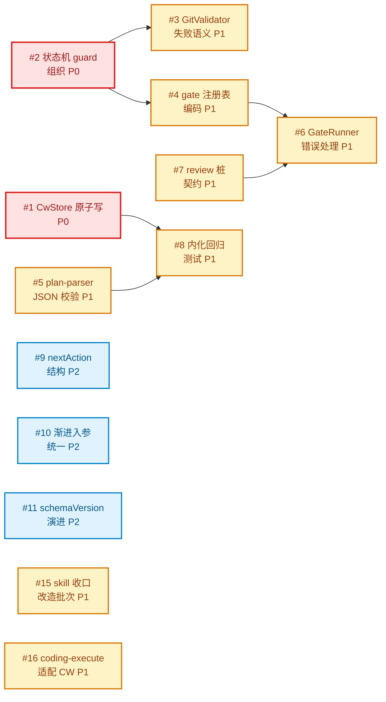

# Issue 决策图 — CW 实施

## 地图总览

## 上游覆盖核验（MANDATORY，逐条不漏）

按 4 轴（状态§4 / 模块§3 / 边界§6 / 挑战§5+§7+§9+§13）扫 system-architecture.md。每个可拆元素一行：

| 上游元素 | 轴 | 对应 issue | 状态 | N/A 理由 |
|---------|----|-----------|------|----------|
| §4.2 created→planned/clarified（plan/clarify action）| 状态 | #2 | ✅ 已覆盖 | — |
| §4.2 planned/detailed→developed（dev 首次提交）| 状态 | #2 | ✅ 已覆盖 | — |
| §4.2 developed→tested（跨阶段级联①：dev 全 Wave committed）| 状态 | #2 | ✅ 已覆盖 | — |
| §4.2 tested→retrospected（跨阶段级联②：test 全 case passed）| 状态 | #2 | ✅ 已覆盖 | — |
| §4.2 retrospected→closed（closeout）| 状态 | #2 | ✅ 已覆盖 | — |
| §4.2 异常：非法转换 throw / previous phase incomplete throw | 状态 | #2 | ✅ 已覆盖 | — |
| §3 src/index.ts（注册 + 移除 lib/gates re-export + 移除 test-orch 注册）| 模块 | #8 | ✅ 已覆盖 | — |
| §3 src/cw/state-machine.ts（状态机 + nextAction）| 模块 | #2 | ✅ 已覆盖 | — |
| §3 src/cw/store.ts（_cw.db node:sqlite DAO + 事务）| 模块 | #1 | ✅ 已覆盖 | — |
| §3 src/cw/gates.ts（gate 注册表 + 执行器）| 模块 | #4 | ✅ 已覆盖 | — |
| §3 src/cw/plan-parser.ts（JSON 解析）| 模块 | #5 | ✅ 已覆盖 | — |
| §3 src/cw/actions/（8 个 handler）| 模块 | #2 | ✅ 已覆盖 | — |
| §3 src/cw/types.ts（judgeByExpected + 类型）| 模块 | #8 | ✅ 已覆盖 | — |
| §3 action 入参约定（topicId/不订阅 pi.on/throw/dependsOn/workspacePath）| 模块 | — | N/A | 5 子项已定无方案空间（#10 仅覆盖数组统一） |
| §6 check_*.py（subprocess 边界）| 边界 | #6 | ✅ 已覆盖 | — |
| §6 git（execFileSync 只读）| 边界 | #3 | ✅ 已覆盖 | — |
| §6 _cw.db（node:sqlite 内置）| 边界 | #1 | ✅ 已覆盖 | — |
| §6 judgeByExpected（in-process 纯函数）| 边界 | #8 | ✅ 已覆盖 | — |
| §6 Pi SDK（True-external）| 边界 | — | N/A | 零 Port 决策已定，SDK 升级直接改 index.ts，无实施决策空间 |
| §6 child_process 运行时约束（第三用户豁免）| 边界 | #3/#6 | ✅ 已覆盖 | 实施前提，遵循 pi-workflow/pi-subagents 先例 |
| §5.1 gate 强度 4 档定义 | 挑战 | #4 | ✅ 已覆盖 | — |
| §5.2 review 桩机制（review 文件 skill 阶段落盘）| 挑战 | #7 | ✅ 已覆盖 | — |
| §5.3 多 checker 串行 fail-fast 执行规则 | 挑战 | #4 | ✅ 已覆盖 | — |
| §7 不变式：tier 不可变 | 挑战 | #5 | ✅ 已覆盖 | — |
| §7 不变式：状态机线性 + 跨阶段级联 | 挑战 | #2 | ✅ 已覆盖 | — |
| §7 不变式：渐进式提交原子性 | 挑战 | #1 | ✅ 已覆盖 | — |
| §7 不变式：lite test 丢 claimedStatus | 挑战 | #8 | ✅ 已覆盖 | — |
| §7 不变式：dev/test commit 真实性 | 挑战 | #3 | ✅ 已覆盖 | — |
| §7 不变式：gate 历史完整 | 挑战 | #4 | ✅ 已覆盖 | — |
| §9 test-orchestrator 内化迁移 5 步 | 挑战 | #8 | ✅ 已覆盖 | — |
| §12 JSON schema 3 套（format 锁 tier）| 挑战 | #5 + #15 | ✅ 已覆盖 | #5 CW 解析侧 + #15 skill JSON 产出侧 |
| §13 删 coding-execute.js workflow 脚本 | 挑战 | #16 | ✅ 已覆盖 | skill 重建有方案空间（coding-execute skill 改造） |
| §13 保留 check_execute.py | 挑战 | — | N/A | 跨格式能力已定，#16 适配时复用 |
| §6 lib/gates 移除 re-export | 挑战 | — | N/A | 已定移除（代码保留），无方案空间 |
| §10 skill 收口改造批次（D-007-REVISIT）| 兜底 | #15 | ✅ 已覆盖 | 4 子项整体归 #15，#7 收窄为 review 桩本身 |
| §11 evidence 追溯（agent 中介，非机器强制）| 兜底 | — | N/A | 已诚实标注为 agent-mediated，CW 不耦合 goal，无实施决策 |

## P0 Issues（阻塞项，必须先做）

### #1: CwStore 基于 node:sqlite 的 DAO + 事务封装

**P 级**: P0
**类型**: 模块
**Blocked by**: 无
**推荐强度**: Strong

#### 问题描述

CW 持久化层（原架构 §8 _cw.json）。D-016 决定改用 Node 内置 node:sqlite + 关系表模式。CwStore 需封装 sqlite 连接 + 事务 + DAO（topic/wave/test_case/gate_history 分表）。渐进式 dev/test action 多次更新，事务保证原子性（sqlite 天生，测试已验证：崩溃事务不污染）。

关联 system-architecture §8（数据模型，需修正为关系表）、§7（不变式：渐进式提交原子性——现归 sqlite 事务）。

#### 为什么是这个 P 级

P0（阻塞）：_cw 存储是 CW 唯一持久化根。CwStore DAO 是所有 action handler 的依赖，不定下来上层无法开工。node:sqlite 已选定（D-016），关系表模式已定，本 issue 聚焦 DAO 层设计与事务封装。

#### 方案对比

##### 方案 A: 手写 DAO（每表一模块，事务在 service 层）

**改动**: store.ts 导出 CwStore 类，封装 DatabaseSync 连接。每张表一个 DAO 函数集（topic_dao.ts / wave_dao.ts 等）。事务用 BEGIN/COMMIT/ROLLBACK 包裹多表写。handler 调 service 层（service 层组合 DAO + 事务）。

**优点**: 零额外依赖（手写 SQL）；事务边界清晰（service 层控制）；SQL 可优化（按需索引/查询）；符合项目「纯逻辑提取独立模块」测试规范（DAO 是纯数据访问，service 是纯逻辑）
**缺点**: 手写 SQL 有样板代码；SQL 语法错误要到运行时才发现（无编译期检查）
**适用场景**: CW（表结构稳定，查询简单，事务边界明确）

##### 方案 B: 引入轻量查询构建器（如 kysely）

**改动**: 用 kysely 等 TypeScript 查询构建器，提供类型安全 SQL。

**优点**: 编译期类型检查 SQL；重构友好
**缺点**: 引入第三方依赖（违背零依赖精神，且 node:sqlite 刚内置又引外部查询库讽刺）；kysely 对 node:sqlite 的适配未必成熟
**适用场景**: 复杂查询多表 JOIN 频繁（CW 不符合，CW 按整 topic 读改写为主）

##### 方案 C: 扁平 SQL 字符串（无 DAO 层，handler 直接写 SQL）

**改动**: handler 里直接写 sqlite SQL 字符串操作数据库。

**优点**: 最少代码层
**缺点**: SQL 散落各 handler；事务边界乱（handler 各自 BEGIN/COMMIT）；难测试；违反「状态层集中」架构原则
**适用场景**: 原型（生产不可用）

#### 取舍决策

**选择**: 方案 A。node:sqlite 选定就是为了零依赖（D-016），方案 B 引 kysely 违背初衷。CW 表结构稳定（mid-plan 已定 CwTopic 字段）+ 查询简单（按 topicId 整体读改写），手写 SQL 样板可控。DAO 分模块 + service 层事务，符合项目测试规范（DAO 可注入 mock DatabaseSync 测试，service 纯逻辑测试）。

**放弃方案的理由**:
- 方案 B: 引第三方查询库违背 node:sqlite 零依赖初衷；kysely 对 node:sqlite 适配不确定
- 方案 C: SQL 散落 + 事务边界乱 + 难测试，违反架构「状态层集中」

#### 验收标准

- [ ] AC-1.1 [正常]: CwStore 事务提交后数据持久（trace: UC-2 各 action）
- [ ] AC-1.2 [异常]: 事务中抛错 ROLLBACK，数据回滚（事务中崩溃已验证不污染）
- [ ] AC-1.3 [边界]: 首次 create（空库）能建表 + 插入
- [ ] AC-1.4 [兼容]: schema 演进用 ALTER TABLE（关联 #11）
- [ ] AC-1.5 [隔离]: DAO 可注入 mock DatabaseSync 做单测（TEST-STRATEGY 纯逻辑提取）

### #2: 状态机两重校验组织模式

**P 级**: P0
**类型**: 架构
**Blocked by**: 无
**推荐强度**: Strong

#### 问题描述

system-architecture §4.2 定义两重校验：① 线性 expectedStatus（currentState ∈ expectedStatuses[action]）；② 跨阶段 gatePassed 级联（test 需 dev 全 Wave committed；retrospect 需 test 全 case passed）。这两道校验如何组织在代码里——集中在 state-machine.ts 还是散在各 handler——决定 handler 骨架与防跳过的可靠性。

关联 system-architecture §4（状态机）、§7（不变式：状态机线性 + 跨阶段级联）。

#### 为什么是这个 P 级

P0（阻塞）：状态机是 CW 的核心价值（D-009 主强制点）。组织模式定不下来，8 个 action handler 的骨架无法开工。所有 handler 依赖这个 guard 模式。

#### 方案对比

##### 方案 A: 声明式转换表 + 通用 guard 引擎（集中）

**改动**: state-machine.ts 导出 `TRANSITIONS: Record<Action, {expectedStatuses, nextStatus, requirePhaseComplete?}>` 声明式表 + 一个通用 `guard(action, topic)` 函数，各 handler 入口调 `guard()`。

**优点**: 防跳过逻辑集中，单点维护；加 action 只改表；两重校验在同一函数内顺序执行，不会漏第二道；可测试（纯函数）
**缺点**: handler 与 guard 的耦合靠约定（handler 必须调 guard），编译器不强制
**适用场景**: 状态机规则明确且稳定（CW 符合，§4.2 已给完整表）

##### 方案 B: 各 handler 自己实现校验（分散）

**改动**: 每个 action handler 入口自己写 expectedStatus 检查 + 跨阶段级联检查。

**优点**: handler 自包含，编译期可见全部逻辑
**缺点**: 8 个 handler 重复代码；第二道校验（级联）容易在某个 handler 漏写；改规则要改 8 处
**适用场景**: handler 逻辑差异大、无统一模式（CW 不符合）

##### 方案 C: 类装饰器/中间件模式

**改动**: 用装饰器或中间件在 handler 执行前自动注入 guard。

**优点**: 编译期强制（handler 必须经过 guard）
**缺点**: Pi 扩展的 handler 是普通函数，装饰器增加魔法；TS 装饰器配置复杂；调试困难
**适用场景**: 框架级强制（CW 是轻量工具，不值得）

#### 取舍决策

**选择**: 方案 A
**理由**: 声明式转换表 + 通用 guard 是状态机模式的社区标准（XState/redux 的核心思想）。CW 的转换表 §4.2 已完整定义，声明式编码最自然。方案 A 的「约定耦合」缺点靠 SDK 契约测试覆盖（每个 handler 必须调 guard，TEST-STRATEGY 要求的 SDK 契约测试正好覆盖）。方案 B 的 8 处重复和易漏第二道校验是真实的防跳过风险，不可接受。

**放弃方案的理由**:
- 方案 B: 重复代码 + 第二道校验易漏（违反 D-009 主强制点可靠性）
- 方案 C: 装饰器魔法对轻量工具过度，Pi handler 模型不适合

#### 验收标准

- [ ] AC-2.1 [正常]: 合法转换（created→planned）guard 通过（trace: UC-1 AC-1.2）
- [ ] AC-2.2 [异常]: 非法转换（created→tested）guard throw `illegal state transition` 不跑 gate
- [ ] AC-2.3 [异常]: developed→test 但 dev 有 Wave 未 committed，guard throw `previous phase incomplete` 不跑 gate
- [ ] AC-2.4 [异常]: tested→retrospect 但 test 有 case 未 passed，guard throw `previous phase incomplete`
- [ ] AC-2.5 [契约]: 每个 action handler 入口调 guard（SDK 契约测试覆盖）
- [ ] AC-2.6 [语义]: 首次有效 dev/test 提交触发状态流转（planned/detailed→developed，developed→tested），后续渐进提交不流转只更新 _cw.db（关联 UC-3 AC-3.5 / UC-4 AC-4.5）

## P1 Issues（核心）

### #3: GitValidator 失败语义

**P 级**: P1
**类型**: 模块
**Blocked by**: #2
**推荐强度**: Strong

#### 问题描述

GitValidator 用 execFileSync 调只读 git 命令（cat-file 存在/merge-base 属仓库/diff-tree 非空）校验 commitHash 真实性（§7 不变式）。当某条校验失败（commit 不存在/不属于本仓库/空 commit），整个 action 该 throw 还是只把该 task/case 记 fail 继续其他？这决定渐进式提交的容错语义。

关联 system-architecture §7（dev/test commit 真实性不变式）。

#### 为什么是这个 P 级

P1（核心）：dev/test 是核心路径，失败语义影响 agent 的重试策略。blocked_by #2（guard 组织定了才能在 handler 里集成 GitValidator 的失败处理）。

#### 方案对比

##### 方案 A: 该 task/case 记 fail，继续其他（逐条容错）

**改动**: GitValidator 返回结构化结果（每条 pass/fail + 原因），handler 把 fail 的 task/case 状态置 failed，gateHistory 记录，action 不 throw，返回 nextAction 让 agent 看到哪些 fail 去修。

**优点**: 符合渐进式语义（agent 批量提交，部分失败不阻塞已成功的）；agent 拿到明确反馈哪些 commit 有问题
**缺点**: gate 判定逻辑复杂（要聚合多个 task/case 的结果）

##### 方案 B: 整个 action throw（fail-fast）

**改动**: GitValidator 任一条失败则 throw，整个 action 失败。

**优点**: 实现简单
**缺点**: 一个坏 commit 导致整批失败，agent 无法区分哪些成功；违背渐进式提交的设计意图（D-005）

#### 取舍决策

**选择**: 方案 A。符合 D-005 渐进式语义 + 架构 §7「该 task 记 fail」（已隐含逐条）。agent 批量提交时部分失败应继续，nextAction 反馈失败项让 agent 针对性重试。

#### 验收标准

- [ ] AC-3.1 [正常]: 合法 commit 校验 pass（trace: UC-3 dev/test）
- [ ] AC-3.2 [异常]: 不存在 commitHash → 该 task fail，其他继续
- [ ] AC-3.3 [异常]: commit 不属本仓库 → 该 case fail
- [ ] AC-3.4 [反馈]: fail 的 task/case 在 nextAction 明确列出
- [ ] AC-3.5 [约束]: mid test commitHash 必须能在 _cw.db wave 表追溯到已 committed 的 dev commit（否则 agent 可提交任意合法 commit 骗过 medium-coverage，关联 UC-4 AC-4.3）

### #4: gate 注册表编码模式

**P 级**: P1
**类型**: 模块
**Blocked by**: #2
**推荐强度**: Strong

#### 问题描述

system-architecture §5.2 给了 11 行 tier×phase→checker 映射表（如 lite×dev→GitValidator medium-git）。这张表如何编码进 gates.ts，决定 gate 执行器的实现模式。多 checker 场景（mid detail 有 4 个 check）需串行 fail-fast（§5.3）。

关联 §5（gate 注册表）、§7（gate 历史完整不变式）。

#### 为什么是这个 P 级

P1（核心）：gate 注册表是 CW 的核心配置，所有 action handler 调用它。blocked_by #2（guard 之后才跑 gate）。

#### 方案对比

##### 方案 A: 声明式数组 + 通用执行器

**改动**: `GATE_REGISTRY: Array<{tier, phase, checkers: Checker[], tier: GateTier}>` 声明式数组。通用 `runGate(tier, phase, topic)` 函数查表→串行跑 checkers→fail-fast→记 gateHistory。

**优点**: 数据与执行分离；加 gate 只改数组；fail-fast 在通用函数内实现一次；gateTier 透传自然
**缺点**: Checker 类型需统一接口（需定义 Checker 签名）

##### 方案 B: 按 phase 注册函数链（命令式）

**改动**: `registerGate(phase, tier, ...checkers)` 命令式注册，每个 phase 一个函数链。

**优点**: 灵活
**缺点**: 注册散落；tier×phase 映射不直观（要读多处才知道全貌）；fail-fast 要每个链自己实现

#### 取舍决策

**选择**: 方案 A。声明式数组让 §5.2 的 11 行表直接 1:1 映射成代码，可读性最高。通用执行器单点实现 fail-fast + gateHistory + gateTier 透传，符合 §5.3 执行规则。

#### 验收标准

- [ ] AC-4.1 [正常]: 单 checker gate pass/fail 正确（trace: UC-2 plan gate）
- [ ] AC-4.2 [异常]: 多 checker（mid detail 4 个）串行，任一 fail 则 fail-fast
- [ ] AC-4.3 [记录]: 每次调 runGate 追加 gateHistory（含 tier/result/ts）
- [ ] AC-4.4 [透传]: 返回值 gateTier 字段来自注册表

### #5: plan-parser JSON 校验方式

**P 级**: P1
**类型**: 模块
**Blocked by**: 无
**推荐强度**: Strong

#### 问题描述

system-architecture §12 定义 3 套 JSON schema（LitePlan/MidClarify/MidDetail）。plan-parser.ts 需解析并校验入参 JSON。校验工具选型影响运行时安全 + 开发效率。项目已用 typebox（Tool 参数 schema）。

关联 §12（JSON schema）、§7（tier 不可变：format===tier 校验）。

#### 为什么是这个 P 级

P1（核心）：plan/clarify/detail 三个 action 依赖 plan-parser 解析任务清单。无 blocked_by（与 #1/#2 并行可设计）。

#### 方案对比

##### 方案 A: typebox Value.Assert（复用项目既有依赖）

**改动**: 用 typebox 定义 3 套 schema（Type.Object），用 Value.Assert 或 Value.Check 运行时校验。

**优点**: 零新依赖（typebox 已是项目依赖）；schema 与类型同源；与 Pi Tool 参数风格一致
**缺点**: typebox 的 runtime 校验 API（@sinclair/typebox/value）需确认 Pi 运行时是否提供

##### 方案 B: 手写校验函数

**改动**: 每套 schema 写一个 validate 函数，逐字段 typeof/Array.isArray 检查。

**优点**: 零依赖；完全可控
**缺点**: 3 套 schema 重复代码；易漏字段；新增字段要改校验

##### 方案 C: 引 ajv（JSON Schema 标准校验器）

**改动**: 引入 ajv + 把 schema 写成 JSON Schema draft-07。

**优点**: 标准
**缺点**: 新依赖（违反最小依赖）；schema 与 TS 类型不同源（要维护两份）

#### 取舍决策

**选择**: 方案 A（前提：Pi 运行时提供 typebox/value，否则降级方案 B）。typebox 已是项目依赖，schema 与类型同源是最大优势。若 Value 模块不可用，方案 B 手写校验作为 fallback（3 套 schema 体量不大，手写可接受）。

#### 验收标准

- [ ] AC-5.1 [正常]: 合法 LitePlan JSON 解析出 waves/testCases（trace: UC-2 plan）
- [ ] AC-5.2 [异常]: format !== tier 时 throw（D-003 tier 锁定）
- [ ] AC-5.3 [异常]: 缺必填字段时 throw 明确错误
- [ ] AC-5.4 [兼容]: MidClarify 不含 waves/testCases（只确认 tier + deliverables）

### #6: GateRunner subprocess 错误处理

**P 级**: P1
**类型**: 边界
**Blocked by**: #4
**推荐强度**: Worth exploring

#### 问题描述

GateRunner 用 spawn 调 python check_*.py（§6 child_process 第三用户）。subprocess 可能：非零退出（check 发现问题）/ 超时（脚本卡死）/ crash（python 不存在）。如何区分「check 判定 fail」（正常业务结果）vs「subprocess 异常」（基础设施问题）？

关联 §6（check_*.py 边界）、§5.3（gate 执行规则）。

#### 为什么是这个 P 级

P1（核心）：gate 执行的可靠性。blocked_by #4（gate 执行器组织定了才集成 subprocess）。

#### 方案对比

##### 方案 A: 解析 stdout 的 machine check 行 + 非零退出码双信号

**改动**: 现有 check 脚本输出格式是 `[check] machine check: N/N passed → PASS/FAIL`（见 check_issues.py）。GateRunner 解析 stdout 末尾的 verdict 行作为 gate 结果，exit code 作为辅助。超时则 kill + 标 infra-error。

**优点**: 复用现有脚本输出契约；区分业务 fail（exit 1 + verdict FAIL）vs infra error（crash/timeout）
**缺点**: 依赖脚本输出格式稳定性（格式变则解析断）

##### 方案 B: 只看 exit code

**改动**: exit 0 = pass，非 0 = fail，不解析 stdout。

**优点**: 最简单
**缺点**: 无法区分业务 fail vs infra crash；丢失 report（check 的具体问题）

#### 取舍决策

**选择**: 方案 A。现有 check 脚本已有稳定输出格式（mid-plan 阶段已验证），解析 verdict 行拿到 report 让 agent 知道哪里 fail。exit code 作为辅助校验（verdict 与 exitcode 矛盾时标 infra-error）。超时 kill 标 infra-error 让 agent 知道是基础设施问题非业务 fail。

#### 验收标准

- [ ] AC-6.1 [正常]: check pass → gate pass（trace: UC-2 各 plan gate）
- [ ] AC-6.2 [异常]: check fail（verdict FAIL + exit 1）→ gate fail + report 透传
- [ ] AC-6.3 [异常]: subprocess crash（python 缺失）→ infra-error throw
- [ ] AC-6.4 [异常]: 超时 → kill + infra-error

### #7: review 桩跨 skill 契约保障

**P 级**: P1
**类型**: 流程
**Blocked by**: 无
**推荐强度**: Strong

#### 问题描述

system-architecture §5.2 review 桨机制：check_*.py 期望 changes/ 下对应阶段的 review 文件（如 review-issues.md、review-clarity.md，verdict APPROVED），该文件由 skill 阶段（review-fix-loop）落盘，CW 不产。风险：skill 改造未完成或 review-fix-loop 未跑，则 check_*.py 因缺 review 文件 fail，agent 困惑（不知道是设计问题还是文件缺失）。

关联 §5.2（review 桩）、§10（skill 收口改造）。

#### 为什么是这个 P 级

P1（核心）：mid 路径的 clarify/detail gate 都依赖 review 文件存在。这是 mid 复用 full-* check 脚本的已知代价（§6 诚实标注）。

#### 方案对比

##### 方案 A: CW 检测 review 文件缺失时给明确 hint + 信任 skill 改造

**改动**: CW gate 跑 check_*.py 前，预检 changes/ 下对应阶段的 review 文件是否存在。缺失则返回结构化错误：「review 文件缺失，请先跑 skill 阶段的 review-fix-loop（D-007-REVISIT 改造步骤）」。不自动生成 stub（尊重 §5.2 时序）。

**优点**: agent 拿到可操作 hint（知道下一步做什么）；不造假 stub
**缺点**: agent 仍需理解 review-fix-loop 流程

##### 方案 B: CW 自动生成 review stub（造假）

**改动**: CW 检测缺失时自动产一个 verdict APPROVED 的 stub。

**优点**: check 不报错
**缺点**: 违背 §5.2 决策（CW 不产桩）；review 没真跑就 APPROVED 是造假；违背诚实执行原则

#### 取舍决策

**选择**: 方案 A。CW 不造假（违背架构决策 + 诚实执行原则）。预检 + hint 让 agent 知道是流程缺失非设计问题。skill 改造（D-007-REVISIT）保证 review-fix-loop 跑过则文件在。

#### 验收标准

- [ ] AC-7.1 [异常]: review 文件缺失时 CW 返回明确 hint（非裸 check 报错）
- [ ] AC-7.2 [正常]: review 文件存在且 APPROVED 时 check 正常跑

### #8: test-orchestrator 内化回归测试

**P 级**: P1
**类型**: 模块
**Blocked by**: #1, #5
**推荐强度**: Strong

#### 问题描述

system-architecture §9 决定 src/test-orchestrator/ 整体删除，judgeByExpected + 类型迁 src/cw/types.ts，expected 解析重写为 JSON 结构化（非 markdown 正则）。删除后如何保障 CW test handler 的判定行为与原 test-orchestrator 等价（不回归）？

关联 §9（内化方案）、D-004。

#### 为什么是这个 P 级

P1（核心）：test gate 是 strong-recompute 密封档（lite），回归 = 密封性被破坏。blocked_by #1（CwStore 落地才知道 testCase 存哪）、#5（plan-parser 落地才知道 expected 结构化格式）。

#### 方案对比

##### 方案 A: 迁移核心测试用例 + 新增 JSON 格式测试

**改动**: 保留 test-orchestrator 的核心判定测试用例（judgeByExpected 的 expected/actual 对），迁移到 src/cw/__tests__/types.test.ts。新增 plan-parser 的 JSON 解析测试（3 套 schema 各覆盖）。原 markdown 正则解析的测试不迁移（格式变了）。

**优点**: 判定逻辑等价性有保障；JSON 新格式有测试
**缺点**: 迁移工作量

##### 方案 B: 全新重写测试

**改动**: 不迁移旧测试，按新 JSON 格式全新写。

**优点**: 无历史包袱
**缺点**: 判定逻辑等价性无保障（judgeByExpected 是内化的核心，全新测可能漏旧 bug）

#### 取舍决策

**选择**: 方案 A。judgeByExpected 是纯函数（expected/actual → verdict），其测试用例与输入格式无关（expected 是结构化对象），直接迁移保障等价。plan-parser 的测试因格式从 markdown 变 JSON 必须全新写。

#### 验收标准

- [ ] AC-8.1 [等价]: judgeByExpected 迁移后所有原测试用例 pass（trace: UC-4 lite test）
- [ ] AC-8.2 [密封]: lite test 忽略 claimedStatus，机器 verdict 为准（D-008）
- [ ] AC-8.3 [覆盖]: 全覆盖校验（allPassed/allTerminal）迁入 test handler 累计判定
- [ ] AC-8.4 [删除]: src/test-orchestrator/ 整体删除，index.ts 改 registerCodingWorkflowTool

### #15: skill 收口改造批次

**P 级**: P1
**类型**: 流程
**Blocked by**: 无
**推荐强度**: Strong

#### 问题描述

system-architecture §10 定义 skill 收口改造的 4 个子项：①新增入口 skill coding-workflow（指导 agent 调 cw create-topic 后按 nextAction 走）；②各阶段 skill description 顶部加「对应 CW action: xxx」映射句；③review-fix-loop 收敛后落盘对应阶段的 review 文件（如 review-issues.md、review-clarity.md，verdict APPROVED），满足 check_*.py 的 review 前置；④lite-plan/mid-plan/mid-detail-plan 的 final 步骤产 plan.json/clarify.json/detail.json（§12 JSON schema）。原覆盖表把这 4 子项整体归 #7，但 #7 只覆盖 review 桩的「跨 skill 契约保障」（CW 检测 review 缺失给 hint），不覆盖入口 skill 新增、description 映射、JSON 产出。本 issue 收口 4 子项整体，#7 收窄为 review 桩本身。

关联 requirements G2（agent 只认 CW 一个接口，MVP 验收项含新增入口 skill）、architecture §10（skill 收口改造方案）、§12（JSON schema）、D-007-REVISIT（删路由降级）、D-006（JSON 产出）。

#### 为什么是这个 P 级

P1（核心）：G2 的 MVP 验收项明确要求「agent 工具箱中只有 coding-workflow tool + 新增入口 skill coding-workflow」。入口 skill 不落地，agent 无统一入口，G2 不达成。4 子项是 agent 认 CW 单接口的物质基础（入口 skill 引导 + description 映射防误路由 + review 落盘供 gate + JSON 产出供解析）。无 blocked_by（与 #1~#8 主体代码可并行，skill 改造不依赖 CW 内部模块，只依赖 CW action 接口契约）。

#### 方案对比

##### 方案 A: 按 tier 分批改造（先 lite 链路 3 skill，再 mid 链路 4 skill）

**改动**: 第一批改 coding-workflow（新增入口）+ lite-plan（description + JSON + review 落盘）+ coding-execute（description），跑通 lite 端到端。第二批改 mid-plan + mid-detail-plan + coding-retrospect + coding-closeout（description + JSON + review 落盘），复用第一批改造模板。

**优点**: 与 CW 按 lite→mid 上线的节奏对齐（requirements 只验收 lite+mid）；lite 先跑通可早验证 G2；每批可独立验证（lite skill 改完即可端到端测 create→plan→dev→test→retrospect→closeout）
**缺点**: 跨批过渡期 description 映射不一致（首批 lite skill 改了 description，mid skill 未改，agent 看 mid skill 旧 description 仍可能误路由）；过渡期靠 §10.4 映射表人工对齐
**适用场景**: CW 分档上线（符合本项目实际）

##### 方案 B: 一次性批量改造（7 skill × 4 子项同批）

**改动**: 一个改造批次同时改 coding-workflow + lite-plan + mid-plan + mid-detail-plan + coding-execute + coding-retrospect + coding-closeout，4 子项全做。

**优点**: 收口一次完成，description 映射立即全 skill 一致，agent 行为统一；契约（description/JSON/review）一次锁定无过渡期不一致
**缺点**: 改动面大（7 skill × 4 子项约 28 处改动），回归风险集中；与 CW 主体代码（#1~#8）并行开发时 skill 频繁 churn 易冲突；mid 链路未验证就要改 mid-detail-plan 的 JSON 产出，格式可能返工
**适用场景**: CW 已稳定后的一次性收口（非 MVP 阶段）

##### 方案 C: 按子项分批（先全 skill description，再全 skill JSON，再全 skill review 落盘）

**改动**: 第一批 7 skill 全加 description 映射句；第二批 3 个 plan skill 加 JSON 产出；第三批含 review-fix-loop 的 skill 加 review 落盘。

**优点**: 每个子项跨 skill 一次统一
**缺点**: 每个 skill 被改 3 次，churn 大；子项间有依赖（JSON 产出的 action 映射依赖 description 锁定，review 落盘依赖 JSON 产出的 phase 识别），分批反而要协调依赖
**适用场景**: 子项间无依赖（CW 不符合）

#### 取舍决策

**选择**: 方案 A。CW 本身按 lite→mid 分档上线（requirements G2 MVP 只验收 lite+mid），skill 改造与 CW 上线节奏对齐最自然。lite 链路先跑通端到端可早验证 G2（agent 只认 CW 单接口），mid 链路复用 lite 的改造模板（description 句式、JSON final 步骤位置、review 落盘路径）。跨批 description 不一致风险靠 §10.4 映射表过渡（D-011 改名前的现状名映射表已存在，agent 查表）。方案 B 改动面约 28 处风险集中且 mid JSON 格式未验证就改易返工；方案 C 每 skill 改 3 次 churn 大且子项有依赖。

**放弃方案的理由**:
- 方案 B: 约 28 处改动风险集中，mid JSON 格式未经验证就批量改易返工，违背分档上线节奏
- 方案 C: 每 skill 改 3 次 churn 大，子项间有依赖（description→JSON→review）分批要额外协调

#### 验收标准

- [ ] AC-15.1 [入口]: skills/coding-workflow/SKILL.md 新增，description 含「唯一入口」+「调 cw create-topic」+「按 nextAction 执行」（trace: G2 MVP 验收项）
- [ ] AC-15.2 [映射]: 各阶段 skill description 顶部加「对应 CW action: xxx」映射句（§10.2，含 lite-plan/mid-plan/mid-detail-plan/coding-execute/coding-retrospect/coding-closeout）
- [ ] AC-15.3 [review 落盘]: review-fix-loop 收敛后落盘对应阶段的 review 文件（如 review-issues.md、review-clarity.md，verdict APPROVED），满足 check_*.py 前置（§5.2，关联 #7 review 桩契约）
- [ ] AC-15.4 [JSON 产出]: lite-plan/mid-plan/mid-detail-plan 的 final 步骤产 plan.json/clarify.json/detail.json（§12 schema，关联 #5 CW 解析侧）
- [ ] AC-15.5 [不删路由]: MVP 不删 skill 内「下一步 /skill:xxx」路由句（D-007-REVISIT 降级），路由删除与 D-011 改名同步

### #16: coding-execute skill 适配 CW

**P 级**: P1
**类型**: 流程
**Blocked by**: 无
**推荐强度**: Strong

#### 问题描述

system-architecture §13.1 决定删除 coding-execute.js workflow 脚本（旧编码执行 workflow，用设计拒绝的工作流路由机制，未接 test-orchestrator，与 CW 架构冲突）。删除后其承载的「Wave 派发 + worktree 隔离 + test-runner 落盘」逻辑需由 coding-execute skill 改造重建：从「调 workflow 脚本」改为「指导 agent 用 subagent tool 派发 Wave + 收集 test-results.json」。同时 test-results.json 与 cw test 的 cases 数组需数据契约对齐（用例 ID 一致：lite 用 E 加数字如 E1，mid 用 T 加用例号.序号如 T1.1，check_execute.py 已支持双格式）。原覆盖表标 N/A（误判，有方案空间），本 issue 覆盖此改造。

关联 architecture §13（遗留物处理与衔接）、requirements UC-3（渐进式提交开发 commit）/UC-4（渐进式提交测试结果）。

#### 为什么是这个 P 级

P1（核心）：dev/test 是 CW 核心路径（UC-3/UC-4），coding-execute skill 是 agent 执行 Wave 的指导文档。skill 不改造，agent 无从知道如何派发 subagent、如何收集 test-results.json、如何组装 cw dev/test 入参，dev/test action 无法跑通。无 blocked_by（与 #1~#8 主体代码可并行，skill 改造只依赖 CW dev/test action 的入参契约 + check_execute.py 的保留）。

#### 方案对比

##### 方案 A: skill 改为派发指导文档（无执行脚本，保留 check_execute.py 自检）

**改动**: coding-execute skill 内容改为：①教 agent 如何用 subagent tool 派发 implementer/test-runner subagent 执行 Wave；②worktree 隔离策略（每 Wave 一个 worktree 或共享，指导 agent 决策）；③test-results.json 字段约定（caseId/status/screenshotPath 用于 lite/commitHash 用于 mid）；④完成后调 cw dev 传 tasks 数组、cw test 传 cases 数组。保留 check_execute.py 作 skill 自检（执行后校验 test-results.json 结构）。

**优点**: 符合 §13.1 分工——CW 做 gate+状态机，coding-execute skill 做派发指导，agent 做实际 subagent 派发；零运行时编排脚本维护（workflow 脚本删了不再加）；check_execute.py 的 weak-structural 校验兜底 test-results.json 格式
**缺点**: 依赖 agent 正确执行指导（agent 可能偏离派发顺序或漏 worktree 隔离）；test-results.json 格式靠 skill 文档 + check_execute.py 双重约束非强制
**适用场景**: agent 是可靠执行者 + 有结构校验兜底（CW 符合，check_execute.py 兜底）

##### 方案 B: skill 保留 check_execute.py + 新增轻量编排脚本

**改动**: 除 check_execute.py 外，新增一个编排提示生成脚本（读 plan.json 的 waves 生成 subagent 派发提示），agent 据提示派发。

**优点**: 编排逻辑部分固化在脚本，agent 偏离空间小
**缺点**: 又引入脚本（违背 §13.1 删 workflow 脚本的精神，刚删又加）；编排脚本与 agent subagent 派发的边界模糊（脚本生成提示 vs agent 自主派发，职责不清）；编排脚本本身要维护 + 测试
**适用场景**: 派发逻辑复杂到需脚本固化（CW 的 Wave 派发未达此复杂度）

##### 方案 C: Wave 派发逻辑内化进 CW dev/test action

**改动**: CW dev/test action 自己派 subagent 执行 Wave，不依赖 coding-execute skill 指导。

**优点**: 完全机器强制，agent 无偏离空间
**缺点**: 违背 G2（CW 是状态机+gate，不应承担执行编排职责）；CW 派 subagent 需 child_process spawn（CW 已是第三用户，再 spawn subagent 越界）；破坏 CW 与执行的关注点分离（CW 判 gate，skill/agent 执行）
**适用场景**: CW 是执行引擎（违背设计定位）

#### 取舍决策

**选择**: 方案 A。§13.1 已明确分工——CW 做 gate+状态机，coding-execute skill 做派发指导，agent 做实际 subagent 派发。方案 A 正是这个分工。test-results.json 格式靠 skill 文档约束 + check_execute.py 的 weak-structural 校验双重保障（check_execute.py 已能校验 test-results.json 结构完整性 + 用例覆盖，见 §13.2）。agent 偏离风险靠 cw dev/test action 的 GitValidator（校验 commit 真实性）+ judgeByExpected（重算 test 结果）兜底——agent 即使派发顺序偏离，最终 commit/test 结果仍经 CW gate 校验。方案 B 刚删 workflow 脚本又加编排脚本，违背 §13.1 决策且职责不清；方案 C 让 CW 承担执行职责，破坏 G2 关注点分离且 child_process 越界。

**数据契约对齐**（test-results.json ↔ cw test cases 数组）: coding-execute skill 产 test-results.json，每条记录含 caseId + status + screenshotPath（lite 路径，judgeByExpected 重算基准）/ commitHash（mid 路径，GitValidator 校验）。agent 据其内容组装 cw test 的 cases 数组，用例 ID 必须与 plan.json/detail.json 的 testCases.id 一致（lite 用 E1 格式，mid 用 T1.1 格式，check_execute.py 已支持双格式解析）。

**放弃方案的理由**:
- 方案 B: 刚删 workflow 脚本又加编排脚本违背 §13.1，编排脚本与 agent 派发职责不清
- 方案 C: 让 CW 承担执行编排破坏 G2 关注点分离，child_process spawn subagent 越界（CW 已是第三用户）

#### 验收标准

- [ ] AC-16.1 [删除]: extensions/coding-workflow/workflows/coding-execute.js workflow 脚本删除（§13.1）
- [ ] AC-16.2 [指导重建]: coding-execute skill 改为指导 agent 用 subagent tool 派发 implementer/test-runner 执行 Wave + worktree 隔离决策（§13.1 分工）
- [ ] AC-16.3 [数据契约]: test-results.json 字段（caseId/status/screenshotPath 用于 lite/commitHash 用于 mid）与 cw test cases 数组 1:1 映射，用例 ID 与 plan.json/detail.json 一致（关联 #3 GitValidator medium-coverage）
- [ ] AC-16.4 [复用]: check_execute.py 保留，coding-execute skill 执行后自检 test-results.json 结构 + 用例覆盖（§13.2 weak-structural）
- [ ] AC-16.5 [trace]: agent 据 skill 指导完成 Wave → 调 cw dev 传 tasks → 调 cw test 传 cases（trace: UC-3 AC-3.1~3.6 / UC-4 AC-4.1~4.5）

## P2 Issues（重要）

### #9: nextAction 数据结构

**P 级**: P2
**类型**: 模块
**Blocked by**: 无
**推荐强度**: Worth exploring

#### 问题描述

CW 每次 action 返回 nextAction 指导 agent 下一步。结构需含 skill（调哪个 skill）、guidance（文字提示）、可能的 expectedCases（test 阶段列出待测用例）。

#### 推荐方案

扁平结构 `{action?, skill?, guidance, waves?, testCases?}`：action/skill 可空（test 阶段无专用 skill 则 skill 空）；guidance 总有；waves/testCases 按阶段填充。理由：agent 消费简单，按字段取值判断下一步。编码时在 state-machine.ts 与转换表同处定义（§3 模块拆分已定 nextAction 组装归 state-machine.ts）。

### #10: 渐进式提交入参数组统一

**P 级**: P2
**类型**: 模块
**Blocked by**: 无
**推荐强度**: Strong

#### 问题描述

dev/test 入参是数组（D-005：长 1=单/N=批量）。handler 内部如何统一处理。

#### 推荐方案

内部统一循环（长 1 是 N=1 特例，不分快路径）。理由：渐进式语义本就是逐个累计判定，单/批量逻辑本质相同（循环 + 累计），分支优化快路径增加复杂度无收益。handler 遍历数组→逐个跑 gate→累计 gatePassed。

### #11: schemaVersion 演进与 ALTER TABLE 迁移

**P 级**: P2
**类型**: 模块
**Blocked by**: 无
**推荐强度**: Worth exploring

#### 问题描述

D-016 改用 sqlite 关系表后，schema 演进从「JSON deserialize 缺字段补默认」变为「sqlite ALTER TABLE」。未来 schema 升级（如加 full 路径状态）如何管理。

#### 推荐方案

sqlite 的 user_version PRAGMA 记录 schema 版本。CwStore 初始化时检查 user_version，按版本号顺序跑迁移函数（ALTER TABLE / CREATE INDEX）。MVP 不引入复杂迁移框架（YAGNI），手写迁移函数链够用（user_version 0→1→2...）。未来真要升版本（如 D-010 full 接入触发）才加对应迁移函数。

## 迷雾（未展开）

### #14: 多 session 并发写同一 _cw.db ?

**状态**: ?（迷雾）

NFR C-1 关注多 session 隔离（禁模块级 let）。CW 无模块级可变状态（合规），但 _cw.db 是文件级共享。若两个 agent session 同时操作同一 topic（一个 dev 一个 test），D-016 的 sqlite 连接默认无并发锁。但 sqlite 本身有 BUSY 处理机制（WAL 模式 + 重试），比原文件方案 tmp+rename 的「A 读→B 读→A 写→B 写」逻辑覆盖问题更可控。

**当前假设**: 单 agent 串行操作一个 topic（CW 的实际运行模式，agent 不会并行操作同一 topic 的不同阶段）。验证方式：在 #1 实现后，用集成测试模拟顺序调用确认无覆盖。若未来发现真并发需求（如 GUI 多窗口），再加乐观锁（version 字段 + CAS）。

**为何暂不展开**: 当前架构假设单 agent 串行，无证据显示需要并发。展开需先确认 GUI/多 agent 场景是否真存在，属未来需求（D-010 full 接入或 xyz-agent GUI 集成时再看）。

## 后续迭代（P3 延后项）

- **#12 [P3]: D-011 skill 改名**（mid-plan→mid-clarify 等）— 延后理由：D-011 已决推迟到 CW 稳定后，避免改名与 CW 实现交织增加变更面。CW MVP 用现状名 + §10.4 映射表过渡。
- **#13 [Won't]: full 路径接入** — 不做理由：D-015 明确 full 不接入（非延后）。CW 定位 lite+mid 工具，可见未来不接 full 6 阶段状态机。未来需要 full 开新 topic 重设计。
