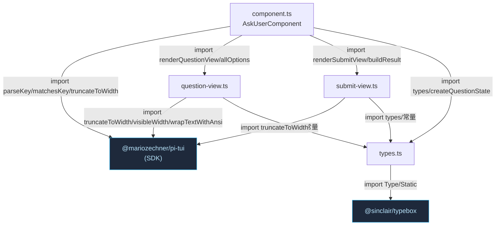
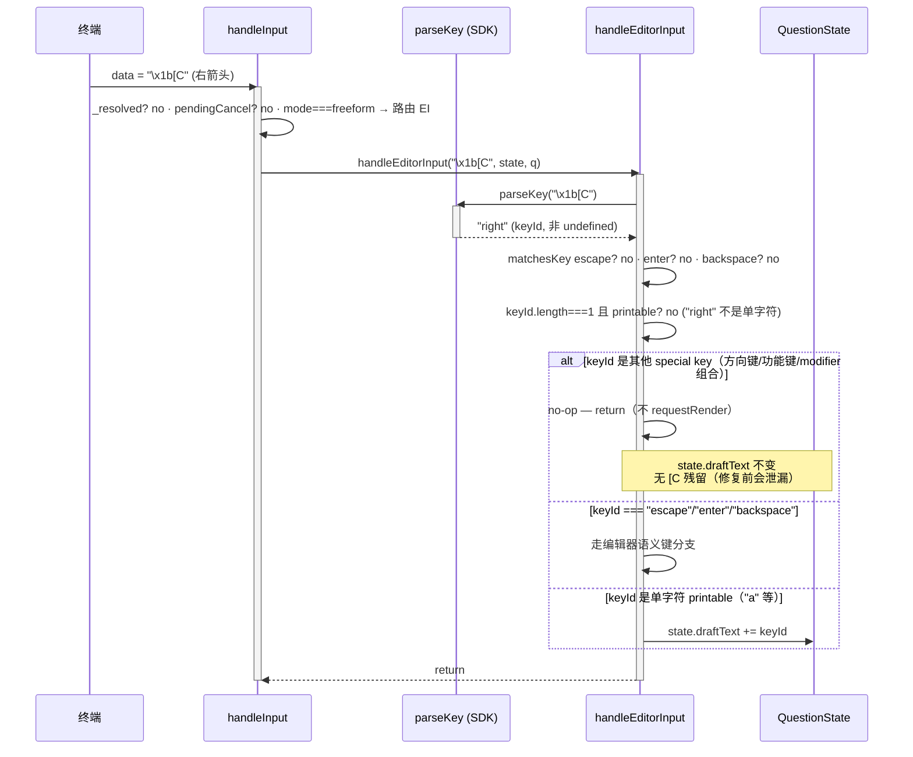
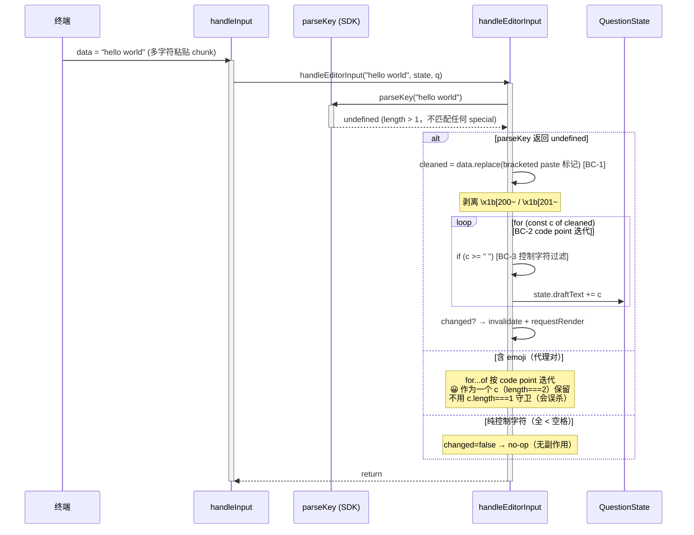
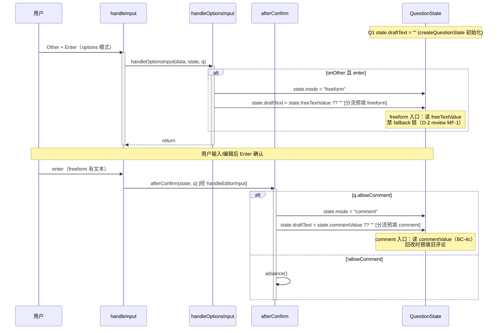

# 代码架构设计 — ask-user 键码泄漏修复 + 路由重构

> **决策账本纪律**：decisions.md D-001~D-008 status=confirmed，不当 gap 重报。特别是 D-005（复用 SDK parseKey，不自建 parse-key.ts）。
>
> **parseKey 返回语义关键修正**：实测 SDK 源码（`keys.js:1093-1096`）确认 parseKey 对单字符 ASCII printable（code 32-126）**返回该字符本身**（非 undefined）。issues.md #1 方案A 原文「parseKey 返回非 undefined 即 no-op」对单字符 printable 不成立——单字符输入 parseKey 返回 `"a"` 需追加，非 no-op。本设计在第 §3/§4 修正此描述。

## 1. 工程目录

现有 4 文件 + index.ts + validate.ts，**无新增文件**（D-005 不建 parse-key.ts）。

```
extensions/ask-user/src/
├── component.ts          # 聚合根：routeInput 分发 + handleEditorInput(parseKey 拦截) + handleOptionsInput(#3 拆分)
│                         #   变化轴：交互模式（options/freeform/comment 循环）
│                         #   依赖：→ pi-tui(parseKey/matchesKey) → question-view → submit-view → types
├── types.ts              # 数据模型 + QuestionState（+draftText 字段 #2）+ InputSchema
│                         #   变化轴：数据模型变化（本次加 draftText）
│                         #   依赖：→ typebox（无内部依赖，被所有人依赖）
├── question-view.ts      # 纯渲染：renderQuestionView/buildOptionLines/buildEditorBlock（editorText 参数链 + #4 提示行）
│                         #   变化轴：渲染样式变化
│                         #   依赖：→ pi-tui(truncateToWidth/visibleWidth/wrapTextWithAnsi) → types
├── submit-view.ts        # 纯渲染：renderSubmitView/buildResult（本次无改动）
│                         #   变化轴：渲染样式变化
│                         #   依赖：→ pi-tui(truncateToWidth) → types
├── index.ts              # 扩展工厂：registerTool + execute + ctx.ui.custom（本次无改动）
├── validate.ts           # 参数校验（本次无改动）
└── __tests__/            # 键码回归套件（#5 新增 ~30 用例）
    ├── component.test.ts  # 180 现有用例 + 新增 C-ARROW/C-KEYMAP/C-DRAFT/C-HINT/C-BC4C
    ├── fixtures.ts        # 键序列常量（UP/DOWN/RIGHT/LEFT/ENTER/ESC/BKSP/TAB + 新增 modifier 序列）
    ├── question-view.test.ts
    ├── submit-view.test.ts
    ├── types.test.ts
    ├── validate.test.ts
    ├── index.test.ts
    ├── e2e-harness.ts
    └── e2e.test.ts
```

**依赖方向**（无环）：

```
index.ts → component.ts → { question-view.ts, submit-view.ts } → types.ts
                            ↓                                    ↑
                     @mariozechner/pi-tui ─────────────────────┘(SDK，外部)
```

- component.ts 依赖 question-view/submit-view/types + pi-tui
- question-view/submit-view 只依赖 types + pi-tui（**不反向依赖 component**，消除循环依赖——types.ts 存在的理由）
- types.ts 是依赖链叶子（只依赖 typebox）

**骨架隔离**：`code-skeleton/` 放在 `.xyz-harness/fix-ask-user-arrow-leak/` 下，根 tsconfig 的 `exclude` 已含 `.xyz-harness`，骨架文件天然不进真实 src 的 typecheck。骨架用独立 `tsconfig.json`（extends worktree 根 + `exclude: []`）单独编译验证。

## 2. 包依赖图



**import 规则**：
- `types.ts` 是叶子，所有模块可依赖它，它不依赖任何内部模块（仅 typebox）
- `question-view.ts`/`submit-view.ts` 只依赖 types + pi-tui，**禁止反向依赖 component.ts**（否则循环依赖）
- `component.ts` 是聚合根，可依赖所有内部模块 + pi-tui
- pi-tui 是 SDK 纯函数依赖（parseKey/matchesKey/truncateToWidth 等），不是 port（不可替换契约，D-005）

**循环依赖检测点**：无。question-view/submit-view 不 import component，单向依赖链。

## 3. API 契约（签名表）

### 模块: component.ts

#### 类: AskUserComponent（聚合根）

| 方法 | 签名 | 返回 | 边界条件 | Spec/Issue 关联 | 接线层级 |
|------|------|------|---------|----------------|---------|
| `constructor` | `(questions: Question[], tui: TUILike, theme: ThemeLike, done: (result: Result\|null) => void)` | `void` | questions.length 1-4 | — | 模块内 |
| `render` | `(width: number): string[]` | 渲染行数组（含 box 边框） | width < BORDER_OVERHEAD → innerWidth=0 | #2（透传 state.draftText）| 模块内 |
| `handleInput` | `(data: string): void` | void | `_resolved` → return；pendingCancel → 覆盖层；mode 分发 | #3（降为纯路由，≤40 行）| 模块内 |
| `handleOptionsInput` **[NEW #3]** | `private (data: string, state: QuestionState, q: Question): void` | void | options 模式输入路由 | #3（从 handleInput 抽出）| 模块内 |
| `handleEditorInput` | `private (data: string, state: QuestionState, q: Question): void` | void | freeform/comment 模式；**开头 parseKey 拦截** | #1（parseKey 白名单）| SDK import（parseKey）|
| `handleSubmitTabInput` | `private (data: string): void` | void | Submit tab 输入路由 | —（不变）| 模块内 |
| `afterConfirm` | `private (state: QuestionState, q: Question): void` | void | allowComment → comment 模式（分流预填 #2）| #2（draftText 分流预填）| 模块内 |
| `gotoTab` | `private (target: number): void` | void | auto-confirm 后切 tab | —（不变）| 模块内 |
| `cancel` | `public (): void` | void | `_resolved` 守卫（FR-12 竞态）| —（不变）| 模块内 |

**handleEditorInput 重构伪签名**（#1 核心）：

```typescript
// [CHANGE #1] import 改为含 parseKey
import { type Component, matchesKey, parseKey, truncateToWidth } from "@mariozechner/pi-tui";

private handleEditorInput(data: string, state: QuestionState, q: Question): void {
  // [#1] parseKey 白名单拦截 — 替代旧的 matchesKey 散调 + 兜底 printable 遍历
  const keyId = parseKey(data);

  if (keyId !== undefined) {
    // parseKey 命中（special key / modifier 组合 / 单字符 printable）
    if (matchesKey(data, "escape")) { /* 编辑器语义键：comment→advance / freeform→discard */ }
    if (matchesKey(data, "enter")) { /* BC-4/BC-4b/BC-4c/comment save */ }
    if (matchesKey(data, "backspace")) { state.draftText = state.draftText.slice(0, -1); ... }

    // [关键] 单字符 printable：parseKey("a") 返回 "a"（code 32-126），追加非 no-op
    // [特判] 空格：parseKey(" ") 返回 "space"（非单字符！实测 keys.js），需显式追加
    if (matchesKey(data, "space")) { state.draftText += " "; return; }
    if (keyId.length === 1 && keyId >= " " && keyId <= "~") {
      state.draftText += keyId;  // 追加单字符
      return;
    }
    // 其他 special key（up/down/f1-f12/alt+x/ctrl+shift+right 等）→ no-op（不泄漏）
    return;
  }

  // keyId === undefined → 多字符粘贴 chunk → printable 提取（BC-1/BC-2/BC-3 保持）
  const cleaned = data.replace(/\x1b\[200~|\x1b\[201~/g, "");  // BC-1
  for (const c of cleaned) {                                     // BC-2 code point 迭代
    if (c >= " ") state.draftText += c;                          // BC-3 控制字符过滤
  }
}
```

### 模块: types.ts

#### 接口: QuestionState（#2 扩展）

| 字段 | 类型 | 不变式 | Issue 关联 |
|------|------|--------|-----------|
| `draftText` **[NEW #2]** | `string` | 进 freeform：`= freeTextValue ?? ""`；进 comment：`= commentValue ?? ""`；提交/退出后 `= ""` | #2 |

#### 函数: createQuestionState（#2 初始化）

| 函数 | 签名 | 返回 | Issue 关联 |
|------|------|------|-----------|
| `createQuestionState` | `(): QuestionState` | 含 `draftText: ""` 初始化 | #2 |

### 模块: question-view.ts

| 函数 | 签名 | 返回 | #2 改动 | #4 改动 |
|------|------|------|--------|--------|
| `renderQuestionView` | `(q, state, theme, width, isSingle, editorText: string): string[]` | 渲染行 | editorText 从 state.draftText 透传 | freeform help 行扩展 |
| `buildOptionLines` | `(q, state, theme, width, hideDescriptions, editorText=""): string[]` | 选项行 | editorText 透传 | — |
| `buildSplitPane` | `(q, state, theme, split, width, editorText=""): string[]` | 分屏行 | editorText 透传 | — |
| `buildEditorBlock` | `(theme, width, mode, editorText): string[]` | comment 编辑块 | editorText 透传 | help 行扩展为 append-only 提示 |

> `editorText` 参数名保留（渲染层纯参数，不关心来源），调用方（component.render）传 `state.draftText`。

## 4. 功能代码链路（时序图）

### 功能 1: 编辑器内按方向键 → parseKey 拦截 no-op（UC-2 主流程，#1 核心）

#### 时序图



#### 方法签名表

| 类 | 方法 | 签名 | 返回 | 边界条件 | Issue 关联 |
|----|------|------|------|---------|-----------|
| AskUserComponent | handleInput | `(data: string): void` | void | mode===freeform → 路由 handleEditorInput | #3 |
| AskUserComponent | handleEditorInput | `(data, state, q): void` | void | parseKey 返回 special 非 escape/enter/backspace → no-op | #1 |
| (SDK) | parseKey | `(data: string): string\|undefined` | keyId 或 undefined | `\x1b[C` → "right" | D-005 |

#### 数据流链
终端 → handleInput(mode 路由) → handleEditorInput → parseKey(返回 "right") → 判定非语义键非单字符 → no-op（state.draftText 不变）

#### 关联
- requirements UC-2 AC-2.1/2.2（方向键 no-op）
- issues #1 方案A（parseKey 白名单）
- BC-7（行为变更：泄漏 → no-op）

---

### 功能 2: 编辑器内粘贴多字符 → parseKey undefined → printable 提取（UC-1 替代流程）

#### 时序图



#### 方法签名表

| 类 | 方法 | 签名 | 返回 | 边界条件 | Issue 关联 |
|----|------|------|------|---------|-----------|
| AskUserComponent | handleEditorInput | `(data, state, q): void` | void | parseKey undefined → printable 提取 | #1 |
| (SDK) | parseKey | `(data: string): string\|undefined` | undefined（多字符）| length > 1 | D-005 |

#### 数据流链
终端(多字符) → handleEditorInput → parseKey(undefined) → replace(BC-1) → for...of(BC-2) → c>=" "(BC-3) → state.draftText +=

#### 关联
- requirements UC-1 AC-1.1/1.2/1.3（粘贴行为等价）
- BC-1/BC-2/BC-3（行为契约保持）
- C-PASTE-1~7（现有回归测试）

---

### 功能 3: draftText 分流预填（UC-3，#2）

#### 时序图



#### 方法签名表

| 类 | 方法 | 签名 | 返回 | 边界条件 | Issue 关联 |
|----|------|------|------|---------|-----------|
| AskUserComponent | handleOptionsInput | `(data, state, q): void` | void | onOther+enter → freeform + 分流预填 | #3 |
| AskUserComponent | afterConfirm | `(state, q): void` | void | allowComment → comment + 分流预填 | #2 |

#### 数据流链
用户(Other Enter) → handleOptionsInput → state.mode=freeform + state.draftText=freeTextValue → 编辑 → afterConfirm → state.mode=comment + state.draftText=commentValue（BC-4c）

#### 关联
- requirements UC-3 AC-3.1/3.2（draftText 跨 tab 保持）
- issues #2 方案A（分流预填，禁 fallback）
- BC-4c（comment 进预填）/BC-5（comment Esc 保留 commentValue）

## 5. Deep Module 设计决策

### 模块: component.ts（AskUserComponent 聚合根）
- **Interface**: `handleInput(data)` + `render(width)` + `cancel()`（Component 接口契约）
- **Depth**: Delete test — 删除 parseKey 拦截层，方向键直接进状态机分支 → 键码泄漏（bug 复现）。Depth 合理（输入解析是不可省的中间层）
- **Seam**: 无真 seam。pi-tui 的 parseKey/matchesKey 是 SDK 纯函数 import，非可替换 port（D-005：pi-tui 不会被替换，依赖方向不可反转）
- **Port 决策**: 无 port。ask-user 是进程内单系统，无跨系统边界（system-architecture §6 已论证）

### 模块: types.ts（QuestionState）
- **Interface**: `QuestionState` 接口 + `createQuestionState()` 工厂
- **Depth**: 薄（纯数据持有，无逻辑）。合理——状态机逻辑在 component，types 只管数据形状
- **draftText 归属**: 从 component 私有字段迁入 QuestionState（#2）。不变式从「组件级 editorText 进入编辑器时重赋值」变「state.draftText 进入编辑器时重赋值」——归属归位，每问题独立

## 6. 测试矩阵（Test Matrix）

> **来源 0（项目已有测试）**：先读 `__tests__/component.test.ts`（180 用例）+ `fixtures.ts`（键序列常量）复用。
> 现有覆盖：C-1~C-44（单/多问题导航、选择、toggle、freeform、comment、防重入、渲染缓存）+ C-PASTE-1~7（多字符粘贴回归）+ C-NEW-1~6 + C-E1~6 + C-S1/S3/S12 + C-FR12/b + C-REG-R6。
> 新增用例标 `C-ARROW`/`C-KEYMAP`/`C-DRAFT`/`C-HINT`/`C-BC4C`，沿用 fixtures.ts 的 make() helper + mockTui/stubTheme。

### 来源 A：功能用例（按 UC 归类）

#### UC-2: 编辑器按方向键/功能键（关联 §4 时序图 1）

| 用例 ID | 类型 | 测试层 | 场景 | 输入 | 预期 | 关联 AC | dependsOn | parallelGroup |
|---------|------|--------|------|------|------|---------|-----------|---------------|
| C-ARROW-1 | 正常 | unit | 连按 3 次右箭头 | freeform 打开后 ×3 RIGHT | draftText 不含 `[`/`C`，保持 "" | AC-1.1 | #1 | key-leak |
| C-ARROW-2 | 正常 | unit | 4 方向键夹输入 a/b | DOWN→RIGHT→"a"→UP→LEFT→"b" | draftText === "ab" | AC-1.2 | #1 | key-leak |
| C-KEYMAP-UP | 边界 | unit | no-op 集合遍历：up | freeform 后 UP | draftText 不变 | AC-1.3 | #1 | key-leak |
| C-KEYMAP-DOWN | 边界 | unit | no-op 集合遍历：down | freeform 后 DOWN | draftText 不变 | AC-1.3 | #1 | key-leak |
| C-KEYMAP-LEFT | 边界 | unit | no-op 集合遍历：left | freeform 后 LEFT | draftText 不变 | AC-1.3 | #1 | key-leak |
| C-KEYMAP-HOME | 边界 | unit | no-op：home | freeform 后 `\x1b[H` | draftText 不变 | AC-1.3 | #1 | key-leak |
| C-KEYMAP-END | 边界 | unit | no-op：end | freeform 后 `\x1b[F` | draftText 不变 | AC-1.3 | #1 | key-leak |
| C-KEYMAP-INSERT | 边界 | unit | no-op：insert | freeform 后 `\x1b[2~` | draftText 不变 | AC-1.3 | #1 | key-leak |
| C-KEYMAP-PGUP | 边界 | unit | no-op：pageUp | freeform 后 `\x1b[5~` | draftText 不变 | AC-1.3 | #1 | key-leak |
| C-KEYMAP-PGDN | 边界 | unit | no-op：pageDown | freeform 后 `\x1b[6~` | draftText 不变 | AC-1.3 | #1 | key-leak |
| C-KEYMAP-F1 | 边界 | unit | no-op：f1 | freeform 后 `\x1bOP` | draftText 不变 | AC-1.3 | #1 | key-leak |
| C-KEYMAP-DELETE | 边界 | unit | no-op：delete（非 backspace） | freeform 后 `\x1b[3~` | draftText 不变（delete ≠ backspace 语义）| AC-1.3 | #1 | key-leak |
| C-KEYMAP-SPACE | 正常 | unit | 单字符空格输入追加 | freeform 后单字符 `" "` | draftText 含空格（parseKey(" ")="space" 特判）| AC-1.1 | #1 | key-leak |
| C-KEYMAP-MOD | 边界 | unit | modifier 采样矩阵（18 用例）| ctrl/alt/shift/super × {up/down/left/right} + 2-mod 组合 × {up/down} | 每条 draftText 不泄漏 modifier 后可见字符 | AC-1.4 | #1 | key-leak |

> C-KEYMAP-MOD 18 用例细分：ctrl+up/down/left/right（4）、alt+up/down/left/right（4）、shift+up/down/left/right（4）、super+up/down/left/right（4）、ctrl+shift+up/down（2）。每条独立断言 parseKey 返回带 modifier 的 keyId → no-op。

#### UC-1: 编辑器输入文本（关联 §4 时序图 2，现有回归）

| 用例 ID | 类型 | 测试层 | 场景 | 输入 | 预期 | 关联 AC | dependsOn | parallelGroup |
|---------|------|--------|------|------|------|---------|-----------|---------------|
| C-PASTE-1 | 正常 | unit | 多字符 chunk 完整捕获 | "hello world" 一次 | draftText 含全文本 | AC-1.5 | #1 | paste |
| C-PASTE-2 | 边界 | unit | emoji 代理对保留 | "fix the 🐛 bug" | emoji 不丢 | AC-1.5 | #1 | paste |
| C-PASTE-3 | 边界 | unit | 控制字符过滤 | "ab\tcd" | draftText === "abcd" | AC-1.5 | #1 | paste |
| C-PASTE-4 | 边界 | unit | 空输入 no-op | "" | 无副作用 | AC-1.5 | #1 | paste |
| C-PASTE-5 | 正常 | unit | 单字符 backward-compat | "x" | draftText === "x" | AC-1.5 | #1 | paste |
| C-PASTE-6 | 边界 | unit | bracketed paste 剥离 | `\x1b[200~hello\x1b[201~` | draftText === "hello" | AC-1.5 | #1 | paste |
| C-PASTE-7 | 边界 | unit | bracketed paste 跨 chunk | 两 chunk 各带标记 | 每块独立剥离 | AC-1.5 | #1 | paste |

> C-PASTE-1~7 是现有用例（已在 component.test.ts），refactor 后必须全绿（行为等价）。单字符 C-PASTE-5 特别验证 parseKey 对 "x" 返回 "x" → 走单字符追加分支（非 no-op）。

#### UC-3: 跨问题切换保持草稿（关联 §4 时序图 3）

| 用例 ID | 类型 | 测试层 | 场景 | 输入 | 预期 | 关联 AC | dependsOn | parallelGroup |
|---------|------|--------|------|------|------|---------|-----------|---------------|
| C-DRAFT-1 | 正常 | unit | Q1 freeform 草稿 + 切走再回来 | Q1 输 "abc" → Esc → 回 Q1 重进 freeform | draftText 恢复 "abc"（state.draftText 持久）| AC-2.1 | #2 | draft |
| C-DRAFT-2 | 边界 | unit | Q1/Q3 各有草稿互相独立 | Q1 输 "a"、Q3 输 "c"，互切 | 两草稿不污染 | AC-2.2 | #2 | draft |
| C-BC4C | 回归 | unit | comment 回改预填 | 答题+评论 → 回改重进 comment | comment 编辑器预填旧评论（新增补盲区）| AC-2.4 | #2 | draft |
| C-BC4B | 回归 | unit | freeform Enter 清 selectedIndex | 单选先选 opt0 → Other 输文本 → Enter | state.selectedIndex === null（BC-4b 不残留）| AC-2.3 | #2 | draft |

#### UC-4: 编辑器操作提示行（#4）

| 用例 ID | 类型 | 测试层 | 场景 | 输入 | 预期 | 关联 AC | dependsOn | parallelGroup |
|---------|------|--------|------|------|------|---------|-----------|---------------|
| C-HINT-1 | 正常 | unit | freeform 提示行 | freeform 打开后 render | 含 "Backspace deletes" | AC-4.1 | #2,#4 | hint |
| C-HINT-2 | 正常 | unit | comment 提示行 | comment 打开后 render | 含 "Backspace deletes" | AC-4.2 | #2,#4 | hint |

#### UC-X: handleInput 拆分回归（#3，纯移动）

| 用例 ID | 类型 | 测试层 | 场景 | 输入 | 预期 | 关联 AC | dependsOn | parallelGroup |
|---------|------|--------|------|------|------|---------|-----------|---------------|
| C-REG-ALL | 回归 | unit | 现有 180 用例全绿 | 全量 component.test.ts | refactor 后无回归 | AC-3.2 | #3 | regression |

### 来源 B：NFR 风险→用例映射表

{NFR_SOURCE_B: 本主题 NFR 风险全部落在功能行为上（ask-user 是进程内 TUI 组件，无并发/安全/可观测独立维度）。nfr 回灌表 8 条「代码测试」缓解项与来源 A 完全重叠：C-PASTE-1~7（BC-1/2/3 保持 + 单字符追加）、C-ARROW/C-KEYMAP（special no-op）、C-DRAFT/C-BC4C（分流预填）、AC-2.5/AC-3.1（反模式检查）。2 条「骨架约束」项（draftText 初始化、无 this.editorText 残留）已由骨架 tsc 验证 + AC-2.5 grep 验收。无 perf-chaos 项（无 SLA/吞吐需求）}

> nfr 还在并行产出，主 agent Step 3 补。本设计无并发/安全/可观测维度的 NFR 风险（ask-user 是进程内 TUI 组件，无网络/DB/鉴权），但 placeholder 保留以衔接主 agent。

### 覆盖完整性自检
- [x] UC-2 正常（C-ARROW-1/2）+ 边界（C-KEYMAP-*）+ modifier（C-KEYMAP-MOD）齐全
- [x] UC-1 正常（C-PASTE-1/5）+ 边界（C-PASTE-2/3/4/6/7）齐全（现有回归）
- [x] UC-3 正常（C-DRAFT-1）+ 边界（C-DRAFT-2）+ 回归（C-BC4C）齐全
- [x] UC-4 正常（C-HINT-1/2）齐全
- [x] §4 时序图每个 alt/else 映射到异常用例（时序图1 special/单字符/语义键 → C-ARROW/C-KEYMAP；时序图2 undefined/emoji/控制字符 → C-PASTE；时序图3 分流预填/回改 → C-DRAFT/C-BC4C）
- [x] 每条标测试层（全 unit——ask-user 无集成环境依赖，mock pi-tui 纯函数即可验全部逻辑）
- [x] 来源 A 每条标 dependsOn（#1/#2/#3/#4）+ parallelGroup（key-leak/paste/draft/hint/regression）
- [x] 来源 B 已对齐（与来源 A 重叠，见 §6 来源 B 说明）

## 7. 现有代码映射（refactor 场景）

| 新设计模块 | 现有代码 | 处置 | 行为等价测试要点 |
|-----------|---------|------|----------------|
| component.ts `handleEditorInput` | 现有 handleEditorInput（matchesKey 散调 + 兜底 printable 遍历）| **refactor**（#1 parseKey 白名单替代） | C-ARROW/C-KEYMAP 负向 + C-PASTE 正向，方向键从泄漏变 no-op（BC-7 目标变更） |
| component.ts `handleInput` | 现有 handleInput（~80 行 god-method）| **split**（#3 抽 handleOptionsInput） | C-REG-ALL 现有 180 用例全绿（纯移动） |
| component.ts `editorText` 字段 | 现有 `private editorText: string` | **delete + migrate**（#2 → state.draftText） | C-DRAFT/C-BC4C + C-REG-ALL（AC-2 反模式：grep 无 this.editorText） |
| types.ts `QuestionState` | 现有 QuestionState（无 draftText）| **extend**（#2 加 draftText） | createQuestionState 初始化 "" |
| question-view.ts `renderQuestionView` 等 | 现有（editorText 参数）| **keep param**（透传 state.draftText）| editorText 参数名保留，调用方传 state.draftText |
| question-view.ts `buildEditorBlock`/help 行 | 现有（"Enter submit · Esc back"）| **extend**（#4 加 append-only 提示） | C-HINT-1/2 |
| submit-view.ts | 现有 | **keep**（无改动） | — |
| `__tests__/component.test.ts` | 现有 180 用例 | **extend**（+C-ARROW/C-KEYMAP/C-DRAFT/C-HINT/C-BC4C ~30 用例） | #5 |
| `parse-key.ts` | —（不存在）| **N/A**（D-005 不新建） | AC-3 反模式：ls 无此文件 |

## 8. 下游衔接

### 喂给 Step 6（执行计划）

| 时序图 | 对应 Wave | 依赖的其他时序图 |
|--------|----------|----------------|
| 时序图 1（方向键 parseKey 拦截）| Wave 1（#1 P0） | 无 |
| 时序图 2（多字符粘贴 printable 提取）| Wave 1（#1 P0，与时序图1同方法体） | 时序图 1 |
| 时序图 3（draftText 分流预填）| Wave 2（#2 P1，依赖 #1 完成） | 时序图 1/2（#1 先改 handleEditorInput 签名） |

**Wave 编排建议**（供 execution-plan 参考）：
- Wave 1: #1（parseKey 拦截）+ #5 测试套件骨架（C-ARROW/C-KEYMAP/C-KEYMAP-MOD 负向用例，验证 #1 修复）
- Wave 2: #2（draftText 迁移，依赖 #1 的 handleEditorInput 签名已定）+ #3（handleInput 拆分，搭便车，依赖 #2 的 state.draftText）+ #4（提示行，依赖 #2 的渲染参数链）
- Wave 3: #5 正向回归（C-DRAFT/C-HINT/C-BC4C + 现有 180 全绿验证）

## 9. 骨架覆盖核验（MANDATORY）— 双向

> 骨架位于 `.xyz-harness/fix-ask-user-arrow-leak/code-skeleton/`，独立 tsconfig 编译通过（`npx tsc --noEmit -p tsconfig.json` exit 0）。
> 验证项：parseKey import 真实可达（SDK 路径解析）、QuestionState.draftText 字段加入后签名自洽、handleEditorInput 三态路由接线、handleInput→handleOptionsInput 拆分接线、render 透传 state.draftText。

| §3 方法（模块.类.方法） | 骨架定义位置（文件:行） | 接线状态 | 备注 |
|------------------------|------------------------|---------|------|
| component.AskUserComponent.constructor | code-skeleton/component.ts:62 | ✅ 接线完整 | createQuestionState() 初始化 states |
| component.AskUserComponent.render | code-skeleton/component.ts:107 | ✅ 接线(model+view) | 透传 state.draftText 到 renderQuestionView |
| component.AskUserComponent.handleInput | code-skeleton/component.ts:172 | ✅ 接线完整 | 纯路由，分发到三个 handler（#3 拆分后） |
| component.AskUserComponent.handleOptionsInput | code-skeleton/component.ts:207 | ✅ 签名(叶子throw) | [#3 NEW] 从 handleInput 抽出，骨架 throw 占位 |
| component.AskUserComponent.handleEditorInput | code-skeleton/component.ts:226 | ✅ 接线(SDK parseKey) | [#1 核心] parseKey 三态路由接线 + 单字符/special/undefined 分支 |
| component.AskUserComponent.handleSubmitTabInput | code-skeleton/component.ts:219 | ✅ 签名(叶子throw) | 保持不变，骨架 throw |
| component.AskUserComponent.afterConfirm | code-skeleton/component.ts:324 | ✅ 接线完整 | [#2] 分流预填 state.draftText = commentValue ?? "" |
| component.AskUserComponent.gotoTab | code-skeleton/component.ts:307 | ✅ 接线完整 | autoConfirmIfAnswered + invalidate+render |
| component.AskUserComponent.cancel | code-skeleton/component.ts:351 | ✅ 接线完整 | _resolved 守卫（BC-6） |
| types.QuestionState.draftText | code-skeleton/types.ts:76 | ✅ 签名(字段) | [#2 NEW] draftText: string |
| types.createQuestionState | code-skeleton/types.ts:84 | ✅ 接线完整 | draftText: "" 初始化 |
| question-view.renderQuestionView | code-skeleton/question-view.ts:109 | ✅ 签名(叶子throw) | editorText 参数保留（透传 state.draftText） |
| question-view.buildOptionLines | code-skeleton/question-view.ts:67 | ✅ 签名(叶子throw) | editorText 参数保留 |
| question-view.buildEditorBlock | code-skeleton/question-view.ts:92 | ✅ 签名(叶子throw) | [#4] help 行扩展位置标注 |
| question-view.buildSplitPane | code-skeleton/question-view.ts:101 | ✅ 签名(叶子throw) | editorText 参数保留 |
| submit-view.renderSubmitView | code-skeleton/submit-view.ts:18 | ✅ 签名(叶子throw) | 无改动 |
| submit-view.buildResult | code-skeleton/submit-view.ts:27 | ✅ 签名(叶子throw) | 无改动 |
| (SDK) parseKey | @mariozechner/pi-tui（外部）| ✅ adapter 真引SDK | tsc 验 import 可达（keys.d.ts:166 导出） |
| (SDK) matchesKey | @mariozechner/pi-tui（外部）| ✅ adapter 真引SDK | tsc 验 import 可达（keys.d.ts:165 导出） |

**接线状态说明**：
- `✅ 接线完整` — 方法体真实接线下游（`this.x.foo()` / `state.draftText = ...`），tsc 实证调用链
- `✅ 签名(叶子throw)` — 纯移动/无改动方法，骨架 `throw new Error("SKELETON...")` 占位（实现属 ⑥Wave）
- `✅ adapter 真引SDK` — parseKey/matchesKey 真引 `@mariozechner/pi-tui`，tsc 对 SDK 路径验签（Tier 2 证伪通过）

**覆盖完整性自检**：
- [x] §3 签名表每个公开/private 方法在本表有对应行（无遗漏）
- [x] 无 `❌ 未定义`（终稿硬阻断）
- [x] 接线状态标注准确（handleEditorInput 标 SDK 接线，handleOptionsInput 标叶子throw，render 标 model+view 接线）
- [x] 骨架 `npx tsc --noEmit -p tsconfig.json` exit 0（编译通过）
- [x] 反模式检查：AC-2（无 `this.editorText` 代码行）、AC-3（无 parse-key.ts）、AC-1（parseKey import 计数=1）
- [x] god object 检查：component.ts 骨架 360 行（≤600 阈值）
- [x] Level 1 接线密度：component.ts 含 63 处 `this.` 真实调用（非 Level 0 全 throw）
