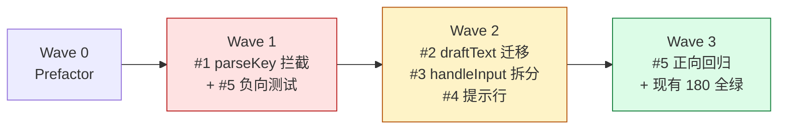

# 执行计划 — ask-user 键码泄漏修复 + 路由重构

## Wave 编排总览

## Wave 0: Prefactor

> 无需 Prefactor。现有代码无阻碍 #1 的前置重构项。handleEditorInput 可直接改造（parseKey 拦截加在方法开头，不改签名）。

## Wave 1: parseKey 编辑器拦截（P0 核心）+ 负向回归测试

**目标**: 修复方向键/功能键泄漏（核心 bug），同时建立负向回归防线。
**Issues**: #1（P0）+ #5 部分（C-ARROW/C-KEYMAP/C-KEYMAP-MOD）
**Blocked by**: 无
**关联时序图**: code-architecture §4 时序图 1（parseKey 拦截）+ 时序图 2（多字符 printable 提取）

### 改动

- `component.ts`:
  - import 改为 `import { type Component, matchesKey, parseKey, truncateToWidth } from "@mariozechner/pi-tui"`
  - `handleEditorInput` 开头加 parseKey 四态路由：escape/enter/backspace（语义键分支）/ 单字符 printable（追加 keyId）/ 其他 special（no-op）/ undefined（printable 提取，保留 BC-1/BC-2/BC-3）
  - 此 Wave **保留 `private editorText` 字段**（draftText 迁移在 Wave 2），parseKey 路由读写 `this.editorText`
- `__tests__/fixtures.ts`: 新增 modifier 键序列常量（CTRL_UP/ALT_RIGHT/SHIFT_DOWN 等）
- `__tests__/component.test.ts`: 新增 C-ARROW-1/2 + C-KEYMAP-*（no-op 集合遍历）+ C-KEYMAP-MOD（18 modifier 用例）

### 测试验收（本 Wave）

| 用例 ID | 测试层 | 场景 | dependsOn | parallelGroup |
|---------|--------|------|-----------|---------------|
| C-ARROW-1 | unit | 连按 3 次右箭头不泄漏 | — | key-leak |
| C-ARROW-2 | unit | 4 方向键夹输入 a/b === "ab" | — | key-leak |
| C-KEYMAP-UP/DOWN/LEFT/HOME/END/INSERT/PGUP/PGDN/F1/DELETE | unit | no-op 集合遍历 | — | key-leak |
| C-KEYMAP-SPACE | unit | 单字符空格输入追加（parseKey特判）| — | key-leak |
| C-KEYMAP-MOD | unit | modifier 采样矩阵（18 用例）| — | key-leak |
| C-PASTE-1~7 | unit | 现有粘贴回归全绿（BC-1/2/3 + 单字符追加）| — | paste |

### 验收门

- C-ARROW/C-KEYMAP/C-KEYMAP-MOD 全绿（负向回归建立）
- C-PASTE-1~7 全绿（行为等价，parseKey 四态路由不破坏粘贴）
- 现有 180 测试全绿

## Wave 2: draftText 迁移 + handleInput 拆分 + 提示行

**目标**: editorText 归位（G3）+ handleInput 拆分（G2）+ UX 提示（G4）。
**Issues**: #2（draftText 迁移，先 commit）→ #3（handleInput 拆分，搭 #2 便车）+ #4（提示行，搭 #2 便车）
**内部顺序**: #2 commit 后 #3/#4 可并行（#3 依赖 #2 的 state.draftText，#4 依赖 #2 的渲染参数链）
**Blocked by**: Wave 1（依赖 #1 的 handleEditorInput parseKey 路由已稳定）
**关联时序图**: code-architecture §4 时序图 3（draftText 分流预填）

### 改动

- `types.ts`: QuestionState 加 `draftText: string`，createQuestionState() 初始化 `draftText: ""`
- `component.ts`:
  - **#2**: 移除 `private editorText` 字段，所有 `this.editorText` → `state.draftText`。分流预填：freeform 入口 `state.draftText = state.freeTextValue ?? ""`，comment 入口（afterConfirm）`state.draftText = state.commentValue ?? ""`（禁 fallback 链 D-2）
  - **#3**: 抽 `handleOptionsInput(data, state, q)`（options 模式的方向键/Esc/tab-nav/Enter/space），handleInput 降为纯路由（≤40 行）
  - render() 透传 `state.draftText` 到 renderQuestionView
- `question-view.ts`:
  - **#2**: renderQuestionView/buildOptionLines/buildSplitPane/buildEditorBlock 的 editorText 参数从 state.draftText 传入（参数名保留）
  - **#4**: freeform help 行 + comment buildEditorBlock help 行扩展为 `Type to add · Backspace deletes · Enter submit · Esc back`
- `__tests__/component.test.ts`: 新增 C-DRAFT-1/2 + C-BC4C（comment 回改预填）+ C-BC4B（freeform Enter 清 selectedIndex）+ C-HINT-1/2

### 测试验收（本 Wave）

| 用例 ID | 测试层 | 场景 | dependsOn | parallelGroup |
|---------|--------|------|-----------|---------------|
| C-DRAFT-1 | unit | Q1 freeform 草稿 + 切走再回来恢复 | C-ARROW-1 | draft |
| C-DRAFT-2 | unit | Q1/Q3 草稿互相独立 | C-ARROW-1 | draft |
| C-BC4C | unit | comment 回改预填旧评论（补盲区）| C-DRAFT-1 | draft |
| C-BC4B | unit | freeform Enter 清 selectedIndex（BC-4b）| C-DRAFT-1 | draft |
| C-HINT-1 | unit | freeform 提示行含 Backspace deletes | — | hint |
| C-HINT-2 | unit | comment 提示行含 Backspace deletes | — | hint |

### 验收门

- AC-2.5 反模式：`grep "private editorText\|this\.editorText" component.ts` 无输出
- AC-3.1：handleInput ≤ 40 行（`sed -n` 去空行注释统计）
- C-DRAFT/C-BC4C/C-BC4B/C-HINT 全绿
- 现有 180 测试全绿（draftText 迁移行为等价 + handleInput 拆分纯移动）

## Wave 3: 正向回归 + 全量验证

**目标**: 确认所有改动后整体无回归。
**Issues**: #5（P1，正向回归收尾）
**Blocked by**: Wave 2

### 改动

- 无新代码改动，仅全量测试验证 + 反模式检查

### 测试验收（本 Wave）

| 用例 ID | 测试层 | 场景 | dependsOn | parallelGroup |
|---------|--------|------|-----------|---------------|
| C-REG-ALL | unit | 现有 180 用例全绿 | Wave 1+2 | regression |
| C-ARROW/C-KEYMAP/C-KEYMAP-MOD | unit | Wave 1 负向用例复跑 | — | key-leak |
| C-PASTE-1~7 | unit | 粘贴回归复跑 | — | paste |
| C-DRAFT/C-BC4C/C-BC4B/C-HINT | unit | Wave 2 用例复跑 | — | draft/hint |
| C-KEYMAP-SPACE | unit | Wave 1 用例复跑 | — | key-leak |

### 反模式检查（全量）

- AC-1: `grep -c "import.*parseKey.*pi-tui" component.ts` === 1
- AC-2: `grep "private editorText\|this\.editorText" component.ts` 无输出
- AC-3: `ls parse-key.ts` 无文件
- AC-4: handleInput ≤ 40 行
- typecheck: `pnpm --filter @zhushanwen/pi-ask-user typecheck` 零错误
- lint: `pnpm --filter @zhushanwen/pi-ask-user lint` 零错误

### 验收门

- 全量测试（180 现有 + ~30 新增）全绿
- 4 项反模式检查全过
- typecheck + lint 零错误

## 测试验收清单（全量，按 Wave 归属）

| 用例 ID | 测试层 | Wave | 场景 | dependsOn | parallelGroup |
|---------|--------|------|------|-----------|---------------|
| C-ARROW-1 | unit | W1 | 连按 3 右箭头不泄漏 | — | key-leak |
| C-ARROW-2 | unit | W1 | 4 方向键夹 a/b === "ab" | — | key-leak |
| C-KEYMAP-UP | unit | W1 | no-op: up | — | key-leak |
| C-KEYMAP-DOWN | unit | W1 | no-op: down | — | key-leak |
| C-KEYMAP-LEFT | unit | W1 | no-op: left | — | key-leak |
| C-KEYMAP-HOME | unit | W1 | no-op: home | — | key-leak |
| C-KEYMAP-END | unit | W1 | no-op: end | — | key-leak |
| C-KEYMAP-INSERT | unit | W1 | no-op: insert | — | key-leak |
| C-KEYMAP-PGUP | unit | W1 | no-op: pageUp | — | key-leak |
| C-KEYMAP-PGDN | unit | W1 | no-op: pageDown | — | key-leak |
| C-KEYMAP-F1 | unit | W1 | no-op: f1 | — | key-leak |
| C-KEYMAP-DELETE | unit | W1 | no-op: delete（≠backspace）| — | key-leak |
| C-KEYMAP-SPACE | unit | W1 | 单字符空格输入追加（parseKey特判）| — | key-leak |
| C-KEYMAP-MOD | unit | W1 | modifier 采样矩阵 18 用例 | — | key-leak |
| C-PASTE-1 | unit | W1 | 多字符 chunk 完整捕获 | — | paste |
| C-PASTE-2 | unit | W1 | emoji 代理对保留 | — | paste |
| C-PASTE-3 | unit | W1 | 控制字符过滤 | — | paste |
| C-PASTE-4 | unit | W1 | 空输入 no-op | — | paste |
| C-PASTE-5 | unit | W1 | 单字符追加（parseKey 行为）| — | paste |
| C-PASTE-6 | unit | W1 | bracketed paste 剥离 | — | paste |
| C-PASTE-7 | unit | W1 | bracketed paste 跨 chunk | — | paste |
| C-DRAFT-1 | unit | W2 | Q1 草稿切走再回来恢复 | C-ARROW-1 | draft |
| C-DRAFT-2 | unit | W2 | Q1/Q3 草稿独立 | C-ARROW-1 | draft |
| C-BC4C | unit | W2 | comment 回改预填 | C-DRAFT-1 | draft |
| C-BC4B | unit | W2 | freeform Enter 清 selectedIndex（BC-4b）| C-DRAFT-1 | draft |
| C-HINT-1 | unit | W2 | freeform 提示行 | #2,#4 | hint |
| C-HINT-2 | unit | W2 | comment 提示行 | #2,#4 | hint |
| C-REG-ALL | unit | W3 | 现有 180 全绿 | W1+W2 | regression |
| C-KEYMAP-SPACE | unit | W3 | 空格追加复跑 | — | key-leak |
| C-BC4B | unit | W3 | Wave 2 用例复跑 | W2 | draft |

## 风险与回滚

- **Wave 1 parseKey 四态路由**：若 parseKey 对某键种返回意外值（如 bare printable 边界），C-PASTE-5（单字符）+ C-ARROW（special）会捕获。回滚：恢复 matchesKey 散调 + 兜底遍历。
- **Wave 2 draftText 迁移**：分流预填若漏改某处 editorText，AC-2.5 grep 兜底。回滚：editorText 字段恢复（git revert Wave 2 commit）。
- **Wave 2 handleInput 拆分**：纯移动，C-REG-ALL 180 测试兜底。任何因拆分引入的行为差异说明越界。

## 后续迭代（P3，不在本次 Wave）

- #6 bracketed paste 跨 chunk 拆分完美处理 — 边角情况，留待后续
- #7 选项 label 含逗号多选歧义 — 边角情况，留待后续
- #8 handleSubmitTabInput Tab 消费运行验证 — 留待运行时确认
