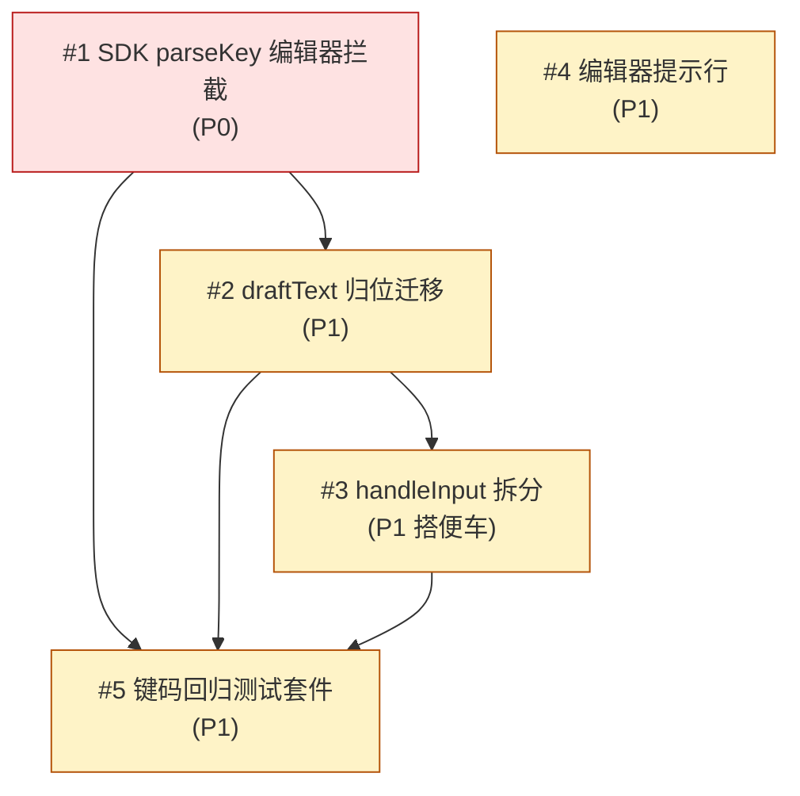

# Issue 决策图 — ask-user 键码泄漏修复 + 路由重构

## 地图总览

## 上游覆盖核验（MANDATORY，逐条不漏）

| 上游元素 | 轴 | 对应 issue | 状态 | N/A 理由（状态=N/A 时必填）|
|---------|----|-----------|------|---------------------------|
| §5: mode 状态机（options/freeform/comment 循环） | 状态 | — | N/A | mode 状态机不变，无转换需新增/修改 |
| §5: _resolved 终态守卫 | 状态 | — | N/A | BC-6 保持不动，无改动 |
| §7: component.ts（routeInput + parseKey 调用） | 模块 | #1 | ✅ 已覆盖 | — |
| §7: component.ts（handleInput 拆分） | 模块 | #3 | ✅ 已覆盖 | — |
| §7: question-view.ts（draftText 参数链 + 提示行） | 模块 | #2, #4 | ✅ 已覆盖 | — |
| §7: types.ts（draftText 字段） | 模块 | #2 | ✅ 已覆盖 | — |
| §7: __tests__（键码回归套件） | 模块 | #5 | ✅ 已覆盖 | — |
| §8: pi-tui 依赖边界 | 边界 | #1 | ✅ 已覆盖 | parseKey import 即边界消费 |
| §8: Pi Runtime 边界 | 边界 | — | N/A | ctx.ui.custom/registerTool 不变 |
| §10 D-1: parseKey 来源 | 挑战 | #1 | ✅ 已覆盖 | D-005 已决 SDK 复用 |
| §10 D-2: draftText 分流预填 | 挑战 | #2 | ✅ 已覆盖 | — |
| §10 D-3: handleInput 拆分 | 挑战 | #3 | ✅ 已覆盖 | — |
| §11 AC-1: parseKey 路由 | 挑战 | #1 | ✅ 已覆盖 | — |
| §11 AC-2: editorText 消除 | 挑战 | #2 | ✅ 已覆盖 | — |
| §11 AC-3: 不新建 parse-key.ts | 挑战 | #1 | ✅ 已覆盖 | — |
| §11 AC-4: handleInput 行数 | 挑战 | #3 | ✅ 已覆盖 | — |
| §12 BC-1: bracketed paste 剥离 | 挑战 | #1 | ✅ 已覆盖 | 迁移到 printable 提取分支 |
| §12 BC-2: code point 迭代 | 挑战 | #1 | ✅ 已覆盖 | 迁移到 printable 提取分支 |
| §12 BC-3: 控制字符过滤 | 挑战 | #1 | ✅ 已覆盖 | 迁移到 printable 提取分支 |
| §12 BC-4: freeform 空 Enter 逻辑 | 挑战 | #2 | ✅ 已覆盖 | draftText 迁移时保持 |
| §12 BC-4b: freeform Enter 清 selectedIndex | 挑战 | #2 | ✅ 已覆盖 | 同分支保持 |
| §12 BC-4c: comment 进入预填 | 挑战 | #2 | ✅ 已覆盖 | 分流预填 |
| §12 BC-5: comment Esc 保留 | 挑战 | #2 | ✅ 已覆盖 | draftText 迁移时保持 |
| §12 BC-6: _resolved 守卫 | 挑战 | — | N/A | 保持不动 |
| §12 BC-7: 方向键泄漏→no-op（目标变更） | 挑战 | #1 | ✅ 已覆盖 | #1 的核心目标 |
| §6: 分层架构（routeInput + handleEditorInput + parseKey 集成） | 模块 | #1 | ✅ 已覆盖 | — |
| §9: 泳道图（parseKey→special no-op 序列） | 流程 | #1 | ✅ 已覆盖 | — |

## P0 Issues（阻塞项，必须先做）

### #1: SDK parseKey 编辑器拦截（核心 bug 修复）

**P 级**: P0
**类型**: 模块
**Blocked by**: 无
**推荐强度**: Strong

#### 问题描述

`handleEditorInput`（component.ts）缺失输入解析层。方向键 `\x1b[C` 不匹配 escape/enter/backspace，落入 printable 分支 `for (const c of cleaned)`，`\x1b` 被 `c >= " "` 滤掉，但 `[` 和 `C` 追加进 editorText → 泄漏成 `[C` 文本。关联 system-architecture §10 D-1（D-005 已决 SDK 复用）、§11 AC-1/AC-3、§12 BC-1/BC-2/BC-3/BC-7。

#### 为什么是这个 P 级

- **P0**：不做它，方向键/功能键泄漏 bug 仍在，后续 draftText 迁移（#2）和测试套件（#5）都失去意义——没有 #1，#5 的回归测试会直接红。

#### 方案对比

##### 方案 A: 复用 SDK parseKey（推荐，D-005）

**改动**:
- 模块: `component.ts` `handleEditorInput` 开头加 `const keyId = parseKey(data); if (keyId !== undefined) { if (matchesKey escape/enter/backspace) 各自分支; else return no-op; }`，import 改为 `import { matchesKey, parseKey } from "@mariozechner/pi-tui"`。printable 提取分支保留（bracketed paste 剥离 + code point 迭代 + `c >= " "` 过滤，对应 BC-1/BC-2/BC-3），只在 parseKey 返回 undefined 时进入。
- 模型: 无新类型（不建 KeyPressedEvent）
- 流程: parseKey 返回非 undefined（命中 special/modifier/bare printable 单字符）→ 拦截；返回 undefined（多字符粘贴 chunk）→ printable 提取

**优点**: 复用 SDK 已有的全协议解析（legacy/Kitty/modifyOtherKeys + modifier 组合），modifier 覆盖免费获得（D-002 要求自动满足）。改动面最小（~4 行核心逻辑）。
**缺点**: 依赖 SDK parseKey 的返回语义稳定（keyId 字符串 vs undefined）。需确认 parseKey 对 bare printable 单字符的返回行为。
**适用场景**: SDK 提供稳定 parseKey 时（已验证 D-005）。

##### 方案 B: 自建 parse-key.ts + KeyPressedEvent 判别联合

**改动**:
- 架构: 新建 `parse-key.ts`（~60 LOC）+ KeyPressedEvent 判别联合类型
- 模块: component 调用自建 parseKey
- 流程: 自建枚举 matchesKey 全部 special + modifier 组合

**优点**: 完全自控解析逻辑。
**缺点**: 复造 SDK 轮子（review 两路独立验证，[CROSS-VALIDATED]）；违反 §7「不得自己解析终端转义序列」；modifier 组合枚举爆炸（18 special × 4 modifier × 组合）；维护终端协议兼容的长期负担。
**适用场景**: SDK 无 parseKey 时（本场景不适用）。

#### 取舍决策

**选择**: 方案 A（复用 SDK parseKey）
**理由**: D-005 已 ask_user 确认。SDK parseKey 覆盖面比手写更全（三套终端协议），长期合理性最高。自建是技术债。

**放弃方案的理由**:
- 方案 B: 复造轮子 + 违反约束，review 已否定。

#### 验收标准

- [ ] AC-1.1 [正常]（trace: UC-2 AC-2.1）: 连按 3 次右箭头，editorText 不含 `[`/`C`（C-ARROW-1）
- [ ] AC-1.2 [正常]（trace: UC-2 AC-2.2）: 连按 4 个方向键夹输入 a/b，editorText === "ab"
- [ ] AC-1.3 [边界]（trace: UC-2 AC-2.3）: no-op 集合（home/end/insert/pageUp/pageDown/f1-f12）遍历，editorText 不变（C-KEYMAP-*）
- [ ] AC-1.4 [边界]（trace: UC-2 AC-2.4）: modifier 组合采样矩阵（18 用例）不泄漏（C-KEYMAP-MOD）
- [ ] AC-1.5 [回归]（trace: UC-1 AC-1.1/1.2/1.3）: BC-1/BC-2/BC-3 保持（C-PASTE-1~7 全绿），现有 180 测试全绿
- [ ] AC-1.6 [反模式]（trace: §11 AC-1/AC-3）: `grep "import.*parseKey.*pi-tui"` 期望 1，无 parse-key.ts 自建文件

## P1 Issues（核心）

### #2: draftText 归位迁移（editorText → QuestionState.draftText）

**P 级**: P1
**类型**: 模型 / 模块
**Blocked by**: #1
**推荐强度**: Strong

#### 问题描述

editorText 是组件级单实例（`private editorText: string = ""`），靠「进入编辑器时重赋值」隐式维持正确。迁移到 `QuestionState.draftText`，每问题独立持有，消除隐式不变式。关联 §10 D-2（分流预填）、§4 核心模型、§7 types.ts/question-view.ts、§11 AC-2、§12 BC-4/BC-4b/BC-4c/BC-5。

#### 为什么是这个 P 级

- **P1**: 业务目标 G3 的关键路径。多 session 下组件级单实例违反 CLAUDE.md 会话隔离规范（长期债）。

#### 方案对比

##### 方案 A: 分流预填（推荐，D-2 修正后）

**改动**:
- 模型: `types.ts` QuestionState 加 `draftText: string`；`createQuestionState()` 初始化 `draftText: ""`
- 模块: component.ts 移除 `private editorText` 字段，所有 `this.editorText` 改 `state.draftText`。进入编辑器分流预填：freeform 入口 `state.draftText = state.freeTextValue ?? ""`，comment 入口 `state.draftText = state.commentValue ?? ""`（禁 fallback 链，review MF-1 [CROSS-VALIDATED]）
- 模块: question-view.ts `renderQuestionView`/`buildOptionLines`/`buildSplitPane`/`buildEditorBlock` 的 `editorText` 参数改为从 `state.draftText` 传入
- 流程: BC-4（freeform 空 Enter 清 freeTextValue + 重置 confirmed）、BC-4b（freeform Enter 清 selectedIndex）、BC-4c（comment 进入预填）、BC-5（comment Esc 保留 commentValue）全部保持

**优点**: 行为严格等价（分流预填与现状 L258/L460 两处一一对应）。归属清晰，不变式从「组件级 editorText 进入时重赋值」变「state.draftText 进入时重赋值」。
**缺点**: 改动面跨两文件（component + question-view）。
**适用场景**: 需行为等价的 refactor。

##### 方案 B: 合二为一 fallback 公式 `freeTextValue ?? commentValue ?? ""`

**缺点**: review [CROSS-VALIDATED] 已证不等价——回改场景（用户填过 comment 后 freeTextValue 已清空时重开 freeform）会把 commentValue 预填进 freeform 编辑器。

#### 取舍决策

**选择**: 方案 A（分流预填）
**理由**: 行为等价是 refactor 铁律。fallback 链已被 review 证伪。

#### 验收标准

- [ ] AC-2.1 [正常]（trace: UC-3 AC-3.1）: Q1 freeform 草稿 + 切走再回来，draftText 恢复（C-DRAFT-1）
- [ ] AC-2.2 [边界]（trace: UC-3 AC-3.2）: Q1/Q3 各有草稿，互相独立（C-DRAFT-2）
- [ ] AC-2.3 [回归]（trace: §12 BC-4b）: freeform 有文本 Enter 后 selectedIndex=null（不残留）
- [ ] AC-2.4 [回归]（trace: §12 BC-4c）: comment 回改重进预填旧评论（新增测试，现有无覆盖）
- [ ] AC-2.5 [反模式]（trace: §11 AC-2）: `grep "private editorText\|this\.editorText"` component.ts 无输出

### #3: handleInput 拆分（搭便车，D-004）

**P 级**: P1
**类型**: 模块
**Blocked by**: #2
**推荐强度**: Strong

#### 问题描述

现有 `handleInput` ~80 行（踩 CLAUDE.md 函数行数上限边缘），options 分支内联。拆出 `handleOptionsInput(data, state, q)`，三 handler 对称（options/editor/submit），handleInput 降到 ~30 行纯路由。关联 §10 D-3、§11 AC-4。

#### 为什么是这个 P 秊

- **P1**: 搭便车重构。D-004 已 ask_user 确认。路由归位（G2）天然要求 handleInput 只做分发。

#### 方案对比

##### 方案 A: 拆出 handleOptionsInput（推荐）

**改动**:
- 模块: component.ts 抽出 `private handleOptionsInput(data, state, q)`，含 options 模式的方向键/Esc/tab-nav/Enter/space 处理。handleInput 只剩路由（_resolved 守卫 + pendingCancel + submit tab + mode 分发）。
- 流程: 三 handler 对称（handleOptionsInput/handleEditorInput/handleSubmitTabInput）

**优点**: 符合 CLAUDE.md「职责划分原则」「函数 ≤ 80 行」。改动可控（纯移动，无逻辑变更）。
**缺点**: 增加改动面（但搭便车已确认）。
**适用场景**: 函数踩行数上限边缘。

##### 方案 B: 不拆，保留 god-method

**缺点**: 80 行踩边缘，未来加键种会超限。技术债保留。

#### 取舍决策

**选择**: 方案 A（拆分）
**理由**: D-004 已确认。路由归位天然契合，改动可控。

#### 验收标准

- [ ] AC-3.1 [反模式]（trace: §11 AC-4）: handleInput ≤ 40 行纯路由（`sed -n` 去空行注释统计）
- [ ] AC-3.2 [回归]: 三 handler 对称，现有 180 测试全绿（拆分纯移动无逻辑变更）

### #4: 编辑器操作提示行（UC-4，D-006）

**P 级**: P1
**类型**: 模块
**Blocked by**: #2
**推荐强度**: Worth exploring

#### 问题描述

freeform/comment 编辑器底部加 dim 提示行，告知用户 append-only 语义（方向键无效、Backspace 删末尾、Enter 提交、Esc 退出）。方向键修复后是 no-op（静默不响应），提示行避免用户困惑。关联 §1 G4、UC-4、D-006。

#### 为什么是这个 P 级

- **P1**: D-006 已 ask_user 确认保留（带 UX）。G4 关键路径。

#### 方案对比

##### 方案 A: 底部 dim 提示行（推荐）

**改动**:
- 模块: question-view.ts `renderQuestionView` freeform 分支已有 help 行（`Enter submit · Esc back`），扩展为 `Type to add · Backspace deletes · Enter submit · Esc back`。comment 分支同理（`buildEditorBlock` 已有 `Enter submit · Esc back`，扩展）。
- 流程: 纯渲染，无状态变更

**优点**: 最小改动（复用现有 help 行位置）。文案一致。
**缺点**: 无。
**适用场景**: 本场景。

##### 方案 B: 独立 hint 行（不复用 help 行位置）

**改动**:
- 模块: question-view.ts 在 editor block 下方独立渲染 dim 行，与现有 help 行解耦
- 流程: 纯渲染，无状态变更

**优点**: 与现有 help 行解耦，可独立样式控制。
**缺点**: 增加渲染分支，改动面更大（新增独立渲染位置）。
**适用场景**: 需要 hint 行与 help 行有不同样式/位置时。

#### 取舍决策

**选择**: 方案 A
**理由**: D-006 确认。复用现有 help 行位置，改动最小。方案 B 增加渲染分支但无额外收益（help 行位置已证明可读性）。

#### 验收标准

- [ ] AC-4.1 [正常]（trace: UC-4 AC-4.1）: freeform 编辑器渲染含完整提示行（C-HINT-1）
- [ ] AC-4.2 [正常]（trace: UC-4 AC-4.2）: comment 编辑器渲染含完整提示行

### #5: 键码完整性回归测试套件

**P 级**: P1
**类型**: 流程
**Blocked by**: #1
**推荐强度**: Strong

#### 问题描述

新增键码完整性回归测试套件，遍历 special key + modifier 组合 + 现有行为等价回归。关联 §7 __tests__、requirements F5、UC-1/UC-2 AC。

#### 为什么是这个 P 级

- **P1**: 没有它，#1 的修复无法验证，未来回归无防线。与 #1 同等关键。

#### 方案对比

##### 方案 A: 完整套件（推荐）

**改动**:
- 流程: 新增 `C-ARROW-1~2`（方向键）、`C-KEYMAP-*`（no-op 集合遍历）、`C-KEYMAP-MOD`（modifier 采样矩阵 18 用例）、`C-DRAFT-1~2`（draftText 跨 tab）、`C-HINT-1~2`（提示行）、`C-BC4C`（comment 回改预填，新增补盲区）

**优点**: 负向回归（键码泄漏）+ 正向回归（行为等价）双覆盖。
**缺点**: 测试用例多（~30 新增）。
**适用场景**: 本场景。

#### 取舍决策

**选择**: 方案 A
**理由**: 键码泄漏是「某模式忘了处理」类 bug，必须系统性遍历防回归。

#### 验收标准

- [ ] AC-5.1: C-ARROW-1~2 全绿
- [ ] AC-5.2: C-KEYMAP-*（no-op 集合）全绿
- [ ] AC-5.3: C-KEYMAP-MOD（18 modifier 用例）全绿
- [ ] AC-5.4: C-DRAFT-1~2 全绿
- [ ] AC-5.5: C-HINT-1~2 全绿
- [ ] AC-5.6: C-BC4C（comment 回改预填）全绿
- [ ] AC-5.7: 现有 180 测试全绿

## 迷雾（未展开）

无。根因已定位，决策已拍板，实现路径清晰。

## 后续迭代（P3 延后项）

- #6 [P3]: bracketed paste 跨 chunk 拆分完美处理 — 延后理由：边角情况（标记序列被拆到两个 handleInput 调用），当前 replace 在简单场景有效，复杂场景留待后续迭代
- #7 [P3]: 选项 label 含逗号导致多选结果歧义 — 延后理由：边角情况，OptionSchema 未禁逗号，buildResult 拼接会歧义，留待后续
- #8 [P3]: handleSubmitTabInput 的 Tab 消费优先级运行验证 — 延后理由：静态无法确认 pi 全局是否先于扩展消费 Tab，C-NEW-3 测试绿间接证伪，留待运行时确认
