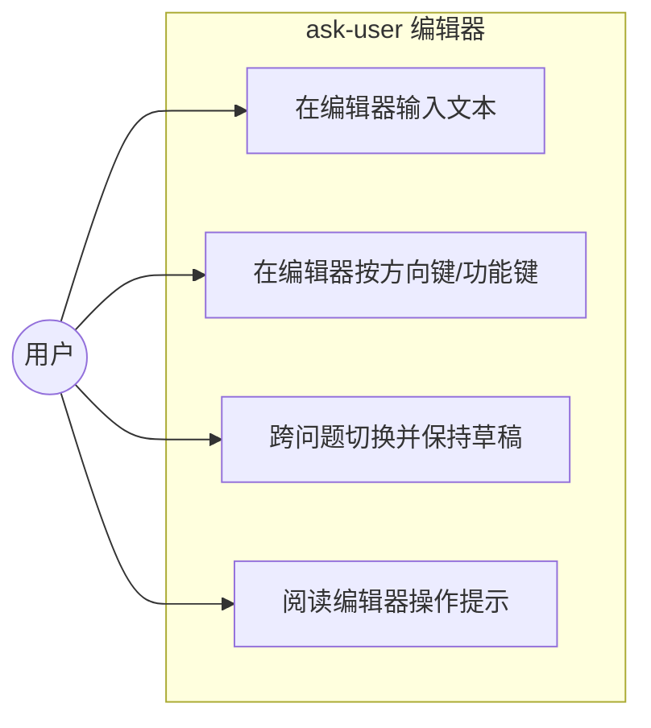
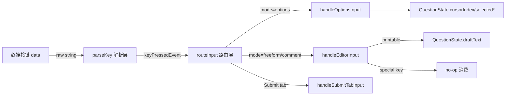

# 修复 ask-user 方向键泄漏 + 键码路由重构

## 1. 业务目标（Business Goals）

### 目标树
- **G1: 消除编辑器键码泄漏** — 成功标准：在 freeform/comment 编辑器内按任意方向键/功能键，editorText 不出现 `[`/`A`/`B`/`C`/`D`/`~` 等键码可见字符残留（回归测试 C-ARROW-* + C-KEYMAP-* 全绿）
  - G1.1: 覆盖全部 special key（SDK parseKey 可识别范围：含 up/down/left/right/home/end/delete/insert/pageUp/pageDown/f1-f12 等，但编辑器内 enter/escape/backspace/tab 有专门语义非 no-op），而非仅方向键
  - G1.2: 覆盖 modifier 组合键（alt+x / ctrl+shift+arrow 等）——SDK parseKey 已处理，ask-user 不自建
- **G2: 键码解析架构归位** — 成功标准：输入路由从「黑名单逐键过滤」重构为「先 parse 再 route」的白名单架构，新键种不再因「某模式忘了处理」而泄漏
  - G2.1: 复用 SDK `@mariozechner/pi-tui` 的 `parseKey(data)` 构建编辑器路由层（parseKey 已覆盖全部 special + modifier + 三套终端协议，不自建）
  - G2.2: 三个模式（options/freeform/comment）的输入路由基于结构化事件分发，消除内联 `matchesKey` 散调
- **G3: editorText 状态归属归位** — 成功标准：editorText 从组件级单实例迁移到 `QuestionState`，消除「单实例 + 进入编辑器时重赋值」的隐式不变式
  - G3.1: `QuestionState` 新增 `draftText` 字段，每问题独立持有编辑草稿
  - G3.2: 进入编辑器时预填逻辑改为读 `state.draftText`（**分流预填**：freeform 入口 `draftText = freeTextValue ?? ""`，comment 入口 `draftText = commentValue ?? ""`），移除组件级 `editorText`。渲染层 question-view.ts 的 `renderQuestionView`/`buildOptionLines`/`buildSplitPane`/`buildEditorBlock` 参数链改为从 `state.draftText` 传入
- **G4: 编辑器 UX 可发现性** — 成功标准：用户在编辑器内能看到操作提示，知道编辑器是 append-only（方向键无效、Backspace 删末尾、Enter 提交）

### 达成路线
| 目标 | 路线/策略 | 对应用例 |
|------|---------|---------|
| G1 | 在编辑器 printable 分支前统一消费功能键 | UC-1 |
| G2 | 引入 parseKey + routeKey 分层 | UC-2 |
| G3 | editorText → QuestionState.draftText 迁移 | UC-3 |
| G4 | 编辑器底部加 dim 提示行 | UC-4 |

## 2. 业务用例（Use Cases）

### 用例图

### UC-1: 在 freeform/comment 编辑器输入文本
- **Actor**: 终端用户
- **前置条件**: 已打开 Other freeform 编辑器 或 comment 输入行（mode=freeform/comment）
- **主流程**: 1. 用户按可打印字符键 2. 字符追加到 editorText 末尾 3. 视图刷新显示新文本 + 光标 █
- **替代流程**: 用户粘贴多字符 chunk（含/不含 bracketed paste 标记、含/不含 emoji）→ 按 code point 迭代完整捕获
- **异常流程**: 无
- **后置状态**: editorText 含用户输入的全部可打印字符
- **关联目标**: G1（不退化）、G3（draftText 正确读写）
- **验收标准 (AC)**:
  - AC-1.1 [正常]: 单字符输入、多字符粘贴、emoji 粘贴行为与现状等价（现有 C-PASTE-1~7 全绿）
  - AC-1.2 [边界]: 空字符串输入是 no-op（C-PASTE-4 保持）
  - AC-1.3 [回归]: refactor 后现有 180 个测试全绿

### UC-2: 在编辑器按方向键/功能键（核心修复）
- **Actor**: 终端用户
- **前置条件**: 已打开 freeform/comment 编辑器
- **主流程**: 1. 用户按方向键（↑↓←→）/功能键（Home/End/Delete/Insert/PageUp/PageDown/F1-F12） 2. 键被解析为 special key 事件 3. 编辑器 no-op 消费（append-only 编辑器不支持光标移动） 4. editorText 不变
- **替代流程**: 用户按 modifier 组合键（alt+x 等）→ 解析为带 modifier 的 special 事件 → 编辑器 no-op，不泄漏 modifier 后的可打印字符
- **异常流程**: 无
- **后置状态**: editorText 无键码残留
- **关联目标**: G1、G2
- **验收标准 (AC)**:
  - AC-2.1 [正常]: 连按 3 次右箭头，editorText 不含 `[`/`C`（C-ARROW-1）
  - AC-2.2 [正常]: 连按 4 个方向键（↑↓←→各一次），中间夹输入 a/b。注意 D-009 偏差：←/→ 现为光标移动非 no-op，故文本顺序随光标位置变化（如 LEFT 后 insert 到开头），不再恒等于 "ab"（C-ARROW-2 已更新为按光标位置精确断言）
  - AC-2.3 [边界]: special key 分三类（D-009 修订）——**no-op 集合**（insert/pageUp/pageDown/f1-f12，编辑器内静默不响应）与**光标移动键**（←/→/Home/End，D-009 新增）与**有专门语义键**（escape=退出/enter=提交/backspace=删光标前字符/tab=no-op）。no-op 集合遍历断言 draftText 不变
  - AC-2.4 [边界]: modifier 组合（alt+x / ctrl+shift+arrow）在编辑器内不泄漏可见字符（C-KEYMAP-MOD）。采样矩阵：4 modifier（ctrl/alt/shift/super）各单独 × {up/down/left/right} + 2-modifier 组合（ctrl+shift/ctrl+alt/shift+alt）× {up/down}，约 18 个用例。修复后 parseKey(data) 对 alt+x 返回 "alt+x" keyId → 命中 special 分支 no-op，不进 printable 追加

### UC-3: 跨问题切换并保持/丢弃草稿
- **Actor**: 终端用户（多问题场景）
- **前置条件**: 多问题表单，用户在某问题的 freeform 编辑器输入了草稿
- **主流程**: 1. 用户在 Q1 freeform 输入 "abc" 2. 按 ←/→ 切到 Q2（**现状：freeform 模式下方向键泄漏成文本，是本次修复的 bug；修复后方向键在编辑器内 no-op，用户需 Esc 先退出编辑器才能切 tab**）3. 回到 Q1 重新进 freeform → 草稿 "abc" 仍存在（state.draftText 持久）
- **替代流程**: 用户 Esc 退出 freeform → 切 tab → 回来重进，editorText 预填上次未提交内容（与现状行为等价）
- **异常流程**: 无
- **后置状态**: 每问题的草稿独立、互不污染
- **关联目标**: G3
- **验收标准 (AC)**:
  - AC-3.1 [正常]: Q1 freeform 草稿 + 切走再回来，draftText 恢复（C-DRAFT-1）
  - AC-3.2 [边界]: Q1 和 Q3 各有草稿，互相独立（C-DRAFT-2）

### UC-4: 阅读编辑器操作提示
- **Actor**: 终端用户
- **前置条件**: 已打开 freeform/comment 编辑器
- **主流程**: 1. 编辑器渲染时底部显示 dim 提示行 2. 用户读到 "←/→ Home/End move · Backspace deletes · Enter submit · Esc back"（D-009 更新：新增移动能力提示） 3. 用户知道可用光标移动 + 编辑操作
- **替代流程**: 无
- **异常流程**: 无
- **后置状态**: 用户知道可用操作
- **关联目标**: G4
- **验收标准 (AC)**:
  - AC-4.1 [正常]: freeform 编辑器渲染含提示行（C-HINT-1）
  - AC-4.2 [正常]: comment 编辑器渲染含提示行（现有行为，保持）

## 3. 数据流转（Data Flow）

### 数据流图

### 数据清单
| 数据 | 来源 | 处理 | 消费者 | 归档策略 | 敏感级别 |
|------|------|------|--------|---------|---------|
| data (按键序列) | 终端 | parseKey 解析为 KeyPressedEvent | routeInput | 无（瞬时） | 无 |
| QuestionState.draftText | 用户编辑器输入 | append-only 追加/Backspace 删末尾 | renderQuestionView 及其下游 build* 函数（component.ts + question-view.ts 跨文件参数链） | 随 component 生命周期 | 用户输入（中，可能含粘贴敏感内容） |

## 4. 功能清单（Features）

| 编号 | 功能 | 对应用例 | 关联目标 |
|------|------|---------|---------|
| F1 | 编辑器功能键黑名单消费（短期）→ parseKey 白名单（长期） | UC-2 | G1, G2 |
| F2 | parseKey + routeInput 架构分层 | UC-2 | G2 |
| F3 | editorText → QuestionState.draftText 迁移 | UC-3 | G3 |
| F4 | 编辑器操作提示行 | UC-4 | G4 |
| F5 | 键码完整性回归测试套件 | UC-1, UC-2 | G1 |

## 5. UI/UX 场景（Interface Scenarios）

### 交互流程

编辑器内交互（freeform/comment）：
- 输入文本 → 在光标位置（cursorIndex）插入（D-009：原为末尾追加）
- ←/→/Home/End → 移动光标（D-009 新增，surrogate pair 安全跳过代理中间位）
- Backspace → 删除光标前一个字符（D-009：原为删末尾，surrogate pair 时删整个 code point）
- Enter → 提交（freeform 保存 freeTextValue / comment 保存 commentValue）
- Esc → 退出（freeform 存 freeDraft 草稿 / comment 跳过评论保留已有值）
- ↑↓/Delete/Insert/PageUp/PageDown/F1-F12 → **no-op**（不支持的功能键）
- Tab → no-op（D-009：编辑器内不切 tab）
- 底部 dim 提示行告诉用户上述操作

## 6. 系统间功能关联（Cross-System）

> 无外部系统依赖。ask-user 是进程内 TUI 组件，唯一外部交互是 pi-tui 的 `matchesKey` / `truncateToWidth` / `wrapTextWithAnsi` 等纯函数。

| 关联系统 | 依赖方向 | 交互方式 | 契约稳定性 |
|---------|---------|---------|-----------|
| `@mariozechner/pi-tui` | ask-user → pi-tui | import 纯函数（matchesKey 等） | 稳定（SDK 公共 API） |

## 7. 约束（Constraints）

- 业务约束: 无
- 技术约束（仅记录不展开）:
  - 必须复用 `@mariozechner/pi-tui` 的 `matchesKey`，不得自己解析终端转义序列
  - TypeScript 禁止 `any`，禁止绕过类型检查
  - 现有 180 个测试不得回归（行为等价，除方向键泄漏修复外）
  - CLAUDE.md 规范：自定义 TUI 组件导航键用方向键，经 `matchesKey` 识别，禁止硬编码单一字节序列

## 8. 不做（Out of Scope）

- ~~**不做**光标自由移动编辑（Home/End/←/→ 移动光标到文本中间）~~ **[D-009 已推翻]**：实现阶段加入了光标移动（commit d04a1a7c6），编辑器升级为支持中间位置 insert/delete，体验更接近原生输入框。surrogate pair 的移动/删除/渲染均已做 code point 安全。详见 decisions.md D-009
- **不做**多行编辑器——当前是 single-line append-only
- **不做** bracketed paste 跨 chunk 拆分的完美处理（边角情况，留待后续迭代）
- **不做** 选项 label 含逗号导致多选结果歧义的修复（边角情况，留待后续迭代）
- **不做** 自建终端键码解析逻辑（SDK `@mariozechner/pi-tui` 已导出 `parseKey`，直接复用；遵守 §7「不得自己解析终端转义序列」约束）

## 决策记录

（Step 3 解决的 D 类 gap，见 decisions.md）

## 待确认

（batch-ask 已完成，全部决策已纳入。见 decisions.md D-001~D-004）

## 决策记录

- **D-001 [D-不可逆]**: 修复范围=架构重构（parseKey 白名单 + draftText 归位 + handleInput 拆分）。根因是缺失解析层；黑名单只堵症状。confirmed_by: ask_user
- **D-002 [D-不可逆]**: parseKey 覆盖 modifier 组合键（alt+x 等）。matchesKey 已支持；不覆盖则 alt+x 泄漏 x。confirmed_by: ask_user
- **D-003 [K]**: 用户确认 Q2 必须覆盖 modifier，按潜在风险处理。confirmed_by: ask_user
- **D-004 [D-不可逆]**: handleInput 搭便车拆分。~80 行踩行数上限边缘；与路由归位契合。confirmed_by: ask_user
