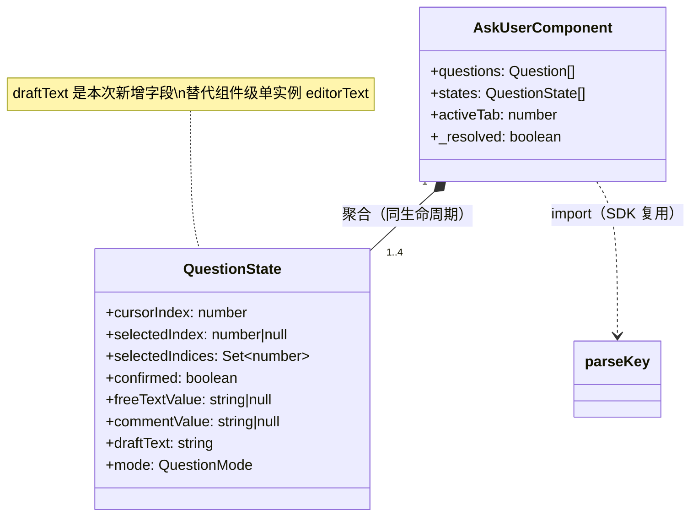
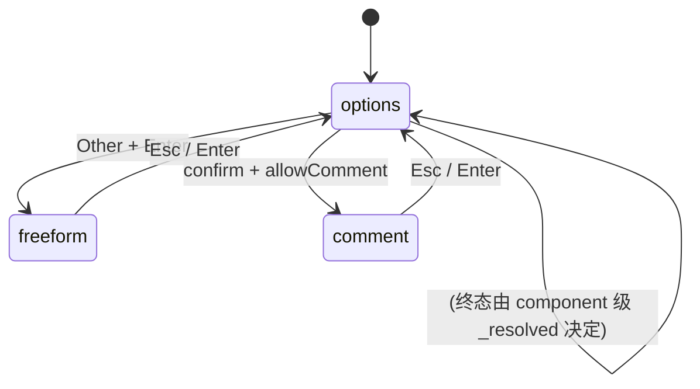
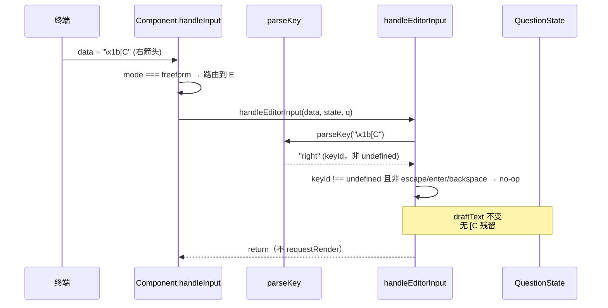

# ask-user 键码解析与输入路由 架构设计

## 1. 目标转换

### 业务目标 → 系统目标
| 业务目标(requirements) | 转换为系统目标 | 衡量标准 |
|----------------------|--------------|---------|
| G1 消除键码泄漏 | 输入解析层统一拦截所有 non-printable 键，编辑器只接受纯可打印文本 | C-ARROW-* + C-KEYMAP-* 全绿 |
| G2 键码解析架构归位 | 引入 parseKey（解析）+ routeInput（分发）两层，消除散调 matchesKey | 反模式检查 AC-1（无散调 matchesKey） |
| G3 editorText 归属归位 | draftText 进 QuestionState，组件级单实例消除 | 反模式检查 AC-2（无组件级 editorText） |
| G4 UX 可发现性 | 编辑器渲染含操作提示行 | C-HINT-1 |

### 搭便车改造目标

| 改造目标 | 动机 | 关联业务目标 | 状态 |
|------|------|-------------|------|
| handleInput 拆分（options 分支抽方法） | 现有 handleInput ~80 行踩 CLAUDE.md 函数行数上限，god-method | G2（路由归位顺带） | 已纳入（D-004） |
| handleSubmitTabInput 的 Tab 消费优先级确认 | 代码注释怀疑 pi 全局可能拦截 Tab，静态无法确认 | G2（路由正确性） | 候选（⑤运行验证） |

## 2. 设计立场

**核心计算是什么？** —— ask-user 的核心计算是**终端按键序列 → 交互状态变更的映射**。这是一条**技术流程编排**（把原始字节流路由到正确的状态机分支），不是复杂业务规则编排。因此分层用**薄编排 + 纯函数解析**，不需要 DDD 4 层。

关键张力：终端按键是**不可信输入**（任意字节流），而状态机分支假设收到的是**结构化意图**（"用户按了右箭头"）。当前 bug 的根因就是**缺失中间的解析层**——原始字节流直接灌进状态机分支，未被识别的键码泄漏成文本。

## 3. 统一语言（Ubiquitous Language）

本次新增/修改术语（同步到项目根 CONTEXT.md）：

| 术语 | 定义 |
|------|------|
| **parseKey**（SDK 复用） | `@mariozechner/pi-tui` 导出的公共函数 `parseKey(data): string | undefined`。返回 keyId 字符串（如 `"up"`/`"alt+x"`/`"ctrl+shift+right"`）或 `undefined`（不可识别）。已覆盖全部 special key + modifier 组合 + legacy/Kitty/modifyOtherKeys 三套终端协议。**不自建，直接 import** |
| **routeInput** | 分发函数，按当前 mode 把 parseKey 返回的 keyId 路由到对应 handler。parseKey 命中 special（返回 keyId）但非编辑器语义键（escape/enter/backspace）时 no-op；返回 undefined（多字符粘贴 chunk）或 bare printable 时走 printable 提取 |
| **append-only editor** | freeform/comment 编辑器的约束：只支持末尾追加 + Backspace 删末尾，不支持光标移动。方向键/功能键 no-op |
| **draftText** | QuestionState 上的字段，每问题独立的编辑草稿（替代组件级单实例 editorText） |

## 4. 核心模型

| 模型 | 类型 | 不变式 | 建模理由 |
|------|------|--------|---------|
| draftText | 实体（每问题一个） | `draftText` 非空 ⟹ 该问题编辑器有未提交草稿（单向） | 把编辑草稿归属到问题，消除组件级单实例 |
| AskUserComponent | 聚合根 | `_resolved` 为 true 后所有输入 no-op；editorText 字段被移除 | 持有全部 QuestionState + 路由调度 |

> parseKey 是 SDK 复用纯函数（`@mariozechner/pi-tui`），不建自建类型，不在核心模型表。编辑器消费 parseKey 返回的 keyId 字符串做路由，无需中间判别联合。

### 模型关联图



### 降级决策（主动不建模）
| 概念 | 为什么不建模 | 应有的处理 |
|------|------------|-----------|
| 终端协议（legacy/Kitty/modifyOtherKeys） | pi-tui 的 matchesKey 已封装协议差异 | 直接复用 matchesKey，不自建协议解析 |
| bracketed paste 完整状态机 | 边角情况，跨 chunk 拆分罕见 | 本地 replace 剥离即可，不建模完整 paste 解析器（留待后续迭代） |

## 5. 状态流转

### Status 枚举（QuestionState.mode）
`options` → `freeform`（Other Enter 打开）→ `options`（Esc/Enter 关闭）
`options` → `comment`（确认后 allowComment 打开）→ `options`（Esc/Enter 关闭）

### Reason 字段
无（mode 转换无终态原因，状态机简单）

### 合法转换


无不可逆终态（mode 可循环），终态由组件级 `_resolved` 守卫（submit/cancel 后所有输入 no-op）。

## 6. 分层架构

### 层级图

```
┌─────────────────────────────────────────────┐
│  Interface 层（index.ts）                    │
│  execute() → ctx.ui.custom(comp) → done()   │
│  signal abort 监听、headless 检查            │
├─────────────────────────────────────────────┤
│  Component 层（component.ts）— 聚合根         │
│  ┌───────────────────────────────────────┐  │
│  │ routeInput（分发，按 mode）            │  │
│  │   ├─ handleOptionsInput               │  │
│  │   ├─ handleEditorInput                │  │
│  │   │     └─ 调用 SDK parseKey 做         │  │
│  │   │        special/printable 判定       │  │
│  │   └─ handleSubmitTabInput             │  │
│  └───────────────────────────────────────┘  │
├─────────────────────────────────────────────┤
│  Render 层（question-view/submit-view.ts）   │
│  纯函数，读 QuestionState → string[]         │
├─────────────────────────────────────────────┤
│  Infrastructure（types.ts + validate.ts）    │
│  数据模型 + 参数校验                         │
└─────────────────────────────────────────────┘
```

### Port 清单
| Port | 价值定位 | 实现数 |
|------|---------|--------|
| （无真 port） | ask-user 是进程内单系统，无跨系统边界 | 0 |

> **降级理由**：ask-user 无跨系统依赖（唯一外部依赖 pi-tui 是纯函数 import，非可替换契约）。不引入伪 port。`matchesKey`/`parseKey` 均为 SDK 函数 import，不是 port（pi-tui 不会被替换，问"翻（Invert）"——依赖方向不可反转，但这是 SDK 契约不是架构 port）。
>
> **parseKey 不单列为层**：parseKey 是 SDK 复用纯函数（`@mariozechner/pi-tui`），被 Component 层同步调用，无独立运行态、无反转可能、无替换契约——它是 Component 层内部调用的协作函数（证伪三连：Delete 会损失协议封装但可塔缩，Invert 不可，Move 可滑动至内联）。不建 parse-key.ts 独立文件，不建 KeyPressedEvent 判别联合（见 D-005）。

## 7. 模块划分与变化轴

| 模块 | 职责 | 变化轴 | LOC(预估) |
|------|------|--------|----------|
| `component.ts`（重构） | routeInput 分发 + 状态机 + 调用 SDK parseKey | 交互模式变化 | ~490（拆分后略降） |
| `question-view.ts`（小改） | 读 state.draftText 渲染 + 提示行 | 渲染样式变化 | ~340 |
| `types.ts`（扩展） | QuestionState 加 draftText | 数据模型变化 | ~135 |
| `__tests__/`（新增） | 键码完整性回归套件 | 测试覆盖 | +~120 |

**不新建 parse-key.ts**（D-005：SDK `@mariozechner/pi-tui` 已导出 parseKey，直接 import 复用）。终端协议变化轴由 SDK 负责，ask-user 侧不承担。

**变化轴归位**：新增交互模式 → 只改 routeInput 分支；渲染样式 → 只改 view；终端协议（新增键种）→ SDK 负责。三者正交。

## 8. 系统间上下文边界（Context Map）

> 单系统无跨系统依赖。pi-tui 是 SDK 纯函数依赖，非独立 bounded context。

```mermaid
graph LR
  ask-user[ask-user Component] -->|import 纯函数| pi-tui[@mariozechner/pi-tui]
  ask-user -->|import 类型| typebox
  ask-user -->|ctx.ui.custom| pi-core[Pi Runtime]
```

| 关联系统 | 关系模式 | 交互方式 | 契约稳定性 |
|---------|---------|---------|-----------|
| pi-tui | 客户-供应商（ask-user 是客户） | import 纯函数 | 稳定（SDK 公共 API） |
| Pi Runtime | 客户-供应商 | ctx.ui.custom / registerTool | 稳定 |

## 9. 泳道图（Swimlane）

编辑器内按方向键的处理序列（修复后）：



对比修复前：E 直接遍历 data 字符，`\x1b` 滤掉、`[` 和 `C` 追加 → 产生 `[C` 残留。

## 10. 挑战与决策

### D-1: parseKey 的 printable 判定边界
**张力**: 什么算"可打印"？纯 `c >= " "`（现状）会放过 Alt 组合的可见字符（`alt+x`=`\x1bx`，`x` ≥ 空格）。
**决策**: parseKey 先判 special key（含 modifier 组合），不匹配的才进 printable 提取。printable 提取仍保留 `c >= " "` 过滤控制字符。
**理由**: special 判定优先，把"带 ESC 前缀的键码"整体识别掉，避免逐字符泄漏。这是白名单架构的核心——先排除已知 special，剩余才当文本。

### D-2: editorText 迁移到 draftText 的行为等价性
**张力**: 现有 editorText 是组件级单实例，靠"进入编辑器时重赋值 state.freeTextValue ?? ''"维持正确。迁移到 state.draftText 后行为是否完全等价？
**决策**: 迁移后，进入编辑器的预填逻辑**保持两处分流**（与现状严格等价）：
- 进 freeform 入口：`state.draftText = state.freeTextValue ?? ""`
- 进 comment 入口：`state.draftText = state.commentValue ?? ""`

**禁止**合二为一的 fallback 公式 `freeTextValue ?? commentValue ?? ""`——review 发现该公式在回改场景（用户填过 comment 后 freeTextValue 已清空时重开 freeform）会把 commentValue 预填进 freeform 编辑器，行为不等价（详见 changes/review-mid-plan-arch.md MF-1，[CROSS-VALIDATED] 架构路+禁读重建路两路独立命中）。
**理由**: 行为等价是 refactor 铁律。draftText 只是把"隐式持有"变"显式持有"，预填逻辑分流不变，不变式从"组件级 editorText 在进入编辑器时被重赋值"变成"state.draftText 在进入编辑器时被重赋值"——归属更清晰，不变式相同。

### D-3: handleInput 拆分（搭便车）
**张力**: 现有 handleInput ~80 行（踩 CLAUDE.md 函数行数上限边缘），把 options 分支抽成 handleOptionsInput 可改善，但增加改动面。
**决策**: 搭便车做。把 options 模式的输入处理（方向键/Esc/tab-nav/Enter/space）抽成 `handleOptionsInput(data, state, q)`，与 handleEditorInput/handleSubmitTabInput 对称。降低 handleInput 到 ~30 行（纯路由）。
**理由**: 路由归位（G2）天然要求 handleInput 只做分发，options 分支内联是历史遗留。拆分后三个 handler 对称，符合 CLAUDE.md「职责划分原则」。

### 特化决策
- **parseKey 直接 import SDK，不建 parse-key.ts / KeyPressedEvent**（D-005）：review 两路独立验证 SDK 已有 parseKey，自建是过度设计。编辑器内直接 `import { parseKey } from "@mariozechner/pi-tui"` 调用，无中间判别联合。

## 11. 反模式检查（grep 验收清单）

机器可检查的 AC：

### AC-1: 编辑器特殊键走 SDK parseKey 路由
- 验证：`grep -c "import.*parseKey.*pi-tui" extensions/ask-user/src/component.ts` 期望 1（import SDK parseKey）。handleEditorInput 内 special 拦截走 parseKey（返回非 undefined 即 no-op，除 escape/enter/backspace 有专门语义）。handleOptionsInput/handleSubmitTabInput 的 matchesKey 散调保持（不持自由文本 buffer，不泄漏）

### AC-2: 组件级 editorText 消除
- 验证：`grep -n "private editorText\|this\.editorText" extensions/ask-user/src/component.ts` 无输出（迁移到 state.draftText）。渲染层参数名可保留 editorText（从 state.draftText 传入）

### AC-3: parseKey 复用 SDK，不新建 parse-key.ts
- 验证：`ls extensions/ask-user/src/parse-key.ts 2>/dev/null` 无输出（不新建文件）+ `grep "parseKey" extensions/ask-user/src/component.ts` 含 import 无自建定义

### AC-4: handleInput 行数下降
- 验证：`sed -n '/^\thandleInput(data: string): void/,/^\t}/p' extensions/ask-user/src/component.ts | grep -v '^\s*$' | grep -v '^\s*//' | wc -l` — ≤ 40 行（纯路由，handleInput 是 public 方法非 private）


## 12. 行为契约保持清单（refactor 模式）

> 重构要保持现有行为等价。以下是"代码有但 requirements 没显式写"的行为，逐条登记。

### BC-1: bracketed paste 标记剥离
| 字段 | 内容 |
|------|------|
| 源码位置 | `component.ts:handleEditorInput` 的 `data.replace(/\x1b\[200~\|\x1b\[201~/g, "")` |
| 处理 | **保持**（留在 handleEditorInput 的 printable 提取分支，parseKey 返回 undefined 后执行。**顺序**：parseKey 判定（返回非 undefined 即拦截，纯布尔匹配不消费字节）→ undefined 则剥离 bracketed paste → printable 提取） |
| 冲突 | 无 |

> parseKey 是纯布尔匹配（对整个 data 字符串返回 keyId 或 undefined），不消费字节。bracketed paste 序列 `\x1b[200~` 整体不是已知 special key，parseKey 返回 undefined，随后剥离 replace 再 printable 提取。顺序明确，无歧义。

### BC-2: 多字符粘贴按 code point 迭代
| 字段 | 内容 |
|------|------|
| 源码位置 | `component.ts:handleEditorInput` 的 `for (const c of cleaned)` |
| 处理 | **保持**（留在 handleEditorInput printable 提取分支，parseKey 返回 undefined 后按 code point 迭代） |
| 冲突 | 无 |

### BC-3: 控制字符过滤（c >= " "）
| 字段 | 内容 |
|------|------|
| 源码位置 | `component.ts:handleEditorInput` 的 `if (c >= " ")` |
| 处理 | **保持**（printable 提取分支保留此守卫） |
| 冲突 | 无 |

### BC-4: 空 Enter 在 freeform 清空 freeTextValue + 重置 confirmed
| 字段 | 内容 |
|------|------|
| 源码位置 | `component.ts:handleEditorInput` freeform 分支空 Enter 逻辑 |
| 处理 | **保持**（draftText 迁移不影响此逻辑，仍操作 state.freeTextValue/confirmed） |
| 冲突 | 无 |

### BC-4b: freeform 有文本 Enter 时清空 selectedIndex（单选答案唯一不变式）
| 字段 | 内容 |
|------|------|
| 源码位置 | `component.ts:handleEditorInput` freeform 有文本 Enter 分支 `state.selectedIndex = null` |
| 处理 | **保持**（与 editorText/draftText 在同一 Enter 分支，refactor 时易漏；残留会导致 freeTextValue+selectedIndex 双非 null，submit 输出两者） |
| 冲突 | 无 |

### BC-4c: 进 comment 模式时 editorText 预填 commentValue
| 字段 | 内容 |
|------|------|
| 源码位置 | `component.ts:afterConfirm` comment 分支 `this.editorText = state.commentValue ?? ""` |
| 处理 | **保持**（迁移到 draftText 后，进 comment 时 `state.draftText = state.commentValue ?? ""`，分流预填——见 §10 D-2） |
| 冲突 | 无 |

### BC-5: comment Esc 保留已有 commentValue
| 字段 | 内容 |
|------|------|
| 源码位置 | `component.ts:handleEditorInput` comment + escape 分支 |
| 处理 | **保持**（Esc 丢弃 draftText 但不清 commentValue） |
| 冲突 | 无 |

### BC-6: _resolved 守卫（防重入）
| 字段 | 内容 |
|------|------|
| 源码位置 | `component.ts:handleInput` 开头 + `cancel()` |
| 处理 | **保持**（不动） |
| 冲突 | 无 |

### BC-7: freeform 模式下方向键不切 tab（现状行为，隐式）
| 字段 | 内容 |
|------|------|
| 源码位置 | `component.ts:handleInput` — freeform 走 handleEditorInput，方向键之前落入 printable 泄漏（bug）；修复后 no-op |
| 处理 | **变更**（bug 修复：从"泄漏成文本"变为"no-op"）。这是本次修复的核心，不是行为等价保持 |
| 冲突 | 无（是目标行为变更，requirements UC-2 明确要求） |

## 下游衔接

### 喂给 Step 3（Issue 拆分）的部分
| 本文档章节 | issue 拆分用途 |
|-----------|--------------|
| §6 分层架构（parseKey 复用 SDK） | Issue: import SDK parseKey + 编辑器路由改造（无新建文件） |
| §7 模块划分（component 重构） | Issue: routeInput 分发 + handleOptionsInput 抽取 |
| §4 核心模型（draftText 迁移） | Issue: editorText → QuestionState.draftText 迁移 |
| §10 D-3（handleInput 拆分） | Issue: handleInput 拆分（搭便车） |
| §11 反模式检查 AC-1~4 | 验收门（grep 脚本） |
