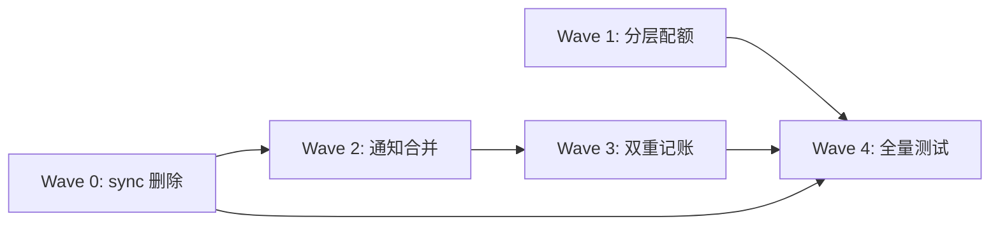

# 执行计划 — T2 删sync + 并发池分层 + 通知合并

> 从 code-architecture.md §4 时序图推导 Wave 依赖。
> 每个 Wave 是一个可独立测试的垂直切片。

## Wave 编排总览

### 依赖 DAG 图

### 调度表

| Wave | 切片 | P级 | Blocked by | 并行组 | 说明 |
|------|------|-----|-----------|--------|------|
| 0 | sync 删除 + 分层配额 | P0 | 无 | — | 合并 Wave 0+1（都改 subagent-service.ts，不能并行） |
| 1 | 通知合并 | P1 | Wave 0 | B | 删除 notifier.ts，改用 pending:unregister |
| 2 | 通知机制统一 record 管理 | P1 | Wave 1 | C | 统一终态路径 emit 事件 |
| 3 | 全量测试 | P2 | 0,1,2 | — | 回归测试 + 新增测试 |

### 并行约束

- Wave 0 改 `subagent-service.ts`（删 sync 分支 + 改 acquire 调用）+ `concurrency-pool.ts` + `types.ts` + `subagent-tool.ts`，必须串行
- Wave 1 必须等 Wave 0（通知合并依赖 sync 删除后简化）
- Wave 2 必须等 Wave 1（统一 record 管理依赖通知合并后统一 emit）

---

## Wave 0: sync 删除 + 分层配额

**切片类型**: 垂直切片
**P 级覆盖**: P0
**Blocked by**: 无——可立即开始
**并行关系**: 串行

### 包含的功能/issue
- Issue: #1（P0，方案 A：渐进式删除）
- Issue: #2（P0，方案 A：修改 SubagentService 池获取逻辑）

### 文件影响
- 修改: `extensions/subagents/src/tools/subagent-tool.ts`（删 wait 参数 schema）
- 修改: `extensions/subagents/src/runtime/subagent-service.ts`（删 resolveMode、sync 分支、PRIORITY_SYNC、改 acquire 调用）
- 修改: `extensions/subagents/src/types.ts`（删 SyncResponse、ExecutionMode 简化）
- 修改: `extensions/subagents/src/core/concurrency-pool.ts`（改 acquire 增加 effectiveMaxConcurrent 参数）
- 修改: `extensions/subagents/src/runtime/subagent-actions.ts`（删 liftSync、sync 返回分支）
- 修改: `extensions/subagents/src/tools/tool-render.ts`（删 sync 渲染分支）
- 测试: 删除 sync 相关测试，保留 background 测试；新增分层配额测试

### 覆盖的 test-matrix 用例 ID
- T0.1: subagent tool start 行为不变（background 模式）
- T0.2: 删除 sync 模式后，现有 background 测试全绿
- T0.3: wait 参数完全删除，tool schema 不含 wait 字段
- T1.1: depth=0 时可用配额 = 6（maxConcurrent 默认值）
- T1.2: depth=N 时可用配额 = max(1, 6-N)
- T1.3: depth >= 6 时保底 1 槽位
- T-NFR-1: 分层配额 debug 日志
- T-NFR-2: 保底 1 槽位单测
- T-NFR-3: 排队超时 warn 日志

### 验收标准
- [ ] grep "wait.*sync\|SyncResponse\|PRIORITY_SYNC" 0 命中
- [ ] 现有 background 测试全绿
- [ ] tool schema 不含 wait 字段
- [ ] 顶层（depth=0）可用配额 = maxConcurrent
- [ ] 嵌套深度 N 时可用配额 = max(1, maxConcurrent-N)
- [ ] depth >= maxConcurrent 时保底 1 槽位

---

## Wave 1: 通知机制合并

**切片类型**: 垂直切片
**P 级覆盖**: P1
**Blocked by**: Wave 0
**并行关系**: 串行

### 包含的功能/issue
- Issue: #3（P1，方案 A：扩展 pending:unregister 事件契约）

### 文件影响
- 删除: `extensions/subagents/src/runtime/execution/notifier.ts`
- 修改: `extensions/subagents/src/runtime/subagent-service.ts`（删 notifier 引用、改用 pending:unregister）
- 修改: `extensions/pending-notifications/src/index.ts`（扩展 unregister handler）
- 测试: 新增通知合并测试

### 覆盖的 test-matrix 用例 ID
- T2.1: background 完成后 pending:unregister 事件触发
- T2.2: pending:unregister 事件 payload 包含 result/error/patchFile 字段
- T2.3: 删除 notifier.ts 后，BgNotifier 相关 import 被清理
- T-NFR-4: emitPendingUnregister payload 扩展
- T-NFR-5: pending-notifications 容忍额外字段

### 验收标准
- [ ] grep "BgNotifier\|subagent-bg-notify" 0 命中
- [ ] background 完成后 pending:unregister 事件触发
- [ ] pending-notifications 扩展消费事件显示完成状态

---

## Wave 2: 通知机制统一 record 管理

**切片类型**: 垂直切片
**P 级覆盖**: P1
**Blocked by**: Wave 1
**并行关系**: 串行

### 包含的功能/issue
- Issue: #4（P1，方案 A：SubagentService emitPendingUnregister 统一触发）

### 文件影响
- 修改: `extensions/subagents/src/runtime/subagent-service.ts`（统一终态路径 emit 事件）
- 测试: 新增终态路径测试

### 覆盖的 test-matrix 用例 ID
- T3.1: 所有终态路径（done/failed/cancelled）都 emit pending:unregister 事件
- T3.2: 异常路径（超时/abort/失败）也 emit 事件
- T3.3: dispose() 路径强制终态化时也 emit 事件
- T-NFR-6: WorkflowRun 同步在 finalizeRecord 内
- T-NFR-7: WorkflowRun 同步不走异步回调
- T-NFR-8: dispose() 路径 WorkflowRun 终态化
- T-NFR-9: finalizeRecord 入口 debug 日志

### 验收标准
- [ ] 所有终态路径（done/failed/cancelled）都 emit pending:unregister 事件
- [ ] 异常路径（超时/abort/失败）也 emit 事件
- [ ] dispose() 路径强制终态化时也 emit 事件

---

## Wave 3: 全量测试 + 回归验证

**切片类型**: 验收
**P 级覆盖**: —
**Blocked by**: Wave 0, 1, 2
**并行关系**: 必须最后

### 职责
跑全量测试，核对每条用例 ID 的 PASS/FAIL/缺失。

### 覆盖的 test-matrix 用例 ID
- T0.1~T0.3（Wave 0 回归）
- T1.1~T1.3（Wave 0 新增）
- T2.1~T2.3（Wave 1 新增）
- T3.1~T3.3（Wave 2 新增）
- T-NFR-1~T-NFR-9（NFR 来源 B）

### 验收标准
- [ ] 全量测试 PASS
- [ ] 覆盖率报告输出

---

## 测试验收清单

| 用例 ID | 来源 | 测试层 | Wave | 断言摘要 | dependsOn | parallelGroup |
|---------|------|--------|------|---------|-----------|---------------|
| T0.1 | 功能 | unit | 0 | subagent tool start 行为不变 | — | — |
| T0.2 | 功能 | unit | 0 | 现有 background 测试全绿 | — | — |
| T0.3 | 功能 | unit | 0 | tool schema 不含 wait 字段 | — | — |
| T1.1 | 功能 | unit | 0 | depth=0 时可用配额 = 6（maxConcurrent 默认值） | — | — |
| T1.2 | 功能 | unit | 0 | depth=N 时可用配额 = max(1, 6-N) | — | — |
| T1.3 | 功能 | unit | 0 | depth >= 6 时保底 1 槽位 | — | — |
| T2.1 | 功能 | integration | 1 | background 完成后 pending:unregister 事件触发 | T0.2 | — |
| T2.2 | 功能 | integration | 1 | pending:unregister 事件 payload 包含 result/error/patchFile | T0.2 | — |
| T2.3 | 功能 | unit | 1 | 删除 notifier.ts 后，BgNotifier 相关 import 被清理 | T0.2 | — |
| T3.1 | 功能 | integration | 2 | 所有终态路径（done/failed/cancelled）都 emit pending:unregister 事件 | T2.1 | — |
| T3.2 | 功能 | integration | 2 | 异常路径（超时/abort/失败）也 emit 事件 | T2.1 | — |
| T3.3 | 功能 | integration | 2 | dispose() 路径强制终态化时也 emit 事件 | T2.1 | — |
| T-NFR-1 | NFR | unit | 0 | 分层配额 debug 日志：acquire 入口记录 depth/effectiveMaxConcurrent/queueLength | — | — |
| T-NFR-2 | NFR | unit | 0 | 保底 1 槽位单测：depth >= maxConcurrent 场景不饿死 | — | — |
| T-NFR-3 | NFR | unit | 0 | 排队超时 warn 日志：队列等待 > 5s 时输出 warn | — | — |
| T-NFR-4 | NFR | integration | 1 | emitPendingUnregister payload 扩展：payload 含 result/error/patchFile 字段 | T0.2 | — |
| T-NFR-5 | NFR | integration | 1 | pending-notifications 容忍额外字段：旧消费方忽略新字段不报错 | T0.2 | — |
| T-NFR-6 | NFR | integration | 2 | WorkflowRun 同步在 finalizeRecord 内：状态转换同步更新两侧 | T2.1 | — |
| T-NFR-7 | NFR | integration | 2 | WorkflowRun 同步不走异步回调：避免竞态窗口 | T2.1 | — |
| T-NFR-8 | NFR | integration | 2 | dispose() 路径 WorkflowRun 终态化：进程退出时两侧一致 | T2.1 | — |
| T-NFR-9 | NFR | unit | 2 | finalizeRecord 入口 debug 日志：recordId/status/hasWorkflowRun | T2.1 | — |
