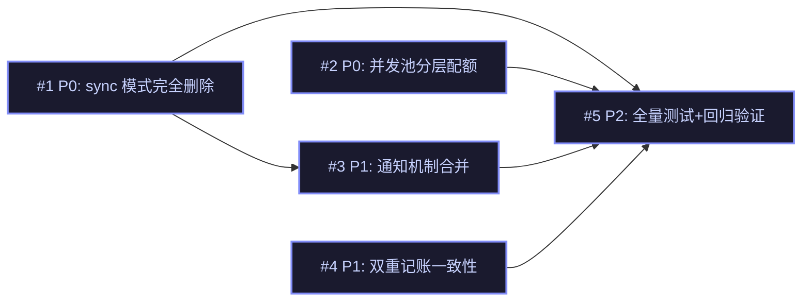

# Issue 决策图 — T2 删sync + 并发池分层 + 通知合并

> refactor 模式。架构决策已在 mid-plan 全部拍板（handoff 用户决策 + T2 decisions.md）。
> issues 把架构决策落地为可执行的 Wave 任务。

## 地图总览

## 上游覆盖核验（MANDATORY，逐条不漏）

| 上游元素 | 轴 | 对应 issue | 状态 | N/A 理由 |
|---------|----|-----------|------|----------|
| §5: subagent-service.ts sync 分支 | 模块 | #1 | ✅ | — |
| §5: concurrency-pool.ts 分层配额 | 模块 | #2 | ✅ | — |
| §5: notifier.ts 删除 | 模块 | #3 | ✅ | — |
| §5: types.ts SyncResponse 删除 | 模块 | #1 | ✅ | — |
| §7: ExecutionRecord 状态机 | 状态 | #4 | ✅ | — |
| §8: 分层配额 max(1, maxConcurrent-depth) | 并发 | #2 | ✅ | — |
| §9: pending:unregister 事件 | 边界 | #3 | ✅ | — |
| §10: wait 参数完全删除 | 模块 | #1 | ✅ | — |
| §11: 双重记账一致性 | 状态 | #4 | ✅ | — |
| G1: 简化执行模式 | 目标 | #1 | ✅ | — |
| G2: 并发池分层配额 | 目标 | #2 | ✅ | — |
| G3: 通知机制统一 | 目标 | #3 | ✅ | — |
| G4: 双重记账一致性 | 目标 | #4 | ✅ | — |

---

## P0 Issues（阻塞项）

### #1: sync 模式完全删除

**P 级**: P0
**类型**: 模块
**Blocked by**: 无
**推荐强度**: Strong

#### 问题描述

删除 subagent tool 的 sync 执行模式，只保留 background 模式。包括：删除 wait 参数 schema、删除 resolveMode 函数、删除 execute() sync 分支、删除 SyncResponse 类型、删除 PRIORITY_SYNC 常量、删除 sync 相关的 onUpdate 嵌套抑制逻辑。

#### 为什么是 P0

不做则 #2（并发池分层）和 #3（通知合并）无法推进——sync 模式存在时并发池和通知机制的逻辑与 background 不同。

#### 方案对比

##### 方案 A: 渐进式删除（推荐）

**改动**:
1. 删除 `subagent-tool.ts` 的 wait 参数 schema
2. 删除 `subagent-service.ts` 的 resolveMode 函数
3. 删除 `subagent-service.ts` 的 execute() sync 分支（L321-334）
4. 删除 `subagent-service.ts` 的 PRIORITY_SYNC 常量
5. 删除 `types.ts` 的 SyncResponse 类型
6. 删除 `subagent-actions.ts` 的 liftSync() 和 sync 返回分支
7. 删除 `tool-render.ts` 的 sync 渲染分支

**优点**: 逐文件删除，每步可验证编译通过
**缺点**: 删除量大（~200 行），需仔细核对依赖
**适用场景**: handoff 用户决策

##### 方案 B: 重写 execute() 方法

**改动**: 直接重写 execute() 方法，只保留 background 分支

**优点**: 代码更干净
**缺点**: 可能遗漏原有逻辑，风险较高
**适用场景**: 如果 sync 分支与 background 分支耦合紧密

**选择**: 方案 A（渐进式删除），风险更低

#### 验收标准

- AC-1.1 [正常]: subagent tool start 行为不变（background 模式）
- AC-1.2 [边界]: 删除 sync 模式后，现有 background 测试全绿
- AC-1.3 [异常]: 删除 sync 模式后，sync 相关测试被移除或改为 background
- AC-1.4 [边界]: wait 参数完全删除，tool schema 不含 wait 字段

---

### #2: 并发池分层配额

**P 级**: P0
**类型**: 并发
**Blocked by**: 无
**推荐强度**: Strong

#### 问题描述

将 DefaultConcurrencyPool 从固定 maxConcurrent 改为分层配额：max(1, maxConcurrent-depth)。顶层（depth=0）用满配额，每层嵌套减 1，最低保底 1。

#### 为什么是 P0

不做则嵌套 agent 调用可能耗尽池资源，导致死锁或饥饿。

#### 方案对比

##### 方案 A: 修改 SubagentService 池获取逻辑（推荐）

**改动**:
1. `ConcurrencyPool` 接口增加可选 `effectiveMaxConcurrent` 参数和 `maxConcurrent` 只读属性
2. `SubagentService.runAndFinalize()` 中计算有效配额后调用 `acquire(priority, effectiveMaxConcurrent)`
3. `DefaultConcurrencyPool` 默认 maxConcurrent=6（比原来 4 更大，支持更多并行 step）

**优点**: 配额逻辑集中在 SubagentService，ConcurrencyPool 接口向后兼容
**缺点**: 配额逻辑分散在 SubagentService
**适用场景**: 架构 §8 明确选择此方案

##### 方案 B: 修改 ConcurrencyPool 接口

**改动**:
1. `ConcurrencyPool.acquire()` 增加 `depth` 参数
2. `DefaultConcurrencyPool` 内部按 depth 计算有效配额

**优点**: 接口语义清晰，配额逻辑集中在池实现
**缺点**: 需改接口签名
**适用场景**: 配额逻辑复杂时

**选择**: 方案 A（修改 SubagentService 池获取逻辑），与架构 §8 一致

#### 验收标准

- AC-2.1 [正常]: 顶层（depth=0）可用配额 = 6（maxConcurrent 默认值）
- AC-2.2 [边界]: 嵌套深度 N 时可用配额 = max(1, 6-N)
- AC-2.3 [异常]: depth >= 6 时保底 1 槽位

---

## P1 Issues（核心项）

### #3: 通知机制合并

**P 级**: P1
**类型**: 边界
**Blocked by**: #1（sync 删除后通知机制简化）
**推荐强度**: Strong

#### 问题描述

删除 notifier.ts（BgNotifier 类），改用 pending-notifications 扩展的 EventBus 机制。background 完成后通过 pending:unregister 事件通知，pending-notifications 扩展消费事件显示完成状态。

#### 为什么是 P1

两套通知机制并存增加维护成本，合并后统一到 EventBus 机制。

#### 方案对比

##### 方案 A: 扩展 pending:unregister 事件契约（推荐）

**改动**:
1. 删除 `notifier.ts`（BgNotifier 类）
2. 删除 `subagent-service.ts` 中的 `this.notifier` 引用和 `notifyComplete` 方法
3. 扩展 `pending:unregister` 事件 payload，增加 `result`、`error`、`patchFile` 字段
4. `pending-notifications` 扩展消费事件时，如果携带 result/error，触发 sendMessage 到 LLM

**优点**: 统一到 EventBus 机制，删除重复代码
**缺点**: 需要修改 pending-notifications 扩展
**适用场景**: 通知机制统一

##### 方案 B: 保留 notifier.ts 但改为调用 pending:unregister

**改动**: notifier.ts 内部改为 emit pending:unregister，不删除 notifier.ts

**优点**: 改动最小
**缺点**: 保留了不必要的抽象层
**适用场景**: 如果 notifier.ts 有其他用途

**选择**: 方案 A（扩展 pending:unregister 事件契约），统一到 EventBus 机制

#### 验收标准

- AC-3.1 [正常]: background 完成后 pending:unregister 事件触发
- AC-3.2 [边界]: 删除 notifier.ts 后，现有通知测试被移除或改为 EventBus
- AC-3.3 [异常]: 删除 notifier.ts 后，BgNotifier 相关 import 被清理
- AC-3.4 [正常]: pending:unregister 事件 payload 包含 result/error/patchFile 字段
- AC-3.5 [正常]: `extensions/pending-notifications/` 消费侧改造——UnregisterEntryData 类型扩展 + 消费逻辑读取 result/error 触发 sendMessage（替代 BgNotifier 职责）

---

### #4: 通知机制统一 record 管理

**P 级**: P1
**类型**: 边界
**Blocked by**: #3（通知合并后统一 record 管理）
**推荐强度**: Strong

#### 问题描述

统一 record 生命周期管理。T1 只保证正常路径两侧一致（ExecutionRecord + pending-notifications entries），T2 统一异常路径（超时/abort/失败）也保证一致。

**关键澄清**：“两侧” 指的是：
- **侧 A**: `ExecutionRecord`（subagents extension 内部）
- **侧 B**: `pending-notifications` entries（pending-notifications 扩展，通过 EventBus 事件同步）

WorkflowRun（workflow extension）的状态由 workflow 扩展自行管理，不在本 issue 范围内。subagents 不反向依赖 workflow。

#### 为什么是 P1

不做则异常路径两侧状态不一致，可能导致 pending-notifications 中的 record 卡在 active 状态。

#### 方案对比

##### 方案 A: SubagentService emitPendingUnregister 统一触发（推荐）

**改动**:
1. `SubagentService.runAndFinalize()` 中，状态转换时统一 emit `pending:unregister` 事件
2. `SubagentService.finalizeRecord()` 中，B9 兜底也 emit 事件
3. `SubagentService.cancelBackground()` 中，CAS 抢锁成功后 emit 事件
4. `SubagentService.dispose()` 中，强制终态化时 emit 事件

**优点**: subagents 单向 emit 事件，pending-notifications 消费事件，无跨 extension 耦合
**缺点**: 需要确保所有终态路径都 emit 事件
**适用场景**: EventBus 机制

##### 方案 B: pending-notifications 主动轮询

**改动**: pending-notifications 扩展定时轮询 ExecutionRecord 状态

**优点**: 解耦
**缺点**: 延迟高，实现复杂
**适用场景**: 如果 EventBus 机制不可靠

**选择**: 方案 A（SubagentService emitPendingUnregister 统一触发），无跨 extension 耦合

#### 验收标准

- AC-4.1 [正常]: 所有终态路径（done/failed/cancelled）都 emit `pending:unregister` 事件
- AC-4.2 [边界]: 异常路径（超时/abort/失败）也 emit 事件
- AC-4.3 [异常]: `dispose()` 路径强制终态化时也 emit 事件
- AC-4.4 [正常]: pending-notifications 扩展消费事件后状态一致

---

## P2 Issues（重要项）

### #5: 全量测试 + 回归验证

**P 级**: P2
**类型**: 模块
**Blocked by**: #1, #2, #3, #4
**推荐强度**: Strong

#### 问题描述

删除 sync 模式后，现有 background 测试全绿。新增分层配额测试、通知合并测试、双重记账一致性测试。

#### 为什么是 P2

测试是验收手段，不是阻塞项。

#### 验收标准

- AC-5.1 [正常]: 删除 sync 后，现有 background 测试全绿
- AC-5.2 [正常]: 新增分层配额测试（depth=0/1/2/3+）
- AC-5.3 [正常]: 新增通知合并测试（pending:unregister 事件触发）
- AC-5.4 [正常]: 新增双重记账一致性测试（异常路径两侧一致）
