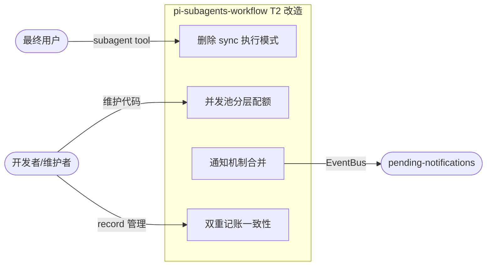
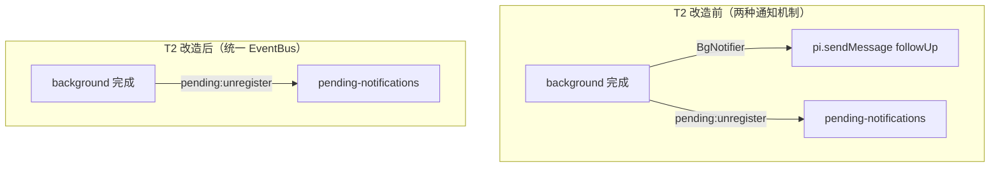
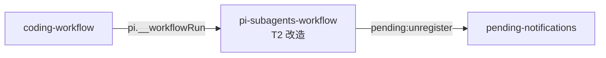

# T2：删sync + 并发池分层 + 通知合并

> 三 topic 拆分的第二步。从合并后的 `@zhushanwen/pi-subagents-workflow` 中删除 sync 执行模式、
> 将并发池改为分层配额、将 notifier.ts 合并到 pending-notifications 扩展的 EventBus 机制。
> D-009: 双重记账一致性由本 topic 处理。

## 1. 业务目标（Business Goals）

### 目标树

- **G1: 简化执行模式** — 删除 sync 执行模式，只保留 background 模式
  - G1.1: 删除 execute() 的 sync 分支（wait 参数、SyncResponse 类型、PRIORITY_SYNC）
  - G1.2: 简化 resolveMode 逻辑（只返回 "background"）
  - 成功标准：grep "wait.*sync\|SyncResponse\|PRIORITY_SYNC" 0 命中

- **G2: 并发池分层配额** — 嵌套深度递增时配额递减，防止深层嵌套耗尽池资源
  - G2.1: 并发池配额改为 max(1, maxConcurrent-depth)
  - G2.2: 顶层（depth=0）用满配额，每层嵌套减 1，最低保底 1
  - 成功标准：嵌套深度 N 时可用配额 = max(1, maxConcurrent-N)

- **G3: 通知机制统一** — 删除 notifier.ts，改用 pending-notifications 扩展的 EventBus 机制
  - G3.1: background 完成后通过 pending:unregister 事件通知（扩展已有机制）
  - G3.2: 删除 BgNotifier 类和 NOTIFY_CUSTOM_TYPE
  - 成功标准：grep "BgNotifier\|subagent-bg-notify" 0 命中

- **G4: 双重记账一致性** — 统一 WorkflowRun + ExecutionRecord 的 record 管理
  - G4.1: T2 的「通知合并」统一 record 生命周期
  - G4.2: T1 只保证正常路径两侧一致，T2 统一异常路径
  - 成功标准：WorkflowRun 和 ExecutionRecord 的状态转换一致

### 达成路线

| 目标 | 路线/策略 | 对应用例 |
|------|---------|---------|
| G1 | 删除 sync 分支 + 简化 resolveMode + 删除 SyncResponse 类型 | UC-1 |
| G2 | 修改 ConcurrencyPool 或 SubagentService 的池获取逻辑 | UC-2 |
| G3 | 删除 notifier.ts + 改用 pending:unregister 事件 | UC-3 |
| G4 | 统一 record 生命周期管理 | UC-4 |

## 2. 业务用例（Use Cases）

### 用例图

### UC-1: 删除 sync 执行模式

- **Actor**: 最终用户（Pi 用户）
- **前置条件**: T1 已完成，subagent tool 支持 sync/background 两种模式
- **主流程**:
  1. 删除 execute() 的 sync 分支（wait 参数、SyncResponse 类型）
  2. 简化 resolveMode 逻辑（只返回 "background"）
  3. 删除 PRIORITY_SYNC 常量
  4. 删除 sync 相关的 onUpdate 嵌套抑制逻辑
- **替代流程**: 无（sync 模式完全删除）
- **异常流程**: 无
- **后置状态**: subagent tool 只支持 background 模式
- **关联目标**: G1
- **验收标准 (AC)**:
  - AC-1.1 [正常]: subagent tool start 行为不变（background 模式）
  - AC-1.2 [边界]: 删除 sync 模式后，现有 background 测试全绿
  - AC-1.3 [异常]: 删除 sync 模式后，sync 相关测试被移除或改为 background
  - AC-1.4 [边界]: wait 参数完全删除（handoff 用户决策），tool schema 不含 wait 字段

### UC-2: 并发池分层配额

- **Actor**: workflow 脚本（嵌套 agent 调用）
- **前置条件**: T1 已完成，DefaultConcurrencyPool 固定 maxConcurrent
- **主流程**:
  1. 修改 ConcurrencyPool 或 SubagentService 的池获取逻辑
  2. 配额改为 max(1, maxConcurrent-depth)
  3. 顶层（depth=0）用满配额，每层嵌套减 1，最低保底 1
- **替代流程**: 无
- **异常流程**: depth >= maxConcurrent 时保底 1 槽位（不饿死）
- **后置状态**: 嵌套深度影响可用配额
- **关联目标**: G2
- **验收标准 (AC)**:
  - AC-2.1 [正常]: 顶层（depth=0）可用配额 = maxConcurrent
  - AC-2.2 [边界]: 嵌套深度 N 时可用配额 = max(1, maxConcurrent-N)
  - AC-2.3 [异常]: depth >= maxConcurrent 时保底 1 槽位

### UC-3: 通知机制合并

- **Actor**: pending-notifications 扩展
- **前置条件**: T1 已完成，BgNotifier 通过 pi.sendMessage 通知
- **主流程**:
  1. 删除 notifier.ts（BgNotifier 类）
  2. background 完成后通过 pending:unregister 事件通知
  3. 删除 NOTIFY_CUSTOM_TYPE（"subagent-bg-notify"）
  4. pending-notifications 扩展消费 pending:unregister 事件显示完成状态
- **替代流程**: 无
- **异常流程**: 无
- **后置状态**: 通知机制统一到 EventBus
- **关联目标**: G3
- **验收标准 (AC)**:
  - AC-3.1 [正常]: background 完成后 pending:unregister 事件触发
  - AC-3.2 [边界]: 删除 notifier.ts 后，现有通知测试被移除或改为 EventBus
  - AC-3.3 [异常]: 删除 notifier.ts 后，BgNotifier 相关 import 被清理

### UC-4: 双重记账一致性

- **Actor**: 开发者/维护者
- **前置条件**: T1 只保证正常路径两侧一致（WorkflowRun + ExecutionRecord）
- **主流程**:
  1. 统一 WorkflowRun + ExecutionRecord 的 record 生命周期管理
  2. 异常路径（超时/abort/失败）也保证两侧一致
  3. 删除重复的 record 创建/更新逻辑
- **替代流程**: 无
- **异常流程**: 无
- **后置状态**: record 生命周期统一管理
- **关联目标**: G4
- **验收标准 (AC)**:
  - AC-4.1 [正常]: WorkflowRun 和 ExecutionRecord 的状态转换一致
  - AC-4.2 [边界]: 异常路径（超时/abort/失败）也保证两侧一致
  - AC-4.3 [异常]: 删除重复的 record 创建/更新逻辑后，测试全绿

## 3. 数据流转（Data Flow）

### 数据流图

### 数据清单

| 数据 | 来源 | 处理 | 消费者 | 敏感级别 |
|------|------|------|--------|---------|
| ExecutionRecord | SubagentService.createRecordForMode | 状态转换 | pending-notifications | 低 |
| BgNotifyRecord | BgNotifier.notify | 删除（改用 pending:unregister） | — | 低 |
| pending:unregister | SubagentService | EventBus 事件 | pending-notifications | 低 |

## 4. 功能清单（Features）

| 编号 | 功能 | 对应用例 | 关联目标 |
|------|------|---------|---------|
| F1 | 删除 execute() 的 sync 分支 | UC-1 | G1 |
| F2 | 简化 resolveMode 逻辑（只返回 "background"） | UC-1 | G1 |
| F3 | 删除 SyncResponse 类型 | UC-1 | G1 |
| F4 | 删除 PRIORITY_SYNC 常量 | UC-1 | G1 |
| F5 | 删除 sync 相关的 onUpdate 嵌套抑制逻辑 | UC-1 | G1 |
| F6 | 并发池配额改为 max(1, maxConcurrent-depth) | UC-2 | G2 |
| F7 | 删除 notifier.ts（BgNotifier 类） | UC-3 | G3 |
| F8 | background 完成后通过 pending:unregister 事件通知 | UC-3 | G3 |
| F9 | 删除 NOTIFY_CUSTOM_TYPE（"subagent-bg-notify"） | UC-3 | G3 |
| F10 | 统一 WorkflowRun + ExecutionRecord 的 record 生命周期管理 | UC-4 | G4 |
| F11 | 异常路径（超时/abort/失败）也保证两侧一致 | UC-4 | G4 |
| F12 | 删除重复的 record 创建/更新逻辑 | UC-4 | G4 |

## 5. UI/UX 场景（Interface Scenarios）

> 本 topic 是纯架构重构，无新增 UI 交互。现有 TUI 渲染（WorkflowsView）保持不变。
> 通知机制变更后，pending-notifications 扩展的 UI 渲染应保持不变。
> 跳过本节。

## 6. 系统间功能关联（Cross-System）

### 关联图

| 关联系统 | 依赖方向 | 交互方式 | 契约稳定性 | T2 影响 |
|---------|---------|---------|-----------|---------|
| pending-notifications | SWF → PN（EventBus） | 事件 | 稳定（pending:unregister） | 统一通知机制 |
| coding-workflow | CW → SWF（pi.__workflowRun） | 编程式 RPC | 稳定（D-8 签名） | 零改动 |

## 7. 约束（Constraints）

- **业务约束**:
  - T2 不做包结构合并（T1 已完成）
  - T2 不做预制脚本（T3 负责）
  - T2 不做 ADR/文档更新（T3 负责）
  - T2 不做旧包 deprecated 标记（T3 负责）

- **技术约束**:
  - 必须用 Pi Extension API（`@mariozechner/pi-coding-agent`），不引入新依赖
  - 删除 sync 模式后，subagent tool 的 wait 参数完全删除（handoff 用户决策）
  - 并发池分层配额必须保底 1 槽位（不饿死）
  - 通知机制必须通过 pending:unregister 事件（pending-notifications 扩展消费）

## 8. 不做（Out of Scope）

以下属 T3，本 topic **明确不做**：

- **预制脚本**（chain/parallel/scatter-gather/map-reduce）→ T3
- **ADR-030 撰写 + ADR-026/029 标 superseded** → T3
- **AGENTS.md/CLAUDE.md 目录结构更新** → T3
- **agent .md prompts / coding-workflow skills 文档更新** → T3
- **旧包 deprecated 标记 + CHANGELOG 迁移指引** → T3

## 决策记录

> 详见 `decisions.md`。本 topic 关键决策：

| id | decision | classification | confirmed_by |
|----|----------|----------------|--------------|
| D-009 | 双重记账一致性标 T2 处理 | D-可逆 | ask_user（T1 M-6 确认） |

## 待确认

- M-1: sync 模式删除后，wait 参数应保留但只接受 false/undefined，还是完全删除？
- M-2: 并发池分层配额的具体实现方式（修改 ConcurrencyPool 还是 SubagentService 的池获取逻辑）？
- M-3: 通知机制合并后，pending:unregister 事件的 payload 需要包含哪些字段？
- M-4: 双重记账一致性的具体实现（统一 record 生命周期管理的具体方式）？
