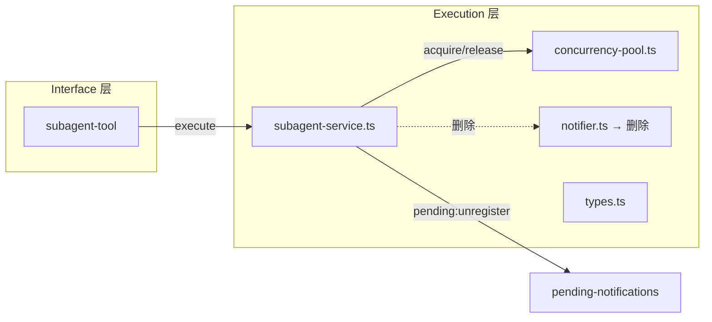
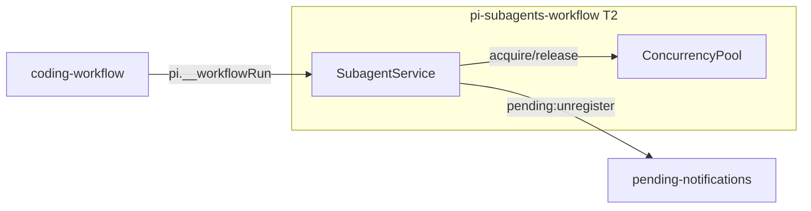
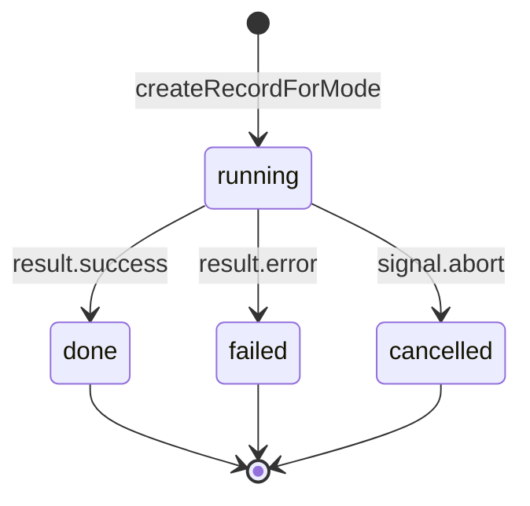

# pi-subagents-workflow 架构设计（T2：删sync + 并发池分层 + 通知合并）

> **refactor 模式** — 从合并后的 extension 中删除 sync 模式、改造并发池、统一通知机制。
> 本架构文档聚焦：(1) sync 删除的边界；(2) 并发池分层配额；(3) 通知机制合并。

## 1. 目标转换

### 业务目标 → 系统目标

| 业务目标(requirements) | 转换为系统目标 | 衡量标准 |
|----------------------|--------------|---------|
| G1: 简化执行模式 | 删除 sync 分支，只保留 background | grep "wait.*sync\|SyncResponse\|PRIORITY_SYNC" 0 命中 |
| G2: 并发池分层配额 | 配额改为 max(1, maxConcurrent-depth) | 嵌套深度 N 时可用配额 = max(1, maxConcurrent-N) |
| G3: 通知机制统一 | 删除 notifier.ts，改用 pending:unregister | grep "BgNotifier\|subagent-bg-notify" 0 命中 |
| G4: 双重记账一致性 | 统一 record 生命周期管理 | WorkflowRun 和 ExecutionRecord 状态转换一致 |

## 2. 设计立场

**核心计算是什么？** — agent 调用的执行编排（spawn pi 子进程 → 流式解析 JSONL → 归一化 AgentResult）。

**分层决策：保持三层架构（T1 已确认）**。T2 不改变分层，只在现有层内改造：
- Interface 层：删除 sync 相关的 tool 参数处理
- Orchestration 层：删除 sync 相关的 workflow 编排逻辑
- Execution 层：删除 sync 分支、改造并发池、删除 notifier

### 分层架构

| 层 | 职责 | T2 改造点 |
|----|------|----------|
| **Interface** | tool/command 注册、TUI 渲染 | 删除 sync 相关的 tool 参数处理 |
| **Orchestration**（Engine） | workflow DAG 状态机、budget、error-recovery | 删除 sync 相关的 workflow 编排逻辑 |
| **Execution**（Infra） | SubagentService、ConcurrencyPool、session-runner spawn | 删除 sync 分支、改造并发池、删除 notifier |

## 3. 统一语言（Ubiquitous Language）

> 引用项目根 CONTEXT.md。本次新增/修改术语：

| 术语 | 含义 | 变更 |
|------|------|------|
| background 模式 | subagent tool 的唯一执行模式（detached 立即返回） | T2 删除 sync 模式后成为唯一模式 |
| 分层配额 | 并发池配额按嵌套深度递减：max(1, maxConcurrent-depth) | T2 新增 |
| pending:unregister | EventBus 事件，background 完成后触发 | T2 替代 BgNotifier |

## 4. 核心模型

| 模型 | 类型 | 不变式 | 建模理由 |
|------|------|--------|---------|
| ExecutionRecord | aggregate | status 单调转换；终态不可回退 | subagent 执行记录，T2 统一管理 |
| ConcurrencyPool | service | acquire/release 成对；active <= maxConcurrent | 并发控制，T2 改为分层配额 |
| PendingEntry | DTO | id 唯一；status 从 active 转为终态 | pending-notifications 的数据模型 |

### 模型关联图

```mermaid
classDiagram
    class ExecutionRecord {
        +id: string
        +status: ExecutionStatus
        +depth: number
    }
    class ConcurrencyPool {
        +acquire(priority, effectiveMaxConcurrent): Promise~void~
        +release(): void
        +active: number
        +maxConcurrent: number
    }
    class PendingEntry {
        +id: string
        +type: PendingType
        +status: PendingStatus
    }

    ExecutionRecord "1" --> "1" ConcurrencyPool : acquire 槽位
    ExecutionRecord "1" --> "1" PendingEntry : pending:register/unregister
```

## 5. 模块拆分

### T2 改造范围

| 模块 | 当前状态 | T2 改造 | 归属层 |
|------|---------|---------|--------|
| `subagent-service.ts` | 支持 sync/background | 删除 sync 分支、简化 resolveMode | Execution |
| `concurrency-pool.ts` | 固定 maxConcurrent | 改为分层配额 max(1, maxConcurrent-depth) | Execution |
| `notifier.ts` | BgNotifier 通过 pi.sendMessage 通知 | 删除，改用 pending:unregister | Execution |
| `types.ts` | SyncResponse 类型 | 删除 SyncResponse | Execution |

### 模块依赖图



## 6. 外部依赖

### 4 类分类

| 依赖 | 类型 | T2 影响 |
|------|------|---------|
| Pi ExtensionAPI | In-process | 零改动（pi.events.emit 仍用于 pending:unregister） |
| pending-notifications | 共享内核 | 统一通知机制（删除 notifier.ts，改用 EventBus） |
| coding-workflow | 客户 | 零改动（pi.__workflowRun 签名不变） |

### Context Map



## 7. 状态机

### ExecutionRecord 状态转换（T2 统一管理）



**不变式**：
- status 单调转换（running → done/failed/cancelled）
- 终态不可回退
- 每次转换触发 pending:unregister 事件

## 8. 并发模型

### 分层配额（T2 核心改造）

**当前**：DefaultConcurrencyPool 固定 maxConcurrent（默认 4）

**T2 改造**：配额按嵌套深度递减
```
可用配额 = max(1, maxConcurrent - depth)
```
- depth=0（顶层）：可用配额 = maxConcurrent
- depth=1（一层嵌套）：可用配额 = maxConcurrent - 1
- depth >= maxConcurrent：保底 1 槽位（不饿死）

**实现方式**：修改 SubagentService 的池获取逻辑，不改 ConcurrencyPool 接口
```typescript
// SubagentService.runAndFinalize 中
const effectiveMaxConcurrent = Math.max(1, this.pool.maxConcurrent - record.depth);
const pooled = record.mode === "background";
if (pooled) await this.pool.acquire(priority, effectiveMaxConcurrent);
```

**默认 maxConcurrent=6**（比原来 4 更大，支持更多并行 step）：

| depth | 有效配额 | 场景 |
|-------|---------|------|
| 0 | 6 | 顶层 workflow/subagent |
| 1 | 5 | 一层嵌套 |
| 2 | 4 | 二层嵌套 |
| 3 | 3 | 三层嵌套 |
| 4 | 2 | 四层嵌套 |
| 5 | 1 | 五层嵌套（保底） |
| 6+ | 1 | 更深层嵌套（保底） |

## 9. 通知机制合并

### 当前（T1）

```
background 完成 → BgNotifier.notify() → pi.sendMessage({ deliverAs:"followUp" })
                                    → pending:unregister 事件
```

两套通知机制并存：
1. BgNotifier：滑动窗口合并 60s，通过 pi.sendMessage 注入主对话
2. pending:unregister：EventBus 事件，pending-notifications 扩展消费

### T2 改造

```
background 完成 → pending:unregister 事件 → pending-notifications 扩展
```

统一到 EventBus 机制：
- 删除 BgNotifier 类和 NOTIFY_CUSTOM_TYPE
- background 完成后直接触发 pending:unregister 事件
- pending-notifications 扩展消费事件显示完成状态

**删除清单**：
- `notifier.ts`（BgNotifier 类）
- `NOTIFY_CUSTOM_TYPE`（"subagent-bg-notify"）
- `subagent-service.ts` 中的 `this.notifier` 引用
- `subagent-service.ts` 中的 `notifyComplete` 方法

## 10. sync 模式删除

### 删除清单

| 文件 | 删除内容 | 理由 |
|------|---------|------|
| `subagent-service.ts` | `resolveMode` 中的 sync 分支 | 只保留 background |
| `subagent-service.ts` | `execute` 中的 sync await 逻辑 | 只保留 background |
| `subagent-service.ts` | `PRIORITY_SYNC` 常量 | sync 优先级不再需要 |
| `subagent-service.ts` | sync 相关的 onUpdate 嵌套抑制逻辑 | sync 模式删除 |
| `types.ts` | `SyncResponse` 类型（如果有） | sync 模式删除 |

### wait 参数处理

**决策**：wait 参数完全删除（handoff 用户决策）

**理由**：
- sync 模式删除后 wait 参数无意义
- 简化 tool schema（只有一个 action 参数）
- 向后不兼容：现有脚本传 `wait: false` 需迁移到无 wait 版本

**删除清单**：
- `subagent-tool.ts` 的 wait 参数 schema
- `subagent-service.ts` 的 resolveMode 函数
- `subagent-service.ts` 的 execute() sync 分支
- `types.ts` 的 SyncResponse 类型

## 11. 双重记账一致性（D-009）

### 当前（T1）

T1 只保证正常路径两侧一致（WorkflowRun + ExecutionRecord）。异常路径（超时/abort/失败）可能不一致。

### T2 改造

统一 record 生命周期管理：
- WorkflowRun 和 ExecutionRecord 共享同一个状态机
- 每次状态转换同时更新两侧
- 异常路径也保证一致

**实现方式**：
- 在 SubagentService.runAndFinalize 中，状态转换时同时更新 WorkflowRun（如果有）
- 删除重复的 record 创建/更新逻辑

## 12. 测试策略

### 回归测试

- 删除 sync 模式后，现有 background 测试全绿
- 删除 notifier.ts 后，现有通知测试被移除或改为 EventBus
- 并发池分层配额的新测试

### 新增测试

| 测试 | 覆盖点 | 层 |
|------|---------|-----|
| 分层配额 - 顶层 | depth=0 时可用配额 = maxConcurrent | unit |
| 分层配额 - 嵌套 | depth=N 时可用配额 = max(1, maxConcurrent-N) | unit |
| 分层配额 - 保底 | depth >= maxConcurrent 时保底 1 槽位 | unit |
| 通知合并 - pending:unregister | background 完成后触发事件 | integration |
| 通知合并 - 删除 notifier | BgNotifier 相关 import 被清理 | unit |
| sync 删除 - wait: true 抛错 | wait: true 时抛错说明 sync 已删除 | unit |
