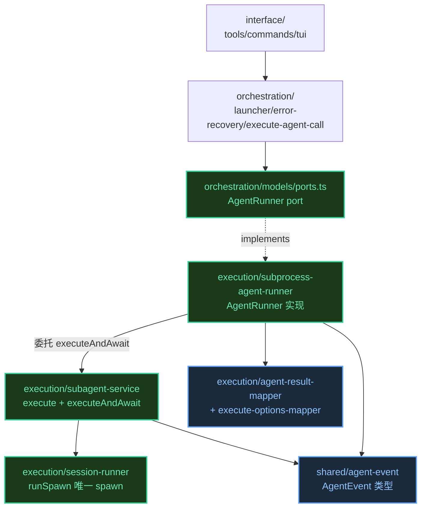
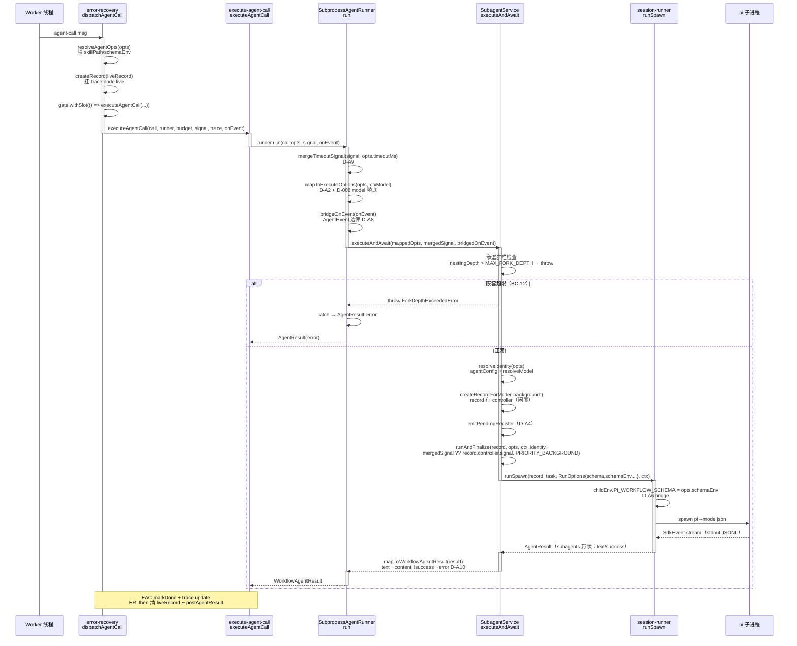
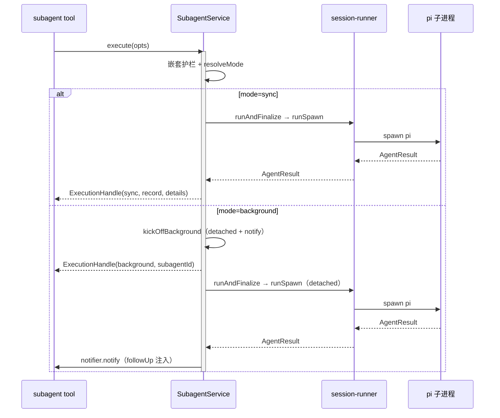
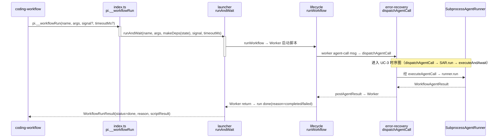

# 代码架构设计 — T1 包结构合并 + 执行链统一

> refactor 模式。合并 `@zhushanwen/pi-subagents` + `@zhushanwen/pi-workflow` 为
> `@zhushanwen/pi-subagents-workflow`。本文档只覆盖**核心改动**（executeAndAwait 新增 +
> SAR 委托重写 + session-runner schemaEnv bridge + 重复代码消除），迁移不动部分（~90% 代码）
> 标 N/A（见 §7）。
>
> 决策基线：`decisions.md` D-000~D-009 + system-architecture §10 D-A1~D-A10。
> 骨架见同目录 `code-skeleton/`。

## 1. 工程目录

合并后包 `extensions/subagents-workflow/`，三层架构（Interface / Orchestration / Execution）。
**仅列改动/新增模块**，其余迁移不动（§7 标 move）。

```
extensions/subagents-workflow/src/
├── execution/                          # 执行层（原 subagents core+runtime + SAR 迁入 MF-3）
│   ├── subagent-service.ts             # 【改】+ executeAndAwait（D-A1/D-A10/BC-11/BC-12）
│   ├── subprocess-agent-runner.ts      # 【迁入+重写】orchestration→execution，委托 SS（D-A2/A8/A9 + D-008）
│   ├── session-runner.ts               # 【改】RunOptions + schemaEnv，runSpawn childEnv 注入（D-A6/BC-8）
│   ├── agent-result-mapper.ts          # 【新】subagents AgentResult → workflow AgentResult（D-A10）
│   ├── execute-options-mapper.ts       # 【新】AgentCallOpts → ExecuteOptions（D-A2，SAR 内联消费）
│   ├── concurrency-pool.ts             # 不变（T2 改分层）
│   ├── execution-record.ts             # 唯一（删 orchestration/live/execution-record 副本）
│   ├── agent-registry.ts               # 唯一（删 orchestration/agent-discovery 副本，D-003）
│   └── ...                             # 其余 runtime/core 文件迁移不动
│
├── orchestration/                      # 编排层（原 workflow engine）
│   ├── models/
│   │   ├── ports.ts                    # 【改】AgentRunner.onEvent 签名 raw→AgentEvent（D-005/BC-10）
│   │   └── types.ts                    # 不变（AgentCallOpts/AgentResult 形状锁 BC-1/BC-2）
│   ├── error-recovery.ts               # 【改】dispatchAgentCall onEvent 闭包简化（删 jsonlToAgentEvent）
│   ├── execute-agent-call.ts           # 不变（透传 onEvent 给 runner.run，类型跟随 port）
│   ├── launcher.ts                     # 不变（runAndWait 签名锁 BC-3）
│   ├── concurrency-gate.ts             # 【改】withSlot 内部委托 ConcurrencyPool（D-A7 保留封装层）
│   ├── live/                           # 【删】jsonl-to-agent-event.ts + types.ts + execution-record.ts
│   ├── pi-runner.ts                    # 【删】（executeAndAwait 覆盖 runPiProcess 能力，D-A7）
│   └── ...
│
├── interface/                          # 两包 tools/commands/tui 合并（迁移不动）
│
└── shared/                             # extractYamlField 统一（随 agent-discovery 删除归并）
    └── agent-event.ts                  # AgentEvent 类型唯一出口（两包合并后 import 收口）
```

**依赖方向**（锁）：
- `interface → orchestration → execution`（单向，orchestration 不 import interface）
- `execution/subprocess-agent-runner.ts → execution/subagent-service.ts`（同层委托，MF-3 迁入后同层）
- `orchestration/models/ports.ts` 定义 AgentRunner port，`execution/subprocess-agent-runner.ts` 实现（跨层 port，依赖方向 orchestration←execution）
- `orchestration → shared/agent-event`（AgentEvent 类型共享）
- **禁止**：execution import orchestration（除 ports.ts 类型）；orchestration import execution 的实现（只依赖 port）

## 2. 包依赖图



**import 规则**：
- SAR（execution）implements PORT（orchestration/models）—— 跨层 implements 合法（port 定义在 orchestration，实现在 execution，依赖方向 execution→orchestration 仅取类型）
- SAR→SS 同层委托（execution 内部），合法
- **循环依赖检测点**：SAR imports ports.ts（类型）+ subagent-service（值），二者无反向 import → 无环

## 3. API 契约

> 签名表。`【改】`= 现有方法签名/实现变更；`【新】`= 新增；`【删】`= 删除。接线层级标注：
> `[模块内直调]` / `[跨模块 port]` / `[adapter 真引 SDK]`。

### 模块: execution/subagent-service.ts

#### 类: SubagentService

| 方法 | 签名 | 返回 | 边界条件 | 接线层级 | Spec/Issue 关联 |
|------|------|------|---------|---------|----------------|
| executeAndAwait 【新】 | `(opts: ExecuteOptions, signal?: AbortSignal, onEvent?: (e: AgentEvent) => void) => Promise<WorkflowAgentResult>` | `WorkflowAgentResult`（content/parsedOutput/usage/error） | nestingDepth>MAX_FORK_DEPTH → throw ForkDepthExceededError（BC-12）；不触发 notify/followUp（BC-11） | [模块内直调] this.runAndFinalize + this.resolveIdentity + this.createRecordForMode + mapToWorkflowAgentResult | #2 / D-A1 / D-A10 |
| execute（现有） | 不变 | ExecutionHandle | — | — | BC-6 |
| runAndFinalize（现有 private） | 不变签名，RunOptions 构造加 schemaEnv | AgentResult（subagents 形状） | — | [模块内直调] runSpawn | #3 bridge |
| resolveIdentity / createRecordForMode / buildSessionRunnerContext（现有 private） | 不变 | — | — | — | 复用 |

> **executeAndAwait 出口类型注记**：返回 workflow 侧 `AgentResult`（`engine/models/types.ts`，content 字段）。
> 为避免同文件两 AgentResult 命名冲突，骨架 import 用别名 `WorkflowAgentResult`。

### 模块: execution/subprocess-agent-runner.ts

#### 类: SubprocessAgentRunner（implements AgentRunner）

| 方法 | 签名 | 返回 | 边界条件 | 接线层级 | Spec/Issue 关联 |
|------|------|------|---------|---------|----------------|
| constructor 【改】 | `(deps: { subagentService: SubagentService; ctxModel?: ModelInfo })` | — | per-session 注入 | — | #4 / D-008 |
| run 【重写】 | `(opts: AgentCallOpts, signal: AbortSignal, onEvent?: (e: AgentEvent) => void) => Promise<WorkflowAgentResult>` | WorkflowAgentResult | timeoutMs 合并 signal（D-A9）；不 reject，失败入 error 字段 | [模块内直调] mapToExecuteOptions + mergeTimeoutSignal + this.subagentService.executeAndAwait + bridgeOnEvent | #4 / D-A2/A8/A9 |

> 构造签名简化：agentRegistry/sessionDir/activeTempFiles 不进 SAR（resolveAgentOpts 在 orchestration 层完成，D-A3，结果已填进 AgentCallOpts.skillPath/schemaEnv）。SAR 只需 subagentService（委托目标）+ ctxModel（model 填底，D-008）。

### 模块: execution/session-runner.ts

| 函数/类型 | 签名 | 改动 | 接线层级 | Spec/Issue 关联 |
|-----------|------|------|---------|----------------|
| RunOptions 【改】 | 新增 `schemaEnv?: string` 字段 | 加字段 | — | #3 / D-A6 |
| runSpawn 【改】 | childEnv 构造加 `if (opts.schemaEnv) childEnv.PI_WORKFLOW_SCHEMA = opts.schemaEnv` | 加 3 行 | [模块内直调] 现有 spawn 不变 | #3 / BC-8 |

### 模块: execution/agent-result-mapper.ts 【新】

| 函数 | 签名 | 返回 | 接线层级 | Spec/Issue 关联 |
|------|------|------|---------|----------------|
| mapToWorkflowAgentResult | `(r: SubagentsAgentResult) => WorkflowAgentResult` | WorkflowAgentResult | [模块内直调] 纯 DTO 映射（text→content, !success→error, usage/toolCalls 形状转换） | D-A10 |

### 模块: execution/execute-options-mapper.ts 【新】

| 函数 | 签名 | 返回 | 接线层级 | Spec/Issue 关联 |
|------|------|------|---------|----------------|
| mapToExecuteOptions | `(opts: AgentCallOpts, ctxModel?: ModelInfo) => ExecuteOptions` | ExecuteOptions（含 schemaEnv） | [模块内直调] 纯 DTO 映射（prompt→task, schema/schemaEnv 透传, model 填底） | D-A2 / D-008 |
| mergeTimeoutSignal | `(signal: AbortSignal, timeoutMs?: number) => AbortSignal` | 合并后 signal | [模块内直调] AbortController + setTimeout | D-A9 / BC-9 |

### 模块: execution/concurrency-pool.ts

> T2 实现，T1 架构设计中预留接口。默认 maxConcurrent=6。

#### 接口

```typescript
interface ConcurrencyPool {
  acquire(priority: number, effectiveMaxConcurrent?: number): Promise<void>;
  release(): void;
  readonly active: number;
  readonly maxConcurrent: number;  // 新增：总配额（分层计算基准）
}
```

#### DefaultConcurrencyPool 改造

- 构造函数：`constructor(maxConcurrent: number = 6)`（默认 6）
- `acquire(priority, effectiveMaxConcurrent?)` 内部：
  - `effective = effectiveMaxConcurrent ?? this._maxConcurrent`
  - `if (this._active < effective)` 放行，否则入队
- `release()` 保留优先级排序（PRIORITY_BACKGROUND=1000）

#### SubagentService 分层配额调用

```typescript
// SubagentService.runAndFinalize 中
const pooled = record.mode === "background";
if (pooled) {
  const effectiveMaxConcurrent = Math.max(1, this.pool.maxConcurrent - record.depth);
  await this.pool.acquire(PRIORITY_BACKGROUND, effectiveMaxConcurrent);
}
```

### 模块: orchestration/worker/worker-script-builder.ts

> T1/T3 实现，添加 workflow() 函数支持 workflow 嵌套。

#### workflow() 函数

```typescript
// 构建脚本 API 时添加 workflow 函数
const workflow = async (name: string, args?: Record<string, unknown>) => {
  return await pi.__workflowRun(name, args, signal, timeoutMs);
};

// 注入到脚本 API
const scriptApi = { agent, task, workflow, /* ... */ };
```

#### 返回类型

`workflow()` 返回 `AgentResult`，与 `agent()` 一致：

```typescript
interface AgentResult {
  content: string;
  parsedOutput?: unknown;
  usage?: AgentUsage;
  error?: string;
}
```

#### 信号/预算传播

- `signal`：从父 workflow 的 Worker context 继承
- `timeoutMs`：从父 workflow 的 budget 计算剩余时间

### 模块: orchestration/models/ports.ts

| `interface` AgentRunner | 方法签名变更 | 接线层级 | Spec/Issue 关联 |
|-----------|------------|---------|----------------|
| AgentRunner.run 【改】 | `onEvent?: (e: AgentEvent) => void`（原 `(raw: Record<string,unknown>) => void`） | [跨模块 port] 类型升级 | D-005 / BC-10 |

### 模块: orchestration/error-recovery.ts

| 函数 | 改动 | 接线层级 | Spec/Issue 关联 |
|------|------|---------|----------------|
| dispatchAgentCall onEvent 闭包 【改】 | `(raw) => jsonlToAgentEvent(raw).forEach(e => updateFromEvent(live, e))` 简化为 `(event: AgentEvent) => updateFromEvent(liveRecord, event)` | [模块内直调] 删 jsonlToAgentEvent 中间层 | D-005 / D-A7（删 live/jsonl-to-agent-event.ts） |

## 4. 功能代码链路（时序图）

### 功能: UC-3 workflow 编排执行 agent（执行链统一核心）

#### 时序图



#### 方法签名表

| 类 | 方法 | 签名 | 返回 | 边界条件 | 关联 |
|----|------|------|------|---------|------|
| error-recovery | dispatchAgentCall | `(run, msg, deps) => void` | void | resolved.error → early failed | #4 |
| execute-agent-call | executeAgentCall | `(call, runner, budget, signal, trace, onEvent?) => Promise<void>` | void | 不 reject | BC-7 |
| SubprocessAgentRunner | run | `(opts, signal, onEvent?) => Promise<WorkflowAgentResult>` | WorkflowAgentResult | timeoutMs 合并；不 reject | #4 |
| SubprocessAgentRunner | mergeTimeoutSignal | `(signal, timeoutMs?) => AbortSignal` | AbortSignal | timeoutMs=undefined → 原样返回 | D-A9 |
| SubprocessAgentRunner | mapToExecuteOptions | `(opts, ctxModel?) => ExecuteOptions` | ExecuteOptions | model 填底 | D-A2 |
| SubagentService | executeAndAwait | `(opts, signal?, onEvent?) => Promise<WorkflowAgentResult>` | WorkflowAgentResult | nesting 超限 throw | #2 |
| session-runner | runSpawn | `(record, task, opts, ctx) => Promise<SubagentsAgentResult>` | SubagentsAgentResult | schemaEnv 注入 childEnv | #3 |

#### 数据流链
Worker `agent({prompt,agent,schema})` → resolveAgentOpts 填 skillPath/schemaEnv →
SAR.run → mapToExecuteOptions（AgentCallOpts→ExecuteOptions）→ SS.executeAndAwait →
runAndFinalize → runSpawn（schemaEnv→childEnv.PI_WORKFLOW_SCHEMA）→ spawn pi →
SdkEvent → AgentResult(subagents) → mapToWorkflowAgentResult → WorkflowAgentResult →
EAC markDone → trace node.result

#### 关联
- requirements: UC-3（AC-3.1~3.4）
- issues: #2 / #3 / #4
- BC: BC-7（retry 不变）/ BC-8（schema 契约）/ BC-9（timeoutMs）/ BC-10（live-record）/ BC-11（无 followUp）/ BC-12（嵌套护栏）

---

### 功能: UC-4 subagent tool 直接执行（回归路径，不变）

#### 时序图



#### 关联
- requirements: UC-4（AC-4.1 行为不变）
- BC: BC-6（tool 行为不变）
- **本路径零改动**——execute/kickOffBackground/runSpawn 均不变。runSpawn 新增 schemaEnv 参数，
  tool 层 ExecuteOptions.schemaEnv 恒 undefined（不传）→ childEnv 不设 PI_WORKFLOW_SCHEMA → BC-6。

---

### 功能: UC-5 pi.__workflowRun 下游调用（穿透到 UC-3）

#### 时序图



#### 关联
- requirements: UC-5（AC-5.1 签名不变 / AC-5.2 coding-workflow 测试全绿）
- BC: BC-3（pi.__workflowRun 签名锁）/ BC-5（pending emit 不变）
- **本路径除 SAR 内部委托外零改动**——runAndWait/runWorkflow/lifecycle 签名全锁。

## 5. Deep Module 设计决策

### 模块: SubagentService（executeAndAwait 扩展点）

- **Interface**: `executeAndAwait(opts, signal?, onEvent?) => Promise<WorkflowAgentResult>`
- **Depth**: deletion test 通过——execute(sync) 路径有 onUpdate 回流/spinner/followUp 副作用（tool 层关切），
  executeAndAwait 剥离这些；返回类型不兼容（ExecutionHandle vs AgentResult）；T2 删 sync 不牵连。
  独立方法合理（D-A1 三处塌点验证）。
- **Seam**: 无新增 port。executeAndAwait 是 SubagentService 的公开方法，SAR 直接持有 SubagentService 引用（同包 execution 层内直调）。
- **Port 决策**: 不加 port。SubagentService 是进程单例（getSubagentService），SAR per-session 持有引用。
  测试可注入 mock SubagentService（executeAndAwait 是单一方法，mock 成本低）。

### 模块: SubprocessAgentRunner（改造点）

- **Interface**: `run(opts, signal, onEvent?) => Promise<WorkflowAgentResult>`（implements AgentRunner port）
- **Depth**: 从"自己 spawn pi（buildArgs+runPiProcess ~90 行）"变为"委托 executeAndAwait（~30 行映射 + 桥接）"。
  Depth 降低——但这是合并的架构本质（消除第二条 spawn 路径）。
- **Seam**: AgentRunner port（orchestration/models/ports.ts 定义，SAR 实现）。port 保留（system-architecture §6 证伪三连通过）。
- **Port 决策**: port 保留。Engine 通过 AgentRunner port 注入 SAR，测试注入 mock runner（executeAgentCall 依赖 port 不依赖 SAR 具体）。

### 模块: AgentRunner port（onEvent 签名升级）

- **决策**: onEvent 从 `(raw: Record<string,unknown>) => void` 升级为 `(event: AgentEvent) => void`。
- **理由**: 委托后不再有 raw JSONL 中间层（executeAndAwait 直接出 AgentEvent，session-runner handleSdkEvent 出口）。
  dispatchAgentCall 闭包删 jsonlToAgentEvent 翻译，直接 updateFromEvent（D-005）。live/jsonl-to-agent-event.ts 删除（D-A7）。
- **BC 影响**: BC-10（live-record TUI 进度）保持——onEvent 语义升级（raw→AgentEvent），updateFromEvent 仍驱动 liveRecord。

## 6. 测试矩阵（Test Matrix）

### 来源 0：项目已有测试（先读复用）

| 现有测试文件 | 覆盖点 | 复用方式 | 改动 |
|-------------|--------|---------|------|
| `workflow/src/infra/__tests__/subprocess-agent-runner.test.ts` | SAR.run happy/error/schema 路径（22 it） | **重写**：mock SubagentService.executeAndAwait 替代 mock spawn | 构造改 `new SubprocessAgentRunner({ subagentService: mockSS })`；断言委托调用 + 映射结果 |
| `subagents/src/__tests__/subagent-service.test.ts` | execute + 生命周期 + worktree fail-fast | **保留**+ 扩展 executeAndAwait describe | 加 executeAndAwait 嵌套护栏 + 不 notify 用例 |
| `subagents/src/__tests__/execute-nesting.test.ts` | D-032/D-033 嵌套护栏 + 池 + 节流 | **保留**+ 扩展 | 加 executeAndAwait 嵌套护栏复用同一 execCtxAls 用例 |
| `workflow/src/__tests__/index.test.ts` L245 `pi.__workflowRun` | D-8 签名 + 返回结构 | **保留**（BC-3 回归） | 零改动（穿透验证） |
| `workflow/src/infra/__tests__/concurrency-gate.test.ts` | withSlot FIFO + signal abort | **保留**（AC-ARCH-5） | 零改动 |
| `workflow/src/infra/__tests__/agent-opts-resolver.test.ts` | resolveAgentOpts（skill/schema/agent） | **保留** | 零改动（D-A3 保留 orchestration 层） |

### 来源 A：功能用例（按 UC 归类）

#### UC-3: workflow 编排执行 agent（关联 §4 UC-3 时序图）

| 用例 ID | 类型 | 测试层 | 场景 | 输入 | 预期 | 关联 AC | dependsOn | parallelGroup |
|---------|------|--------|------|------|------|---------|-----------|--------------|
| T3.1 | 正常 | mock | 主流程：SAR 委托 executeAndAwait 返回 content | opts 含 prompt 字段, mockSS 返回 text:ok success:true | AgentResult.content=ok，SAR 调 executeAndAwait 1 次 | AC-4.1 | — | A |
| T3.2 | 正常 | mock | parsedOutput 透传（structured-output 契约） | opts 含 schema 字段, mockSS 返回 parsedOutput:x:1 | AgentResult.parsedOutput=x:1 | AC-3.2 | T3.1 | B |
| T3.3 | 异常 | mock | executeAndAwait 内部失败 → error（不 reject） | mockSS 返回 {success:false,error:"boom"} | AgentResult.error="boom"，不 throw | AC-3.3 | T3.1 | A |
| T3.4 | 边界 | mock | cwd 透传（非 git worktree） | opts{cwd:"/tmp/x"} | mapToExecuteOptions 传 cwd="/tmp/x" | AC-3.4 | T3.1 | B |
| T3.5 | 边界 | mock | model 填底——opts.model 空 → ctxModel | opts{model:undefined}, ctxModel="glm-5.1" | ExecuteOptions.model="glm-5.1" | AC-4.5 | T3.1 | B |
| T3.6 | 异常 | mock | timeoutMs 超时 → 合并 signal abort → AgentResult.error | opts{timeoutMs:50}, mockSS 收到已 abort 的 signal | mergedSignal.aborted=true，50ms 内 abort | AC-4.2 / BC-9 | T3.1 | B |
| T3.7 | 正常 | mock | onEvent 桥接——AgentEvent 透传到 workflow onEvent | mockSS onEvent 发 {type:"tool_start"}，workflow onEvent jest.fn | workflow onEvent 收到 AgentEvent（非 raw） | AC-4.3 / BC-10 | T3.1 | B |
| T3.8 | 异常 | mock | 嵌套超限 → executeAndAwait throw → SAR catch → error | mockSS executeAndAwait throw ForkDepthExceededError | AgentResult.error 含 "nesting depth"，SAR 不 reject | AC-2.5 / BC-12 | T3.1 | A |
| T3.9 | 边界 | mock | schemaEnv 透传——opts.schemaEnv → ExecuteOptions.schemaEnv | opts{schemaEnv:'{...}'} | mapToExecuteOptions 设 schemaEnv | AC-3.2 / BC-8 | — | A |
| T3.10 | 正常 | mock | executeAndAwait 不触发 followUp（sendMessage 未调） | mock pi.sendMessage = jest.fn | sendMessage 0 调用 | AC-2.4 / BC-11 | T3.1 | A |
| T3.11 | 状态 | mock | schemaEnv 不传（tool 层）→ childEnv 无 PI_WORKFLOW_SCHEMA | ExecuteOptions 无 schemaEnv | runSpawn childEnv 不含 PI_WORKFLOW_SCHEMA | AC-3.2 / BC-6 | — | A |
| T3.12 | e2e | real | 真实 spawn pi 跑 agent()，全链贯穿 | workflow 脚本 agent({prompt:"echo hi"}) | AgentResult.content 非空，reason=completed | AC-4.1 | T3.1,T3.6,T3.7 | B |

#### UC-4: subagent tool 直接执行（关联 §4 UC-4 时序图）

| 用例 ID | 类型 | 测试层 | 场景 | 输入 | 预期 | 关联 AC | dependsOn | parallelGroup |
|---------|------|--------|------|------|------|---------|-----------|--------------|
| T4.1 | 正常 | mock | tool execute(sync) 行为不变 | 现有 subagent-service.test 用例 | 全绿（回归） | AC-7.4 / BC-6 | — | — |
| T4.2 | 正常 | mock | tool execute(background) 行为不变 | 现有用例 | 全绿（回归） | AC-7.4 / BC-6 | — | — |
| T4.3 | 边界 | mock | tool 层 ExecuteOptions.schemaEnv 恒 undefined | subagent-tool 调 execute | opts.schemaEnv undefined | BC-6 | — | — |

#### UC-5: pi.__workflowRun 下游（关联 §4 UC-5 时序图）

| 用例 ID | 类型 | 测试层 | 场景 | 输入 | 预期 | 关联 AC | dependsOn | parallelGroup |
|---------|------|--------|------|------|------|---------|-----------|--------------|
| T5.1 | 正常 | mock | pi.__workflowRun 签名 + 返回结构不变 | 现有 index.test L245 | status=done + reason + scriptResult（回归） | AC-7.3 / BC-3 | — | — |
| T5.2 | 异常 | mock | 脚本内 agent 失败 → reason=failed | workflow 脚本 agent() 抛错 | WorkflowRunResult.reason="failed" | AC-5.1 | — | A |
| T5.3 | 正常 | mock | pending emit 不变（register/unregister 成对） | runAndWait 全程 | pending:register + pending:unregister 各 1 次 | BC-5 | — | — |

### 来源 B：NFR 风险→用例映射表

> NFR（non-functional-design.md）「缓解项回灌登记表」中 `验收方式=代码测试` 的 10 条风险映射。
> ①标 `验收方式=代码测试`（#4 性能 onEvent）以代码测试为主，不进本表——#7 集成测试同时人工观测 WorkflowsView 流畅度；①标 `运维项`（#1 文档）回燃①T3。

| ④缓解项 | 来源 Issue# | 维度 | 归属 UC | 验证断言 | 强制层级 | test-matrix 用例 ID | dependsOn | parallelGroup |
|--------|------------|------|--------|---------|----------|-------------------|-----------|--------------|
| executeAndAwait 异常分支 finalize 覆盖 | #2 | 稳定性 | UC-3 | spawn 失败/超时 → record settled 为 failed，无泄漏 | integration | T3.13 | T3.3 | A |
| D-A10 AgentResult 映射纯函数字段对齐 | #2 | 兼容性 | UC-3 | text→content/!success→error/parsedOutput+usage+toolCalls 直通 | unit | T3.14 | — | A |
| executeAndAwait pending emit 显式调用 | #2 | 可观测 | UC-3 | executeAndAwait 触发 pending:register/unregister 成对 | integration | T3.15 | T3.1 | A |
| schemaEnv 不传时 BC-6 childEnv 等价 | #3 | 兼容性 | UC-3 | 不传 schemaEnv → childEnv 不含 PI_WORKFLOW_SCHEMA | unit | T3.16 | — | A |
| mergeTimeoutSignal listener 清理移植 | #4 | 并发 | UC-3 | timeoutMs 超时 → AgentResult.error；多次 run listener 不累积 | integration | T3.17 | T3.6 | B |
| M-4 dispose 兜底覆盖 workflow 子进程 | #4 | 稳定性 | UC-3 | dispose 后无存活 agent 子进程（spawnedChildren Set 覆盖） | integration | T3.18 | T3.1 | B |
| AgentCallOpts→ExecuteOptions 映射保真 | #4 | 兼容性 | UC-3 | systemPromptFiles 跳过/skillPath 透传/cwd 透传/model 填底 | unit | T3.19 | T3.1 | B |
| withSlot 不独立占池（abort 薄封装） | #5 | 并发 | UC-3 | 嵌套调用槽位占用=N 而非 2N（单池唯一） | integration | T3.20 | — | A |
| projectLiveProgress 迁移保留 | #5 | 兼容性 | UC-3 | WorkflowsView live 进度渲染不变（updateFromEvent 仍驱动） | integration | T3.21 | — | A |
| coding-workflow import 形态核对 + typecheck | #6 | 兼容性 | UC-5 | coding-workflow tsc 全绿（依赖指向 subagents-workflow） | integration | T5.4 | — | A |

> **①「需⑤骨架验证」的副作用**（NFR 标记）：withSlot 委托后是否独立 acquire（预期不 acquire）、
> executeAndAwait record finalize 全分支覆盖（预期所有异常分支调 finalizeFailed）——
> 两者 stub 已在 code-skeleton/ 落地（concurrency-gate withSlot 签名 + executeAndAwait try/catch），
> 由骨架 tsc 验证存在性，结论由 T3.20（单池）+ T3.13（finalize）集成测试闭合。

### 覆盖完整性自检
- [x] 每 UC 的正常/边界/异常/状态 4 类齐全（来源 A：UC-3 含 T3.1/T3.4-5,9,11/T3.3,6,8/T3.11）
- [x] 来源 A 每条标测试层（mock/real）；UC-3 e2e 用 T3.12 real（真实 spawn pi）
- [x] 时序图每个 alt/else 映射到异常用例（UC-3 嵌套超限 alt → T3.8）
- [x] 状态机不适用（本 topic 不改状态机，system-architecture §5 明确）
- [x] NFR 并发风险：T1 无新增并发场景（ConcurrencyGate.withSlot 行为锁 AC-ARCH-5，现有测试覆盖）
- [x] 来源 B 占位已补全（NFR 10 条代码测试缓解项映射到 T3.13-T3.21 + T5.4）
- [x] 来源 B 用例 ID 段 T3.13+ 不与来源 A 冲突

## 7. 现有代码映射（refactor 场景）

| 新目录模块 | 现有代码文件 | 处置 | 行为等价测试要点 |
|-----------|------------|------|----------------|
| execution/subagent-service.ts | `subagents/src/runtime/subagent-service.ts` | merge（+ executeAndAwait） | execute/findRecord/cancel 行为不变（subagent-service.test 回归） |
| execution/subprocess-agent-runner.ts | `workflow/src/infra/subprocess-agent-runner.ts` | move + 重写（MF-3 迁入 execution，委托 SS） | AgentResult 形状不变（subprocess-agent-runner.test 重写为 mock SS） |
| execution/session-runner.ts | `subagents/src/core/session-runner.ts` | merge（+ schemaEnv） | runSpawn 行为不变；schemaEnv 不传时 childEnv 不变（BC-6） |
| execution/agent-result-mapper.ts | （新建） | create | D-A10 映射（纯函数单测） |
| execution/execute-options-mapper.ts | （新建） | create | D-A2 映射（纯函数单测） |
| orchestration/models/ports.ts | `workflow/src/engine/models/ports.ts` | merge（onEvent 签名升级） | AgentRunner port 形状不变（onEvent 类型升级，BC-10） |
| orchestration/error-recovery.ts | `workflow/src/engine/error-recovery.ts` | merge（onEvent 闭包简化） | dispatchAgentCall 行为不变（BC-7） |
| orchestration/live/jsonl-to-agent-event.ts | `workflow/src/infra/jsonl-to-agent-event.ts` | delete | live-record 进度仍驱动（T3.7 验证 AgentEvent 透传） |
| orchestration/live/execution-record.ts | `workflow/src/engine/live/types.ts`（execution-record 副本） | delete | 用 execution/execution-record.ts（处理 projectLiveProgress 差异） |
| orchestration/live/types.ts | `workflow/src/engine/live/types.ts` | delete | 用 types.ts |
| orchestration/pi-runner.ts | `workflow/src/infra/pi-runner.ts` | delete | executeAndAwait 覆盖 runPiProcess 能力（#4 验收） |
| orchestration/agent-discovery.ts | `workflow/src/infra/agent-discovery.ts` | delete | 用 execution/agent-registry.ts（D-003） |
| orchestration/concurrency-gate.ts | `workflow/src/infra/concurrency-gate.ts` | keep + 改（withSlot 委托 ConcurrencyPool） | withSlot 语义不变（AC-ARCH-5） |
| orchestration/jsonl-parser.ts | `workflow/src/infra/jsonl-parser.ts` | keep | ParsedPipelineEvent 仍是输出归一化（D-A7） |
| index.ts | 两包 index.ts | merge | 3 tool + 2 command + pi.__workflowRun（AC-1.1） |
| shared/extractYamlField | 两包各一份 | merge（随 agent-discovery 删除归并） | grep 唯一命中（AC-ARCH-2） |

## 8. 下游衔接

### 喂给 Step 6（执行计划）

| 时序图 | 对应 Wave | 依赖的其他时序图 |
|--------|----------|----------------|
| UC-3（执行链统一） | Wave 2（executeAndAwait）+ Wave 3（schemaEnv）+ Wave 4（SAR 委托） | UC-3 依赖 UC-4（subagent-service 基座不动） |
| UC-4（tool 回归） | Wave 1（包结构合并，迁移不动）+ Wave 7（全量回归） | — |
| UC-5（__workflowRun 穿透） | Wave 7（下游契约验证） | 依赖 UC-3 |

**Wave DAG**（对齐 issues #1~#7）：
```
#1 包结构合并（Wave 1）
 ├→ #2 executeAndAwait（Wave 2）
 ├→ #3 schemaEnv bridge（Wave 3）
 ├→ #5 重复代码消除（Wave 5）
 └→ #6 依赖声明（Wave 6）
 #2 + #3 + #5 → #4 SAR 委托（Wave 4）
 #4 + #6 → #7 全量测试（Wave 7）
```

## 9. 骨架覆盖核验（双向）

| §3 方法（模块.类.方法） | 骨架定义位置 | 接线状态 | 备注 |
|------------------------|------------|---------|------|
| execution.SubagentService.executeAndAwait | code-skeleton/execution/subagent-service-extend.ts:8 | ✅ 接线完整 | this.runAndFinalize + this.resolveIdentity + mapToWorkflowAgentResult 真调 |
| execution.SubagentService.runAndFinalize（schemaEnv 透传） | code-skeleton/execution/session-runner-extend.ts:24 | ✅ 接线(模块内) | RunOptions 构造加 schemaEnv 透传 runSpawn |
| execution.SubprocessAgentRunner.constructor | code-skeleton/execution/subprocess-agent-runner.ts:18 | ✅ 签名(赋值) | per-session deps 注入 |
| execution.SubprocessAgentRunner.run | code-skeleton/execution/subprocess-agent-runner.ts:24 | ✅ 接线完整 | mapToExecuteOptions + mergeTimeoutSignal + this.subagentService.executeAndAwait + bridgeOnEvent 真调 |
| execution.mergeTimeoutSignal | code-skeleton/execution/execute-options-mapper.ts:38 | ✅ 接线(adapter) | AbortController + setTimeout + addEventListener 真引 |
| execution.mapToExecuteOptions | code-skeleton/execution/execute-options-mapper.ts:8 | ✅ 签名(叶子映射) | DTO 映射，model 填底 |
| execution.mapToWorkflowAgentResult | code-skeleton/execution/agent-result-mapper.ts:6 | ✅ 签名(叶子映射) | DTO 映射 D-A10 |
| execution.session-runner.runSpawn（schemaEnv） | code-skeleton/execution/session-runner-extend.ts:30 | ✅ 接线(模块内) | childEnv.PI_WORKFLOW_SCHEMA 注入 |
| orchestration.AgentRunner.run（port onEvent 升级） | code-skeleton/orchestration/models/ports.ts:16 | ✅ port 定义 | onEvent: AgentEvent 类型升级 |
| orchestration.error-recovery.dispatchAgentCall onEvent 闭包 | code-skeleton/orchestration/error-recovery-onevent.ts:8 | ✅ 接线(模块内) | updateFromEvent 真调（删 jsonlToAgentEvent） |
| interface.index（合并注册） | N/A | N/A | refactor 迁移项（§7），不新建骨架文件 |
| orchestration.concurrency-gate.withSlot | N/A | N/A | refactor 迁移项（§7 AC-ARCH-5），Wave 5 委托 ConcurrencyPool |

**合并时需关闭的骨架占位符**（实现 Wave 不可遗留）：
1. `code-skeleton/execution/subagent-service-extend.ts` 中 `_parentNesting = undefined; // = this.execCtxAls.getStore()` 占位——实现时替换为真实 `execCtxAls.getStore()` 调用，由 T3.8（BC-12 嵌套护栏）测试闭合。
2. `code-skeleton/execution/execute-options-mapper.ts` 中 `} as ExecuteOptions & { schemaEnv?: string };` 临时断言——实现时 `ExecuteOptions` 合并 schemaEnv 字段后移除，由全量 `tsc --noEmit` 闭合。

**覆盖完整性自检**：
- [x] §3 签名表每个公开方法在本表有对应行
- [x] 无 `❌ 未定义`
- [x] 接线状态标注准确（executeAndAwait/SAR.run 标接线完整；mapper 标叶子映射；ports.ts 标 port 定义）