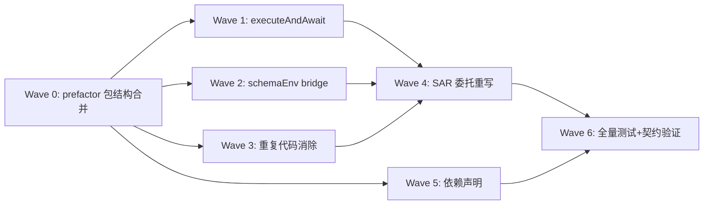

# 执行计划 — T1 包结构合并 + 执行链统一

> refactor 模式。Wave 编排从 code-architecture.md §8 DAG + issues #1~#7 推导。
> 测试验收清单从 §6 test-matrix（来源 A 功能 18 条 + 来源 B NFR 10 条代码测试，另 1 项 onEvent 性能人工观测）全量列全。代码测试合计 28 条。

## Wave 编排总览

### 依赖 DAG 图

### 调度表

| Wave | 切片 | P级 | Blocked by | 并行组 | 说明 |
|------|------|-----|-----------|--------|------|
| 0 | prefactor 包结构合并 | P0 | 无 | — | 创建新包 + 迁移两包文件 + 合并 index.ts/package.json（#1） |
| 1 | executeAndAwait | P1 | Wave 0 | A | SubagentService +executeAndAwait + agent-result-mapper + execute-options-mapper（#2） |
| 2 | schemaEnv bridge | P1 | Wave 0 | A | session-runner RunOptions + runSpawn childEnv 注入（#3） |
| 3 | 重复代码消除 | P1 | Wave 0 | A | 删 live/* + pi-runner + agent-discovery + concurrency-gate withSlot 改造（#5） |
| 4 | SAR 委托重写 | P1 | Wave 1, 2, 3 | B | SubprocessAgentRunner 委托 + ports.ts onEvent 升级 + error-recovery 闭包简化（#4） |
| 5 | 依赖声明更新 | P1 | Wave 0 | A | extension-dependencies.json + coding-workflow 指向（#6） |
| 6 | 全量测试+契约验证 | P2 | Wave 4, 5 | — | BC-1~12 + AC-ARCH-1~5 + 三包测试 + 下游契约（#7） |

### 并行约束
- Wave 1/2/3/5 同属并行组 A（都只依赖 Wave 0，改不同文件无冲突）
- Wave 4 依赖 Wave 1+2+3（SAR 委托需 executeAndAwait + schemaEnv + 重复代码消除就绪）
- Wave 6（验证 Wave）必须最后

### Prefactor Wave 约束（refactor 场景）
- Wave 0 覆盖 code-architecture §7 的所有 move/delete/merge 项
- 迁移带行为等价测试约束（迁移后 tsc 通过 + 现有测试全绿）

---

## Wave 0: prefactor 包结构合并

**切片类型**: prefactor
**P 级覆盖**: P0
**Blocked by**: 无——可立即开始
**并行关系**: 前置，所有后续 Wave 依赖它

### 包含的功能/issue
- Issue: #1（P0，方案 A cp 新建）
- 功能: 创建 extensions/subagents-workflow/，迁移两包文件，合并 index.ts + package.json

### 文件影响
- 创建: `extensions/subagents-workflow/` 全目录结构（execution/ + orchestration/ + interface/ + shared/）
- 创建: `extensions/subagents-workflow/package.json`（version 1.0.0, pi manifest, peerDeps 并集）
- 创建: `extensions/subagents-workflow/index.ts`（注册 3 tool + 2 command + pi.__workflowRun + event 钩子）
- 创建: `extensions/subagents-workflow/agents/`（8 个 agent .md）
- 创建: `extensions/subagents-workflow/skills/`（workflow-script-format）
- 迁移: subagents/src/* → execution/（subagent-service.ts, session-runner.ts, concurrency-pool.ts, agent-registry.ts, model-resolver.ts, execution-record.ts, record-store.ts, worktree/, fork/, sidecar/, notifier.ts 等）
- 迁移: workflow/src/engine/* → orchestration/（launcher.ts, lifecycle.ts, error-recovery.ts, node-ops.ts, budget.ts, jsonl-run-store.ts, models/, worker/, execute-agent-call.ts, workflow-script-registry.ts）
- 迁移: workflow/src/infra/* → orchestration/（subprocess-agent-runner.ts→execution/, pi-runner.ts[待Wave3删], concurrency-gate.ts, jsonl-parser.ts, agent-discovery.ts[待Wave3删], agent-opts-resolver.ts, live/*[待Wave3删]）
- 迁移: 两包 tools/commands/tui → interface/
- 测试: 迁移两包现有测试到对应 __tests__/ 目录

### 覆盖的 test-matrix 用例 ID（完成判定）
- T4.1, T4.2, T4.3（UC-4 subagent tool 回归——迁移后现有测试全绿）
- T5.1（UC-5 pi.__workflowRun 签名不变——迁移后现有测试全绿）
- T5.3（UC-5 pending emit 不变——现有测试全绿）

### 验收标准
- [ ] AC-1.1 [正常]: 新包 3 tool + 2 command 全部注册（trace: UC-1 AC-1.1）
- [ ] AC-1.2 [边界]: pi.extensions 为 `["./index.ts"]`，pi.skills 为 `["./skills"]`（trace: UC-1 AC-1.2）
- [ ] AC-1.3 [正常]: 新包 `tsc --noEmit` 通过
- [ ] AC-1.4 [正常]: 旧两包代码原样保留不动（D-004）
- [ ] 本 Wave 覆盖的 test-matrix 用例 T4.1/T4.2/T4.3/T5.1/T5.3 全 PASS（迁移后现有测试全绿）

---

## Wave 1: executeAndAwait（并行组 A）

**切片类型**: 垂直切片
**P 级覆盖**: P1
**Blocked by**: Wave 0
**并行关系**: 与 Wave 2/3/5 并行（改不同文件）

### 包含的功能/issue
- Issue: #2（P1，方案 A 独立方法）
- 功能: SubagentService +executeAndAwait + agent-result-mapper + execute-options-mapper
- 时序图: code-architecture.md §4 UC-3（executeAndAwait 部分）

### 文件影响
- 创建: `src/execution/agent-result-mapper.ts`（mapToWorkflowAgentResult D-A10）
- 创建: `src/execution/execute-options-mapper.ts`（mapToExecuteOptions D-A2 + mergeTimeoutSignal D-A9）
- 修改: `src/execution/subagent-service.ts`（+ executeAndAwait 方法，含护栏 + 剥离 notify + AgentResult 映射）
- 测试: `src/execution/__tests__/agent-result-mapper.test.ts`（新）
- 测试: `src/execution/__tests__/execute-options-mapper.test.ts`（新）
- 测试: `src/execution/__tests__/subagent-service.test.ts`（扩展 executeAndAwait describe）

### 覆盖的 test-matrix 用例 ID（完成判定）
- T3.1（正常：executeAndAwait 返回 content）
- T3.3（异常：内部失败 → error 不 reject）
- T3.8（异常：嵌套超限 → throw → SAR catch）
- T3.10（正常：不触发 followUp）
- T3.13（NFR：异常分支 finalize 覆盖）
- T3.14（NFR：AgentResult 映射字段对齐）
- T3.15（NFR：pending emit 显式调用）

### 验收标准
- [ ] AC-2.1 [正常]: executeAndAwait 返回 AgentResult.content 正确
- [ ] AC-2.2 [正常]: parsedOutput 正确填充
- [ ] AC-2.3 [异常]: 内部失败 → AgentResult.error（不 reject）
- [ ] AC-2.4 [正常]: 不触发 followUp（BC-11）
- [ ] AC-2.5 [边界]: nestingDepth > MAX_FORK_DEPTH → 拒绝（BC-12）
- [ ] 本 Wave 用例 T3.1/T3.3/T3.8/T3.10/T3.13/T3.14/T3.15 全 PASS

---

## Wave 2: schemaEnv bridge（并行组 A）

**切片类型**: 垂直切片
**P 级覆盖**: P1
**Blocked by**: Wave 0
**并行关系**: 与 Wave 1/3/5 并行

### 包含的功能/issue
- Issue: #3（P1，方案 A RunOptions 扩展）
- 功能: session-runner RunOptions + schemaEnv + runSpawn childEnv 注入 + ExecuteOptions 加 schemaEnv 字段

### 文件影响
- 修改: `src/execution/session-runner.ts`（RunOptions + schemaEnv，runSpawn childEnv 加 PI_WORKFLOW_SCHEMA 注入）
- 修改: `src/execution/types.ts`（ExecuteOptions + schemaEnv?: string）
- 修改: `src/execution/subagent-service.ts`（runAndFinalize 构造 RunOptions 透传 schemaEnv + onEvent）
- 测试: `src/execution/__tests__/session-runner.test.ts`（扩展 schemaEnv 用例）

### 覆盖的 test-matrix 用例 ID（完成判定）
- T3.9（边界：schemaEnv 透传）
- T3.11（状态：不传 schemaEnv → childEnv 无 PI_WORKFLOW_SCHEMA，BC-6）
- T3.16（NFR：schemaEnv 不传时 BC-6 childEnv 等价）

### 验收标准
- [ ] AC-3.1 [正常]: schemaEnv 传入时 childEnv 含 PI_WORKFLOW_SCHEMA
- [ ] AC-3.2 [边界]: schemaEnv 不传时 childEnv 不含 PI_WORKFLOW_SCHEMA（BC-6）
- [ ] 本 Wave 用例 T3.9/T3.11/T3.16 全 PASS

---

## Wave 3: 重复代码消除（并行组 A）

**切片类型**: 垂直切片
**P 级覆盖**: P1
**Blocked by**: Wave 0
**并行关系**: 与 Wave 1/2/5 并行

### 包含的功能/issue
- Issue: #5（P1，D-A7 分类执行）
- 功能: 删 live/* + pi-runner + agent-discovery + extractYamlField + concurrency-gate withSlot 改造

### 文件影响
- 删除: `src/orchestration/live/jsonl-to-agent-event.ts`
- 删除: `src/orchestration/live/execution-record.ts`（迁移 projectLiveProgress 到 execution/execution-record.ts）
- 删除: `src/orchestration/live/types.ts`
- 删除: `src/orchestration/pi-runner.ts`
- 删除: `src/orchestration/agent-discovery.ts`（extractYamlField 随之删，用 execution/agent-registry）
- 修改: `src/orchestration/concurrency-gate.ts`（withSlot 退化为 abort 薄封装，不独立占池）
- 修改: `src/execution/execution-record.ts`（+ projectLiveProgress 迁入）
- 修改: import 路径清理（live/* → execution/，agent-discovery → agent-registry）
- 测试: 现有 concurrency-gate.test.ts 回归（AC-ARCH-5）

### 覆盖的 test-matrix 用例 ID（完成判定）
- T3.20（NFR：withSlot 不独立占池，槽位占用=N 而非 2N）
- T3.21（NFR：projectLiveProgress 迁移保留，live 进度渲染不变）

### 验收标准
- [ ] AC-5.1 [正常]: grep "复制自 extensions/subagents" 0 命中（AC-ARCH-3）
- [ ] AC-5.2 [正常]: grep "function extractYamlField" 只 1 命中（AC-ARCH-2）
- [ ] AC-5.3 [正常]: ConcurrencyGate.withSlot 语义不变（AC-ARCH-5）
- [ ] 本 Wave 用例 T3.20/T3.21 全 PASS

---

## Wave 4: SAR 委托重写

**切片类型**: 垂直切片
**P 级覆盖**: P1
**Blocked by**: Wave 1, 2, 3
**并行关系**: 串行（依赖 Wave 1+2+3 产出）

### 包含的功能/issue
- Issue: #4（P1，方案 A per-session 注入）
- 功能: SubprocessAgentRunner 委托重写 + ports.ts onEvent 升级 + error-recovery 闭包简化
- 时序图: code-architecture.md §4 UC-3（完整委托链）

### 文件影响
- 修改: `src/execution/subprocess-agent-runner.ts`（从 orchestration 迁入 execution MF-3，重写为委托）
- 修改: `src/orchestration/models/ports.ts`（AgentRunner.onEvent 签名 raw→AgentEvent）
- 修改: `src/orchestration/error-recovery.ts`（dispatchAgentCall onEvent 闭包简化，删 jsonlToAgentEvent）
- 修改: `src/orchestration/execute-agent-call.ts`（onEvent 类型跟随 port 升级）
- 创建: `src/shared/agent-event.ts`（AgentEvent 唯一出口 re-export）
- 测试: `src/execution/__tests__/subprocess-agent-runner.test.ts`（重写为 mock SubagentService）
- 测试: `src/orchestration/__tests__/error-recovery.test.ts`（onEvent 闭包简化验证）

### 覆盖的 test-matrix 用例 ID（完成判定）
- T3.2（正常：parsedOutput 透传）
- T3.4（边界：cwd 透传）
- T3.5（边界：model 填底）
- T3.6（异常：timeoutMs 超时 → signal abort → error）
- T3.7（正常：onEvent 桥接 AgentEvent 透传）
- T3.12（e2e real：真实 spawn pi 全链贯穿）
- T3.17（NFR：mergeTimeoutSignal listener 清理）
- T3.18（NFR：dispose 兜底覆盖 workflow 子进程）
- T3.19（NFR：AgentCallOpts→ExecuteOptions 映射保真）

### 验收标准
- [ ] AC-4.1 [正常]: workflow agent() 经委托链完成
- [ ] AC-4.2 [异常]: timeoutMs 超时 → signal abort → AgentResult.error（BC-9）
- [ ] AC-4.3 [正常]: onEvent 桥接 live-record（BC-10）
- [ ] AC-4.4 [边界]: cwd 透传（非 git worktree）
- [ ] AC-4.5 [正常]: model 填底（D-008）
- [ ] AC-4.6 [正常]: dispose 兜底覆盖（M-4）
- [ ] 本 Wave 用例 T3.2/T3.4/T3.5/T3.6/T3.7/T3.12/T3.17/T3.18/T3.19 全 PASS

---

## Wave 5: 依赖声明更新（并行组 A）

**切片类型**: 垂直切片
**P 级覆盖**: P1
**Blocked by**: Wave 0
**并行关系**: 与 Wave 1/2/3 并行

### 包含的功能/issue
- Issue: #6（P1）
- 功能: extension-dependencies.json 更新 + coding-workflow 依赖指向

### 文件影响
- 修改: `extension-dependencies.json`（新增 subagents-workflow 条目 + coding-workflow 指向更新）
- 核对: `extensions/coding-workflow/package.json`（是否有 pi-workflow 类型 import，有则改指）
- 测试: `npx ajv-cli validate` + coding-workflow tsc

### 覆盖的 test-matrix 用例 ID（完成判定）
- T5.2（异常：脚本内 agent 失败 → reason=failed）
- T5.4（NFR：coding-workflow tsc 全绿）

### 验收标准
- [ ] AC-6.1 [正常]: extension-dependencies.json 含 subagents-workflow 条目
- [ ] AC-6.2 [正常]: coding-workflow dependsOn 指向 @zhushanwen/pi-subagents-workflow
- [ ] AC-6.3 [正常]: ajv validate 通过
- [ ] 本 Wave 用例 T5.2/T5.4 全 PASS

---

## Wave 6: 全量测试 + 下游契约验证

**切片类型**: 验收（验收 Wave）
**P 级覆盖**: P2
**Blocked by**: Wave 4, 5
**并行关系**: 必须最后

### 职责
跑全量回归 + 下游契约验证。BC-1~BC-12 + AC-ARCH-1~5 grep 验收 + 三包现有测试 + coding-workflow 集成。

### 文件影响
- 测试: 全量 `pnpm -r test` + `pnpm -r typecheck`
- 测试: `pnpm --filter @zhushanwen/pi-coding-workflow test`（pi.__workflowRun 集成）

### 覆盖的 test-matrix 用例 ID（完成判定）
- 全量代码测试回归（来源 A + 来源 B 共 28 条）

### 验收标准
- [ ] AC-7.1 [正常]: BC-1~BC-12 全量回归测试通过
- [ ] AC-7.2 [正常]: AC-ARCH-1~5 grep 验收全通过
- [ ] AC-7.3 [正常]: pi.__workflowRun 签名 + 返回结构不变（BC-3）
- [ ] AC-7.4 [正常]: subagent tool 行为不变（BC-6）
- [ ] AC-7.5 [正常]: 三包现有测试全绿（G3）
- [ ] 测试验收清单全量用例 PASS

---

## 测试验收清单（MANDATORY）

> 来源 A（功能，18 条）+ 来源 B（NFR，11 条）= 29 条全量。按 Wave 归属 + 测试层分组。
> 供下游 coding-execute 分层验收。

| 用例 ID | 类型 | 测试层 | 场景摘要 | 归属 Wave | dependsOn | parallelGroup |
|---------|------|--------|---------|----------|-----------|--------------|
| T3.1 | 正常 | unit | SAR 委托 executeAndAwait 返回 content | Wave 1 | — | A |
| T3.2 | 正常 | unit | parsedOutput 透传 | Wave 4 | T3.1 | B |
| T3.3 | 异常 | unit | executeAndAwait 内部失败 → error | Wave 1 | T3.1 | A |
| T3.4 | 边界 | unit | cwd 透传（非 git worktree） | Wave 4 | T3.1 | B |
| T3.5 | 边界 | unit | model 填底——opts.model 空 → ctxModel | Wave 4 | T3.1 | B |
| T3.6 | 异常 | unit | timeoutMs 超时 → signal abort → error | Wave 4 | T3.1 | B |
| T3.7 | 正常 | unit | onEvent 桥接 AgentEvent 透传 | Wave 4 | T3.1 | B |
| T3.8 | 异常 | unit | 嵌套超限 → throw → SAR catch → error | Wave 1 | T3.1 | A |
| T3.9 | 边界 | unit | schemaEnv 透传 | Wave 2 | — | A |
| T3.10 | 正常 | unit | 不触发 followUp（BC-11） | Wave 1 | T3.1 | A |
| T3.11 | 状态 | unit | schemaEnv 不传 → childEnv 无 PI_WORKFLOW_SCHEMA | Wave 2 | — | A |
| T3.12 | e2e | real | 真实 spawn pi 全链贯穿 | Wave 4 | T3.1,T3.6,T3.7 | B |
| T3.13 | NFR-稳定性 | integration | executeAndAwait 异常分支 finalize 覆盖 | Wave 1 | T3.3 | A |
| T3.14 | NFR-兼容性 | unit | AgentResult 映射字段对齐 | Wave 1 | — | A |
| T3.15 | NFR-可观测 | integration | pending emit 显式调用 | Wave 1 | T3.1 | A |
| T3.16 | NFR-兼容性 | unit | schemaEnv 不传时 BC-6 childEnv 等价 | Wave 2 | — | A |
| T3.17 | NFR-并发 | integration | mergeTimeoutSignal listener 清理 | Wave 4 | T3.6 | B |
| T3.18 | NFR-稳定性 | integration | dispose 兜底覆盖 workflow 子进程 | Wave 4 | T3.1 | B |
| T3.19 | NFR-兼容性 | unit | AgentCallOpts→ExecuteOptions 映射保真 | Wave 4 | T3.1 | B |
| T3.20 | NFR-并发 | integration | withSlot 不独立占池（槽位=N 非 2N） | Wave 3 | — | A |
| T3.21 | NFR-兼容性 | integration | projectLiveProgress 迁移保留 | Wave 3 | — | A |
| T4.1 | 正常 | unit | tool execute(sync) 行为不变 | Wave 0 | — | — |
| T4.2 | 正常 | unit | tool execute(background) 行为不变 | Wave 0 | — | — |
| T4.3 | 边界 | unit | tool 层 schemaEnv 恒 undefined | Wave 0 | — | — |
| T5.1 | 正常 | unit | pi.__workflowRun 签名 + 返回结构不变 | Wave 0 | — | — |
| T5.2 | 异常 | unit | 脚本内 agent 失败 → reason=failed | Wave 5 | — | A |
| T5.3 | 正常 | unit | pending emit 不变（register/unregister 成对） | Wave 0 | — | — |
| T5.4 | NFR-兼容性 | integration | coding-workflow tsc 全绿 | Wave 5 | — | A |

> onEvent 性能（NFR #4 标「代码测试/人工观测」）以人工观测兜底——Wave 6 集成测试人工观测 WorkflowsView 流畅度。

### 后续迭代（P3 延后）

- Issue T2: 删 sync 模式 + 并发池分层 + 通知合并（独立 topic）
- Issue T3: 预制脚本 + ADR + 文档 + 旧包 deprecated（独立 topic）
