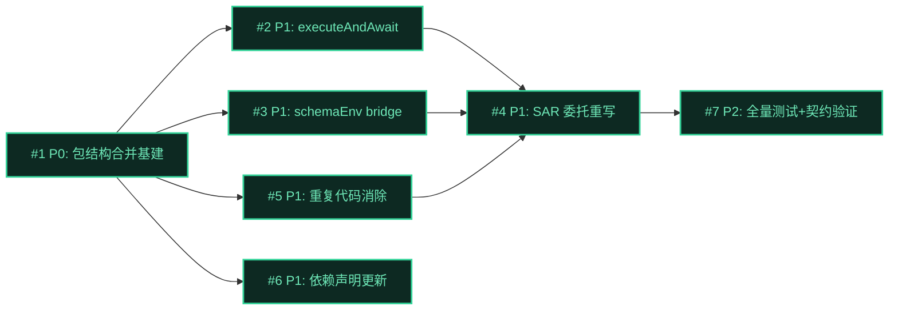

# Issue 决策图 — T1 包结构合并 + 执行链统一

> 本主题是 refactor 模式——架构决策已在 mid-plan 全部拍板（D-000~D-007 + D-A1~D-A10）。
> issues 主要把架构决策落地为可执行的 Wave 任务。fog of war 集中在 M-5（模型解析行为边界）+
> M-6（双重记账范围归属）两个待确认点。

## 地图总览

## 上游覆盖核验（MANDATORY，逐条不漏）

| 上游元素 | 轴 | 对应 issue | 状态 | N/A 理由 |
|---------|----|-----------|------|----------|
| §5: WorkflowRun 状态机 | 状态 | — | N/A | 本 topic 不改状态机（§5 明确） |
| §5: ExecutionRecord 状态机 | 状态 | — | N/A | 本 topic 不改状态机（§5 明确） |
| §7: execution/subagent-service.ts +executeAndAwait | 模块 | #2 | ✅ | — |
| §7: execution/subprocess-agent-runner.ts 委托重写 | 模块 | #4 | ✅ | — |
| §7: execution/session-runner.ts schemaEnv 扩展 | 模块 | #3 | ✅ | — |
| §7: orchestration/live/* 三件套删除 | 模块 | #5 | ✅ | — |
| §7: orchestration/concurrency-gate.ts withSlot 适配 | 模块 | #5 | ✅ | — |
| §7: orchestration/pi-runner.ts 删除 | 模块 | #5 | ✅ | — |
| §7: orchestration/agent-discovery.ts 删除 | 模块 | #5 | ✅ | — |
| §7: index.ts 合并注册 + package.json | 模块 | #1 | ✅ | — |
| §8: coding-workflow pi.__workflowRun 边界 | 边界 | #7 | ✅ | BC-3 回归测试 |
| §8: pending-notifications EventBus 边界 | 边界 | #7 | ✅ | BC-5 回归测试 |
| §8: structured-output schema 边界 | 边界 | #3 | ✅ | D-A6 bridge |
| §10: D-A1 executeAndAwait 定位 | 挑战 | #2 | ✅ | — |
| §10: D-A2 映射放 SAR | 挑战 | #4 | ✅ | — |
| §10: D-A3 resolveAgentOpts 归属 | 挑战 | — | N/A | 红队 review：已存在独立模块，合并不改调用链 |
| §10: D-A4 pending emit | 挑战 | #7 | ✅ | BC-5 回归测试 |
| §10: D-A5 旧包处理 | 挑战 | — | N/A | D-004 确认不动，T3 负责 |
| §10: D-A6 schema bridge | 挑战 | #3 | ✅ | — |
| §10: D-A7 重复代码删除边界 | 挑战 | #5 | ✅ | — |
| §10: D-A8 onEvent 透传 | 挑战 | #4 | ✅ | — |
| §10: D-A9 timeoutMs 合并 signal | 挑战 | #4 | ✅ | — |
| §10: D-A10 AgentResult 映射 | 挑战 | #2 | ✅ | — |
| §11: AC-ARCH-1~5 grep 验收 | 挑战 | #7 | ✅ | 验收清单 |
| §12: BC-1~12 行为契约 | 挑战 | #7 | ✅ | 回归测试覆盖 |
| M-4 子进程 kill 归属 | 迷雾 | #4 | ✅ | SAR 委托后子进程进 spawnedChildren，dispose 兜底覆盖（行为增强非回归） |
| M-5 模型解析归属 | 迷雾 | #4 | ✅ | SAR 构造注入 ctxModel 填底，不调 resolveModel（待 batch-ask 确认行为边界） |
| M-6 双重记账一致性 | 迷雾 | — | N/A | T1 不改 record 生命周期，标 T2 处理（待 batch-ask 确认范围） |

---

## P0 Issues（阻塞项）

### #1: 包结构合并基建

**P 级**: P0
**类型**: 模块
**Blocked by**: 无
**推荐强度**: Strong

#### 问题描述

创建 `extensions/subagents-workflow/` 新包，迁移两包文件到统一目录结构（execution/orchestration/interface 三层），合并 index.ts 注册 + package.json + agents/ + skills/。这是所有后续 issue 的前置——executeAndAwait 需在同包 import SubagentService。

#### 为什么是 P0

不做则 #2~#5 无法在同包内 import，执行链统一无法编译。

#### 方案对比

##### 方案 A: cp 新建 + 手动重组目录（推荐）

**改动**:
- 创建 `extensions/subagents-workflow/`
- 按三层架构复制两包 src 文件（execution/ = subagents core+runtime；orchestration/ = workflow engine；interface/ = 两包 tools/commands/tui 合并）
- 合并 index.ts（注册 3 tool + 2 command + event 钩子 + pi.__workflowRun）
- 合并 package.json（peerDependencies 取并集，version 1.0.0，pi manifest）
- 合并 agents/（8 个）+ skills/（workflow-script-format）

**优点**: 旧包不动（D-004），新包 commit 历史清晰，可逐文件验证迁移正确性
**缺点**: 手动复制量大，需仔细核对 import 路径
**适用场景**: D-004 确认的方案

##### 方案 B: git mv + 改名

**改动**: git mv extensions/subagents → extensions/subagents-workflow，再 merge workflow 文件

**优点**: git 自动追踪 rename
**缺点**: 违反 D-004（旧包不动）；git mv 会删除旧目录

#### 取舍决策

**选择**: 方案 A（cp 新建）
**理由**: D-004 已确认「完全新建，旧包不动」。

#### 验收标准

- [ ] AC-1.1 [正常]（trace: UC-1 AC-1.1）: 新包 3 tool + 2 command 全部注册
- [ ] AC-1.2 [边界]（trace: UC-1 AC-1.2）: pi.extensions 为 `["./index.ts"]`，pi.skills 为 `["./skills"]`
- [ ] AC-1.3 [正常]: 新包 `tsc --noEmit` 通过（import 路径全部正确）
- [ ] AC-1.4 [正常]: 旧两包代码原样保留不动（D-004）

---

## P1 Issues（核心）

### #2: SubagentService +executeAndAwait

**P 级**: P1
**类型**: 模块
**Blocked by**: #1
**推荐强度**: Strong

#### 问题描述

给 SubagentService 新增 `executeAndAwait` 方法，为 workflow 编排层提供 sync-await 接口。内部走 background 管道（acquire 槽 + create record + runSpawn）但：(1) 剥离 notify/followUp 注入（BC-11）；(2) 入口复制嵌套护栏（BC-12）；(3) 返回 workflow AgentResult 形状（D-A10 映射）。

#### 为什么是 P1

执行链统一的核心新增接口。#4 SAR 委托依赖它。

#### 方案对比

##### 方案 A: 独立方法，复用 runSpawn+Pool+record，剥离 notify（推荐）

**改动**:
- 新增 `executeAndAwait(opts: ExecuteOptions, signal?: AbortSignal, onEvent?: (e: AgentEvent) => void): Promise<AgentResult>`
- 入口复制 execute() 的 execCtxAls 嵌套护栏（nestingDepth > MAX_FORK_DEPTH 拒绝）
- 内部：acquire 槽 → create record → session-runner.runSpawn（不调 kickOffBackground/notifier）
- 出口：await record settled → 从 RecordSnapshot 映射 AgentResult（text→content, !success→error?, 保留 parsedOutput/usage/toolCalls）
- onEvent 透传 runSpawn 的 AgentEvent（D-005 live-record 桥接）

**优点**: T2 删 sync 不牵连；workflow 编程式消费者不被注入 followUp；嵌套护栏生效
**缺点**: 与 execute() 有部分逻辑重复（护栏 + 槽 + record 创建）
**适用场景**: D-A1 已确认

##### 方案 B: 复用 execute(sync) + flag 抑制 notify

**改动**: execute(opts) 加 `suppressNotify?: boolean` 参数，sync 路径走

**优点**: 无代码重复
**缺点**: 返回 ExecutionHandle 非 AgentResult（需外层转换）；T2 删 sync 牵连；flag 参数污染 tool 契约

#### 取舍决策

**选择**: 方案 A（独立方法）
**理由**: D-A1 已确认——三处 deletion test 塌点（返回类型不兼容 / spinner 副作用 / T2 耦合）。

#### 验收标准

- [ ] AC-2.1 [正常]（trace: UC-3 AC-3.1）: executeAndAwait 返回 AgentResult.content 正确
- [ ] AC-2.2 [正常]（trace: UC-3 AC-3.2）: parsedOutput 正确填充（structured-output 契约）
- [ ] AC-2.3 [异常]（trace: UC-3 AC-3.3）: 内部失败 → AgentResult.error（不 reject）
- [ ] AC-2.4 [正常]: executeAndAwait 不触发 followUp 注入（BC-11）—— 验证 sendMessage 未被调用
- [ ] AC-2.5 [边界]: nestingDepth > MAX_FORK_DEPTH → 拒绝执行（BC-12）

### #3: session-runner 扩展 schemaEnv 参数（D-A6 bridge）

**P 级**: P1
**类型**: 模块
**Blocked by**: #1
**推荐强度**: Strong

#### 问题描述

session-runner.runSpawn 当前 childEnv = { ...process.env } 不设 PI_WORKFLOW_SCHEMA。executeAndAwait 需在 childEnv 设此 env（D-A6），否则 structured-output 扩展不注册 tool。

#### 方案对比

##### 方案 A: runSpawn RunOptions 新增 schemaEnv 可选参数（推荐）

**改动**:
- RunOptions 加 `schemaEnv?: string`
- runSpawn 构造 childEnv 时：`if (opts.schemaEnv) childEnv.PI_WORKFLOW_SCHEMA = opts.schemaEnv`
- tool 层 execute 不传 schemaEnv → 行为不变（BC-6）

**优点**: 精准注入，不污染 tool 路径
**缺点**: RunOptions 签名扩展

#### 取舍决策

**选择**: 方案 A
**理由**: D-A6 已确认。tool 层不传 schemaEnv 保证 BC-6。

#### 验收标准

- [ ] AC-3.1 [正常]（trace: UC-3 AC-3.2）: schemaEnv 传入时 childEnv 含 PI_WORKFLOW_SCHEMA
- [ ] AC-3.2 [边界]: schemaEnv 不传时 childEnv 不含 PI_WORKFLOW_SCHEMA（BC-6 tool 层不变）

### #4: SubprocessAgentRunner 委托重写

**P 级**: P1
**类型**: 模块
**Blocked by**: #2, #3, #5
**推荐强度**: Strong

#### 问题描述

SubprocessAgentRunner.run 从"直接 spawn pi"改为"委托 SubagentService.executeAndAwait"。包含 5 项适配：(1) AgentCallOpts→ExecuteOptions 映射（D-A2）；(2) onEvent 桥接 AgentEvent→workflow liveRecord（D-A8）；(3) timeoutMs 合并 signal（D-A9）；(4) model 填底（M-5）；(5) schemaEnv 传递（D-A6）。

#### 为什么是 P1

执行链统一的委托端。G2.1 核心。

#### 方案对比

##### 方案 A: SAR 构造注入 per-session 依赖，run 内做全部映射（推荐）

**改动**:
- SubprocessAgentRunner 构造接收 `{ subagentService, agentRegistry, sessionDir, ctxModel }`（per-session）
- run(opts, signal, onEvent):
  - timeoutMs 合并：`if (opts.timeoutMs) { const tc = new AbortController(); setTimeout(() => tc.abort(), opts.timeoutMs); signal = mergeSignals(signal, tc.signal); }`
  - AgentCallOpts→ExecuteOptions 映射：prompt→task, agent, schema→JSON.stringify(schema)→schemaEnv, cwd, model: opts.model ?? ctxModel
  - onEvent 桥接：包装 executeAndAwait 的 AgentEvent → updateFromEvent(liveRecord, event)
  - 调 `this.subagentService.executeAndAwait(mappedOpts, signal, bridgedOnEvent)`
  - 返回 AgentResult（executeAndAwait 已是 workflow 形状）

**优点**: 映射集中在 adapter（D-A2）；per-session 依赖注入清晰
**缺点**: 构造签名变更（dispatchAgentCall 传 runner 处需调整）

#### 取舍决策

**选择**: 方案 A
**理由**: D-A2 已确认映射归 adapter。M-5 model 填底用 ctxModel（不调 resolveModel，避免重复解析 + modelRegistry 依赖）。

#### 验收标准

- [ ] AC-4.1 [正常]（trace: UC-3 AC-3.1）: workflow agent() 经委托链完成
- [ ] AC-4.2 [异常]（trace: UC-3 AC-3.3）: timeoutMs 超时 → signal abort → AgentResult.error（BC-9）
- [ ] AC-4.3 [正常]: onEvent 桥接 live-record，WorkflowsView 实时进度不变（BC-10）
- [ ] AC-4.4 [边界]（trace: UC-3 AC-3.4）: cwd 透传（非 git worktree）
- [ ] AC-4.5 [正常]: model 填底——opts.model 为空时用 ctxModel（M-5 决策）
- [ ] AC-4.6 [正常]: 委托后子进程进 spawnedChildren，dispose 兜底覆盖（M-4 行为增强）

### #5: 重复代码消除（D-A7 分类执行）

**P 级**: P1
**类型**: 模块
**Blocked by**: #1
**推荐强度**: Strong

#### 问题描述

按 D-A7 分类表执行重复代码消除：直接删（live/execution-record + live/types + live/jsonl-to-agent-event + agent-discovery + extractYamlField + pi-runner）/ 适配保留（concurrency-gate withSlot 委托 ConcurrencyPool）/ 保留判断（jsonl-parser）。

#### 方案对比

> D-A7 已逐文件拍板处理方式。本 issue 是落地执行，无根本性方案选择，只列执行清单。

##### 方案 A: 按 D-A7 分类表执行（推荐）

逐文件处理（直接删 / 适配保留 / 有条件删），withSlot 退化为 abort 薄封装不独立占池。

##### 方案 B: 全删 + 重写 withSlot

live/* + pi-runner + agent-discovery + concurrency-gate 全删，withSlot 语义在 error-recovery 内联重写。

**优点**: 更彻底，无遗留适配层
**缺点**: concurrency-gate withSlot 的 signal abort 队列移除逻辑需在 error-recovery 重新实现（约 100 行），风险高；jsonl-parser ParsedPipelineEvent 是输出归一化累加器不能删

#### 取舍决策

**选择**: 方案 A（按 D-A7 分类执行）
**理由**: D-A7 已确认——部分文件 API 不同（concurrency-gate withSlot 闘包式 vs ConcurrencyPool 分离式），全删会破坏 workflow 功能。jsonl-parser 保留（ParsedPipelineEvent 是 SAR/executeAndAwait 输出归一化的数据结构）。

#### 执行清单

| 文件 | 处理 | 前置条件 |
|------|------|---------|
| orchestration/live/execution-record.ts | 删，import execution/execution-record | 处理 projectLiveProgress 差异 |
| orchestration/live/types.ts | 删，import types.ts | — |
| orchestration/live/jsonl-to-agent-event.ts | 删（D-005） | #4 onEvent 桥接上线后 |
| orchestration/agent-discovery.ts | 删，用 execution/agent-registry | D-003 统一策略 |
| extractYamlField 副本 | 删（随 agent-discovery） | — |
| orchestration/pi-runner.ts | 删 | #4 确认 executeAndAwait 覆盖 runPiProcess 能力 |
| orchestration/concurrency-gate.ts | 保留 withSlot，内部委托 ConcurrencyPool | 重建 withSlot 语义 |
| orchestration/jsonl-parser.ts | 保留 | ParsedPipelineEvent 是输出归一化累加器 |

#### 验收标准

- [ ] AC-5.1 [正常]: `grep -rn "复制自 extensions/subagents" extensions/subagents-workflow/src/` 0 命中（AC-ARCH-3）
- [ ] AC-5.2 [正常]: `grep -rn "function extractYamlField" extensions/subagents-workflow/src/` 只 1 命中（AC-ARCH-2）
- [ ] AC-5.3 [正常]: ConcurrencyGate.withSlot 语义不变——signal abort 队列移除 + AbortError（AC-ARCH-5）

### #6: extension-dependencies.json + coding-workflow 依赖声明

**P 级**: P1
**类型**: 流程
**Blocked by**: #1
**推荐强度**: Strong

#### 方案对比

##### 方案 A: 仅改 extension-dependencies.json + 核对 coding-workflow import（推荐）

更新 JSON 元数据 + ajv 校验 + 核对 coding-workflow 对 pi-workflow 的 import 形态。

##### 方案 B: 同时改 coding-workflow package.json dependencies

若 coding-workflow package.json 有 `@zhushanwen/pi-workflow` 硬编码依赖，同步改为 subagents-workflow。

**优点**: 一并解决
**缺点**: coding-workflow 是下游消费者，T1 范围应最小化；若纯运行时消费（pi.__workflowRun）则不需要改

#### 取舍决策

**选择**: 方案 A（最小化改动）
**理由**: 先核对 import 形态——纯运行时消费则只改 extension-dependencies.json；有类型 import 才同步改 coding-workflow package.json（AC-7.5 typecheck 兼底）。

#### 验收标准

- [ ] AC-6.1 [正常]: extension-dependencies.json 含 subagents-workflow 条目
- [ ] AC-6.2 [正常]: coding-workflow dependsOn 指向 @zhushanwen/pi-subagents-workflow
- [ ] AC-6.3 [正常]: `npx ajv-cli validate -s extension-dependencies.schema.json -d extension-dependencies.json` 通过

---

## P2 Issues（重要）

### #7: 全量测试 + 下游契约验证

**P 级**: P2
**类型**: 流程
**Blocked by**: #4, #6
**推荐强度**: Strong

#### 问题描述

合并后跑全量回归：BC-1~BC-12 行为契约 + AC-ARCH-1~5 grep 验收 + 下游消费者（coding-workflow pi.__workflowRun / pending-notifications EventBus）集成测试。

#### 验收标准

- [ ] AC-7.1 [正常]: BC-1~BC-12 全量回归测试通过（12 条行为契约）
- [ ] AC-7.2 [正常]: AC-ARCH-1~5 grep 验收全通过
- [ ] AC-7.3 [正常]（trace: UC-5 AC-5.1）: pi.__workflowRun 签名 + 返回结构不变（BC-3）
- [ ] AC-7.4 [正常]（trace: UC-4 AC-4.1）: subagent tool 行为不变（BC-6）
- [ ] AC-7.5 [正常]: subagents + workflow + pending-notifications 三包现有测试全绿（G3）

---

## 迷雾（待 batch-ask 确认）

### M-5: 模型解析行为边界 ✅ 已决策（D-008）

**状态**: 已确认——executeAndAwait 不调 resolveModel，SAR 用 ctxModel 填底
**决策**: auth 校验由 pi 子进程承担（与合并前 pi-runner --model 等价）。resolveModel JS 层提前校验是 tool 层优化，编排层不需要。

### M-6: 双重记账范围归属 ✅ 已决策（D-009）

**状态**: 已确认——标 T2 处理
**决策**: T1 不改 record 生命周期，只保证正常路径两侧一致。T2「通知合并」统一 record 管理。

---

## 后续迭代（P3 延后项）

- **[P3] 删 sync 模式** — T2：删 wait 参数 / sync 分支 / SyncResponse 类型
- **[P3] 并发池分层配额** — T2：concurrency-pool 改 max(1, maxConcurrent-depth)
- **[P3] 通知合并到 pending-notifications** — T2：删 notifier.ts / 扩展 pending:unregister
- **[P3] 预制脚本** — T3：chain/parallel/scatter-gather/map-reduce
- **[P3] ADR-030 + ADR-026/029 标 superseded** — T3
- **[P3] AGENTS.md/CLAUDE.md 目录更新** — T3（含 M-1 doc/code 漂移订正：subagents in-process→spawn）
- **[P3] 旧包 deprecated 标记 + CHANGELOG** — T3
- **[P3] format utils 统一评估** — T3 或独立清理 PR（红队 review 指出 false DRY，需评估是否真有必要）

---

## 决策记录

> 详细 decisions.md。本 topic issues 阶段关键决策（待 batch-ask 确认后补录）：

| 待确认项 | 推荐 | 分类 | 状态 |
|---------|------|------|------|
| M-5 模型解析行为边界 | SAR ctxModel 填底，auth 校验归 pi 子进程 | D-可逆（D-008） | ✅ confirmed |
| M-6 双重记账范围 | 标 T2 处理 | D-可逆（D-009） | ✅ confirmed |
