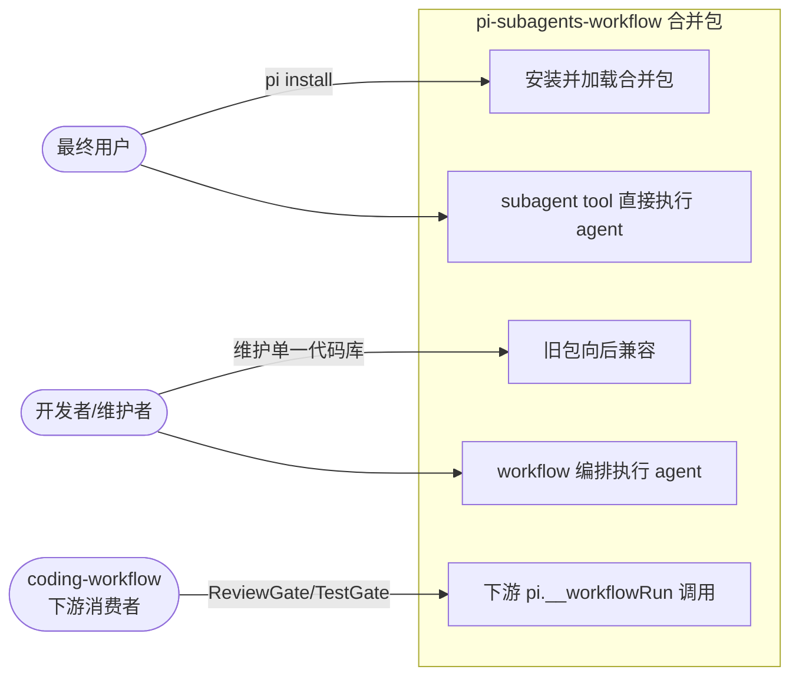
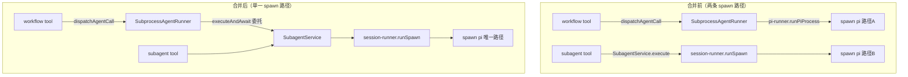
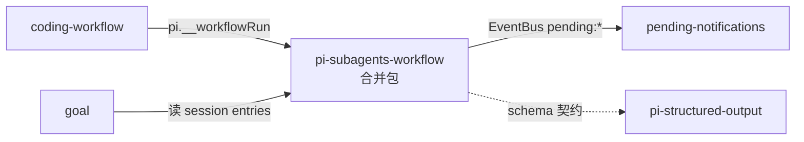

# T1：包结构合并 + 执行链统一

> 三 topic 拆分的第一步。将 `@zhushanwen/pi-subagents` 与 `@zhushanwen/pi-workflow`
> 合并为 `@zhushanwen/pi-subagents-workflow`，并消除两包间约 1200 行重复代码。
> 本 topic **只做结构合并 + 执行链统一**，不涉及 sync 删除 / 并发池改造 / 通知合并 /
> 预制脚本（属 T2/T3）。

## 1. 业务目标（Business Goals）

### 目标树

- **G1: 单包交付** — 两个功能强耦合的 extension 合并为一个 npm 包，消除编译期硬依赖带来的
  发布/加载/维护负担
  - G1.1: 新包 `@zhushanwen/pi-subagents-workflow` 注册原两包全部 tool/command/event
  - G1.2: 旧两包标记 deprecated，保留代码但停止维护
  - 成功标准：`pi install npm:@zhushanwen/pi-subagents-workflow` 单包加载即可获得
    原两包全部能力（subagent tool + workflow tool + workflow-script tool + /subagents
    + /workflows command + pi.__workflowRun）

- **G2: 执行链单一实现** — workflow 的 agent 执行委托 subagents 的 SubagentService，
  消除两条并行的 spawn pi 路径
  - G2.1: `SubprocessAgentRunner.run` 改为委托 `SubagentService.executeAndAwait`
  - G2.2: 消除两包间可安全删除的重复代码（live/execution-record + live/types 自述复制可直接删，约 400 行）；其余重复代码（concurrency-gate/jsonl-parser/pi-runner 等）因 API/输入类型差异保留适配层（详见 system-architecture D-A7）
  - 成功标准：全代码库不再有注释自述「复制自 subagents」的文件；`grep -rn "复制自 extensions/subagents" extensions/subagents-workflow/src/` 0 命中

- **G3: 零功能回归** — 合并后所有现有测试通过，下游消费者（coding-workflow 的
  pi.__workflowRun、pending-notifications 的 EventBus 集成）行为不变
  - 成功标准：subagents + workflow + pending-notifications 三包现有测试全绿；
    coding-workflow 的 ReviewGate/TestFixLoopGate 调 pi.__workflowRun 行为不变

- **G4: workflow 嵌套编排** — 支持多个 workflow 脚本编排成更大 scope 的 workflow，
  实现任意组合的 workflow 编排能力
  - G4.1: 在 workflow 脚本 API 中新增 `workflow()` 函数，用于调用其他 workflow
  - G4.2: 子 workflow 返回 AgentResult，与 subagent 返回格式一致
  - G4.3: 嵌套深度受 MAX_FORK_DEPTH=10 限制，配额受分层配额约束
  - 成功标准：workflow 脚本可通过 `workflow("name", args)` 调用其他 workflow，实现 chain/parallel/scatter-gather 等编排模式

### 达成路线

| 目标 | 路线/策略 | 对应用例 |
|------|---------|---------|
| G1 | 创建新包目录 → 迁移两包文件 → 合并 package.json/依赖声明 → 旧包 deprecated | UC-1, UC-2 |
| G2 | 给 SubagentService 加 executeAndAwait → SubprocessAgentRunner 委托它 → 删 workflow 重复 infra | UC-3, UC-4 |
| G3 | 合并后跑全量测试 + 下游契约验证 | UC-5 |
| G4 | 在 worker-script-builder 中添加 workflow() 函数，内部调 pi.__workflowRun | UC-6 |

## 2. 业务用例（Use Cases）

### 用例图

### UC-1: 安装并加载合并包

- **Actor**: 最终用户（Pi 用户）
- **前置条件**: 用户已安装 Pi
- **主流程**:
  1. 用户执行 `pi install npm:@zhushanwen/pi-subagents-workflow`
  2. Pi 加载新包，注册 subagent tool + workflow tool + workflow-script tool + 2 command
  3. 用户使用 subagent tool / workflow tool，功能与合并前一致
- **替代流程**: 用户此前装了旧两包 → 旧包仍加载（deprecated，不报错），功能去重由用户自行卸载旧包
- **异常流程**: 新包 pi manifest 缺失 → Pi 加载报错（不应发生，G1.1 保证）
- **后置状态**: 单包提供原两包全部能力
- **关联目标**: G1
- **验收标准 (AC)**:
  - AC-1.1 [正常]: `pi install npm:@zhushanwen/pi-subagents-workflow` 后，3 个 tool（subagent/workflow/workflow-script）+ 2 command（/subagents /workflows）全部可用
  - AC-1.2 [边界]: 新包 package.json 的 `pi.extensions` 为 `["./index.ts"]`、`pi.skills` 为 `["./skills"]`（符合 AGENTS.md 红线规范）

### UC-2: 旧包保留不动（不在本 topic 范围）

- **Actor**: 开发者/维护者（后续版本）
- **前置条件**: 新包已发布
- **主流程**: 本 topic 不处理旧包（D-004）。旧两包代码原样保留，后续版本统一清理。
- **关联目标**: 无（移出 T1 范围）
- **验收标准 (AC)**:
  - AC-2.1 [边界]: 旧两包代码原样保留，不做任何改动（D-004 确认）

> **注**: 需求完整性 review MF-3 指出原文档自相矛盾（§7 写「不动」但 UC-2/F3/AC-2.1 写「标记 deprecated」）。
> 已统一为 D-004 口径「旧包不动」。旧包清理（含 deprecated 标记 + CHANGELOG 迁移指引）移到 T3。

### UC-3: workflow 编排执行 agent（执行链统一）

- **Actor**: workflow 脚本（通过 Worker 线程或主线程执行）
- **前置条件**: workflow run 已启动，脚本内调用 `agent({prompt, agent, schema})`
- **主流程**:
  1. Worker 线程 dispatchAgentCall 发送 agent-call 消息到主线程
  2. 主线程 executeAgentCall 调 `SubprocessAgentRunner.run(opts, signal)`
  3. **改造后**: SubprocessAgentRunner.run 委托 `SubagentService.executeAndAwait(opts)`
  4. executeAndAwait 内部走 background 管道（acquire 槽 → session-runner.runSpawn → spawn pi）
  5. executeAndAwait await 完成后返回 AgentResult（content/parsedOutput/usage/error）
  6. SubprocessAgentRunner.run 返回 AgentResult 给 executeAgentCall
- **替代流程**: 无（统一后只有一条路径）
- **异常流程**: executeAndAwait 内部 spawn 失败 → 返回 AgentResult.error（不 reject，契约不变）
- **后置状态**: workflow agent 执行通过 subagents 的执行链完成
- **关联目标**: G2.1
- **验收标准 (AC)**:
  - AC-3.1 [正常]: workflow 脚本内 agent() 调用经统一执行链完成，返回 content 正确
  - AC-3.2 [正常]: agent 调用带 schema 参数时 parsedOutput 正确填充（structured-output 契约不变）
  - AC-3.3 [异常]: agent 超时/abort → 返回 AgentResult.error，workflow error-recovery 正常触发
  - AC-3.4 [边界]: agent 调用带 cwd 参数时 cwd 透传执行正确（ADR-029 契约——spawn 子进程 cwd 绑定，非 git worktree）

### UC-4: subagent tool 直接执行 agent（不受执行链统一影响）

- **Actor**: 主 agent（通过 subagent tool）
- **前置条件**: 用户/主 agent 调用 subagent tool
- **主流程**:
  1. 主 agent 调 subagent tool start action
  2. SubagentService.execute 执行（sync 或 background）
  3. 合并后代码路径不变（SubagentService 本就是 subagents 包的核心）
- **后置状态**: subagent tool 行为与合并前完全一致
- **关联目标**: G3（回归保证）
- **验收标准 (AC)**:
  - AC-4.1 [正常]: subagent tool start（sync/background）行为不变，现有测试全绿

### UC-5: 下游 pi.__workflowRun 调用（契约不变）

- **Actor**: coding-workflow（通过 pi.__workflowRun）
- **前置条件**: coding-workflow 的 ReviewGate/TestFixLoopGate 调 pi.__workflowRun
- **主流程**:
  1. coding-workflow 调 `pi.__workflowRun(scriptName, args, signal, timeoutMs)`
  2. 合并后新包仍挂 `pi.__workflowRun`（签名不变）
  3. runAndWait → runWorkflow → 内部 agent 执行走统一执行链
  4. 返回 WorkflowRunResult（status/reason/scriptResult）
- **异常流程**: 脚本内 agent 失败 → reason=failed（契约不变）
- **后置状态**: coding-workflow 下游零改动
- **关联目标**: G3
- **验收标准 (AC)**:
  - AC-5.1 [正常]: pi.__workflowRun 签名不变，返回 WorkflowRunResult 结构不变
  - AC-5.2 [正常]: coding-workflow 的 ReviewGate 调 pi.__workflowRun 行为不变（现有测试全绿）

### UC-6: workflow 嵌套编排（新增能力）

- **Actor**: workflow 脚本开发者
- **前置条件**: 已有多个独立 workflow 脚本
- **主流程**:
  1. 开发者编写新 workflow 脚本，使用 `workflow()` 函数调用现有 workflow
  2. 新脚本通过 `workflow("workflow-name", { input: ... })` 调用子 workflow
  3. 子 workflow 执行完成后返回 AgentResult（content/parsedOutput/usage/error）
  4. 父 workflow 根据子 workflow 结果继续执行后续 step
- **替代流程**:
  - 并行调用多个 workflow：`Promise.allSettled([workflow("a"), workflow("b")])`
  - 混合调用 workflow 和 subagent：`workflow("a") + agent({prompt: ...})`
- **异常流程**: 子 workflow 失败 → 返回 AgentResult.error（不 reject）→ 父 workflow 的 error-recovery 处理
- **后置状态**: 多个 workflow 可编排成更大 scope 的 workflow
- **关联目标**: G4
- **验收标准 (AC)**:
  - AC-6.1 [正常]: workflow 脚本可通过 `workflow("name", args)` 调用其他 workflow
  - AC-6.2 [正常]: 子 workflow 返回 AgentResult，父 workflow 可读取 content/parsedOutput
  - AC-6.3 [正常]: 子 workflow 失败时返回 error（不 reject），父 workflow 可处理
  - AC-6.4 [边界]: workflow 嵌套深度受 MAX_FORK_DEPTH=10 限制
  - AC-6.5 [边界]: 并发池分层配额生效，深层嵌套配额递减

> **约束**: workflow 脚本格式、API 不能动（Claude Code 兼容）。`workflow()` 是新增函数，不破坏现有 API。

## 3. 数据流转（Data Flow）

### 数据流图

### 数据清单

| 数据 | 来源 | 处理 | 消费者 | 敏感级别 |
|------|------|------|--------|---------|
| AgentCallOpts | workflow Worker dispatchAgentCall | 参数映射为 ExecuteOptions | SubagentService.executeAndAwait | 低 |
| AgentResult | session-runner.runSpawn 输出解析 | JSONL pipeline → AgentResult | workflow executeAgentCall | 低 |
| RecordSnapshot | SubagentService 内部 record store | executeAndAwait 内部消费，不外泄 | （内部） | 低 |

## 4. 功能清单（Features）

| 编号 | 功能 | 对应用例 | 关联目标 |
|------|------|---------|---------|
| F1 | 创建 `extensions/subagents-workflow/` 新包结构 | UC-1 | G1 |
| F2 | 合并两包 package.json + extension-dependencies.json | UC-1 | G1 |
| F3 | 旧包处理（移出 T1，T3 负责） | — | — |
| F4 | SubagentService 新增 `executeAndAwait` 方法 | UC-3 | G2.1 |
| F5 | SubprocessAgentRunner.run 委托 executeAndAwait | UC-3 | G2.1 |
| F6 | 按 D-A7 分类处理重复 infra（直接删/适配保留/有条件删三档） | UC-3 | G2.2 |
| F7 | 合并后全量测试 + 下游契约验证 | UC-4, UC-5 | G3 |
| F8 | workflow() 函数支持 workflow 嵌套编排 | UC-6 | G4 |

## 5. UI/UX 场景（Interface Scenarios）

> 本 topic 是纯架构重构，无新增 UI 交互。现有 TUI 渲染（subagent bg-notify renderer、
> WorkflowsView）保持不变。跳过本节。

## 6. 系统间功能关联（Cross-System）

### 关联图

| 关联系统 | 依赖方向 | 交互方式 | 契约稳定性 | 合并影响 |
|---------|---------|---------|-----------|---------|
| coding-workflow | CW → SWF（pi.__workflowRun） | 编程式 RPC | 稳定（D-8 签名） | 零改动：新包仍挂 __workflowRun |
| pending-notifications | SWF → PN（EventBus） | 事件 | 稳定（pending:register/unregister） | 零改动：事件契约不变（T1 不扩展） |
| pi-structured-output | SWF -.→ SO（schema） | optional peerDep | 稳定 | 零改动 |
| goal | GOAL → SWF（读 entries） | session entries | 稳定 | 零改动 |

## 7. 约束（Constraints）

- **业务约束**:
  - 完全新建 `extensions/subagents-workflow/`，旧两包代码原样保留（不动、不标记 deprecated，后续版本统一清理）
  - 新包版本 1.0.0 从头起（changeset 从空开始）

- **技术约束（仅记录不展开，架构设计见 system-architecture.md）**:
  - 必须用 Pi Extension API（`@mariozechner/pi-coding-agent`），不引入新依赖
  - `pi.extensions` 必须为 `["./index.ts"]`（AGENTS.md 红线规范）
  - 执行链统一不改变 AgentResult / AgentCallOpts 形状（D-12 兼容约束）
  - pi.__workflowRun 签名不变（D-8 约束，coding-workflow 下游硬依赖）

## 8. 不做（Out of Scope）

以下属 T2/T3，本 topic **明确不做**：

- **删 sync 模式**（删 wait 参数 / sync 分支 / SyncResponse 类型）→ T2
- **并发池分层配额改造**（concurrency-pool 改 max(1, maxConcurrent-depth)）→ T2
- **通知机制合并到 pending-notifications**（删 notifier.ts / 扩展 pending:unregister）→ T2
- **ADR-030 撰写 + ADR-026/029 标 superseded** → T3
- **AGENTS.md/CLAUDE.md 目录结构更新** → T3
- **agent .md prompts / coding-workflow skills 文档更新** → T3

## 决策记录

> 详见 `decisions.md`。本 topic 关键决策：

| id | decision | classification | confirmed_by |
|----|----------|----------------|--------------|
| D-000 | 合并为一包（非 package 依赖） | D-不可逆 | ask_user（handoff） |
| D-001 | 本 topic 只做合并+统一，不做删sync/并发池/通知/脚本 | D-不可逆 | ask_user（拆分方案） |
| D-002 | 新包版本号 1.0.0 | D-不可逆 | ask_user |
| D-003 | AgentRegistry 统一为可配置路径+mtime缓存+全路径覆盖 | D-不可逆 | ask_user |
| D-004 | 完全新建新包，旧包不动 | D-可逆 | ask_user |

## 待确认

M-4/M-5/M-6（禁读重建路发现）标为 issues 阶段决策点：
- M-4 子进程 kill 归属迁移（subagents spawnedChildren vs workflow D-4 恢复）
- M-5 模型解析归属（executeAndAwait 是否经 ModelConfigService 三层回退）
- M-6 WorkflowRun + ExecutionRecord 双重记账一致性（或标 T2 处理）
