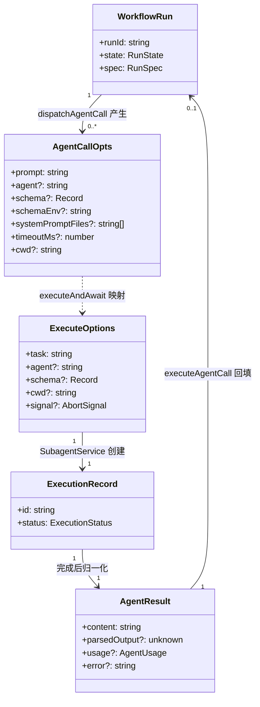
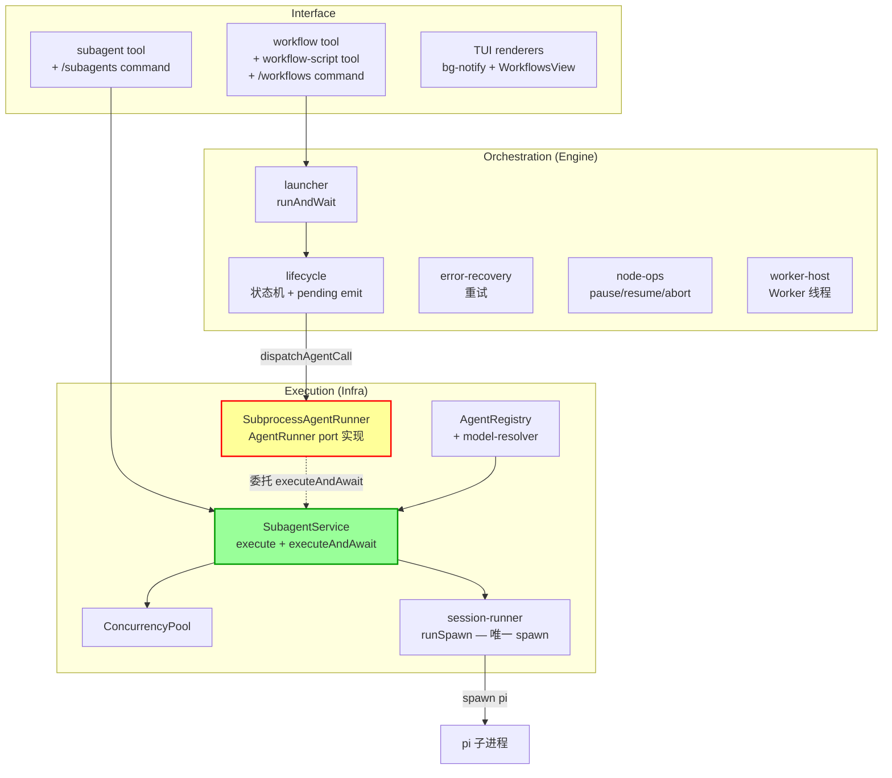
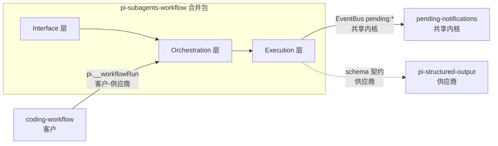
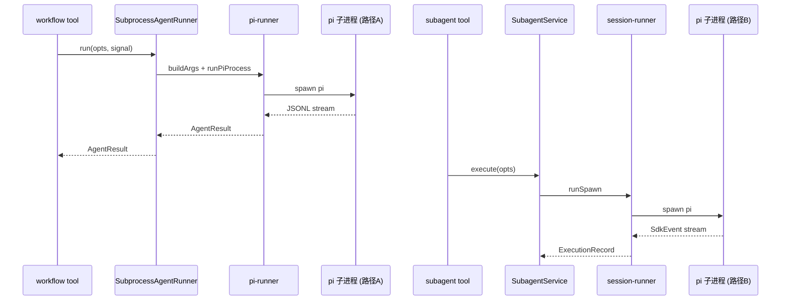
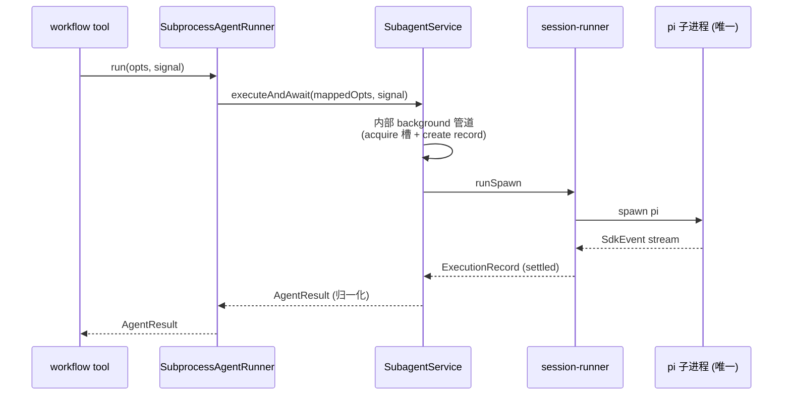

# pi-subagents-workflow 架构设计（T1：包结构合并 + 执行链统一）

> **refactor 模式** — 合并两个已有 extension，保持现有行为等价。本架构文档聚焦：
> (1) 合并后的分层与模块划分；(2) 执行链统一（SubprocessAgentRunner 委托 SubagentService）；
> (3) 重复代码消除的边界决策。

## 1. 目标转换

### 业务目标 → 系统目标

| 业务目标(requirements) | 转换为系统目标 | 衡量标准 |
|----------------------|--------------|---------|
| G1: 单包交付 | 合并后单包注册原两包全部 tool/command/event | 3 tool + 2 command + pi.__workflowRun 可用 |
| G2: 执行链单一实现 | spawn pi 全局唯一路径（session-runner.runSpawn） | grep `child_process.spawn.*pi` 唯一命中 |
| G3: 零功能回归 | 现有测试全绿 + 下游契约不变 | subagents/workflow/pending-notifications 测试 + coding-workflow __workflowRun |

### 搭便车改造目标

| 改造目标 | 动机 | 关联业务目标 | 状态 |
|------|------|-------------|------|
| 统一 extractYamlField（两包各有一份） | 消除重复（真重复，逻辑等价） | G2 | 已纳入（随 agent-discovery 删除） |

> **format utils 统一已移出 T1**（红队 review 指出 false DRY）：两包的 formatElapsedSeconds/formatEventLine 已行为分叉（subagents 有小时分支，workflow 无；ThemeLike 类型不同），强行统一会引入回归或参数化怪物。留 T3 或独立清理 PR 再评估。

## 2. 设计立场

**核心计算是什么？** — agent 调用的执行编排（spawn pi 子进程 → 流式解析 JSONL → 归一化 AgentResult）。

**分层决策：三层架构（非 DDD4 层）**。核心计算是技术流程编排，不是业务规则引擎——
workflow 的 DAG 执行、subagent 的并发池管理、pi 子进程 spawn 都是技术流程编排，
不涉及复杂的领域规则聚合。三层足够：

| 层 | 职责 | 合并后来源 |
|----|------|-----------|
| **Interface** | tool/command 注册、TUI 渲染、session 事件钩子 | 两包 index.ts 合并 |
| **Orchestration**（Engine） | workflow DAG 状态机、budget、error-recovery | workflow engine/ |
| **Execution**（Infra） | SubagentService、ConcurrencyPool、session-runner spawn | subagents core/ + runtime/ |

> **关键决策**：执行链统一后，Orchestration 层的 agent 执行**委托** Execution 层的 SubagentService。
> 这是合并的架构本质——workflow 的 `SubprocessAgentRunner`（Orchestration 调用 Execution 的 adapter）
> 从"自己 spawn pi"变为"委托 SubagentService.executeAndAwait"。

## 3. 统一语言（Ubiquitous Language）

> 引用项目根 CONTEXT.md。本次新增/修改术语：

| 术语 | 含义 | 变更 |
|------|------|------|
| 执行链（Execution Chain） | tool execute → spawn pi → 解析 → AgentResult 的完整路径 | 合并前两条，合并后一条 |
| executeAndAwait | SubagentService 新增方法：内部走 background 管道但返回 Promise<AgentResult>（sync-await 接口，供 workflow 编排层用） | 新增 |
| SubprocessAgentRunner | workflow 的 AgentRunner port 实现——合并后从"直接 spawn"变为"委托 SubagentService" | 职责变更 |
| AgentRunner port | workflow Engine 定义、Infra 实现的 agent 执行接口（run(opts, signal): Promise<AgentResult>） | 保留（port 不变，实现变） |
| workflow() | workflow 脚本 API 新增函数，用于调用其他 workflow 实现嵌套编排。内部调用 pi.__workflowRun() | 新增 |
| 分层配额 | ConcurrencyPool 配额按嵌套深度递减：max(1, maxConcurrent-depth)，默认 maxConcurrent=6 | T2 新增 |

## 4. 核心模型

| 模型 | 类型 | 不变式 | 建模理由 |
|------|------|--------|---------|
| WorkflowRun | aggregate | I2: done 时 reason 必有；状态转换受 transition 表约束 | workflow 编排的聚合根，合并后不变 |
| ExecutionRecord | aggregate | status 单调转换；终态不可回退 | subagent 执行记录，合并后不变 |
| AgentCallOpts | DTO | 形状不变（D-12 兼容） | workflow → execution 的参数契约 |
| AgentResult | DTO | 形状不变（D-12 兼容） | execution → workflow 的返回契约 |
| ExecuteOptions | DTO | 合并后新增 executeAndAwait 消费场景 | subagent tool → SubagentService 的参数 |

### 模型关联图



### 并发池分层配额模型

> T2 实现，T1 架构设计中预留。

| 参数 | 值 | 说明 |
|------|-----|------|
| maxConcurrent | 6 | 顶层默认配额（比原来 4 更大，支持更多并行 step） |
| depth 衰减公式 | `max(1, maxConcurrent - depth)` | 每层嵌套减 1，保底 1 槽位 |
| MAX_FORK_DEPTH | 10 | 嵌套深度硬限制，防止无限递归 |

**配额表**（maxConcurrent=6）：

| depth | 有效配额 | 场景 |
|-------|---------|------|
| 0 | 6 | 顶层 workflow/subagent |
| 1 | 5 | 一层嵌套 |
| 2 | 4 | 二层嵌套 |
| 3 | 3 | 三层嵌套 |
| 4 | 2 | 四层嵌套 |
| 5 | 1 | 五层嵌套（保底） |
| 6+ | 1 | 更深层嵌套（保底） |

**死锁防护原理**：
- 顶层 workflow 有 6 个并行 step，每个 step 持有 1 个槽位
- 嵌套 workflow(depth=1) 有效配额=5，但父 step 已持有 1 个槽位，实际可用=5
- 如果嵌套 workflow 也有 5 个并行 step，恰好用满配额，不会死锁
- 深层嵌套配额递减，确保父层持有的槽位不被子层耗尽

### 降级决策（主动不建模）

| 概念 | 为什么不建模 | 应有的处理 |
|------|------------|-----------|
| ConcurrencyPool 内部队列项 | 纯实现细节，T2 会重写（分层配额） | T1 保持现状，不改并发池模型 |

## 5. 状态流转

> 本 topic 不改状态机。WorkflowRun 和 ExecutionRecord 的状态流转保持不变。
> T2 会改 ExecutionRecord 的 mode（删 sync），但不在本 topic 范围。

### 合并后保持不变的状态机

#### WorkflowRun 聚合根

**Status 枚举**（只描述阶段）：`created → running → done`

**Reason 字段**（终态原因，与 Status 正交）：done 时必有 reason

| Reason 值 | 语义 |
|----------|------|
| completed | 脚本正常返回 |
| failed | worker error / script error |
| aborted | 外部 signal / abort |
| budget_limited | token/time 预算耗尽 |
| time_limited | 墙钟超时 |

**合法转换**：running→{paused, done}；paused→{running, done}；done→[]（终态）

#### ExecutionRecord 聚合根

**Status 枚举**：`running → ended`

**Reason 字段**（ended 时终态原因）：completed / failed / cancelled / crashed

**合法转换**：running→ended（终态不可回退）

## 6. 分层架构

### 层级图



> **黄色 SAR = 改造点**（从直接 spawn 变为委托）。
> **绿色 SS = 扩展点**（新增 executeAndAwait 方法）。

### Port 清单

| Port | 价值定位 | 合并前实现数 | 合并后实现数 | 变更 |
|------|---------|------------|------------|------|
| AgentRunner | workflow Engine 与 agent 执行解耦（可 mock 测试） | 1（SubprocessAgentRunner 直接 spawn） | 1（SubprocessAgentRunner 委托 SubagentService） | 实现变更，port 不变 |
| RunStore | workflow 持久化解耦 | 1（JsonlRunStore） | 1（不变） | 不变 |
| WorkerHost | workflow Worker 线程解耦 | 1（WorkerHostImpl） | 1（不变） | 不变 |

> **AgentRunner port 保留**：证伪三连验证——
> - **删**：去掉 port，Engine 直接依赖 SubagentService → 测试需 mock SubagentService 全部方法，复杂度上升 → port 真实
> - **翻**：依赖方向不能反（Engine 是稳定方，infra 指向它）→ 真边界
> - **挪**：port 卡在 Engine/Infra 自然接缝 → 真边界

## 7. 模块划分与变化轴

### 合并后目录结构

```
extensions/subagents-workflow/
├── index.ts                  # 工厂入口：注册 3 tool + 2 command + event 钩子
├── package.json              # @zhushanwen/pi-subagents-workflow
├── agents/                   # agent .md prompts（来自 subagents，8 个）
├── skills/                   # workflow-script-format skill（来自 workflow）
├── src/
│   ├── execution/            # 执行层（原 subagents core+runtime 合并 + SAR 归此）
│   │   ├── subagent-service.ts       # SubagentService（+ executeAndAwait）
│   │   ├── subprocess-agent-runner.ts  # AgentRunner port 实现，委托 SubagentService（MF-3：从 orchestration 移入 execution）
│   │   ├── concurrency-pool.ts       # 并发池（T1 不改，T2 改分层）
│   │   ├── session-runner.ts         # 唯一 spawn 实现（runSpawn）
│   │   ├── pi-invocation.ts          # getPiInvocation
│   │   ├── agent-registry.ts         # 唯一 agent 发现（删 workflow 副本）
│   │   ├── model-resolver.ts         # 唯一模型解析
│   │   ├── model-config-service.ts
│   │   ├── execution-record.ts       # 唯一（删 workflow 副本）
│   │   ├── worktree/
│   │   ├── fork/
│   │   ├── record-store.ts
│   │   ├── sidecar/
│   │   └── notifier.ts               # T1 保留（T2 删）
│   │
│   ├── orchestration/       # 编排层（原 workflow engine）
│   │   ├── launcher.ts              # runAndWait
│   │   ├── lifecycle.ts             # 状态机 + pending emit
│   │   ├── error-recovery.ts        # 重试
│   │   ├── node-ops.ts              # pause/resume/abort
│   │   ├── budget.ts
│   │   ├── jsonl-run-store.ts
│   │   ├── models/                  # WorkflowRun/RunSpec/ports/types（AgentRunner port 定义在此）
│   │   ├── worker/                  # WorkerHostImpl + worker-script-builder
│   │   └── workflow-script-registry.ts
│   │
│   ├── interface/
│   │   ├── tools/
│   │   │   ├── subagent-tool.ts
│   │   │   ├── workflow-tool.ts
│   │   │   └── workflow-script-tool.ts
│   │   ├── commands/
│   │   └── tui/
│   │
│   └── shared/               # 合并后共享 utils（extractYamlField 统一随 agent-discovery 删除）
│
└── [重复代码处理策略——详见 §10 D-A7]
    ├── orchestration/live/execution-record.ts  # ← 删（自述复制，用 execution/ 版，但需处理 projectLiveProgress 差异）
    ├── orchestration/live/types.ts             # ← 删（自述复制子集，用 types.ts）
    ├── orchestration/live/jsonl-to-agent-event.ts # ← 删（D-005：executeAndAwait 直接出 AgentEvent，不再需 raw→AgentEvent 翻译）
    ├── orchestration/jsonl-parser.ts           # ← 保留（ParsedPipelineEvent 是 executeAndAwait 输出归一化的累加器）
    ├── orchestration/concurrency-gate.ts       # ← 保留 withSlot 封装层，内部委托 ConcurrencyPool（API 不同，见 D-A7）
    ├── orchestration/agent-discovery.ts        # ← 删（用 agent-registry，D-003 已定统一策略）
    └── [extractYamlField 副本随 agent-discovery 删除]
```

> **⚠️ 删除策略修正**（基于 workflow research 深度对比）：并非所有重复文件都能直接删。
> live/execution-record + live/types 注释自述复制且逻辑同构，可直接删（处理 projectLiveProgress 差异）；
> 但 jsonl-to-agent-event / jsonl-parser / concurrency-gate / pi-runner 因 API/输入类型差异需保留或适配（见 D-A7）。
> pi-runner 删除的前提是 executeAndAwait 从 session-runner 抽取 spawn-args 构建逻辑。

### 模块变化轴

| 模块 | 职责 | 变化轴 | LOC(预估) |
|------|------|--------|----------|
| execution/subagent-service.ts | agent 执行编排（mode 分叉、池、通知） | 执行策略（sync/bg）、并发模型 | +80（executeAndAwait） |
| execution/session-runner.ts | spawn pi 唯一实现 | pi CLI 参数、JSONL 解析 | 不变 |
| orchestration/subprocess-agent-runner.ts | AgentRunner port 实现——委托 SS | 执行委托方式 | -90 重写为委托 |
| orchestration/lifecycle.ts | WorkflowRun 状态机 | 状态转换规则、pending emit | 不变 |
| orchestration/error-recovery.ts | agent 调用重试 | 重试策略 | -5（删 withSlot 改委托） |
| orchestration/launcher.ts | runAndWait 编程入口 | 超时/signal 处理 | 不变 |

## 8. 系统间上下文边界（Context Map）



| 关联系统 | 关系模式 | 交互方式 | 契约稳定性 | 合并影响 |
|---------|---------|---------|-----------|---------|
| coding-workflow | 客户-供应商（CW 是客户） | pi.__workflowRun RPC | 稳定（D-8） | 零改动 |
| pending-notifications | 共享内核（EventBus） | pending:register/unregister 事件 | 稳定 | 零改动（T1 不扩展契约） |
| pi-structured-output | 供应商（optional） | schema env | 稳定 | 零改动 |
| goal | 零改动只读 | 读 session entries（只读查询） | 稳定 | 零改动 |

## 9. 泳道图（Swimlane）

### 合并前：两条 spawn 路径



### 合并后：单一 spawn 路径（执行链统一）



> **关键点**：executeAndAwait 内部走 background 管道（acquire 槽、create record、emit pending），
> 但对外暴露 sync-await 接口（返回 Promise<AgentResult>）。这是"background 管道 + sync 等待"
> 的组合——不是新增第三种 mode，而是 background 执行的编程式消费接口。
> T2 删 sync 模式后，executeAndAwait 成为唯一的编程式执行入口（tool 层用 execute，编排层用 executeAndAwait）。

## 10. 挑战与决策

### D-A1: executeAndAwait 的定位——新增方法 vs 复用 execute

**张力**: SubagentService.execute 已支持 sync 模式（wait:true），是否复用它而非新增方法？
**决策**: 新增 `executeAndAwait` 独立方法，不复用 execute(sync)。
**理由**:
- execute(sync) 的 sync 路径有额外副作用（onUpdate 回流、SubagentResultComponent spinner、
  嵌套 sync onUpdate 抑制）——这些是 **tool 层交互**的关切，workflow 编排层不需要
- executeAndAwait 需返回 AgentResult（workflow 契约），而 execute 返回 ExecutionHandle
  （tool 契约）——返回类型不同
- T2 删 sync 后，execute(sync) 路径会被删除；如果 executeAndAwait 复用 sync 路径，
  T2 删 sync 时会牵连 executeAndAwait。独立方法让 T2 的删 sync 干净利落
- **不复用 kickOffBackground**（M-2 修正）：kickOffBackground 内部调 notifier.notify →
  sendMessage({customType:"subagent-bg-notify", deliverAs:"followUp"}) 往主对话注入消息。
  workflow 是编程式消费者（await Promise），不需要也不应该被注入 followUp。
  executeAndAwait 剥离 notify 路径，仅复用 runSpawn + ConcurrencyPool + record 创建
- **保留嵌套护栏**（M-3 修正）：executeAndAwait 入口复制 execute() 的 execCtxAls
  嵌套深度检查（nestingDepth > MAX_FORK_DEPTH 拒绝）。workflow 脚本可递归调 agent，
  无护栏会资源耗尽
- 内部共享 runSpawn + ConcurrencyPool + record 创建逻辑，但入口（护栏 + 无 notify）
  和出口（AgentResult 映射）不同

> **估点修正**（红队 review）：+80 行偏高。核心逻辑是「护栏 + background 管道（无 notify）+
> await runAndFinalize + AgentResult 映射」，runAndFinalize 已存在，主要是包一层 +
> text→content/success→error? 映射（~15 行）。预估 50-60 行（含护栏）。

### D-A2: AgentCallOpts → ExecuteOptions 映射放哪层

**张力**: 参数映射逻辑放 SubprocessAgentRunner（Orchestration 层）还是 SubagentService（Execution 层）？
**决策**: 放 SubprocessAgentRunner。SubagentService 的 ExecuteOptions 是稳定的内部契约，不为 workflow 的 AgentCallOpts 做适配。
**理由**:
- AgentCallOpts 是 workflow 的 DTO（含 systemPromptFiles/schemaEnv 等 workflow 特有字段）
- ExecuteOptions 是 subagent 的 DTO（含 appendSystemPrompt/fork/worktree 等 subagent 特有字段）
- 映射是 adapter 职责，属于调用方（SubprocessAgentRunner 是 AgentRunner port 的 adapter 实现）
- 保持 SubagentService 接口稳定——不为每个新调用方加适配逻辑

### D-A3: workflow 的 resolveAgentOpts（agent/skill/schema inline override 解析）归属

**张力**: workflow 的 `resolveAgentOpts`（把 agent({agent,skill,schema}) 解析成 systemPromptFiles/skillPath/schemaEnv）合并后放哪？
**决策**: 放 Orchestration 层（subprocess-agent-runner.ts 或独立 resolve-agent-opts.ts），在调 executeAndAwait 前完成解析，映射到 ExecuteOptions。
**理由**:
- resolveAgentOpts 依赖 AgentRegistry（BL-1 per-session）+ sessionDir + activeTempFiles（临时文件）
- 这些是 workflow Worker 编排的上下文，不是 SubagentService 的关切
- SubagentService.executeAndAwait 接收已解析的 ExecuteOptions（agent 名 + skill 路径 + schema），
  不关心 override 是怎么解析的

### D-A4: pending emit 在 executeAndAwait 路径的处理

**张力**: executeAndAwait 走 background 管道，会触发 emitPendingRegister/emitPendingUnregister。workflow 编排层调 executeAndAwait 时，pending 注册/注销是否与 workflow 自己的 pending emit 冲突？
**决策**: executeAndAwait 内部正常 emit pending（与 tool 层 execute 一致）。workflow 的 pending emit（lifecycle/error-recovery）独立，不冲突——两者 id 不同（subagentId vs runId）。
**理由**:
- pending-notifications 按 id 区分，subagent 执行和 workflow run 是不同的 pending 项
- T1 不改 pending 机制（T2 才合并通知），所以 executeAndAwait 的 pending emit 保持 background 管道原样
- T2 通知合并时会统一处理（删 notifier.ts、扩展 pending:unregister），T1 只是确保不引入新的 pending 冲突

### D-A5: 旧包处理策略

**张力**: 合并后旧两包怎么处理？
**决策**: 完全新建 `extensions/subagents-workflow/`，旧两包代码原样保留不动（不标记 deprecated，后续版本统一清理）。
**理由**:
- 用户明确要求「完全新建 extension，历史的可以不用动」
- 旧包原样保留避免下游 typecheck/加载报错
- 新包从零建（cp 新建），commit 历史清晰
- 后续版本（T3 或独立清理 PR）再处理旧包删除

### D-A8: onEvent 透传与 live-record 桥接（D-005 落地）

**张力**: executeAndAwait 委托后，workflow 的 live-record TUI 进度数据通路断裂——subagents onEvent 发强类型 AgentEvent，workflow 期望 raw JSONL。
**决策**: 保留 live-record TUI 进度。给 executeAndAwait 增加类型化 onEvent 回调（发 AgentEvent），SubprocessAgentRunner 把 AgentEvent 桥接回 workflow liveRecord（调 updateFromEvent）。
**理由**:
- live-record 驱动 WorkflowsView agent 实时进度，是 workflow 核心 UX
- executeAndAwait 直接出 AgentEvent（session-runner handleSdkEvent 已有此出口），比 raw JSONL 更结构化
- live/jsonl-to-agent-event.ts 可删（不再需 raw→AgentEvent 翻译，executeAndAwait 直接出 AgentEvent）
- live/execution-record.ts 保留（workflow 的 liveRecord 用）或改用 execution/ 版本（需处理 projectLiveProgress 差异）

### D-A9: timeoutMs 承接落点（D-006 落地）

**张力**: AgentCallOpts.timeoutMs 合并后无落点（ExecuteOptions/RunOptions 无此字段）。
**决策**: SubprocessAgentRunner 委托前把 timeoutMs 合并进传给 executeAndAwait 的 AbortSignal。
**理由**:
- timeoutMs 当前只 workflow 消费（subagent tool 用 maxTurns + graceTurns）
- signal 是 runSpawn 已有的 abort 通道（session-runner opts.signal.addEventListener("abort", onAbort)）
- 不改 ExecuteOptions 签名 = 不跨包改动，T1 范围可控
- YAGNI：若未来 subagent tool 层需要 per-call timeout，那时再上提 ExecuteOptions

### D-A10: AgentResult 双类型映射

**张力**: 需求 review MF-1 发现两包 AgentResult 互斥——workflow 用 `content`/`error?`/`parsedOutput?`/`usage?`/`toolCalls?`，subagents 用 `text`/`success`/`turns`/`sessionFile?`/`toolCalls`（异型）。
**决策**: executeAndAwait 返回 workflow 侧 AgentResult 形状（content 字段），内部从 subagents 形状（text/success）转换。
**理由**:
- executeAndAwait 是 workflow 编排层接口，返回 workflow AgentResult
- subagents 内部管道拿到 RecordSnapshot 后映射：text→content、!success→error、保留 parsedOutput/usage/toolCalls
- workflow 下游消费者（worker-script-builder.ts:120 `parsedOutput ?? content`）零改动

### D-A6: schema 机制 bridge（executeAndAwait 必须设 PI_WORKFLOW_SCHEMA env）

**张力**: workflow 用 PI_WORKFLOW_SCHEMA env 激活 structured-output 扩展注册 tool；subagents 用 formatSchemaInstruction 注入 task 文本但不设 env。合并后 executeAndAwait 走 subagents 的 session-runner.runSpawn，不设 PI_WORKFLOW_SCHEMA 会导致 structured-output tool 不注册。
**决策**: executeAndAwait 映射 schema 时，在 childEnv 设 PI_WORKFLOW_SCHEMA（与 workflow 当前行为等价）。formatSchemaInstruction 保留作为文本提示（belt-and-suspenders）。
**理由**:
- structured-output 扩展 index.ts:216 只在 `process.env[ENV_SCHEMA]` 存在时注册 tool
- subagents 当前 runSpawn 的 childEnv = { ...process.env } 不设 PI_WORKFLOW_SCHEMA
- executeAndAwait 为 workflow 编排层服务，必须保持 schema enforcement 等价
- session-runner.runSpawn 需扩展：接收 schemaEnv 参数，注入 childEnv

### D-A7: 重复代码删除边界——直接删 vs 适配保留

**张力**: workflow research 深度对比发现，两包重复代码的 API/输入类型存在差异，并非全部可直接删除。简单删会破坏 workflow 功能。
**决策**: 按文件分类处理：

| 重复文件 | 处理方式 | 理由 |
|--------|---------|------|
| live/execution-record.ts | **直接删**，用 execution/execution-record.ts | 注释自述「零改动复制」，逻辑同构。需处理 projectLiveProgress 差异（workflow 独有，改为消费 project） |
| live/types.ts | **直接删**，用 types.ts | 注释自述「复制子集」，类型完全同构 |
| live/jsonl-to-agent-event.ts | **删**（D-005 确认后） | executeAndAwait 直接出 AgentEvent（session-runner handleSdkEvent 出口），不再需 raw→AgentEvent 翻译。SubprocessAgentRunner 桥接 AgentEvent→workflow liveRecord |
| jsonl-parser.ts | **保留** | ParsedPipelineEvent 累加器是 SubprocessAgentRunner/executeAndAwait 输出归一化的数据结构，session-runner 用 updateFromEvent 是不同机制 |
| concurrency-gate.ts | **保留 withSlot 封装层**，内部委托 ConcurrencyPool | withSlot(fn,signal) 是闭包式（fn 包在槽位里 + signal abort 队列移除），ConcurrencyPool acquire/release 是分离式 + 优先级队列。语义不同，需在 ConcurrencyPool 上重建 withSlot 语义或保留适配层 |
| pi-runner.ts | **删**，但前提是从 session-runner 抽取 spawn-args 构建 | pi-runner 是纯函数三件套(buildArgs/resolveInvocation/runPiProcess)；session-runner 把 spawn 内联在 runSpawn。删除前需确认 executeAndAwait 完整覆盖 runPiProcess 的能力（per-call timeoutMs 合并、abort signal 传播、exitCode 归一） |
| agent-discovery.ts | **直接删**，用 agent-registry | D-003 已定统一策略 |

**理由**:
- 粗暴全删是过度简化——workflow research 证实 API 差异不是简单的 import 路径问题
- 真正零改动复制的只有 live/execution-record + live/types（注释自述 + 逻辑同构）
- 其余重复代码需适配层，否则破坏 workflow 的 Worker 线程 / ConcurrencyGate.withSlot / onEvent 实时进度等独有能力
- 重复代码约 1200 行中，可直接删的约 400 行（live 三件套 + extractYamlField），其余 800 行需适配层或保留

## 11. 反模式检查（grep 验收清单）

### AC-ARCH-1: spawn pi 路径归一（非唯一）
- 验证：合并后 `grep -rn "child_process.spawn" extensions/subagents-workflow/src/` 命中 session-runner.ts（subagent 执行链）+ subprocess-agent-runner.ts 内的 pi-runner runPiProcess（过渡期保留，D-A7）
- 目标：executeAndAwait 上线后 subprocess-agent-runner 的 spawn 被委托取代（但 pi-runner 的 runPiProcess 可能作为 session-runner 的底层保留）

### AC-ARCH-2: 无重复 extractYamlField
- 验证：`grep -rn "function extractYamlField" extensions/subagents-workflow/src/` 只 1 个命中

### AC-ARCH-3: live/execution-record + live/types 已删
- 验证：`grep -rn "复制自 subagents\|复制自 extensions/subagents" extensions/subagents-workflow/src/` 0 命中

### AC-ARCH-4: pi.__workflowRun 仍挂载
- 验证：`grep -rn "__workflowRun" extensions/subagents-workflow/src/index.ts` 命中

### AC-ARCH-5: ConcurrencyGate.withSlot 语义不变
- 验证：workflow error-recovery dispatchAgentCall 的 withSlot 调用行为不变（signal abort 队列移除 + AbortError 语义）

## 12. Workflow 嵌套支持

### 设计目标

支持多个 workflow 脚本编排成一个更大 scope 的 workflow。核心约束：workflow 脚本格式、API 不能动（Claude Code 兼容）。

### 统一模型

```
Subagent = 最简单的 Workflow（单步：一个 prompt）
Workflow = 复杂的 Subagent（多步：DAG of prompts）
```

两者共享同一执行管道（SubagentService → session-runner.runSpawn → spawn pi），
区别仅在于脚本复杂度。

### 嵌套机制

**新增 `workflow()` 函数**（扩展，非修改）：

```javascript
// workflow-a.workflow.js（大 scope workflow，CommonJS 脚本格式）
const step1 = await workflow("workflow-b", { input: "data-from-a" });
const step2 = await agent({ prompt: `基于 ${step1.content} 做分析` });
const step3 = await workflow("workflow-c", { input: step2.content });
return { content: step3.content };
```

**实现机制**：

```typescript
// worker-script-builder.ts 中构建脚本 API
const workflow = async (name: string, args?: Record<string, unknown>) => {
  return await pi.__workflowRun(name, args, signal, timeoutMs);
};
```

**执行链路**：
```
workflow-a.js 调用 workflow("workflow-b", ...)
  → pi.__workflowRun("workflow-b", ...)
    → launcher.runAndWait()
      → lifecycle.runWorkflow()
        → Worker thread 执行 workflow-b.js
          → 每个 step 调 SubagentService.executeAndAwait()
            → session-runner.runSpawn() → spawn pi 子进程
              → (可继续嵌套调用 workflow/subagent)
```

### 关键设计点

**1. `workflow()` 返回 AgentResult**：

```typescript
interface AgentResult {
  content: string;        // workflow 最终输出
  parsedOutput?: unknown; // structured-output 解析结果
  usage?: AgentUsage;     // token 使用
  error?: string;         // 错误信息
}
```

**2. 信号传播**：父 workflow 的 abort signal 传播到子 workflow。

**3. 预算传播**：token/time 预算从父 workflow 传播到子 workflow（可选）。

**4. 并发池交互**：子 workflow 的 step 使用同一个 ConcurrencyPool，depth+1。

**5. Claude Code 兼容性**：
- 现有 API 不变：`agent()`、`task()` 等函数签名和行为不变
- 新增 API：`workflow()` 函数是扩展，不破坏兼容性
- 脚本格式不变：CommonJS 顶层 `return`（`require()` + `$ARGS` + top-level `await`），`agent()`/`workflow()` 由 Pi 运行时注入作用域

### 编排模式示例

**Chain 模式**：
```javascript
// chain.workflow.js — 顺序编排
const a = await workflow("data-collection", { source: "api" });
const b = await workflow("data-analysis", { data: a.content });
const c = await workflow("report-generation", { analysis: b.content });
return { content: c.content };
```

**Parallel 模式**：
```javascript
// parallel.workflow.js — 并行编排（parallel() 返回 AgentResult[]，部分失败不 reject）
const results = await parallel([
  workflow("task-a", { input: "..." }),
  workflow("task-b", { input: "..." }),
  workflow("task-c", { input: "..." }),
]);
const content = results.map(r => r.error ? `[FAIL] ${r.error}` : r.content).join("\n");
return { content };
```

**Scatter-Gather 模式**：
```javascript
// scatter-gather.workflow.js — 分发-收集
const splitResult = await workflow("split-data", { data: "..." });
const chunks = splitResult.parsedOutput || JSON.parse(splitResult.content);
const results = await parallel(
  chunks.map(chunk => workflow("process-chunk", { chunk }))
);
const content = results.map(r => r.error ? `[FAIL] ${r.error}` : r.content).join("\n");
return { content };
```

## 13. 行为契约保持清单（refactor 模式）

### BC-1: AgentResult 形状不变
| 字段 | 内容 |
|------|------|
| 源码位置 | workflow `engine/models/types.ts:163` AgentResult |
| 处理 | 保持 |
| 冲突 | 无 |

### BC-2: AgentCallOpts 形状不变
| 字段 | 内容 |
|------|------|
| 源码位置 | workflow `engine/models/types.ts:70` AgentCallOpts |
| 处理 | 保持（D-12 兼容） |
| 冲突 | 无 |

### BC-3: pi.__workflowRun 签名不变
| 字段 | 内容 |
|------|------|
| 源码位置 | workflow `src/index.ts` pi.__workflowRun 声明 |
| 处理 | 保持（D-8 签名，coding-workflow 硬依赖） |
| 冲突 | 无 |

### BC-4: SubprocessAgentRunner.run 签名（BC-1/BC-2 推论，不独立测试）
> 红队 review 指出 BC-4 是 BC-1+BC-2 的推论：opts 形状不变 + result 形状不变 → run 签名不可能变。
> 但 onEvent 参数行为见 BC-live-progress（D-005 保留 onEvent 透传）。

### BC-5: workflow pending emit 行为不变
| 字段 | 内容 |
|------|------|
| 源码位置 | workflow lifecycle.ts/error-recovery.ts/index.ts 的 pending emit 点 |
| 处理 | 保持（T1 不改 pending 机制） |
| 冲突 | 无 |

### BC-6: subagent tool 行为不变
| 字段 | 内容 |
|------|------|
| 源码位置 | subagents tools/subagent-tool.ts |
| 处理 | 保持（sync/bg/list/cancel 全部不变） |
| 冲突 | 无（T2 才删 sync） |

### BC-7: workflow error-recovery 重试行为不变
| 字段 | 内容 |
|------|------|
| 源码位置 | workflow engine/error-recovery.ts dispatchAgentCall |
| 处理 | 保持（withSlot 改委托后，重试逻辑不变——error-recovery 调的是 executeAgentCall → SubprocessAgentRunner.run，run 内部怎么执行 SS 不关心） |
| 冲突 | onEvent 闭包依赖 live-record（D-005 已确认保留 onEvent 透传，live/execution-record 保留或改用 execution/ 版本） |

### BC-8: structured-output schema 契约保持
| 字段 | 内容 |
|------|------|
| 源码位置 | SubprocessAgentRunner schema → PI_WORKFLOW_SCHEMA env → parsedOutput |
| 处理 | 保持（executeAndAwait 设 PI_WORKFLOW_SCHEMA env + session-runner.runSpawn 扩展接收 schemaEnv 参数，见 D-A6） |
| 冲突 | 无（D-A6 已确认 gap 并给出 bridge 方案） |

### BC-9: per-call timeoutMs 行为保持（D-006）
| 字段 | 内容 |
|------|------|
| 源码位置 | workflow SubprocessAgentRunner.run L58-59（opts.timeoutMs setTimeout → controller.abort）|
| 处理 | 保持——SubprocessAgentRunner 委托前把 timeoutMs 合并进传给 executeAndAwait 的 AbortSignal |
| 冲突 | 无 |

### BC-10: workflow live-record TUI 进度保持（D-005）
| 字段 | 内容 |
|------|------|
| 源码位置 | workflow error-recovery.ts L208-281 onEvent 闭包 → liveRecord → WorkflowsView |
| 处理 | 保持——executeAndAwait 带类型化 onEvent（发 AgentEvent），SubprocessAgentRunner 桥接回 workflow liveRecord。live/jsonl-to-agent-event.ts 可删（executeAndAwait 直接出 AgentEvent） |
| 冲突 | 无（D-005 已确认保留路径） |

### BC-11: executeAndAwait 不触发 followUp 注入（M-2 修正）
| 字段 | 内容 |
|------|------|
| 源码位置 | subagent-service.ts kickOffBackground → notifier.sendMessage（followUp）|
| 处理 | 保持——executeAndAwait 剥离 notify 路径，workflow 编程式消费者不被注入 bg-notify 消息 |
| 冲突 | 无 |

### BC-12: executeAndAwait 经嵌套护栏（M-3 修正）
| 字段 | 内容 |
|------|------|
| 源码位置 | subagent-service.ts execute() 入口 execCtxAls 护栏（nestingDepth > MAX_FORK_DEPTH 拒绝）|
| 处理 | 保持——executeAndAwait 入口复制同一护栏，workflow 递归调 agent 仍受限 |
| 冲突 | 无 |

## 下游衔接

### 喂给 Step 3（Issue 拆分）的部分

| 本文档章节 | issue 拆分用途 |
|-----------|--------------|
| §6 分层架构 + §7 模块划分 | Wave 拆分依据（Execution 层先于 Orchestration 层委托） |
| §9 泳道图 | 验证 executeAndAwait 委托链正确性 |
| §10 D-A1~D-A6 | 每个决策对应一个 issue 的方案约束 |
| §11 反模式检查 AC | 测试用例的验证清单 |
| §12 BC-1~BC-8 | 回归测试的覆盖清单 |
