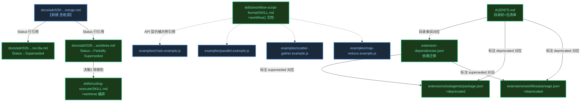

# 代码架构设计 — T3 预制脚本 + 文档/ADR

> **refactor / 纯文档脚本主题**。T3 不引入新运行时代码、新运行时模型、新状态机。
> 核心计算是「把 T1/T2 的架构决策固化为可追溯文档 + 可复用模板 + 一致的配置」。
> 因此本 code-arch 关注三类**契约**：(A) 预制脚本的内容契约；(B) 文档/配置的结构契约；
> (C) 覆盖上述契约的测试矩阵。骨架（§9）是**可校验的内容骨架**（.example.js 能过 lintScript、
> .md/.json 结构完整），不是 Level-1 接线骨架（无 .ts 运行时代码可接）。
>
> 决策基线：`decisions.md` D-030~D-033R + `system-architecture.md` §2/§4/§5。
> 上游接口契约：T1 `code-architecture.md`（workflow() 函数签名 §3 worker-script-builder；
> executeAndAwait 执行链 §4 UC-3）、T2 `code-architecture.md`（ConcurrencyPool 分层配额
> §2.1、pending:unregister §2.3）。

## 0. 与标准 code-arch 模板的偏差声明

| 标准章节 | T3 处置 | 理由 |
|---------|---------|------|
| §1 工程目录 | ✅ 保留（文件组织） | 13 项交付物的归属目录 |
| §2 包依赖图 | ⚠️ 改为「文档/配置引用图」 | 无新 .ts import，但文档/配置间有引用关系需锁定 |
| §3 API 契约 | ⚠️ 改为「内容契约」 | 无函数签名；契约 = 每个交付物的必含字段/章节/约束 |
| §4 功能时序图 | ⚠️ 改为「交付物→AC 追溯链」 | 无运行时时序；追溯链替代（UC→交付物→AC→测试） |
| §5 Deep Module | ⚪ N/A（降级决策） | 静态资源无 Interface/Depth/Seam，system-architecture §4 已说明 |
| §6 测试矩阵 | ✅ 保留（MANDATORY） | 文档/脚本/配置的可校验性测试，按 unit/integration/e2e 分层 |
| §7 现有代码映射 | ✅ 保留（refactor） | ADR superseded + 旧包 deprecated 的处置 |
| §8 下游衔接 | ✅ 保留 | Wave DAG 喂给 execution-plan |
| §9 骨架覆盖核验 | ⚠️ 改为「内容骨架覆盖」 | 双向对应 §3 内容契约 ↔ code-skeleton/ 文件 |

## 1. 工程目录

T3 交付物分布在 4 个目录层级（无新目录创建——`examples/` 由 T1 随新包创建，T3 只填内容）：

```
extensions/subagents-workflow/
├── examples/                                    # 【T3 填内容】预制脚本模板
│   ├── chain.example.js                         # UC-1 / #1
│   ├── parallel.example.js                      # UC-2 / #1
│   ├── scatter-gather.example.js                # UC-3 / #1
│   └── map-reduce.example.js                    # UC-4 / #1
├── skills/
│   └── workflow-script-format/
│       └── SKILL.md                             # 【T3 改内容】UC-9 / #4
├── package.json                                 # 【T1 建，T3 验 files 含 examples/】AC-1.4
└── src/                                         # T1/T2 代码，T3 不动
extensions/coding-workflow/
└── skills/coding-execute/
    └── SKILL.md                                 # 【T3 改内容】UC-11 / #5（跨包：worktree 编排转移）
extensions/subagents/
├── package.json                                 # 【T3 改】+ deprecated / UC-10 / #8
└── CHANGELOG.md                                 # 【T3 改】+ 迁移指引 / UC-10 / #8
extensions/workflow/
├── package.json                                 # 【T3 改】+ deprecated / UC-10 / #8
└── CHANGELOG.md                                 # 【T3 改】+ 迁移指引 / UC-10 / #8
docs/adr/
├── 026-two-package-architecture-no-l3a.md       # 【T3 改 Status】完全 superseded / UC-6 / #3
├── 029-full-workflow-takeover-with-worktree.md  # 【T3 改 Status】部分 superseded / UC-6 / #3
└── 030-subagents-workflow-merge.md              # 【T3 新建】UC-5 / #2
（根）
├── AGENTS.md                                    # 【T3 改】目录树 + 包清单 + 关键约束 / UC-7 / #6
└── extension-dependencies.json                  # 【T3 改】+迁移+标注 / UC-8 / #7
```

**目录归属裁决**（来自 system-architecture §5 + issues #1/#4/#5/#6）：
- `examples/`（非 `scripts/`）——避免与 AGENTS.md 根级 `scripts/`（运维脚本）语义混淆；模板是参考实现，不进 `workflows/` 发现路径（不污染用户 `workflow list`）
- workflow-script-format skill 归新包（T1 迁移，T3 填 workflow() 文档）
- coding-execute skill 归 coding-workflow（跨包编辑，内容来自 ADR-029 决策 2 转移）
- ADR 归 `docs/adr/`（项目级，append-only）

## 2. 文档/配置引用图

> 无 .ts import 关系，但文档/配置间存在**引用一致性约束**（一处错则多处误导）。
> 本图锁定引用方向，作为 §6 integration 测试的校验对象。



**引用规则（锁）**：
- **ADR-030 是合并决策的真相源**——ADR-026/029 的 Status 行 + 说明段必须引用 ADR-030（单向，ADR-030 不反向引用它们的内部决策细节，只在被 superseded 清单里点名）
- **ADR-029 决策 2 转移到 coding-execute skill**——知识不丢失，skill 内容回链 ADR-029（"来自 ADR-029 决策 2"）
- **AGENTS.md ↔ extension-dependencies.json 双向一致**——两处的包清单必须对齐（新包都有、旧包都标 deprecated/superseded），§6 T7.x/T8.x 交叉校验
- **SKILL.md API 契约 ↔ examples/ 示例对齐**——skill 教 workflow() API 用法（简洁），examples/ 展示完整模式（含错误处理），两者**分工不矛盾**（D-031）：skill 的 chain/parallel 基础示例 ≠ examples/ 的完整脚本
- **禁止**：ADR-026/029 正文被改写（append-only，只改 Status + 加说明段）

**循环引用检测点**：ADR-030→ADR-026/029（单向）；SKILL.md←examples（单向被引用）。无环。

## 3. 内容契约（Content Contracts / API 签名）

> 替代标准 §3 API 签名表。每项契约 = 交付物的必含字段/章节/约束。
> 骨架见 `code-skeleton/`，§9 双向核验。

### 3.A 预制脚本契约（4 个 .example.js，UC-1~UC-4 / #1）

#### 契约: WorkflowExampleScript（所有 4 模板共用）

| 字段/结构 | 要求 | 边界条件 | 关联 AC |
|----------|------|---------|---------|
| `meta` 声明 | `{ name, description, phases }` 顶层 const；`name` 必须 === 文件名 stem | name 不匹配 → 用户困惑 | AC-1.1 |
| `require()` | 若需 Node 内置模块（fs/path）则顶部 require()，无 ESM import | parallel 无文件操作可无 require | AC-1.1 |
| `$ARGS` 入参 | 含 $ARGS 字段读取示例 + 必填校验（缺失 throw 友好消息） | 缺参 → 返回 error 不 crash | AC-1.3 |
| 编排入口 | 含 ≥1 个 `agent(`/`parallel(`/`pipeline(` 调用（lintScript entry-point 硬要求） | 无入口 → lintScript error | AC-1.2 |
| `workflow()` 展示 | 每模板展示 workflow() 嵌套编排（T1 新能力，模板核心价值） | 不展示 → 失去模板意义 | AC-1.1 |
| 顶层 await | 直接 top-level await，**禁止 bare IIFE**（lintScript error） | bare IIFE → 子进程被 kill | AC-1.2 |
| 变量命名 | **禁止用 `result` 作变量名**（lintScript 对 `result.output/.parsedOutput/.content` 报 error） | 用 result → lint error | AC-1.2 |
| try-catch | 主体包 try-catch，catch 返回 `{ status:"error", error, phase }` 不 throw | 不 catch → workflow abort | AC-1.3 |
| `phase()` 调用 | 每逻辑段前调 `phase(name)`（TUI 分组） | 无 phase → TUI 无分组 | AC-1.1 |
| `description` 命名 | agent/workflow 调用的 description 用 kebab-case，无 round 后缀 | 不规范 → TUI 不可读 | AC-1.1 |
| `schema` 用法 | 需结构化输出时用 `schema`（非 outputSchema）；返回值是 parsed 对象 | 用 outputSchema → lint error | AC-1.2 |
| 行数 | 每模板 ≤ 80 行（含注释） | >100 → skill 规范建议拆分 | — |

#### 契约: chain.example.js（UC-1）

| 段 | 内容 | 编排原语 |
|----|------|---------|
| 段 1 | `workflow("step-a", args)` → 出 raw | workflow() |
| 段 2 | `workflow("step-b", {raw: a.content})` → 出 normalized | workflow() |
| 段 3 | `workflow("step-c", {normalized: b.content})` → 出 final | workflow() |
| 段 4 | `agent({prompt, schema})` 校验/汇总（兼满足 lint entry-point + 真实模式：chain 末端 verify） | agent() |

**链路**：inputPath → a.content → b.content → c.content → verify → return。每步输出作下步输入（AC-1.1）。

#### 契约: parallel.example.js（UC-2）

| 段 | 内容 | 编排原语 |
|----|------|---------|
| 段 1 | `parallel([workflow("analyze-a"), workflow("analyze-b"), workflow("analyze-c")])` | parallel() + workflow() |
| 注释 | 说明分层配额规则：maxConcurrent=6, depth=N 时配额=max(1,6-N)；来源 T2 system-architecture §并发池分层配额 | — |

**配额注释硬要求**（AC-2.3）：脚本顶部或 parallel 调用上方必须有注释含 `maxConcurrent=6` 与 `max(1, 6-N)` 字样（§6 T2.4 grep 校验）。

#### 契约: scatter-gather.example.js（UC-3）

| 段 | 内容 | 编排原语 |
|----|------|---------|
| 段 1 scatter | `workflow("split", args)` → 出 shards[] | workflow() |
| 段 2 process | `parallel(shards.map(s => workflow("process", {shard:s})))` | parallel() + workflow() |
| 段 3 gather | `workflow("merge", args)` → 出 merged | workflow() |

**三段结构硬要求**（AC-3.1）：脚本必须含 split → parallel process → merge 三段，§6 T3.3 grep 校验三个 phase。

#### 契约: map-reduce.example.js（UC-4）

| 段 | 内容 | 编排原语 |
|----|------|---------|
| 段 1 map | `parallel(items.map(i => workflow("map", {item:i})))` → mapped[] | parallel() + workflow() |
| 段 2 reduce | `workflow("reduce", args)` → 出 reduced | workflow() |

**两段结构硬要求**（AC-4.1）：脚本必须含 parallel map → reduce 两段。

### 3.B 文档/配置契约

#### 契约: ADR-030（UC-5 / #2，`docs/adr/030-subagents-workflow-merge.md`）

| 章节 | 必含内容 | 边界条件 | 关联 AC |
|------|---------|---------|---------|
| `Status` | `Accepted` | 单调（不改回 Proposed） | AC-5.1 |
| `Context` | T1/T2/T3 三主题拆分背景；两包合并动机；执行链统一需求 | — | AC-5.2 |
| `Decision` | **4 项核心决策**：(1) 合并为一包；(2) 统一执行链（SAR 委托 SS）；(3) 分层配额 + workflow 嵌套；(4) 删 sync + 通知合并。**+ L3A 承接**（ADR-026 Decision 段放弃的 L3A 能力合并进单包） | 4 项缺一不可 | AC-5.2 |
| `Consequences` | 正面（单包交付/执行链单一/嵌套能力）+ 负面（旧包迁移成本/包体积） | — | AC-5.2 |
| 并发上限来源 | 标注 `maxConcurrent=6` 来源 = T2 system-architecture §并发池分层配额 | 无来源 → 读者不知据何而定 | AC-2.4 / AC-5.2 |
| 前置引用 | 引用 ADR-026（完全 superseded）+ ADR-029（部分 superseded） | — | AC-5.3 |

#### 契约: ADR-026 superseded 标记（UC-6 / #3）

| 改动 | 内容 |
|------|------|
| Status 行 | `Accepted` → `Superseded by ADR-030` |
| 说明段 | 顶部加「Superseded by ADR-030」段，说明两包架构→单包合并 + L3A 能力合并进单包 |
| 正文 | **保留不动**（append-only） |

#### 契约: ADR-029 部分 superseded 标记（UC-6 / #3，D-033R）

| 改动 | 内容 |
|------|------|
| Status 行 | `Proposed` → `Partially superseded by ADR-030` |
| 说明段 | 顶部加段，**逐决策标注**：决策 2（worktree 编排）→ 被取代（转移到 coding-execute skill）；决策 1（per-call cwd）→ 仍有效（types.ts:417/subagent-service.ts:302 已实现）；决策 3（cw 渐进式调用）/决策 4（test 调度字段进 plan.json）/决策 5（砍 pending-env 状态）/决策 6（store WAL+busy_timeout）→ 均仍有效（与合并正交） |
| 正文 | **保留不动** |

**D-033R 精确性硬要求**（AC-3.3）：说明段必须逐决策列出被取代/仍有效，不许笼统「整体 superseded」。

#### 契约: workflow-script-format skill 更新（UC-9 / #4）

| 新增段落 | 内容 | 关联 AC |
|---------|------|---------|
| `workflow()` 函数文档 | 签名 `workflow(name, args?) => Promise<AgentResult>`；返回类型与 agent() 一致（content/parsedOutput/usage/error）；信号/预算从父 workflow 继承 | AC-9.1 |
| parallel() 上限 | 4 → 6（来源 T2 maxConcurrent=6） | AC-9.2 |
| chain/parallel 基础示例 | 简洁示例（教 API 用法，≠ examples/ 完整脚本） | AC-9.3 |

#### 契约: coding-execute skill 更新（UC-11 / #5）

| 新增段落 | 内容 | 来源 | 关联 AC |
|---------|------|------|---------|
| worktree 编排模式 | 4 phase 结构（setup/dev/test+review/cleanup）+ 原生 `git worktree add/remove`（不依赖 .bare）+ finally cleanup | ADR-029 决策 2 原文 | AC-11.1/11.2 |

#### 契约: extension-dependencies.json 更新（UC-8 / #7）

| 改动 | 内容 | 关联 AC |
|------|------|---------|
| 新增条目 | `@zhushanwen/pi-subagents-workflow`，dependsOn: pi-structured-output(runtime) + pi-pending-notifications(optional) | AC-8.1 |
| 迁移 | coding-workflow dependsOn: `@zhushanwen/pi-workflow`(runtime) → `@zhushanwen/pi-subagents-workflow`(runtime) | AC-8.2 |
| 标注 | 旧两包（pi-workflow/pi-subagents）条目加 `supersededBy` 注记（保留条目） | AC-8.4 |
| schema 合法 | 通过 `npx ajv-cli validate -s extension-dependencies.schema.json -d extension-dependencies.json` | AC-8.3 |

#### 契约: AGENTS.md 更新（UC-7 / #6）

| 改动 | 内容 | 关联 AC |
|------|------|---------|
| 目录树 | extensions/ 结构图新增 `subagents-workflow/` 条目 | AC-7.1 |
| 包清单表 | 新增 `@zhushanwen/pi-subagents-workflow` 行；旧两包行标 deprecated | AC-7.2 |
| 关键约束段 | 「两个 spawn 例外」描述改为「单包单执行链」（T1/T2 已合并执行链） | — |
| check-structure | `bash .githooks/check-structure` 通过 | AC-7.3 |

#### 契约: 旧包 deprecated（UC-10 / #8）

| 文件 | 改动 | 关联 AC |
|------|------|---------|
| 旧两包 package.json | 顶层加 `"deprecated": "Use @zhushanwen/pi-subagents-workflow instead. ..."` 字段 | AC-10.1/10.2 |
| 旧两包 CHANGELOG.md | 新增条目记录 deprecated 版本 + 迁移路径（卸载旧两包→装新包→功能等价） | AC-10.3 |

## 4. 交付物→AC 追溯链（替代运行时时序图）

> T3 无运行时时序。用追溯链表达「每个 UC 的交付物如何满足其 AC，如何被 §6 测试校验」。

### UC-1~UC-4：预制脚本（关联 #1）

```
用户读 examples/chain.example.js
  → meta + workflow() 调用 + 注释（满足 AC-1.1）
  → 用户复制到 .pi/workflows/，改 workflow 名
  → workflow run chain --args inputPath=...
  → 脚本 top-level await 跑 workflow("step-a") → step-b → step-c → agent verify
  → try-catch 兜底：任一步 throw → catch 返回 {status:"error"} 不 crash（AC-1.3）
  → lintScript 在 run 前校验：有 agent() 入口 + 无 bare IIFE + 无 result.output（AC-1.2）
```

**异常路径**（每个 → 一个 §6 测试用例）：
- 缺 $ARGS.inputPath → throw → catch → return error（T1.3）
- 脚本含 bare IIFE → lintScript error → workflow refuse run（由 T1.2 lintScript 正向覆盖）
- workflow("step-b") 失败 → b.error 非空 → catch → return error（T1.3）

### UC-5：ADR-030（关联 #2）

```
开发者写 docs/adr/030-...md
  → Status: Accepted（AC-5.1）
  → Context（合并背景）+ Decision（4 项核心决策 + L3A 承接）+ Consequences（AC-5.2）
  → 并发上限标注来源 T2 system-architecture §并发池分层配额（AC-2.4）
  → 引用 ADR-026/029 为前置（AC-5.3）
  → §6 T5.x 校验：四节齐全 + 4 决策关键词 grep + 来源标注
```

### UC-6：ADR-026/029 superseded（关联 #3，blocked by #2）

```
开发者改 ADR-026 Status → "Superseded by ADR-030"（AC-6.1）
开发者改 ADR-029 Status → "Partially superseded by ADR-030"（AC-6.2）
  + 说明段逐决策标注（决策2取代/决策1仍有效/决策3-6逐条标注仍有效）（AC-3.3）
  → 正文保留不动（append-only）
  → §6 T6.x 校验：Status 行 + 逐决策标注 grep
```

### UC-7/UC-8/UC-9/UC-10/UC-11：文档/配置/skill（关联 #4~#8）

各自直链交付物→AC→§6 测试，结构同上（无跨段数据流）。

**关联**：
- requirements: UC-1~UC-11
- issues: #1~#8
- NFR: 来源 B 占位（§6）

## 5. Deep Module 设计决策

> ⚪ N/A（降级决策）。T3 交付物均为静态资源（.example.js 模板）或文档（ADR/AGENTS.md）或配置（json），
> 无运行时 Interface/Depth/Seam/Port 概念。system-architecture §4 已明确「预制脚本模板=static resource（DTO，无不变式）」、
> 「ADR-030=document（aggregate，Status 单调）」、「DeprecatedPackage=metadata（DTO，deprecated 不可逆）」。
>
> 唯一的"深度"考量：**examples/ 与 SKILL.md 示例的分工边界**（D-031）——
> SKILL.md 示例 = 教 workflow() API 用法（3-5 行极简）；examples/ = 完整模式参考（含错误处理/分层配额注释/多段编排）。
> 两者不重复、不矛盾。此边界在 §3.A 契约 + §6 T9.3 测试中锁定。

## 6. 测试矩阵（Test Matrix）— [MANDATORY]

> T3 是纯文档/脚本主题，测试聚焦**可校验性**（结构完整 / 引用一致 / lint 通过 / 端到端可 run）。
> 测试层（mid-detail 体系）：
> - **unit** — 纯逻辑/结构校验（grep 字段、ADR 章节标题、json schema 字段存在性）
> - **integration** — 模块间校验（lintScript 校验脚本、ajv 校验 json、check-structure 校验 AGENTS.md）
> - **e2e** — 端到端（用户复制脚本到 .pi/workflows/ 后 `workflow run`）
> - **perf-chaos** — T3 无性能测试（全标 N/A）

### 来源 A：功能用例（按 UC 归类）

#### UC-1: chain 模板（关联 §3.A chain / §4 UC-1）

| 用例 ID | 类型 | 测试层 | 场景 | 输入 | 预期 | 关联 AC | dependsOn | parallelGroup |
|---------|------|--------|------|------|------|---------|-----------|--------------|
| T1.1 | 正常 | unit | chain.example.js 含 meta + workflow() + phase | 读文件源码 | grep 命中 `name: "chain"` + ≥2 处 `workflow(` + `phase(` | AC-1.1 | — | EX |
| T1.2 | 正常 | integration | chain.example.js 通过 lintScript | lintScript(source) | valid=true，无 error finding | AC-1.2 | T1.1 | EX |
| T1.3 | 边界 | unit | chain 含 try-catch 返回 error 对象 | grep source | 命中 `catch` + `status: "error"` 或 `error:` | AC-1.3 | T1.1 | EX |
| T1.5 | 边界 | unit | chain 含 require() 无 ESM import | grep source | 命中 `require(`，无 `import ` 关键字 | AC-1.1 | T1.1 | EX |
| T1.6 | e2e | e2e | 用户复制 chain 到 .pi/workflows/ + workflow run | args=inputPath | 脚本可被 workflow 引擎加载 | AC-1.1 | T1.2 | E2E |
| T1.7 | 边界 | integration | package.json files 含 examples/ | `npm pack --dry-run` 或 jq .files | tarball 含 examples/*.example.js | AC-1.4 | T1.1 | EX |

#### UC-2: parallel 模板（关联 §3.A parallel / §4 UC-2）

| 用例 ID | 类型 | 测试层 | 场景 | 输入 | 预期 | 关联 AC | dependsOn | parallelGroup |
|---------|------|--------|------|------|------|---------|-----------|--------------|
| T2.1 | 正常 | unit | parallel.example.js 含 parallel() + workflow() | grep source | 命中 `parallel(` + `workflow(` | AC-2.1 | — | EX |
| T2.2 | 正常 | integration | parallel.example.js 通过 lintScript | lintScript(source) | valid=true | AC-2.2 | T2.1 | EX |
| T2.3 | 正常 | unit | parallel 用 Promise.allSettled 语义（parallel 不 reject） | grep source 或注释 | 命中 `parallel(` 且注释含 `allSettled` 或「部分失败不 reject」 | AC-2.2 | T2.1 | EX |
| T2.4 | 边界 | unit | parallel 注释含分层配额规则 | grep source | 命中 `maxConcurrent=6` 与 `max(1, 6 -` 字样 | AC-2.3 | T2.1 | EX |
| T2.5 | e2e | e2e | parallel 模板可被 workflow run 加载 | 复制 + run | 引擎加载成功 | AC-2.2 | T2.2 | E2E |

#### UC-3: scatter-gather 模板（关联 §3.A scatter-gather / §4 UC-3）

| 用例 ID | 类型 | 测试层 | 场景 | 输入 | 预期 | 关联 AC | dependsOn | parallelGroup |
|---------|------|--------|------|------|------|---------|-----------|--------------|
| T3.1 | 正常 | unit | scatter-gather 含 split→process→merge 三段 | grep phase 调用 | 命中 3 个 phase（split/process/merge 或等义） | AC-3.1 | — | EX |
| T3.2 | 正常 | integration | scatter-gather 通过 lintScript | lintScript(source) | valid=true | AC-3.2 | T3.1 | EX |
| T3.3 | 正常 | unit | scatter-gather 含 parallel(process) + workflow(merge) | grep | 命中 `parallel(` + `workflow("merge` 或 merge 段 | AC-3.1 | T3.1 | EX |
| T3.4 | 边界 | unit | scatter-gather 含 try-catch | grep | 命中 catch + error 返回 | AC-1.3（共用） | T3.1 | EX |
| T3.5 | e2e | e2e | scatter-gather 可被 workflow run 加载 | 复制 + run | 引擎加载成功 | AC-3.2 | T3.2 | E2E |

#### UC-4: map-reduce 模板（关联 §3.A map-reduce / §4 UC-4）

| 用例 ID | 类型 | 测试层 | 场景 | 输入 | 预期 | 关联 AC | dependsOn | parallelGroup |
|---------|------|--------|------|------|------|---------|-----------|--------------|
| T4.1 | 正常 | unit | map-reduce 含 parallel map → reduce 两段 | grep phase | 命中 2 段（map/reduce） | AC-4.1 | — | EX |
| T4.2 | 正常 | integration | map-reduce 通过 lintScript | lintScript(source) | valid=true | AC-4.2 | T4.1 | EX |
| T4.3 | 正常 | unit | map-reduce 含 workflow("reduce") | grep | 命中 `workflow("reduce` 或 reduce 段 | AC-4.1 | T4.1 | EX |
| T4.4 | e2e | e2e | map-reduce 可被 workflow run 加载 | 复制 + run | 引擎加载成功 | AC-4.2 | T4.2 | E2E |

#### UC-5: ADR-030（关联 §3.B ADR-030 / §4 UC-5）

| 用例 ID | 类型 | 测试层 | 场景 | 输入 | 预期 | 关联 AC | dependsOn | parallelGroup |
|---------|------|--------|------|------|------|---------|-----------|--------------|
| T5.1 | 正常 | unit | ADR-030 含 Status/Context/Decision/Consequences 四节 | grep `## ` 标题 | 命中 4 节标题 | AC-5.1/5.2 | — | DOC |
| T5.2 | 正常 | unit | Status = Accepted | grep Status 行 | 命中 `Status: Accepted` 或 `Status:Accepted` | AC-5.1 | T5.1 | DOC |
| T5.3 | 正常 | unit | Decision 含 4 项核心决策关键词 | grep Decision 段 | 命中「合并」「执行链」「配额」「sync/通知」4 主题词 | AC-5.2 | T5.1 | DOC |
| T5.4 | 边界 | unit | 并发上限标注来源 T2 | grep | 命中 `maxConcurrent=6` + 「T2」+「system-architecture」来源字样 | AC-2.4 | T5.1 | DOC |
| T5.5 | 正常 | unit | 引用 ADR-026/029 为前置 | grep | 命中 `ADR-026` + `ADR-029` | AC-5.3 | T5.1 | DOC |
| T5.6 | 边界 | unit | ADR-030 含 L3A 承接说明 | grep | 命中 `L3A` 字样 | AC-5.2 | T5.1 | DOC |

#### UC-6: ADR-026/029 superseded（关联 §3.B superseded / §4 UC-6）

| 用例 ID | 类型 | 测试层 | 场景 | 输入 | 预期 | 关联 AC | dependsOn | parallelGroup |
|---------|------|--------|------|------|------|---------|-----------|--------------|
| T6.1 | 正常 | unit | ADR-026 Status = Superseded by ADR-030 | grep ADR-026 Status | 命中 `Superseded` + `ADR-030` | AC-6.1 | T5.1 | DOC |
| T6.2 | 正常 | unit | ADR-029 Status = Partially superseded | grep ADR-029 Status | 命中 `Partially superseded` + `ADR-030` | AC-6.2 | T5.1 | DOC |
| T6.3 | 边界 | unit | ADR-029 说明段逐决策标注 | grep ADR-029 说明段 | 命中「决策 2」+「worktree」+「仍有效」（决策 1/3-6） | AC-3.3 | T6.2 | DOC |
| T6.4 | 边界 | unit | ADR-026/029 正文保留不动（append-only） | git diff | diff 只含 Status 行 + 说明段新增，正文无删改 | AC-6.1/6.2 | T6.1 | DOC |

#### UC-7: AGENTS.md（关联 §3.B AGENTS.md / §4 UC-7）

| 用例 ID | 类型 | 测试层 | 场景 | 输入 | 预期 | 关联 AC | dependsOn | parallelGroup |
|---------|------|--------|------|------|------|---------|-----------|--------------|
| T7.1 | 正常 | unit | AGENTS.md 目录树含 subagents-workflow | grep | 命中 `subagents-workflow` | AC-7.1 | — | DOC |
| T7.2 | 正常 | unit | 包清单表含新包行 | grep 包清单表 | 命中 `@zhushanwen/pi-subagents-workflow` | AC-7.2 | — | DOC |
| T7.3 | 正常 | integration | check-structure 通过 | `bash .githooks/check-structure` | exit 0 | AC-7.3 | T7.1,T7.2 | DOC |
| T7.4 | 边界 | unit | 关键约束段无「两个 spawn 例外」旧描述 | grep | 不命中「两个 spawn」（已改单包单执行链） | — | T7.1 | DOC |

#### UC-8: extension-dependencies.json（关联 §3.B ext-deps / §4 UC-8）

| 用例 ID | 类型 | 测试层 | 场景 | 输入 | 预期 | 关联 AC | dependsOn | parallelGroup |
|---------|------|--------|------|------|------|---------|-----------|--------------|
| T8.1 | 正常 | unit | 含 subagents-workflow 条目 | jq/JSON.parse | extensions[] 含 name=新包 | AC-8.1 | — | DOC |
| T8.2 | 正常 | unit | coding-workflow dependsOn 迁移到新包 | jq | coding-workflow.dependsOn 含新包(runtime)，不含 pi-workflow | AC-8.2 | T8.1 | DOC |
| T8.3 | 正常 | integration | ajv validate 通过 | `npx ajv-cli validate` | exit 0 | AC-8.3 | T8.1 | DOC |
| T8.4 | 边界 | unit | 旧两包条目标注 superseded | jq | pi-workflow/pi-subagents 条目含 supersededBy 字段或注记 | AC-8.4 | T8.1 | DOC |
| T8.5 | 边界 | integration | AGENTS.md ↔ ext-deps 双向一致 | jq + grep 交叉校验 | 新包在两处都有；旧两包在两处都标 deprecated/superseded | — | T7.2,T8.1 | DOC |

#### UC-9: workflow-script-format skill（关联 §3.B skill-wf / §4 UC-9）

| 用例 ID | 类型 | 测试层 | 场景 | 输入 | 预期 | 关联 AC | dependsOn | parallelGroup |
|---------|------|--------|------|------|------|---------|-----------|--------------|
| T9.1 | 正常 | unit | SKILL.md 含 workflow() 函数说明 | grep | 命中 `workflow(` 函数文档段 | AC-9.1 | — | SKILL |
| T9.2 | 正常 | unit | parallel() 上限改为 6 | grep | 命中 `6`（上限段），不命中「上限 4」 | AC-9.2 | — | SKILL |
| T9.3 | 正常 | unit | 含 chain/parallel 基础示例 | grep | 命中 chain 示例 + parallel 示例（简洁，非 examples/ 完整版） | AC-9.3 | T9.1 | SKILL |
| T9.4 | 正常 | integration | skill frontmatter YAML 合法 | `python3 .githooks/validate-skill-yaml.py` 或 yaml parse | 解析成功，name/description 非空 | — | T9.1 | SKILL |

#### UC-10: 旧包 deprecated（关联 §3.B deprecated / §4 UC-10）

| 用例 ID | 类型 | 测试层 | 场景 | 输入 | 预期 | 关联 AC | dependsOn | parallelGroup |
|---------|------|--------|------|------|------|---------|-----------|--------------|
| T10.1 | 正常 | unit | 旧两包 package.json 含 deprecated 字段 | jq 两个 package.json | 命中 `deprecated` 字段 | AC-10.1 | — | DOC |
| T10.2 | 正常 | unit | deprecated 消息含迁移路径 | jq deprecated 值 | 含 `@zhushanwen/pi-subagents-workflow` | AC-10.2 | T10.1 | DOC |
| T10.3 | 边界 | unit | CHANGELOG 含迁移说明 | grep CHANGELOG | 命中 `deprecated` + 迁移路径 | AC-10.3 | T10.1 | DOC |

#### UC-11: coding-execute skill（关联 §3.B skill-exe / §4 UC-11）

| 用例 ID | 类型 | 测试层 | 场景 | 输入 | 预期 | 关联 AC | dependsOn | parallelGroup |
|---------|------|--------|------|------|------|---------|-----------|--------------|
| T11.1 | 正常 | unit | coding-execute SKILL.md 含 worktree 编排说明 | grep | 命中 `worktree` + `git worktree add` 或 4 phase | AC-11.1 | — | SKILL |
| T11.2 | 正常 | unit | 内容来自 ADR-029 决策 2 | grep | 命中 `ADR-029` 回链 + 决策 2 关键词 | AC-11.2 | T11.1 | SKILL |
| T11.3 | 边界 | integration | skill frontmatter YAML 合法 | validate-skill-yaml | 解析成功 | — | T11.1 | SKILL |

### 来源 B：NFR 风险→用例映射表

> **NFR 回灌结果**：T3 non-functional-design.md 产出 12 条缓解项，验收方式全部为「机器校验」（6 条）或「人工审查」（6 条），**无「代码测试」类**。
> 这是 T3 纯文档/脚本主题的特征——一致性/可维护性/兼容性风险靠 structure check（lintScript/ajv/check-structure）
> + 人工审查覆盖，无运行时代码需写测试断言。
>
> **来源 B 结论：无新增用例**。nfr 12 条缓解项已全部内化到来源 A 的 integration/unit 层测试：
>
> | nfr 缓解项 | nfr 验收方式 | 归属来源 A 用例 |
> |-----------|-------------|---------------|
> | 4 脚本通过 lintScript | 机器校验 | T1.2 / T2.2 / T3.2 / T4.2 (integration) |
> | package.json files 含 examples/ | 机器校验 | T1.7 (integration, npm pack) |
> | 脚本 try-catch + 分层配额注释 | 人工审查 | T1.3 / T2.4 (unit grep) |
> | ADR-030 四节齐全 + 4 决策 + 引用 026/029 + 来源 | 人工审查 | T5.1~T5.6 (unit grep) |
> | ADR-026 完全 / 029 部分 superseded + 逐决策标注 | 人工审查 | T6.1~T6.4 (unit grep + git diff) |
> | skill workflow() + parallel 上限 6 + 基础示例 | 人工审查 | T9.1~T9.3 (unit grep) |
> | coding-execute worktree 转移 | 人工审查 | T11.1 / T11.2 (unit grep) |
> | AGENTS.md 目录树 + 包清单表 | 机器校验 | T7.1~T7.4 (unit grep + check-structure) |
> | check-structure gate 通过 | 机器校验 | T7.3 (integration) |
> | extension-deps 新条目 + coding-workflow 迁移 | 机器校验 | T8.1~T8.4 (unit + ajv) |
> | AGENTS ↔ ext-deps 双向一致 | 机器校验 | T8.5 (integration) |
> | ajv validate 通过 | 机器校验 | T8.3 (integration) |
> | 旧包 package.json deprecated 字段 | 机器校验 | T10.1 (unit jq) |
> | deprecated 消息 + CHANGELOG 迁移指引 | 人工审查 | T10.2 / T10.3 (unit grep) |
>
> **无性能混沌类缓解项**（T3 无运行时性能测试）。

### 覆盖完整性自检

- [x] 每 UC 的正常/边界/异常类齐全（来源 A：UC-1 T1.1/T1.5/T1.3/T1.7；UC-2 T2.1/T2.4/T2.3；UC-3 T3.1/T3.4；UC-4 T4.1；UC-5 T5.x；UC-6 T6.x；UC-7 T7.x；UC-8 T8.x；UC-9 T9.x；UC-10 T10.x；UC-11 T11.x）
- [x] try-catch（AC-1.3）按共用契约抽查 chain(T1.3) + scatter-gather(T3.4)，parallel/map-reduce 结构对称共用 WorkflowExampleScript 契约，lintScript(T2.2/T4.2) 兼校脚本完整性
- [x] 来源 A 每条标测试层（unit/integration/e2e）；e2e 用例 T1.6/T2.5/T3.5/T4.4 各 1 条（复制脚本→workflow run 加载）
- [x] §4 追溯链每个异常路径映射到一条异常/边界用例（UC-1 缺参→T1.3、step 失败→T1.3；bare IIFE 由 lintScript T1.2 正向覆盖）
- [x] 状态机不适用（ADR Status 单调转换由 T6.1/T6.2 校验，非状态机遍历）
- [x] perf-chaos 层：T3 无性能测试（全标 N/A，不在此列）
- [x] 来源 B 已填（nfr 12 条缓解项全部内化到来源 A 的 integration/unit 层测试，无新增用例，无性能混沌类）
- [x] 来源 B 无新增用例 ID（缓解项全部内化到来源 A），不存在与来源 A 用例 ID 冲突

## 7. 现有代码映射（refactor 场景）

| 新/改交付物 | 现有文件 | 处置 | 一致性校验要点 | 关联测试 |
|-----------|---------|------|--------------|---------|
| examples/chain.example.js | （T1 建空目录） | create | meta.name===stem；lint 通过 | T1.x |
| examples/parallel.example.js | （T1 建空目录） | create | 同上 + 配额注释 | T2.x |
| examples/scatter-gather.example.js | （T1 建空目录） | create | 同上 + 三段 | T3.x |
| examples/map-reduce.example.js | （T1 建空目录） | create | 同上 + 两段 | T4.x |
| docs/adr/030-...md | （不存在） | create | 四节齐全 | T5.x |
| docs/adr/026-...md | 现有 Accepted | **keep + 改 Status** | 正文不动，只改 Status+加说明段 | T6.1/T6.4 |
| docs/adr/029-...md | 现有 Proposed | **keep + 改 Status** | 正文不动，逐决策标注 | T6.2/T6.3/T6.4 |
| AGENTS.md | 现有旧结构 | merge（加条目） | 目录树与实际一致 | T7.x |
| extension-dependencies.json | 现有旧结构 | merge（加条目+迁移+标注） | ajv 通过 | T8.x |
| skills/workflow-script-format/SKILL.md | T1 迁入新包 | merge（加 workflow() 段） | frontmatter 合法 | T9.x |
| skills/coding-execute/SKILL.md | 现有 | merge（加 worktree 段） | 内容回链 ADR-029 | T11.x |
| subagents/package.json | 现有 | merge（加 deprecated） | 字段+迁移路径 | T10.x |
| workflow/package.json | 现有 | merge（加 deprecated） | 同上 | T10.x |
| subagents/CHANGELOG.md | 现有 | merge（加条目） | 迁移说明 | T10.3 |
| workflow/CHANGELOG.md | 现有 | merge（加条目） | 同上 | T10.3 |

> 无 `move`/`delete`（D-004：旧包原样保留只标 deprecated；ADR append-only 不删正文）。
> 唯一"删除"语义是 ADR-026/029 的 **Status 语义删除**（Accepted→Superseded），非文件删除。

## 8. 下游衔接

### 喂给 Step 6（执行计划）

| 交付物组 | 对应 Wave | 依赖 |
|---------|----------|------|
| #1 examples（4 脚本） | Wave 1 | 无（workflow() 已在 T1 实现） |
| #2 ADR-030 | Wave 2 | 无 |
| #3 ADR-026/029 superseded | Wave 3 | Wave 2（ADR-030 先写） |
| #4 workflow-script-format skill | Wave 4 | Wave 1（脚本模式已定，示例对齐） |
| #5 coding-execute skill | Wave 5 | Wave 3（ADR-029 superseded 标记后转移知识） |
| #6 AGENTS.md | Wave 6 | 无（T1 已建新包） |
| #7 extension-dependencies.json | Wave 6 | 无 |
| #8 旧包 deprecated | Wave 7 | Wave 6（依赖声明已更新） |

**Wave DAG**（对齐 issues #1~#8）：
```
#1 examples（Wave 1）        #2 ADR-030（Wave 2）        #6 AGENTS.md（Wave 6）
 ├→ #4 skill-wf（Wave 4）     ├→ #3 ADR-superseded（Wave 3） ├→ #8 deprecated（Wave 7）
 │                            └→ #5 skill-exe（Wave 5）      #7 ext-deps（Wave 6）
 └→（examples 与 skill-wf 示例分工，同 Wave 可并行组）
```

**并行组**（§6 parallelGroup 对齐）：
- `EX` — examples 测试（Wave 1 内 4 脚本校验可并行）
- `DOC` — 文档/配置测试（ADR/AGENTS/ext-deps/deprecated，Wave 2/3/6/7）
- `SKILL` — skill 测试（Wave 4/5）
- `E2E` — 端到端（Wave 1 examples 可 run 校验，跨 Wave 1）

## 9. 内容骨架覆盖核验（双向）

> 替代标准 §9（无 .ts 方法签名可接）。双向对应 §3 内容契约 ↔ `code-skeleton/` 文件。
> code-skeleton 是**可校验内容骨架**（.example.js 能过 lintScript、.md/.json 结构完整），非 Level-1 接线骨架。
>
> **占位符声明**：.example.js 骨架中的 JS 对象字面量（workflow 调用参数）是真实的 JS 代码语法，不是待填占位符。实际需实现者填的内容在 .md 骨架中用 `占位` 标注（无花括号）。
>
> **接线密度声明**：T3 纯文档/脚本主题（refactor 模式），code-skeleton 无 .ts 运行时代码，
> 不适用 Level 1 注入依赖接线检查（该检查针对 .ts 模块间真实 import + receiver 方法调用）。
> §0 偏差声明已列 §5 Deep Module 为 N/A（静态资源无 Interface/Depth/Seam）。

| §3 契约（交付物） | 骨架文件（code-skeleton/） | 覆盖状态 | 备注 |
|-----------------|--------------------------|---------|------|
| 3.A WorkflowExampleScript（共用）+ chain | chain.example.js | ✅ 完整 | meta+require+$ARGS+workflow()×3+agent verify+try-catch |
| 3.A parallel | parallel.example.js | ✅ 完整 | parallel()+workflow()×3+分层配额注释+try-catch |
| 3.A scatter-gather | scatter-gather.example.js | ✅ 完整 | split→parallel process→merge 三段+try-catch |
| 3.A map-reduce | map-reduce.example.js | ✅ 完整 | parallel map→reduce 两段+try-catch |
| 3.B ADR-030 | adr-030-skeleton.md | ✅ 完整 | Status/Context/Decision(4项+L3A)/Consequences 四节+来源标注 |
| 3.B ADR-026/029 superseded | （adr-030-skeleton.md 附 superseded 段） | ✅ 内嵌 | Status 行+逐决策标注模板在 adr-030-skeleton.md 末尾 |
| 3.B workflow-script-format skill + coding-execute skill | skill-update-skeleton.md | ✅ 合并 | 两 skill 更新合一份骨架（§B 5 项→8 文件合并裁决，见下） |
| 3.B extension-dependencies.json | extension-deps-skeleton.json | ✅ 完整 | 新增+迁移+标注的 diff 骨架 |
| 3.B AGENTS.md | agents-md-skeleton.md | ✅ 完整 | 目录树+包清单+关键约束段骨架 |

**8 文件合并裁决**：§B 列 5 项文档/配置契约，但输出文件列表限定 8 文件（4 .example.js + 4 .md/.json）。
coding-execute skill 骨架无独立文件 → **合并进 skill-update-skeleton.md**（两 skill 同属「skill 文档更新」类目，
分两段：§1 workflow-script-format / §2 coding-execute）。此裁决尊重「不写其他文件」约束。

**覆盖完整性自检**：
- [x] §3 每项契约在本表有对应骨架文件
- [x] 无 `❌ 未覆盖`
- [x] .example.js 骨架均含 lintScript 通过所需结构（meta/require/entry-point workflow+agent/parallel/no-bare-IIFE/no-result-var/try-catch）
- [x] .md/.json 骨架结构完整（ADR 四节 / skill 段落 / json schema 合法字段）
