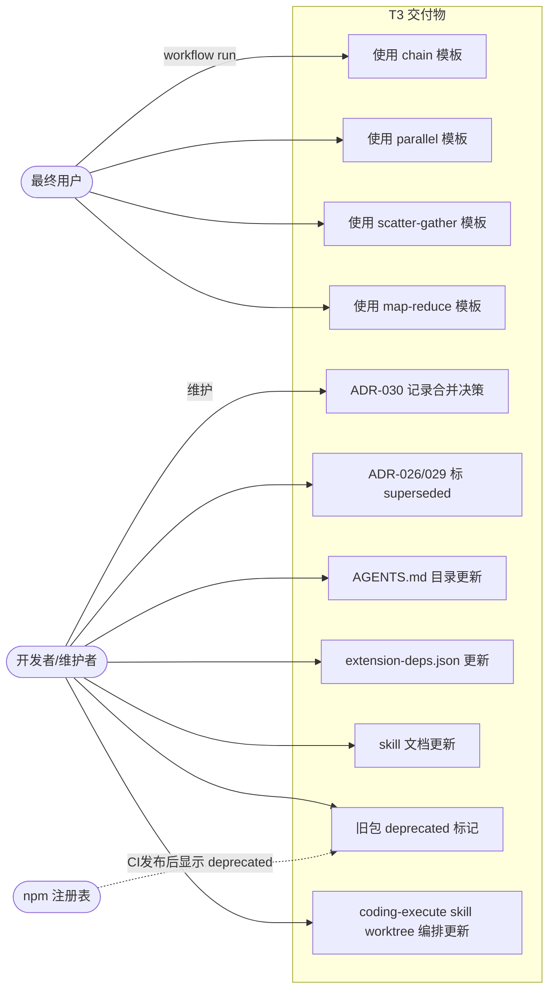
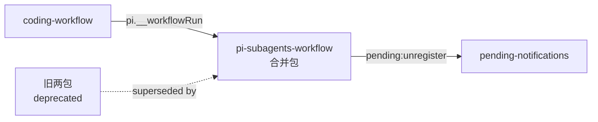

# T3：预制脚本 + 文档/ADR

> 三 topic 拆分的第三步（收尾）。T1 完成包结构合并 + 执行链统一 + workflow() 函数；
> T2 完成删 sync + 并发池分层 + 通知合并。T3 负责：
> (1) 基于 T1 的 workflow() 函数提供预制编排脚本模板；
> (2) 撰写 ADR-030 记录合并架构决策，标记 ADR-026/029 superseded；
> (3) 更新项目文档（AGENTS.md/CLAUDE.md/extension-dependencies.json）；
> (4) 更新 workflow-script-format skill 文档（添加 workflow() 函数）；
> (5) 旧包 deprecated 标记 + CHANGELOG 迁移指引。

## 1. 业务目标（Business Goals）

### 目标树

- **G1: 预制脚本模板** — 提供开箱即用的 workflow 嵌套编排模板，降低用户使用 workflow() 函数的门槛
  - G1.1: 提供 chain（顺序编排）模板
  - G1.2: 提供 parallel（并行编排）模板
  - G1.3: 提供 scatter-gather（分发-收集）模板
  - G1.4: 提供 map-reduce（映射-归约）模板
  - 成功标准：4 个模板脚本可通过 `workflow run` 直接执行，含 meta 声明 + 注释说明 + 示例参数

- **G2: 架构决策记录** — ADR-030 撰写合并架构决策，标记 ADR-026/029 superseded
  - G2.1: ADR-030 记录三主题合并的架构决策（统一执行模型、分层配额、workflow 嵌套、删sync+通知合并）
  - G2.2: ADR-026 完全标记 superseded by ADR-030（两包架构 → 单包合并；L3A 能力合并进单包）
  - G2.3: ADR-029 **部分**标记 superseded by ADR-030（D-033R：仅 worktree 编排被取代；per-call cwd+cw调用仍有效）
  - 成功标准：ADR-030 含 Status/Context/Decision/Consequences 四节；ADR-026 Status=Superseded；ADR-029 Status=Partially Superseded

- **G3: 项目文档与配置更新** — 更新 AGENTS.md/CLAUDE.md 目录结构 + extension-dependencies.json
  - G3.1: AGENTS.md/CLAUDE.md 的 extensions/ 目录新增 subagents-workflow 条目
  - G3.2: extension-dependencies.json 新增 subagents-workflow 依赖声明；coding-workflow 的 runtime 依赖从 pi-workflow 迁移到 pi-subagents-workflow
  - G3.3: 旧两包在 extension-dependencies.json 中标记 superseded（保留条目但注明被替代）
  - 成功标准：`bash .githooks/check-structure` 通过；`npx ajv-cli validate` 通过

- **G4: workflow-script-format skill 更新** — 添加 workflow() 函数文档 + 更新并发上限
  - G4.1: 新增 `workflow()` 函数的 API 文档（签名、返回类型、示例）
  - G4.2: 更新 parallel() 并发上限从 4 改为 6（基线来自 T2 maxConcurrent=6）
  - G4.3: skill 文档新增 chain/parallel 基础示例（教 workflow() API 用法，与 G1 独立脚本分工：skill 示例面 API，独立脚本面完整模式）
  - 成功标准：skill 文档可被 workflow-generate 自动加载，含 workflow() 函数说明

- **G5: 旧包迁移指引** — deprecated 标记 + CHANGELOG 迁移指引
  - G5.1: 旧两包 package.json 添加 `deprecated` 字段 + 迁移说明
  - G5.2: 旧两包 CHANGELOG 记录 deprecated 声明 + 迁移路径
  - 成功标准：package.json 含 deprecated 字段 + CHANGELOG 含迁移说明（CI 发布后 `npm info` 显示 deprecated，T3 开发阶段用 `npm publish --dry-run` 验证 package.json 正确性）

### 达成路线

| 目标 | 路线/策略 | 对应用例 |
|------|---------|---------|
| G1 | 在 extensions/subagents-workflow/examples/ 下创建 4 个模板脚本 | UC-1~UC-4 |
| G2 | 撰写 ADR-030 + 修改 ADR-026/029 Status | UC-5, UC-6, UC-11 |
| G3 | 更新 AGENTS.md + extension-dependencies.json（含 coding-workflow 依赖迁移） | UC-7, UC-8 |
| G4 | 更新 workflow-script-format skill 文档 | UC-9 |
| G5 | 旧包 package.json + CHANGELOG deprecated 标记 | UC-10 |

## 2. 业务用例（Use Cases）

### 用例图

### UC-1: 使用 chain 模板（顺序编排多个 workflow）

- **Actor**: 最终用户（Pi 用户）
- **前置条件**: 已安装 @zhushanwen/pi-subagents-workflow
- **主流程**:
  1. 用户查看包内 `examples/chain.example.js` 了解 chain 模式用法
  2. 用户复制模板到 `.pi/workflows/` 或 `~/.pi/agent/workflows/`，修改其中的 workflow 名称和参数
  3. 用户执行 `workflow run chain.example --args ...`
  4. 脚本顺序调用多个 workflow，每个 workflow 的输出作为下一个的输入
  5. 最终返回最后一个 workflow 的结果
- **替代流程**: 用户直接参考模板写自己的 chain 脚本
- **异常流程**: 中间 workflow 失败 → 脚本返回 error，用户决定是否重试
- **后置状态**: 多个 workflow 顺序执行完成
- **关联目标**: G1.1
- **验收标准 (AC)**:
  - AC-1.1 [正常]: chain.example.js 含 meta 声明 + workflow() 调用 + 注释说明
  - AC-1.2 [正常]: 脚本通过 lintScript 检查（无 bare IIFE、含 workflow 调用）
  - AC-1.3 [边界]: 脚本含错误处理（workflow 失败时返回 error 不 crash）

### UC-2: 使用 parallel 模板（并行编排多个 workflow）

- **Actor**: 最终用户
- **前置条件**: 已安装 @zhushanwen/pi-subagents-workflow
- **主流程**:
  1. 用户查看 `scripts/parallel.example.js`
  2. 用户复制模板，修改 workflow 名称列表
  3. 用户执行 `workflow run parallel.example --args ...`
  4. 脚本通过 Promise.allSettled 并行调用多个 workflow
  5. 返回所有 workflow 的结果数组
- **异常流程**: 部分 workflow 失败 → allSettled 不 reject，返回中标注 failed
- **关联目标**: G1.2
- **验收标准 (AC)**:
  - AC-2.1 [正常]: parallel.example.js 含 Promise.allSettled + workflow() 调用
  - AC-2.2 [正常]: 脚本可通过 `workflow run parallel.example` 执行
  - AC-2.3 [边界]: 脚本注释中说明分层配额规则（maxConcurrent=6, depth=N 时配额=max(1,6-N)）

### UC-3: 使用 scatter-gather 模板（分发-收集模式）

- **Actor**: 最终用户
- **前置条件**: 已安装 @zhushanwen/pi-subagents-workflow，有大量数据需分片处理
- **主流程**:
  1. 用户查看 `scripts/scatter-gather.example.js`
  2. 用户复制模板，配置 split workflow + process workflow + merge 逻辑
  3. 用户执行 `workflow run scatter-gather.example --args ...`
  4. 脚本先调 split workflow 分片数据
  5. 再并行调 process workflow 处理每个分片
  6. 最后合并所有分片结果
- **异常流程**: 分片失败 → 返回 error；部分处理失败 → allSettled 收集
- **关联目标**: G1.3
- **验收标准 (AC)**:
  - AC-3.1 [正常]: scatter-gather.example.js 含 split → parallel process → merge 三段
  - AC-3.2 [正常]: 脚本可通过 `workflow run scatter-gather.example` 执行

### UC-4: 使用 map-reduce 模板（映射-归约模式）

- **Actor**: 最终用户
- **前置条件**: 已安装 @zhushanwen/pi-subagents-workflow
- **主流程**:
  1. 用户查看 `scripts/map-reduce.example.js`
  2. 用户复制模板，配置 map workflow + reduce 逻辑
  3. 用户执行 `workflow run map-reduce.example --args ...`
  4. 脚本对每个输入项并行调 map workflow
  5. 再用 reduce workflow 聚合所有 map 结果
- **异常流程**: map 失败 → allSettled 收集；reduce 失败 → 返回 error
- **关联目标**: G1.4
- **验收标准 (AC)**:
  - AC-4.1 [正常]: map-reduce.example.js 含 parallel map → reduce 两段
  - AC-4.2 [正常]: 脚本可通过 `workflow run map-reduce.example` 执行

### UC-5: ADR-030 撰写（合并架构决策记录）

- **Actor**: 开发者/维护者
- **前置条件**: T1/T2 已完成
- **主流程**:
  1. 开发者撰写 `docs/adr/030-subagents-workflow-merge.md`
  2. ADR-030 记录：合并为一包的决策、统一执行模型（SAR 委托 SS）、分层配额、workflow 嵌套
  3. 含 Status/Context/Decision/Consequences 四节
- **后置状态**: 合并架构决策有正式 ADR 记录
- **关联目标**: G2.1
- **验收标准 (AC)**:
  - AC-5.1 [正常]: ADR-030 含 Status: Accepted
  - AC-5.2 [正常]: ADR-030 含 Context（两包合并背景）、Decision（4 项核心决策：(1)合并为一包 (2)统一执行链 (3)分层配额+workflow嵌套 (4)删sync+通知合并）、Consequences
  - AC-5.3 [边界]: ADR-030 引用 ADR-026/029 作为被 superseded 的前置决策

### UC-6: ADR-026/029 标记 superseded

- **Actor**: 开发者/维护者
- **前置条件**: ADR-030 已撰写
- **主流程**:
  1. 修改 ADR-026 Status 从 Accepted 改为 Superseded by ADR-030
  2. 修改 ADR-029 Status 从 Proposed 改为 Superseded by ADR-030
  3. 在 ADR-026/029 顶部添加 superseded 说明
- **后置状态**: ADR-026/029 标记为已被 ADR-030 取代
- **关联目标**: G2.2, G2.3
- **验收标准 (AC)**:
  - AC-6.1 [正常]: ADR-026 Status = "Superseded by ADR-030"
  - AC-6.2 [正常]: ADR-029 Status = "Partially superseded by ADR-030"（D-033R：仅 worktree 编排被取代，per-call cwd+cw调用仍有效）

### UC-7: AGENTS.md/CLAUDE.md 目录结构更新

- **Actor**: 开发者/维护者
- **前置条件**: T1 已创建 extensions/subagents-workflow/
- **主流程**:
  1. 在 AGENTS.md 的 extensions/ 目录结构中新增 subagents-workflow 条目
  2. 在包清单表中新增 @zhushanwen/pi-subagents-workflow 行
  3. 在目录结构图中标注旧两包为 deprecated
- **后置状态**: AGENTS.md/CLAUDE.md 反映合并后的包结构
- **关联目标**: G3.1
- **验收标准 (AC)**:
  - AC-7.1 [正常]: AGENTS.md 目录结构含 extensions/subagents-workflow/
  - AC-7.2 [正常]: 包清单表含 @zhushanwen/pi-subagents-workflow 行
  - AC-7.3 [边界]: `bash .githooks/check-structure` 通过（CLAUDE.md 同步检查）

### UC-8: extension-dependencies.json 更新

- **Actor**: 开发者/维护者
- **前置条件**: T1 已创建新包
- **主流程**:
  1. T3 在 extension-dependencies.json 中新增 subagents-workflow 条目，声明依赖 pi-structured-output(runtime)、pi-pending-notifications(optional)
  2. coding-workflow 的 runtime 依赖从 `@zhushanwen/pi-workflow` 迁移到 `@zhushanwen/pi-subagents-workflow`（pi.__workflowRun 现在在新包）
  3. 旧两包条目标注 superseded
  - **职责边界**：T1 F2 负责 package.json + 基础依赖声明；T3 负责正式 extension-dependencies.json 条目 + coding-workflow 依赖迁移 + 旧包标注
- **后置状态**: 依赖关系声明完整
- **关联目标**: G3.2, G3.3
- **验收标准 (AC)**:
  - AC-8.1 [正常]: extension-dependencies.json 含 subagents-workflow 条目
  - AC-8.2 [正常]: coding-workflow dependsOn 含 `@zhushanwen/pi-subagents-workflow`(runtime)，不再含 `@zhushanwen/pi-workflow`
  - AC-8.3 [正常]: `npx ajv-cli validate -s extension-dependencies.schema.json -d extension-dependencies.json` 通过
  - AC-8.4 [边界]: 旧两包条目保留但注明 superseded by subagents-workflow

### UC-9: workflow-script-format skill 更新

- **Actor**: 开发者/维护者
- **前置条件**: T1 已实现 workflow() 函数并迁移 skill 到新包
- **主流程**:
  1. 在 `extensions/subagents-workflow/skills/workflow-script-format/SKILL.md` 中新增 `workflow()` 函数文档
  2. 更新 parallel() 并发上限从 4 改为 6（基线来自 T2 maxConcurrent=6）
  3. 新增 chain/parallel 基础示例（教 API 用法，与 examples/ 独立脚本分工：skill 示例简洁面 API，独立脚本完整面模式）
- **后置状态**: skill 文档反映 workflow() 函数和新的并发上限
- **关联目标**: G4
- **验收标准 (AC)**:
  - AC-9.1 [正常]: SKILL.md Injected Globals 含 `workflow()` 函数说明
  - AC-9.2 [正常]: parallel() 并发上限文档改为 6
  - AC-9.3 [正常]: 含 chain/parallel 基础示例（workflow() API 用法）

### UC-10: 旧包 deprecated 标记 + CHANGELOG 迁移指引

- **Actor**: 开发者/维护者
- **前置条件**: 新包已准备发布
- **主流程**:
  1. 旧两包 package.json 添加 `deprecated` 字段 + 迁移说明
  2. 旧两包 CHANGELOG.md 记录 deprecated 声明
  3. 迁移指引：卸载旧两包 → 安装新包 → 功能等价
- **后置状态**: npm 上旧包显示 deprecated 警告
- **关联目标**: G5
- **验收标准 (AC)**:
  - AC-10.1 [正常]: 旧两包 package.json 含 `"deprecated"` 字段
  - AC-10.2 [正常]: deprecated 消息含迁移路径（"Use @zhushanwen/pi-subagents-workflow instead"）
  - AC-10.3 [边界]: CHANGELOG 记录 deprecated 版本号和迁移说明
  - AC-10.4 [边界]: `npm publish --dry-run` 验证 package.json deprecated 字段正确性（CI 发布后 `npm info` 回验）

### UC-11: coding-execute skill worktree 编排文档更新

- **Actor**: 开发者/维护者
- **前置条件**: ADR-029 部分 superseded（D-033R），worktree 编排模式需转移到 coding-execute skill
- **主流程**:
  1. 在 `extensions/coding-workflow/skills/coding-execute/SKILL.md` 中新增 worktree 编排模式说明
  2. 内容来源：ADR-029 决策 2（worktree 生命周期归 workflow 内建、原生 git worktree add/remove、4 phase 结构）
  3. 清理 ADR-029 中已被 T1 取代的「两条独立执行链」描述
- **后置状态**: worktree 编排模式知识从 ADR-029 转移到 coding-execute skill
- **关联目标**: G2.3（D-033R）
- **验收标准 (AC)**:
  - AC-11.1 [正常]: coding-execute SKILL.md 含 worktree 编排模式说明（4 phase + git worktree add/remove）
  - AC-11.2 [正常]: 内容来自 ADR-029 决策 2，不丢失 worktree 编排知识

## 3. 数据流转（Data Flow）

> T3 是文档 + 脚本交付，无运行时数据流。预制脚本的数据流是 workflow() 函数调用的编排流，
> 已在 T1 system-architecture §12 定义。此处不重复。

## 4. 功能清单（Features）

| 编号 | 功能 | 对应用例 | 关联目标 |
|------|------|---------|---------|
| F1 | chain.example.js 模板脚本 | UC-1 | G1.1 |
| F2 | parallel.example.js 模板脚本 | UC-2 | G1.2 |
| F3 | scatter-gather.example.js 模板脚本 | UC-3 | G1.3 |
| F4 | map-reduce.example.js 模板脚本 | UC-4 | G1.4 |
| F5 | ADR-030 撰写 | UC-5 | G2.1 |
| F6 | ADR-026/029 superseded 标记（026完全/029部分） | UC-6 | G2.2, G2.3 |
| F7 | AGENTS.md/CLAUDE.md 目录更新 | UC-7 | G3.1 |
| F8 | extension-dependencies.json 更新（含 coding-workflow 依赖迁移） | UC-8 | G3.2, G3.3 |
| F9 | workflow-script-format skill 更新 | UC-9 | G4 |
| F10 | 旧包 deprecated + CHANGELOG | UC-10 | G5 |
| F11 | coding-execute skill worktree 编排文档更新 | UC-11 | G2.3 |

## 5. UI/UX 场景（Interface Scenarios）

> T3 是文档 + 脚本交付，无新增 UI 交互。跳过本节。

## 6. 系统间功能关联（Cross-System）

### 关联图

| 关联系统 | 依赖方向 | 交互方式 | 契约稳定性 | T3 影响 |
|---------|---------|---------|-----------|---------|
| coding-workflow | CW → SWF（pi.__workflowRun） | 编程式 RPC | 稳定 | 零改动：T3 不改执行链 |
| pending-notifications | SWF → PN（EventBus） | 事件 | 稳定 | 零改动：T3 不改通知机制 |
| 旧两包 | OLD → SWF（superseded） | npm deprecated | — | deprecated 标记 + 迁移指引 |

## 7. 约束（Constraints）

- **业务约束**:
  - T3 不改执行链（T1 已完成）
  - T3 不改并发池/通知机制（T2 已完成）
  - T3 只做文档 + 脚本 + 配置更新
  - 预制脚本是**参考模板**（用户复制修改），不是可 import 的库函数

- **技术约束**:
  - 预制脚本必须符合 workflow-script-format 规范（meta 声明、require()、无 ESM import）
  - 预制脚本必须通过 lintScript 检查（无 bare IIFE、含 agent/parallel/workflow 调用）
  - ADR 格式遵循项目约定（Status/Context/Decision/Consequences）
  - AGENTS.md 更新必须通过 `bash .githooks/check-structure` 检查

## 8. 不做（Out of Scope）

- **执行链改造**（SAR 委托、executeAndAwait）→ T1 已完成
- **sync 删除 / 并发池分层 / 通知合并** → T2 已完成
- **workflow() 函数实现** → T1 已完成
- **新包代码实现** → T1/T2 已完成
- **旧包代码清理/删除** → 后续版本统一清理（D-004）
- **预制脚本的自动化测试** → 模板是参考实现，用户复制后自行测试
- **agent .md prompts 更新** → 代码验证：8 个 agent prompts（context-builder/general-purpose/oracle/planner/researcher/reviewer/scout/worker）均不引用执行模式（sync/background）、包名、执行链细节。是行为指导文档，与 T1/T2 改动无关，不需更新

## 决策记录

> 详见 `decisions.md`。本 topic 关键决策：

| id | decision | classification | confirmed_by |
|----|----------|----------------|--------------|
| D-030 | 维持 mid 工作流（评分 11 分 L1 边界） | D-不可逆 | ask_user |
| D-031 | 预制脚本为纯参考模板（用户复制修改） | D-不可逆 | ask_user |
| D-032 | scatter-gather 和 map-reduce 分开（4 模板） | D-不可逆 | ask_user |
| D-033 | ~~ADR-029 完全 superseded~~ → 被 D-033R 推翻 | D-不可逆 | ask_user |
| D-033R | [REVISIT] ADR-029 部分 superseded（仅 worktree 被取代，per-call cwd+cw 仍有效） | D-不可逆 | ask_user（review revisit） |

## 待确认

> 全部决策点已在 batch-ask 中确认（D-030~D-033）。无残留待确认项。
