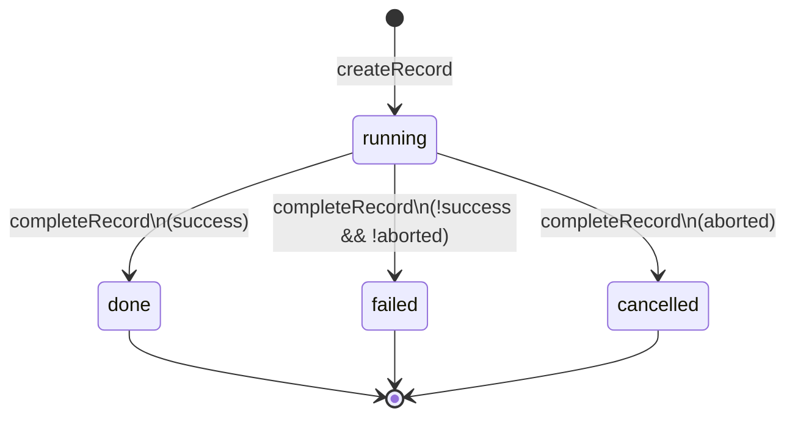

# Subagents 数据模型

> ExecutionRecord 是 subagents 扩展的**唯一执行状态对象**。所有路径（sync/background/poll）共用此对象，由 Core 层唯一操作。
> 分层与文件归属见 [architecture.md](./architecture.md)。

---

## 0. 为什么是贫血模型 + 函数式（不是 Java DDD 充血）

`ExecutionRecord` 是**纯数据 interface**（无方法），行为集中在 `core/execution-record.ts` 的 4 个函数上。这不是"没设计好的贫血反模式"，而是**函数式 DDD**——record 是 aggregate 的数据载体，`execution-record.ts` 是 module 形式的 aggregate root（唯一 mutate 入口）。

### 与 Java 充血模型的差异

| 维度 | Java 充血（DDD）| 本项目（贫血+函数式）|
|---|---|---|
| 状态封装 | `private` 字段 + 方法 | 模块边界（架构铁律：record 只经 4 函数 mutate）|
| 行为就近 | 方法绑在对象上 | 4 函数集中在 module（等价 aggregate root）|
| 序列化 | class 实例转 json 麻烦 | plain object 直接写 jsonl |
| 跨层共享 | class 带运行时依赖 | interface 编译期消失，三层共用一份类型 |
| 快照/并发 | 共享可变对象需 deep clone | `.slice()` eventLog 即可 |

### 选函数式的三个硬约束

1. **TS interface 运行时消失**——不能有方法，"行为绑类型"在语言层不自然
2. **三路径共享 + 快照隔离**——sync/bg/poll 同时读同一份 record，TUI/history/widget 各取快照，纯数据 + `.slice()` 比 deep clone 简单一个数量级
3. **jsonl 持久化**——`toPersisted(record)` 直接产 plain object，无 class 反序列化

### 保留的"充血内核"

- `_currentTurnText` / `_currentThinking` 是 record 的**字段**而非函数局部变量——chunking 缓冲跨事件存活，只有 `updateFromEvent` 读写。这是状态封装，等价 `private`
- 不变量守护集中在 module 内：`completeRecord` 不重置 turns（updateFromEvent 已累积）、`project` 唯一算 elapsedSeconds——等价 aggregate root 守护不变量

---

## 1. 为什么是唯一状态源

旧实现的状态散落在 11 种形状里（EventBridge、AgentResult、BgRecord、CompletedAgentRecord、闭包局部、PersistedAgentRecord、SubagentToolDetails、SubagentRecord、BackgroundStatus、两套 WidgetState），三路径各自投影，导致：

- **字段丢失**：6 处手工构造 Details，poll 丢 model、bg eventLog chunking 坏、cancelled 丢 turns/tokens
- **计数漂移**：6 个独立 turns 累加器、6 处 elapsedSeconds 计算（floor/round 混用）
- **双构建**：sync 路径 toolState 与 runtimeState 各维护一份 eventLog

根治方案：**收敛到 1 个状态对象 + 4 个唯一操作入口**。

| 指标 | 旧 | 新 |
|---|---|---|
| 状态形状 | 11 种 | 1 种（`ExecutionRecord`）+ 2 种只读投影（`RecordSnapshot`/`PersistedAgentRecord`） |
| turns 累加器 | 6 个 | 1 个（`updateFromEvent` 唯一写点） |
| Details 构造点 | 6 处 | 1 处（`project()`） |

## 2. ExecutionRecord 字段分解

定义见 `extensions/subagents/src/types.ts`。按职责分五组：

```typescript
interface ExecutionRecord {
  // ── 身份（创建时确定，不可变）──
  readonly id: string;            // sync:"run-N" / bg:"bg-N-xxx"
  readonly agent: string;
  readonly model: string;          // 创建时必填，消灭 poll 路径 model 丢失
  readonly thinkingLevel: string | undefined;
  readonly mode: ExecutionMode;    // "sync" | "background"
  readonly task: string;
  readonly startedAt: number;

  // ── 状态（实时更新，updateFromEvent 唯一写点）──
  status: ExecutionStatus;         // running → done/failed/cancelled
  eventLog: AgentEventLogEntry[];  // ring buffer
  turns: number;
  totalTokens: number;

  // ── 完成（completeRecord 唯一写点）──
  endedAt: number | undefined;
  result: string | undefined;
  error: string | undefined;
  agentResult: AgentResult | undefined;

  // ── 控制（仅 background）──
  controller: AbortController | undefined;

  // ── chunking 缓冲（跨事件持久，修复 sink reset bug）──
  _currentTurnText: string;
  _currentThinking: string;
}
```

两组下划线前缀字段是**有意保留的可变缓冲**，不对外暴露。它们修复了旧实现 background 路径的 sink reset bug：旧版每次事件创建新 sink，跨事件的 text/thinking delta 无法累积，导致 background 的 eventLog 丢失 `text_output`/`thinking` 条目。

## 3. 状态机



状态判定**唯一在 `executor.execute` 的 finalize 阶段**，不在 Core 层：

```
status = result.success ? "done"
       : (signal.aborted ? "cancelled" : "failed")
```

旧实现此判定散落在 4 处（runAgent try / runAgent catch / bg .then / bg .catch），收敛为单点。详见 [execution-flow.md](./execution-flow.md) §5 cancelled 路径一致性。

## 4. 四个唯一操作入口

均在 `core/execution-record.ts`。TUI/Runtime 通过这四个函数操作 record，禁止直接 mutate 字段。

| 入口 | 职责 | 调用方 |
|---|---|---|
| `createRecord(id, identity)` | 创建。identity（agent/model/mode/task/controller）一次确定不可变 | executor |
| `updateFromEvent(record, event)` | 实时更新。eventLog 追加 + turns/tokens 累积 + chunking | session-runner（EventBridge 回调） |
| `completeRecord(record, result, status)` | 冻结。写 endedAt/agentResult/result/error，不改 turns/tokens | executor finalize |
| `project(record)` / `snapshot(record)` / `toPersisted(record)` | 投影。只读产出展示层对象 | 详见下节 |

## 5. 生命周期

```mermaid
flowchart LR
    A[createRecord<br/>identity 注入] --> B[updateFromEvent ×N<br/>事件实时更新]
    B --> C[completeRecord<br/>冻结状态]
    C --> D{mode?}
    D -->|sync| E[completed map<br/>linger 5s]
    D -->|background| F[bg map<br/>FIFO 淘汰]
    E --> G[history.append<br/>toPersisted]
    F --> G
    G --> H[/subagents list<br/>collectRecords 合并四源]
```

- **create → update×N → complete** 由 executor 驱动
- **archive**：complete 后按 mode 迁入 `record-store` 的 completed（sync，5s linger）或 bg（background，FIFO）map
- **persist**：`toPersisted` 投影后写 `history.jsonl`，跨 session 可见

## 6. 投影入口（3 个只读视图）

`ExecutionRecord` 是唯一可变源，产出三种只读视图供不同消费者。所有投影都 `.slice()` eventLog 快照，防止消费者持有被 mutate 的引用。

| 投影函数 | 产出类型 | 消费者 | 用途 |
|---|---|---|---|
| `project(record)` | `SubagentToolDetails` | tool-render（对话流 block） | LLM 可见的工具结果 + 实时渲染 |
| `snapshot(record)` | `RecordSnapshot` | list-view / poll（`query()`） | 只读详情，字段标 readonly |
| `toPersisted(record)` | `PersistedAgentRecord` | history-store | 持久化到 jsonl，预览字段截断 |

### 投影单点的修复效果

旧实现三路径各自手工构造 Details，`project()` 收敛为单点后：

- **Mode 3 cancelled 丢数据**：旧 `getBackground` 的 done/failed 分支钻进 `status.result?.turns`，cancelled 时 result 为 undefined 导致归零。新设计 `project` 直接读 `record.turns`（updateFromEvent 累积值，completeRecord 不清零），三路径一致。
- **poll 无 model**：旧 background record 的 model 在运行时丢失。新设计 model 是 identity 字段，创建时必填，投影时直取。
- **elapsedSeconds 不一致**：旧 6 处计算 floor/round 混用。新设计 `project` 唯一计算点，统一 `Math.floor`。

## 7. eventLog chunking

`updateFromEvent` 处理 streaming delta 时，不直接推条目，而是累积到缓冲：

```
text_delta  → _currentTurnText += delta
thinking_delta → _currentThinking += delta
              达 CHUNK 阈值 → 推 text_output/thinking 条目，截断缓冲
turn_end     → flush 残留缓冲 + turns++
message_end  → totalTokens += Σ(usage)
```

缓冲是 record 的持久字段（非局部变量），跨事件存活。ring buffer 超 `MAX_EVENT_LOG_ENTRIES` 移除最旧。

## 相关文档

- [architecture.md](./architecture.md) — 三层架构与文件归属
- [execution-flow.md](./execution-flow.md) — create/update/complete 由谁何时调用
- [session-runner.md](./session-runner.md) — EventBridge 如何喂事件给 updateFromEvent
