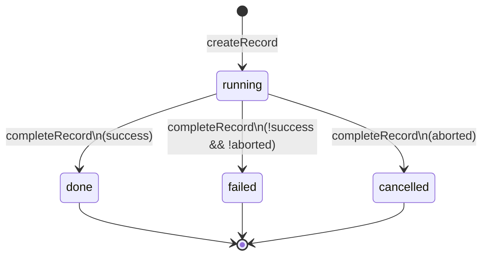

# Subagents 数据模型

> ExecutionRecord 是 subagents 扩展的**唯一执行状态对象**。所有路径（sync/background/poll）共用此对象，由 Core 层唯一操作。
> 分层与文件归属见 [architecture.md](./architecture.md)。

---

## 0. 为什么是贫血模型 + 函数式（不是 Java DDD 充血）

`ExecutionRecord` 是**纯数据 interface**（无方法），行为集中在 `core/execution-record.ts` 的 4 个函数上。这不是"没设计好的贫血反模式"，而是**函数式 DDD**——record 是 aggregate 的数据载体，`execution-record.ts` 是 module 形式的 aggregate root（唯一 mutate 入口）。

### 与 Java 充血模型的差异

| 维度 | Java 充血（DDD）| 本项目（贫血+函数式）|
|---|---|---|
| 状态封装 | `private` 字段 + 方法 | 模块边界（架构铁律：record 只经 4 函数 mutate）|
| 行为就近 | 方法绑在对象上 | 4 函数集中在 module（等价 aggregate root）|
| 序列化 | class 实例转 json 麻烦 | plain object 直接写 jsonl |
| 跨层共享 | class 带运行时依赖 | interface 编译期消失，三层共用一份类型 |
| 快照/并发 | 共享可变对象需 deep clone | `.slice()` eventLog 即可 |

### 选函数式的三个硬约束

1. **TS interface 运行时消失**——不能有方法，"行为绑类型"在语言层不自然
2. **三路径共享 + 快照隔离**——sync/bg 同时读同一份 record，TUI/widget 各取快照，纯数据 + `.slice()` 比 deep clone 简单一个数量级
3. **session.jsonl 持久化**——SDK 实时 flush 完整对话进 session.jsonl，终态后 `reconstructFromFile` 从它重建 turns[]，无需独立持久化层

### 保留的"充血内核"

- 一次执行的完整内容（text/thinking/toolCalls/usage）按 turn 收口在 `record.turns: Turn[]`，是 record 的**字段**而非函数局部变量——流式内容跨事件累积存活，只有 `updateFromEvent` 读写。这是状态封装，等价 `private`
- 不变量守护集中在 module 内：`completeRecord` 不重置 turns（updateFromEvent 已累积）、`project` 唯一算 elapsedSeconds——等价 aggregate root 守护不变量

---

## 1. 为什么是唯一状态源

旧实现的状态散落在 11 种形状里（EventBridge、AgentResult、BgRecord、CompletedAgentRecord、闭包局部、PersistedAgentRecord、SubagentToolDetails、SubagentRecord、BackgroundStatus、两套 WidgetState），三路径各自投影，导致：

- **字段丢失**：6 处手工构造 Details，poll 丢 model、bg eventLog chunking 坏、cancelled 丢 turns/tokens
- **计数漂移**：6 个独立 turns 累加器、6 处 elapsedSeconds 计算（floor/round 混用）
- **双构建**：sync 路径 toolState 与 runtimeState 各维护一份 eventLog

根治方案：**收敛到 1 个状态对象 + 4 个唯一操作入口**。

| 指标 | 旧 | 新 |
|---|---|---|
| 状态形状 | 11 种 | 1 种（`ExecutionRecord`）+ 2 种只读投影（`RecordSnapshot`/`ReconstructedRecord`） |
| turns 累加器 | 6 个 | 1 个（`updateFromEvent` 唯一写点） |
| Details 构造点 | 6 处 | 1 处（`project()`） |

## 2. ExecutionRecord 字段分解

定义见 `extensions/subagents/src/types.ts`。按职责分五组：

```typescript
interface ExecutionRecord {
  // ── 身份（创建时确定，不可变）──
  readonly id: string;            // sync:"run-N" / bg:"bg-N-xxx"
  readonly agent: string;
  readonly model: string;          // 创建时必填，消灭 poll 路径 model 丢失
  readonly thinkingLevel: string | undefined;
  readonly mode: ExecutionMode;    // "sync" | "background"
  readonly task: string;
  readonly startedAt: number;

  // ── 状态（实时更新，updateFromEvent 唯一写点）──
  status: ExecutionStatus;         // running → done/failed/cancelled
  turns: Turn[];                   // 完整内容按 turn 收口（createRecord 初始化为 [空 turn]）
  turnCount: number;               // 已闭合 turn 数（冗余存储，供投影直接读）
  totalTokens: number;
  lastError: string | undefined;   // 运行期最近一次 error 事件（getEventLog 派生 error 条目用）

  // ── 完成（completeRecord 唯一写点）──
  endedAt: number | undefined;
  result: string | undefined;
  error: string | undefined;
  agentResult: AgentResult | undefined;

  // ── 控制（仅 background）──
  controller: AbortController | undefined;

  // ── 会话文件（session 创建成功后回填，窗口期内 undefined）──
  sessionFile?: string;
}
```

`turns: Turn[]` 是收口设计的核心：一次执行的完整内容（text/thinking/toolCalls/usage）按 turn 组织在单一数组里，`eventLog` / `currentActivity` / `result` 文本均从 `turns[]` 派生（`getEventLog` / `getCurrentActivity` / `getFullText`），不再独立存储切片或缓冲。

### Turn 结构（`turns[]` 的元素）

```typescript
interface Turn {
  text: string;            // 本 turn assistant 正文（text_delta 流式累积，完整内容）
  thinking: string;        // 本 turn 推理（thinking_delta 流式累积，完整内容）
  toolCalls: InternalToolCall[];  // 含完整 result + _status 进行中标记
  usageDelta?: AgentUsage;        // 本 turn message_end 的 token 增量（聚合得 totalUsage）
  closed: boolean;         // turn_end 是否已到达；false=进行中，true=下次内容开新 turn
  closedTs?: number;       // turn_end 到达时的墙钟时间戳（getEventLog 派生 turn_end 条目 ts）
}
```

text/thinking 流式累积**完整内容**（非旧实现的 100 字切片），toolCalls 存完整 `InternalToolCall`（含 result + _status 内部状态机）。`turn_end` 到达后 `closed=true`，下次 text/thinking/tool 时开新 turn。跨边界导出（`getAllToolCalls` → `AgentResult.toolCalls`）由 `getAllToolCalls` 映射回纯净 `ToolCall`（strip `_status`/`startedTs`），保证导出形状清洁。

## 3. 状态机



状态判定**唯一在 `SubagentService.runAndFinalize` 的 finalize 阶段**，不在 Core 层：

```
status = result.success ? "done"
       : (signal.aborted ? "cancelled" : "failed")
```

旧实现此判定散落在 4 处（sync try / sync catch / bg .then / bg .catch），收敛为单点。详见 [execution-flow.md](./execution-flow.md) §5 cancelled 路径一致性。

## 4. 四个唯一操作入口

均在 `core/execution-record.ts`。TUI/Runtime 通过这四个函数操作 record，禁止直接 mutate 字段。

| 入口 | 职责 | 调用方 |
|---|---|---|
| `createRecord(id, identity)` | 创建。identity（agent/model/mode/task/controller）一次确定不可变 | SubagentService.createRecordForMode |
| `updateFromEvent(record, event)` | 实时更新。累积进 `turns[]`（text/thinking/toolCalls/usage）+ totalTokens + lastError | session-runner（`agentEvent` 回调，内联事件处理） |
| `completeRecord(record, result, status)` | 冻结。写 endedAt/agentResult/result/error，不改 turns/tokens | SubagentService.finalizeRecord |
| `project(record)` / `snapshot(record)` + 派生函数 | 投影。只读产出展示层对象 | 详见下节 |

> 派生函数（与投影并列的只读读出器）：`getEventLog`（turns[] → 离散语义事件序列）、`getCurrentActivity`（turns[] 末尾 → running 活动行）、`getFullText`（turns[] → 完整正文）、`getAllToolCalls`（turns[] → 扁平 toolCalls）、`getTotalUsage`（turns[] → 聚合 usage）。

## 5. 生命周期

```mermaid
flowchart LR
    A[createRecord<br/>identity 注入] --> B[updateFromEvent ×N<br/>累积进 turns[]]
    B --> C[completeRecord<br/>冻结状态]
    C --> D[store.archive<br/>立即移出内存]
    D --> E[/subagents list<br/>collectRecords 重建]
    E --> F[reconstructFromFile<br/>session.jsonl → turns[]]
```

- **create → update×N → complete** 由 SubagentService.runAndFinalize 驱动
- **archive**：终态 record **立即**从内存 Map 移除（不再 linger / FIFO）。内存只留 running record。
- **读时重建**：`collectRecords` 合并内存(running) + 磁盘(sessions/*.jsonl 重建)。`reconstructFromFile`（`core/session-reconstructor.ts`）从 session.jsonl 重建 turns[]/eventLog/result/error 等富数据——session.jsonl 是唯一 source of truth（history.jsonl 已废弃）。
- **身份持久化**：session.jsonl 的 header 不含 ExecutionRecord.id/agent/mode，故 session-runner 在创建 session 后写一条 custom entry（`subagent-identity`）携带身份，reconstructor 读它恢复。
- **cancelled 持久化**：cancel 时 session.jsonl 被 abort 截断，cancelled 状态无法从文件检测。故 cancelBackground 写一个 `.cancelled` sidecar 文件（tombstone），collectRecords 重建时 override status=cancelled。

## 6. 投影入口（只读视图）

`ExecutionRecord` 是唯一可变源，产出只读视图供不同消费者。`eventLog` 不存储——由 `getEventLog(record)` 每次现算派生，消费方按需调（投影时用），不存在「持有被 mutate 的引用」风险。

| 投影函数 | 产出类型 | 消费者 | 用途 |
|---|---|---|---|
| `project(record)` | `SubagentToolDetails` | tool-render（对话流 block） | LLM 可见的工具结果 + 实时渲染 |
| `snapshot(record)` | `RecordSnapshot` | list-view / cancel（`findRecord()`） | 只读详情，字段标 readonly（不含 eventLog） |
| `reconstructFromFile(sessionFile)` | `ReconstructedRecord` | RecordStore.collectRecords | 从 session.jsonl 重建终态 record（turns[]/eventLog/result/error） |

### 投影单点的修复效果

旧实现三路径各自手工构造 Details，`project()` 收敛为单点后：

- **Mode 3 cancelled 丢数据**：旧 `getBackground` 的 done/failed 分支钻进 `status.result?.turns`，cancelled 时 result 为 undefined 导致归零。新设计 `project` 直接读 `record.turnCount`（updateFromEvent 累积值，completeRecord 不清零），三路径一致。
- **poll 无 model**：旧 background record 的 model 在运行时丢失。新设计 model 是 identity 字段，创建时必填，投影时直取。
- **elapsedSeconds 不一致**：旧 6 处计算 floor/round 混用。新设计 `project` 唯一计算点，统一 `Math.floor`。

## 7. turns[] 收口（替代旧 eventLog chunking）

`updateFromEvent` 把流式 delta 累积进 `turns[]` 的当前 turn，**不再切片成 eventLog 条目**：

```
text_delta   → currentTurn().text += delta         （完整内容，非切片）
thinking_delta → currentTurn().thinking += delta    （完整内容，非切片）
tool_start   → currentTurn().toolCalls.push(running InternalToolCall)
tool_end     → 跨 turn 找 running 同名 toolCall，补全 result/_status
turn_end     → currentTurn().closed = true + closedTs + turnCount++ + 清 lastError
message_end  → currentTurn().usageDelta += usage + totalTokens += Σ(usage)
error        → record.lastError = message
```

`getEventLog(record)` 从 `turns[]` 派生**离散语义事件**序列（tool_start/tool_end 对 + turn_end，末尾若有 lastError 追加 error），不再含 `text_output`/`thinking` 切片条目——这从根上消灭了旧实现的残余尾巴 bug（compact view 显示 `text: }` 尾巴而非开头）。需要流式文本的消费方改读 `getCurrentActivity().label`（running 态）或 `result`（终态）。

## 相关文档

- [architecture.md](./architecture.md) — 三层架构与文件归属
- [execution-flow.md](./execution-flow.md) — create/update/complete 由谁何时调用
- [session-runner.md](./session-runner.md) — session-runner 如何内联处理 SDK 事件并喂给 updateFromEvent
