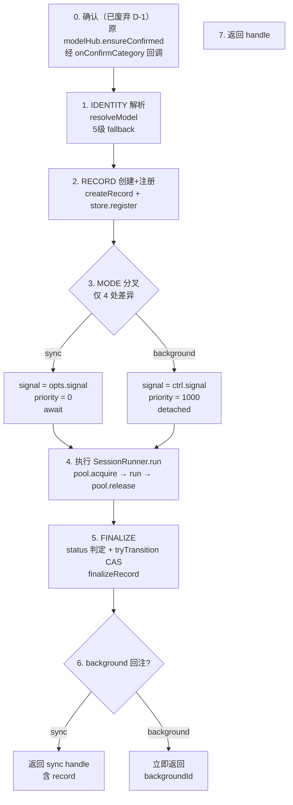
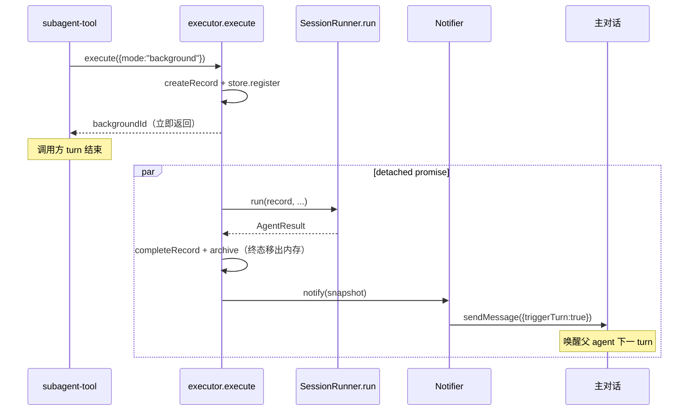
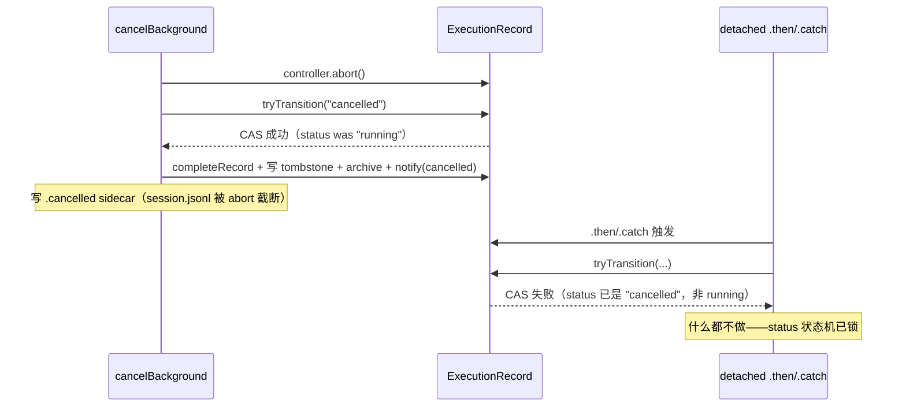

# Subagents 执行流程

> sync / background / poll 三条路径的统一执行流，以及 background detached 的时序与竞态处理。
> 状态对象定义见 [data-model.md](./data-model.md)，分层见 [architecture.md](./architecture.md)。

---

## 1. 三路径的物理语义

| 路径 | 调用方行为 | 结果交付 | 典型触发 |
|---|---|---|---|
| **sync** | `await`，阻塞调用方 turn | execute 返回时同步拿 record | `subagent({task})` 默认 |
| **background** | 不 await，立即拿 backgroundId | 完成后回注主对话（notifier） | `subagent({task, wait:false})` 或 agent 配 `defaultBackground` |
| **poll** | 查询既有 background | 返回当前 record 快照 | `subagent({backgroundId})` |

三条路径的差异**只有交付方式**，执行本体完全相同。poll 不创建新 record，只读既有 record 的 snapshot。

## 2. 统一执行流

`SubagentService.execute(opts)` 是 sync/bg 共用的唯一入口。分七步，mode 分叉集中在第 3 步。执行编排逻辑（原 executor）已合并进 SubagentService——组件（pool/store/notifier）全 private，编排方法（runAndFinalize/finalizeRecord/notifyComplete 等）全 private，作为同类方法直接访问组件。



### 为什么 executor 合并进 SubagentService（不独立文件）

executor 原是独立文件 `executor.ts`，访问 SubagentService 的组件需要它们可跨文件访问。TS 的 `private` 只在类内有效——跨文件的模块级函数访问不到 private，逼出 5 个 public 行为方法（acquireSlot/finalizeRecord 等），名义上是"契约抽象"，实际是实现约束倒逼的妥协。

executor 没有独立状态、独立生命周期、独立调用方（只有 SubagentService.execute 调它）——它不是一个独立概念域。合并进 SubagentService 后，编排方法自然降为 private，组件也全 private，无需任何封装妥协。

→ 详见 [architecture.md §5.2](./architecture.md#52-为什么-executor-合并进-subagentservice不独立文件)

### 4 处 mode 差异（仅此 4 处，其余完全共用）

| # | sync | background | 根因 |
|---|---|---|---|
| ① 返回 | await，返回 `{mode:"sync", record}` | 不 await，立即返回 `{mode:"background", backgroundId}` | 调用语义定义 |
| ② priority | 0（高，抢占） | 1000（低，让步） | sync 需快速响应 |
| ③ signal | `opts.signal`（Pi tool 框架传入） | `controller.signal`（runtime 自建） | background 需 runtime 持有 controller 供 cancel |
| ④ notifier | 无（调用方还在 await） | `notifier.notify`（调用方已 return，靠事件回流） | 结果交付方式不同 |

`SessionRunner.run` **完全不感知 mode**——它只负责跑一次 session + 更新 record。这是重构的核心收敛点：旧实现的 `runAgent`（sync）与 `startBackground`（bg）两份近似逻辑，统一为一份。

## 3. SessionRunner.run（mode 无关）

SessionRunner 是 sync/bg 共用的执行核心。流程细化见 [session-runner.md](./session-runner.md)，此处只列职责边界：

```
SessionRunner.run(record, task, opts, ctx)
  ├─ pool.acquire(priority)          ← 外层（executor）已传入 priority
  ├─ createAndConfigureSession(model, tools, skills)   ← H2: post-create try/catch + dispose
  ├─ EventBridge.subscribe → updateFromEvent(record)   ← record 唯一更新点
  ├─ turnLimiter + signal 监听
  ├─ schema enforcement（漏调 structured-output 则 steer）
  ├─ session.prompt(task)
  ├─ collectResult → AgentResult
  └─ session.dispose()
finally: pool.release()              ← H1: runAndFinalize catch + finalizeFailed（swallow）
```

关键：record 在此函数内被 `updateFromEvent` 实时更新，但**不被 `completeRecord`**——完成态由 executor 统一写，保证 status 判定逻辑单点。

## 4. background detached 时序

background 的步骤 4-6 不在 `execute` 内 await，而是包进 detached promise。`execute` 在注册 record 后立即返回 backgroundId，完成回调异步触发。



### 与 cancelBackground 的竞态

用户可能在 background 执行中通过 `/subagents list` 按 x 取消。`cancelBackground` 与 detached promise 的 `.then`/`.catch` 存在竞态，**用 status 状态机本身做 CAS 互斥**——`running` 是唯一可转出的状态，且只能转一次（终态不可逆）。先抢到 `tryTransition` 的一方赢收尾权，后来者闭嘴。



`tryTransition(record, target)` 是唯一的 CAS 入口：仅当 `record.status === "running"` 时改为 target 并返回 true，否则返回 false。**status 状态机本身就是互斥锁**——不需要额外的 `_settled` 字段。谁先把 status 从 running 转走，谁负责完整收尾（completeRecord + archive + notify）；后来的 `tryTransition` 必然失败，自然跳过所有副作用。

**为何不用 `_settled` 字段**：`_settled` 是早期防御性设计，把"收尾互斥"和"业务 status"拆成两个字段，增加理解成本。但两者本质是同一个锁——status 终态本就不可逆（done/failed/cancelled 都是终态），用它当锁更简单自洽：被锁的字段（status）自身不可逆，check-then-set 在 JS 单线程事件循环里天然原子。

### notifier 合并窗口与去重

- **合并窗口**：2000ms 内多个 background 完成，合并为一条通知注入主对话
- **去重 TTL**：同 id 短时间内不重复通知（cancel 已 notify 并抢到 CAS，detached 的 tryTransition 失败不 notify）

## 5. cancelled 路径一致性

旧实现 cancelled 状态在 4 处分别判定，导致 Mode 3（poll）丢 turns/tokens/误显示 failed。新设计收敛为单点：

| 触发点 | 旧实现 | 新设计 |
|---|---|---|
| `execute` finalize | `signal.aborted ? cancelled : failed` | 同（经 `tryTransition` 抢锁） |
| bg `.then` | `controller.signal.aborted ? cancelled : ...` | 删除——交由 execute finalize |
| bg `.catch` | `record.controller?.signal.aborted ?? signal.aborted` | 删除——交由 execute finalize |
| `cancelBackground` | 设 status + notify | `tryTransition("cancelled")` 抢锁 + notify |

`completeRecord` 由抢到 CAS 的一方唯一调用，status 参数已确定。`project()` 读取 record 的 turns/totalTokens（updateFromEvent 累积值，completeRecord 不清零），三路径（sync 返回 / bg poll / list 显示）字段完全一致。

## 6. 终态收尾单点

旧实现 sync 路径在 `runAgent` 写一条 history、background 在 `.then`/`.catch` 各写一条，且 cancel 会产生同 id 双写（cancelled + failed）。新设计：

- **唯一收尾点**：`finalizeRecord`（抢到 CAS 的一方调用），内部完成 completeRecord + store.archive 两步。archive 立即将终态 record 移出内存（读时从 session.jsonl 重建）
- **cancel 写 tombstone**：cancel 抢到 CAS 后 completeRecord + 写 `.cancelled` sidecar（session.jsonl 被 abort 截断，cancelled 状态靠 sidecar 标记）+ archive + notify。collectRecords 重建时读 tombstone override status=cancelled

## 相关文档

- [architecture.md](./architecture.md) — 双 Service 在 Runtime 层的位置
- [data-model.md](./data-model.md) — ExecutionRecord 的状态机与 completeRecord
- [session-runner.md](./session-runner.md) — SessionRunner.run 的 EventBridge 契约与 collectResult 细节
