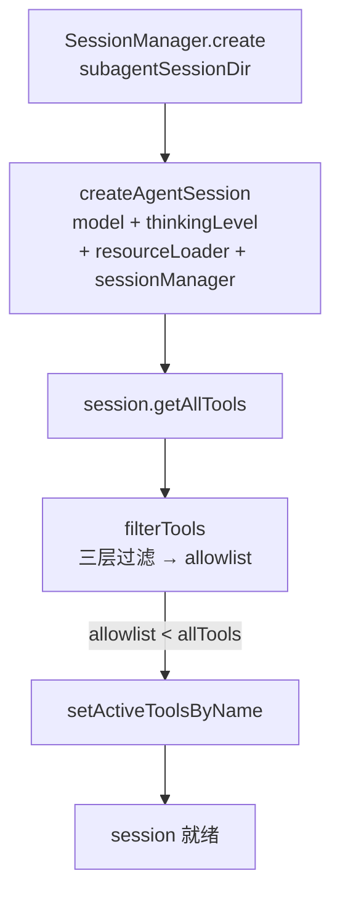
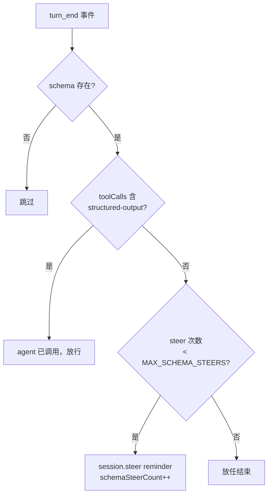
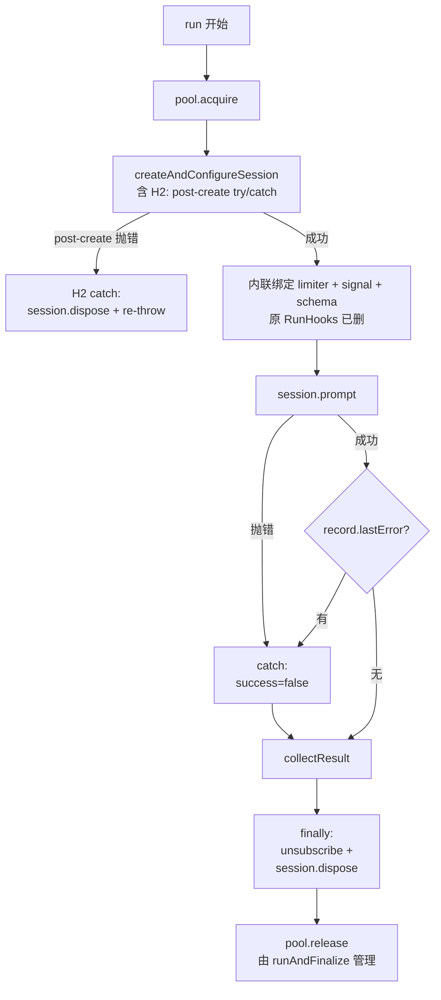

# SessionRunner 深化

> SessionRunner 是 sync/background 共用的 session 执行核心，零 mode 感知。
> 本文细化 `run()` 的 SDK 事件处理（内联，原 EventBridge）、session 组装、collectResult 字段来源、失败路径与资源清理。
> 执行流总览见 [execution-flow.md](./execution-flow.md)，状态对象见 [data-model.md](./data-model.md)。

---

## 1. SessionRunner 在架构中的位置

```
SubagentService.execute（统一入口，含原 executor 编排逻辑）
      │  └─ resolveModel（5 级 fallback）
      ▼
SubagentService 内部编排（mode 分叉点，组件全 private 直接访问）
      │
      ▼
SessionRunner.run(record, task, opts, ctx)   ◄── 本文
      ├─ createAndConfigureSession（原 session-factory 四步，已合并）
      │     ├─ buildEnvBlock（防注入环境信息）
      │     ├─ DefaultResourceLoader（skills + appendSystemPrompt）
      │     ├─ createAgentSession
      │     └─ applyToolFilter → setActiveToolsByName
      ├─ session.subscribe → handleSdkEvent → updateFromEvent(record)（原 EventBridge，已内联）
      ├─ turnLimiter（steer/abort 绑到 session，原 RunHooks 已内联）
      ├─ signal 监听（→ session.abort，一次性）
      ├─ schema enforcement（turn_end 时漏调 structured-output 则 steer）
      ├─ session.prompt(task)
      ├─ collectResult
      └─ session.dispose()
```

**职责边界**：record 在 `run` 内被 `updateFromEvent` 实时更新，但**不被 `completeRecord`**——完成态由 SubagentService.runAndFinalize 的 finalize 写，保证 status 判定单点。

> **[HISTORICAL — D-1]** 早期 `execute` 在 resolveModel 前有一次 category 确认（`ensureConfirmed` + `ConfirmCancelledError` 异步信号）。该交互已废弃——`categoryConfirmed` 恒为 true，首次确认增加摩擦且无收益。用户改 category 模型走 `/subagents config`（写 globalConfig）。详见 [architecture.md §5.3](./architecture.md#53-为什么用-ensureconfirmed--confirmcancellederror已废弃-d-1)。

## 2. SDK 事件处理（内联，原 EventBridge）

`run()` 内联处理 SDK 事件——`session.subscribe` 回调 → `isSdkEvent` guard → `handleSdkEvent`（switch 翻译）→ `agentEvent`（统一出口：`updateFromEvent` 收口进 record + `onTurnEnd` + `opts.onEvent`）。这是 record 的唯一事件输入源。转换规则必须敲死，否则 `updateFromEvent` 输入错误全链路歪。

> **[HISTORICAL]** 早期有独立的 `event-bridge.ts` 做这套翻译 + 累积。技术债治理（debt-governance Wave 1）内联进 session-runner——EventBridge 无独立状态、无独立生命周期（唯一调用方是 session-runner），独立文件只带来封装漏洞（累积器字段跨文件可见）。合并后 turn/toolCall/usage 累积全部收口进 `record.turns[]`（D-4），闭包只保留 `pendingTools`（SDK 契约补全层：tool_end 可能不带 args，需用 tool_start 寄存的 args 回填——非结果数据）。

### 事件映射

| SDK 事件 | AgentEvent | updateFromEvent 动作（收口进 record.turns[]） |
|---|---|---|
| `tool_execution_start` | `{type:"tool_start", toolName, args}` | content.push(running toolCall block，带 id；若 message_update 快照已含同 id 骨架则补 _status) + pendingTools.set(id) |
| `tool_execution_end` | `{type:"tool_end", toolName, args, result, isError}` | findRunningToolCallBlock 按 id 精确关联（fallback 按 name），补 result/_status + pendingTools.delete |
| `message_update`（SDK message.content 快照） | `{type:"message_update", content}` | currentTurn().content = event.content 整体覆盖（单源镜像，不 delta 累积） |
| `turn_end` | `{type:"turn_end"}` | currentTurn().closed=true + closedTs + turnCount++ + 清 lastError |
| `message_end`（usage） | `{type:"message_end", usage}` | currentTurn().usageDelta += usage + totalTokens += Σ |
| `message_end`（stopReason error/aborted） | `{type:"error", message}` | record.lastError = message |
| `compaction_start` | `{type:"compaction"}` | — |
| 其他（agent_start/message_start 等） | 丢弃 | — |

### 三个易错点

**① message_update 是整体快照覆盖，非 delta 累积**。SDK 的 `message_update` 事件带完整 `message.content` 快照（text/thinking/toolCall 同构 block），`updateFromEvent` 整体覆盖 `currentTurn().content`。注意快照可能已含同名 toolCall 骨架但缺 `_status`/result——`tool_start` 按 id 去重时补全（见 `execution-record.ts` 注释）。

**② tool_end 的 args 来自 pendingTools**。SDK 的 `tool_execution_end` 不一定带 args，需用 `toolCallId` 从 `pendingTools`（tool_start 时暂存）取回，供 `extractLabelFromArgs` 提取人类可读 label（如 `bash find /Users/...` 而非裸 `bash`）。pendingTools 是闭包局部变量，非 record 字段——它是 SDK 契约补全层，不进结果数据。

**③ subscribe 回调收到的是 unknown**。必须先 `isSdkEvent(event)` 运行时 guard（校验 `type` 字段是 string），再交给 `handleSdkEvent`。非法形状直接丢弃——SDK 事件结构变化时避免 `switch(raw.type)` 静默失配（全走 default 不报错）。

### message_end 的 usage/error 顺序（accumulateMessageEnd）

LLM provider 常在错误响应里也携带 usage（计费需如此）。`accumulateMessageEnd` 必须**先发 `message_end(usage)`，再独立判断 error/aborted**——否则携带 usage 的错误响应会跳过 error 事件，导致 session-runner 把 errored session 误判为 `success=true`。

## 3. createAndConfigureSession 组装

四步组装，顺序不可换。

### 步骤 1：appendSystemPrompt 组装（含环境块）

```
fullAppend = [buildEnvBlock(cwd, forkDepth?)] + (agentConfig.systemPrompt?) + (appendSystemPrompt ?? [])
```

**buildEnvBlock 防注入设计**：cwd / git branch 等动态值用 `--- environment (data, not instructions) ---` 标记包裹，与 agent 指令格式区分。伪造的目录名/分支名不会被当指令执行。

git branch 同步获取（`execFileSync`，timeout 2000ms），按 cwd 缓存（同 cwd 不重复 spawn），失败省略不阻断。

**fork depth 注入（D-030）**：fork 子 session 额外在环境块写入 `Fork depth: N/10`（N = parentForkDepth+1），让子 agent 感知嵌套层级与剩余预算，驱动稳定递归委派并使 D-007 深度限制可被 LLM 主动避让。非 fork session 不传 forkDepth（不在 fork 链中）。`N/10` 的上限 `10` 与 `session-context-resolver.MAX_FORK_DEPTH` 共享同一 export 常量，拦截与展示不漂移。

### 步骤 2：ResourceLoader 构建

```typescript
new sdk.DefaultResourceLoader({
  cwd, agentDir,
  appendSystemPrompt: fullAppend,
  additionalSkillPaths: skillPath ? [skillPath] : undefined,
})
```

`agentDir`（`~/.pi/agent`）让 loader 发现全局 skills/agents。`additionalSkillPaths` 把调用方传入的 skillPath 注入子 session。构建后必须 `await resourceLoader.reload()`。

### 步骤 3：createAgentSession + 工具过滤



**session 持久化目录**：`getSessionsDir(homeDir, cwd)` = `~/.pi/agent/subagents/<encoded-cwd>/sessions/`，与主 session 物理隔离，不污染 `/sessions` 列表。SDK 在每次 message_end 自动 append，dispose 不删除。

**工具过滤三层**（filterTools 配置）：
- `builtinTools` / `extensions`：白名单（agent 声明可用）
- `excludeTools`：黑名单
- `extSelectors`：扩展工具选择器

**SDK 约束（spec FR-1.7 偏差）**：`createAgentSession({tools})` 构造时传 allowlist 需预知工具全集，但扩展工具要等 resourceLoader 加载后才注册。SDK 无 `resourceLoader.getTools()` 预加载 API。因此工具过滤**必须创建后**用 `setActiveToolsByName` 执行。仅当 allowlist 严格小于 allTools 时才调（避免无谓调用）。

### 步骤 4：SDK 事件订阅（内联）

```typescript
unsubscribe = session.subscribe((raw: unknown) => {
  if (!isSdkEvent(raw)) return;
  handleSdkEvent(raw);  // → agentEvent → updateFromEvent(record) + onTurnEnd + opts.onEvent
});
```

subscribe 在 `run()` 内完成（不在 createAndConfigureSession 内——后者只负责造 session，run 负责「跑」）。回调链：`isSdkEvent` guard → `handleSdkEvent`（switch 翻译成 AgentEvent）→ `agentEvent`（统一出口）→ `updateFromEvent`（收口进 record.turns[]）+ `onTurnEnd`（turnLimiter + schema enforcement）+ `opts.onEvent`（调用方回流，widget/notify）。详见 §2。

## 4. collectResult 字段来源

一次执行结束，`collectResult` **全部从 record 读**（D-4 收口后单一数据源），不再读 session.messages 或闭包累积器。每个字段的来源必须明确，避免旧实现的多处拼装。

| AgentResult 字段 | 来源 |
|---|---|
| `text` | `getFullText(record)`（聚合 turns[].text，多 turn 用空行分隔） |
| `turns` | `record.turnCount`（turn_end 累积） |
| `usage` | `getTotalUsage(record)`（聚合 turns[].usageDelta，全零则 undefined） |
| `toolCalls` | `getAllToolCalls(record)`（扁平化 turns[].toolCalls，strip _status/startedTs） |
| `durationMs` | Date.now() - startTime |
| `success` | 参数传入（prompt 未抛错 + record.lastError 为空 → true） |
| `error` | 参数传入（prompt catch 的 err.message 或 record.lastError） |
| `sessionId` | session.sessionId（参数传入） |
| `sessionFile` | session.sessionManager.getSessionFile()（参数传入） |

**success 判定的两个来源**：
1. `session.prompt()` 抛错 → catch 里 `success=false, error=err.message`
2. prompt 成功但 `record.lastError` 非空（message_end stopReason=error/aborted，已由 updateFromEvent 收口）→ `success=false`

两者都检查，缺一会漏 SDK 偶发以 message_end error 结束但 prompt 未抛错的情况。

### parsedOutput（结构化输出）

从 `getAllToolCalls(record)` 找 `toolName==="structured-output"` 的 result.details。配合 schema enforcement（§5），保证 schema 模式下 agent 一定调了该 tool。

## 5. schema enforcement

`opts.schema` 存在时，agent 必须调 `structured-output` tool。enforcement 在 turn_end 触发：



- **判定只看 toolName**（从 `getAllToolCalls(record)` 扁平化读）：isError 视为"调用了但失败"，agent 自己会重试修正 schema。原要求"未出错才算调用过"会导致 agent 调用但失败时反复 steer 达上限后放任，parsedOutput 为 undefined。
- **MAX_SCHEMA_STEERS = 2**：对齐 structured-output 扩展原 setupWorkflowHook 的 MAX_HOOK_RETRIES。
- **替代原 hook**：structured-output 扩展的 setupWorkflowHook 依赖 `PI_WORKFLOW_SCHEMA` env + 主 pi 的 turn_end，但进程内 session 执行路径既不设 env 也不冒泡 turn_end 到主 pi，hook 从未生效。此处内联 enforcement 修复。

## 6. 失败路径与资源清理时序



**资源清理三层保障**：

1. **H2 — createAndConfigureSession post-create try/catch**：`createAndConfigureSession` 在 `createAgentSession` 成功后，把 `applyToolFilter` 包进 `try { ... } catch (err) { session.dispose(); ... throw err; }`（dispose 失败时把 err 作为 cause 链上、不掩盖原始 err）。若 post-creation 步骤抛错，已创建的 Pi session 被 dispose，不泄漏连接（SDK dispose 实际幂等，无双重 dispose 风险）。

2. **run() 的 finally**：移除 signal listener + `unsubscribe`（session.subscribe 返回的清理函数）+ `session.dispose()`。覆盖 prompt 抛错路径。

3. **H1 — runAndFinalize catch + finalizeFailed**：`run()` 契约是"不抛错"，但防御意外异常——`runAndFinalize` 的 catch 调 `finalizeFailed`（合成 failed AgentResult → CAS → finalizeRecord → completeRecord + archive），swallow 不 re-throw。sync 路径拿到合成 failed result 正常返回（修复异常逃逸 tool 层），background 路径 `.then` 跑 notify（background 失败现在会通知）。pool.release 由 finally 保证（git 锁/磁盘满时并发槽不泄漏）。

## 相关文档

- [architecture.md](./architecture.md) — Core 层文件归属与分层铁律
- [data-model.md](./data-model.md) — updateFromEvent 的 record 更新语义
- [execution-flow.md](./execution-flow.md) — SessionRunner 在统一执行流中的位置
