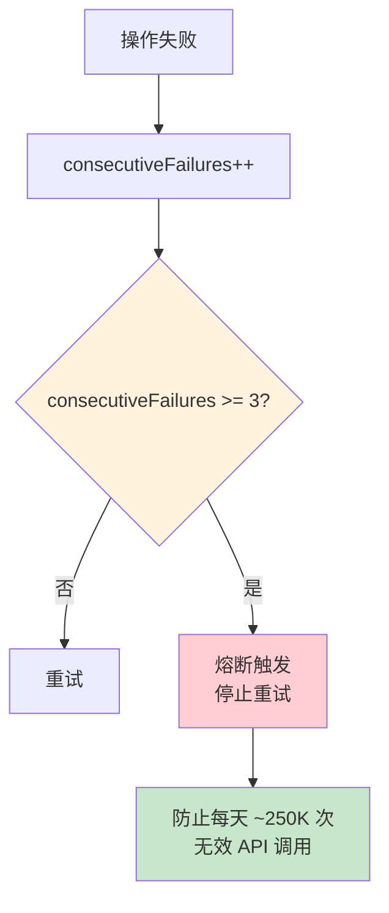

# 评估与观测 + 约束与恢复：业界最佳实践调研

> 调研日期：2026-05-21
> 调研范围：AI coding agent 领域的评估观测体系与约束恢复机制
> 信息来源：Claude Code 源码分析、Codex CLI 源码分析、SWE-bench/Devin/SWE-Agent 公开资料、业界论文与博客

---

## 第一部分：评估与观测（Evaluation & Observability）

### 1.1 核心问题定义

AI coding agent 的评估与观测要回答三个根本问题：

1. **效果评估**（Evaluation）：agent 完成任务的准确度、完整度和效率如何？
2. **过程观测**（Observability）：agent 在执行过程中发生了什么？为什么做出某个决策？
3. **质量保障**（Quality Assurance）：如何确保 agent 的输出在每次迭代中不退化？

这三者的关系是递进的：评估给出量化指标，观测提供可解释性，质量保障建立持续改进的闭环。

#### 核心矛盾

评估与观测面临一个根本矛盾：**agent 的执行路径是概率性的，但工程交付需要确定性**。传统软件有确定的输入输出映射，而 agent 对同一输入可能产生不同输出。这使得以下工作极其困难：
- 回归测试：上次通过的 case 这次可能失败
- 根因分析：失败可能源于模型、prompt、上下文、工具、时序等多因素组合
- 质量基线：无法定义"多少通过率算合格"

### 1.2 业界主流方案对比

#### 1.2.1 评估维度与方法论

| 维度 | Claude Code | Codex CLI | Devin | SWE-Agent |
|------|-------------|-----------|-------|-----------|
| **核心 Benchmark** | 内部评估 + SWE-bench | 内部评估 | SWE-bench Lite/Full | SWE-bench（原生设计目标） |
| **评估粒度** | 会话级 + 工具级 + token 级 | 会话级 + Turn 级 | 任务级（端到端） | Issue 级（PR 合并判定） |
| **自动评估** | AI 分类器 + 脚本验证 | JSONL 回放 + 断言 | 测试套件运行 | `eval.py` 自动化评估 |
| **回归检测** | Feature flag + 分桶 A/B | CI + 类型系统 | 人工评测 | SWE-bench 排行榜 |
| **成本评估** | Token 计数 + 收益递减检测 | Token 计数 | ACU（Agent Compute Units） | API 成本追踪 |
| **关键指标** | Token 效率 + 收益递减 | 会话回放正确性 | PR 合并率（67%）| % Resolved |

**Devin 评估的教训**：Cognition 尝试用传统工程能力矩阵评估但发现不适用。Devin 的代码库理解能力达到高级工程师水平，但执行能力只是初级水平。PR 合并率从 34% 提升到 67%，问题解决速度提升 4 倍。最危险的失败模式不是明显损坏的代码，而是看起来合理、能通过基本测试但包含微妙逻辑错误的代码——**"自信幻觉"问题**。

**SWE-Agent 的评估创新**：最新研究（arXiv 2601.19583）提出**架构感知评估方法**，将 agent 行为映射到组件级指标（推理、规划、工具使用、记忆管理），使用 LangSmith/DeepEval/Opik 等工具，取代随意的指标选择。核心洞察：传统 TDD/BDD 假设确定性行为、固定需求和二值 pass/fail，不适用于 LLM agent 评估。

#### 1.2.2 观测体系对比

| 维度 | Claude Code | Codex CLI | Devin | SWE-Agent |
|------|-------------|-----------|-------|-----------|
| **遥测管道** | 双层（1P 全量 + Datadog 白名单） | W3C Trace Context 分布式追踪 | 内部黑盒 | 日志输出 |
| **事件采样** | 动态采样率 + 用户桶化 | 全量（JSONL 持久化） | N/A | N/A |
| **紧急开关** | Sink Killswitch（动态关闭管道） | N/A | N/A | N/A |
| **会话恢复** | Transcript 持久化 + compact 边界 | JSONL 全量回放 | 浏览器回放 | 轨迹 JSON |
| **隐私控制** | 3P 提供商完全禁用 analytics | 企业策略锁定 | N/A | N/A |
| **分布式追踪** | 无（单体架构） | W3C Trace Context（跨进程） | N/A | N/A |

### 1.3 关键设计模式提炼

#### 模式一：分层评估漏斗

```
快速预检（成本 < $0.001）
  → 脚本验证（成本 < $0.01）
    → AI 评审（成本 ~$0.1）
      → 人工抽检（成本 ~$10）
```

**Claude Code 的实现**：
- **快速预检**：gate-check.py 验证文件存在 + YAML frontmatter 格式
- **AI 评审**：独立 review subagent，不继承主 agent 上下文
- **收益递减检测**：连续 3 轮 delta < 500 tokens 时早期停止

**Codex CLI 的实现**：
- **快速预检**：编译期类型检查（Rust 类型系统）
- **脚本验证**：单元测试 + 集成测试（CI 管道）
- **JSONL 回放**：全量会话持久化，支持确定性回放

#### 模式二：收益递减检测（Diminishing Returns Detection）

Claude Code 独创。核心思想：**当 agent 连续多轮产出的增量价值趋近于零时，强制终止**。

```typescript
// src/query/tokenBudget.ts
// 连续 3 轮 delta < 500 tokens → 判定为 diminishing returns
// 触发早期停止，防止空烧 token
if (consecutiveSmallOutputs >= 3 && progress < 90% budget) {
  injectStopDirective()
}
```

**数据支撑**：没有此机制时，1,279 个会话出现 50+ 次连续失败（最高 3,272 次），每天浪费约 250K API 调用。

#### 模式三：双层遥测管道

Claude Code 的观测架构：

| 层级 | 覆盖 | PII 处理 | 用途 |
|------|------|---------|------|
| 1P Event Logging | 全量事件 | 包含 PII | 内部分析 |
| Datadog | 30+ 白名单事件 | 自动 strip PII | 基础设施监控 |

**关键机制**：
- **Sink Killswitch**：`tengu_frond_boric` feature flag 可动态关闭整个管道
- **用户桶化**：SHA256 哈希分 30 桶，估计功能影响范围
- **队列缓冲**：启动前的事件排队，sink attach 后异步 drain
- **3P 隔离**：Bedrock/Vertex 提供商完全禁用 analytics

#### 模式四：W3C Trace Context 分布式追踪

Codex CLI 的观测架构。SQ/EQ 双队列模型天然切断调用栈（异步消息流），分布式追踪用于恢复因果关系：

```
Submission Queue → [事件带 trace_id] → Task 执行 → [span 记录] → Event Queue
```

**优势**：跨进程追踪（TUI ↔ App Server ↔ 远程执行）、可关联工具调用链路、支持性能分析。

#### 模式五：SWE-bench 评估方法论

SWE-bench 是目前 coding agent 领域最权威的评估基准：

| 指标 | 定义 | 局限 |
|------|------|------|
| **解决率**（% Resolved） | PR 通过所有测试用例 | 可能通过"暴力尝试"解决 |
| **补丁精确度** | diff 与 gold patch 的重合度 | 忽略等价但不同的正确方案 |
| **工具调用次数** | 完成任务的平均交互轮数 | 简单任务和复杂任务不可比 |
| **Token 消耗** | 完成任务的总 token 数 | 不同模型 token 定义不同 |

**已知局限**：
- 数据集偏向 Python/Django 生态
- 测试覆盖率不完整（可能有隐藏 bug 未被测试捕获）
- 确定性评估 vs 概率性执行的矛盾

**改进方向**（2025-2026）：
- SWE-bench Multimodal：加入 UI 截图验证
- SWE-bench Lite：子集化加速评估
- 企业内部 benchmark：用私有代码库建立定制化评估
- **SWE-bench Verified**：已成为 APR/LLM agent 研究标准基准，超过 99 个榜单提交
- **Solution Leakage 检测**：SWE-bench+ 引入 SoluLeakDetector（LLM-based），检测问题描述中是否"泄漏"了解决方案
- **弱测试用例增强**：TestEnhancer（LLM-based）加强测试套件，防止假阳性通过
- **任务突变**：EvoEval / AST-level mutation — 修改现有 benchmark 问题，检测模型是否在"记忆"而非"推理"

**SWE-bench 的演化数据**：最佳模型从 2023 年 ~2% 修复率 → 2025 年超过 75% Pass@1。

**重要发现：SWE-bench Illusion** — 研究指出 SWE-bench 的部分高分可能源于：(1) 问题描述中泄漏了解决方案线索，(2) 测试用例不够严格导致假阳性通过。这意味着**仅靠 SWE-bench 分数不足以评估 agent 的真实能力**，需要辅以多维度的质量评估。

#### 模式六：双层评估模型

业界（2025-2026）已从简单的 LLM 输出评分演变为 **two-layer 评估模型**：

| 评估层 | 评估内容 | 典型指标 |
|--------|---------|----------|
| **Reasoning Layer** | 规划/决策质量 | 步骤推进（Action Advancement）、路径效率 |
| **Action Layer** | 工具调用/执行正确性 | 目标完成率（Action Completion）、测试通过率 |

**核心洞察**：传统 pass/fail 无法区分"找到高效路径"和"绕了很多圈但结果对了"。必须分开评估推理质量和执行质量。

**评估工具生态**（2025-2026）：

| 工具 | 定位 | 特点 |
|------|------|------|
| **DeepEval** | Python-first graph-aware 评估 | 预置大量 metric，确定性评估 |
| **LangSmith** | LangChain 生态 | tracing + evaluation 一体化 |
| **Braintrust** | 架构分层 metric | 实现 regression gates |
| **Maxim AI** | 端到端评估 | simulation + experimentation + observability |
| **Galileo** | 评估 + 运行时保护 | 闭环式质量保障 |

**关键行业数据**（LangChain 2026 报告）：57% 的组织已部署 AI agent 到生产环境，32% 认为质量是最大障碍，仅 52% 的组织已采用 evaluation testing。

#### 模式七：LLM 视为外部依赖的测试策略

业界（2025）逐渐形成共识：**LLM 应被视为外部依赖（External Dependency），而非本地函数调用**。这意味着所有分布式系统的可靠性模式都适用于 AI agent 评估：

- **非确定性测试**：同一输入可能有多个正确输出，测试断言需要用语义等价而非精确匹配
- **服务级别协议（SLA）**：为 agent 设定通过率基线（如 90%），而非期望 100%
- **金丝雀发布**：新 prompt/模型先在 1% 流量验证，再逐步扩大
- **混沌工程**：主动注入故障（API 延迟、部分工具失败），测试 agent 的降级表现

### 1.4 最佳实践清单

#### 评估层面

| # | 实践 | 来源 | 要点 |
|---|------|------|------|
| E1 | **脚本化门禁** | Claude Code gate-check.py | 用脚本验证交付物（文件存在、格式正确），不依赖 AI 自我报告 |
| E2 | **独立评审者** | xyz-harness review subagent | 评审 subagent 独立上下文、独立模型，不受编码者 bias 影响 |
| E3 | **收益递减检测** | Claude Code tokenBudget | 连续低产出时自动终止，防止 token 浪费 |
| E4 | **YAML frontmatter 验证** | xyz-harness gate-check | 用结构化元数据（verdict/must_fix）实现自动化判定 |
| E5 | **Feature flag 分桶** | Claude Code GrowthBook | 新功能分桶灰度，量化影响后再全量发布 |
| E6 | **确定性回放** | Codex CLI JSONL 持久化 | 全量记录会话事件，支持确定性回放和回归测试 |
| E7 | **渐进式评估** | 业界通用 | 快速预检 → 脚本验证 → AI 评审 → 人工抽检，按成本分层 |
| E8 | **双层评估** | 业界 2025 | Reasoning Layer + Action Layer 分开评估推理质量和执行质量 |
| E9 | **Regression Gates** | Braintrust | 每次 agent 更新前自动跑评估，阻止退化版本上线 |
| E10 | **架构感知评估** | SWE-Agent arXiv 2601.19583 | 将 agent 行为映射到组件级指标，定位具体哪个组件失败 |

#### 观测层面

| # | 实践 | 来源 | 要点 |
|---|------|------|------|
| O1 | **双层遥测** | Claude Code analytics | 全量内部分析 + 白名单外部监控，PII 分层处理 |
| O2 | **紧急开关** | Claude Code Sink Killswitch | feature flag 可动态关闭整个遥测管道 |
| O3 | **分布式追踪** | Codex CLI W3C Trace Context | 异步架构中恢复因果关系 |
| O4 | **Transcript 持久化** | Claude Code / Codex CLI | 全量会话记录，支持事后分析和恢复 |
| O5 | **非阻塞初始化** | Claude Code setup.ts | 遥测初始化不阻塞主流程，磁盘缓存兜底 |
| O6 | **3P 隔离** | Claude Code | 第三方提供商（Bedrock/Vertex）完全禁用内部遥测 |

### 1.5 对 xyz-harness 的启示

#### 已有的优势

xyz-harness 的五层防御体系（L1-L5）已经覆盖了评估与观测的核心需求：

| 层级 | 对应最佳实践 |
|------|------------|
| L1 上下文隔离 | 防止 AI 利用前序 phase 记忆偷跑 |
| L2 脚本门禁 | E1 脚本化门禁 + E4 YAML 验证 |
| L3 独立评审 | E2 独立评审者 |
| L4 强制复盘 | E7 渐进式评估的最深层 |
| L5 结果可见 | O4 Transcript 持久化 |

#### 可改进的方向

1. **收益递减检测**（参考 E3）：当前 harness 没有"AI 在空转"的检测机制。可以在 phase 执行中追踪连续 tool call 的增量产出，触发早期干预。

2. **会话回放能力**（参考 E6）：Codex CLI 的 JSONL 全量回放非常适合 post-mortem 分析。harness 可以在 topic 目录中记录完整的 phase 执行轨迹（每个 tool call 的输入/输出/耗时），支持事后分析。

3. **成本追踪**（参考 E3）：当前 gate-check.py 不追踪 token 消耗。可以在 phase 级别追踪 token 预算使用，设置每个 phase 的 token 上限预警。

4. **遥测与监控**（参考 O1-O6）：当前 harness 是纯本地运行，没有遥测。如果未来需要多人使用或企业部署，需要建立遥测管道（但保留本地模式的零依赖优势）。

---

## 第二部分：约束与恢复（Constraints & Recovery）

### 2.1 核心问题定义

约束与恢复要回答三个问题：

1. **约束执行**（Constraint Enforcement）：如何确保 AI 在安全边界内行动？
2. **错误恢复**（Error Recovery）：当执行出错时，如何优雅降级而非崩溃？
3. **幻觉防护**（Hallucination Prevention）：如何防止 AI 生成虚假的执行结果或跳过关键步骤？

#### 核心矛盾

约束与恢复的根本矛盾：**约束越强，可用性越低；恢复越自动，安全风险越大**。

过度约束的后果：
- 每个操作都需要确认 → 用户关闭约束
- 沙箱隔离过严 → agent 无法完成任务
- 重试次数过少 → 瞬态错误导致失败

过度自动恢复的后果：
- 静默重试可能掩盖真正的问题
- 自动降级可能选择错误的恢复路径
- AI "自我修复"可能引入新问题

### 2.2 业界主流方案对比

#### 2.2.1 约束执行对比

#### 业界通用三层护栏模型（2025）

Cloud Security Alliance 等机构提出的三层防御模型已被广泛采用：

| 层级 | 延迟成本 | 功能 | 典型实现 |
|------|---------|------|----------|
| **L1 规则验证器** | <10ms | 正则、黑名单、PII 检测、格式校验 | Claude Code bashSecurity 20+ 检查器 |
| **L2 语义护栏** | ~200ms | 意图分类、内容安全、上下文边界检查 | Claude Code 两阶段 XML 分类器 |
| **L3 合规护栏** | 可异步 | GDPR/HIPAA、审计日志、策略引擎 | Codex CLI Cloud Requirements |

**关键发现**（Gartner 2025）：87% 企业缺乏完整 AI 安全框架，测试中先进模型仍有 87% jailbreak 漏洞。这意味着安全约束不是可选的，而是必需的。

| 维度 | Claude Code | Codex CLI | Devin | SWE-Agent |
|------|-------------|-----------|-------|-----------|
| **约束架构** | 内外层决策 + 规则引擎 | 纵深防御五层 | 沙箱 + 人工审批 | 工具白名单 |
| **沙箱** | 无（权限系统替代） | macOS Seatbelt / Linux Landlock | Docker 容器 | Docker 容器 |
| **审批模式** | default/auto/plan/bypass/dontAsk | suggest/auto-edit/full-auto | 人工确认 | 全自动 |
| **AI 自动分类** | 两阶段 XML 分类器 | 无 | 无 | 无 |
| **命令安全检查** | 20+ 检查器 + 4 层防御 | AST 分析 + 策略引擎 | 沙箱拦截 | 工具接口限制 |
| **密钥保护** | 无特殊机制 | age 加密 + OS Keyring | 环境变量注入 | 无 |
| **网络控制** | 无 | 本地 MITM 代理 + 域名白名单 | 容器网络隔离 | 无 |
| **Fail-Closed** | 全系统（默认拒绝） | 全系统（derive(Ord) 保证） | 沙箱默认拒绝 | 白名单默认拒绝 |

#### 2.2.2 错误恢复对比

| 维度 | Claude Code | Codex CLI | Devin | SWE-Agent |
|------|-------------|-----------|-------|-----------|
| **恢复策略** | 渐进式 6 层 | 类型系统强制 | 容器重启（新会话） | RetryAgent 重试循环 |
| **会话隔离** | compact 清除历史 | Turn 级状态隔离 | 新会话限定窄目录 | Docker 容器隔离 |
| **熔断器** | 连续 3 次失败停止 | exhaustive matching | 无 | 无 |
| **上下文溢出恢复** | 4 层压缩 + reactive compact | 三阶段压缩 | 上下文窗口管理 | 无 |
| **Prompt Too Long 恢复** | collapse drain → reactive compact | compact 三阶段 | 无 | 无 |
| **Max Output Tokens 恢复** | 升级 64K → 注入恢复消息（最多 3 次） | N/A | 无 | 无 |
| **模型 Fallback** | 主模型 → 备用模型 | N/A | N/A | N/A |
| **Withholding** | 瞬态错误隐藏（不暴露给用户和模型） | N/A | N/A | N/A |
| **API 限流处理** | 指数退避 + 熔断器 | 重试策略 | 重试 | 重试 |

### 2.3 关键设计模式提炼

#### 模式一：渐进式恢复（Progressive Recovery）

这是 Claude Code 最核心的恢复模式。不是简单的 try-catch，而是从低成本到高成本的渐进策略链：

```
错误发生
  → 层级 1: 重试（成本最低，1-2 秒延迟）
    → 层级 2: 降级（中等成本，切换模型）
      → 层级 3: 压缩（较高成本，丢失部分信息）
        → 层级 4: 熔断（保护性停止，避免资源浪费）
```

**具体实现路径**：

| 恢复路径 | 触发条件 | 恢复动作 | 失败后 |
|---------|---------|---------|-------|
| **Prompt Too Long** | 413 错误 | collapse drain → reactive compact | 终止会话 |
| **Max Output Tokens** | 输出被截断 | 升级 64K → 注入恢复消息（×3） | 终止会话 |
| **API 限流** | 429 错误 | 指数退避重试 | 熔断器停止 |
| **压缩失败** | AutoCompact 失败 | 连续 3 次后停止重试 | 熔断器停止 |
| **模型不可用** | FallbackTriggeredError | 切换备用模型 + 清空状态 | 抛出异常 |
| **工具执行失败** | 工具返回错误 | 错误消息注入上下文 | 模型决定下一步 |

**关键数据**：
- `AUTOCOMPACT_BUFFER_TOKENS = 13,000`（基于 p99.99 数据的安全边界）
- `MAX_CONSECUTIVE_FAILURES = 3`（1,279 sessions 有 50+ 次失败的经验值）
- 没有熔断器时每天浪费 ~250K API 调用

#### 模式二：Withholding 机制（Error Concealment）

**核心理念**：不是所有错误都需要暴露给用户和模型。

Claude Code 的 Withholding 机制在幕后处理可恢复错误：

```typescript
let withheld = false
if (contextCollapse?.isWithheldPromptTooLong(message)) withheld = true
if (reactiveCompact?.isWithheldPromptTooLong(message)) withheld = true
if (isWithheldMaxOutputTokens(message)) withheld = true

if (!withheld) {
  yield yieldMessage  // 只产出非错误消息
}
```

**为什么需要隐藏错误？**

模型看到错误后的典型反应是"修复"一个不存在的问题：
- API 返回 429 → 模型以为请求有问题 → 调整 prompt → 更多错误
- 上下文短暂溢出 → 模型以为任务太复杂 → 放弃子任务 → 信息丢失
- 工具瞬态失败 → 模型换一种方法 → 偏离最优路径

**Withholding 将瞬态错误与模型隔离，让系统在幕后自动恢复，模型感知到的是连续的成功流。**

#### 模式三：熔断器（Circuit Breaker）

Claude Code 的熔断器设计：



**为什么是 3 次？**

源码注释："BQ 2026-03-10: 1,279 sessions had 50+ consecutive failures (up to 3,272) in a single session, wasting ~250K API calls/day globally."

这个阈值是从生产数据中提炼的：3 次足以覆盖瞬态错误（429 限流、网络抖动），同时不会在不可恢复状态（模型配置错误、上下文损坏）下浪费资源。

#### 模式四：纵深防御（Defense in Depth）

Codex CLI 的五层安全架构是纵深防御在企业级 agent 中的代表实现：

```
第 1 层：进程加固 — pre_main() 阶段，禁 ptrace、禁 core dump、清危险环境变量
第 2 层：审批体系 — 白名单快判 → 策略规则匹配 → 用户确认
第 3 层：沙箱隔离 — macOS Seatbelt / Linux Landlock+Seccomp / Windows Restricted Token
第 4 层：网络代理 — 本地 MITM 代理，域名白名单/黑名单
第 5 层：密钥保护 — age 加密 + OS Keyring
```

**关键原则**：每层独立，单层失败不导致整体崩溃。安全决策通过 `derive(Ord)` 实现 `Allow < Prompt < Forbidden`，在 Rust 类型系统层面保证拒绝优先于允许。

#### 模式五：内外层决策架构（Two-Tier Decision）

Claude Code 的权限决策模型：

```
内层（规则引擎，确定性）
  → deny 规则检查 → ask 规则检查 → 工具自身安全检查 → 强制拦截检查
    → allow 规则检查 → 默认 ask

外层（策略层，模式 + AI）
  → 模式转换（default/auto/bypass/dontAsk）
    → 快速路径（白名单、acceptEdits）
      → AI 分类器（两阶段 XML）
        → 拒绝跟踪与回退
```

**dontAsk 转换放在外层最后一步**：注释原文 "This is done at the end so it can't be bypassed by early returns"。这是防御 AI 绕过约束的关键设计。

#### 模式六：Fail-Closed 全局原则

"默认拒绝"不是某个模块的选择，而是贯穿整个系统的原则：

| 层级 | Fail-Closed 体现 |
|------|-----------------|
| 工具接口 | `isConcurrencySafe` 默认 false，`isReadOnly` 默认 false |
| 权限系统 | 无匹配规则时默认 ask（用户确认），dontAsk 模式下转为 deny |
| 沙箱 | 默认不允许任何文件系统访问，显式配置才开放 |
| 网络代理 | 默认阻止所有网络访问，白名单才放行 |
| 命令安全 | 所有检查器默认拒绝，只有通过所有检查才允许 |

#### 模式七：Bash 四层安全检查链

Claude Code 对 Bash 命令的特殊防御：

```
第 1 层：Shell 元字符检测（20+ 检查器，覆盖管道、命令替换、重定向等）
  → 第 2 层：Zsh 危险命令黑名单（zmodload、emulate、sysopen 等内置命令）
    → 第 3 层：安全包装器剥离（timeout/nice/nohup 后的真实命令检测）
      → 第 4 层：Heredoc 安全验证（唯一允许 $() 绕过命令替换检查的路径）
```

**精妙之处**：
- 使用数字 ID 而非字符串记录安全检查触发，避免日志泄露用户代码
- 环境变量白名单剥离，只允许 `NODE_ENV`、`TZ`、`LANG` 等 30+ 个安全变量
- 子命令数量上限 50（防止指数级增长导致事件循环饥饿）

#### 模式八：渐进式安全升级（Progressive Security Escalation）

Codex CLI 的 ToolOrchestrator 实现"先沙箱后提权"：

```
工具执行请求
  → 默认在沙箱内执行
    → 沙箱权限不足
      → 请求用户审批提升权限
        → 用户批准后在沙箱外执行
        → 用户拒绝则操作失败
```

这个模式将安全性内建在工具执行路径中，对工具实现透明——工具不需要知道自己是在沙箱内还是沙箱外执行。

#### 模式九：质量感知熔断（Quality-Aware Circuit Breaker）

区别于传统基于 HTTP 状态码的熔断，AI agent 需要检测**输出质量失败**：JSON 解析失败、schema 验证不通过、语义不变量违反等。

```
传统熔断：连续 N 次 HTTP 5xx → 熔断
质量熔断：连续 N 次 API 调用成功但输出质量不达标 → 熔断
```

Claude Code 的实现体现了这一思路：连续 3 轮 delta < 500 tokens（产出质量下降）→ 触发早期停止，即使 API 调用本身是成功的。

#### 模式十：护栏校准（Guardrail Calibration）

业界（Wiley 2025）提出约束系统需要持续校准，跟踪三个核心指标：

| 指标 | 目标趋势 | 意义 |
|------|---------|------|
| 约束违规数 | 下降 | agent 逐渐学会在边界内行动 |
| 误报率（合法操作被阻止） | 保持低位 | 约束不过度影响正常工作 |
| 任务完成率 | 不下降 | 约束不导致 agent 能力退化 |

**关键警告**：过度约束会导致人类 operator 绕过护栏。Claude Code 通过拒绝跟踪与回退（连续 3 次拒绝回退到用户提示）缓解这一问题。

**多 Agent 传播问题**：编排 agent 的约束不会自动传播到子 agent。Claude Code 通过 `isConcurrencySafe` 的 Fail-Closed 默认值部分缓解——子 agent 默认不可并行，除非显式声明安全。Codex CLI 通过 `Constrained<T>` 类型实现配置的层叠约束——Cloud Requirements 可锁定策略不可被下层覆盖。

### 2.4 幻觉防护策略

AI agent 的"幻觉"在 coding 场景中表现为：
- **跳过检查**：声称"已验证"但实际未执行命令
- **伪造结果**：编造测试通过、覆盖率达标的假象
- **静默降级**：遇到困难时悄悄降低标准而非报告
- **偷看上下文**：利用前序信息跳过当前阶段应有的独立验证
- **提前规划**：在 spec 阶段就开始思考代码实现

#### 业界幻觉检测框架（2025）

| 检测层 | 方法 | 适用场景 | 成本 |
|--------|------|---------|------|
| **输出校验** | Schema 验证、类型检查、格式校验 | 结构化输出 | 极低 |
| **事实核查** | 交叉引用代码库、运行测试、执行命令 | 代码修改 | 低-中 |
| **语义一致性** | 检查 agent 的声明是否与实际行为一致 | 全局 | 中 |
| **执行轨迹审计** | 对比 agent 的 tool call 序列与其声称的行为 | 全局 | 高 |
| **独立评审** | 第二个 agent（独立上下文）审查第一个 agent 的输出 | 关键交付物 | 高 |

**xyz-harness 的 L2+L3 组合**（脚本门禁 + 独立评审）覆盖了其中三层（输出校验、事实核查、独立评审），是当前 coding agent 框架中最完整的幻觉防护之一。

#### 业界防护手段对比

| 防护手段 | Claude Code | Codex CLI | xyz-harness |
|---------|-------------|-----------|-------------|
| **脚本门禁** | gate-check.py 验证文件存在 | 类型系统强制 | gate-check.py 验证交付物 |
| **不可变状态** | 状态整体替换，非增量修改 | Rust 所有权 + channel | N/A |
| **独立评审** | Fork subagent 独立上下文 | N/A | review subagent 独立进程 |
| **上下文隔离** | compact 清除对话历史 | Turn 级状态隔离 | phase 切换时清除历史 |
| **Withholding** | 瞬态错误不暴露给模型 | N/A | N/A |
| **审计日志** | 数字 ID 记录安全检查 | JSONL 全量记录 | phase deliverables 持久化 |
| **信息不可信** | 记忆系统"怀疑式记忆" | N/A | N/A |

**Claude Code 的"怀疑式记忆"模式**值得特别关注：
- MEMORY.md 作为轻量索引（最多 200 行），详细内容按需加载
- Agent 被明确指示：基于记忆采取行动前，必须先在代码库中验证
- 只在文件成功写入后更新记忆索引（防止失败尝试污染记忆）
- autoDream 在空闲时做垃圾回收（合并、去矛盾、确认）

### 2.5 最佳实践清单

#### 约束执行

| # | 实践 | 来源 | 要点 |
|---|------|------|------|
| C1 | **纵深防御** | Codex CLI | 安全控制分布在多个独立层次，单层失败不导致整体崩溃 |
| C2 | **Fail-Closed 默认值** | Claude Code / Codex CLI | 所有默认值选择"拒绝"，显式配置才"允许" |
| C3 | **内外层决策分离** | Claude Code | 规则引擎（确定性）与策略层（模式+AI）分离 |
| C4 | **AI 辅助安全分类** | Claude Code | 两阶段 XML 分类器，快路径覆盖 70-90% 场景 |
| C5 | **拒绝跟踪与回退** | Claude Code | 连续 3 次拒绝回退到用户提示，承认分类器不完美 |
| C6 | **沙箱三平台策略** | Codex CLI | 平台原生沙箱（Seatbelt/Landlock/Restricted Token），无需 root |
| C7 | **命令 4 层安全检查** | Claude Code | 元字符 → 黑名单 → 包装器剥离 → Heredoc 验证 |
| C8 | **渐进式安全升级** | Codex CLI | 先沙箱后提权，对工具实现透明 |
| C9 | **密钥分层保护** | Codex CLI | age 加密 + OS Keyring + 作用域隔离 |
| C10 | **网络代理** | Codex CLI | 本地 MITM 代理 + 域名白名单/黑名单 |

#### 错误恢复

| # | 实践 | 来源 | 要点 |
|---|------|------|------|
| R1 | **渐进式恢复** | Claude Code | 从低成本到高成本的恢复策略链（重试→降级→压缩→熔断） |
| R2 | **熔断器** | Claude Code | 连续 3 次失败停止重试，防止 ~250K/天无效 API 调用 |
| R3 | **Withholding 机制** | Claude Code | 瞬态错误不暴露给模型和用户，防止"自我修复"不存在的问题 |
| R4 | **多层压缩恢复** | Claude Code | Prompt Too Long：collapse drain → reactive compact → 终止 |
| R5 | **输出截断恢复** | Claude Code | 升级 64K → 注入恢复消息（最多 3 次） |
| R6 | **模型 Fallback** | Claude Code | 主模型不可用时切换备用模型，清空中间状态重试 |
| R7 | **不可变状态** | Claude Code | 状态整体替换，每次迭代可回滚 |
| R8 | **确定性回放** | Codex CLI | JSONL 全量持久化，支持会话恢复和确定性回放 |

#### 幻觉防护

| # | 实践 | 来源 | 要点 |
|---|------|------|------|
| H1 | **脚本验证优先** | Claude Code / xyz-harness | 用脚本而非 AI 自我报告验证结果 |
| H2 | **上下文隔离** | xyz-harness | phase 切换时 compact 清除历史，防止偷跑 |
| H3 | **独立评审** | xyz-harness | review subagent 独立进程、独立上下文、独立模型 |
| H4 | **怀疑式记忆** | Claude Code | 记忆内容视为不可靠，行动前必须在代码库中验证 |
| H5 | **审计日志** | Claude Code / Codex CLI | 数字 ID 记录安全检查，JSONL 全量记录会话 |
| H6 | **强制复盘** | xyz-harness | 复盘不可跳过，retrospect 文件不存在则 BLOCKED |
| H7 | **执行轨迹审计** | SWE-Agent | 对比 agent 的 tool call 序列与其声称的行为，检测"自信幻觉" |

### 2.6 对 xyz-harness 的启示

#### 已有的优势

xyz-harness 在约束与恢复方面的设计已经相当先进：

| 已有机制 | 对应业界最佳 |
|---------|------------|
| gate-check.py 脚本验证 | C1 纵深防御 + H1 脚本验证优先 |
| AI 不可信执行者假设 | C2 Fail-Closed + H2 上下文隔离 |
| 五层防御体系（L1-L5） | C1 纵深防御 |
| phase-start 检查 retrospect | H6 强制复盘 |
| Phase 5 "MUST NOT merge" | C2 Fail-Closed |

#### 可改进的方向

1. **引入熔断器**（参考 R2）：当前 harness 没有连续失败的熔断机制。如果 AI 在某个 phase 反复失败（例如 gate check 连续失败 3 次），应该停止重试并报告问题，而非无限循环。**质量感知熔断**（模式九）特别适合 harness——不只检测 API 调用失败，还检测 gate check 连续失败（输出质量不达标）。

2. **Withholding 思路**（参考 R3）：当前 gate check 的失败信息直接暴露给 AI。对于瞬态失败（如网络问题导致的验证失败），可以先静默重试，成功后 AI 感知不到失败。避免 AI 在"修复"一个不是问题的问题。

3. **渐进式恢复**（参考 R1）：当前 harness 的恢复策略是二元的——gate pass 或 gate fail。可以引入多级恢复：
   - Level 1: 非关键字段缺失 → 自动补充，不阻塞
   - Level 2: 格式问题 → AI 修复后自动重试
   - Level 3: 核心交付物缺失 → 阻塞并要求 AI 修复

4. **怀疑式记忆**（参考 H4）：当前 harness 没有跨 session 的记忆机制。AI 可能在不同 topic 中重复犯相同错误。可以建立"失败模式知识库"，记录已知的 AI 逃脱行为和对策。

5. **命令安全检查**（参考 C7）：如果 harness 未来支持 AI 执行 bash 命令（如 gate-check.py 中的测试运行），需要引入 Bash 安全检查链，防止 prompt injection 通过 bash 命令执行恶意操作。

6. **确定性回放**（参考 R8）：当前 harness 的 phase 执行轨迹不完整。可以在 topic 目录中记录完整的 tool call 序列（输入/输出/耗时/结果），支持事后分析和问题复现。

7. **护栏校准机制**（参考模式十）：当前 harness 的约束参数（gate check 阈值、review 评分标准）是静态的。可以建立校准循环：每 N 个 topic 后统计违规数、误报率、任务完成率，动态调整约束参数。

---

## 总结：两个维度的交叉分析

### 评估与约束的协同效应

这两个维度不是独立的——它们形成了一个闭环：

```
约束执行 → 产生可观测的行为轨迹
  → 观测数据用于评估
    → 评估结果反馈到约束参数调整
      → 更精确的约束 → 更可预测的行为 → 更容易评估
```

**Claude Code 的协同案例**：
- 拒绝跟踪（约束）→ 产生拒绝事件（观测）→ 用于评估分类器准确率（评估）→ 调整分类器参数（约束优化）

**Codex CLI 的协同案例**：
- 沙箱策略（约束）→ JSONL 全量记录（观测）→ 回放验证正确性（评估）→ 改进沙箱规则（约束优化）

**xyz-harness 的协同案例**：
- gate check（约束）→ review subagent 反馈（观测）→ retrospect 复盘（评估）→ 改进 skill 指令（约束优化）

### xyz-harness 的独特定位

对比业界方案，xyz-harness 有几个独特之处：

1. **工作流级别的约束**（而非工具级别）：Claude Code 和 Codex CLI 的约束都在工具调用级别，而 xyz-harness 在工作流（phase）级别实施约束——这更适合"AI 作为不可信执行者"的假设。

2. **强制复盘闭环**：业界很少有系统将复盘（retrospect）作为不可跳过的强制环节。xyz-harness 的 L4 层（retrospect 失败 → BLOCKED）是独特的质量保障机制。

3. **上下文隔离的激进程度**：Claude Code 的 compact 保留对话摘要，而 xyz-harness 在 phase 切换时完全清除历史——这是更激进的信息隔离，适合对"AI 偷跑"零容忍的场景。

4. **缺乏运行时恢复**：这是当前最大的短板。Claude Code 的 6 层渐进恢复和 Codex CLI 的类型系统安全保障，在运行时容错方面远超 xyz-harness。xyz-harness 的恢复更多依赖"重做 phase"而非"在 phase 内自动恢复"。Devin 的"新会话限定窄目录"策略虽然破坏自主性，但提供了一种低成本的降级手段。

### 建议的优先改进路线

| 优先级 | 改进项 | 对应模式 | 预期收益 |
|--------|--------|---------|---------|
| P0 | 引入熔断器 | R2 | 防止 AI 在失败 phase 中无限循环 |
| P1 | 渐进式恢复 | R1 | 减少"全 phase 重做"的频率 |
| P1 | 会话回放轨迹 | E6 + R8 | 支持 post-mortem 分析和问题复现 |
| P2 | Withholding 机制 | R3 | 减少瞬态错误对 AI 决策的干扰 |
| P2 | 收益递减检测 | E3 | 防止 AI 在 phase 内空转 |
| P3 | 失败模式知识库 | H4 | 跨 session 的 AI 逃脱行为记录 |
| P3 | 命令安全检查 | C7 | 为未来 bash 支持做准备 |
| P3 | 架构感知评估 | SWE-Agent | 将 agent 行为映射到组件级指标，定位具体哪个组件失败 |
| P3 | "自信幻觉"检测 | Devin 教训 | 对"看起来合理但包含微妙错误"的输出增加交叉验证 |

---

## 附录：核心参考来源

| 来源 | 关键贡献 |
|------|---------|
| Claude Code v2.1.88 源码分析 | withRetry/熔断器/Withholding/收益递减检测/4层压缩/内外层权限 |
| Codex CLI 源码分析 | 纵深防御五层/SQ/EQ 双队列/沙箱三平台/JSONL 回放 |
| SWE-bench 评估体系 | Issue → PR 评估方法论/Benchmark 设计 |
| Devin 公开资料 | Docker 沙箱隔离/端到端任务评估 |
| SWE-Agent 框架 | 工具白名单/轨迹 JSON/自动化评估 |
| xyz-harness CLAUDE.md | AI 控制哲学/五层防御体系/信息隔离规则 |
