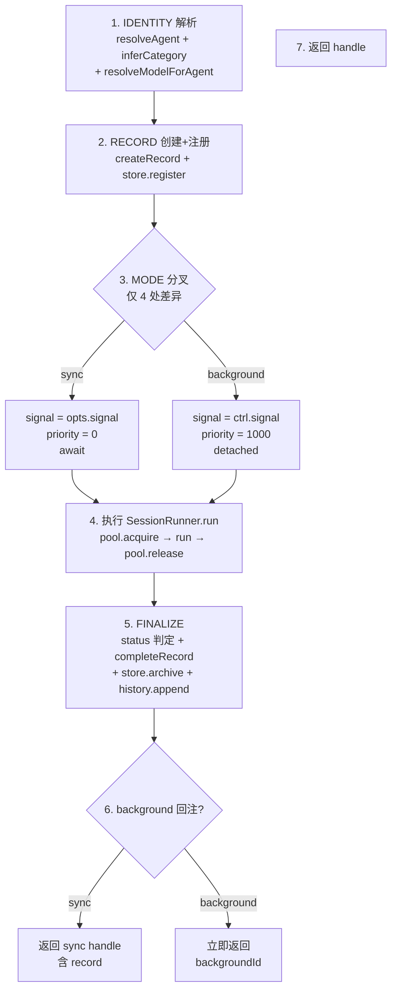
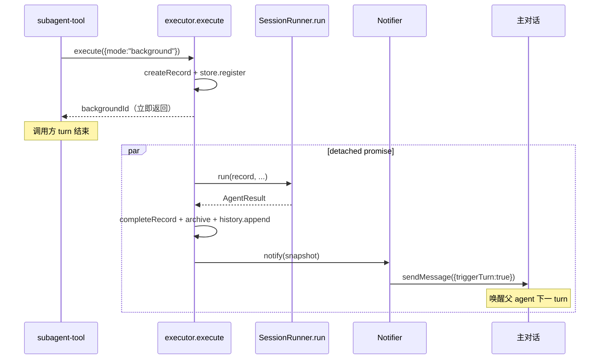
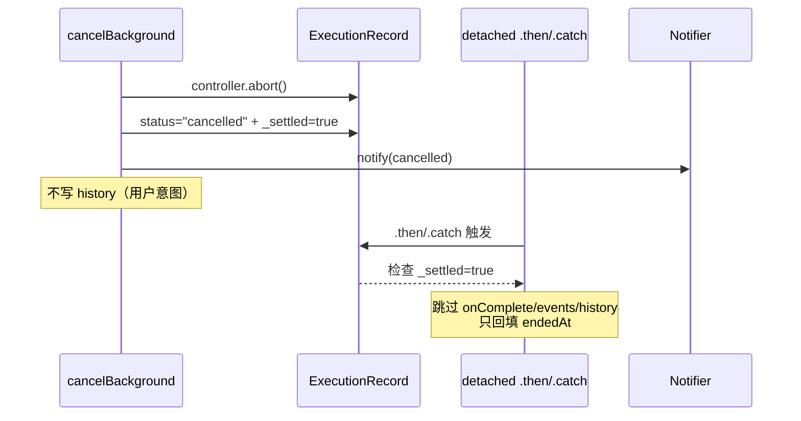

# Subagents 执行流程

> sync / background / poll 三条路径的统一执行流，以及 background detached 的时序与竞态处理。
> 状态对象定义见 [data-model.md](./data-model.md)，分层见 [architecture.md](./architecture.md)。

---

## 1. 三路径的物理语义

| 路径 | 调用方行为 | 结果交付 | 典型触发 |
|---|---|---|---|
| **sync** | `await`，阻塞调用方 turn | execute 返回时同步拿 record | `subagent({task})` 默认 |
| **background** | 不 await，立即拿 backgroundId | 完成后回注主对话（notifier） | `subagent({task, wait:false})` 或 agent 配 `defaultBackground` |
| **poll** | 查询既有 background | 返回当前 record 快照 | `subagent({backgroundId})` |

三条路径的差异**只有交付方式**，执行本体完全相同。poll 不创建新 record，只读既有 record 的 snapshot。

## 2. 统一执行流

`executor.execute(opts, runtime, ctx)` 是 sync/bg 共用的唯一入口。分七步，mode 分叉集中在第 3 步。



### 4 处 mode 差异（仅此 4 处，其余完全共用）

| # | sync | background | 根因 |
|---|---|---|---|
| ① 返回 | await，返回 `{mode:"sync", record}` | 不 await，立即返回 `{mode:"background", backgroundId}` | 调用语义定义 |
| ② priority | 0（高，抢占） | 1000（低，让步） | sync 需快速响应 |
| ③ signal | `opts.signal`（Pi tool 框架传入） | `controller.signal`（runtime 自建） | background 需 runtime 持有 controller 供 cancel |
| ④ notifier | 无（调用方还在 await） | `notifier.notify`（调用方已 return，靠事件回流） | 结果交付方式不同 |

`SessionRunner.run` **完全不感知 mode**——它只负责跑一次 session + 更新 record。这是重构的核心收敛点：旧实现的 `runAgent`（sync）与 `startBackground`（bg）两份近似逻辑，统一为一份。

## 3. SessionRunner.run（mode 无关）

SessionRunner 是 sync/bg 共用的执行核心。流程细化见 [session-runner.md](./session-runner.md)，此处只列职责边界：

```
SessionRunner.run(record, task, opts, ctx)
  ├─ pool.acquire(priority)          ← 外层（executor）已传入 priority
  ├─ isolation:worktree? → createWorktree
  ├─ createAndConfigureSession(model, tools, skills)
  ├─ EventBridge.subscribe → updateFromEvent(record)   ← record 唯一更新点
  ├─ turnLimiter + signal 监听
  ├─ schema enforcement（漏调 structured-output 则 steer）
  ├─ session.prompt(task)
  ├─ collectResult → AgentResult
  └─ session.dispose()
  finally: pool.release()
```

关键：record 在此函数内被 `updateFromEvent` 实时更新，但**不被 `completeRecord`**——完成态由 executor 统一写，保证 status 判定逻辑单点。

## 4. background detached 时序

background 的步骤 4-6 不在 `execute` 内 await，而是包进 detached promise。`execute` 在注册 record 后立即返回 backgroundId，完成回调异步触发。



### 与 cancelBackground 的竞态

用户可能在 background 执行中通过 `/subagents list` 按 x 取消。`cancelBackground` 与 detached promise 的 `.then`/`.catch` 存在竞态，需 `_settled` 守卫：



`_settled` 守卫防止 cancelBackground 已 settle 后，`.then`/`.catch` 重复触发副作用（onComplete/events.emit/history 双写）。这是旧实现 Must-fix #2 的结构性保留——cancel 是用户意图，detached 完成回调必须让步。

### notifier 合并窗口与去重

- **合并窗口**：2000ms 内多个 background 完成，合并为一条通知注入主对话
- **去重 TTL**：同 id 短时间内不重复通知（cancel 已 notify，detached 的 notify 被拦截）

## 5. cancelled 路径一致性

旧实现 cancelled 状态在 4 处分别判定，导致 Mode 3（poll）丢 turns/tokens/误显示 failed。新设计收敛为单点：

| 触发点 | 旧实现 | 新设计 |
|---|---|---|
| `execute` finalize | `signal.aborted ? cancelled : failed` | 同（唯一判定点） |
| bg `.then` | `controller.signal.aborted ? cancelled : ...` | 删除——交由 execute finalize |
| bg `.catch` | `record.controller?.signal.aborted ?? signal.aborted` | 删除——交由 execute finalize |
| `cancelBackground` | 设 status + notify | 设 `_settled`，不重复判定 |

`completeRecord` 由 execute finalize 唯一调用，status 参数已确定。`project()` 读取 record 的 turns/totalTokens（updateFromEvent 累积值，completeRecord 不清零），三路径（sync 返回 / bg poll / list 显示）字段完全一致。

## 6. history 单点写入

旧实现 sync 路径在 `runAgent` 写一条、background 在 `.then`/`.catch` 各写一条，且 cancel 会产生同 id 双写（cancelled + failed）。新设计：

- **唯一写入点**：`execute` 的 finalize 阶段，mode 字段区分 sync/background
- **cancel 不写 history**：`_settled` 守卫让 `.then`/`.catch` 跳过，cancel 是用户意图不计入执行记录
- **去重**：`history-store.recent()` 仍保留同 id merge 逻辑（endedAt 最新 + cancelled 优先），作为历史数据的防御性处理

## 相关文档

- [architecture.md](./architecture.md) — executor 在 Runtime 层的位置
- [data-model.md](./data-model.md) — ExecutionRecord 的状态机与 completeRecord
- [session-runner.md](./session-runner.md) — SessionRunner.run 的 EventBridge 契约与 collectResult 细节
