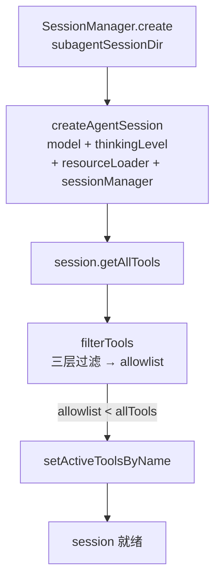
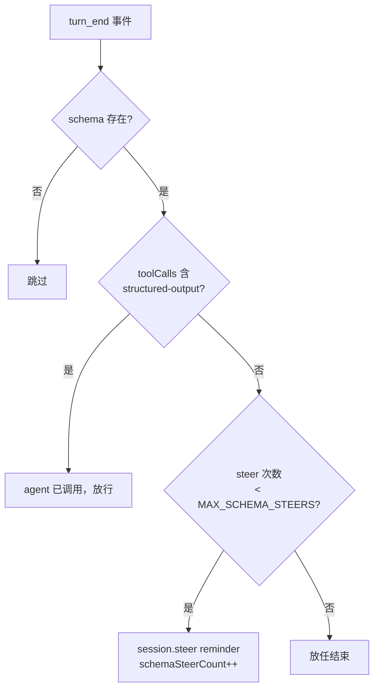
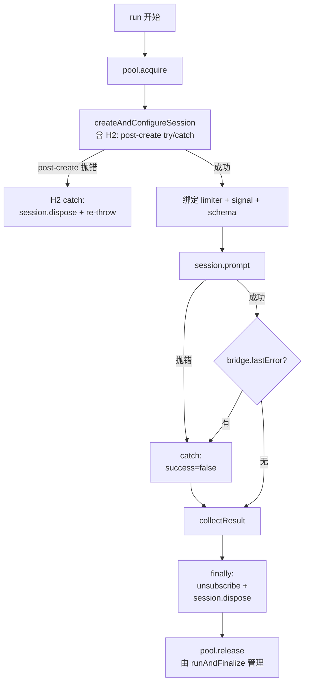

# SessionRunner 深化

> SessionRunner 是 sync/background 共用的 session 执行核心，零 mode 感知。
> 本文细化 `run()` 的 EventBridge 契约、session 组装、collectResult 字段来源、失败路径与资源清理。
> 执行流总览见 [execution-flow.md](./execution-flow.md)，状态对象见 [data-model.md](./data-model.md)。

---

## 1. SessionRunner 在架构中的位置

```
SubagentHub.execute（统一入口，含原 executor 编排逻辑）
      │  ├─ modelHub.ensureConfirmed（首次确认，经 onConfirmCategory 回调）
      │  └─ modelHub.resolveModel（5 级 fallback）
      ▼
SubagentHub 内部编排（mode 分叉点，组件全 private 直接访问）
      │
      ▼
SessionRunner.run(record, task, opts, ctx)   ◄── 本文
      ├─ createAndConfigureSession
      │     ├─ buildEnvBlock（防注入环境信息）
      │     ├─ DefaultResourceLoader（skills + appendSystemPrompt）
      │     ├─ createAgentSession
      │     ├─ filterTools → setActiveToolsByName
      │     └─ EventBridge.subscribe → updateFromEvent(record)
      ├─ turnLimiter.attach
      ├─ signal 监听
      ├─ schema enforcement（turn_end 时 steer）
      ├─ session.prompt(task)
      ├─ collectResult
      └─ session.dispose()
```

**职责边界**：record 在 `run` 内被 `updateFromEvent` 实时更新，但**不被 `completeRecord`**——完成态由 executor finalize 写，保证 status 判定单点。

### 为什么用 ensureConfirmed + ConfirmCancelledError

category 确认是 async（UI 交互），但 `resolveModel` 是纯 sync（5 级 fallback 不涉及 IO）。两个问题需要解：

1. **async 和 sync 怎么协调？** — `ensureConfirmed(onConfirm?)` 是 async（可以 await），`resolveModel` 保持 sync。execute 先 `await hub.ensureConfirmed(...)`，再调 `hub.resolveModel(...)`。确认逻辑在 execute 编排层完成，不在 resolveModel 内部。

2. **用户取消确认怎么表达？** — 用异常 `ConfirmCancelledError` 做控制流信号。catch 后终止执行（"用户不想执行子代理"是用户意图，不是程序错误）。比返回值更显式：调用方不需要先判 `needsConfirm` 再做分支。

**为什么不用返回值方案**（`{needsConfirm: true, input}`）？因为调用方要先判类型，再 await 确认，再重新调 resolveModel——两次调用，重复解析。异常方案一步到位：ensureConfirmed 抛异常 = 终止，不抛 = 已确认，resolveModel 直接用结果。

→ 详见 [architecture.md §6.3](./architecture.md#63-为什么用-ensureconfirmed--confirmcancellederror)

## 2. EventBridge 契约（SDK 事件 → AgentEvent）

EventBridge 把 Pi SDK 的原始 `AgentSessionEvent` 转成 subagents 内部的 `AgentEvent`，是 record 的唯一事件输入源。转换规则必须敲死，否则 `updateFromEvent` 输入错误全链路歪。

### 事件映射

| SDK 事件 | AgentEvent | bridge 累积 | updateFromEvent 动作 |
|---|---|---|---|
| `tool_execution_start` | `{type:"tool_start", toolName, args}` | pendingTools.set(id) | eventLog 推 tool_start |
| `tool_execution_end` | `{type:"tool_end", toolName, args, result, isError}` | toolCalls.push + pendingTools.delete | eventLog 推 tool_end |
| `message_update`（ame.type==="thinking_delta"） | `{type:"thinking_delta", delta}` | — | _currentThinking 累积 |
| `message_update`（ame.delta） | `{type:"text_delta", delta}` | — | _currentTurnText 累积 |
| `turn_end` | `{type:"turn_end"}` | turnCount++ | flush 缓冲 + turns++ |
| `message_end`（usage） | `{type:"message_end", usage}` | usageAccum += usage | totalTokens += Σ |
| `message_end`（stopReason error/aborted） | `{type:"error", error}` | lastError = msg | — |
| `compaction_start` | `{type:"compaction"}` | — | — |
| 其他（agent_start/message_start 等） | 丢弃 | — | — |

### 三个易错点

**① thinking_delta 必须在 text_delta 之前判断**。SDK 的 thinking_delta 事件也带 `delta` 字段，若先无条件提取 `ame.delta` 会把 thinking 内容误当 text。

**② tool_end 的 args 来自 pendingTools**。SDK 的 `tool_execution_end` 不一定带 args，需用 `toolCallId` 从 `pendingTools`（tool_start 时暂存）取回，供 `extractLabelFromArgs` 提取人类可读 label（如 `bash find /Users/...` 而非裸 `bash`）。

**③ subscribe 回调收到的是 unknown**。必须先 `isSdkEvent(event)` 运行时 guard（校验 `type` 字段是 string），再断言为 SdkEvent。非法形状直接丢弃——SDK 事件结构变化时避免 `switch(raw.type)` 静默失配（全走 default 不报错）。

### bridge 累积器 vs record 字段

```mermaid
flowchart LR
    SDK[SdkEvent] --> B[EventBridge.handle]
    B -->|累积| Acc[turnCount<br/>toolCalls[]<br/>usageAccum<br/>lastError<br/>pendingTools]
    B -->|转发| AE[AgentEvent]
    AE --> UF[updateFromEvent]
    UF -->|mutate| Record[ExecutionRecord<br/>turns / totalTokens<br/>eventLog]
    Acc -->|collectResult 读取| Result[AgentResult<br/>turns=bridge.turnCount<br/>usage=bridge.usage<br/>toolCalls=bridge.toolCalls]
```

`turnCount`/`toolCalls`/`usage` 在 bridge 和 record 各存一份，看似冗余，实际分工不同：
- **bridge 累积器**：供 `collectResult` 构造 AgentResult（执行结果）
- **record 字段**：供 `project()` 实时投影 Details（展示）

两套数据**同源**（都由 handle 驱动），但消费者不同。turn_end 时 bridge.turnCount++ 与 record.turns++ 同时发生，保持一致。

## 3. createAndConfigureSession 组装

四步组装，顺序不可换。

### 步骤 1：appendSystemPrompt 组装（含环境块）

```
fullAppend = [buildEnvBlock(cwd)] + (appendSystemPrompt ?? [])
```

**buildEnvBlock 防注入设计**：cwd / git branch 等动态值用 `--- environment (data, not instructions) ---` 标记包裹，与 agent 指令格式区分。伪造的目录名/分支名不会被当指令执行。

git branch 同步获取（`execFileSync`，timeout 2000ms），按 cwd 缓存（同 cwd 不重复 spawn），失败省略不阻断。

### 步骤 2：ResourceLoader 构建

```typescript
new sdk.DefaultResourceLoader({
  cwd, agentDir,
  appendSystemPrompt: fullAppend,
  additionalSkillPaths: skillPath ? [skillPath] : undefined,
})
```

`agentDir`（`~/.pi/agent`）让 loader 发现全局 skills/agents。`additionalSkillPaths` 把调用方传入的 skillPath 注入子 session。构建后必须 `await resourceLoader.reload()`。

### 步骤 3：createAgentSession + 工具过滤



**session 持久化目录**：`getSessionsDir(homeDir, cwd)` = `~/.pi/agent/subagents/<encoded-cwd>/sessions/`，与主 session 物理隔离，不污染 `/sessions` 列表。SDK 在每次 message_end 自动 append，dispose 不删除。

**工具过滤三层**（filterTools 配置）：
- `builtinTools` / `extensions`：白名单（agent 声明可用）
- `excludeTools`：黑名单
- `extSelectors`：扩展工具选择器

**SDK 约束（spec FR-1.7 偏差）**：`createAgentSession({tools})` 构造时传 allowlist 需预知工具全集，但扩展工具要等 resourceLoader 加载后才注册。SDK 无 `resourceLoader.getTools()` 预加载 API。因此工具过滤**必须创建后**用 `setActiveToolsByName` 执行。仅当 allowlist 严格小于 allTools 时才调（避免无谓调用）。

### 步骤 4：EventBridge 订阅

```typescript
bridge = createEventBridge(onEvent ?? (() => {}));
unsubscribe = session.subscribe((event: unknown) => {
  if (!isSdkEvent(event)) return;
  bridge.handle(event as SdkEvent);
});
```

调用方的 `onEvent`（executor 传入的 `updateFromEvent` wrapper）由 bridge 持有，每个 AgentEvent 转发时触发。

## 4. collectResult 字段来源

一次执行结束，`collectResult` 从 session + bridge 组装 AgentResult。每个字段的来源必须明确，避免旧实现的多处拼装。

| AgentResult 字段 | 来源 |
|---|---|
| `text` | session.messages 最后一条 assistant message 的 text 部分（倒序找） |
| `turns` | bridge.turnCount（turn_end 累积） |
| `usage` | bridge.usageAccum（input/output/cacheRead/cacheWrite/cost），全零则 undefined |
| `toolCalls` | bridge.toolCalls（tool_execution_end 累积） |
| `durationMs` | Date.now() - startTime |
| `success` | 参数传入（prompt 未抛错 + bridge.lastError 为空 → true） |
| `error` | 参数传入（prompt catch 的 err.message 或 bridge.lastError） |
| `sessionId` | session.sessionId |
| `sessionFile` | session.sessionManager.getSessionFile()（持久化路径） |

**success 判定的两个来源**：
1. `session.prompt()` 抛错 → catch 里 `success=false, error=err.message`
2. prompt 成功但 `bridge.lastError` 非空（message_end stopReason=error/aborted）→ `success=false`

两者都检查，缺一会漏 SDK 偶发以 message_end error 结束但 prompt 未抛错的情况。

### parsedOutput（结构化输出）

从 bridge.toolCalls 找 `toolName==="structured-output"` 的 result.details。配合 schema enforcement（§5），保证 schema 模式下 agent 一定调了该 tool。

## 5. schema enforcement

`opts.schema` 存在时，agent 必须调 `structured-output` tool。enforcement 在 turn_end 触发：



- **判定只看 toolName**：isError 视为"调用了但失败"，agent 自己会重试修正 schema。原要求"未出错才算调用过"会导致 agent 调用但失败时反复 steer 达上限后放任，parsedOutput 为 undefined。
- **MAX_SCHEMA_STEERS = 2**：对齐 structured-output 扩展原 setupWorkflowHook 的 MAX_HOOK_RETRIES。
- **替代原 hook**：structured-output 扩展的 setupWorkflowHook 依赖 `PI_WORKFLOW_SCHEMA` env + 主 pi 的 turn_end，但进程内 runAgent 路径既不设 env 也不冒泡 turn_end 到主 pi，hook 从未生效。此处内联 enforcement 修复。

## 6. 失败路径与资源清理时序



**资源清理三层保障**：

1. **H2 — session-factory post-create try/catch**：`createAndConfigureSession` 在 `createAgentSession` 成功后，把 `applyToolFilter`/`session.subscribe` 包进 `try { ... } catch (err) { session.dispose(); throw err; }`。若 post-creation 步骤抛错，已创建的 Pi session 被 dispose，不泄漏连接（SDK dispose 实际幂等，无双重 dispose 风险）。

2. **run() 的 finally**：`unsubscribe`（session.subscribe 返回的清理函数）+ `session.dispose()`。覆盖 prompt 抛错路径。

3. **H1 — runAndFinalize catch + finalizeFailed**：`run()` 契约是"不抛错"，但防御意外异常——`runAndFinalize` 的 catch 调 `finalizeFailed`（合成 failed AgentResult → CAS → finalizeRecord → archive + history.append），swallow 不 re-throw。sync 路径拿到合成 failed result 正常返回（修复异常逃逸 tool 层），background 路径 `.then` 跑 notify（background 失败现在会通知）。pool.release 由 finally 保证（git 锁/磁盘满时并发槽不泄漏）。

## 相关文档

- [architecture.md](./architecture.md) — Core 层文件归属与分层铁律
- [data-model.md](./data-model.md) — updateFromEvent 的 record 更新语义
- [execution-flow.md](./execution-flow.md) — SessionRunner 在统一执行流中的位置
