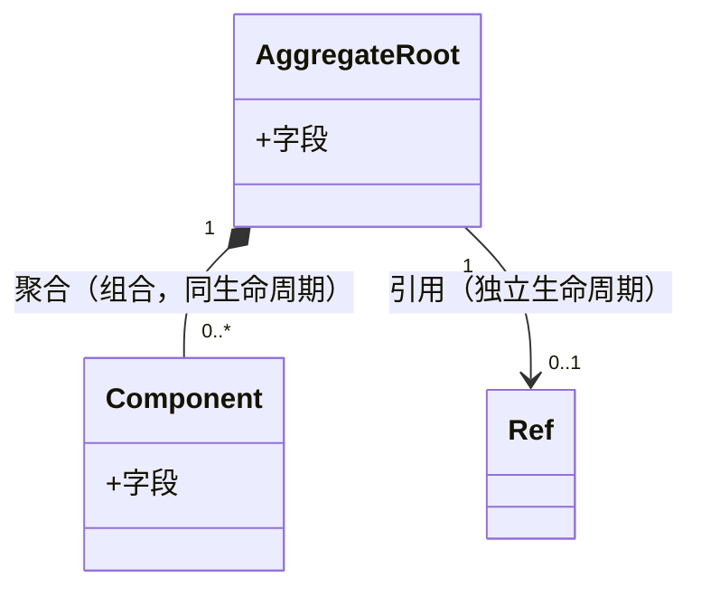

# 交付物模板：system-architecture.md + system-architecture.html

## frontmatter

```yaml
---
verdict: pass
mode: refactor | greenfield
upstream: requirements.md
downstream: issues.md
backfed_from:   # 被哪些下游阶段反哺过（如 [③, ⑤]），初始为空
---
```

## 章节结构

```markdown
# {系统/模块} 架构设计

## 1. 目标转换

### 业务目标 → 系统目标
| 业务目标(requirements) | 转换为系统目标 | 衡量标准 |
|----------------------|--------------|---------|

### 搭便车改造目标
（顺带做的非业务驱动的架构改进，标注来源：技术债/性能/可维护性）
| 改造目标 | 动机 | 关联业务目标 | 状态 |
|------|------|-------------|------|

> **状态列语义**（搭便车清单的生命周期管理，非悬挂到底）：
> - `候选` — ②Step1 用户表达意向，范围/风险待 ⑤骨架验证确认真实工作量
> - `待⑤确认` — ②审查通过，挂着等 ⑤骨架验证核对工作量（design-code-arch Step7 强制核对）
> - `已纳入` — ⑤确认可行，本轮纳入（最终态）
> - `已回流` — ⑤发现远超预期，回流②重新确认范围（带⑤骨架证据）
> - `打回` — 用户在本阶段决定不做本轮搭便车，标注原因

## 2. 设计立场

一句话回答根因问题：**核心计算是什么？** 及分层决策。

## 3. 统一语言（Ubiquitous Language）

> 引用/更新项目根目录 CONTEXT.md。本节只列本次新增/修改的术语。

## 4. 核心模型

| 模型 | 类型 | 不变式 | 建模理由 |
|------|------|--------|---------|
| {Name} | aggregate/实体/值对象/DTO | {变更守卫} | {为什么建模} |

### 模型关联图（条件强制）

> 表格逐模型自描述，表达不了**模型间关系**（聚合/组合/引用/基数/生命周期绑定）。
> 关系约束散落在不变式文字里会被遗漏——D-021「4 facet 内聚」「双源不一致」本质都是关系问题。
> 条件强制（与状态机降级同范式）：
> - **模型 ≥ 2 且存在聚合/引用关系** → 必须出 mermaid `classDiagram`
> - **单模型 / 纯独立 DTO** → skip（画图为噪音）



> 每条边建议注明：关系类型（组合/聚合/引用）+ 基数 + 生命周期绑定（同生灭/独立）。

### 降级决策（主动不建模）
| 概念 | 为什么不建模 | 应有的处理 |

## 5. 状态流转

### Status 枚举（只描述阶段，不含原因）
### Reason 字段（描述终态原因，与 Status 正交）
### 合法转换（图或表，含终态集合不可逆）

## 6. 分层架构

### 层级图
（Interface / Engine / Infrastructure，标注每层职责）

### Port 清单
| Port | 价值定位 | 实现数 |

## 7. 模块划分与变化轴

| 模块 | 职责 | 变化轴 | LOC(预估) |
|------|------|--------|----------|

## 8. 系统间上下文边界（Context Map）

（Mermaid — 系统间关系：本系统/上下游/共享内核/客户-供应商）

| 关联系统 | 关系模式 | 交互方式 | 契约稳定性 |

## 9. 泳道图（Swimlane）

（Mermaid sequenceDiagram 或 flowchart — 系统/模块间职责流转，谁做什么）

## 10. 挑战与决策

### D-{N}: {决策标题}
**张力**: {X 和 Y 的张力}
**决策**: {选择}
**理由**: {基于系统性质}

### 特化决策（违反通用规则的）
每条记录：违反什么 + 为什么合理 + 触发变化怎么办

## 11. 反模式检查（grep 验收清单）

机器可检查的 AC：
### AC-1: {反模式}消除
- 验证：`grep -rn "{pattern}" src/` 无输出

## 12. 行为契约保持清单（refactor 模式；greenfield 写降级理由跳过）

> 对应追踪视角 6。重构要保持现有行为等价——「代码有但 requirements 没写」的行为必须逐条显式列出，
> 否则架构变更会无声地改掉它。架构变更与行为变更必须**分离**：本节只登记「保持」，
> 任何「变更/删除」是独立 ticket，不裹进架构 PR。

### BC-{N}: {行为简述}
| 字段 | 内容 |
|------|------|
| 源码位置 | `file:line` |
| 处理 | 保持 / 变更(→独立 ticket) / 删除(→独立 ticket) |
| 冲突 | 与 requirements 冲突则标 `[CONFLICT]`，必须由用户决策后才能定稿 |

## 下游衔接
### 喂给 Step 3（Issue 拆分）的部分
| 本文档章节 | issue 拆分用途 |
```
