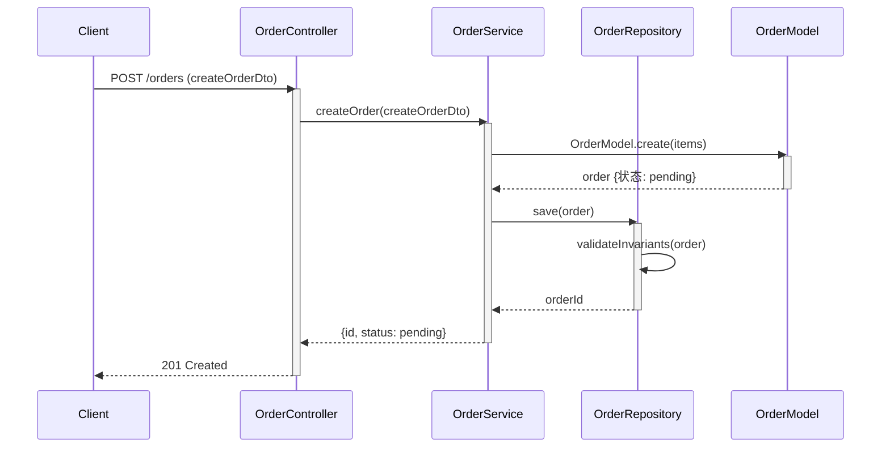
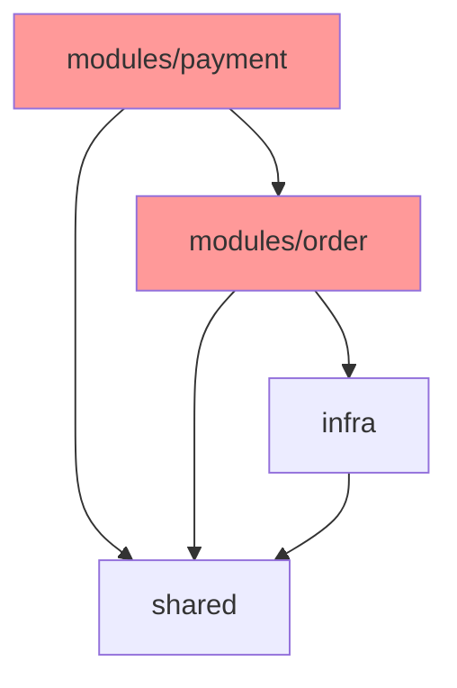

# 类方法时序图模板

> 核心产出。从 API 入口到最底层的**完整类方法调用时序**。
> 要求尽量拆分详细——每个关键功能都要有一张时序图。

## 为什么画时序图

时序图填补「设计」和「代码」之间的空白：
- **验证调用链完整** — 从入口到底层，中间不能断（Call-Chain Closure）
- **暴露依赖方向** — 谁调谁，一眼看出循环依赖
- **推导 Wave 编排** — Step 6 直接从时序图读出依赖关系
- **检测可测性** — 看时序图能判断接口设计是否可测

## Mermaid 时序图语法



## 每个功能的时序图要求

对每个关键功能（对应 requirements.md 的用例），画一张时序图，包含：

1. **所有参与的类/模块**（participant）—— 从入口到底层
2. **方法调用链**（带参数类型，不写实现）
3. **返回值**（带类型）
4. **激活条**（activate/deactivate——标明调用栈深度）
5. **异常路径**（alt/else 块标明错误分支）

### 异常路径标注

```mermaid
sequenceDiagram
    ...
    Svc->>Repo: save(order)
    activate Repo
    alt 成功
        Repo-->>Svc: orderId
    else 唯一约束冲突
        Repo-->>Svc: ConflictError
        Svc->>Svc: handleConflict() → retry
    else DB 不可用
        Repo-->>Svc: DbError
        Svc-->>Ctrl: 503 Service Unavailable
    end
    deactivate Repo
```

## 方法签名表（与时序图配套）

每个时序图配一张方法签名表（强化版 Interface Contracts）：

```markdown
### 功能: {功能名}

#### 时序图
（上面的 Mermaid）

#### 方法签名表

| 类 | 方法 | 签名 | 返回 | 边界条件 | Spec/Issue 关联 |
|----|------|------|------|---------|----------------|
| OrderController | createOrder | (dto: CreateOrderDto) → Response | 201/400/409 | dto 校验失败→400 | UC-1 |
| OrderService | createOrder | (dto: CreateOrderDto) → OrderResult | OrderResult | 幂等键重复→返回已有 | #1 |
| OrderModel | create | (items: Item[]) → Order | Order | items 为空→抛 InvariantError | — |
| OrderRepository | save | (order: Order) → OrderId | OrderId | 唯一约束→ConflictError | — |

#### 数据流链
Client → Controller.createOrder(dto) → Service.createOrder(dto) → Model.create(items) → Repository.save(order) → DB

#### 关联
- requirements.md 用例: UC-1
- issues.md 方案: #1 方案A
- NFR 影响: 并发(幂等) + 数据(事务)
```

## 工程目录规划

时序图之外，还要产出工程目录树：

```markdown
## 工程目录

src/
├── modules/
│   ├── order/              # 订单模块（变化轴：订单生命周期）
│   │   ├── controller.ts   # OrderController — HTTP 入口
│   │   ├── service.ts      # OrderService — 业务编排
│   │   ├── model.ts        # OrderModel — 领域模型+不变式
│   │   ├── repository.ts   # OrderRepository — 持久化(port实现)
│   │   └── port.ts         # OrderRepositoryPort — 持久化port(2 adapter)
│   └── payment/            # 支付模块（变化轴：支付方式）
│       └── ...
├── shared/                 # 跨模块共享
│   ├── errors.ts           # 错误类型
│   └── types.ts            # 共享类型
└── infra/                  # 基础设施（变化轴：技术资源）
    ├── db.ts               # DB 连接
    └── logger.ts           # 日志
```

每个目录标注：
- **职责**（一个变化轴）
- **包含的核心类/文件**
- **依赖方向**（依赖谁，被谁依赖）

## 包依赖图



标注：
- **import 规则**（如 modules/* 不能互相 import，除非有显式理由→标特化）
- **循环依赖检测点**（graph TD 中箭头成环处）

## 时序图是骨架的蓝图

时序图不是终点——**Step 7 骨架验证会把每张时序图落成真实可达的调用链**。因此画时序图时要确保：

- 每个方法调用（箭头）在 §3 签名表里有对应定义（否则骨架编译不过）
- 调用链入口→底层完整不断裂（骨架验证会检查 import 可达性）
- 异常路径的每个 alt/else 有明确的错误返回类型（骨架的类型契约要覆盖）

时序图走不通（数据流需跨层穿透/调用链断裂）= system-architecture.md 模型边界有问题 →
回 Step 2 调整模型边界，不要在时序图里硬凑。
