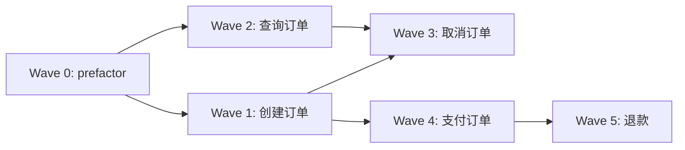

# Wave 编排模板

> 每个垂直切片（Wave）的标准结构 + 完整 Wave 调度表。

## 单个 Wave 模板

```markdown
## Wave {N}: {Wave 名}

**切片类型**: prefactor / 垂直切片
**P 级覆盖**: P0 / P1 / P2（本 Wave 包含的 issue 优先级）
**Blocked by**: Wave {N}（无则「无——可立即开始」）
**并行关系**: 与 Wave {M} 并行 / 串行

### 包含的功能/issue
- 功能: {功能名}（关联时序图: code-architecture.md §4.X）
- Issue: #{N}（P0，方案 A）

### 文件影响
- 创建: `src/modules/order/model.ts`, `src/modules/order/service.ts`
- 修改: `src/modules/shared/types.ts`
- 测试: `tests/order/model.test.ts`

### Subagent 配置

| 配置项 | 值 |
|--------|---|
| Agent | general-purpose（→ general-purpose → general-purpose）|
| 注入上下文 | requirements.md UC-1 + issues.md #1 方案A + code-architecture.md §4.1 时序图 |
| 读取文件 | {现有文件路径} |
| 修改/创建文件 | {本 Wave 的文件清单} |

### 执行流（Wave 内部）
串行派遣，每步走完整 subagent 链后再下一步：

1. general-purpose（读 TDD + 编码规范）→ 写失败测试
2. general-purpose（读编码规范）→ 写实现代码
3. general-purpose（读 reviewer 规范）→ spec 合规检查

### 验收标准
- [ ] {可测试的验收条件——对应 requirements.md 的 AC}
- [ ] 时序图的所有方法已实现
- [ ] 测试通过
```

## 完整 Wave 调度表

```markdown
## Wave 编排总览

### 依赖 DAG 图



### 调度表

| Wave | 切片 | P级 | Blocked by | 并行组 | 说明 |
|------|------|-----|-----------|--------|------|
| 0 | prefactor | — | 无 | — | 提取共享模块，铺路 |
| 1 | 创建订单 | P0 | Wave 0 | A | 核心路径起点 |
| 2 | 查询订单 | P1 | Wave 0 | A | 与 Wave 1 并行（不改同文件）|
| 3 | 取消订单 | P1 | Wave 1, 2 | B | 依赖订单 model |
| 4 | 支付订单 | P0 | Wave 1 | B | 与 Wave 3 并行 |
| 5 | 退款 | P2 | Wave 4 | C | 依赖支付 |

### 并行约束
- 同一并行组内最多 3 个 subagent 并行（Semaphore 限制）
- 同一文件不允许多个 Wave 同时修改（冲突）
- 前端 Wave 通常需要对应后端 Wave 的 API 已就绪

### 后续迭代（P3 延后）
- Issue #8 [P3]: 批量操作 — 延后理由：当前 QPS 无批量需求
- Issue #10 [P3]: 国际化 — 延后理由：优先国内市场
```

## 从时序图到 Wave 的推导检查

确保每个 Wave 的依赖关系准确：

1. [ ] 每个 Wave 关联的时序图中调用的方法，其定义是否在更早的 Wave？
2. [ ] 同一并行组的 Wave，修改的文件是否有交集？（有交集 → 不能并行）
3. [ ] P0 issue 是否都在 Wave 0-1？
4. [ ] P3 issue 是否都标注了「后续迭代」+ 延后理由？
5. [ ] Prefactor Wave（如有）是否真的为后续 Wave 铺路了？
