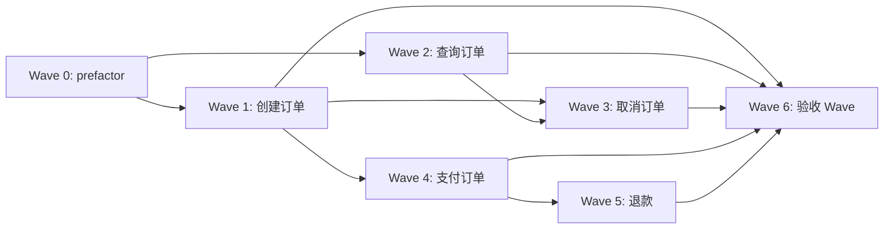

# Wave 编排模板

> 每个垂直切片（Wave）的标准结构 + 完整 Wave 调度表。

## 单个 Wave 模板

```markdown
## Wave {N}: {Wave 名}

**切片类型**: prefactor / 垂直切片
**P 级覆盖**: P0 / P1 / P2（本 Wave 包含的 issue 优先级）
**Blocked by**: Wave {N}（无则「无——可立即开始」）
**并行关系**: 与 Wave {M} 并行 / 串行

### 包含的功能/issue
- 功能: {功能名}（关联时序图: code-architecture.md §4.X）
- Issue: #{N}（P0，方案 A）

### 文件影响
- 创建: `src/modules/order/model.ts`, `src/modules/order/service.ts`
- 修改: `src/modules/shared/types.ts`
- 测试: `tests/order/model.test.ts`

### 覆盖的 test-matrix 用例 ID（完成判定）
> 来自⑤code-architecture.md §6（来源 A 功能 + 来源 B NFR）。每 Wave 必须列出——
> **这是本 Wave 的完成定义**：下列用例对应测试全部 PASS 才算本 Wave 完成（非参考）。
> ⑥追踪视角「测试闭环」检查所有 Wave 并集 = 全部用例。
- T1.1, T1.2（正常+边界）
- T1.3（异常：唯一约束冲突）
- T1.6（NFR 来源B：恶意输入防注入）
- T3.4（状态：pending→paid）

### Subagent 配置

| 配置项 | 值 |
|--------|---|
| Agent | general-purpose（→ general-purpose → general-purpose）|
| 注入上下文 | requirements.md UC-1 + issues.md #1 方案A + code-architecture.md §4.1 时序图 + §6 对应用例 |
| 读取文件 | {现有文件路径} |
| 修改/创建文件 | {本 Wave 的文件清单} |

### 执行流（Wave 内部）
串行派遣，每步走完整 subagent 链后再下一步：

1. general-purpose（读 TDD + 编码规范）→ 写失败测试
2. general-purpose（读编码规范）→ 写实现代码
3. general-purpose（读 reviewer 规范）→ spec 合规检查

### 验收标准
- [ ] 本 Wave 覆盖的 issue AC 逐条列全并全过（trace: issue #{N} AC-{N}.X）
- [ ] **本 Wave 的「覆盖的 test-matrix 用例 ID」逐条列全并全 PASS**（trace: T{X}.{Y}，含 NFR 来源B 用例）—— 这是完成判定，任一未过则本 Wave 未完成
- [ ] 时序图的所有方法已实现
- [ ] 测试通过
```

## 末尾验收 Wave 模板（强制，blocked_by 所有功能 Wave）

> **设计→实现的闭环闸门。** 设计阶段建得再全，实现端无人核对 = 白建。本 Wave 的唯一职责是
> 核对"实现是否真的满足了设计"，把"设计闭环"延伸为"实现闭环"。本 Wave 绿，才算设计→实现闭环闭合。

```markdown
## Wave N+1: 验收 Wave（Acceptance Gate）

**切片类型**: 验收（非功能切片）
**P 级覆盖**: —
**Blocked by**: 所有功能 Wave（Wave 0 .. Wave N）
**并行关系**: 必须最后，不与任何 Wave 并行

### 职责
读「测试验收清单」全量 → 跑测试 → 核对每条用例 ID 的 PASS/FAIL/缺失 → 输出覆盖率报告。

### Subagent 配置

| 配置项 | 值 |
|--------|---|
| Agent | general-purpose |
| 注入上下文 | execution-plan.md「测试验收清单」全量 |
| 读取文件 | 测试套件目录 + 实现代码 |
| 修改/创建文件 | 覆盖率报告（写回清单状态列） |

### 执行流
1. read execution-plan.md「测试验收清单」（全量用例 ID + 断言摘要 + 归属 Wave）
2. 跑测试套件（全量）
3. 把每条 PASS/FAIL/缺失映射回清单用例 ID（按断言摘要核对，非按文件名）
4. 清单状态列填 PASS / FAIL / 未实现 / `[DEVIATED]原因`
5. 输出覆盖率报告：清单用例 PASS 数 / 总数 + 未过用例明细

### 验收标准
- [ ] **测试验收清单全量用例 PASS**（任一 FAIL / 未实现 = 整个实现未完成，回对应功能 Wave 补）
- [ ] 无 `[DEVIATED]` 未经用户确认（偏离需登记原因 + 用户拍板 + 判断是否回流⑤改设计）
- [ ] 覆盖率报告输出（清单 PASS 数 / 总数）
```

## 完整 Wave 调度表

```markdown
## Wave 编排总览

### 依赖 DAG 图



### 调度表

| Wave | 切片 | P级 | Blocked by | 并行组 | 说明 |
|------|------|-----|-----------|--------|------|
| 0 | prefactor | — | 无 | — | 覆盖⑤§7 所有 move/delete/merge 项 + 行为等价测试，铺路 |
| 1 | 创建订单 | P0 | Wave 0 | A | 核心路径起点 |
| 2 | 查询订单 | P1 | Wave 0 | A | 与 Wave 1 并行（不改同文件）|
| 3 | 取消订单 | P1 | Wave 1, 2 | B | 依赖订单 model |
| 4 | 支付订单 | P0 | Wave 1 | B | 与 Wave 3 并行 |
| 5 | 退款 | P2 | Wave 4 | C | 依赖支付 |
| 6 | 验收 Wave | — | 1,2,3,4,5 | — | **必须最后**：读测试验收清单全量 → 跑测试 → 全 PASS 才算实现完成 |

### 并行约束
- 同一并行组内最多 3 个 subagent 并行（Semaphore 限制）
- 同一文件不允许多个 Wave 同时修改（冲突）
- 前端 Wave 通常需要对应后端 Wave 的 API 已就绪

### Prefactor Wave 约束（refactor 场景）
- Prefactor Wave 必须覆盖⑤§7「现有代码映射」的所有 `move/delete/merge` 项
- 每项迁移带**行为等价测试约束**（迁移前后行为不变，抓快照比对）
- greenfield 无现有代码则无 Prefactor Wave

### 后续迭代（P3 延后）
- Issue #8 [P3]: 批量操作 — 延后理由：当前 QPS 无批量需求
- Issue #10 [P3]: 国际化 — 延后理由：优先国内市场
```

## 从时序图到 Wave 的推导检查

确保每个 Wave 的依赖关系准确：

1. [ ] 每个 Wave 关联的时序图中调用的方法，其定义是否在更早的 Wave？
2. [ ] 同一并行组的 Wave，修改的文件是否有交集？（有交集 → 不能并行）
3. [ ] P0 issue 是否都在 Wave 0-1？
4. [ ] P3 issue 是否都标注了「后续迭代」+ 延后理由？
5. [ ] Prefactor Wave（如有）是否真的为后续 Wave 铺路了？

## 测试闭环检查（追踪视角「测试闭环」）

确保⑤test-matrix 的每条用例都被某个 Wave 覆盖，无遗漏：

6. [ ] 每个 Wave 都标注了「覆盖的 test-matrix 用例 ID」（来自⑤§6，来源 A 功能 + 来源 B NFR）
7. [ ] 所有 Wave 覆盖的用例 ID **并集 = ⑤test-matrix 全部用例**（无遗漏，含 NFR 来源 B）
8. [ ] 用例 ID **无重复归属**导致的漏测（每条用例至少属于一个 Wave，归属清晰）
9. [ ] ⑤每张时序图的 alt/else 异常分支 → 落在某个 Wave 的 test-matrix 覆盖里
10. [ ] ⑤骨架的每个叶子作用域 → 映射到一个 Wave（无骨架代码没被 Wave 实现）

## 实现闭环检查（验收 Wave 强制）

确保设计闭环延伸到实现闭环：

11. [ ] **「测试验收清单」章节存在**，用例 ID 集合 = ⑤test-matrix 全量（来源 A + 来源 B）
12. [ ] **末尾验收 Wave 存在，blocked_by 所有功能 Wave**（DAG 末端，必须最后）
13. [ ] 每个功能 Wave 的「覆盖的 test-matrix 用例 ID」都在测试验收清单出现（双向一致）
14. [ ] 交接措辞为硬契约（DoD = 测试验收清单全绿），非软建议
