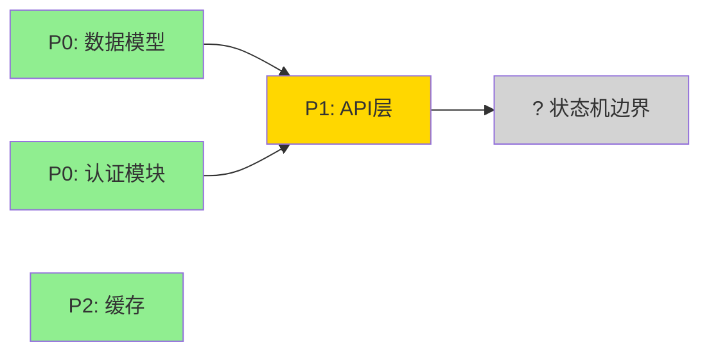

# Fog of War 决策图

> 移植自 Matt Pocock 的 decision-mapping skill。核心理念：
> **issue 不是一次性列完的静态清单，而是带依赖边的决策图，
> 逐个 agent session 解决、边做边发现新 issue。**

## 核心概念

### Fog of War（战争迷雾）

决策地图**故意在前沿之外不完整**。你的任务是调查前沿、逐个解决 issue、把前沿推进。
push back the fog of war, one node at a time.

在某个时刻，前沿已被推得足够远，通往终点的路径清晰可见——此时不再需要新 issue，
决策图视为「done」。

```
[已解决]     [前沿(正在解决)]    [迷雾(未探索)]
  #1 ✅ ──── #3 🔍 ──────── #5 ?
              │                #6 ?
              #4 🔍            #7 ? (可能不存在)
```

### Issue = 决策图节点

每个 issue 是图上的一个节点，有：
- **编号** `#{N}`
- **状态**: resolved(✅) / investigating(🔍) / fog(?)
- **Blocked by**: 依赖的其他 issue（图的边）
- **类型**: Research(查文档) / Prototype(写代码验证) / Discuss(对话决策)

### 依赖边 = Wave 编排的依据

issue 之间的 `blocked_by` 边，直接成为 Step 6（执行计划）Wave 编排的依据：
- 无依赖的 issue → 可并行（同一 Wave）
- 有依赖的 issue → 串行（不同 Wave，blocked_by 先做）

## 决策图文件格式

`issues.md` 本身就是决策图。结构：

```markdown
# Issue 决策图 — {主题}

## 地图总览

（Mermaid graph — 节点=issue，边=blocked_by，颜色/标注=状态）



## Issues

### #1: {标题} ✅
（已解决，按 issue-template.md 格式，含方案对比+决策）

### #3: {标题} 🔍
（正在解决）

### #5: {标题} ?
（迷雾中——已知存在但未展开。可能解决 #3 后才发现具体内容）

## 后续迭代（P3 延后项）

- #8 [P3]: {延后的 issue} — 延后理由
```

## 拆分维度 checklist（生成候选 issue 前，先按 4 轴扫 system-architecture.md）

> **拆 issue 不是按优先级扫，而是先按上游章节扫轴、再标 P 级。**
> P0/P1/P2/P3 是优先级，**不是拆分维度**——用它当骨架会天然不 MECE（同一问题 P0 也 P1 取决于视角）。
> 先扫轴得到候选集合 → 再标 P 级 → 进 Fog of War 决策图。

4 条正交轴，每条对齐 system-architecture.md 的一个章节：

| 轴 | 扫 system-architecture 的 | 每个元素问 | 产出 |
|----|--------------------------|-----------|------|
| **状态轴** | §5 状态流转 | 每个状态转移（**含异常分支**）→ 是否需要 issue？ | 候选 issue |
| **模块轴** | §7 模块划分 | 每个新增/变更模块 → 是否需要 issue？ | 候选 issue |
| **边界轴** | §8 Context Map | 每条系统间/上下文边界 → 是否需要 issue？ | 候选 issue |
| **挑战轴** | §10 挑战与决策 | 每个已记录挑战/风险 → 是否需要 issue？ | 候选 issue |

**兜底（轴外扫描）**：4 轴之外，扫 ② 其余章节，凡可拆元素（如 §9 swimlane 控制流、§3 质量属性约束）按同样规则处理。轴是先验写死的，**轴本身的遗漏靠兜底降低、不归零**——残余靠 Step2 独立重建对抗。

扫完 4 轴 + 兜底 → 合并去重 → 标 P 级（MoSCoW）→ 进决策图。

**这 4 轴是主 agent 与 Step2 独立重建 subagent 共享的同一套轴**——轴相同，两边的覆盖表才能 diff 出真 gap，而不是「轴不同」造成的噪音。

## 推进原则

1. **从 P0 开始** — 阻塞项必须先解决，否则后续都建立在不稳固的基础上
2. **按依赖顺序推进** — 先解决无依赖或依赖已解决的 issue
3. **解决一个可能发现多个** — 这是正常的，不是倒退。新发现的 issue 加入图，标注 blocked_by
4. **前沿清晰即停** — 当通往终点的路径清晰（剩余 issue 都是 P2/P3 或已可推导），不需要再强行枚举

## 与传统清单的区别

| 传统清单 | Fog of War 决策图 |
|---------|------------------|
| 一次性列完所有 issue | 边解决边发现 |
| 静态优先级 | 动态——解决 #3 可能改变 #5 的 P 级 |
| 线性顺序 | DAG（有依赖边的图）|
| 完成即结束 | 前沿清晰即停，迷雾中的不强求 |

## 关于「不漏项」的诚实交代

> **本 skill 不追求「零遗漏」——那与本决策图的哲学（前沿之外故意不完整）矛盾。**
> 真正追求的是：**让遗漏从「无声疏忽」变成「可见、可 diff、可审计的决策」。**

具体做法：

1. **覆盖核验表**（issues.md 内，见 deliverable-template）— 上游每个元素**必须**显式处理：要么对应 issue，要么写 N/A + 理由。沉默 = 漏项。N/A 是逃生口，但它强迫 agent 把「不做」articulate 成一句话——这句话随后能被审查质疑。
2. **Step2 独立重建**（fresh subagent，禁读 issues.md）— 从 ② 独立重建覆盖表，与主 agent 的表 diff。同源盲区（主 agent 漏的，自己填表也填不进）靠 fresh context 他证对抗。
3. **三个改进仍然闭合不了的洞**（必须摆在台面）：
   - **模型一致盲区**：重建 subagent 是同款模型，认知同构的盲区换 context 不消失，只能换认知帧（异常猎手）削弱。
   - **② 不全则连带漏**：覆盖表只保证 ③ 不脱锚于 ②，不保证 ② 完整。② 漏记的挑战，③ 无法发现，靠 ④/⑤ 踩到时反哺。
   - **轴是先验的**：4 轴可能漏 ② 的某些可拆元素，靠兜底扫描降低、不归零。

## 何时跳过决策图

如果 system-architecture.md 已经足够细化（所有挑战都有明确方案，无根本性选择未决），
initial 追踪后可能**无 fog of war**——没有未解决的 issue。

此时建议直接进入 Step 4（非功能性设计），决策图记录为「无未决 issue，已收敛」。
