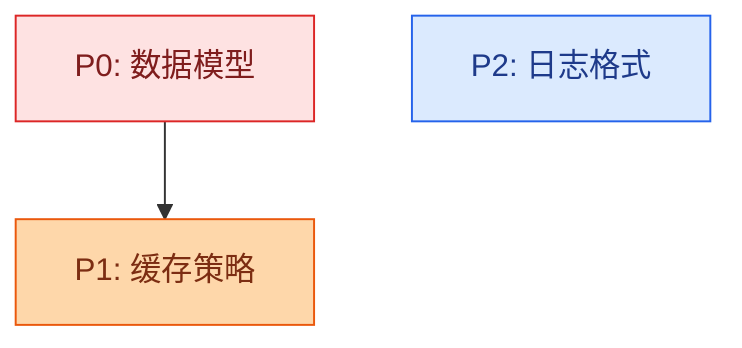

# Mermaid Theming 参考

SKILL.md 的 Mermaid 部分展开。**按需读**——只在调 Mermaid themeVariables 或 ELK 布局时查。

## CDN + 版本

```html
<script type="module">
import mermaid from 'https://cdn.jsdelivr.net/npm/mermaid@11/dist/mermaid.esm.min.mjs';
// 复杂图（10+ 节点）才加 ELK，简单图不必（ELK 增加体积）
import elkLayouts from 'https://cdn.jsdelivr.net/npm/@mermaid-js/layout-elk/dist/mermaid-layout-elk.esm.min.mjs';
mermaid.registerLayoutLoaders(elkLayouts);
</script>
```

**ELK 关键点：** 是独立包，不在 Mermaid core 里。必须 import + `registerLayoutLoaders()` 后才能用 `layout: 'elk'`，否则**静默降级到 dagre**。简单图（≤8 节点）用默认 dagre 即可。

## themeVariables 完整模板

> **⚠️ 权威定义已转移（2026-06 改造）。** 实际渲染用的 themeVariables（teal 调色板双主题）**权威定义在 `templates/zoom.js`** 的 `mermaid.initialize` 块。本节的模板保留作调色板参考，但若与 zoom.js 冲突，以 zoom.js 为准。换调色板时改 zoom.js + `templates/design.css` 的 `:root`（两处必须同改）。

**必须用 `theme: 'base'`**——只有它是全变量可定制的。内置主题（default/dark/forest/neutral）会忽略大部分变量覆盖。

```javascript
const isDark = window.matchMedia('(prefers-color-scheme: dark)').matches;
mermaid.initialize({
  startOnLoad: false,   // 配合 diagram-shell 手动 render()
  theme: 'base',
  look: 'classic',
  layout: 'elk',        // 简单图删掉这行 + 删 elk import，用默认 dagre
  themeVariables: {
    fontFamily: "'Bricolage Grotesque', system-ui, sans-serif",
    fontSize: '16px',   // 10+ 节点调到 18-20px
    primaryColor: isDark ? '#134e4a' : '#ccfbf1',
    primaryBorderColor: isDark ? '#14b8a6' : '#0d9488',
    primaryTextColor: isDark ? '#f0fdfa' : '#134e4a',
    secondaryColor: isDark ? '#1e293b' : '#f0f9f4',
    secondaryBorderColor: isDark ? '#059669' : '#16a34a',
    secondaryTextColor: isDark ? '#f1f5f9' : '#1e293b',
    tertiaryColor: isDark ? '#27201a' : '#fef3c7',
    tertiaryBorderColor: isDark ? '#d97706' : '#f59e0b',
    tertiaryTextColor: isDark ? '#fef3c7' : '#27201a',
    lineColor: isDark ? '#64748b' : '#94a3b8',
    noteBkgColor: isDark ? '#1e293b' : '#fefce8',
    noteTextColor: isDark ? '#f1f5f9' : '#1e293b',
    noteBorderColor: isDark ? '#fbbf24' : '#d97706',
  }
});
```

## 变量清单

| 变量 | 作用 |
|------|------|
| `primaryColor` / `primaryBorderColor` / `primaryTextColor` | 主节点填充/边框/文字 |
| `secondaryColor` / `secondaryBorderColor` / `secondaryTextColor` | 次级节点 |
| `tertiaryColor` / `tertiaryBorderColor` / `tertiaryTextColor` | 三级节点 |
| `lineColor` | 连线 |
| `fontSize` / `fontFamily` | 全局字体 |
| `noteBkgColor` / `noteTextColor` / `noteBorderColor` | note 块 |

## 调色板选择（换色防 slop）

每次渲染换一套，匹配页面 `--accent`：

- **teal/slate**：primary `#ccfbf1`/`#0d9488`，secondary `#e0f2fe`/`#0369a1`
- **terracotta/sage**：primary `#fed7aa`/`#c2410c`，secondary `#ecfccb`/`#65a30d`
- **rose/cranberry**：primary `#ffe4e6`/`#be123c`，secondary `#fef3c7`/`#d97706`
- **禁用**：`#8b5cf6`/`#7c3aed`/`#a78bfa`（indigo/violet）、`#d946ef`（fuchsia）

## 节点状态着色（③ DAG / ⑥ Wave DAG 用 classDef）

按 P 级或状态给节点着色，在 Mermaid 源码里定义 `classDef`：



dark mode 下换深色 fill。或用 `rendering-cookbook.md` 的语义色变量统一着色。

## 复杂图缩放（10+ 节点）

先考虑是否该换 drawio（见 `rendering-engine-guide.md`）。若坚持 Mermaid：
- `fontSize` 调到 `18px`-`20px`
- `INITIAL_ZOOM` / smart fit（diagram-shell 的 `computeSmartFit` 自动处理）
- 15+ 元素别硬塞一张图——拆成「概览 Mermaid + 详情 CSS 卡片」混合模式
