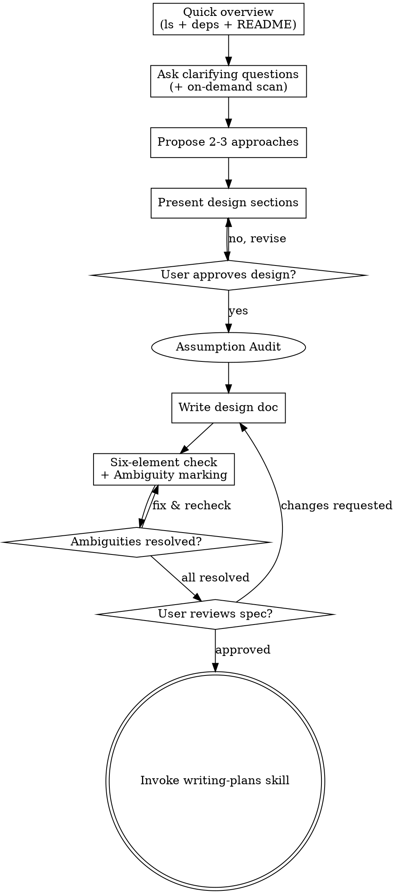

## Dev-flow 上下文

| 项目 | 值 |
|------|---|
| 所在阶段 | Phase 1 (spec) brainstorming |
| 执行者 | 主 agent（交互 + 编排） |
| 上游 | 用户提出需求 |
| 下游（完成后进入） | Phase 2 (plan) — 加载 writing-plans skill |
| 回退目标 | 无前置阶段。如设计需修改，在本阶段内直接迭代 |

## Phase Loop 机制

- **Gate FAIL（spec 不完整）**：回到 Step 6（Write spec），根据 gate 反馈补充缺失内容
- **Review FAIL（must_fix > 0）**：根据 review 反馈修改 spec，重新 dispatch review subagent
- **用户要求修改**：直接修改 spec，不需要回退到特定步骤

**Auto Mode：** coding-workflow 扩展自动管理 loop，skill 中无需处理。

### Agent/Skill 关联

| 步骤 | 执行者 | Agent | Skill | 方式 |
|------|--------|-------|-------|------|
| Step 1: Quick Overview | 主 agent | — | 无 | 几个文件，无 subagent |
| Step 2-4: Brainstorming + Terminology + On-demand Scan | 主 agent | — | brainstorming (本 skill) | 按需 dispatch subagent 深入扫描 |
| On-demand Deep Scan | subagent | general-purpose | 无 | 按需触发，精准范围 |
| Step 5: Assumption Audit | 主 agent | — | brainstorming (本 skill) | 主 agent 直接执行 |
| Step 6: Write spec.md | 主 agent | — | brainstorming (本 skill) | 主 agent 上下文加载 |
| Step 8: Terminology & ADR | 主 agent | — | 无 | MUST + Nullable |
| Step 10: Transition | 主 agent | — | writing-plans | 主 agent 加载下一 skill |
| Spec Review | subagent | general-purpose | expert-reviewer | task prompt 指定 read |
| Retrospect | subagent | general-purpose | xyz-harness-retrospect | task prompt 指定 read |

# Brainstorming Ideas Into Designs

Help turn ideas into fully formed designs and specs through natural collaborative dialogue.

Start by understanding the current project context, then ask questions one at a time to refine the idea. Once you understand what you're building, present the design and get user approval.

<HARD-GATE>
Do NOT invoke any implementation skill, write any code, scaffold any project, or take any implementation action until you have presented a design and the user has approved it. This applies to EVERY project regardless of perceived simplicity.
</HARD-GATE>

## Anti-Pattern: "This Is Too Simple To Need A Design"

Every project goes through this process. A todo list, a single-function utility, a config change — all of them. "Simple" projects are where unexamined assumptions cause the most wasted work. The design can be short (a few sentences for truly simple projects), but you MUST present it and get approval.

## Checklist

You MUST create a task for each of these items and complete them in order:

1. **Quick overview** — 主 agent 快速浏览项目结构、依赖、README（几个文件，无 subagent）。建立基本上下文，不产出文档
2. **Ask clarifying questions** — one at a time, understand purpose/constraints/success criteria. **On-demand scan:** 当用户回答涉及具体模块或技术细节时，按需 dispatch subagent 深入扫描相关代码。**Terminology Step (MUST + Nullable):** 在提问过程中，主动识别 spec 中的模糊术语并提议精确定义（见 Terminology Step 章节）
3. **Propose 2-3 approaches** — with trade-offs and your recommendation
4. **Present design** — in sections scaled to their complexity, get user approval after each section
5. **Assumption Audit** — 从用户确认的设计中提取所有对现有代码的假设，逐一验证。验证通过才能继续（详见 Step 5 章节）
6. **Write design doc** — save to `.xyz-harness/${主题}/spec.md` and commit. Must include all six-element sections (see below)
7. **Spec completeness check** — verify all six elements are covered, mark ambiguities as `[AMBIGUOUS]`, fix or confirm each with user (see below)
8. **Terminology & ADR Step (MUST + Nullable)** — 从 spec 中提取术语写入/更新 `CONTEXT.md`，评估 spec 中的决策是否需要创建 ADR（见 Terminology & ADR Step 章节）
9. **User reviews written spec** — ask user to review the spec file before proceeding
10. **Transition to implementation** — invoke writing-plans skill to create implementation plan

## Process Flow



**The terminal state is invoking writing-plans.** Do NOT invoke frontend-design, mcp-builder, or any other implementation skill. The ONLY skill you invoke after brainstorming is writing-plans.

## The Process

### Step 1: Quick Overview

**在提问前，主 agent 快速浏览项目基本信息。** 不 dispatch subagent，不产出文档。目的是建立最基本的上下文，避免问出已经能直接看到答案的问题。

**主 agent 直接执行（不启动 subagent）：**
1. `ls` 项目根目录，了解目录结构
2. 读 `package.json`（或等效的依赖文件），了解技术栈和关键依赖
3. 读 `README.md`（如果存在），了解项目定位
4. 如果有 `CONTEXT.md`，快速浏览术语表

**这一步应该 < 30 秒完成。** 目的是知道"这是什么项目、用什么技术栈"，不是全面扫描。

### On-demand Deep Scan（按需触发，贯穿 Step 2-4）

**当用户回答涉及具体模块、技术细节或需要验证代码行为时**，dispatch 只读 subagent 做针对性扫描。这不是一个独立的 Step，而是贯穿提问过程的工具。

**触发条件（满足任一即触发）：**
- 用户提到"和 XX 模块交互"→ 扫描该模块
- 用户提到"复用现有的 YY 机制"→ 扫描相关代码
- 需要验证代码中是否存在某个功能/约束 → 精准 grep + read
- 需要了解某个 API 的实际签名和行为 → 读对应文件

**Subagent task 模板：**
```
扫描 {具体模块/目录/文件}，聚焦于：
1. 导出的函数/接口/类型
2. 与 {用户提到的功能} 相关的数据流和调用链
3. 使用的模式和约定

不要扫描无关代码。范围限定在：{具体路径}
```

**Subagent config:**
| Item | Value |
|------|-------|
| Agent | general-purpose (read-only mode) |
| Model | taskComplexity: low |
| Tools | read, bash (no write) |

**Scan 结果直接用于后续提问，不产出独立文档。** 如果信息量较大需要保留，可写入 `.xyz-harness/{topic}/changes/scan-{module}.md`，但这不是必需的

### Step 2: Progressive Questioning (Clarifying Questions)

**This is the core of brainstorming.** Ask **one question at a time**, building understanding progressively. 当用户回答涉及具体代码细节时，按需 dispatch on-demand scan（见 Step 1 的 On-demand Deep Scan 章节），用扫描结果提升后续提问质量。

#### Question Hierarchy (ask in this order)

Questions follow a deliberate order — each layer builds on the previous one. Don't jump to implementation details before understanding the purpose.

**Layer 1: Purpose & Users (2-3 questions)**
- What problem does this solve? Who is affected?
- What does success look like? How would you know it's done?
- Is this a new feature, a fix, or an improvement to existing behavior?

**Layer 2: Core Behavior (3-5 questions)**
- Walk me through the main user flow. What happens first, then what?
- What should happen when [edge case]? (propose specific scenarios based on user's answers)
- What existing functionality does this interact with? (if unclear, dispatch on-demand scan to check)
- Are there any hard constraints I should know about? (time, performance, compatibility)

**Layer 3: Boundaries & Non-obvious (2-3 questions)**
- What should this explicitly NOT do? What's out of scope?
- Are there any technical decisions already made that I shouldn't revisit?
- What's the most likely way this could go wrong?

**When to stop asking:** You've covered purpose, core behavior, edge cases, boundaries, and constraints. If you can describe the full solution back to the user without guessing, you're ready to propose approaches.

#### Question Quality Guidelines

- **Use `ask_user` tool when available** — if `ask_user` / `ask_user_question` tool is registered (from pi-ask-user or similar extension), prefer it over plain text for structured questions. It provides multiple choice, freeform, and comment in a TUI component, giving users a better interaction experience. Fall back to plain text only when the tool is not available or the question is truly open-ended exploratory chat.
- **Prefer multiple choice** when the options are discoverable (e.g., from quick overview or on-demand scan: "I see the project uses Pinia for state management. Should this feature use the same pattern, or does it need a different approach?") When using `ask_user` tool, put the choices as options.
- **Use quick overview to skip basics** — don't ask "what framework" if you already read package.json
- **Use on-demand scan results to ask deeper questions** — "I scanned the API layer and see `useApi()` handles all API calls with auto-retry. Should this feature use it, or do you need different error handling?"
- **One question per message** — if a topic needs more exploration, break it into multiple questions
- **Avoid abstract questions** — instead of "what are the requirements?", ask "when the user clicks X, should Y happen immediately or after confirmation?"

#### Scope Decomposition

Before asking detailed questions, assess scope: if the request describes multiple independent subsystems (e.g., "build a platform with chat, file storage, billing, and analytics"), flag this immediately. Don't spend questions refining details of a project that needs to be decomposed first.

If the project is too large for a single spec, help the user decompose into sub-projects: what are the independent pieces, how do they relate, what order should they be built? Then brainstorm the first sub-project through the normal design flow. Each sub-project gets its own spec → plan → implementation cycle.

### Step 3: Exploring Approaches

- Propose 2-3 different approaches with trade-offs
- Present options conversationally with your recommendation and reasoning
- Lead with your recommended option and explain why

### Step 4: Presenting the Design

- Once you believe you understand what you're building, present the design
- Scale each section to its complexity: a few sentences if straightforward, up to 200-300 words if nuanced
- Ask after each section whether it looks right so far
- Cover: architecture, components, data flow, error handling, testing
- Be ready to go back and clarify if something doesn't make sense

**Design for isolation and clarity:**

- Break the system into smaller units that each have one clear purpose, communicate through well-defined interfaces, and can be understood and tested independently
- For each unit, you should be able to answer: what does it do, how do you use it, and what does it depend on?
- Can someone understand what a unit does without reading its internals? Can you change the internals without breaking consumers? If not, the boundaries need work.
- Smaller, well-bounded units are also easier for you to work with - you reason better about code you can hold in context at once, and your edits are more reliable when files are focused. When a file grows large, that's often a signal that it's doing too much.

**Working in existing codebases:**

- Explore the current structure before proposing changes. Follow existing patterns.
- Where existing code has problems that affect the work (e.g., a file that's grown too large, unclear boundaries, tangled responsibilities), include targeted improvements as part of the design - the way a good developer improves code they're working in.
- Don't propose unrelated refactoring. Stay focused on what serves the current goal.

### Step 5: Assumption Audit（嵌入 Step 6）

**触发时机：** 用户确认设计后、写 spec 前。这是 Step 5 的前置子步骤，不是独立 Step。

**目的：** 消除 spec 中基于文档假设而非代码事实的错误。40% 的 spec 返工源于引用了不存在的接口、错误的枚举值、虚构的 RPC 方法。

**执行步骤：**

1. **假设提取**：从用户确认的设计中，提取所有对现有代码的假设。假设类型：
   - 引用的接口/API/RPC 是否存在
   - 引用的类型定义/枚举值是否与代码一致
   - 引用的 DB 字段/API 响应体是否真实
   - 前端组件的现有职责分工是否如设计所述

2. **代码验证**：对每个提取的假设，执行代码验证。使用以下命令模板：

   ```bash
   # 接口签名验证
   grep -rn "export.*interface\|export.*type\|export.*function" {file_or_dir}

   # 枚举/常量值验证
   grep -rn "enum\s*\w*\s*{" {file_or_dir} --include="*.ts"

   # DB 字段验证
   grep -rn "{field_name}" {model_file}

   # 组件职责验证
   grep -rn "export.*defineComponent\|export default" src/components/
   ```

3. **结果处理**：
   - 验证通过 → 写入 spec 时标注 `[VERIFIED]`
   - 验证失败（接口不存在/枚举值不匹配/字段名错误）→ 修正设计或与用户确认后写入 spec
   - 无法验证（代码不在此项目/第三方依赖）→ 标记 `[UNVERIFIED]`，在 spec 完成后与用户确认

**铁律：** 禁止在 spec 中写入未经代码验证的接口签名、枚举值或 RPC 方法名。如果无法验证，必须标记 `[UNVERIFIED]`。

## After the Design

**Documentation:**

- Write the validated design (spec) to `.xyz-harness/${主题}/spec.md`
  - (User preferences for spec location override this default)
- Use elements-of-style:writing-clearly-and-concisely skill if available
- Commit the design document to git

**Implementation:**

- Invoke the writing-plans skill to create a detailed implementation plan
- Do NOT invoke any other skill. writing-plans is the next step.

## 交付物：spec.md

spec.md 必须包含 YAML frontmatter：

| 字段 | 类型 | 必填 | 允许值 | 说明 |
|------|------|------|--------|------|
| `verdict` | string | 是 | `"pass"` | 门禁通过标志 |

**模板：**
````
```markdown
---
verdict: pass
---

# {Feature Title}

## Background
## Functional Requirements
## Acceptance Criteria
## Constraints
## 业务用例

> 初版简述（Phase 2 会在此基础上细化）。纯技术性需求可标注"无业务用例"。

### UC-1: {用例名称}
- **Actor**: {谁执行}
- **场景**: {什么情况下}
- **预期结果**: {成功后的状态}

## Complexity Assessment
```
````

## Six-Element Completeness

After writing the spec document, perform a structured completeness check before showing it to the user. This catches gaps that humans miss because "the agent will fill in the blanks, in ways you won't like" (Augment Code, 2026).

Verify the spec answers all six questions. For each missing element, add a `[MISSING]` marker and resolve it:

| Element | What to check | If missing |
|---------|--------------|------------|
| **Outcomes** | Is there a concrete description of the end state (not just "build X")? | Add outcome statement, mark `[AMBIGUOUS]` if unsure |
| **Scope boundaries** | Are both in-scope AND out-of-scope items listed? | Add out-of-scope list; agent expands scope if you don't close the door |
| **Constraints** | Are tech stack, API limits, performance requirements stated? | Add from quick overview / on-demand scan or mark `[AMBIGUOUS]` |
| **Decisions made** | Are already-decided technical choices documented? | Add from quick overview / on-demand scan or ask user |
| **Task breakdown** | Is the work decomposed into independently verifiable units? | Not needed at spec stage (plan handles this) |
| **Verification** | Are there concrete acceptance criteria, not just "does it work"? | Add criteria or mark `[AMBIGUOUS]` |
| **Business use cases** | Is there a "业务用例" section with at least one UC? Pure technical needs can be marked "无业务用例" | Add from FR descriptions or mark "无业务用例" |

## Ambiguity Marking

Scan the spec for ambiguous language and mark each with `[AMBIGUOUS]`:

**Dangerous patterns to flag:**
- Fuzzy adjectives: "fast", "reasonable", "user-friendly", "appropriate", "as needed"
- Unquantified thresholds: "large", "many", "soon", "responsive"
- Slash-combined terms: "Delivery/Fulfillment" (AND or OR?)
- Implicit assumptions: anything the spec assumes but doesn't state
- Missing error/failure behavior: happy path described but not what happens on error

**Format:**
```markdown
- [AMBIGUOUS] "快速响应" — 具体指标？建议 P99 < 200ms，需确认
```

**Resolution:** After marking all ambiguities, present the list to the user and resolve each one:
- User clarifies → update spec
- User says "doesn't matter" → replace with a concrete default value
- User says "figure it out" → pick the most reasonable value and note the decision

**Only proceed to user review when all `[AMBIGUOUS]` markers are resolved.**

## Terminology Step (嵌入 Step 2-4)

**MUST + Nullable：** 必须执行，但产出可为空。

在与用户讨论需求的过程中（Step 2 提问、Step 3 方案探索、Step 4 设计展示），持续执行以下四项实践：

### 识别并锐化模糊术语

当用户或你自己使用了一个可能有多种理解的词时，立即指出并提议精确定义：
- 例："你说的'工作区'是指 bare repo + worktree 的物理结构，还是用户看到的逻辑概念？"
- 例："'账户'——你指的是 Customer 还是 User？这是两个不同的概念"

### 挑战已有术语表

如果项目根目录存在 `CONTEXT.md`，read 它，检查用户使用的术语是否与已有定义冲突：
- 冲突时立即指出："你的术语表定义 'cancellation' 为 X，但你似乎在说 Y — 哪个是对的？"

### 发明边界场景

当讨论领域关系时，主动提出具体场景来测试概念边界：
- 例："你说'订单可以取消'——如果已经发货了呢？如果已经退款了呢？这些算取消还是另一个操作？"
- 例："'工作区'可以包含多个'项目'——那一个'项目'可以属于多个'工作区'吗？"

### 交叉引用代码

当用户说某个东西怎么工作时，检查代码是否一致（利用 on-demand scan 结果，或按需 dispatch scan）：
- 例："你说这个系统不支持部分退款，但我看到代码里有 `partial_refund` 方法——哪个是对的？"

### 即时写入 CONTEXT.md

**当术语被解决时，立即写入/更新 `CONTEXT.md`，不要等到最后批量处理。** 每解决一个术语就更新一次。

`CONTEXT.md` 只包含术语定义，不包含实现细节、不做 spec 用途、不做草稿板。它是术语表，仅此而已。

格式要求：每个术语一句话定义 + 避免使用的同义词。遵循 grill-with-docs skill 的 CONTEXT-FORMAT.md。

**产出可为空：** 如果需求非常简单，讨论中未出现模糊术语且代码无矛盾，跳过写入。但必须过一遍这个检查。

## Terminology & ADR Step (Step 8)

**MUST + Nullable：** 必须执行，但产出可为空。

spec.md 写完后、用户审核前，执行以下两个子步骤：

### 7a. CONTEXT.md 最终检查

1. **Read `CONTEXT.md`**（应该已经在 Step 2-4 中被 inline 更新过）
2. **扫描 spec.md**，检查是否有在 Step 2-4 中遗漏的术语（spec 写作过程中可能引入新概念）
3. **如有遗漏，追加更新** `CONTEXT.md`
4. **检查 spec 与 CONTEXT.md 的一致性**：spec 中使用的术语是否与 CONTEXT.md 定义对齐

**产出可为空：** 如果 Step 2-4 已经覆盖了所有术语，无需额外写入。但必须执行检查。

### 7b. ADR 评估

1. **Read `docs/adr/` 目录**，确认当前已有 ADR 编号
2. **扫描 spec.md 中的决策**，逐个评估是否满足三条件：
   - **难以逆转：** 改变决策的成本是否显著？
   - **无上下文会惊讶：** 未来读者是否会问"为什么这样做？"
   - **真实权衡：** 是否存在有意义的替代方案？
3. **对满足三条件的决策，创建 ADR**：`docs/adr/{NNNN}-{slug}.md`
   - 格式：1-3 句话说明上下文、决策和原因
   - 编号从已有最大值递增
4. **不满足三条件的决策，不创建 ADR**

**产出可为空：** 如果无决策满足三条件，不写 ADR。但必须执行评估。

## Inline Checks

1. **Placeholder scan:** Any "TBD", "TODO", incomplete sections? Fix them.
2. **Internal consistency:** Do any sections contradict each other?
3. **Scope check:** Is this focused enough for a single implementation plan?

Fix any issues inline. No need to re-review — just fix and move on.

## Gate 调用

完成 spec.md 编写后，**不要**手动运行任何审查流程。直接调用：

```
coding-workflow-gate(phase=1)
```

Review-Gate 会自动启动 workflow 循环审查 + 修复。如果 gate 返回 FAIL，按修复指引修改 spec.md 后重新调用。

## Retrospect (复盘)

**触发时机：** coding-workflow 扩展在 gate PASS 后自动 dispatch retrospect steer。

Retrospect steer 会包含当前 phase 关键交付物的摘要。按 steer 指令执行复盘即可。

## Self-Check

**铁律：禁止在未实际运行验证命令的情况下声称完成。**

- [ ] spec.md 存在，YAML frontmatter 含 verdict: pass
- [ ] spec_review 文件存在，verdict: pass, must_fix: 0
- [ ] 运行 gate check 脚本确认：
  ```bash
  python3 skills/xyz-harness-gate/scripts/check_gate.py {topic_dir} 1
  ```
- [ ] 读取输出，确认所有检查项 PASS
- [ ] Requirements are clearly separated from implementation details
- [ ] Acceptance criteria are testable
- [ ] All constraints are documented
- [ ] All [AMBIGUOUS] markers resolved

## 阶段完成提交

**阶段完成时，必须提交并推送所有代码和文档到远程仓库。**

```bash
git add -A
git commit -m "docs: spec for {topic}"
git push
```

确保 `.xyz-harness/` 和 `docs/` 目录下的所有产出文件都被 git 跟踪。

## Phase Transition

Phase 1 gate 通过后，retrospect 会自动触发。完成 retrospect 后调用 `coding-workflow-phase-start()` 进入 Phase 2。

## Key Principles

- **One question at a time** - Don't overwhelm with multiple questions
- **Multiple choice preferred** - Easier to answer than open-ended when possible. Use `ask_user` tool if available for structured TUI interaction
- **YAGNI ruthlessly** - Remove unnecessary features from all designs
- **Explore alternatives** - Always propose 2-3 approaches before settling
- **Incremental validation** - Present design, get approval before moving on
- **Be flexible** - Go back and clarify when something doesn't make sense

<!-- LOCAL-OVERRIDE:START -->
## 本地目录覆盖规则

**以下规则覆盖本文档中所有关于输出目录的路径指定**（如 `.xyz-harness/${主题}/` 子目录）：

- **主目录：** `.xyz-harness/`（项目根目录下）
- **子目录命名：** `${yyyy-MM-dd}-${主题简短标题}`（例：`2026-04-14-core-proxy`）
- **路径映射：**
  - `.xyz-harness/${主题}/spec.md` → `.xyz-harness/${主题}/spec.md`
  - （原始路径）→ `.xyz-harness/${主题}/plan.md`
  - 其他文档按需拆分到 `.xyz-harness/${主题}/` 下
- **不同主题使用不同子目录，禁止混放**

**文档精简：** 单次写入超过 1000 字时优先拆分子文档，主文档保留概述和索引。使用 agent 并行编写各模块文档（并发度 ≤ 2），最后合成精简主文档。
<!-- LOCAL-OVERRIDE:END -->

## Self-Check Checklist

在完成 spec 编写后、dispatch review 前，逐项检查：

### 生命周期维度
- [ ] 对每个核心实体（系统、组件、数据流），走一遍：创建→运行→销毁 链路
- [ ] 每个链路节点回答：
"如果这一步失败了怎么办？"
- [ ] 是否存在"只有成功路径，没有失败场景"的 FR？

### 枚举值覆盖
- [ ] 每个 FR 中出现的枚举值/可选值，是否都有对应的 AC 断言覆盖？
- [ ] 是否存在 FR 提到"N 种类型"但 AC 只验证了其中几种？

### 数据模型预检（FR 涉及 DB/API 时）
- [ ] FR 引用的 DB 字段或 API 响应体——是否 grep 了真实代码确认字段存在和类型？
- [ ] 是否有凭记忆而非实证写出的字段名或数值？

### 代码假设验证
- [ ] spec 中引用的每个接口/RPC，是否 grep 确认存在？
  ```bash
  grep -rn "interface_name\|rpc_method" src/
  ```
- [ ] spec 中引用的枚举值/常量，是否从代码提取而非凭记忆？
  ```bash
  grep -rn "enum\s*\w*\s*{" src/ --include="*.ts"
  ```
- [ ] 前端 FR 涉及的组件职责分工，是否扫描现有代码确认？
  ```bash
  grep -rn "export.*component\|export.*defineComponent" src/components/
  ```
- [ ] 后端 FR 涉及的 DB/API 字段，是否 grep 确认字段名和类型？
- [ ] 是否存在 `[UNVERIFIED]` 标记未与用户确认？
