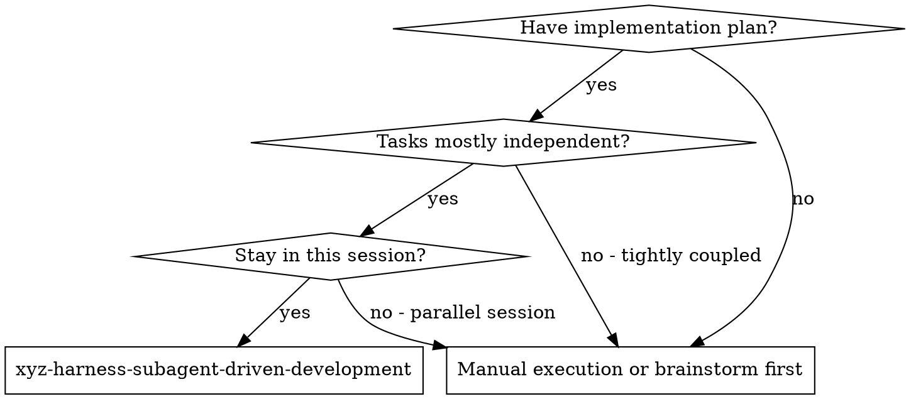
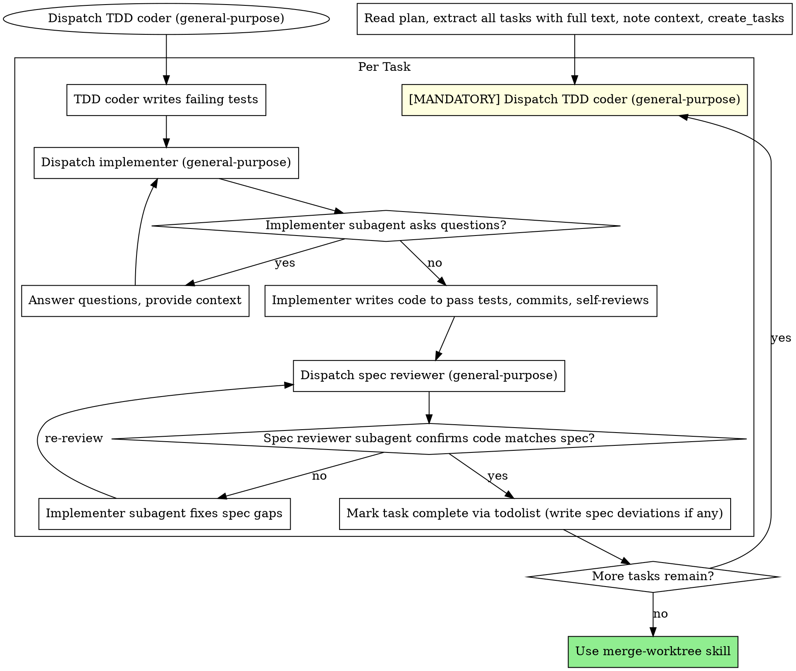

## 架构说明

**本 skill 是参考模式文档，不作为 skill 加载到任何 subagent 的上下文中。**

由主 agent 在需要时参考，理解分 task 迭代调度的流程后，直接使用 subagent tool 派遣 subagent。

**不允许的调用链：** 主 agent → 派 executor → executor 加载本文档 → executor 再派 subagent ❌

**正确的调用链：** 主 agent 读取本文档 → 主 agent 按本文档模式直接派遣 subagent ✅

## Dev-flow 上下文

| 项目 | 值 |
|------|---|
| 所在阶段 | Phase 3 (dev) |
| 触发方式 | 由主 agent 在需要时参考（作为调度参考，不加载到 subagent 上下文） |
| 上游 | Phase 1 (spec) + Phase 2 (plan) 完成 |
| 下游（完成后进入） | 所有 task 完成后进入 code review stage |
| 回退目标 | spec 合规不通过 → 当前 task 内修复；门禁不通过 → 回退到编码阶段 |

# Subagent-Driven Development

Execute plan by dispatching fresh subagent per task: TDD coder (writes failing tests) → implementer (writes code to pass tests) → spec compliance review.

**Why subagents:** You delegate tasks to specialized agents with isolated context. By precisely crafting their instructions and context, you ensure they stay focused and succeed at their task. They should never inherit your session's context or history — you construct exactly what they need. This also preserves your own context for coordination work.

**Core principle:** Fresh subagent per task: TDD coder (tests first) → executor (code to pass tests) → spec compliance review = high quality, fast iteration

**Task tracking:** plan Task 使用 `todolist` 工具跟踪进度（自由任务模式）。每完成一个 Task，调用 `todolist complete_task(taskId, summary="...")`，summary 自动写入 memory.md。V5 Phase 3 (dev) 的 TDD → 编码 → code review 循环由 `loop_task_tracker` 管理。

**重要：subagent 内部也使用 `todolist`（而非 `loop_task_tracker`）管理自己的多步骤流程。** `loop_task_tracker` 是全局状态，subagent 调用 `create_tasks` 会覆盖主 agent 的 Stage 列表。subagent 使用 `todolist create_tasks`（自由任务模式）注册自己的步骤。

**Spec deviation tracking:** 如果 executor 返回了 `spec_deviations`（非空数组），主 agent 必须将偏差追加到 `spec.md` 的 `## 实现偏差记录` 章节。追加格式：
```markdown
### Task {N}: {标题} ({日期})
- **Spec 章节**: {spec_section}
- **偏差描述**: {description}
- **影响范围**: {impact}
- **涉及文件**: {files}
```

**Continuous execution:** Do not pause to check in with your human partner between tasks. Execute all tasks from the plan without stopping. The only reasons to stop are: BLOCKED status you cannot resolve, ambiguity that genuinely prevents progress, or all tasks complete. "Should I continue?" prompts and progress summaries waste their time — they asked you to execute the plan, so execute it.

## 铁律：主 Agent 禁码

主 agent（调度器）**不允许直接使用 edit、write 工具编写实现代码**。
所有编码必须通过派遣 subagent 完成。

违反此规则 = 跳过 TDD = Phase 2 流程违规。

**允许的操作：**
- 使用 read 查看文件
- 使用 bash 运行测试、git 操作
- 使用 subagent 派遣编码 agent
- 使用 loop_task_tracker / todolist 追踪进度

**禁止的操作：**
- 直接 edit/write 实现代码文件
- 跳过 TDD coder subagent 直接编码
- 跳过 spec 合规检查直接标记 task 完成

**自检规则：** 如果发现自己正在用 edit/write 编写 `.py`、`.ts`、`.rs` 等实现代码（非测试文件），必须立即停止，回退，先派遣 TDD coder subagent。没有例外。"task 太简单"不是跳过 TDD 的理由。

## When to Use



**vs. manual execution:**
- Same session (no context switch)
- Fresh subagent per task (no context pollution)
- TDD coder writes tests first, implementer writes code to pass them
- Spec compliance review after each task
- Faster iteration (no human-in-loop between tasks)

## The Process



### Wave 模式（按 Execution Groups）

当 plan.md 定义了 Execution Groups 和 Wave Schedule 时，主 agent 按 Wave 派遣：

**并行依赖安全检查（Wave 派遣前必须执行）：**

在 Wave 派遣前，主 agent 必须扫描同一 Wave 内 Group 间的接口依赖：
1. 检查同 Wave 内是否有 Group 引用了另一个 Group 产出的函数/类型/接口
2. 如存在接口依赖 → **拒绝并行**，将依赖方拆到下一个 Wave（被依赖方在前）
3. 仅当同 Wave 内所有 Group 的产出互相独立时，才允许并行

**注意：**
- 循环依赖（A↔B）是 plan 缺陷，不是 dev 应处理的问题。发现时标记 BLOCKED 并报告用户，不要自行拆分
- 只检查直接接口引用（函数调用、类型引用），不追踪间接依赖（A→B→C 中 A 和 C 的间接关系）
- 编译时依赖（共享类型文件 import）不算接口依赖，允许并行

**背景：** 复盘数据显示，并行 Task 间的接口依赖会导致 placeholder 代码（一方引用另一方未产出的函数，只能写 placeholder 假装通过测试）。这是系统性的质量隐患。

```
for each Wave:
  // SAFETY CHECK: verify no interface dependencies between Groups in this Wave
  if has_interface_dependency(Groups in Wave):
    split dependent Group to next Wave
  for each Group in Wave (parallel if Semaphore allows):
  dispatch subagent for this Group:
    1. subagent processes all Tasks in this Group sequentially
    2. each Task follows: TDD coder → executor → reviewer (backend) or frontend-developer → reviewer (frontend)
    3. git commit after each Task
  wait for all Groups in Wave
  proceed to next Wave
```

**与逐 Task 模式的区别：**
- 逐 Task 模式：每个 Task 独立派遣 subagent，完全串行
- Wave 模式：每个 Group 派遣一个 subagent（处理组内所有 Task），同 Wave 的 Group 可并行
- Wave 模式效率更高，但需要 plan.md 预先定义好 Groups 和依赖关系

## 主 Agent 上下文管理

主 agent（调度器）自身的上下文也需要管理。按 plan task 逐个派遣 subagent，每个 subagent 返回的 summary 都会占用主 agent 的上下文。大量 task 后主 agent 可能退化。

**规则：**

1. **subagent summary 不保留原文**：subagent 返回的 summary 通常是 500-1000 token。主 agent 收到后，提取关键信息（status + 一句话摘要），通过 `todolist complete_task(taskId, summary="...")` 写入 memory.md，然后不再在上下文中引用原始 summary。

2. **每 5 个 task 后主动 compact**：完成第 5、10、15...个 task 后，主动执行 `/compact`。compact 前确保 memory.md 已更新。compact 后从 memory.md 恢复进度。

3. **大型 plan（>8 task）考虑拆分 session**：如果 plan.md 有超过 8 个 task，建议在 task 5-6 完成后暂停，提交一次 git commit，然后在新 session 中继续剩余 task。新 session 通过读取 memory.md 恢复进度。

4. **调度决策写 memory**：如果某个 task 的派遣过程中做了非显而易见的决策（比如选了特定模型、调整了 task 顺序），通过 `todolist update_memory(content="决策：...")` 记录，不要只留在对话历史中。

## Context Diet（上下文瘦身）

每个 subagent 只传入完成任务所需的最小上下文。不要全量传 spec/plan。主 agent 从 spec/plan 中提取必要片段传入，避免 subagent 上下文被无关信息占满。

**Per-Group 上下文提取：** 主 agent 按 Execution Group（而非按单个 Task）提取上下文。一个 Group 包含 1-4 个关联紧密的 Task，共享同一份上下文传给 subagent。

| 角色 | 必传 | 可选 | 不传 |
|------|------|------|------|
| TDD coder | 当前 Group 内所有 task 描述、被测接口签名（Group 涉及的所有接口）、测试框架信息 | 同文件已有代码 | 完整 spec 背景章节、其他 task |
| executor | 当前 Group 内所有 task 描述、TDD coder 产出的测试文件路径（Group 内所有）、相关已有代码片段 | 编码规范摘要（docs/standards.md 或 CLAUDE.md，仅相关部分） | 完整 spec 背景章节、其他 task 描述 |
| 前端 developer | 当前 Group 内所有 task 描述、相关设计稿路径、已有组件代码片段 | 前端规范摘要（docs/standards.md + docs/design-system.md 或 CLAUDE.md，tokens、组件库约束） | 完整 spec 背景章节、其他 task |
| spec reviewer | 当前 Group 内所有 task 的 spec 验收标准（AC 部分）、git diff（当前 Group 变更） | plan 中当前 task 的文件变更表 | 完整 spec 背景章节、其他 task 内容 |
| E2E tester | e2e-test-plan.md、spec.md 验收标准 | 测试环境配置摘要 | 编码过程上下文、其他无关 spec章节 |

**操作方式**：主 agent 在派遣 subagent 前，先 read spec.md 和 plan.md，从中提取当前 task 对应的片段，作为 subagent task 参数的一部分传入。subagent 不需要自己读 spec/plan 文件。

### L2 复杂度下的额外上下文

当 plan.md 标注为 L2 复杂度时，除了 plan.md 总纲，还存在子设计文档。主 agent 需要根据 Group 类型传入额外上下文：

| Group 类型 | 必传额外文档 | 说明 |
|-----------|-------------|------|
| 后端 Group（API/数据库/业务逻辑） | `plan-backend.md` 对应章节 | 领域模型、状态机、存储设计、数据流等 |
| 后端 Group | `plan-api-contract.md` 相关端点 | API 端点的请求/响应结构 |
| 前端 Group（UI/页面/组件） | `plan-frontend.md` 对应章节 | 组件设计、交互逻辑、暂定 API（已对齐） |

**L1 不需要额外文档**——所有设计都在 plan.md 单文件中。

**提取策略**：主 agent 读取子文档后，只提取当前 Group 涉及的章节（如 Group BG1 涉及 §5 领域模型和 §8 存储设计），不传整个子文档。这避免了 subagent 上下文被无关信息占满。

## Model Selection

使用能满足任务要求的最经济模型以节省成本和提升速度。通过 `taskComplexity` 参数让运行时自动选择模型，不硬编码 `provider/model`。

**按 Group 选择模型：** 每个 Execution Group 有自己的模型配置（写在 plan.md 中）。主 agent 按 Group 配置派遣，无需自行选择。以下规则适用于 plan.md 编写时的 taskComplexity 建议。

**机械性实现任务**（独立函数、清晰 spec、1-2 个文件）：`taskComplexity: "low"`。plan 足够清晰时大部分任务都属于此类。

**集成和判断型任务**（跨文件协调、模式匹配、调试）：`taskComplexity: "medium"`。

**架构、设计和评审任务**：`taskComplexity: "high"`。

**任务复杂度信号：**
- 涉及 1-2 个文件，spec 完整 → `taskComplexity: "low"`
- 涉及多个文件，有集成关注点 → `taskComplexity: "medium"`
- 需要设计判断或广泛的代码库理解 → `taskComplexity: "high"`

## Handling TDD Coder Status

TDD coder subagents report one of three statuses. Handle each appropriately:

**DONE:** TDD coder wrote failing tests, all tests FAIL as expected → proceed to dispatch implementer subagent.

**NEEDS_CONTEXT:** TDD coder needs information that wasn't provided. Provide the missing context and re-dispatch.

**BLOCKED:** TDD coder cannot write tests. Assess the blocker:
1. If it's a context problem, provide more context and re-dispatch
2. If the spec is unclear, clarify with the human
3. If the task design is fundamentally flawed, escalate to the human

**TDD coder is MANDATORY.** Skipping it = skipping tests. No exceptions.

If you catch yourself about to dispatch the implementer without first dispatching the TDD coder, **stop immediately**. Go back and dispatch the TDD coder first. This applies to every single backend task, regardless of perceived simplicity.

**Checkpoint:** Before dispatching implementer, verify: Did TDD coder for this task return DONE? If not, do not proceed to implementer.

## Handling Implementer Status

Implementer subagents report one of four statuses. Handle each appropriately:

**DONE:** Proceed to spec compliance review.

**DONE_WITH_CONCERNS:** The implementer completed the work but flagged doubts. Read the concerns before proceeding. If the concerns are about correctness or scope, address them before review. If they're observations (e.g., "this file is getting large"), note them and proceed to review.

**NEEDS_CONTEXT:** The implementer needs information that wasn't provided. Provide the missing context and re-dispatch.

**BLOCKED:** The implementer cannot complete the task. Assess the blocker:
1. If it's a context problem, provide more context and re-dispatch with the same model
2. If the task requires more reasoning, re-dispatch with `taskComplexity: "high"`
3. If the task is too large, break it into smaller pieces
4. If the plan itself is wrong, escalate to the human

**Never** ignore an escalation or force the same model to retry without changes. If the implementer said it's stuck, something needs to change.

## Agent 角色

所有角色均使用 general-purpose agent，通过 task prompt 指定 read 对应 skill 文件获取方法论，主 agent 只需传入 task 上下文和 skill 路径即可。

| 角色 | Agent | 职责 |
|------|-------|------|
| TDD coder | general-purpose | 写失败测试。Task prompt 指定 read xyz-harness-test-driven-development skill |
| 后端实现者 | general-purpose | 写后端代码使测试通过。Task prompt 指定 read xyz-harness-backend-dev skill |
| 前端实现者 | general-purpose | 前端三阶段开发。Task prompt 指定 read xyz-harness-frontend-dev skill |
| Spec 合规检查 | general-purpose | 验证代码是否实现 spec 要求。Task prompt 指定 read xyz-harness-expert-reviewer skill |

### 前端 task 路由

当 task 涉及 UI 组件、页面、布局、样式时，派遣前端实现者（general-purpose + read xyz-harness-frontend-dev skill）而非后端实现者（general-purpose + read xyz-harness-backend-dev skill）。

**判断信号：**
- 文件路径包含 `frontend/`、`src/components/`、`src/views/`、`src/pages/`
- task 描述中包含组件名、页面名、布局、样式、交互等关键词
- plan.md 中 task 标注了 `type: frontend`
- spec.md 描述了 UI 行为

**前端 agent 不走 TDD 流程**。前端 agent 采用自己的"骨架→功能→美化"三阶段工作流，不需要先派遣 TDD coder。派遣前端 agent 时直接传 task，不需要先写测试。

**派遣模式：**
```
前端 task:
  跳过 TDD coder
  agent: general-purpose (task prompt 指定 read xyz-harness-frontend-dev skill)
  model: 按 taskComplexity 自动选择（前端默认: medium）
  完成后: spec 合规检查 → todolist complete_task

后端 task:
  TDD coder → executor → spec 合规检查 → todolist complete_task
```

## Example Workflow

```
You: I'm using Subagent-Driven Development to execute this plan.

[Read plan file once: .xyz-harness/${topic}/plan.md]
[Extract all 5 tasks with full text and context]
[Call create_tasks with all tasks]

Task 1: Hook installation script

[Get Task 1 text and context (already extracted)]
[Dispatch TDD coder subagent via pi subagent tool, agent: general-purpose, task prompt 指定 read xyz-harness-test-driven-development skill]

TDD coder: [No questions, proceeds]
TDD coder:
  - Wrote failing tests for install-hook command
  - Tests cover: user-level install, --force flag, error cases
  - All 3 tests FAIL as expected
  - Committed test file

[Dispatch implementer subagent via pi subagent tool, agent: general-purpose, task prompt 指定 read xyz-harness-backend-dev skill]

Implementer: "Before I begin - should the hook be installed at user or system level?"

You: "User level (~/.config/superpowers/hooks/)"

Implementer: "Got it. Implementing now..."
[Later] Implementer:
  - Implemented install-hook command to pass all tests
  - All 3 tests now PASS
  - Self-review: All good
  - Committed

[Dispatch spec compliance reviewer]
Spec reviewer: ✅ Spec compliant - all requirements met, nothing extra

[Call todolist complete_task for Task 1, summary="安装脚本完成，支持用户级和系统级安装"]
[If executor returned spec_deviations, append them to spec.md ## 实现偏差记录 section]

Task 2: Recovery modes

[Get Task 2 text and context (already extracted)]
[Dispatch TDD coder subagent, agent: general-purpose, task prompt 指定 read xyz-harness-test-driven-development skill]

TDD coder: [No questions, proceeds]
TDD coder:
  - Wrote failing tests for verify/repair modes
  - Tests cover: mode switching, progress reporting, error handling
  - All 4 tests FAIL as expected
  - Committed test file

[Dispatch implementer subagent, agent: general-purpose, task prompt 指定 read xyz-harness-backend-dev skill]

Implementer: [No questions, proceeds]
Implementer:
  - Added verify/repair modes to pass all tests
  - 4/4 tests passing
  - Self-review: All good
  - Committed

[Dispatch spec compliance reviewer]
Spec reviewer: ❌ Issues:
  - Missing: Progress reporting (spec says "report every 100 items")
  - Extra: Added --json flag (not requested)

[Implementer fixes issues]
Implementer: Removed --json flag, added progress reporting

[Spec reviewer reviews again]
Spec reviewer: ✅ Spec compliant now

[Call todolist complete_task for Task 2, summary="verify/repair 模式完成，含进度上报"]
[If executor returned spec_deviations, append them to spec.md ## 实现偏差记录 section]

...

[After all tasks]
[All plan tasks complete via todolist]
[Now call loop_task_tracker complete_task to mark Phase 3 (dev) done]
[Proceed to code review stage]

Done!
```

## Advantages

**vs. Manual execution:**
- Subagents follow TDD naturally
- Fresh context per task (no confusion)
- Parallel-safe (subagents don't interfere)
- Subagent can ask questions (before AND during work)

**Efficiency gains:**
- No file reading overhead (controller provides full text)
- Controller curates exactly what context is needed
- Subagent gets complete information upfront
- Questions surfaced before work begins (not after)

**Quality gates:**
- Self-review catches issues before handoff
- Spec compliance review prevents over/under-building
- Review loops ensure fixes actually work
- Code quality review is handled separately by code review stage 的 expert-reviewer skill
- Spec deviation tracking ensures spec.md stays in sync with implementation, preventing false positives in later reviews

**Cost:**
- Three subagent invocations per task (TDD coder + implementer + reviewer)
- Controller does more prep work (extracting all tasks upfront)
- Review loops add iterations but only for spec compliance
- Catches issues early (cheaper than debugging later)

## Red Flags

**Never:**
- Start implementation on main/master branch without explicit user consent
- Skip spec compliance review
- Proceed with unfixed issues
- Dispatch multiple implementation subagents in parallel (conflicts)
- Make subagent read plan file (provide full text instead)
- Skip scene-setting context (subagent needs to understand where task fits)
- Ignore subagent questions (answer before letting them proceed)
- Accept "close enough" on spec compliance (spec reviewer found issues = not done)
- Skip review loops (reviewer found issues = implementer fixes = review again)
- Let implementer self-review replace actual spec review (both are needed)
- Move to next task while spec review has open issues
- **Use edit/write to directly write implementation code (non-test files)**
- **Write code without going through a subagent**
- **Skip TDD coder "because the task is too simple"**
- **Start implementer before TDD coder returns DONE**

**If subagent dispatch fails (agent not found / model unavailable):**
- **Stop immediately.** Do not retry with a different agent or model.
- Report the exact error to the user: agent name, model, error message.
- Suggest fix: run `install.py` if agent missing, or update plan.md with correct model.
- Wait for user confirmation before retrying.

**If subagent asks questions:**
- Answer clearly and completely
- Provide additional context if needed
- Don't rush them into implementation

**If reviewer finds issues:**
- Implementer (same subagent) fixes them
- Reviewer reviews again
- Repeat until approved
- Don't skip the re-review

**If subagent fails task:**
- Dispatch fix subagent with specific instructions
- Don't try to fix manually (context pollution)

## Integration

**Required workflow skills:**
- **create-worktree** - Ensures isolated workspace (creates one or verifies existing)
- **xyz-harness-writing-plans** - Creates the plan this skill executes
- **merge-worktree** - Complete development after all tasks

**Subagents should use:**
- **TDD coder** uses general-purpose agent (task prompt 指定 read xyz-harness-test-driven-development skill) - writes failing tests only
- **Implementer** uses general-purpose agent (task prompt 指定 read xyz-harness-backend-dev skill) - writes code to pass tests

**Code quality review:**
- Code quality review is handled by code review stage 的 expert-reviewer skill，不在此流程中执行

<!-- LOCAL-OVERRIDE:START -->
## 本地目录覆盖规则

**以下规则覆盖本文档中所有关于输出目录的路径指定**（如 `.xyz-harness/${主题}/` 下）：

- **主目录：** `.xyz-harness/`（项目根目录下）
- **子目录命名：** `${yyyy-MM-dd}-${主题简短标题}`（例：`2026-04-14-core-proxy`）
- **路径映射：**
  - （原始路径）→ `.xyz-harness/${主题}/spec.md`
  - （原始路径）→ `.xyz-harness/${主题}/plan.md`
  - 其他文档按需拆分到 `.xyz-harness/${主题}/` 下
- **不同主题使用不同子目录，禁止混放**

**文档精简：** 单次写入超过 1000 字时优先拆分子文档，主文档保留概述和索引。使用 agent 并行编写各模块文档（并发度 ≤ 2），最后合成精简主文档。
<!-- LOCAL-OVERRIDE:END -->

## Pre-Dispatch Checklist（强制执行）

主 agent 每次派遣 subagent 前必须确认以下 5 项信息已在 task prompt 中。**不满足任一项 → 禁止派遣，必须先补充信息。**

| 必填项 | 说明 | 来源 |
|--------|------|------|
| 完整方法签名 | 从代码 grep 提取，不从文档推断 | `grep -n "export.*function\|export.*interface\|export.*type" {file}` |
| 实际枚举值/import 路径 | 从代码提取实际值，不编造 | `grep -n "enum\|const.*=" {file}` |
| 已知约束 | null guard 策略、错误处理方式、并发模型 | spec + plan |
| 禁止事项 | 标准 6 条禁止清单（见下方 Prohibition Block） | 固定模板 |
| 必须产出的文件列表 | subagent 完成后校验 | plan task 描述 |

**铁律：** 信息不足的 task prompt 是 subagent 产出质量问题的第一根因（复盘数据：53% 的 topic 存在此问题）。宁可多花 30 秒提取代码信息，也不要让 subagent 自行假设。

**信息缺失时的补全顺序：**

1. `grep` 代码提取 → 优先（最可靠）
2. 读 spec/plan 文档 → 次选（可能有偏差）
3. 标记 `[UNVERIFIED]` 并在 task prompt 中声明 → 最后手段（仅适用于枚举值/import 路径，不适用于完整方法签名——方法签名缺失必须回 Step 1）

## Prohibition Block（标准禁止事项）

每个 task prompt 末尾**必须**附加以下标准禁止事项块。主 agent 无需每次手写，直接复制：

```
## 禁止事项（Prohibitions）
1. 禁止使用 `as unknown as X` 等 unsafe cast 绕过类型检查
2. 禁止擅自变更接口签名（包括返回类型、参数类型、参数顺序）
3. 禁止留 TODO/FIXME/placeholder/no-op 实现
4. 禁止虚构测试结果或文件列表
5. 禁止引入 plan 未列出的新依赖
6. 如遇到信息不足，返回 NEEDS_CONTEXT 而非自行假设
```

**背景：** 复盘数据显示，unsafe cast 占 dev 返工的 15%，placeholder/no-op 占 20%，虚构测试占 10%。这 6 条禁止事项直接针对最高频的 subagent 失败模式。

## Post-Dispatch Verification（派遣后验证）

subagent 返回 DONE 后，主 agent 必须执行以下轻量验证。**验证失败 → subagent 产出不可信，必须修复或重新派遣。**

1. **文件存在性检查**：验证 task prompt 中列出的文件是否实际创建/修改
   ```bash
   ls -la {expected_output_files}
   ```

2. **编译检查**（如适用）：
   ```bash
   npx tsc --noEmit
   ```

3. **测试检查**（如适用，仅验证 subagent 产出的测试文件）：
   ```bash
   npx vitest run {test_file}
   ```

**原则：** 不信任 subagent 的 "DONE" 状态。AI 会伪造结果、声称已完成但实际跳过了步骤。验证是必须的。

**修复流程（验证失败时）：**

| 失败类型 | 处理方式 |
|----------|----------|
| 文件不存在 | dispatch fix subagent，传入原始 task prompt + 缺失文件列表 |
| 编译失败 | dispatch fix subagent，附加编译错误输出 |
| 测试失败（新增测试） | dispatch fix subagent 修复实现 |
| 测试失败（已有回归） | dispatch fix subagent，标注为回归修复 |

- 修复后重新执行验证（最多 2 轮重试）
- 2 轮后仍失败 → 标记 task 为 BLOCKED，记录到 memory.md，跳过当前 task 继续下一个

**与 Handling Implementer Status 的区别：** Handling Implementer Status 处理 subagent 自报告的状态（DONE/BLOCKED/NEEDS_CONTEXT），Post-Dispatch Verification 是主 agent 对产出的独立验证。验证失败时走修复流程，不走 Handling Implementer Status 的状态处理。

## Task Prompt 验收标准规则

每个 subagent task prompt 必须包含量化验收标准：

1. **输出文件路径**：具体到文件名（不只是"创建新文件"）
2. **约束条件**：行数限制、接口签名要求、禁止使用的模式
3. **成功指标**：可验证的条件（"测试通过"、"函数不超过 20 行"、"接口签名与 spec 一致"）

缺乏验收标准的 task prompt 会导致 subagent 首轮失败——产出不满足预期但 subagent 自认为已完成。
